# Healthcare Intel Digest

<strong>Week of August 3, 2026</strong>Market data through: July 31, 2026Narrative created: August 4, 2026

Weekly review of category and company performance, changes since the previous report, earnings activity, and the payer-technology strategy narrative.

## Strategy Narrative

### Executive readout

<ul class="executive-readout-links">
<li><a href="#strategy-executive-1-cms-is-turning-medicaid-payment-integrity-into-an-active-operating-model">1. CMS is turning Medicaid payment integrity into an active operating model</a></li>
<li><a href="#strategy-executive-2-medicaid-financing-reform-may-matter-more-to-payer-economics-than-incremental-cost-management-gains">2. Medicaid financing reform may matter more to payer economics than incremental cost-management gains</a></li>
<li><a href="#strategy-executive-3-humana-s-quarter-confirms-that-enrollment-growth-is-running-ahead-of-earnings-recovery">3. Humana’s quarter confirms that enrollment growth is running ahead of earnings recovery</a></li>
<li><a href="#strategy-executive-4-unitedhealth-is-building-a-connected-automation-stack-across-coding-authorization-and-payment">4. UnitedHealth is building a connected automation stack across coding, authorization and payment</a></li>
<li><a href="#strategy-executive-5-aetna-s-next-earnings-call-is-the-immediate-payer-catalyst">5. Aetna’s next earnings call is the immediate payer catalyst</a></li>
</ul>

<h4 id="strategy-executive-1-cms-is-turning-medicaid-payment-integrity-into-an-active-operating-model">1. CMS is turning Medicaid payment integrity into an active operating model</h4>

CMS reported on July 28 that its Medicaid Fraud War Room identified 50 high-risk providers tied to more than **$203 million in potentially improper payments** during its first 88 days. The significance is less the headline savings than the operating model: federal and state teams combining analytics, provider intelligence and rapid enforcement rather than waiting for conventional retrospective audits. [Centers for Medicare & Medicaid Services+1](https://www.cms.gov/newsroom/fact-sheets/medicare-part-d-2027-national-average-monthly-bid-amount-information?utm_source=chatgpt.com)

**Why it matters:** Medicaid payment integrity is moving toward real-time provider surveillance. The most valuable tools will not merely flag suspicious claims; they will establish relationships among providers, owners, addresses, billing entities, sanctions and cross-state patterns—and then convert those findings into payment holds, network actions or referrals.

**What competitors are doing:** Scaled payment-integrity platforms are increasingly combining claims analytics with provider-network intelligence, while federal efforts are creating a national data and enforcement layer that state agencies and Medicaid managed-care plans will need to consume.

**Strategic implication:** Medicaid plans should evaluate whether their payment-integrity operation can:

- Ingest federal and state exclusions quickly.
- Link related providers and beneficial owners.
- identify activity across multiple tax IDs and states.
- Quantify preventable prospective exposure, not just recoverable dollars.
- Create an enforcement-ready evidence package.

**Watch next:** Expect pressure on states and managed-care organizations to document how rapidly they act on federal referrals and prevent sanctioned providers from re-entering through affiliated entities.

---

<h4 id="strategy-executive-2-medicaid-financing-reform-may-matter-more-to-payer-economics-than-incremental-cost-management-gains">2. Medicaid financing reform may matter more to payer economics than incremental cost-management gains</h4>

CMS’s July 21 proposed rule would tighten the indirect hold-harmless standards governing healthcare-related provider taxes. CMS estimates the proposal would reduce federal expenditures by **$246 billion from 2026 through 2035**, with comments due September 21, 2026. [Centers for Medicare & Medicaid Services](https://www.cms.gov/newsroom/fact-sheets/amending-indirect-hold-harmless-threshold-health-care-related-taxes-proposed-rule-cms-2452-p?utm_source=chatgpt.com)

**Why it matters:** Provider taxes frequently underpin state Medicaid financing, hospital supplemental payments and managed-care rate development. Restrictions could force states to replace funding, reduce provider payments or redesign directed-payment arrangements.

This is strategically distinct from payment integrity. Analytics may reduce leakage, but they cannot fully offset structurally inadequate capitation or weakened provider financing.

**Payer implications:**

- Medicaid plans need state-by-state exposure models connecting provider-tax changes to capitation adequacy and network stability.
- Finance and payment-integrity teams should separate recoverable operational waste from actuarial underfunding.
- Plans may need earlier warning systems for hospital distress, access deterioration and provider terminations.

**Provider implications:** Health systems should model both direct Medicaid revenue exposure and indirect exposure through managed-care rates and supplemental payments. Tenet’s second-quarter results illustrate the materiality: its hospital segment benefited from increased Medicaid supplemental revenue, while management also cited disciplined expense management and revenue growth. [Tenet Healthcare](https://investor.tenethealth.com/press-releases/press-release-details/2026/Tenet-Reports-Strong-Second-Quarter-2026-Results-Raises-2026-Financial-Outlook/default.aspx?utm_source=chatgpt.com)

**Watch next:** State comments will reveal which provider classes and Medicaid markets face the greatest risk. Hospital and plan advocacy will likely focus on access and actuarial soundness rather than defending provider taxes in the abstract.

---

<h4 id="strategy-executive-3-humana-s-quarter-confirms-that-enrollment-growth-is-running-ahead-of-earnings-recovery">3. Humana’s quarter confirms that enrollment growth is running ahead of earnings recovery</h4>

Humana reported second-quarter adjusted EPS of **$7.61**, a 91.2% insurance benefit ratio and approximately 23% growth in individual Medicare Advantage membership. It nevertheless maintained full-year adjusted EPS guidance of at least $9 rather than raising it. [Humana+1](https://humana.gcs-web.com/news-releases/news-release-details/humana-reports-second-quarter-2026-financial-results-affirms?utm_source=chatgpt.com)

**Why it matters:** Humana is successfully rebuilding membership, but rapid growth increases the need for strong risk, quality and clinical-operating infrastructure. The company still faces a substantial Stars-related earnings headwind, and the market remains focused on whether quality recovery will convert into bonus revenue and margin improvement.

**Risk and quality implications:** Humana needs one integrated workflow across:

- Prospective risk identification.
- Clinically defensible documentation.
- Coding validation and deletion.
- Stars gap closure.
- CenterWell primary and home-based care.
- Benefit design and utilization management.

A fragmented approach risks identifying more diagnoses without improving ongoing treatment, quality performance or medical-cost control.

**Competitive comparison:** UnitedHealth raised its outlook after reporting improving medical-cost performance; Humana did not. That gives UnitedHealth the stronger near-term operating narrative, while Humana remains more dependent on Stars recovery and profitable absorption of new members. [UnitedHealth Group+2Quartz+2](https://www.unitedhealthgroup.com/content/dam/UHG/PDF/investors/2026/unh-reports-second-quarter-2026-results.pdf?utm_source=chatgpt.com)

**Watch next:** The next major catalyst is the fall Stars update. Also watch 2027 benefit positioning, member movement among contracts, CenterWell capacity and whether new enrollment produces higher-than-expected utilization.

---

<h4 id="strategy-executive-4-unitedhealth-is-building-a-connected-automation-stack-across-coding-authorization-and-payment">4. UnitedHealth is building a connected automation stack across coding, authorization and payment</h4>

UnitedHealth reported $112.0 billion of second-quarter revenue, adjusted EPS of $6.38 and raised full-year adjusted EPS guidance to $19.50–$20.00. Optum Insight generated $5.4 billion of revenue and $1.4 billion of operating earnings. [UnitedHealth Group+1](https://www.unitedhealthgroup.com/content/dam/UHG/PDF/investors/2026/unh-reports-second-quarter-2026-results.pdf?utm_source=chatgpt.com)

UnitedHealth has also described substantial investment in AI, including prior authorization and autonomous coding. The company previously said roughly 95% of UnitedHealthcare prior-authorization requests were submitted electronically, approximately half were processed in real time and 90% were approved within one business day on average. [Becker's Payer](https://www.beckerspayer.com/virtual-care/unitedhealth-is-spending-1-5b-on-ai-this-year-heres-where-the-money-is-going/?utm_source=chatgpt.com)

**Why it matters:** UnitedHealth’s advantage is not any single algorithm. It is its ability to connect:

1. Clinical and claims data.
2. Coverage requirements.
3. Prior authorization.
4. Coding and documentation.
5. Claims adjudication.
6. Payment integrity.
7. Consumer and provider workflow.

That allows Optum to sell technology as part of a broader financial and operating outcome.

**Competitive implications:** Independent vendors cannot rely on “better AI” alone. They need to differentiate through evidence transparency, configurable payer policy, implementation speed, neutrality and interoperability across multiple claims and clinical systems.

**Key strategic risk:** The same integrated platform that improves efficiency can create correlated compliance failures. Autonomous coding must apply different evidence standards to provider reimbursement, risk adjustment and quality use cases, and it should identify unsupported diagnoses as rigorously as missed ones.

**Watch next:** External adoption is the test. Internal use by UnitedHealthcare validates integration; sales to unaffiliated payers and providers would validate competitiveness.

---

<h4 id="strategy-executive-5-aetna-s-next-earnings-call-is-the-immediate-payer-catalyst">5. Aetna’s next earnings call is the immediate payer catalyst</h4>

CVS Health is scheduled to report this week, making Aetna the major payer focus. The central questions are whether insurance-margin improvement is durable and whether operational investments are producing measurable improvements in medical cost, Stars, prior authorization and provider experience. [Investors+1](https://www.investors.com/research/investing-action-plan/stock-market-week-ahead-citadel-spacex-palantir-and-a-possible-follow-through-day/?utm_source=chatgpt.com)

**Why it matters:** Aetna has been explicitly linking provider trust with better digital access, clearer coverage information and interoperability. That positioning matters because provider friction creates economic costs through calls, appeals, delayed care, documentation requests and contracting resistance.

**What to listen for:**

- Medical-cost trends by Medicare Advantage, commercial and Medicaid.
- 2027 MA benefit and county strategy.
- Stars remediation.
- Prior-authorization simplification and electronic adoption.
- Risk-adjustment compliance controls.
- Whether Aetna is gaining measurable value from CVS assets such as pharmacy, care delivery and consumer engagement.
- Any further integration or simplification of payer and provider technology.

**Strategy implication:** Aetna’s technology scorecard should extend beyond gross savings. Better metrics include appeal overturns, touches per authorization, documentation requests per claim, provider time consumed, electronic completion rates and days to payment.

---

### Provider technology

#### 6. Revenue-cycle AI is moving from prediction to production workflow

Myriad Genetics recently detailed a rebuilt AI document-processing system supporting insurance documentation and prior authorization. The updated platform reportedly reduced processing time from approximately 10 minutes to 20 seconds, saved about 300 staff hours per month in one business unit and processed 9,000 prior authorizations, with broader expansion planned. [Business Insider](https://www.businessinsider.com/myriad-genetics-ai-document-processing-aws-bedrock-2026-7?utm_source=chatgpt.com)

**Why it matters:** This is the type of evidence provider buyers increasingly demand: workflow volume, time saved and expansion into adjacent processes—not generalized claims about model performance.

The next phase of revenue-cycle AI will connect:

- Eligibility.
- Medical-necessity documentation.
- Authorization.
- Coding.
- Claim construction.
- Denial prevention.
- Appeals and remittance reconciliation.

**Competitive landscape:** Providers are evaluating both software platforms and technology-enabled services. RCM vendors increasingly emphasize AI-driven denial prevention and automation, while large consultancies and outsourcing firms are adding AI-enabled business-process capabilities. Capgemini, for example, cited strong demand for AI transformation and business-process services after expanding through acquisition. [Reuters+1](https://www.reuters.com/business/capgemini-lifts-2026-target-first-half-revenue-rises-88-2026-07-30/?utm_source=chatgpt.com)

**Strategic implication:** Provider buyers should contract around realized outcomes, including:

- Clean-claim rate.
- Avoided denials.
- Net collection yield.
- Days in accounts receivable.
- Appeal success.
- Human touches per account.
- Cost to collect.

**Watch next:** Expect consolidation among point solutions that automate only one step. Platforms able to link clinical evidence, payer policy and remittance outcomes will have a stronger learning advantage.

---

#### 7. Provider operating performance increasingly rewards ambulatory scale and disciplined service-line selection

Tenet reported second-quarter net operating revenue growth of 9.3% and raised its 2026 outlook. Its surgical business produced 5.0% same-facility revenue growth even though cases declined 1.2%, driven by higher acuity, favorable mix and 6.3% growth in revenue per case. [Tenet Healthcare](https://investor.tenethealth.com/press-releases/press-release-details/2026/Tenet-Reports-Strong-Second-Quarter-2026-Results-Raises-2026-Financial-Outlook/default.aspx?utm_source=chatgpt.com)

**Why it matters:** Provider strategy is increasingly about putting the right cases in the right setting, not simply maximizing hospital volume. Ambulatory platforms can create stronger margins, physician alignment and patient convenience, but they require sophisticated scheduling, referral management, capacity planning and payer-contract analytics.

**Technology implications:**

- Service-line profitability should be modeled at the procedure, site and payer level.
- Authorization and eligibility workflows need to support movement across hospital and ambulatory settings.
- Clinical documentation and coding must follow patients consistently across facilities.
- Capacity tools should optimize surgeon block time, staffing and equipment utilization.

**Competitive activity:** Hospital M&A is rising selectively, with more systems seeking partnerships that provide operating resilience, technology capability or outpatient scale rather than size alone. Q2 2026 hospital transaction volume increased year over year, and large nonprofit systems remain active across community and regional markets. [Chartis+1](https://www.chartis.com/insights/repositioning-not-scale-how-health-systems-are-leveraging-partnerships-differently-reshape?utm_source=chatgpt.com)

**Watch next:** Whether health systems buy ambulatory and revenue-cycle capabilities directly, build them internally or partner with specialized operators.

---

#### 8. CMS’s 2027 physician-payment proposal favors operational value-based-care platforms

CMS’s July 14 proposed Physician Fee Schedule and Shared Savings Program changes would modify ACO incentives, benchmarking and physician-quality programs. The proposal includes new support for certain ACO populations and a transition toward specialty-oriented MIPS Value Pathways. [Centers for Medicare & Medicaid Services+2Centers for Medicare & Medicaid Services+2](https://www.cms.gov/newsroom/fact-sheets/calendar-year-cy-2027-medicare-physician-fee-schedule-proposed-rule?utm_source=chatgpt.com)

**Why it matters:** Providers will need systems that move beyond retrospective quality reporting. The required operating capabilities include:

- Prospective attribution.
- Contract and benchmark forecasting.
- High-risk patient identification.
- Care-gap workflow.
- Referral management.
- Chronic-condition management.
- Cost and utilization surveillance.
- Evidence capture for quality reporting.

**Competitive implications:** Value-based-care enablement vendors are positioned to absorb traditional quality-reporting functions into broader practice operations. Standalone measure-calculation products will face pressure unless they directly trigger clinical or administrative action.

**Watch next:** Whether CMS retains the proposed incentive structure in the final rule and whether independent physician groups choose payer-affiliated platforms, health-system ACOs or independent enablement vendors.

---

### Regulatory and administration strategy

The administration’s healthcare agenda is becoming clearer across four areas:

#### Program integrity

CMS is emphasizing faster fraud intervention, broader recoupment authority and stronger provider-enrollment enforcement. A July Medicare proposal would allow CMS to recover payments back to the date of noncompliance across a broader range of provider revocations. [Centers for Medicare & Medicaid Services](https://www.cms.gov/newsroom/press-releases/cms-proposes-updates-strengthen-medicare-program-integrity-combat-fraud-expand-access-home-health?utm_source=chatgpt.com)

**Technology consequence:** Enrollment, sanctions, claims and ownership data must be connected. Payment integrity cannot remain isolated from network management.

#### Medicaid financing discipline

The provider-tax proposal signals a willingness to alter structural state financing mechanisms, not merely pursue individual bad actors. [Centers for Medicare & Medicaid Services](https://www.cms.gov/newsroom/fact-sheets/amending-indirect-hold-harmless-threshold-health-care-related-taxes-proposed-rule-cms-2452-p?utm_source=chatgpt.com)

**Technology consequence:** Medicaid plans and providers need scenario modeling that connects policy changes to rates, network adequacy and provider solvency.

#### Accountable care and prevention

The 2027 physician proposal emphasizes accountable care, chronic-condition management and prospective operational intervention. [Centers for Medicare & Medicaid Services+1](https://www.cms.gov/newsroom/press-releases/cms-proposes-transformational-medicare-reforms-expand-accountable-care-modernize-physician-payment?utm_source=chatgpt.com)

**Technology consequence:** Quality reporting becomes less valuable as a standalone function; workflow orchestration becomes more valuable.

#### Administrative simplification with greater transparency

CMS’s interoperability and prior-authorization requirements remain a major 2027 deadline for Medicare Advantage, Medicaid and other affected payers. Payers must implement API capabilities principally by January 1, 2027, alongside authorization-performance reporting and other operational requirements. [Centers for Medicare & Medicaid Services+2Centers for Medicare & Medicaid Services+2](https://www.cms.gov/initiatives/burden-reduction/overview/interoperability/policies-regulations/cms-interoperability-prior-authorization-final-rule-cms-0057-f?utm_source=chatgpt.com)

**Technology consequence:** FHIR connectivity will become table stakes. Differentiation shifts to identity, consent, clinical-data normalization, rules management, attachments and measurable reduction in manual work.

---

### What to watch this week

**CVS Health/Aetna:** Medical-cost trends, Stars, 2027 Medicare Advantage strategy, prior authorization and provider-facing digital workflow.

**CMS Medicaid financing proposal:** Early reactions from states, hospitals and managed-care organizations.

**Humana:** Follow-through on Stars remediation and whether enrollment growth strains clinical operations.

**UnitedHealth:** External demand for Optum’s autonomous coding and digital authorization products.

**Provider AI:** More disclosure of realized revenue-cycle performance rather than model accuracy or time-saving estimates.

### Bottom line

The central strategic theme is convergence.

For payers, provider intelligence, authorization, coding, risk, quality and payment integrity are becoming one connected evidence-and-decision platform. For providers, documentation, prior authorization, revenue cycle, care management and site-of-service operations are converging into the same workflow layer.

The winners will not be the companies with the most isolated AI features. They will be the companies that can demonstrate a closed operational loop:

**what care was needed → what evidence supported it → what was authorized → what was delivered → what should be paid → what outcome resulted.**

## Notable Changes

- No earlier final report is available; this report establishes the baseline.

## Subcategory Performance

<table class="sortable"><thead><tr><th class="sortable-heading" data-column="0" data-type="text">Subcategory</th><th class="sortable-heading" data-column="1" data-type="number">Companies</th><th class="sortable-heading" data-column="2" data-type="number">Market cap</th><th class="sortable-heading" data-column="3" data-type="number">3m Return</th><th class="sortable-heading" data-column="4" data-type="number">12m Return</th><th class="sortable-heading" data-column="5" data-type="number">24m Return</th></tr></thead><tbody><tr><td class="text" data-sort="payers" style=""><a href="#category-payers">Payers</a></td><td class="" data-sort="10" style="">10</td><td class="" data-sort="769783972395.0" style="">$769.8B</td><td class="" data-sort="0.155820525683" style="background:#a9d9a4;color:#111820;">+15.6%</td><td class="" data-sort="0.633919036673" style="background:#2f9e44;color:#111820;">+63.4%</td><td class="" data-sort="-0.0521425451168" style="background:#fbd5d4;color:#111820;">-5.2%</td></tr><tr><td class="text" data-sort="health system providers" style=""><a href="#category-health-system-providers">Health System Providers</a></td><td class="" data-sort="3" style="">3</td><td class="" data-sort="117872712667.0" style="">$117.9B</td><td class="" data-sort="0.016579325303" style="background:#d6ecd4;color:#111820;">+1.7%</td><td class="" data-sort="0.203844138654" style="background:#a9d9a4;color:#111820;">+20.4%</td><td class="" data-sort="0.225009812696" style="background:#7cc077;color:#111820;">+22.5%</td></tr><tr><td class="text" data-sort="inpatient non-acute providers" style=""><a href="#category-inpatient-non-acute-providers">Inpatient Non-Acute Providers</a></td><td class="" data-sort="4" style="">4</td><td class="" data-sort="31441382422.3" style="">$31.4B</td><td class="" data-sort="0.0985947225569" style="background:#d6ecd4;color:#111820;">+9.9%</td><td class="" data-sort="0.872963456208" style="background:#1a7a3c;color:#ffffff;">+87.3%</td><td class="" data-sort="0.226872803297" style="background:#7cc077;color:#111820;">+22.7%</td></tr><tr><td class="text" data-sort="health care real estate" style=""><a href="#category-health-care-real-estate">Health Care Real Estate</a></td><td class="" data-sort="5" style="">5</td><td class="" data-sort="84644147260.1" style="">$84.6B</td><td class="" data-sort="0.105071753293" style="background:#d6ecd4;color:#111820;">+10.5%</td><td class="" data-sort="0.334038575617" style="background:#a9d9a4;color:#111820;">+33.4%</td><td class="" data-sort="0.478615402085" style="background:#1a7a3c;color:#ffffff;">+47.9%</td></tr><tr><td class="text" data-sort="value-based care" style=""><a href="#category-value-based-care">Value-Based Care</a></td><td class="" data-sort="5" style="">5</td><td class="" data-sort="7199786717.83" style="">$7.2B</td><td class="" data-sort="0.591197155801" style="background:#1a7a3c;color:#ffffff;">+59.1%</td><td class="" data-sort="0.565502352711" style="background:#2f9e44;color:#111820;">+56.6%</td><td class="" data-sort="-0.131238493217" style="background:#f5aead;color:#111820;">-13.1%</td></tr><tr><td class="text" data-sort="outpatient providers" style=""><a href="#category-outpatient-providers">Outpatient Providers</a></td><td class="" data-sort="5" style="">5</td><td class="" data-sort="38658230150.1" style="">$38.7B</td><td class="" data-sort="0.340769214847" style="background:#7cc077;color:#111820;">+34.1%</td><td class="" data-sort="0.451819691885" style="background:#7cc077;color:#111820;">+45.2%</td><td class="" data-sort="0.488222179537" style="background:#1a7a3c;color:#ffffff;">+48.8%</td></tr><tr><td class="text" data-sort="digital health" style=""><a href="#category-digital-health">Digital Health</a></td><td class="" data-sort="7" style="">7</td><td class="" data-sort="11089172316.8" style="">$11.1B</td><td class="" data-sort="0.0707686051508" style="background:#d6ecd4;color:#111820;">+7.1%</td><td class="" data-sort="-0.243013900263" style="background:#f5aead;color:#111820;">-24.3%</td><td class="" data-sort="0.447906255139" style="background:#1a7a3c;color:#ffffff;">+44.8%</td></tr><tr><td class="text" data-sort="health it and data" style=""><a href="#category-health-it-and-data">Health IT and Data</a></td><td class="" data-sort="11" style="">11</td><td class="" data-sort="468878860553.0" style="">$468.9B</td><td class="" data-sort="-0.133568569836" style="background:#f5aead;color:#111820;">-13.4%</td><td class="" data-sort="-0.372656039778" style="background:#ee8483;color:#111820;">-37.3%</td><td class="" data-sort="0.0325953994846" style="background:#d6ecd4;color:#111820;">+3.3%</td></tr></tbody></table>

Subcategory returns use the most recently saved market capitalizations as weights.

## Stock Performance vs. SPY

The same selected stocks appear in every chart. Each line is labeled at the right with its ticker and return for the displayed window.
### Last 6 months

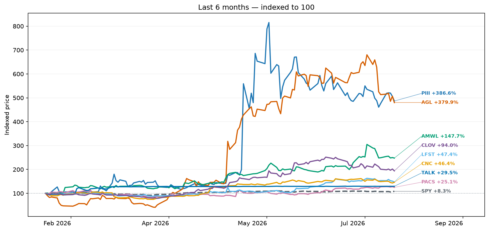

### Last 12 months

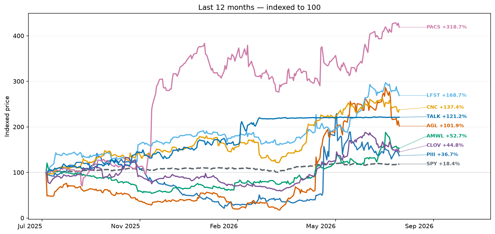

### Last 24 months

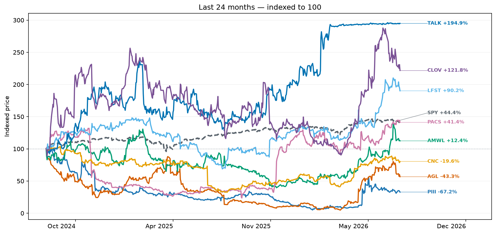

## Current Top Stocks

### Last 3 months

<table class="sortable"><thead><tr><th class="sortable-heading" data-column="0" data-type="number">Rank</th><th class="sortable-heading" data-column="1" data-type="text">Company</th><th class="sortable-heading" data-column="2" data-type="text">Ticker</th><th class="sortable-heading" data-column="3" data-type="number">Market cap</th><th class="sortable-heading" data-column="4" data-type="number">Return</th></tr></thead><tbody><tr><td class="" data-sort="1" style="">1</td><td class="text" data-sort="p3 health" style="">P3 Health</td><td class="text text" data-sort="piii" style=""><a href="#company-piii">PIII</a></td><td class="" data-sort="32693184.14" style="">$32.7M</td><td class="" data-sort="2.35494880546" style="background:#1a7a3c;color:#ffffff;">+235.5%</td></tr><tr><td class="" data-sort="2" style="">2</td><td class="text" data-sort="agilon health" style="">Agilon Health</td><td class="text text" data-sort="agl" style=""><a href="#company-agl">AGL</a></td><td class="" data-sort="2073627800.0" style="">$2.1B</td><td class="" data-sort="2.0970250169" style="background:#1a7a3c;color:#ffffff;">+209.7%</td></tr><tr><td class="" data-sort="3" style="">3</td><td class="text" data-sort="amwell" style="">Amwell</td><td class="text text" data-sort="amwl" style=""><a href="#company-amwl">AMWL</a></td><td class="" data-sort="179616192.25" style="">$179.6M</td><td class="" data-sort="0.756535947712" style="background:#a9d9a4;color:#111820;">+75.7%</td></tr><tr><td class="" data-sort="4" style="">4</td><td class="text" data-sort="oscar health" style="">Oscar Health</td><td class="text text" data-sort="oscr" style=""><a href="#company-oscr">OSCR</a></td><td class="" data-sort="9412611460.0" style="">$9.4B</td><td class="" data-sort="0.6884802596" style="background:#a9d9a4;color:#111820;">+68.8%</td></tr><tr><td class="" data-sort="5" style="">5</td><td class="text" data-sort="davita" style="">Davita</td><td class="text text" data-sort="dva" style=""><a href="#company-dva">DVA</a></td><td class="" data-sort="15410176650.0" style="">$15.4B</td><td class="" data-sort="0.583184965381" style="background:#a9d9a4;color:#111820;">+58.3%</td></tr></tbody></table>

### Last 12 months

<table class="sortable"><thead><tr><th class="sortable-heading" data-column="0" data-type="number">Rank</th><th class="sortable-heading" data-column="1" data-type="text">Company</th><th class="sortable-heading" data-column="2" data-type="text">Ticker</th><th class="sortable-heading" data-column="3" data-type="number">Market cap</th><th class="sortable-heading" data-column="4" data-type="number">Return</th></tr></thead><tbody><tr><td class="" data-sort="1" style="">1</td><td class="text" data-sort="pacs group" style="">PACS Group</td><td class="text text" data-sort="pacs" style=""><a href="#company-pacs">PACS</a></td><td class="" data-sort="7282112019.76" style="">$7.3B</td><td class="" data-sort="3.33239171375" style="background:#1a7a3c;color:#ffffff;">+333.2%</td></tr><tr><td class="" data-sort="2" style="">2</td><td class="text" data-sort="lifestance health" style="">Lifestance Health</td><td class="text text" data-sort="lfst" style=""><a href="#company-lfst">LFST</a></td><td class="" data-sort="4001624847.36" style="">$4.0B</td><td class="" data-sort="1.76517150396" style="background:#7cc077;color:#111820;">+176.5%</td></tr><tr><td class="" data-sort="3" style="">3</td><td class="text" data-sort="centene" style=""><a href="#earnings-cnc">Centene</a></td><td class="text text" data-sort="cnc" style=""><a href="#company-cnc">CNC</a></td><td class="" data-sort="30736368900.0" style="">$30.7B</td><td class="" data-sort="1.40138942493" style="background:#7cc077;color:#111820;">+140.1%</td></tr><tr><td class="" data-sort="4" style="">4</td><td class="text" data-sort="oscar health" style="">Oscar Health</td><td class="text text" data-sort="oscr" style=""><a href="#company-oscr">OSCR</a></td><td class="" data-sort="9412611460.0" style="">$9.4B</td><td class="" data-sort="1.29896907216" style="background:#a9d9a4;color:#111820;">+129.9%</td></tr><tr><td class="" data-sort="5" style="">5</td><td class="text" data-sort="talkspace" style="">Talkspace</td><td class="text text" data-sort="talk" style=""><a href="#company-talk">TALK</a></td><td class="" data-sort="874415594.52" style="">$874.4M</td><td class="" data-sort="1.25974025974" style="background:#a9d9a4;color:#111820;">+126.0%</td></tr></tbody></table>

### Last 24 months

<table class="sortable"><thead><tr><th class="sortable-heading" data-column="0" data-type="number">Rank</th><th class="sortable-heading" data-column="1" data-type="text">Company</th><th class="sortable-heading" data-column="2" data-type="text">Ticker</th><th class="sortable-heading" data-column="3" data-type="number">Market cap</th><th class="sortable-heading" data-column="4" data-type="number">Return</th></tr></thead><tbody><tr><td class="" data-sort="1" style="">1</td><td class="text" data-sort="talkspace" style="">Talkspace</td><td class="text text" data-sort="talk" style=""><a href="#company-talk">TALK</a></td><td class="" data-sort="874415594.52" style="">$874.4M</td><td class="" data-sort="1.94915254237" style="background:#1a7a3c;color:#ffffff;">+194.9%</td></tr><tr><td class="" data-sort="2" style="">2</td><td class="text" data-sort="clover health" style="">Clover Health</td><td class="text text" data-sort="clov" style=""><a href="#company-clov">CLOV</a></td><td class="" data-sort="2196273631.08" style="">$2.2B</td><td class="" data-sort="1.21808510638" style="background:#2f9e44;color:#111820;">+121.8%</td></tr><tr><td class="" data-sort="3" style="">3</td><td class="text" data-sort="lifestance health" style="">Lifestance Health</td><td class="text text" data-sort="lfst" style=""><a href="#company-lfst">LFST</a></td><td class="" data-sort="4001624847.36" style="">$4.0B</td><td class="" data-sort="0.901996370236" style="background:#7cc077;color:#111820;">+90.2%</td></tr><tr><td class="" data-sort="4" style="">4</td><td class="text" data-sort="oscar health" style="">Oscar Health</td><td class="text text" data-sort="oscr" style=""><a href="#company-oscr">OSCR</a></td><td class="" data-sort="9412611460.0" style="">$9.4B</td><td class="" data-sort="0.901339829476" style="background:#7cc077;color:#111820;">+90.1%</td></tr><tr><td class="" data-sort="5" style="">5</td><td class="text" data-sort="consensus cloud solutions" style="">Consensus Cloud Solutions</td><td class="text text" data-sort="ccsi" style=""><a href="#company-ccsi">CCSI</a></td><td class="" data-sort="669685380.0" style="">$669.7M</td><td class="" data-sort="0.895833333333" style="background:#7cc077;color:#111820;">+89.6%</td></tr></tbody></table>

## Companies by Subcategory

<h3 id="category-payers"><a href="#subcategory-performance">Payers</a>Last 3m: +15.6%</h3>

<table class="sortable"><thead><tr><th class="sortable-heading" data-column="0" data-type="text">Company</th><th class="sortable-heading" data-column="1" data-type="text">Ticker</th><th class="sortable-heading" data-column="2" data-type="number">Market cap</th><th class="sortable-heading" data-column="3" data-type="number">3m Return</th><th class="sortable-heading" data-column="4" data-type="number">12m Return</th><th class="sortable-heading" data-column="5" data-type="number">24m Return</th></tr></thead><tbody><tr><td class="text" data-sort="unitedhealth" style="">UnitedHealth</td><td class="text text" data-sort="unh" style=""><a href="#company-unh">UNH</a></td><td class="" data-sort="380076600000.0" style="">$380.1B</td><td class="" data-sort="0.123705190086" style="background:#d6ecd4;color:#111820;">+12.4%</td><td class="" data-sort="0.742860747781" style="background:#7cc077;color:#111820;">+74.3%</td><td class="" data-sort="-0.297424681688" style="background:#f5aead;color:#111820;">-29.7%</td></tr><tr><td class="text" data-sort="cvs health" style="">CVS Health</td><td class="text text" data-sort="cvs" style=""><a href="#company-cvs">CVS</a></td><td class="" data-sort="135133460000.0" style="">$135.1B</td><td class="" data-sort="0.27214033378" style="background:#a9d9a4;color:#111820;">+27.2%</td><td class="" data-sort="0.671682407556" style="background:#7cc077;color:#111820;">+67.2%</td><td class="" data-sort="0.760451786918" style="background:#2f9e44;color:#111820;">+76.0%</td></tr><tr><td class="text" data-sort="humana" style=""><a href="#earnings-hum">Humana</a></td><td class="text text" data-sort="hum" style=""><a href="#company-hum">HUM</a></td><td class="" data-sort="43692420868.9" style="">$43.7B</td><td class="" data-sort="0.557419851903" style="background:#1a7a3c;color:#ffffff;">+55.7%</td><td class="" data-sort="0.471568389549" style="background:#a9d9a4;color:#111820;">+47.2%</td><td class="" data-sort="0.0212467372085" style="background:#d6ecd4;color:#111820;">+2.1%</td></tr><tr><td class="text" data-sort="oscar health" style="">Oscar Health</td><td class="text text" data-sort="oscr" style=""><a href="#company-oscr">OSCR</a></td><td class="" data-sort="9412611460.0" style="">$9.4B</td><td class="" data-sort="0.6884802596" style="background:#1a7a3c;color:#ffffff;">+68.8%</td><td class="" data-sort="1.29896907216" style="background:#1a7a3c;color:#ffffff;">+129.9%</td><td class="" data-sort="0.901339829476" style="background:#2f9e44;color:#111820;">+90.1%</td></tr><tr><td class="text" data-sort="molina healthcare" style="">Molina Healthcare</td><td class="text text" data-sort="moh" style=""><a href="#company-moh">MOH</a></td><td class="" data-sort="10211364000.0" style="">$10.2B</td><td class="" data-sort="0.0151530877011" style="background:#d6ecd4;color:#111820;">+1.5%</td><td class="" data-sort="0.261006897441" style="background:#d6ecd4;color:#111820;">+26.1%</td><td class="" data-sort="-0.43620485921" style="background:#f5aead;color:#111820;">-43.6%</td></tr><tr><td class="text" data-sort="cigna" style=""><a href="#earnings-ci">Cigna</a></td><td class="text text" data-sort="ci" style=""><a href="#company-ci">CI</a></td><td class="" data-sort="73736307618.3" style="">$73.7B</td><td class="" data-sort="-0.013609049134" style="background:#fbd5d4;color:#111820;">-1.4%</td><td class="" data-sort="0.0641421652748" style="background:#d6ecd4;color:#111820;">+6.4%</td><td class="" data-sort="-0.143256270916" style="background:#fbd5d4;color:#111820;">-14.3%</td></tr><tr><td class="text" data-sort="elevance" style="">Elevance</td><td class="text text" data-sort="elv" style=""><a href="#company-elv">ELV</a></td><td class="" data-sort="81508153953.6" style="">$81.5B</td><td class="" data-sort="0.0084791241816" style="background:#d6ecd4;color:#111820;">+0.8%</td><td class="" data-sort="0.368382727736" style="background:#a9d9a4;color:#111820;">+36.8%</td><td class="" data-sort="-0.282049322814" style="background:#f5aead;color:#111820;">-28.2%</td></tr><tr><td class="text" data-sort="clover health" style="">Clover Health</td><td class="text text" data-sort="clov" style=""><a href="#company-clov">CLOV</a></td><td class="" data-sort="2196273631.08" style="">$2.2B</td><td class="" data-sort="0.538745387454" style="background:#2f9e44;color:#111820;">+53.9%</td><td class="" data-sort="0.5" style="background:#a9d9a4;color:#111820;">+50.0%</td><td class="" data-sort="1.21808510638" style="background:#1a7a3c;color:#ffffff;">+121.8%</td></tr><tr><td class="text" data-sort="centene" style=""><a href="#earnings-cnc">Centene</a></td><td class="text text" data-sort="cnc" style=""><a href="#company-cnc">CNC</a></td><td class="" data-sort="30736368900.0" style="">$30.7B</td><td class="" data-sort="0.166479190101" style="background:#a9d9a4;color:#111820;">+16.6%</td><td class="" data-sort="1.40138942493" style="background:#1a7a3c;color:#ffffff;">+140.1%</td><td class="" data-sort="-0.19643549012" style="background:#fbd5d4;color:#111820;">-19.6%</td></tr><tr><td class="text" data-sort="alignment health" style=""><a href="#earnings-alhc">Alignment Health</a></td><td class="text text" data-sort="alhc" style=""><a href="#company-alhc">ALHC</a></td><td class="" data-sort="3080411962.65" style="">$3.1B</td><td class="" data-sort="-0.267028627838" style="background:#f5aead;color:#111820;">-26.7%</td><td class="" data-sort="0.144949884348" style="background:#d6ecd4;color:#111820;">+14.5%</td><td class="" data-sort="0.681766704417" style="background:#7cc077;color:#111820;">+68.2%</td></tr></tbody></table>

<h3 id="category-health-system-providers"><a href="#subcategory-performance">Health System Providers</a>Last 3m: +1.7%</h3>

<table class="sortable"><thead><tr><th class="sortable-heading" data-column="0" data-type="text">Company</th><th class="sortable-heading" data-column="1" data-type="text">Ticker</th><th class="sortable-heading" data-column="2" data-type="number">Market cap</th><th class="sortable-heading" data-column="3" data-type="number">3m Return</th><th class="sortable-heading" data-column="4" data-type="number">12m Return</th><th class="sortable-heading" data-column="5" data-type="number">24m Return</th></tr></thead><tbody><tr><td class="text" data-sort="hca healthcare" style="">HCA Healthcare</td><td class="text text" data-sort="hca" style=""><a href="#company-hca">HCA</a></td><td class="" data-sort="87161338885.0" style="">$87.2B</td><td class="" data-sort="-0.0704241612598" style="background:#fbd5d4;color:#111820;">-7.0%</td><td class="" data-sort="0.127797854161" style="background:#a9d9a4;color:#111820;">+12.8%</td><td class="" data-sort="0.149665886116" style="background:#d6ecd4;color:#111820;">+15.0%</td></tr><tr><td class="text" data-sort="tenet health" style="">Tenet Health</td><td class="text text" data-sort="thc" style=""><a href="#company-thc">THC</a></td><td class="" data-sort="20514630820.0" style="">$20.5B</td><td class="" data-sort="0.390189338135" style="background:#1a7a3c;color:#ffffff;">+39.0%</td><td class="" data-sort="0.611613637801" style="background:#1a7a3c;color:#ffffff;">+61.2%</td><td class="" data-sort="0.757224636182" style="background:#1a7a3c;color:#ffffff;">+75.7%</td></tr><tr><td class="text" data-sort="universal health services" style=""><a href="#earnings-uhs">Universal Health Services</a></td><td class="text text" data-sort="uhs" style=""><a href="#company-uhs">UHS</a></td><td class="" data-sort="10196742962.4" style="">$10.2B</td><td class="" data-sort="0.00862275449102" style="background:#d6ecd4;color:#111820;">+0.9%</td><td class="" data-sort="0.0335010430728" style="background:#d6ecd4;color:#111820;">+3.4%</td><td class="" data-sort="-0.201706161137" style="background:#f5aead;color:#111820;">-20.2%</td></tr></tbody></table>

<h3 id="category-inpatient-non-acute-providers"><a href="#subcategory-performance">Inpatient Non-Acute Providers</a>Last 3m: +9.9%</h3>

<table class="sortable"><thead><tr><th class="sortable-heading" data-column="0" data-type="text">Company</th><th class="sortable-heading" data-column="1" data-type="text">Ticker</th><th class="sortable-heading" data-column="2" data-type="number">Market cap</th><th class="sortable-heading" data-column="3" data-type="number">3m Return</th><th class="sortable-heading" data-column="4" data-type="number">12m Return</th><th class="sortable-heading" data-column="5" data-type="number">24m Return</th></tr></thead><tbody><tr><td class="text" data-sort="the ensign group" style=""><a href="#earnings-ensg">The Ensign Group</a></td><td class="text text" data-sort="ensg" style=""><a href="#company-ensg">ENSG</a></td><td class="" data-sort="10383598441.4" style="">$10.4B</td><td class="" data-sort="-0.0302634443719" style="background:#fbd5d4;color:#111820;">-3.0%</td><td class="" data-sort="0.174036243822" style="background:#d6ecd4;color:#111820;">+17.4%</td><td class="" data-sort="0.298542274052" style="background:#7cc077;color:#111820;">+29.9%</td></tr><tr><td class="text" data-sort="acadia healthcare" style=""><a href="#earnings-achc">Acadia Healthcare</a></td><td class="text text" data-sort="achc" style=""><a href="#company-achc">ACHC</a></td><td class="" data-sort="2757630145.5" style="">$2.8B</td><td class="" data-sort="0.0635547576302" style="background:#d6ecd4;color:#111820;">+6.4%</td><td class="" data-sort="0.404457088668" style="background:#d6ecd4;color:#111820;">+40.4%</td><td class="" data-sort="-0.58293438468" style="background:#c0302f;color:#ffffff;">-58.3%</td></tr><tr><td class="text" data-sort="encompass health" style="">Encompass Health</td><td class="text text" data-sort="ehc" style=""><a href="#company-ehc">EHC</a></td><td class="" data-sort="11018041815.6" style="">$11.0B</td><td class="" data-sort="0.0334015630815" style="background:#d6ecd4;color:#111820;">+3.3%</td><td class="" data-sort="0.0234036671888" style="background:#d6ecd4;color:#111820;">+2.3%</td><td class="" data-sort="0.238652838184" style="background:#7cc077;color:#111820;">+23.9%</td></tr><tr><td class="text" data-sort="pacs group" style="">PACS Group</td><td class="text text" data-sort="pacs" style=""><a href="#company-pacs">PACS</a></td><td class="" data-sort="7282112019.76" style="">$7.3B</td><td class="" data-sort="0.394242424242" style="background:#1a7a3c;color:#ffffff;">+39.4%</td><td class="" data-sort="3.33239171375" style="background:#1a7a3c;color:#ffffff;">+333.2%</td><td class="" data-sort="0.413517665131" style="background:#2f9e44;color:#111820;">+41.4%</td></tr></tbody></table>

<h3 id="category-health-care-real-estate"><a href="#subcategory-performance">Health Care Real Estate</a>Last 3m: +10.5%</h3>

<table class="sortable"><thead><tr><th class="sortable-heading" data-column="0" data-type="text">Company</th><th class="sortable-heading" data-column="1" data-type="text">Ticker</th><th class="sortable-heading" data-column="2" data-type="number">Market cap</th><th class="sortable-heading" data-column="3" data-type="number">3m Return</th><th class="sortable-heading" data-column="4" data-type="number">12m Return</th><th class="sortable-heading" data-column="5" data-type="number">24m Return</th></tr></thead><tbody><tr><td class="text" data-sort="healthpeak properties" style="">Healthpeak properties</td><td class="text text" data-sort="doc" style=""><a href="#company-doc">DOC</a></td><td class="" data-sort="15050032094.7" style="">$15.1B</td><td class="" data-sort="0.329476248477" style="background:#1a7a3c;color:#ffffff;">+32.9%</td><td class="" data-sort="0.301729278473" style="background:#2f9e44;color:#111820;">+30.2%</td><td class="" data-sort="0.0525554484089" style="background:#d6ecd4;color:#111820;">+5.3%</td></tr><tr><td class="text" data-sort="ventas, inc" style=""><a href="#earnings-vtr">Ventas, Inc</a></td><td class="text text" data-sort="vtr" style=""><a href="#company-vtr">VTR</a></td><td class="" data-sort="47965614030.1" style="">$48.0B</td><td class="" data-sort="0.0623721881391" style="background:#d6ecd4;color:#111820;">+6.2%</td><td class="" data-sort="0.385333333333" style="background:#1a7a3c;color:#ffffff;">+38.5%</td><td class="" data-sort="0.679719777259" style="background:#1a7a3c;color:#ffffff;">+68.0%</td></tr><tr><td class="text" data-sort="medical properties trust" style="">Medical Properties Trust</td><td class="text text" data-sort="mpt" style=""><a href="#company-mpt">MPT</a></td><td class="" data-sort="2769203000.0" style="">$2.8B</td><td class="" data-sort="-0.0831683168317" style="background:#f5aead;color:#111820;">-8.3%</td><td class="missing" data-sort="—" style="background:#f0efec;color:#111820;">—</td><td class="missing" data-sort="—" style="background:#f0efec;color:#111820;">—</td></tr><tr><td class="text" data-sort="national health investors" style="">National Health Investors</td><td class="text text" data-sort="nhi" style=""><a href="#company-nhi">NHI</a></td><td class="" data-sort="3715308205.35" style="">$3.7B</td><td class="" data-sort="-0.000782166601486" style="background:#fbd5d4;color:#111820;">-0.1%</td><td class="" data-sort="0.0745829244357" style="background:#d6ecd4;color:#111820;">+7.5%</td><td class="" data-sort="0.0575331125828" style="background:#d6ecd4;color:#111820;">+5.8%</td></tr><tr><td class="text" data-sort="omega healthcare investors" style=""><a href="#earnings-ohi">Omega Healthcare Investors</a></td><td class="text text" data-sort="ohi" style=""><a href="#company-ohi">OHI</a></td><td class="" data-sort="15143989930.0" style="">$15.1B</td><td class="" data-sort="0.0776926351639" style="background:#a9d9a4;color:#111820;">+7.8%</td><td class="" data-sort="0.26733416771" style="background:#2f9e44;color:#111820;">+26.7%</td><td class="" data-sort="0.368378378378" style="background:#7cc077;color:#111820;">+36.8%</td></tr></tbody></table>

<h3 id="category-value-based-care"><a href="#subcategory-performance">Value-Based Care</a>Last 3m: +59.1%</h3>

<table class="sortable"><thead><tr><th class="sortable-heading" data-column="0" data-type="text">Company</th><th class="sortable-heading" data-column="1" data-type="text">Ticker</th><th class="sortable-heading" data-column="2" data-type="number">Market cap</th><th class="sortable-heading" data-column="3" data-type="number">3m Return</th><th class="sortable-heading" data-column="4" data-type="number">12m Return</th><th class="sortable-heading" data-column="5" data-type="number">24m Return</th></tr></thead><tbody><tr><td class="text" data-sort="privia health group" style="">Privia Health Group</td><td class="text text" data-sort="prva" style=""><a href="#company-prva">PRVA</a></td><td class="" data-sort="2982712892.58" style="">$3.0B</td><td class="" data-sort="-0.0474849094567" style="background:#fbd5d4;color:#111820;">-4.7%</td><td class="" data-sort="0.255037115589" style="background:#a9d9a4;color:#111820;">+25.5%</td><td class="" data-sort="0.228971962617" style="background:#a9d9a4;color:#111820;">+22.9%</td></tr><tr><td class="text" data-sort="astrana health" style="">Astrana Health</td><td class="text text" data-sort="asth" style=""><a href="#company-asth">ASTH</a></td><td class="" data-sort="1763186344.08" style="">$1.8B</td><td class="" data-sort="0.0192032100889" style="background:#d6ecd4;color:#111820;">+1.9%</td><td class="" data-sort="0.648585999073" style="background:#7cc077;color:#111820;">+64.9%</td><td class="" data-sort="-0.246290801187" style="background:#f5aead;color:#111820;">-24.6%</td></tr><tr><td class="text" data-sort="agilon health" style="">Agilon Health</td><td class="text text" data-sort="agl" style=""><a href="#company-agl">AGL</a></td><td class="" data-sort="2073627800.0" style="">$2.1B</td><td class="" data-sort="2.0970250169" style="background:#1a7a3c;color:#ffffff;">+209.7%</td><td class="" data-sort="1.15552941176" style="background:#1a7a3c;color:#ffffff;">+115.6%</td><td class="" data-sort="-0.422018927445" style="background:#ee8483;color:#111820;">-42.2%</td></tr><tr><td class="text" data-sort="evolent health" style="">Evolent Health</td><td class="text text" data-sort="evh" style=""><a href="#company-evh">EVH</a></td><td class="" data-sort="347566497.03" style="">$347.6M</td><td class="" data-sort="-0.176" style="background:#fbd5d4;color:#111820;">-17.6%</td><td class="" data-sort="-0.690380761523" style="background:#ee8483;color:#111820;">-69.0%</td><td class="" data-sort="-0.853067047076" style="background:#c0302f;color:#ffffff;">-85.3%</td></tr><tr><td class="text" data-sort="p3 health" style="">P3 Health</td><td class="text text" data-sort="piii" style=""><a href="#company-piii">PIII</a></td><td class="" data-sort="32693184.14" style="">$32.7M</td><td class="" data-sort="2.35494880546" style="background:#1a7a3c;color:#ffffff;">+235.5%</td><td class="" data-sort="0.337414965986" style="background:#a9d9a4;color:#111820;">+33.7%</td><td class="" data-sort="-0.672387935344" style="background:#e34948;color:#111820;">-67.2%</td></tr></tbody></table>

<h3 id="category-outpatient-providers"><a href="#subcategory-performance">Outpatient Providers</a>Last 3m: +34.1%</h3>

<table class="sortable"><thead><tr><th class="sortable-heading" data-column="0" data-type="text">Company</th><th class="sortable-heading" data-column="1" data-type="text">Ticker</th><th class="sortable-heading" data-column="2" data-type="number">Market cap</th><th class="sortable-heading" data-column="3" data-type="number">3m Return</th><th class="sortable-heading" data-column="4" data-type="number">12m Return</th><th class="sortable-heading" data-column="5" data-type="number">24m Return</th></tr></thead><tbody><tr><td class="text" data-sort="davita" style="">Davita</td><td class="text text" data-sort="dva" style=""><a href="#company-dva">DVA</a></td><td class="" data-sort="15410176650.0" style="">$15.4B</td><td class="" data-sort="0.583184965381" style="background:#1a7a3c;color:#ffffff;">+58.3%</td><td class="" data-sort="0.733752166378" style="background:#7cc077;color:#111820;">+73.4%</td><td class="" data-sort="0.77305959678" style="background:#1a7a3c;color:#ffffff;">+77.3%</td></tr><tr><td class="text" data-sort="fresenius" style="">Fresenius</td><td class="text text" data-sort="fms" style=""><a href="#company-fms">FMS</a></td><td class="" data-sort="13782736811.6" style="">$13.8B</td><td class="" data-sort="0.140951534015" style="background:#a9d9a4;color:#111820;">+14.1%</td><td class="" data-sort="0.0210903302825" style="background:#d6ecd4;color:#111820;">+2.1%</td><td class="" data-sort="0.367075119872" style="background:#7cc077;color:#111820;">+36.7%</td></tr><tr><td class="text" data-sort="surgery partners" style="">Surgery Partners</td><td class="text text" data-sort="sgry" style=""><a href="#company-sgry">SGRY</a></td><td class="" data-sort="2014137694.8" style="">$2.0B</td><td class="" data-sort="0.0791871058164" style="background:#d6ecd4;color:#111820;">+7.9%</td><td class="" data-sort="-0.276315789474" style="background:#fbd5d4;color:#111820;">-27.6%</td><td class="" data-sort="-0.463788300836" style="background:#ee8483;color:#111820;">-46.4%</td></tr><tr><td class="text" data-sort="option care health" style=""><a href="#earnings-opch">Option Care Health</a></td><td class="text text" data-sort="opch" style=""><a href="#company-opch">OPCH</a></td><td class="" data-sort="3449554146.29" style="">$3.4B</td><td class="" data-sort="0.149775336995" style="background:#a9d9a4;color:#111820;">+15.0%</td><td class="" data-sort="-0.185067232838" style="background:#fbd5d4;color:#111820;">-18.5%</td><td class="" data-sort="-0.224317952172" style="background:#f5aead;color:#111820;">-22.4%</td></tr><tr><td class="text" data-sort="lifestance health" style="">Lifestance Health</td><td class="text text" data-sort="lfst" style=""><a href="#company-lfst">LFST</a></td><td class="" data-sort="4001624847.36" style="">$4.0B</td><td class="" data-sort="0.39176626826" style="background:#2f9e44;color:#111820;">+39.2%</td><td class="" data-sort="1.76517150396" style="background:#1a7a3c;color:#ffffff;">+176.5%</td><td class="" data-sort="0.901996370236" style="background:#1a7a3c;color:#ffffff;">+90.2%</td></tr></tbody></table>

<h3 id="category-digital-health"><a href="#subcategory-performance">Digital Health</a>Last 3m: +7.1%</h3>

<table class="sortable"><thead><tr><th class="sortable-heading" data-column="0" data-type="text">Company</th><th class="sortable-heading" data-column="1" data-type="text">Ticker</th><th class="sortable-heading" data-column="2" data-type="number">Market cap</th><th class="sortable-heading" data-column="3" data-type="number">3m Return</th><th class="sortable-heading" data-column="4" data-type="number">12m Return</th><th class="sortable-heading" data-column="5" data-type="number">24m Return</th></tr></thead><tbody><tr><td class="text" data-sort="teladoc" style=""><a href="#earnings-tdoc">Teladoc</a></td><td class="text text" data-sort="tdoc" style=""><a href="#company-tdoc">TDOC</a></td><td class="" data-sort="1219099780.91" style="">$1.2B</td><td class="" data-sort="0.0386996904025" style="background:#d6ecd4;color:#111820;">+3.9%</td><td class="" data-sort="-0.0331412103746" style="background:#fbd5d4;color:#111820;">-3.3%</td><td class="" data-sort="-0.117105263158" style="background:#fbd5d4;color:#111820;">-11.7%</td></tr><tr><td class="text" data-sort="amwell" style="">Amwell</td><td class="text text" data-sort="amwl" style=""><a href="#company-amwl">AMWL</a></td><td class="" data-sort="179616192.25" style="">$179.6M</td><td class="" data-sort="0.756535947712" style="background:#1a7a3c;color:#ffffff;">+75.7%</td><td class="" data-sort="0.533523537803" style="background:#7cc077;color:#111820;">+53.4%</td><td class="" data-sort="0.124476987448" style="background:#d6ecd4;color:#111820;">+12.4%</td></tr><tr><td class="text" data-sort="talkspace" style="">Talkspace</td><td class="text text" data-sort="talk" style=""><a href="#company-talk">TALK</a></td><td class="" data-sort="874415594.52" style="">$874.4M</td><td class="" data-sort="0.00578034682081" style="background:#d6ecd4;color:#111820;">+0.6%</td><td class="" data-sort="1.25974025974" style="background:#1a7a3c;color:#ffffff;">+126.0%</td><td class="" data-sort="1.94915254237" style="background:#1a7a3c;color:#ffffff;">+194.9%</td></tr><tr><td class="text" data-sort="hims &amp; hers" style="">Hims &amp; Hers</td><td class="text text" data-sort="hims" style=""><a href="#company-hims">HIMS</a></td><td class="" data-sort="6427580190.15" style="">$6.4B</td><td class="" data-sort="0.0131338927399" style="background:#d6ecd4;color:#111820;">+1.3%</td><td class="" data-sort="-0.556035171863" style="background:#ee8483;color:#111820;">-55.6%</td><td class="" data-sort="0.556614349776" style="background:#a9d9a4;color:#111820;">+55.7%</td></tr><tr><td class="text" data-sort="lifemd" style="">LifeMD</td><td class="text text" data-sort="lfmd" style=""><a href="#company-lfmd">LFMD</a></td><td class="" data-sort="169268785.0" style="">$169.3M</td><td class="" data-sort="-0.3" style="background:#f5aead;color:#111820;">-30.0%</td><td class="" data-sort="-0.647887323944" style="background:#ee8483;color:#111820;">-64.8%</td><td class="" data-sort="-0.414715719064" style="background:#f5aead;color:#111820;">-41.5%</td></tr><tr><td class="text" data-sort="omada health" style="">Omada Health</td><td class="text text" data-sort="omda" style=""><a href="#company-omda">OMDA</a></td><td class="" data-sort="1179458378.88" style="">$1.2B</td><td class="" data-sort="0.297580117724" style="background:#a9d9a4;color:#111820;">+29.8%</td><td class="" data-sort="0.141542002301" style="background:#d6ecd4;color:#111820;">+14.2%</td><td class="missing" data-sort="—" style="background:#f0efec;color:#111820;">—</td></tr><tr><td class="text" data-sort="goodrx" style="">GoodRx</td><td class="text text" data-sort="gdrx" style=""><a href="#company-gdrx">GDRX</a></td><td class="" data-sort="1039733395.11" style="">$1.0B</td><td class="" data-sort="0.203921568627" style="background:#a9d9a4;color:#111820;">+20.4%</td><td class="" data-sort="-0.32229580574" style="background:#f5aead;color:#111820;">-32.2%</td><td class="" data-sort="-0.627878787879" style="background:#f5aead;color:#111820;">-62.8%</td></tr></tbody></table>

<h3 id="category-health-it-and-data"><a href="#subcategory-performance">Health IT and Data</a>Last 3m: -13.4%</h3>

<table class="sortable"><thead><tr><th class="sortable-heading" data-column="0" data-type="text">Company</th><th class="sortable-heading" data-column="1" data-type="text">Ticker</th><th class="sortable-heading" data-column="2" data-type="number">Market cap</th><th class="sortable-heading" data-column="3" data-type="number">3m Return</th><th class="sortable-heading" data-column="4" data-type="number">12m Return</th><th class="sortable-heading" data-column="5" data-type="number">24m Return</th></tr></thead><tbody><tr><td class="text" data-sort="oracle-cerner" style="">Oracle-Cerner</td><td class="text text" data-sort="orcl" style=""><a href="#company-orcl">ORCL</a></td><td class="" data-sort="374086768770.0" style="">$374.1B</td><td class="" data-sort="-0.244194843741" style="background:#ee8483;color:#111820;">-24.4%</td><td class="" data-sort="-0.468660502414" style="background:#ee8483;color:#111820;">-46.9%</td><td class="" data-sort="0.015720319099" style="background:#d6ecd4;color:#111820;">+1.6%</td></tr><tr><td class="text" data-sort="veradigm" style="">Veradigm</td><td class="text text" data-sort="mdrx" style=""><a href="#company-mdrx">MDRX</a></td><td class="" data-sort="n/a" style="">n/a</td><td class="" data-sort="-0.0103092783505" style="background:#fbd5d4;color:#111820;">-1.0%</td><td class="" data-sort="-0.0103092783505" style="background:#fbd5d4;color:#111820;">-1.0%</td><td class="" data-sort="-0.48772678762" style="background:#ee8483;color:#111820;">-48.8%</td></tr><tr><td class="text" data-sort="waystar" style=""><a href="#earnings-way">Waystar</a></td><td class="text text" data-sort="way" style=""><a href="#company-way">WAY</a></td><td class="" data-sort="4047809061.76" style="">$4.0B</td><td class="" data-sort="0.00763723150358" style="background:#d6ecd4;color:#111820;">+0.8%</td><td class="" data-sort="-0.406855858387" style="background:#ee8483;color:#111820;">-40.7%</td><td class="" data-sort="-0.0217794253939" style="background:#fbd5d4;color:#111820;">-2.2%</td></tr><tr><td class="text" data-sort="solventum" style="">Solventum</td><td class="text text" data-sort="solv" style=""><a href="#company-solv">SOLV</a></td><td class="" data-sort="13571702000.0" style="">$13.6B</td><td class="" data-sort="0.282305267897" style="background:#7cc077;color:#111820;">+28.2%</td><td class="" data-sort="0.19113341698" style="background:#a9d9a4;color:#111820;">+19.1%</td><td class="" data-sort="0.490839295062" style="background:#7cc077;color:#111820;">+49.1%</td></tr><tr><td class="text" data-sort="phreesia" style="">Phreesia</td><td class="text text" data-sort="phr" style=""><a href="#company-phr">PHR</a></td><td class="" data-sort="663241568.97" style="">$663.2M</td><td class="" data-sort="0.10961737332" style="background:#a9d9a4;color:#111820;">+11.0%</td><td class="" data-sort="-0.592634776006" style="background:#e34948;color:#111820;">-59.3%</td><td class="" data-sort="-0.52731277533" style="background:#ee8483;color:#111820;">-52.7%</td></tr><tr><td class="text" data-sort="consensus cloud solutions" style="">Consensus Cloud Solutions</td><td class="text text" data-sort="ccsi" style=""><a href="#company-ccsi">CCSI</a></td><td class="" data-sort="669685380.0" style="">$669.7M</td><td class="" data-sort="0.325564457393" style="background:#2f9e44;color:#111820;">+32.6%</td><td class="" data-sort="0.851475076297" style="background:#1a7a3c;color:#ffffff;">+85.1%</td><td class="" data-sort="0.895833333333" style="background:#1a7a3c;color:#ffffff;">+89.6%</td></tr><tr><td class="text" data-sort="definitive healthcare" style="">Definitive Healthcare</td><td class="text text" data-sort="dh" style=""><a href="#company-dh">DH</a></td><td class="" data-sort="85548500.0" style="">$85.5M</td><td class="" data-sort="-0.308152504563" style="background:#e34948;color:#111820;">-30.8%</td><td class="" data-sort="-0.81756684492" style="background:#c0302f;color:#ffffff;">-81.8%</td><td class="" data-sort="-0.815594594595" style="background:#c0302f;color:#ffffff;">-81.6%</td></tr><tr><td class="text" data-sort="iqvia" style=""><a href="#earnings-iqv">Iqvia</a></td><td class="text text" data-sort="iqv" style=""><a href="#company-iqv">IQV</a></td><td class="" data-sort="38684292000.0" style="">$38.7B</td><td class="" data-sort="0.489636813082" style="background:#1a7a3c;color:#ffffff;">+49.0%</td><td class="" data-sort="0.28813373527" style="background:#a9d9a4;color:#111820;">+28.8%</td><td class="" data-sort="0.00586347100364" style="background:#d6ecd4;color:#111820;">+0.6%</td></tr><tr><td class="text" data-sort="health catalyst" style="">Health Catalyst</td><td class="text text" data-sort="hcat" style=""><a href="#company-hcat">HCAT</a></td><td class="" data-sort="154438501.8" style="">$154.4M</td><td class="" data-sort="0.441379310345" style="background:#1a7a3c;color:#ffffff;">+44.1%</td><td class="" data-sort="-0.40625" style="background:#ee8483;color:#111820;">-40.6%</td><td class="" data-sort="-0.652823920266" style="background:#e34948;color:#111820;">-65.3%</td></tr><tr><td class="text" data-sort="doximity" style="">Doximity</td><td class="text text" data-sort="docs" style=""><a href="#company-docs">DOCS</a></td><td class="" data-sort="3812680930.62" style="">$3.8B</td><td class="" data-sort="-0.162930344275" style="background:#f5aead;color:#111820;">-16.3%</td><td class="" data-sort="-0.635269492412" style="background:#e34948;color:#111820;">-63.5%</td><td class="" data-sort="-0.195459792228" style="background:#f5aead;color:#111820;">-19.5%</td></tr><tr><td class="text" data-sort="veeva systems" style="">Veeva Systems</td><td class="text text" data-sort="veev" style=""><a href="#company-veev">VEEV</a></td><td class="" data-sort="33102693840.0" style="">$33.1B</td><td class="" data-sort="0.187529137529" style="background:#a9d9a4;color:#111820;">+18.8%</td><td class="" data-sort="-0.275706415497" style="background:#f5aead;color:#111820;">-27.6%</td><td class="" data-sort="0.0987221653098" style="background:#d6ecd4;color:#111820;">+9.9%</td></tr></tbody></table>

## Upcoming Earnings

### Payers

<table class="sortable"><thead><tr><th class="sortable-heading" data-column="0" data-type="text">Company</th><th class="sortable-heading" data-column="1" data-type="text">Ticker</th><th class="sortable-heading" data-column="2" data-type="text">Date</th><th class="sortable-heading" data-column="3" data-type="number">Market cap</th><th class="sortable-heading" data-column="4" data-type="number">3m Return</th><th class="sortable-heading" data-column="5" data-type="number">12m Return</th></tr></thead><tbody><tr><td class="text" data-sort="cvs health" style="">CVS Health</td><td class="text text" data-sort="cvs" style=""><a href="#company-cvs">CVS</a></td><td class="text" data-sort="2026-08-05" style="">August 5, 2026</td><td class="" data-sort="135133460000.0" style="">$135.1B</td><td class="" data-sort="0.27214033378" style="background:#a9d9a4;color:#111820;">+27.2%</td><td class="" data-sort="0.671682407556" style="background:#7cc077;color:#111820;">+67.2%</td></tr><tr><td class="text" data-sort="oscar health" style="">Oscar Health</td><td class="text text" data-sort="oscr" style=""><a href="#company-oscr">OSCR</a></td><td class="text" data-sort="2026-08-06" style="">August 6, 2026</td><td class="" data-sort="9412611460.0" style="">$9.4B</td><td class="" data-sort="0.6884802596" style="background:#1a7a3c;color:#ffffff;">+68.8%</td><td class="" data-sort="1.29896907216" style="background:#1a7a3c;color:#ffffff;">+129.9%</td></tr><tr><td class="text" data-sort="clover health" style="">Clover Health</td><td class="text text" data-sort="clov" style=""><a href="#company-clov">CLOV</a></td><td class="text" data-sort="2026-08-05" style="">August 5, 2026</td><td class="" data-sort="2196273631.08" style="">$2.2B</td><td class="" data-sort="0.538745387454" style="background:#2f9e44;color:#111820;">+53.9%</td><td class="" data-sort="0.5" style="background:#a9d9a4;color:#111820;">+50.0%</td></tr></tbody></table>

### Inpatient Non-Acute Providers

<table class="sortable"><thead><tr><th class="sortable-heading" data-column="0" data-type="text">Company</th><th class="sortable-heading" data-column="1" data-type="text">Ticker</th><th class="sortable-heading" data-column="2" data-type="text">Date</th><th class="sortable-heading" data-column="3" data-type="number">Market cap</th><th class="sortable-heading" data-column="4" data-type="number">3m Return</th><th class="sortable-heading" data-column="5" data-type="number">12m Return</th></tr></thead><tbody><tr><td class="text" data-sort="encompass health" style="">Encompass Health</td><td class="text text" data-sort="ehc" style=""><a href="#company-ehc">EHC</a></td><td class="text" data-sort="2026-08-06" style="">August 6, 2026</td><td class="" data-sort="11018041815.6" style="">$11.0B</td><td class="" data-sort="0.0334015630815" style="background:#d6ecd4;color:#111820;">+3.3%</td><td class="" data-sort="0.0234036671888" style="background:#d6ecd4;color:#111820;">+2.3%</td></tr><tr><td class="text" data-sort="pacs group" style="">PACS Group</td><td class="text text" data-sort="pacs" style=""><a href="#company-pacs">PACS</a></td><td class="text" data-sort="2026-08-05" style="">August 5, 2026</td><td class="" data-sort="7282112019.76" style="">$7.3B</td><td class="" data-sort="0.394242424242" style="background:#1a7a3c;color:#ffffff;">+39.4%</td><td class="" data-sort="3.33239171375" style="background:#1a7a3c;color:#ffffff;">+333.2%</td></tr></tbody></table>

### Health Care Real Estate

<table class="sortable"><thead><tr><th class="sortable-heading" data-column="0" data-type="text">Company</th><th class="sortable-heading" data-column="1" data-type="text">Ticker</th><th class="sortable-heading" data-column="2" data-type="text">Date</th><th class="sortable-heading" data-column="3" data-type="number">Market cap</th><th class="sortable-heading" data-column="4" data-type="number">3m Return</th><th class="sortable-heading" data-column="5" data-type="number">12m Return</th></tr></thead><tbody><tr><td class="text" data-sort="healthpeak properties" style="">Healthpeak properties</td><td class="text text" data-sort="doc" style=""><a href="#company-doc">DOC</a></td><td class="text" data-sort="2026-08-05" style="">August 5, 2026</td><td class="" data-sort="15050032094.7" style="">$15.1B</td><td class="" data-sort="0.329476248477" style="background:#1a7a3c;color:#ffffff;">+32.9%</td><td class="" data-sort="0.301729278473" style="background:#1a7a3c;color:#ffffff;">+30.2%</td></tr><tr><td class="text" data-sort="medical properties trust" style="">Medical Properties Trust</td><td class="text text" data-sort="mpt" style=""><a href="#company-mpt">MPT</a></td><td class="text" data-sort="2026-08-10" style="">August 10, 2026</td><td class="" data-sort="2769203000.0" style="">$2.8B</td><td class="" data-sort="-0.0831683168317" style="background:#f5aead;color:#111820;">-8.3%</td><td class="missing" data-sort="—" style="background:#f0efec;color:#111820;">—</td></tr></tbody></table>

### Value-Based Care

<table class="sortable"><thead><tr><th class="sortable-heading" data-column="0" data-type="text">Company</th><th class="sortable-heading" data-column="1" data-type="text">Ticker</th><th class="sortable-heading" data-column="2" data-type="text">Date</th><th class="sortable-heading" data-column="3" data-type="number">Market cap</th><th class="sortable-heading" data-column="4" data-type="number">3m Return</th><th class="sortable-heading" data-column="5" data-type="number">12m Return</th></tr></thead><tbody><tr><td class="text" data-sort="privia health group" style="">Privia Health Group</td><td class="text text" data-sort="prva" style=""><a href="#company-prva">PRVA</a></td><td class="text" data-sort="2026-08-06" style="">August 6, 2026</td><td class="" data-sort="2982712892.58" style="">$3.0B</td><td class="" data-sort="-0.0474849094567" style="background:#fbd5d4;color:#111820;">-4.7%</td><td class="" data-sort="0.255037115589" style="background:#a9d9a4;color:#111820;">+25.5%</td></tr><tr><td class="text" data-sort="agilon health" style="">Agilon Health</td><td class="text text" data-sort="agl" style=""><a href="#company-agl">AGL</a></td><td class="text" data-sort="2026-08-05" style="">August 5, 2026</td><td class="" data-sort="2073627800.0" style="">$2.1B</td><td class="" data-sort="2.0970250169" style="background:#1a7a3c;color:#ffffff;">+209.7%</td><td class="" data-sort="1.15552941176" style="background:#1a7a3c;color:#ffffff;">+115.6%</td></tr><tr><td class="text" data-sort="evolent health" style="">Evolent Health</td><td class="text text" data-sort="evh" style=""><a href="#company-evh">EVH</a></td><td class="text" data-sort="2026-08-06" style="">August 6, 2026</td><td class="" data-sort="347566497.03" style="">$347.6M</td><td class="" data-sort="-0.176" style="background:#fbd5d4;color:#111820;">-17.6%</td><td class="" data-sort="-0.690380761523" style="background:#ee8483;color:#111820;">-69.0%</td></tr></tbody></table>

### Outpatient Providers

<table class="sortable"><thead><tr><th class="sortable-heading" data-column="0" data-type="text">Company</th><th class="sortable-heading" data-column="1" data-type="text">Ticker</th><th class="sortable-heading" data-column="2" data-type="text">Date</th><th class="sortable-heading" data-column="3" data-type="number">Market cap</th><th class="sortable-heading" data-column="4" data-type="number">3m Return</th><th class="sortable-heading" data-column="5" data-type="number">12m Return</th></tr></thead><tbody><tr><td class="text" data-sort="davita" style="">Davita</td><td class="text text" data-sort="dva" style=""><a href="#company-dva">DVA</a></td><td class="text" data-sort="2026-08-04" style="">August 4, 2026</td><td class="" data-sort="15410176650.0" style="">$15.4B</td><td class="" data-sort="0.583184965381" style="background:#1a7a3c;color:#ffffff;">+58.3%</td><td class="" data-sort="0.733752166378" style="background:#7cc077;color:#111820;">+73.4%</td></tr><tr><td class="text" data-sort="lifestance health" style="">Lifestance Health</td><td class="text text" data-sort="lfst" style=""><a href="#company-lfst">LFST</a></td><td class="text" data-sort="2026-08-06" style="">August 6, 2026</td><td class="" data-sort="4001624847.36" style="">$4.0B</td><td class="" data-sort="0.39176626826" style="background:#2f9e44;color:#111820;">+39.2%</td><td class="" data-sort="1.76517150396" style="background:#1a7a3c;color:#ffffff;">+176.5%</td></tr><tr><td class="text" data-sort="surgery partners" style="">Surgery Partners</td><td class="text text" data-sort="sgry" style=""><a href="#company-sgry">SGRY</a></td><td class="text" data-sort="2026-08-10" style="">August 10, 2026</td><td class="" data-sort="2014137694.8" style="">$2.0B</td><td class="" data-sort="0.0791871058164" style="background:#d6ecd4;color:#111820;">+7.9%</td><td class="" data-sort="-0.276315789474" style="background:#fbd5d4;color:#111820;">-27.6%</td></tr></tbody></table>

### Digital Health

<table class="sortable"><thead><tr><th class="sortable-heading" data-column="0" data-type="text">Company</th><th class="sortable-heading" data-column="1" data-type="text">Ticker</th><th class="sortable-heading" data-column="2" data-type="text">Date</th><th class="sortable-heading" data-column="3" data-type="number">Market cap</th><th class="sortable-heading" data-column="4" data-type="number">3m Return</th><th class="sortable-heading" data-column="5" data-type="number">12m Return</th></tr></thead><tbody><tr><td class="text" data-sort="hims &amp; hers" style="">Hims &amp; Hers</td><td class="text text" data-sort="hims" style=""><a href="#company-hims">HIMS</a></td><td class="text" data-sort="2026-08-10" style="">August 10, 2026</td><td class="" data-sort="6427580190.15" style="">$6.4B</td><td class="" data-sort="0.0131338927399" style="background:#d6ecd4;color:#111820;">+1.3%</td><td class="" data-sort="-0.556035171863" style="background:#c0302f;color:#ffffff;">-55.6%</td></tr><tr><td class="text" data-sort="omada health" style="">Omada Health</td><td class="text text" data-sort="omda" style=""><a href="#company-omda">OMDA</a></td><td class="text" data-sort="2026-08-06" style="">August 6, 2026</td><td class="" data-sort="1179458378.88" style="">$1.2B</td><td class="" data-sort="0.297580117724" style="background:#a9d9a4;color:#111820;">+29.8%</td><td class="" data-sort="0.141542002301" style="background:#a9d9a4;color:#111820;">+14.2%</td></tr><tr><td class="text" data-sort="goodrx" style="">GoodRx</td><td class="text text" data-sort="gdrx" style=""><a href="#company-gdrx">GDRX</a></td><td class="text" data-sort="2026-08-06" style="">August 6, 2026</td><td class="" data-sort="1039733395.11" style="">$1.0B</td><td class="" data-sort="0.203921568627" style="background:#a9d9a4;color:#111820;">+20.4%</td><td class="" data-sort="-0.32229580574" style="background:#ee8483;color:#111820;">-32.2%</td></tr><tr><td class="text" data-sort="amwell" style="">Amwell</td><td class="text text" data-sort="amwl" style=""><a href="#company-amwl">AMWL</a></td><td class="text" data-sort="2026-08-04" style="">August 4, 2026</td><td class="" data-sort="179616192.25" style="">$179.6M</td><td class="" data-sort="0.756535947712" style="background:#1a7a3c;color:#ffffff;">+75.7%</td><td class="" data-sort="0.533523537803" style="background:#1a7a3c;color:#ffffff;">+53.4%</td></tr></tbody></table>

### Health IT and Data

<table class="sortable"><thead><tr><th class="sortable-heading" data-column="0" data-type="text">Company</th><th class="sortable-heading" data-column="1" data-type="text">Ticker</th><th class="sortable-heading" data-column="2" data-type="text">Date</th><th class="sortable-heading" data-column="3" data-type="number">Market cap</th><th class="sortable-heading" data-column="4" data-type="number">3m Return</th><th class="sortable-heading" data-column="5" data-type="number">12m Return</th></tr></thead><tbody><tr><td class="text" data-sort="solventum" style="">Solventum</td><td class="text text" data-sort="solv" style=""><a href="#company-solv">SOLV</a></td><td class="text" data-sort="2026-08-05" style="">August 5, 2026</td><td class="" data-sort="13571702000.0" style="">$13.6B</td><td class="" data-sort="0.282305267897" style="background:#2f9e44;color:#111820;">+28.2%</td><td class="" data-sort="0.19113341698" style="background:#a9d9a4;color:#111820;">+19.1%</td></tr><tr><td class="text" data-sort="doximity" style="">Doximity</td><td class="text text" data-sort="docs" style=""><a href="#company-docs">DOCS</a></td><td class="text" data-sort="2026-08-06" style="">August 6, 2026</td><td class="" data-sort="3812680930.62" style="">$3.8B</td><td class="" data-sort="-0.162930344275" style="background:#f5aead;color:#111820;">-16.3%</td><td class="" data-sort="-0.635269492412" style="background:#e34948;color:#111820;">-63.5%</td></tr><tr><td class="text" data-sort="consensus cloud solutions" style="">Consensus Cloud Solutions</td><td class="text text" data-sort="ccsi" style=""><a href="#company-ccsi">CCSI</a></td><td class="text" data-sort="2026-08-06" style="">August 6, 2026</td><td class="" data-sort="669685380.0" style="">$669.7M</td><td class="" data-sort="0.325564457393" style="background:#2f9e44;color:#111820;">+32.6%</td><td class="" data-sort="0.851475076297" style="background:#1a7a3c;color:#ffffff;">+85.1%</td></tr><tr><td class="text" data-sort="health catalyst" style="">Health Catalyst</td><td class="text text" data-sort="hcat" style=""><a href="#company-hcat">HCAT</a></td><td class="text" data-sort="2026-08-06" style="">August 6, 2026</td><td class="" data-sort="154438501.8" style="">$154.4M</td><td class="" data-sort="0.441379310345" style="background:#1a7a3c;color:#ffffff;">+44.1%</td><td class="" data-sort="-0.40625" style="background:#ee8483;color:#111820;">-40.6%</td></tr><tr><td class="text" data-sort="definitive healthcare" style="">Definitive Healthcare</td><td class="text text" data-sort="dh" style=""><a href="#company-dh">DH</a></td><td class="text" data-sort="2026-08-10" style="">August 10, 2026</td><td class="" data-sort="85548500.0" style="">$85.5M</td><td class="" data-sort="-0.308152504563" style="background:#e34948;color:#111820;">-30.8%</td><td class="" data-sort="-0.81756684492" style="background:#c0302f;color:#ffffff;">-81.8%</td></tr></tbody></table>

## Recent Earnings Highlights — 3m Ret

Companies covered in this section:
<ul class="section-jump-list">
<li><a href="#earnings-ci">Cigna (CI)</a></li>
<li><a href="#earnings-vtr">Ventas, Inc (VTR)</a></li>
<li><a href="#earnings-hum">Humana (HUM)</a></li>
<li><a href="#earnings-iqv">Iqvia (IQV)</a></li>
<li><a href="#earnings-cnc">Centene (CNC)</a></li>
<li><a href="#earnings-ohi">Omega Healthcare Investors (OHI)</a></li>
<li><a href="#earnings-ensg">The Ensign Group (ENSG)</a></li>
<li><a href="#earnings-uhs">Universal Health Services (UHS)</a></li>
<li><a href="#earnings-way">Waystar (WAY)</a></li>
<li><a href="#earnings-opch">Option Care Health (OPCH)</a></li>
<li><a href="#earnings-alhc">Alignment Health (ALHC)</a></li>
<li><a href="#earnings-achc">Acadia Healthcare (ACHC)</a></li>
<li><a href="#earnings-tdoc">Teladoc (TDOC)</a></li>
</ul>
<h3 id="earnings-ci">Cigna (CI) -1.4%</h3>

**Reported:** July 30, 2026 · [Google Finance earnings page](https://www.google.com/finance/quote/CI:NYSE?tab=earnings&hl=en)

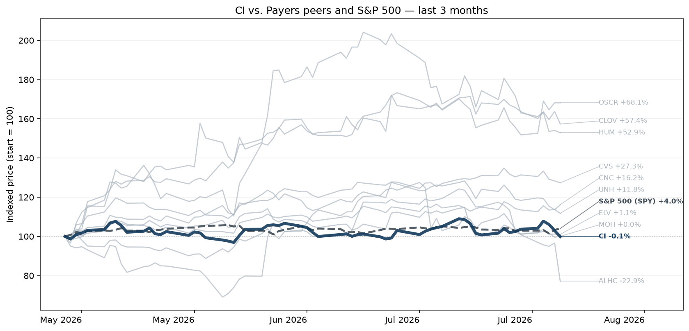

#### Earnings Call Summary

The Cigna Group reported Q2 2026 total revenues of $71.7 billion and adjusted earnings per share of $7.78, beating expectations. Driven by strong execution in both Evernorth and Cigna Healthcare, the company raised its full-year 2026 adjusted EPS guidance to at least $30.45.

#### At a Glance

- **Cigna Beats EPS and Revenue Estimates:** The Cigna Group reported Q2 2026 adjusted EPS of $7.78, beating the estimated $7.60, while revenue reached $71.67 billion, which also came in ahead of the estimated $70.18 billion.
- **Medical Care Ratio Experiences Slight Increase:** Cigna Healthcare recorded a Medical Care Ratio (MCR) of 84.5% for the quarter, an increase from 83.2% in Q2 2025, primarily due to higher prior-year risk-adjustment benefits.
- **Full-Year Adjusted EPS Guidance Raised:** Cigna raised its full-year 2026 adjusted income from operations outlook to at least $30.45 per share, representing an increase from its prior projections.
- **Strong Segment Revenue Across Subsidiaries:** Evernorth Health Services revenue increased 6% year-over-year to $61.5 billion, while Cigna Healthcare revenues rose 10% to $11.8 billion, driven by premium rate increases and specialty drug volumes.
- **Premarket Shares Dip Despite Outperformance:** Despite beating expectations on both top and bottom lines, Cigna&#x27;s stock fell in premarket trading as investors focused on details such as moderating GLP-1 utilization growth and second-half business mix.

#### Key Moments from the Call

- **13m 26s — Full-Year 2026 EPS Guidance Raised:** Strong Q2 performance across both core segments gave management the confidence to increase full-year 2026 adjusted EPS guidance to at least $30.45, reassuring investors of business momentum despite a dynamic and elevated medical cost trend environment.
- **25m 13s — Record 2027 PBM Selling Season:** Secured new PBM business for 2027 has already surpassed the total of the prior two selling seasons combined, underscoring strong commercial competitive advantages and robust multi-year client retention tracking in the mid-90s or higher.
- **36m 41s — Evernorth Mix Shift Tailwinds:** Faster than expected penetration of specialty generics and biosimilars created favorable margin mix shifts, driving a 22% pre-tax earnings surge in Specialty and Care Services that offset minor contract renewal headwinds in Pharmacy Benefit Services.
- **37m 33s — GLP-1 Growth Moderation Impact:** Declining employer coverage rates and slowing utilization led to a cooling of GLP-1 volume growth, acting as a modest financial headwind for the PBM business in the back half of 2026 while improving broader plan affordability.
<h3 id="earnings-vtr">Ventas, Inc (VTR) +6.2%</h3>

**Reported:** July 30, 2026 · [Google Finance earnings page](https://www.google.com/finance/quote/VTR:NYSE?tab=earnings&hl=en)

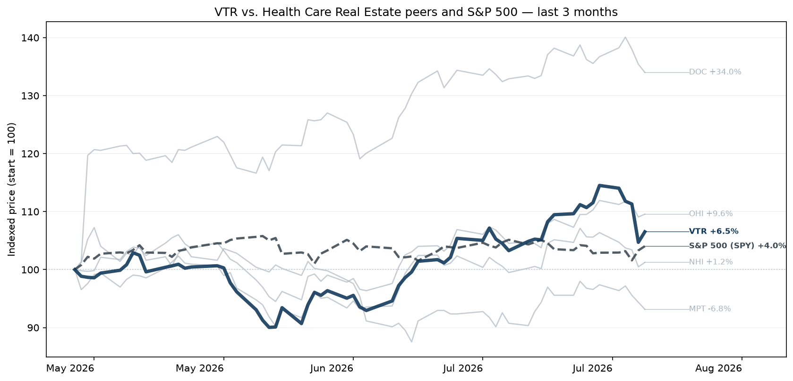

#### Earnings Call Summary

Ventas delivered strong Q2 2026 financial performance, with total company same-property NOI growth at 10% year-over-year. Second-quarter normalized FFO reached $0.97 per share, representing a 9% year-over-year increase, driven by excellent property execution and the successful deployment of the company's 1-2-3 strategy.

#### At a Glance

- **Ventas Beats Revenue, Exceeds EPS:** Ventas reported Q2 2026 revenue of $1.72 billion, beating the estimated $1.69 billion, while reported adjusted EPS came in at $0.14 against the estimated $0.11.
- **SHOP Metrics Drive Record NOI:** The senior housing operating portfolio (SHOP) achieved a 16% year-over-year increase in same-store cash net operating income, supported by a 300 basis point expansion in average occupancy to 90.9%.
- **Full-Year Guidance Extensively Raised:** Ventas increased its 2026 investment guidance significantly to $4.5 billion from $3 billion and lifted its full-year normalized FFO outlook to a range of $3.85 to $3.90 per share.
- **Balance Sheet Reaches Decade Strength:** Leverage improved to 4.7 times net debt to further adjusted EBITDA, representing the company&#x27;s strongest financial position in more than a decade.
- **Post-Earnings Stock Price Declines:** Despite posting strong operating metrics and beating top-line expectations, Ventas common shares fell over 6% following the release as investors weighed valuation limits near its 52-week high.

#### Key Moments from the Call

- **2m 45s — Full-Year FFO and Investment Guidance Boosted:** Management increased full-year normalized FFO guidance to $3.85–$3.90 and sharply raised senior housing investment targets to $4.5 billion, indicating strong deal-making momentum and robust market demand that will delight investors looking for external growth.
- **12m 1s — High-Occupancy Cohorts Prove Thesis:** U.S. senior housing properties with 90% or higher occupancy delivered stunning 25% NOI growth, providing a vital proof point that operating leverage accelerates yields significantly as properties approach stabilization.
- **17m 27s — Leverage Reaches Decade-Low Milestone:** Ventas achieved a net debt to EBITDA ratio of 4.7x, its lowest leverage in over a decade, signaling a highly secure, equity-backed capital structure capable of supporting robust portfolio expansion without financial strain.
- **29m 15s — New Development Remains Unfeasible:** Management clarified that wide-scale new senior housing development remains stalled because current rents must rise 25% to 40% to justify high construction and labor costs, restricting market supply to luxury exceptions.
<h3 id="earnings-hum">Humana (HUM) +55.7%</h3>

**Reported:** July 29, 2026 · [Google Finance earnings page](https://www.google.com/finance/quote/HUM:NYSE?tab=earnings&hl=en)

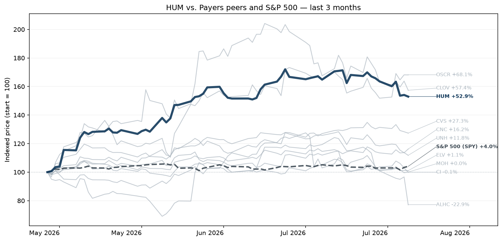

#### Earnings Call Summary

Humana reported Q2 2026 adjusted EPS of $7.61, beating the estimated $6.995, with reported revenue at $40.87 billion versus the estimated $40.53 billion. The company is tracking year-to-date expectations and remains on track to hit its 2028 commitment of returning to a sustainable pre-tax margin of at least 3%.

#### At a Glance

- **Humana Delivers Mixed Financial Results:** Humana reported Q2 2026 Adjusted EPS of $5.73, which missed the estimated Adjusted EPS of $6.995, while reported revenue reached $40.87 billion, beating the estimated $40.53 billion.
- **Strong Individual Medicare Membership Growth:** Humana&#x27;s medical membership expanded significantly, driven by a 23% year-over-year increase in individual Medicare Advantage plan members, outperforming peers during a period of market contraction.
- **Management Affirms Adjusted EPS Guidance:** Humana affirmed its full-year 2026 adjusted financial guidance of at least $9.00 per share, while lowering its GAAP EPS forecast to at least $6.52 from the previous $8.36 estimate.
- **Elevated Insurance Segment Benefit Ratio:** The company&#x27;s Q2 2026 insurance segment medical benefit ratio rose to 91.2% from 89.9% in the prior year period, reflecting persistent medical cost pressures in line with management expectations.
- **Market Deepens on Margin Worries:** Shares of Humana slumped as much as 7% to 10% in trading following the announcement, as investors penalized the lowered GAAP outlook and future margin pressures despite the quarterly revenue beat.
- **Expansion in Core Care Businesses:** The company expanded its healthcare delivery footprints, recording a 27% year-to-date increase in CenterWell Senior Primary Care patients and securing a statewide managed care contract in Illinois.

#### Key Moments from the Call

- **2m 34s — Strong Q2 Earnings Beat and Margin Visibility:** Humana delivered solid Q2 2026 results with EPS of $7.61, beating consensus estimates. Management reiterated confidence in achieving its long-term investor day targets, specifically aiming to recover its individual Medicare Advantage pre-tax margins to at least 3% by 2028 through strict underwriting discipline and plan exits.
- **12m 59s — Massive 2027 Plan Exits Announced:** To prioritize individual MA profitability, Humana announced targeted 2027 plan exits that will impact 600,000 members. Investors will appreciate this focus on protecting higher-margin, value-based care plans, even though it creates near-term volume headwinds, as the company expects to recapture a significant portion of affected members.
- **19m 22s — Inpatient Cost Favorability Supports Stabilizing Trend:** Humana's 2026 all-in medical cost trend is stable within the projected 7% to 8% range, aided by lower inpatient admissions and unit costs. This operational favorability provides reassurance to investors concerned about rising utilization trends, confirming underlying stability in the Medicare Advantage landscape.
- **29m 16s — Innovative Liquidity Management via PCAPS:** Humana became the first health payer to establish $1.5 billion in contingent capital facilities utilizing pre-capitalized trust securities (PCAPS). This structural move expands long-term liquidity and bolsters balance sheet durability without near-term leverage increases, protecting the company against unexpected capital market disruptions.
<h3 id="earnings-iqv">Iqvia (IQV) +49.0%</h3>

**Reported:** July 28, 2026 · [Google Finance earnings page](https://www.google.com/finance/quote/IQV:NYSE?tab=earnings&hl=en)

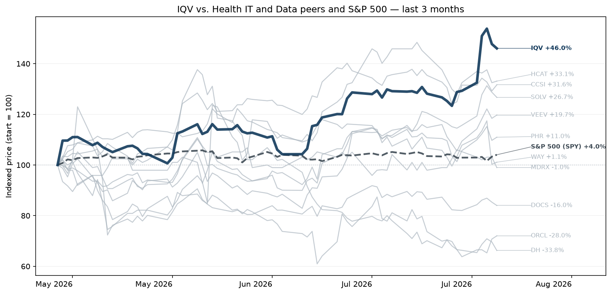

#### Earnings Call Summary

IQVIA delivered strong Q2 2026 results, exceeding guidance with total revenue up 8.7% reported (8.5% at constant currency) to $4.368B. Adjusted EBITDA grew 9.2% year-over-year to $994M, and adjusted diluted EPS increased 12.1% to $3.15, driven entirely by robust operational performance and an acceleration in total company organic growth to 6%.

#### At a Glance

- **IQVIA Tops Estimates for Q2:** IQVIA reported Q2 2026 revenue of $4.368 billion, beating the estimated $4.302 billion, while reported adjusted EPS came in at $1.53 compared to the estimated $3.031.
- **Record R&amp;D Net New Bookings:** The Research &amp; Development Solutions segment achieved record net new bookings of $3.15 billion, jumping 19.3% year-over-year and resulting in a strong 1.22x book-to-bill ratio.
- **Full-Year 2026 Guidance Raised:** Management raised its full-year 2026 revenue guidance to a range of $17.275 billion to $17.475 billion and lifted its adjusted diluted EPS forecast to between $12.80 and $13.00.
- **Commercial Solutions Drives Organic Acceleration:** Commercial Solutions revenue rose 8.6% to $1.793 billion, fueled by a 45% increase in first-half new drug launches and accelerating client adoption of AI solutions.
- **Strong Pre-Market Stock Reaction:** Following the earnings release, IQVIA shares surged 14.34% to $243.81 in pre-market trading, nearing the stock&#x27;s 52-week high.
- **AI Integration Expands Win Rates:** Management highlighted that 19 of the top 20 pharmaceutical companies are now deploying IQVIA&#x27;s AI tools, which act as a key differentiator to secure complex Phase III trial awards.

#### Key Moments from the Call

- **23m 7s — Full-Year 2026 Guidance Raised:** IQVIA raised its full-year guidance across revenue, adjusted EBITDA, and adjusted EPS. The midpoint for revenue growth was increased to 6.5% from 5.8%, driven by a 100-basis-point increase in expected organic revenue growth and a 50-basis-point higher contribution from M&A, outperforming prior foreign exchange tailwinds.
- **28m 11s — Strong Bookings Beat Expectations:** R&D Solutions posted $3.15 billion in net new bookings, hitting a 1.22 book-to-bill ratio. CEO Ari Bousbib highlighted that this growth was clean and broad-based, with normal pass-through and cancellation ranges, contrasting positively against multi-year macro headwinds and displacing large CRO competitors in strategic partnerships.
- **31m 18s — AI Demand Expanding Outsourcing Market:** Management noted that large pharma's extensive use of AI in drug discovery is creating a massive influx of molecules into development. This shift is expanding the clinical outsourcing market, with customers requesting thousands of additional FTEs to manage doubled study portfolios in specialized, adjacent therapeutic areas.
- **51m 18s — Backlog Quality and Lower Inactive Trials:** Addressing investor concerns regarding competitor backlog quality, management reassured analysts that IQVIA maintains a strict contracted bookings policy requiring signatures. A preliminary review indicated that potential backlog adjustments for inactive trials would be around 5%, significantly lower than the 15% to 16% metrics reported by peers.
<h3 id="earnings-cnc">Centene (CNC) +16.6%</h3>

**Reported:** July 28, 2026 · [Google Finance earnings page](https://www.google.com/finance/quote/CNC:NYSE?tab=earnings&hl=en)

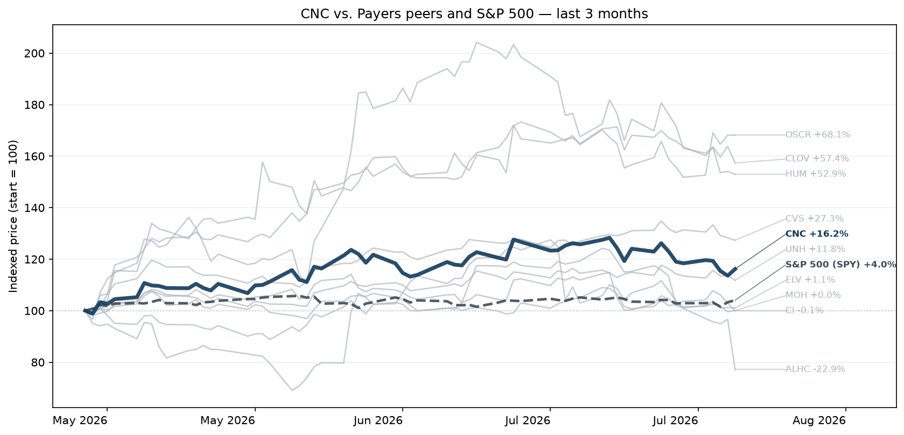

#### Earnings Call Summary

Centene reported strong Q2 2026 adjusted EPS of $2.51, beating expectations due to fundamental business strength and Marketplace risk adjustment favorability. Full-year 2026 adjusted EPS guidance was raised to greater than $4.80, up from the prior outlook of greater than $3.40, reflecting significant positive momentum across the enterprise.

#### At a Glance

- **Centene Significantly Beats Earnings Expectations:** Centene Corporation reported a Q2 2026 adjusted EPS of $2.19, significantly beating the estimated adjusted EPS of 1.079, while reported revenue reached $44,810,000,000 against estimations of $47,448,016,210.
- **Health Benefits Ratio Improves Significantly:** The company&#x27;s Health Benefits Ratio (HBR) dropped to 89.6% compared to 93.0% in the prior year quarter, driven by stronger medical cost management and pricing stability.
- **Full-Year Financial Guidance Sharply Raised:** Centene raised its full-year 2026 adjusted diluted EPS guidance floor to greater than $4.80, up significantly from its prior outlook of greater than $3.40.
- **Membership Pressures Weigh on Growth:** Despite strong profit rebounds, overall enrollment faced pressures as Marketplace membership declined to 3.5 million from 5.9 million year-over-year, alongside attrition in Medicaid and Medicare.
- **Market Pullback Focuses on Quality:** Shares fell over 8% in premarket trading following the announcement as investors looked past headline numbers to evaluate membership declines and non-recurring settlement items worth $0.50 per share.

#### Key Moments from the Call

- **2m 13s — Substantial Guidance Increase:** Centene sharply increased its full-year 2026 adjusted EPS guidance to greater than $4.80 from its prior view of greater than $3.40. This material update will strongly please investors, signaling rapid recovery in core segment profit margins and substantial execution upside.
- **9m 0s — Marketplace Margin Restoration:** Marketplace pre-tax margin guidance was lifted to 4.5%-5% from the prior 3%, fueled by a positive June Wakely acuity report and a $180 million favorable 2025 settlement. This rapid turnaround resolves key investor concerns regarding 2025 pricing turbulence.
- **17m 10s — Accelerated Medicaid Membership Attrition:** Management increased full-year Medicaid membership decline expectations to 8%-9% from the prior 6% view, due to increased state eligibility verifications. While raising acuity concerns, Centene is countering this headwind with stronger 7/1 composite rates of 5%.
- **18m 38s — Medicare PDP Guidance Raised:** Driven by favorable specialty drug trends running below initial expectations and strong product positioning, full-year PDP pre-tax margin guidance was bumped to greater than 3% from 2%, providing solid bottom-line support.
<h3 id="earnings-ohi">Omega Healthcare Investors (OHI) +7.8%</h3>

**Reported:** July 30, 2026 · [Google Finance earnings page](https://www.google.com/finance/quote/OHI:NYSE?tab=earnings&hl=en)

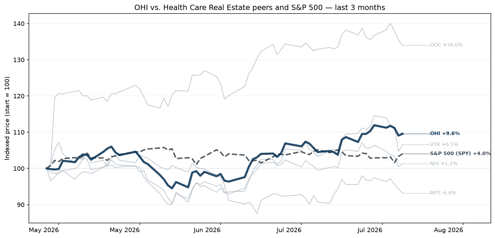

#### Earnings Call Summary

CEO Taylor Pickett reflected on the evolution of skilled nursing and senior housing assets over 25 years. He noted that aging baby boomers are driving robust demand and lowering capitalization rates, which reinforces the resilience and long-term reliability of these assets.

#### At a Glance

- **Omega Healthcare Beats Financial Expectations:** Omega Healthcare Investors reported a Reported Adjusted EPS of $1.19, significantly beating the estimated $0.48, while its Reported Revenue reached $314,259,000, surpassing the estimated $273,855,700.
- **Operator Coverage Hits Multi-Year High:** The company&#x27;s operator EBITDAR coverage improved to a multi-year high of 1.65x, demonstrating solid tenant portfolio health compared to past quarters.
- **Full-Year Guidance Revised Upward:** Management raised its full-year 2026 AFFO guidance to a range of $3.22 to $3.26 per diluted share, reflecting heightened confidence in capital deployment acceleration.
- **Asset Sales Fuel Income Surge:** The substantial headline earnings jump was heavily driven by a non-recurring $247 million gain on asset sales, including the disposition of 18 CommuniCare facilities.
- **Strategic Leadership Transitions Announced:** The second-quarter earnings call marked the final presentation for retiring CEO Taylor Pickett and CFO Bob Stephenson, with leadership transitioning to Matthew Gorman.

#### Key Moments from the Call

- **11m 30s — Strategic Proactive Portfolio Repositioning:** The transition of 20 underperforming Ciena facilities to high-credit operators (Saber and HHC) was executed on a FAD-neutral basis. This proactive move will satisfy investors because it removes credit overhang from a troubled 0.87x coverage portfolio while capturing future upside through equity ownership.
- **13m 23s — Expanding RIDEA Growth Pipeline:** Management closed its first U.K. RIDEA transaction and highlighted that a large component of their robust, back-half weighted pipeline utilizes RIDEA structures. Investors will look favorably on this shift because it allows Omega to share in operating cash flow upside and achieve higher mid-teen returns.
- **19m 28s — Substantial Balance Sheet Deleveraging:** Monetization of $700 million from asset sales and loan repayments allowed Omega to pay down its $2 billion revolver to just $6 million, dropping leverage to a historically low 3.3x. Investors will appreciate this extreme financial flexibility ahead of the 2027 debt maturity.
- **20m 24s — Full Year 2026 Guidance Increase:** Omega raised its full-year 2026 Adjusted FFO guidance range to $3.22-$3.26 per share, up from $3.19-$3.25. This $0.02 midpoint increase will please investors as it demonstrates strong baseline profitability and credit stability despite a temporary earnings headwind from recent asset sales.
<h3 id="earnings-ensg">The Ensign Group (ENSG) -3.0%</h3>

**Reported:** July 29, 2026 · [Google Finance earnings page](https://www.google.com/finance/quote/ENSG:NASDAQ?tab=earnings&hl=en)

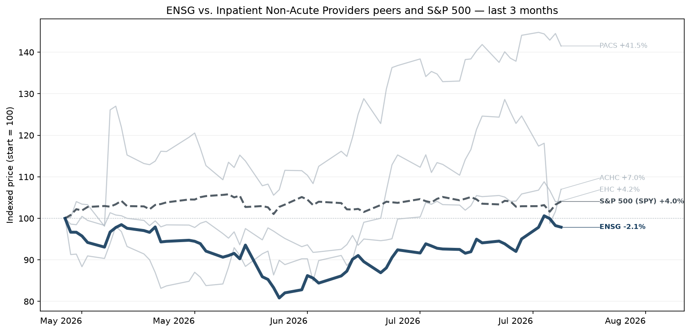

#### Earnings Call Summary

The Ensign Group reported record Q2 2026 results, with adjusted diluted EPS up 20.8% year-over-year to $1.92 and adjusted revenue up 17.3% to $1.4 billion. Growth was driven by robust same-store performance, clinical outcomes outperforming local averages, and successful integration of 102 new operations acquired since 2024.

#### At a Glance

- **Ensign Misses Internal Consensus Metrics:** The Ensign Group reported a Q2 2026 adjusted EPS of $1.68, which missed the estimated adjusted EPS of $1.846, while reported revenue reached $1,440,481,000 against expectations of $1,441,287,770.
- **Occupancy Rates Show Continuous Improvement:** The company demonstrated operational strength with same-store occupancy reaching 84.1% and transitioning facility occupancy hitting 84.7%, which represents a significant 220 basis point and 190 basis point year-over-year improvement, respectively.
- **Full-Year 2026 Guidance Upgraded Higher:** The most significant guidance revision includes raising the annual adjusted EPS outlook to a range of $7.75 to $7.85 and bumping full-year revenue expectations to between $5.87 billion and $5.92 billion.
- **Aggressive Facility Acquisition Strategy Maintained:** Ensign expanded its operational footprint by adding 20 new operations during and just after the quarter, heavily focusing on building out its skilled nursing presence across Texas.
- **Positive Labor and Retention Trends:** Management highlighted robust improvements in internal labor metrics, noting a strong reduction in expensive contract staffing alongside an administrator turnover rate that was 46% lower than the CMS state average.

#### Key Moments from the Call

- **14m 41s — Strong Guidance Increase Driven by Momentum:** The Ensign Group raised its full-year 2026 EPS guidance to $7.75–$7.85 and revenue guidance to $5.87B–$5.92B. This upward revision beats previous projections and reinforces investor confidence, supported by expanding same-store occupancy, managed care revenue growth, and disciplined cost controls.
- **21m 22s — Turnaround Execution and Case Study Proof:** Management detailed a successful turnaround at The Reserve facility, which grew Q2 revenue by 18% and EBIT by 97% year-over-year. This serves as clear validation of Ensign's local leadership and operational model, demonstrating its ability to quickly eliminate agency labor and reverse severe regulatory challenges.
- **39m 35s — Resilience Against CMS Five-Star Rating Changes:** Addressing analyst questions regarding recent updates to CMS Quality Measure thresholds, executives noted preliminary analysis shows a far lower impact than industry averages. Negative impacts are actively offset by clinical improvements in other categories, leaving overall five-star ratings largely unaffected and protecting referral streams.
- **46m 32s — Strategic M&A and Real Estate Diversification:** The company added 20 new operations including real estate, expanding rapidly in Texas and the Southeast. Concurrently, captive REIT Standard Bearer added 23 assets, expanding its high-margin third-party operator lease portfolio to 38 properties, further optimizing asset values and boosting long-term rental income streams.
<h3 id="earnings-uhs">Universal Health Services (UHS) +0.9%</h3>

**Reported:** July 28, 2026 · [Google Finance earnings page](https://www.google.com/finance/quote/UHS:NYSE?tab=earnings&hl=en)

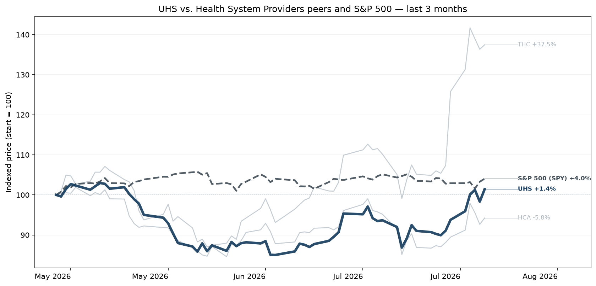

#### Earnings Call Summary

Universal Health Services reported Q2 2026 adjusted EPS of $5.98, a 12% year-over-year increase, and adjusted EBITDA less NCI of $678 million, up 5%. Results included a $100 million out-of-period Florida DPP benefit, without which EBITDA fell short of internal expectations due to higher professional liability reserves and specific facility headwinds.

#### At a Glance

- **UHS Reports Mixed Q2 Results:** Universal Health Services reported a reported revenue of $4,638,012,000, beating estimates of $4,576,927,990, while its reported adjusted EPS of $5.98 slightly missed the estimated $6.007.
- **Solid Volume Growth Across Segments:** Same-facility acute care adjusted admissions increased by 2.9% and behavioral health adjusted patient days grew by 1.4% compared to the prior year period.
- **Full-Year 2026 Guidance Downgraded:** Management lowered its full-year 2026 adjusted EPS guidance to a range of $22.28 to $23.65 due to escalating operating headwinds.
- **Rising Operational and Insurance Costs:** UHS experienced severe margin pressures stemming from a $28 million increase to its professional and general liability reserves and rising uninsured patient volumes.
- **Specific Facilities Straining Financial Performance:** Earnings were negatively impacted by a slower-than-expected ramp-up at the new Cedar Hill facility in Washington, D.C. and ongoing losses at a decertified behavioral health facility in San Antonio.
- **Accelerated Share Repurchase Activity Continues:** Taking advantage of perceived share price dislocations, UHS accelerated capital deployment by executing $320 million in share repurchases during the quarter.

#### Key Moments from the Call

- **18m 17s — Full-Year Guidance Reduction:** UHS lowered its full-year 2026 adjusted EBITDA less NCI guidance midpoint by $50 million. While the company added $150 million in Medicaid supplemental benefits, this was outweighed by $200 million in unexpected operational headwinds from facility delays, recertification losses, and rising insurance reserves, which will disappoint investors looking for stable execution.
- **19m 10s — San Antonio Facility Decertification:** The company revealed a major headwind at its San Antonio behavioral facility, which stopped receiving reimbursements in April and faces a $50 million full-year impact. With recertification delayed until 2027, the facility is projected to run quarterly operating losses of $5 million to $10 million, creating a significant drag on near-term profitability.
- **20m 6s — Cedar Hill De Novo Delay:** UHS reduced its expected full-year tailwind from the Cedar Hill de novo hospital from $50 million to $20 million. A slower-than-anticipated ramp-up, caused by a lack of an established local physician base, means the facility will not achieve breakeven until Q4, leaving initial start-up losses uncontained in the near term.
- **21m 4s — Escalating Malpractice Reserves:** UHS increased its full-year professional and general liability expense estimate by $50 million due to industry-wide increases in claim severity. This recurring structural headwind reflects a broader challenging litigation environment for healthcare providers, indicating that higher insurance settlement and verdict costs will continue to pressure operating margins.
<h3 id="earnings-way">Waystar (WAY) +0.8%</h3>

**Reported:** July 29, 2026 · [Google Finance earnings page](https://www.google.com/finance/quote/WAY:NASDAQ?tab=earnings&hl=en)

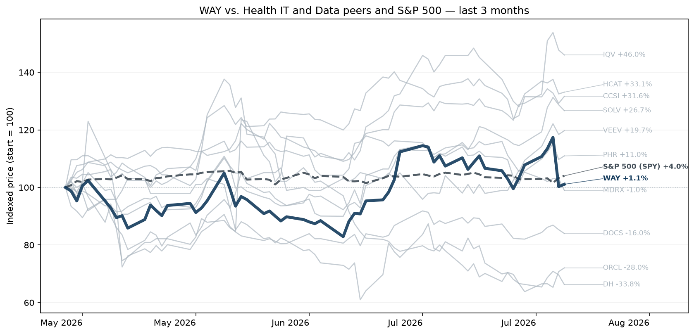

#### Earnings Call Summary

Waystar reported solid Q2 2026 results, delivering $320 million in revenue, which represents 18% year-over-year growth. Adjusted EBITDA reached $137 million, resulting in an adjusted EBITDA margin of 43%. Both top-line and bottom-line metrics exceeded consensus market expectations for the quarter.

#### At a Glance

- **Waystar Beats Top-Line Expectations Comfortably:** Waystar Holding Corp reported Q2 2026 revenue of $319.67 million, beating the estimated $316.17 million, while reported adjusted EPS came in at $0.21 compared to an estimate of 0.397.
- **Subscription Revenue Surges, Offsetting Deceleration:** Subscription revenue drove core growth by climbing 34% year-over-year to $176.3 million, though net revenue retention rate settled at 108%, touching the low end of its historical 108% to 110% range.
- **Full-Year 2026 Guidance Upgraded:** Management raised its full-year fiscal 2026 outlook, projecting total revenue between $1.276 billion and $1.294 billion and non-GAAP diluted EPS of $1.61 to $1.70, reflecting strong operational momentum.
- **AI Platform Solutions Fuel Bookings:** The company&#x27;s next-generation AI solutions, including Waystar AltitudeAI, saw strong adoption, accounting for approximately 40% of its quarterly bookings.
- **CFO Transition Announced Alongside Earnings:** Waystar announced a key executive transition, revealing that long-time CFO Steve Oreskovich will step down and be succeeded by Alpana Wegner.

#### Key Moments from the Call

- **13m 59s — CFO Transition Announced:** Chief Financial Officer Steve Oreskovich is stepping down after an eight-year tenure, having guided the company through its IPO. Public software veteran Alpana Wegner has been appointed as the new CFO. Oreskovich will stay on as an advisor to ensure a seamless leadership transition.
- **20m 38s — Full-Year Guidance Upgraded:** Waystar raised the floor of its 2026 revenue guidance by $2 million and increased its adjusted EBITDA midpoint by $5 million. This upward adjustment reflects strong operational performance through the first half of the year and robust booking execution, providing a strong positive signal to investors.
- **33m 55s — Volume-Based Growth Deceleration Context:** Analysts probed the deceleration of volume-based revenue, which grew 3% in Q2. Management reassured investors that normalized organic volume growth is actually 8%, with the current optics driven by a return to baseline patient utilization and a tough year-over-year comparison against unique 2025 large implementations.
- **38m 32s — Accelerated AI Capital Reinvestment:** Management revealed that capitalized software expenditures for AI solutions doubled year-over-year in the first half of 2026. This deliberate investment strategy aims to capture market opportunities for an autonomous revenue cycle, though it prevents the company from fully passing through recent EBITDA beats to full-year guidance.
<h3 id="earnings-opch">Option Care Health (OPCH) +15.0%</h3>

**Reported:** July 29, 2026 · [Google Finance earnings page](https://www.google.com/finance/quote/OPCH:NASDAQ?tab=earnings&hl=en)

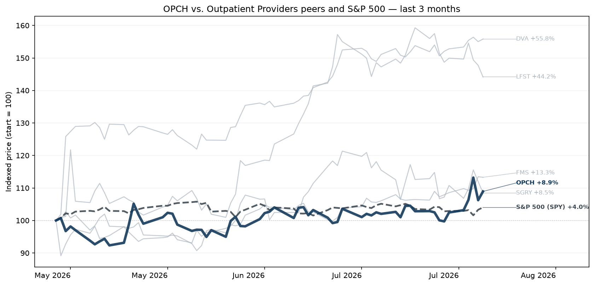

#### Earnings Call Summary

Option Care Health delivered a solid second quarter, with financial results exceeding expectations. The company highlighted robust organic revenue growth in the high-single-digits for its acute therapy portfolio, showing continuous improvement sequentially and year-over-year across all key therapeutic areas and patient volume.

#### At a Glance

- **Option Care Health Beats Expectations:** Option Care Health reported a Q2 2026 revenue of $1,442,400,000, beating the estimate of $1,418,359,910, while its reported adjusted EPS of $0.35 missed the estimated adjusted EPS of $0.427.
- **Clinic Expansion Drives Growth Signals:** The company added five new ambulatory infusion clinics during the quarter, contributing to a substantial 20% year-over-year increase in overall clinic patient visits.
- **Guidance Ranges Shift and Narrow:** Management maintained its full-year 2026 revenue expectations at $5.675 billion to $5.775 billion while narrowing its full-year adjusted EPS guidance range to $1.85 to $1.92.
- **Share Buybacks Drive Capital Allocation:** Option Care Health aggressively repurchased $150 million of its outstanding stock during Q2, which represented approximately 5% of its total shares outstanding.
- **Chronic Inflammatory Disease Portfolio Stabilizes:** The chronic inflammatory disease portfolio began to stabilize following a first-quarter reset, showing high-single-digit sequential growth despite facing a 600 basis point full-year revenue headwind.

#### Key Moments from the Call

- **6m 36s — Chronic Portfolio Census Recovery:** After experiencing a significant reset earlier in the year, the chronic inflammatory disease (CID) portfolio demonstrated sequential patient census growth. This stabilization indicates that updated commercial targeting and resource reallocation are taking root, alleviating investor concerns regarding severe, prolonged deterioration in chronic therapeutic margins.
- **12m 51s — Aggressive Share Buyback Execution:** Option Care Health aggressively repurchased $150 million of stock during Q2, exhausting nearly 5% of outstanding shares. This tactical move directly boosted adjusted EPS by $0.03, signaling strong internal confidence in cash flow sustainability and pleasing investors focused on disciplined capital allocation strategies.
- **15m 1s — Narrowed Full-Year Guidance Ranges:** Management maintained full-year revenue guidance but narrowed ranges for adjusted EBITDA and EPS upward. This adjustment reassures investors of business stability, showing that aggressive efficiency measures and commercial realignment are successfully offsetting the previously anticipated $55 million gross profit headwind stemming from the CID product reset.
- **26m 20s — Sequential Performance Ramps Questioned:** Analysts aggressively probed the steep sequential ramp implied for Q4 EBITDA. Management defended the projections by pointing to historical year-end seasonality, compounding efficiencies from newly deployed AI field tools, and the expected maturation of commercial investments made late last year, signaling confidence in the back-half growth curve.
<h3 id="earnings-alhc">Alignment Health (ALHC) -26.7%</h3>

**Reported:** July 30, 2026 · [Google Finance earnings page](https://www.google.com/finance/quote/ALHC:NASDAQ?tab=earnings&hl=en)

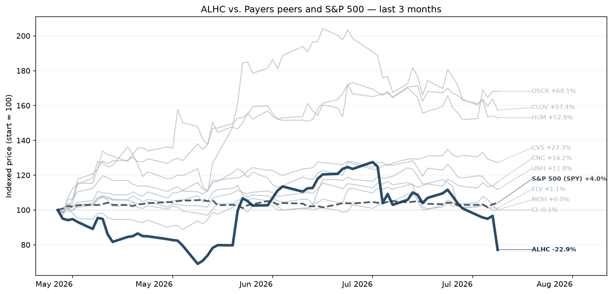

#### Earnings Call Summary

Alignment Healthcare reported strong Q2 2026 results, with health plan membership growing 31% year-over-year to 294,100, driving total revenue up 32% to $1.3 billion. Adjusted MBR improved by 40 basis points to 86.3%, helping generate Q2 Adjusted EBITDA of $68 million, which reflects an Adjusted EBITDA margin expansion of 60 basis points to 5.1%.

#### At a Glance

- **Alignment Healthcare Beats Top-Line Expectations:** Alignment Healthcare reported Q2 2026 revenue of $1,335,633,000, beating estimates of $1,310,092,960, while reported adjusted EPS came in at $0.17 compared to the estimated $0.203.
- **Membership Surges and MBR Hits Lows:** Health plan membership grew 31.5% year-over-year to approximately 294,100 members, helping the company achieve its lowest-ever medical benefit ratio (MBR) as a public company at 86.3%.
- **Full-Year Guidance Shifted Upward:** Management raised its full-year 2026 guidance, projecting full-year revenue between $5.20 billion and $5.23 billion and adjusted EBITDA between $145 million and $163 million.
- **AI Stratification Optimizes Care Engagement:** The deployment of the new AVA AI-powered stratification model successfully predicted the 10% of members who account for nearly 70% of hospital admissions over a 30-day window.
- **Strategic Second-Half Investments Planned:** The company announced plans to reinvest seasonal savings into double-digit millions in clinical and administrative expansions during the second half of 2026 to position for future growth.

#### Key Moments from the Call

- **11m 55s — Full-Year Guidance Increase:** Alignment Healthcare raised its full-year 2026 revenue guidance midpoint to $5.215 billion, and increased the lower bounds of its adjusted gross profit and Adjusted EBITDA guidance. This update reflects heightened confidence driven by strong membership additions, excellent sales execution, and a robust first-half performance.
- **16m 10s — Strategic Second-Half Investments:** Management announced deliberate, incremental double-digit million dollar investments in clinical operations (Care Anywhere) and automation/AI during the second half of 2026, particularly weighted toward Q3. These investments will temporarily elevate near-term MBR and SG&A metrics to optimize long-term scalability and efficiency for 2027 and 2028 market expansions.
- **19m 49s — Discretionary Reserve Strengthening:** The company chose to bolster its prior-year reserves by $6 million during Q2 2026, capitalizing on its strong earnings beat. While the MD&A notes this was driven by claims development and collections, management clarified it was an unrelated, proactive positioning move, leaving overall year-to-date prior-year development favorable by $2 million.
- **44m 17s — Intentional Higher-Acuity Enrollment Mix:** Management revealed that 50% of new members added in 2026 are in higher-acuity C-SNP, D-SNP, and dual-eligible categories. While this mix carries an initially elevated MLR compared to typical members, the company is intentionally leveraging its specialized care model to improve health outcomes and capture significant, favorable margins over time.
<h3 id="earnings-achc">Acadia Healthcare (ACHC) +6.4%</h3>

**Reported:** July 29, 2026 · [Google Finance earnings page](https://www.google.com/finance/quote/ACHC:NASDAQ?tab=earnings&hl=en)

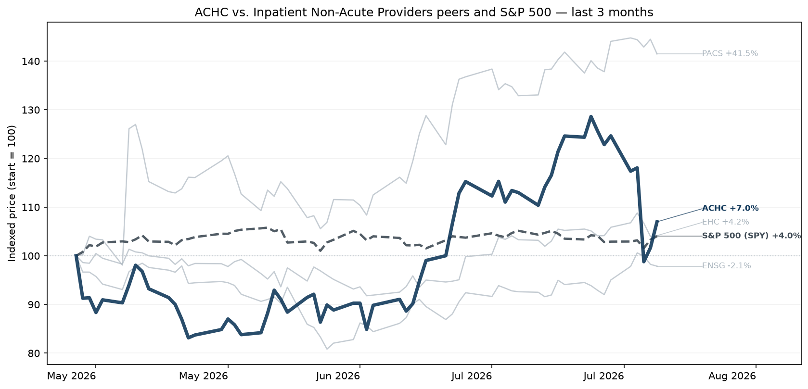

#### Earnings Call Summary

Acadia Healthcare delivered flat total revenue of $866 million in Q2 2026. Normalizing for supplemental payment timing in Florida and Tennessee, total revenue grew 2.8% year-over-year and same-facility revenue rose 3.2%, demonstrating solid underlying progress. Total revenue came in above guidance, while adjusted EBITDA and EPS neared the high end.

#### At a Glance

- **Acadia Outperforms on Key Financials:** Acadia Healthcare reported a Reported Revenue of $865,839,000, beating the estimated $844,223,080, while its Reported Adjusted EPS of $0.12 came in below the initial estimated $0.346 due to heavy liability reserve adjustments.
- **Mixed Trends in Same-Facility KPIs:** The company achieved a 0.8% growth in same-facility patient days, driven by a 2.2% expansion from newly opened ramping facilities, though growth was partially offset by regulatory limitations on treatment duration.
- **Full-Year Financial Guidance Raised:** Acadia adjusted its full-year 2026 outlook, narrowing and raising its projected revenue range to $3.40 billion–$3.45 billion and bumping the lower bound of its full-year adjusted EPS guidance up to $1.45–$1.60.
- **Significant Professional Liability Reserve Adjustments:** Operating expenses were heavily pressured by a $28.6 million actuarial adjustment to professional and general liability reserves for prior-year cases, which dragged down near-term profitability metrics.
- **Strong Cash Flow Generation Accelerates:** A prominent bright spot was free cash flow generation reaching $124 million, a massive turnaround from negative $34 million in the prior-year period, supported by a 77% reduction in total capital expenditures.
- **Market Reaction Dampened by Headwinds:** Despite hitting top-line targets, shares fell roughly 10% following the report as investors zeroed in on flat year-over-year revenue comparisons, rising reserve costs, and regulatory scrutiny.

#### Key Moments from the Call

- **24m 33s — Full-Year CapEx Guidance Reduced:** Acadia lowered its full-year capital expenditure forecast to $235 million–$255 million from a disciplined project review, driving notable improvements in operating and free cash flow generation.
- **25m 16s — Guidance Range Tightened and Revised:** Management updated full-year 2026 guidance to reflect strong operational progress, though they excluded potential $20+ million EBITDA upside from pending supplemental programs under regulatory review.
- **44m 54s — Actuarial Liability Reserve Step-Up:** A proactive mid-year actuarial review led to a $28.6 million reserve adjustment driven by 2025 case severities, raising the full-year expected legal and professional costs to $130 million–$135 million.
- **50m 15s — CTC Segment Revenue Stagnation:** Revenue in the Comprehensive Treatment Center clinics flatlined year-over-year, slightly underperforming management expectations despite adding six centers, prompting a strategic review of regional marketing and patient experience.
<h3 id="earnings-tdoc">Teladoc (TDOC) +3.9%</h3>

**Reported:** July 29, 2026 · [Google Finance earnings page](https://www.google.com/finance/quote/TDOC:NYSE?tab=earnings&hl=en)

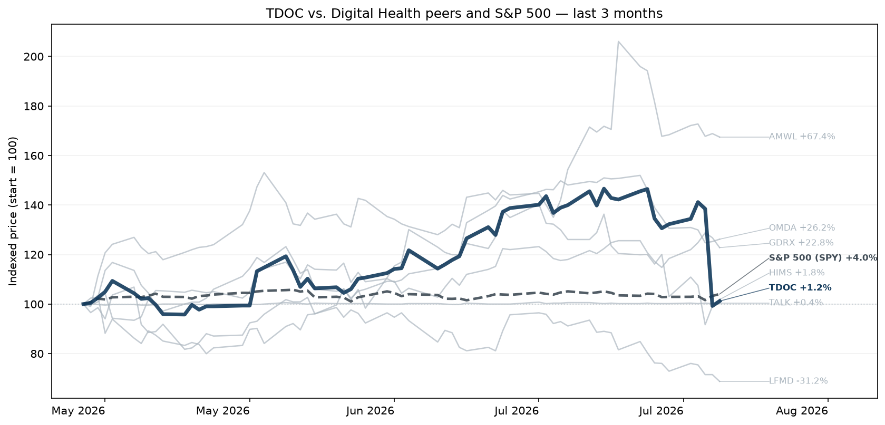

#### Earnings Call Summary

Teladoc Health reported Q2 2026 consolidated revenue of $607M and adjusted EBITDA of $66M (10.8% margin), with results falling within guidance ranges. Net loss per share was $0.21, and the company generated $36M in free cash flow, ending the quarter with $774M in cash and cash equivalents.

#### At a Glance

- **Mixed Results With Revenue Miss:** Teladoc Health reported a reported revenue of $606,927,000, missing the estimated revenue of $615,992,490, while its reported adjusted EPS of $0 beat expectations by coming in ahead of the estimated adjusted EPS loss of -$0.22.
- **BetterHelp Drags Segment KPIs:** BetterHelp segment revenue fell 12% year-over-year to $212.6 million due to a collapse in consumer cash-pay demand, while the Integrated Care segment showed resilient but modest growth of 1% to reach $394.3 million.
- **Full-Year Revenue Guidance Slashed:** Management lowered its 2026 consolidated revenue outlook to a range of $2.36 billion to $2.45 billion, a 5% reduction at the midpoint, reflecting severe headwinds in BetterHelp&#x27;s cash-pay business model.
- **Aggressive Strategic Insurance Pivot:** Teladoc is shifting BetterHelp users toward insurance-covered therapy, which saw users surge over 70% sequentially, though provider capacity constraints are currently limiting its ability to fully capture this demand.
- **Stock Plummets Post-Earnings Release:** Teladoc Health&#x27;s stock plummeted roughly 24% to 25% in after-hours and subsequent trading as investors prioritized the downward guidance revision and revenue miss over the narrow EPS beat.
- **Teladoc One Launch Approaching:** To drive future integrated growth, the company is preparing for the broad availability of &#x27;Teladoc One&#x27; in January 2027, an AI-enabled offering combining virtual, chronic, and behavioral healthcare.

#### Key Moments from the Call

- **10m 2s — BetterHelp Insurance Surge Pressures Cash Pay:** Investors will face a mixed outlook as BetterHelp experiences a rapid shift in consumer preference toward insurance (up to 70–80%), accelerating the decline of the lucrative cash pay segment. Because insurance network capacity could not scale fast enough to meet this demand spike, total revenue is severely pressured during this business model pivot.
- **11m 53s — National Insurance Footprint and Ad Reduction:** Teladoc accelerated its BetterHelp national insurance rollout to all 50 states to build scale, while deliberately cutting direct-to-consumer advertising spending. This strategic pull-back impairs near-term cash pay user acquisition but aims to better align marketing costs with actual network capacity and improve long-term user economics.
- **21m 40s — 2026 Guidance Lowered on Cash Pay:** Management lowered its full-year consolidated revenue guidance by 5% at the midpoint, reflecting a faster-than-anticipated degradation of the BetterHelp cash pay business. Although adjusted EBITDA was ticked slightly higher, the revenue cut signals a prolonged and bumpy transition toward an in-network model.
- **22m 49s — Integrated Care Growth and Contract Deferrals:** Integrated Care provided a stable highlight with 13.6% adjusted EBITDA growth and chronic bundle expansions. However, full-year segment revenue growth was tempered to 0.8%–2.4% due to a deferred client contract implementation into 2027 and lower expected foreign exchange tailwinds.

## Company Overviews

<h3 id="company-unh">UnitedHealth (UNH)</h3>

*Payers · $380.1B · 3m +12.4% · 12m +74.3% · 24m -29.7%*

Diversified healthcare company operating UHC insurance businesses and the Optum health services platform.

UnitedHealth Group is one of the largest private health insurers and provides medical benefits to about 51 million members globally, including 1 million outside the US as of December 2025. As a leader in employer-sponsored, self-directed, and government-backed insurance plans, UnitedHealth has obtained massive scale in medical insurance. Along with its insurance assets, UnitedHealth's Optum franchises help create a healthcare services colossus that spans everything from pharmaceutical benefits to providing outpatient care and analytics to affiliates and third parties.

<h3 id="company-cvs">CVS Health (CVS)</h3>

*Payers · $135.1B · 3m +27.2% · 12m +67.2% · 24m +76.0%*

Healthcare retail ecosystem.

CVS Health offers a diverse set of healthcare services. Its roots are in its retail pharmacy operations, where it operates around 9,000 stores primarily in the US. CVS is also a large pharmacy benefit manager (acquired through Caremark), processing about 2 billion adjusted claims annually. It operates a top-tier health insurer (acquired through Aetna) through which it serves about 27 million medical members. The acquisition of Oak Street Health added primary care services to the mix, which could have significant synergies with all existing business lines.

<h3 id="company-hum">Humana (HUM)</h3>

*Payers · $43.7B · 3m +55.7% · 12m +47.2% · 24m +2.1%*

Large payer, Medicare and Medicare Advantage focused.

Humana is one of the largest private health insurers in the US, and the firm has built a niche specializing in government-sponsored programs, with nearly all its medical membership stemming from Medicare, Medicaid, and the military's Tricare program. Beyond medical insurance, the company provides other healthcare services, including primary-care services, at-home services, and pharmacy benefit management.

<h3 id="company-oscr">Oscar Health (OSCR)</h3>

*Payers · $9.4B · 3m +68.8% · 12m +129.9% · 24m +90.1%*

Tech-focused payer with large exposure to exchange products and ICHRAs.

Oscar Health Inc is a healthcare technology company built around a full stack technology platform and a relentless focus on serving its members. It offers Individual & Family plans and health technology solutions that power the healthcare industry. Oscar operates as one segment to sell insurance to individuals, families and employees through the federal and state-run healthcare exchanges formed in conjunction with the Patient Protection and Affordable Care Act (ACA) and leverages its technology platform to provide services via its Oscar offering.

<h3 id="company-moh">Molina Healthcare (MOH)</h3>

*Payers · $10.2B · 3m +1.5% · 12m +26.1% · 24m -43.6%*

Managed-care company providing health insurance through government programs.

Molina Healthcare Inc provides medical insurance plans through Medicaid, the individual exchanges, and Medicare. The company operates in four reportable segments consisting of: 1) Medicaid; 2) Medicare; 3) Marketplace; and 4) Other. It manages health benefit risks for more than 5 million people, with more than 85% of those members coming through contracts with state governments for their Medicaid programs. Medicaid contracts in four states-California, New York, Texas, and Washington-account for over half of its enrollees.

<h3 id="company-ci">Cigna (CI)</h3>

*Payers · $73.7B · 3m -1.4% · 12m +6.4% · 24m -14.3%*

Employer-focused health insurance company.

Cigna primarily provides pharmacy benefit management and health insurance services. Its PBM and specialty pharmacy services, which were greatly expanded by its 2018 merger with Express Scripts, are mostly sold to health insurance plans and employers. Its largest PBM contract is with the Department of Defense, and it recently won a multiyear deal with top-tier insurer Centene. In health insurance and other benefits, Cigna primarily serves employers through self-funding arrangements, and the company operates mostly in the US with 16 million US and 2 million international medical members covered as of December 2025.

<h3 id="company-elv">Elevance (ELV)</h3>

*Payers · $81.5B · 3m +0.8% · 12m +36.8% · 24m -28.2%*

Health insurance company, previously named Anthem.

Elevance Health remains one of the leading health insurers in the US, providing medical benefits to 45 million medical members at the end of 2025. The company offers employer, individual, and government-sponsored coverage plans. Elevance differs from its peers in its unique position as the largest single provider of Blue Cross Blue Shield branded coverage, operating as the licensee for the Blue Cross Blue Shield Association in 14 states. Through acquisitions, such as the Amerigroup deal in 2012 and MMM in 2021, Elevance's reach expands beyond those states in government-sponsored programs, such as Medicaid and Medicare Advantage plans, too. It is also an emerging player in pharmacy benefit management and other healthcare services.

<h3 id="company-clov">Clover Health (CLOV)</h3>

*Payers · $2.2B · 3m +53.9% · 12m +50.0% · 24m +121.8%*

American healthcare company company providing Medicare Advantage insurance plans.

Clover Health Investments Corp is a healthcare technology company. It focuses on empowering Medicare physicians to proactively manage chronic diseases through its proprietary software platform, Clover Assistant. This cloud-based solution provides personalized insights to physicians, enabling early detection and management of chronic conditions. It operates in one segment: Insurance, through which it offers PPO and HMO plans to Medicare Advantage members in several states.

<h3 id="company-cnc">Centene (CNC)</h3>

*Payers · $30.7B · 3m +16.6% · 12m +140.1% · 24m -19.6%*

Health insurance for government and privately insured healthcare programs.

Centene is a managed care organization that focuses on government-sponsored healthcare plans, including Medicaid, Medicare, and the individual exchanges. Centene served 20 million medical members as of December 2025, mostly in Medicaid (about 64% of membership), the individual exchanges (about 28%), and Medicare (about 5%). The company also provides Medicare Part D pharmaceutical plans.

<h3 id="company-alhc">Alignment Health (ALHC)</h3>

*Payers · $3.1B · 3m -26.7% · 12m +14.5% · 24m +68.2%*

Tech-enabled Medicare Advantage Company.

Alignment Healthcare Inc is a next-generation, consumer-centric platform that is revolutionizing the healthcare experience for seniors through Medicare Advantage plans. These plans are marketed and sold direct-to-consumer, allowing seniors to select the manner in which customers receive healthcare coverage and services on an annual basis. The company combines a technology platform and clinical model for more effective health outcomes.

<h3 id="company-hca">HCA Healthcare (HCA)</h3>

*Health System Providers · $87.2B · 3m -7.0% · 12m +12.8% · 24m +15.0%*

America's largest hospital operator.

HCA Healthcare is a Nashville-based healthcare provider organization operating the largest collection of acute-care hospitals in the United States. As of December 2025, the firm owned and operated 190 hospitals and over 2,500 outpatient facillities across 19 states and a small foothold in the United Kingdom.

<h3 id="company-thc">Tenet Health (THC)</h3>

*Health System Providers · $20.5B · 3m +39.0% · 12m +61.2% · 24m +75.7%*

Healthcare services company which also owns Conifer Health Solutions.

Tenet Healthcare is a Dallas-based healthcare services organization. It operates acute and specialty hospitals (50 as of December 2025) and hundreds of ambulatory surgery centers and other outpatient facilities across the US, primarily in the South. Through its Conifer segment, Tenet also provides revenue cycle management solutions.

<h3 id="company-uhs">Universal Health Services (UHS)</h3>

*Health System Providers · $10.2B · 3m +0.9% · 12m +3.4% · 24m -20.2%*

Hospital and healthcare services company.

Universal Health Services Inc offers healthcare services through its behavioral health centers, acute care hospitals, and related outpatient facilities. As of late 2025, the company operated 346 inpatient behavioral health centers, 29 acute care hospitals, and many supportive outpatient facilities. Its operations are concentrated in the U.S, particularly in Nevada (21% of 2025 operating profits), Texas (19%), and California (13%), although it does have some exposure to the UK behavioral health market (6% of 2025 sales) too. While its acute care services account for over 55% of revenue, the behavioral health centers sport higher margins and account for over 55% of pretax profits.

<h3 id="company-ensg">The Ensign Group (ENSG)</h3>

*Inpatient Non-Acute Providers · $10.4B · 3m -3.0% · 12m +17.4% · 24m +29.9%*

Leading operator of skilled nursing facilities, rehabilitation centers, and senior-care services.

Ensign Group Inc provides post-acute healthcare services in the United States. Its regional subsidiaries oversee skilled nursing, assisted living, home health and hospice, mobile ancillary, and urgent care operations. Medicare and Medicaid programs contribute majority of revenue received for Ensign's services. The firm operates through two segments, Skilled services, and Standard Bearer. The skilled services segment includes the operation of skilled nursing facilities and rehabilitation therapy services. The Standard Bearer segment comprises of properties owned by the company through its captive REIT and leased to skilled nursing and assisted living operations. The majority of the revenue is generated from the skilled services segment.

<h3 id="company-achc">Acadia Healthcare (ACHC)</h3>

*Inpatient Non-Acute Providers · $2.8B · 3m +6.4% · 12m +40.4% · 24m -58.3%*

Largest provider of behavioral health and addiction treatment services.

Acadia Healthcare Co Inc acquires and develops behavioral healthcare facilities. Its facilities and services are classified into the following categories: acute inpatient psychiatric facilities; specialty treatment facilities; CTCs; and residential treatment centers. In which Acute inpatient psychiatric facilities contribute the majority of revenue in the United States. The Company has one reportable segment, behavioral healthcare services. The behavioral healthcare services segment provides inpatient and outpatient behavioral healthcare services.

<h3 id="company-ehc">Encompass Health (EHC)</h3>

*Inpatient Non-Acute Providers · $11.0B · 3m +3.3% · 12m +2.3% · 24m +23.9%*

In-patient post-acute rehabilitation services.

Encompass Health Corp provides post-acute healthcare services in the United States through a network of inpatient rehabilitation hospitals, which is the company's sole segment. Inpatient rehabilitation contributes the majority of the firm's revenue and provides specialized rehabilitative treatment through a network of inpatient hospitals. The company's inpatient rehabilitation hospitals provide a higher level of rehabilitative care to patients who are recovering from conditions such as stroke and other neurological disorders, cardiac and pulmonary conditions, brain and spinal cord injuries, complex orthopedic conditions, and amputations.

<h3 id="company-pacs">PACS Group (PACS)</h3>

*Inpatient Non-Acute Providers · $7.3B · 3m +39.4% · 12m +333.2% · 24m +41.4%*

Post-acute care and skilled nursing company.

PACS Group Inc is a post-acute healthcare company mainly focused on delivering skilled nursing care through a portfolio of independently operated facilities. The post-acute care ecosystem serves individuals who need additional help recuperating from acute conditions, illnesses, or serious medical procedures after getting discharged from the hospital. It also provides senior care, assisted living, and independent living options in some of the communities. The company has one reportable segment.

<h3 id="company-doc">Healthpeak properties (DOC)</h3>

*Health Care Real Estate · $15.1B · 3m +32.9% · 12m +30.2% · 24m +5.3%*

Healthcare industry real estate investment trust.

Healthpeak owns a diversified healthcare portfolio of approximately 700 in-place properties spread across mainly medical office and life science assets, plus a handful of senior housing, hospital, and skilled nursing/post-acute care assets, as well.

<h3 id="company-vtr">Ventas, Inc (VTR)</h3>

*Health Care Real Estate · $48.0B · 3m +6.2% · 12m +38.5% · 24m +68.0%*

Real estate investment trust focused  on ownership and management of research, medicine, and healthcare facilities.

Ventas owns a diversified healthcare portfolio of almost 1,400 in-place properties spread across the senior housing, medical office, hospital, life science, and skilled nursing/post-acute care. The portfolio includes almost 100 properties in Canada and the United Kingdom as the company looks for additional investment opportunities in countries with mature healthcare systems that operate similarly to the United States. The firm also owns mortgages and other loans, contributing about 1% of net operating income.

<h3 id="company-mpt">Medical Properties Trust (MPT)</h3>

*Health Care Real Estate · $2.8B · 3m -8.3% · 12m n/a · 24m n/a*

Real estate investment trust for healthcare facilities in the US and Europe.

Medical Properties Trust Inc acquires and develops net-leased healthcare facilities. Its investments in healthcare real estate, other loans, and any investments in tenants are considered a single reportable segment. Its business strategy is to acquire and develop healthcare facilities and lease the facilities to healthcare operating companies under long-term net leases, which require the tenant to bear of the costs associated with the property. The group's geographic areas are the United States, the United Kingdom, and All other countries.

<h3 id="company-nhi">National Health Investors (NHI)</h3>

*Health Care Real Estate · $3.7B · 3m -0.1% · 12m +7.5% · 24m +5.8%*

Healthcare REIT.

National Health Investors Inc is a self-managed REIT that owns, leases, operates, and finances the development of senior housing communities and medical facilities. It operates through two segments: Real Estate Investments and Senior Housing Operating Portfolio (SHOP). The Real Estate Investments segment, which generates the majority of revenue, includes real estate leases, mortgages, and other notes receivable related to independent living facilities, assisted living facilities, entrance fee communities, senior living campuses, skilled nursing facilities, and a hospital. The SHOP segment consists of ventures that own and operate independent living facilities. The company's revenues are derived from rental income, interest and other income, and resident fees and services.

<h3 id="company-ohi">Omega Healthcare Investors (OHI)</h3>

*Health Care Real Estate · $15.1B · 3m +7.8% · 12m +26.7% · 24m +36.8%*

Healthcare REIT.

Omega Healthcare Investors Inc is a real estate investment trust that invests in healthcare-related real estate properties located in the United States (U.S.), the United Kingdom (U.K.), and Canada. The company's objective is to provide attractive returns to investors while serving as the preferred capital partner to its third-party healthcare operating companies and affiliates, as well as other third-party healthcare operators, allowing them to focus on delivering a high level of care to their resident patients. Omega's investment portfolio mainly consists of skilled nursing facilities, assisted living facilities (ALFs), including care homes in the U.K., independent living facilities, rehabilitation and acute care facilities, and continuing care retirement communities.

<h3 id="company-prva">Privia Health Group (PRVA)</h3>

*Value-Based Care · $3.0B · 3m -4.7% · 12m +25.5% · 24m +22.9%*

Value-based care company focusing on physician enablement for independent practices.

Privia Health Group Inc is one of the physician enablement companies in the United States with a presence in around 24 states and the District of Columbia. The group builds scaled provider networks with primary-care centric medical groups, risk-bearing entities, a physician-led governance structure, and the Privia Platform comprising an extensive suite of technology and service solutions. It collaborates with medical groups, health plans, and health systems to optimize approximately 1,300+ physician practices, improve the patient experience for over 5.8+ million patients, and reward around 5,300+ physicians and practitioners for delivering high-value care.

<h3 id="company-asth">Astrana Health (ASTH)</h3>

*Value-Based Care · $1.8B · 3m +1.9% · 12m +64.9% · 24m -24.6%*

Physician centric management company that operates and coordinates provider networks to take on risk contracts.

Astrana Health Inc is a patient-centered, physician-centric integrated population health management company. The company is working to provide coordinated, outcomes-based medical care cost-effectively. It is focused on physicians providing high-quality medical care, population health management, and care coordination for patients, particularly senior patients and patients with multiple chronic conditions. The company's three reportable segments are Care Partners, Care Delivery, and Care Enablement. It generates the majority of its revenue from the Care Partners segment.

<h3 id="company-agl">Agilon Health (AGL)</h3>

*Value-Based Care · $2.1B · 3m +209.7% · 12m +115.6% · 24m -42.2%*

Value-based care company focused on partnerships with primary care physicians for Medicare Advantage seniors.

Agilon Health Inc is a healthcare services company that partners with primary care physicians to support value-based care for senior patients. The company provides a platform that enables physician groups to manage healthcare outcomes and costs through a Medicare-centric, capitated care model and long-term partnerships with community-based physicians.

<h3 id="company-evh">Evolent Health (EVH)</h3>

*Value-Based Care · $347.6M · 3m -17.6% · 12m -69.0% · 24m -85.3%*

Specialty-care management and healthcare-services company focused on oncology, cardiology, and musculoskeletal care.

Evolent Health Inc is engaged in healthcare delivery and payment. The company supports health systems and physician organizations in their migration toward value-based care and population health management. It provides specialty care management services in oncology, cardiology, musculoskeletal markets and holistic total cost of care management along with an integrated platform for health plan administration and value-based business infrastructure under one go to market package. The solutions provided by the company includes: Oncology, Cardiology, Musculoskeletal, Administrative Services, Advanced Illness, Genetic Testing, Physical Medicine, Radiology, and Surgical Management.

<h3 id="company-piii">P3 Health (PIII)</h3>

*Value-Based Care · $32.7M · 3m +235.5% · 12m +33.7% · 24m -67.2%*

Physician-led population ehalth company focused on coordinating care for Medicare Advantage Patients.

P3 Health Partners Inc is a patient-centered and physician-led population health management company. P3's model aggregates and supports the community's existing healthcare resources to build a network of community providers working together to deliver coordinated and integrated care to patients with a shared commitment to improving patient outcomes, lowering cost, and delivering experience for all. It includes utilization management, care management, disease education, and maintenance of a quality improvement and quality management program for members assigned to the Company. The Company is also responsible for the credentialing of its providers, processing and payment of claims, and the establishment of a provider network for certain health plans.

<h3 id="company-dva">Davita (DVA)</h3>

*Outpatient Providers · $15.4B · 3m +58.3% · 12m +73.4% · 24m +77.3%*

One of two dominant US dialysis providers.

DaVita is one of the largest providers of dialysis services in the United States, boasting a market share of about 35%. The firm operates over 3,200 facilities worldwide, mostly in the US, and treats about 300,000 patients annually. Government payers dominate US dialysis reimbursement. DaVita receives about two-thirds of US sales at government (primarily Medicare) reimbursement rates, with the remainder coming from commercial insurers. While commercial insurers represent only about 10% of US patients treated, they represent nearly all of the profits generated by DaVita in the US dialysis business.

<h3 id="company-fms">Fresenius (FMS)</h3>

*Outpatient Providers · $13.8B · 3m +14.1% · 12m +2.1% · 24m +36.7%*

Global leaders in dialysis clinics, equipment, and renal services.

Fresenius Medical Care is the largest dialysis company in the world, treating nearly 300,000 patients from about 3,600 clinics worldwide as of December 2025. In addition to providing dialysis services, the firm is a leading supplier of dialysis products, including machines, dialyzers, and concentrates. Fresenius accounts for about 35% of the global dialysis products market, creating the world's only fully integrated dialysis business. Services account for about three-fourths of sales, while the balance is generated from medical technology products that enable dialysis treatments.

<h3 id="company-sgry">Surgery Partners (SGRY)</h3>

*Outpatient Providers · $2.0B · 3m +7.9% · 12m -27.6% · 24m -46.4%*

Operator of Ambulatory Surgery Centers.

Surgery Partners Inc is a healthcare services company with an integrated outpatient delivery model focused on providing quality, cost-effective solutions for surgical and related ancillary care in support of both patients and physicians. It has one reportable segment: Surgical Facilities, which includes the operation of ASCs, surgical hospitals, anesthesia services, and multi-specialty physician practices, which earn revenues from contracts with patients in which the performance obligations are to provide health care services.

<h3 id="company-opch">Option Care Health (OPCH)</h3>

*Outpatient Providers · $3.4B · 3m +15.0% · 12m -18.5% · 24m -22.4%*

Largest independent provider of home and alternate-site infusion therapy services in the United States.

Option Care Health Inc is the provider of home and alternate-site infusion services. It provides treatment for bleeding disorders, neurological disorders, heart failure, anti-infectives, and chronic inflammatory disorders, among others. The Company operates in one segment, infusion services.

<h3 id="company-lfst">Lifestance Health (LFST)</h3>

*Outpatient Providers · $4.0B · 3m +39.2% · 12m +176.5% · 24m +90.2%*

Outpatient behavioral-health providers of psychiatry and therapy services.

LifeStance Health Group Inc is a mental healthcare company that operates as a provider of outpatient mental health services, spanning psychiatric evaluations and treatment, psychological and neuropsychological testing, and individual, family, and group therapy. It treats a broad range of mental health conditions, including anxiety, depression, bipolar disorder, eating disorders, psychotic disorders, and post-traumatic stress disorder, using evidence-based approaches to ensure effective treatment. The group has a single operating and reportable segment of mental health services.

<h3 id="company-tdoc">Teladoc (TDOC)</h3>

*Digital Health · $1.2B · 3m +3.9% · 12m -3.3% · 24m -11.7%*

Largest pure-play virtual care platform, offering telemedicine, chronic-care management, and specialty virtual health services.

Teladoc Health Inc is engaged in the provision of virtual healthcare services, connecting patients, providers, and healthcare systems through technology-enabled platforms. The company has two reportable segments: Integrated Care and BetterHelp. The Integrated Care segment provides virtual healthcare solutions, including primary care, mental health, chronic care management, and telehealth enablement services for employers, insurers, and healthcare systems, mainly on a business-to-business basis, while the BetterHelp segment offers direct-to-consumer online mental health services, including counseling and therapy delivered through digital platforms. It generates the majority of its revenue from the Integrated Care segment.

<h3 id="company-amwl">Amwell (AMWL)</h3>

*Digital Health · $179.6M · 3m +75.7% · 12m +53.4% · 24m +12.4%*

Telehealth infrastructure company providing virtual-care technology.

American Well Corp is an enterprise platform and software company digitally enabling hybrid care by offering payers and health systems a technology-enabled care platform. The Amwell Platform, its cloud-based enablement platform, digitally enables a scalable healthcare experience across all care settings by enabling critical services like virtual primary care, urgent care, clinical partner programs, scheduling visits, etc. Additionally, the healthcare providers can use the platform to access familiar workflows for taking notes, prescribing, referencing clinical treatment guidelines, and other related activities. The firm also offers various paid services, including licensed clinical staffing, implementation support, workflow design, etc, to help clients execute their hybrid care strategies.

<h3 id="company-talk">Talkspace (TALK)</h3>

*Digital Health · $874.4M · 3m +0.6% · 12m +126.0% · 24m +194.9%*

Digital behavioral-health company providing online therapy and mental-health services through employers and health-plans.

Talkspace Inc is a virtual behavioral healthcare company offering its members convenient and affordable access to a fully-credentialed network of qualified providers across a wide and growing spectrum of care through virtual psychotherapy and psychiatry. It is a single destination for comprehensive mental health care, including therapy for individuals, couples, and teens, as well as psychiatric treatment and medication management (18+), and self-guided tools and resources. The company's customers include Health insurance plans from commercial and government institutions, and employee assistance programs, Direct-to-Enterprise, and Individual subscribers. The company operates as a single segment.

<h3 id="company-hims">Hims &amp; Hers (HIMS)</h3>

*Digital Health · $6.4B · 3m +1.3% · 12m -55.6% · 24m +55.7%*

Direct-to-Consumer telehealth platform for primary care, weight management, mental health, sexual health, and wellness.

Hims & Hers, launched in 2017, is a telehealth platform that connects patients and healthcare providers to offer treatment options for specialties like erectile dysfunction, hair loss, skin care, mental health, and weight loss. Its offerings include generic, branded, and compounded prescription drugs as well as over-the-counter medicines, cosmetics, and supplements. The platform, which has more than 2 million subscribers, is available in all 50 states and certain European markets like the UK. It includes provider networks, electronic medical records, cloud pharmacy fulfillment, and personalization capabilities. Hims does not take insurance and only accepts payments directly from customers.

<h3 id="company-lfmd">LifeMD (LFMD)</h3>

*Digital Health · $169.3M · 3m -30.0% · 12m -64.8% · 24m -41.5%*

Virtual primary-care and telehealth company known for chronic condition management.

LifeMD Inc is a patient-centric, direct-to-patient healthcare company providing a high-quality, cost-effective, and convenient way for patients to access virtual medical care and pharmacy services. The Company's portfolio of brands within continuing operations is now managed as a single operating segment, Telehealth. Telehealth platform integrates core capabilities, includes: A nationwide pharmacy network, A wholly-owned commercial pharmacy, A fully integrated patient care center, A direct-to-patient marketing infrastructure for acquisition and retention, and AI-enabled clinical and operational technologies.

<h3 id="company-omda">Omada Health (OMDA)</h3>

*Digital Health · $1.2B · 3m +29.8% · 12m +14.2% · 24m n/a*

Virtual chronic-care platform focused on diabetes, hypertension, obesity, and musculoskeletal conditions through employers and health plans.

Omada Health Inc empowers individuals to make lasting health changes through personalized, virtual care between doctor's visits. The integrated platform of the company supports members with cardiometabolic conditions like prediabetes, diabetes, hypertension, musculoskeletal issues, and behavioral health needs. The company's specialized care tracks also assist members using GLP-1 medications. The company delivers measurable health outcomes and value for employers, health plans, health systems, and pharmacy benefit managers.

<h3 id="company-gdrx">GoodRx (GDRX)</h3>

*Digital Health · $1.0B · 3m +20.4% · 12m -32.2% · 24m -62.8%*

Prescription-pricing and healthcare-shopping platform that helps consumers find discounts on medications and healthcare services.

GoodRx Holdings Inc is a consumer-focused digital healthcare platform that aims to lower the cost of healthcare in the United States. It operates a price comparison platform that provides consumers with curated, geographically relevant prescription pricing, and provides access to negotiated prices through codes that can be used to save money on prescriptions across the United States. GoodRx generates revenue from core business from pharmacy benefit managers (PBMs) that manage formularies and prescription transactions including establishing pricing between consumers and pharmacies. It also offers various healthcare products and services, including pharma manufacturer solutions, subscriptions, and telehealth services.

<h3 id="company-orcl">Oracle-Cerner (ORCL)</h3>

*Health IT and Data · $374.1B · 3m -24.4% · 12m -46.9% · 24m +1.6%*

Largest healthcare IT platform vendor, providing EHRs, clinical workflow software, and healthcare data infrastructure.

Oracle provides enterprise applications and infrastructure offerings through a variety of flexible IT deployment models, including on-premises, cloud-based, and hybrid. Founded in 1977, Oracle pioneered the first commercial SQL-based relational database management system, which is commonly used by the world's largest companies for high-volume online transaction processing workloads. Besides databases, Oracle also sells enterprise resource planning platforms and cloud infrastructure that play an increasingly important role in large language model training and inferencing.

<h3 id="company-mdrx">Veradigm (MDRX)</h3>

*Health IT and Data · n/a · 3m -1.0% · 12m -1.0% · 24m -48.8%*

Healthcare data, EHR (AllScripts) and interoperability.

VERADIGM INC

<h3 id="company-way">Waystar (WAY)</h3>

*Health IT and Data · $4.0B · 3m +0.8% · 12m -40.7% · 24m -2.2%*

Healthcare payments and revenue cycle platform.

Waystar Holding Corp is a provider of mission-critical cloud technology to healthcare organizations. Its enterprise-grade platform transforms the complex and disparate processes comprising healthcare payments received by healthcare providers from payers and patients, from pre-service engagement through post-service remittance and reconciliation. its platform enhances data integrity, eliminates manual tasks, and improves claim and billing accuracy, which results in transparency, reduced labor costs, and faster, more accurate reimbursement and cash flow. The market for solutions extends throughout the United States and includes Puerto Rico and other USA Territories.

<h3 id="company-solv">Solventum (SOLV)</h3>

*Health IT and Data · $13.6B · 3m +28.2% · 12m +19.1% · 24m +49.1%*

Revenue-cycle, clinical documentation, coding, and healthcare workflow solutions.

Solventum Corp is a healthcare company developing, manufacturing, and commercializing solutions leveraging material science, data science, and digital capabilities to address customer and patient needs. Its segments include MedSurg, which earns maximum revenue and provides wound therapy, I.V. site management, surgical supplies, medical tapes and wraps, stethoscopes, medical electrodes, and OEM medical technologies; Dental Solutions, offering dental and orthodontic products such as brackets, restorative cements, and bonding agents; and Health Information Systems, providing software solutions including physician documentation, coding automation, speech recognition, and data visualization platforms. It operates in the United States, which earns the majority of revenue, and internationally.

<h3 id="company-phr">Phreesia (PHR)</h3>

*Health IT and Data · $663.2M · 3m +11.0% · 12m -59.3% · 24m -52.7%*

Patient-intake and engagement platform that digitizes registration, scheduling, intake forms, payments, and communications.

Phreesia Inc is a provides an integrated software, payments, and engagement platform designed to address three foundational challenges in healthcare delivery: access to care, affordability of care, and patient health outcomes. Its platform is embedded directly into provider workflows and patient interactions, enabling healthcare organizations to activate patients, streamline administrative processes, and improve financial performance across the care continuum. The group serves a diverse group of healthcare organizations, including ambulatory practices, health systems, and hospitals, as well as life sciences companies, government entities, patient advocacy, public interest, and not-for-profit and other organizations.

<h3 id="company-ccsi">Consensus Cloud Solutions (CCSI)</h3>

*Health IT and Data · $669.7M · 3m +32.6% · 12m +85.1% · 24m +89.6%*

Healthcare-focused cloud communications company known for secure-faxing, interoperability, and clinical document exchange.

Consensus Cloud Solutions Inc is a provider of secure information delivery services with a scalable Software-as-a-Service SaaS platform. It is engaged in the fax cloud business. The company's offerings include communication, data extraction, and digital signature solutions that enable users to securely access, exchange, and manage information across organizational and geographic boundaries. It serves multiple industry verticals, including healthcare, government, financial services, legal, and education. Geographically, the company operates in the United States, Canada, Ireland, and other countries. It derives the maximum revenue from the United States.

<h3 id="company-dh">Definitive Healthcare (DH)</h3>

*Health IT and Data · $85.5M · 3m -30.8% · 12m -81.8% · 24m -81.6%*

Healthcare data providers for provider, hospital, physician, and payer intelligence databases.

Definitive Healthcare Corp is a provider of healthcare commercial intelligence. Its SaaS-based healthcare commercial intelligence platform is designed to provide comprehensive and accurate information on the healthcare ecosystem in the U.S. The platform uses deep analytics and data science to help customers develop data-driven strategic decisions, such as finding new markets to enter, building comprehensive go-to-market strategies, accessing tactical information to help target the right decision makers, and improving win rates with detailed contextual information. The company derives substantially all of its revenue from the sale of subscription fees for access to its platform and stand-ready support. Geographically, it derives a majority of its revenue from the United States.

<h3 id="company-iqv">Iqvia (IQV)</h3>

*Health IT and Data · $38.7B · 3m +49.0% · 12m +28.8% · 24m +0.6%*

Dominant helathcare data, analytics, and contract research organization, supplying pharmaceutical companies with clinical reearch and commercial intelligence.

Iqvia is a global leader in clinical research and technology solutions for the life science industry. Formed in 2016 from the merger of Quintiles and IMS Health, it combined clinical trial services with extensive healthcare data and analytics. Its research and development solutions segment provides outsourced clinical development services spanning drug discovery, trial design, patient recruitment, site management, clinical testing, real-world studies, and the regulatory approval process. Its commercial solutions segment helps companies optimize product commercialization through analytics, technology, and outsourced sales and medical services. Together, Iqvia supports customers across the life science industry, and it serves biopharmaceutical firms, providers, payers, and policymakers.

<h3 id="company-hcat">Health Catalyst (HCAT)</h3>

*Health IT and Data · $154.4M · 3m +44.1% · 12m -40.6% · 24m -65.3%*

Healthcare analytics and data-platform company that helps providers improve clinical, operational, and financial performance.

Health Catalyst Inc provides data and analytics technology and services to healthcare organizations. It has two operating segments. The Technology segment, the key revenue driver, includes data platform, analytics applications and support services and generates revenues mainly from contracts that are cloud-based subscription arrangements, time-based license arrangements, and maintenance and support fees; the Professional Services segment is generally the combination of analytics, implementation, strategic advisory, outsourcing, and improvement services to deliver expertise to its customers to more fully configure and utilize the benefits of the technology offerings.

<h3 id="company-docs">Doximity (DOCS)</h3>

*Health IT and Data · $3.8B · 3m -16.3% · 12m -63.5% · 24m -19.5%*

Professional network for physicians, combining recruiting, communications, telehealth, and workflow tools.

Doximity Inc provides an online platform, which enables physicians and other healthcare professionals to collaborate with colleagues, stay up to date with the latest medical news and research, manage their careers and on-call schedules, streamline documentation and administrative paperwork, and conduct virtual patient visits. The Company's customers include pharmaceutical companies and health systems that connect with healthcare professionals through the Company's digital Marketing, Hiring, and Workflow Solutions. Marketing Solutions provide customers with the ability to share tailored content on the network. Hiring Solutions enable customers to identify, connect with, and hire from the network of both active and passive potential medical professional candidates.

<h3 id="company-veev">Veeva Systems (VEEV)</h3>

*Health IT and Data · $33.1B · 3m +18.8% · 12m -27.6% · 24m +9.9%*

Leding cloud-software provider for life sciences companies, supporting CRM, clinical trails, regulatory processes, and commercialization.

Veeva is the global leading supplier of cloud-based software solutions for the life sciences industry. The company's best-of-breed offerings address operating and regulatory requirements for customers ranging from small, emerging biotechnology companies to departments of global pharmaceutical manufacturers. The company leverages its domain expertise to improve the efficiency and compliance of the underserved life sciences industry, displacing large, highly customized and dated enterprise resource planning systems that have limited flexibility. Its two main products are Veeva CRM, a customer relationship management platform for companies with a salesforce, and Veeva Vault, a content management platform that tackles various functions within any life sciences company.

