# Healthcare Intel Digest

<strong>Week of August 10, 2026</strong>Market data through: August 7, 2026Narrative created: August 10, 2026

Weekly review of healthcare services, technology, distribution, and diagnostic company performance, changes, earnings activity, and strategy narrative.

## Strategy Narrative

<nav class="strategy-narrative-links" aria-label="Strategy narrative sections">
<ul>
<li><a href="#strategy-executive-1-cms-is-turning-medicaid-payment-integrity-into-an-active-operating-model">1. CMS is turning Medicaid payment integrity into an active operating model</a></li>
<li><a href="#strategy-executive-2-medicaid-financing-reform-may-matter-more-to-payer-economics-than-incremental-cost-management-gains">2. Medicaid financing reform may matter more to payer economics than incremental cost-management gains</a></li>
<li><a href="#strategy-executive-3-humana-s-quarter-confirms-that-enrollment-growth-is-running-ahead-of-earnings-recovery">3. Humana’s quarter confirms that enrollment growth is running ahead of earnings recovery</a></li>
<li><a href="#strategy-executive-4-unitedhealth-is-building-a-connected-automation-stack-across-coding-authorization-and-payment">4. UnitedHealth is building a connected automation stack across coding, authorization and payment</a></li>
<li><a href="#strategy-executive-5-aetna-s-next-earnings-call-is-the-immediate-payer-catalyst">5. Aetna’s next earnings call is the immediate payer catalyst</a></li>
<li><a href="#strategy-provider-technology-6-revenue-cycle-ai-is-moving-from-prediction-to-production-workflow">6. Revenue-cycle AI is moving from prediction to production workflow</a></li>
<li><a href="#strategy-provider-technology-7-provider-operating-performance-increasingly-rewards-ambulatory-scale-and-disciplined-service-line-selection">7. Provider operating performance increasingly rewards ambulatory scale and disciplined service-line selection</a></li>
<li><a href="#strategy-provider-technology-8-cms-s-2027-physician-payment-proposal-favors-operational-value-based-care-platforms">8. CMS’s 2027 physician-payment proposal favors operational value-based-care platforms</a></li>
</ul>
</nav>

<h3 id="executive-readout">Executive readout</h3>

<h4 id="strategy-executive-1-cms-is-turning-medicaid-payment-integrity-into-an-active-operating-model">1. CMS is turning Medicaid payment integrity into an active operating model</h4>

CMS reported on July 28 that its Medicaid Fraud War Room identified 50 high-risk providers tied to more than **$203 million in potentially improper payments** during its first 88 days. The significance is less the headline savings than the operating model: federal and state teams combining analytics, provider intelligence and rapid enforcement rather than waiting for conventional retrospective audits. [Centers for Medicare & Medicaid Services+1](https://www.cms.gov/newsroom/fact-sheets/medicare-part-d-2027-national-average-monthly-bid-amount-information?utm_source=chatgpt.com)

**Why it matters:** Medicaid payment integrity is moving toward real-time provider surveillance. The most valuable tools will not merely flag suspicious claims; they will establish relationships among providers, owners, addresses, billing entities, sanctions and cross-state patterns—and then convert those findings into payment holds, network actions or referrals.

**What competitors are doing:** Scaled payment-integrity platforms are increasingly combining claims analytics with provider-network intelligence, while federal efforts are creating a national data and enforcement layer that state agencies and Medicaid managed-care plans will need to consume.

**Strategic implication:** Medicaid plans should evaluate whether their payment-integrity operation can:

- Ingest federal and state exclusions quickly.
- Link related providers and beneficial owners.
- identify activity across multiple tax IDs and states.
- Quantify preventable prospective exposure, not just recoverable dollars.
- Create an enforcement-ready evidence package.

**Watch next:** Expect pressure on states and managed-care organizations to document how rapidly they act on federal referrals and prevent sanctioned providers from re-entering through affiliated entities.

---

<h4 id="strategy-executive-2-medicaid-financing-reform-may-matter-more-to-payer-economics-than-incremental-cost-management-gains">2. Medicaid financing reform may matter more to payer economics than incremental cost-management gains</h4>

CMS’s July 21 proposed rule would tighten the indirect hold-harmless standards governing healthcare-related provider taxes. CMS estimates the proposal would reduce federal expenditures by **$246 billion from 2026 through 2035**, with comments due September 21, 2026. [Centers for Medicare & Medicaid Services](https://www.cms.gov/newsroom/fact-sheets/amending-indirect-hold-harmless-threshold-health-care-related-taxes-proposed-rule-cms-2452-p?utm_source=chatgpt.com)

**Why it matters:** Provider taxes frequently underpin state Medicaid financing, hospital supplemental payments and managed-care rate development. Restrictions could force states to replace funding, reduce provider payments or redesign directed-payment arrangements.

This is strategically distinct from payment integrity. Analytics may reduce leakage, but they cannot fully offset structurally inadequate capitation or weakened provider financing.

**Payer implications:**

- Medicaid plans need state-by-state exposure models connecting provider-tax changes to capitation adequacy and network stability.
- Finance and payment-integrity teams should separate recoverable operational waste from actuarial underfunding.
- Plans may need earlier warning systems for hospital distress, access deterioration and provider terminations.

**Provider implications:** Health systems should model both direct Medicaid revenue exposure and indirect exposure through managed-care rates and supplemental payments. Tenet’s second-quarter results illustrate the materiality: its hospital segment benefited from increased Medicaid supplemental revenue, while management also cited disciplined expense management and revenue growth. [Tenet Healthcare](https://investor.tenethealth.com/press-releases/press-release-details/2026/Tenet-Reports-Strong-Second-Quarter-2026-Results-Raises-2026-Financial-Outlook/default.aspx?utm_source=chatgpt.com)

**Watch next:** State comments will reveal which provider classes and Medicaid markets face the greatest risk. Hospital and plan advocacy will likely focus on access and actuarial soundness rather than defending provider taxes in the abstract.

---

<h4 id="strategy-executive-3-humana-s-quarter-confirms-that-enrollment-growth-is-running-ahead-of-earnings-recovery">3. Humana’s quarter confirms that enrollment growth is running ahead of earnings recovery</h4>

Humana reported second-quarter adjusted EPS of **$7.61**, a 91.2% insurance benefit ratio and approximately 23% growth in individual Medicare Advantage membership. It nevertheless maintained full-year adjusted EPS guidance of at least $9 rather than raising it. [Humana+1](https://humana.gcs-web.com/news-releases/news-release-details/humana-reports-second-quarter-2026-financial-results-affirms?utm_source=chatgpt.com)

**Why it matters:** Humana is successfully rebuilding membership, but rapid growth increases the need for strong risk, quality and clinical-operating infrastructure. The company still faces a substantial Stars-related earnings headwind, and the market remains focused on whether quality recovery will convert into bonus revenue and margin improvement.

**Risk and quality implications:** Humana needs one integrated workflow across:

- Prospective risk identification.
- Clinically defensible documentation.
- Coding validation and deletion.
- Stars gap closure.
- CenterWell primary and home-based care.
- Benefit design and utilization management.

A fragmented approach risks identifying more diagnoses without improving ongoing treatment, quality performance or medical-cost control.

**Competitive comparison:** UnitedHealth raised its outlook after reporting improving medical-cost performance; Humana did not. That gives UnitedHealth the stronger near-term operating narrative, while Humana remains more dependent on Stars recovery and profitable absorption of new members. [UnitedHealth Group+2Quartz+2](https://www.unitedhealthgroup.com/content/dam/UHG/PDF/investors/2026/unh-reports-second-quarter-2026-results.pdf?utm_source=chatgpt.com)

**Watch next:** The next major catalyst is the fall Stars update. Also watch 2027 benefit positioning, member movement among contracts, CenterWell capacity and whether new enrollment produces higher-than-expected utilization.

---

<h4 id="strategy-executive-4-unitedhealth-is-building-a-connected-automation-stack-across-coding-authorization-and-payment">4. UnitedHealth is building a connected automation stack across coding, authorization and payment</h4>

UnitedHealth reported $112.0 billion of second-quarter revenue, adjusted EPS of $6.38 and raised full-year adjusted EPS guidance to $19.50–$20.00. Optum Insight generated $5.4 billion of revenue and $1.4 billion of operating earnings. [UnitedHealth Group+1](https://www.unitedhealthgroup.com/content/dam/UHG/PDF/investors/2026/unh-reports-second-quarter-2026-results.pdf?utm_source=chatgpt.com)

UnitedHealth has also described substantial investment in AI, including prior authorization and autonomous coding. The company previously said roughly 95% of UnitedHealthcare prior-authorization requests were submitted electronically, approximately half were processed in real time and 90% were approved within one business day on average. [Becker's Payer](https://www.beckerspayer.com/virtual-care/unitedhealth-is-spending-1-5b-on-ai-this-year-heres-where-the-money-is-going/?utm_source=chatgpt.com)

**Why it matters:** UnitedHealth’s advantage is not any single algorithm. It is its ability to connect:

1. Clinical and claims data.
2. Coverage requirements.
3. Prior authorization.
4. Coding and documentation.
5. Claims adjudication.
6. Payment integrity.
7. Consumer and provider workflow.

That allows Optum to sell technology as part of a broader financial and operating outcome.

**Competitive implications:** Independent vendors cannot rely on “better AI” alone. They need to differentiate through evidence transparency, configurable payer policy, implementation speed, neutrality and interoperability across multiple claims and clinical systems.

**Key strategic risk:** The same integrated platform that improves efficiency can create correlated compliance failures. Autonomous coding must apply different evidence standards to provider reimbursement, risk adjustment and quality use cases, and it should identify unsupported diagnoses as rigorously as missed ones.

**Watch next:** External adoption is the test. Internal use by UnitedHealthcare validates integration; sales to unaffiliated payers and providers would validate competitiveness.

---

<h4 id="strategy-executive-5-aetna-s-next-earnings-call-is-the-immediate-payer-catalyst">5. Aetna’s next earnings call is the immediate payer catalyst</h4>

CVS Health is scheduled to report this week, making Aetna the major payer focus. The central questions are whether insurance-margin improvement is durable and whether operational investments are producing measurable improvements in medical cost, Stars, prior authorization and provider experience. [Investors+1](https://www.investors.com/research/investing-action-plan/stock-market-week-ahead-citadel-spacex-palantir-and-a-possible-follow-through-day/?utm_source=chatgpt.com)

**Why it matters:** Aetna has been explicitly linking provider trust with better digital access, clearer coverage information and interoperability. That positioning matters because provider friction creates economic costs through calls, appeals, delayed care, documentation requests and contracting resistance.

**What to listen for:**

- Medical-cost trends by Medicare Advantage, commercial and Medicaid.
- 2027 MA benefit and county strategy.
- Stars remediation.
- Prior-authorization simplification and electronic adoption.
- Risk-adjustment compliance controls.
- Whether Aetna is gaining measurable value from CVS assets such as pharmacy, care delivery and consumer engagement.
- Any further integration or simplification of payer and provider technology.

**Strategy implication:** Aetna’s technology scorecard should extend beyond gross savings. Better metrics include appeal overturns, touches per authorization, documentation requests per claim, provider time consumed, electronic completion rates and days to payment.

---

<h3 id="provider-technology">Provider technology</h3>

<h4 id="strategy-provider-technology-6-revenue-cycle-ai-is-moving-from-prediction-to-production-workflow">6. Revenue-cycle AI is moving from prediction to production workflow</h4>

Myriad Genetics recently detailed a rebuilt AI document-processing system supporting insurance documentation and prior authorization. The updated platform reportedly reduced processing time from approximately 10 minutes to 20 seconds, saved about 300 staff hours per month in one business unit and processed 9,000 prior authorizations, with broader expansion planned. [Business Insider](https://www.businessinsider.com/myriad-genetics-ai-document-processing-aws-bedrock-2026-7?utm_source=chatgpt.com)

**Why it matters:** This is the type of evidence provider buyers increasingly demand: workflow volume, time saved and expansion into adjacent processes—not generalized claims about model performance.

The next phase of revenue-cycle AI will connect:

- Eligibility.
- Medical-necessity documentation.
- Authorization.
- Coding.
- Claim construction.
- Denial prevention.
- Appeals and remittance reconciliation.

**Competitive landscape:** Providers are evaluating both software platforms and technology-enabled services. RCM vendors increasingly emphasize AI-driven denial prevention and automation, while large consultancies and outsourcing firms are adding AI-enabled business-process capabilities. Capgemini, for example, cited strong demand for AI transformation and business-process services after expanding through acquisition. [Reuters+1](https://www.reuters.com/business/capgemini-lifts-2026-target-first-half-revenue-rises-88-2026-07-30/?utm_source=chatgpt.com)

**Strategic implication:** Provider buyers should contract around realized outcomes, including:

- Clean-claim rate.
- Avoided denials.
- Net collection yield.
- Days in accounts receivable.
- Appeal success.
- Human touches per account.
- Cost to collect.

**Watch next:** Expect consolidation among point solutions that automate only one step. Platforms able to link clinical evidence, payer policy and remittance outcomes will have a stronger learning advantage.

---

<h4 id="strategy-provider-technology-7-provider-operating-performance-increasingly-rewards-ambulatory-scale-and-disciplined-service-line-selection">7. Provider operating performance increasingly rewards ambulatory scale and disciplined service-line selection</h4>

Tenet reported second-quarter net operating revenue growth of 9.3% and raised its 2026 outlook. Its surgical business produced 5.0% same-facility revenue growth even though cases declined 1.2%, driven by higher acuity, favorable mix and 6.3% growth in revenue per case. [Tenet Healthcare](https://investor.tenethealth.com/press-releases/press-release-details/2026/Tenet-Reports-Strong-Second-Quarter-2026-Results-Raises-2026-Financial-Outlook/default.aspx?utm_source=chatgpt.com)

**Why it matters:** Provider strategy is increasingly about putting the right cases in the right setting, not simply maximizing hospital volume. Ambulatory platforms can create stronger margins, physician alignment and patient convenience, but they require sophisticated scheduling, referral management, capacity planning and payer-contract analytics.

**Technology implications:**

- Service-line profitability should be modeled at the procedure, site and payer level.
- Authorization and eligibility workflows need to support movement across hospital and ambulatory settings.
- Clinical documentation and coding must follow patients consistently across facilities.
- Capacity tools should optimize surgeon block time, staffing and equipment utilization.

**Competitive activity:** Hospital M&A is rising selectively, with more systems seeking partnerships that provide operating resilience, technology capability or outpatient scale rather than size alone. Q2 2026 hospital transaction volume increased year over year, and large nonprofit systems remain active across community and regional markets. [Chartis+1](https://www.chartis.com/insights/repositioning-not-scale-how-health-systems-are-leveraging-partnerships-differently-reshape?utm_source=chatgpt.com)

**Watch next:** Whether health systems buy ambulatory and revenue-cycle capabilities directly, build them internally or partner with specialized operators.

---

<h4 id="strategy-provider-technology-8-cms-s-2027-physician-payment-proposal-favors-operational-value-based-care-platforms">8. CMS’s 2027 physician-payment proposal favors operational value-based-care platforms</h4>

CMS’s July 14 proposed Physician Fee Schedule and Shared Savings Program changes would modify ACO incentives, benchmarking and physician-quality programs. The proposal includes new support for certain ACO populations and a transition toward specialty-oriented MIPS Value Pathways. [Centers for Medicare & Medicaid Services+2Centers for Medicare & Medicaid Services+2](https://www.cms.gov/newsroom/fact-sheets/calendar-year-cy-2027-medicare-physician-fee-schedule-proposed-rule?utm_source=chatgpt.com)

**Why it matters:** Providers will need systems that move beyond retrospective quality reporting. The required operating capabilities include:

- Prospective attribution.
- Contract and benchmark forecasting.
- High-risk patient identification.
- Care-gap workflow.
- Referral management.
- Chronic-condition management.
- Cost and utilization surveillance.
- Evidence capture for quality reporting.

**Competitive implications:** Value-based-care enablement vendors are positioned to absorb traditional quality-reporting functions into broader practice operations. Standalone measure-calculation products will face pressure unless they directly trigger clinical or administrative action.

**Watch next:** Whether CMS retains the proposed incentive structure in the final rule and whether independent physician groups choose payer-affiliated platforms, health-system ACOs or independent enablement vendors.

---

<h3 id="regulatory-and-administration-strategy">Regulatory and administration strategy</h3>

The administration’s healthcare agenda is becoming clearer across four areas:

<h4 id="strategy-regulatory-and-administration-strategy-program-integrity">Program integrity</h4>

CMS is emphasizing faster fraud intervention, broader recoupment authority and stronger provider-enrollment enforcement. A July Medicare proposal would allow CMS to recover payments back to the date of noncompliance across a broader range of provider revocations. [Centers for Medicare & Medicaid Services](https://www.cms.gov/newsroom/press-releases/cms-proposes-updates-strengthen-medicare-program-integrity-combat-fraud-expand-access-home-health?utm_source=chatgpt.com)

**Technology consequence:** Enrollment, sanctions, claims and ownership data must be connected. Payment integrity cannot remain isolated from network management.

<h4 id="strategy-regulatory-and-administration-strategy-medicaid-financing-discipline">Medicaid financing discipline</h4>

The provider-tax proposal signals a willingness to alter structural state financing mechanisms, not merely pursue individual bad actors. [Centers for Medicare & Medicaid Services](https://www.cms.gov/newsroom/fact-sheets/amending-indirect-hold-harmless-threshold-health-care-related-taxes-proposed-rule-cms-2452-p?utm_source=chatgpt.com)

**Technology consequence:** Medicaid plans and providers need scenario modeling that connects policy changes to rates, network adequacy and provider solvency.

<h4 id="strategy-regulatory-and-administration-strategy-accountable-care-and-prevention">Accountable care and prevention</h4>

The 2027 physician proposal emphasizes accountable care, chronic-condition management and prospective operational intervention. [Centers for Medicare & Medicaid Services+1](https://www.cms.gov/newsroom/press-releases/cms-proposes-transformational-medicare-reforms-expand-accountable-care-modernize-physician-payment?utm_source=chatgpt.com)

**Technology consequence:** Quality reporting becomes less valuable as a standalone function; workflow orchestration becomes more valuable.

<h4 id="strategy-regulatory-and-administration-strategy-administrative-simplification-with-greater-transparency">Administrative simplification with greater transparency</h4>

CMS’s interoperability and prior-authorization requirements remain a major 2027 deadline for Medicare Advantage, Medicaid and other affected payers. Payers must implement API capabilities principally by January 1, 2027, alongside authorization-performance reporting and other operational requirements. [Centers for Medicare & Medicaid Services+2Centers for Medicare & Medicaid Services+2](https://www.cms.gov/initiatives/burden-reduction/overview/interoperability/policies-regulations/cms-interoperability-prior-authorization-final-rule-cms-0057-f?utm_source=chatgpt.com)

**Technology consequence:** FHIR connectivity will become table stakes. Differentiation shifts to identity, consent, clinical-data normalization, rules management, attachments and measurable reduction in manual work.

---

<h3 id="what-to-watch-this-week">What to watch this week</h3>

**CVS Health/Aetna:** Medical-cost trends, Stars, 2027 Medicare Advantage strategy, prior authorization and provider-facing digital workflow.

**CMS Medicaid financing proposal:** Early reactions from states, hospitals and managed-care organizations.

**Humana:** Follow-through on Stars remediation and whether enrollment growth strains clinical operations.

**UnitedHealth:** External demand for Optum’s autonomous coding and digital authorization products.

**Provider AI:** More disclosure of realized revenue-cycle performance rather than model accuracy or time-saving estimates.

<h3 id="bottom-line">Bottom line</h3>

The central strategic theme is convergence.

For payers, provider intelligence, authorization, coding, risk, quality and payment integrity are becoming one connected evidence-and-decision platform. For providers, documentation, prior authorization, revenue cycle, care management and site-of-service operations are converging into the same workflow layer.

The winners will not be the companies with the most isolated AI features. They will be the companies that can demonstrate a closed operational loop:

**what care was needed → what evidence supported it → what was authorized → what was delivered → what should be paid → what outcome resulted.**

## Notable Changes

Comparison with the final report dated August 3, 2026 (market data through July 31, 2026).

### Sectors

#### Top-three comparison

<table class="sortable"><thead><tr><th class="sortable-heading" data-column="0" data-type="text">Entity</th><th class="sortable-heading" data-column="1" data-type="number">Previous</th><th class="sortable-heading" data-column="2" data-type="number">Current</th><th class="sortable-heading" data-column="3" data-type="number">Change</th><th class="sortable-heading" data-column="4" data-type="number">Current return</th></tr></thead><tbody><tr><td class="text" data-sort="value-based care" style=""><a href="#category-value-based-care">Value-Based Care</a></td><td class="" data-sort="3" style="">#3</td><td class="" data-sort="1" style="">#1</td><td class="rank-change-up" data-sort="-2" style="">↑ 2</td><td class="" data-sort="1.05235726491" style="background:#1a7a3c;color:#ffffff;">+105.2%</td></tr><tr><td class="text" data-sort="inpatient non-acute providers" style=""><a href="#category-inpatient-non-acute-providers">Inpatient Non-Acute Providers</a></td><td class="" data-sort="1" style="">#1</td><td class="" data-sort="3" style="">#3</td><td class="rank-change-down" data-sort="2" style="">↓ 2</td><td class="" data-sort="0.900251012903" style="background:#1a7a3c;color:#ffffff;">+90.0%</td></tr><tr><td class="text" data-sort="payers" style=""><a href="#category-payers">Payers</a></td><td class="" data-sort="2" style="">#2</td><td class="" data-sort="5" style="">#5</td><td class="rank-change-down" data-sort="3" style="">↓ 3</td><td class="" data-sort="0.531294337324" style="background:#7cc077;color:#111820;">+53.1%</td></tr></tbody></table>

#### Largest rank changes

<table class="sortable"><thead><tr><th class="sortable-heading" data-column="0" data-type="text">Entity</th><th class="sortable-heading" data-column="1" data-type="number">Previous</th><th class="sortable-heading" data-column="2" data-type="number">Current</th><th class="sortable-heading" data-column="3" data-type="number">Change</th><th class="sortable-heading" data-column="4" data-type="number">Current return</th></tr></thead><tbody><tr><td class="text" data-sort="value-based care" style=""><a href="#category-value-based-care">Value-Based Care</a></td><td class="" data-sort="3" style="">#3</td><td class="" data-sort="1" style="">#1</td><td class="rank-change-up" data-sort="-2" style="">↑ 2</td><td class="" data-sort="1.05235726491" style="background:#1a7a3c;color:#ffffff;">+105.2%</td></tr><tr><td class="text" data-sort="inpatient non-acute providers" style=""><a href="#category-inpatient-non-acute-providers">Inpatient Non-Acute Providers</a></td><td class="" data-sort="1" style="">#1</td><td class="" data-sort="3" style="">#3</td><td class="rank-change-down" data-sort="2" style="">↓ 2</td><td class="" data-sort="0.900251012903" style="background:#1a7a3c;color:#ffffff;">+90.0%</td></tr><tr><td class="text" data-sort="payers" style=""><a href="#category-payers">Payers</a></td><td class="" data-sort="2" style="">#2</td><td class="" data-sort="5" style="">#5</td><td class="rank-change-down" data-sort="3" style="">↓ 3</td><td class="" data-sort="0.531294337324" style="background:#7cc077;color:#111820;">+53.1%</td></tr></tbody></table>

### Stocks

#### Top-three comparison

<table class="sortable"><thead><tr><th class="sortable-heading" data-column="0" data-type="text">Entity</th><th class="sortable-heading" data-column="1" data-type="number">Previous</th><th class="sortable-heading" data-column="2" data-type="number">Current</th><th class="sortable-heading" data-column="3" data-type="number">Change</th><th class="sortable-heading" data-column="4" data-type="number">Current return</th></tr></thead><tbody><tr><td class="text" data-sort="agilon health" style=""><a href="#earnings-agl">Agilon Health</a> (<a href="#company-agl">AGL</a>)</td><td class="" data-sort="6" style="">#6</td><td class="" data-sort="1" style="">#1</td><td class="rank-change-up" data-sort="-5" style="">↑ 5</td><td class="" data-sort="3.37316849817" style="background:#1a7a3c;color:#ffffff;">+337.3%</td></tr><tr><td class="text" data-sort="pacs group" style=""><a href="#earnings-pacs">PACS Group</a> (<a href="#company-pacs">PACS</a>)</td><td class="" data-sort="1" style="">#1</td><td class="" data-sort="2" style="">#2</td><td class="rank-change-down" data-sort="1" style="">↓ 1</td><td class="" data-sort="3.34829443447" style="background:#1a7a3c;color:#ffffff;">+334.8%</td></tr><tr><td class="text" data-sort="centene" style="">Centene (<a href="#company-cnc">CNC</a>)</td><td class="" data-sort="3" style="">#3</td><td class="" data-sort="7" style="">#7</td><td class="rank-change-down" data-sort="4" style="">↓ 4</td><td class="" data-sort="1.57014458773" style="background:#7cc077;color:#111820;">+157.0%</td></tr><tr><td class="text" data-sort="lifestance health" style=""><a href="#earnings-lfst">Lifestance Health</a> (<a href="#company-lfst">LFST</a>)</td><td class="" data-sort="2" style="">#2</td><td class="" data-sort="8" style="">#8</td><td class="rank-change-down" data-sort="6" style="">↓ 6</td><td class="" data-sort="1.48054919908" style="background:#7cc077;color:#111820;">+148.1%</td></tr></tbody></table>

#### Largest rank changes

<table class="sortable"><thead><tr><th class="sortable-heading" data-column="0" data-type="text">Entity</th><th class="sortable-heading" data-column="1" data-type="number">Previous</th><th class="sortable-heading" data-column="2" data-type="number">Current</th><th class="sortable-heading" data-column="3" data-type="number">Change</th><th class="sortable-heading" data-column="4" data-type="number">Current return</th></tr></thead><tbody><tr><td class="text" data-sort="alignment health" style="">Alignment Health (<a href="#company-alhc">ALHC</a>)</td><td class="" data-sort="27" style="">#27</td><td class="" data-sort="61" style="">#61</td><td class="rank-change-down" data-sort="34" style="">↓ 34</td><td class="" data-sort="-0.00964851826327" style="background:#fbd5d4;color:#111820;">-1.0%</td></tr><tr><td class="text" data-sort="phreesia" style="">Phreesia (<a href="#company-phr">PHR</a>)</td><td class="" data-sort="45" style="">#45</td><td class="" data-sort="77" style="">#77</td><td class="rank-change-down" data-sort="32" style="">↓ 32</td><td class="" data-sort="-0.536838208071" style="background:#c0302f;color:#ffffff;">-53.7%</td></tr><tr><td class="text" data-sort="doximity" style=""><a href="#earnings-docs">Doximity</a> (<a href="#company-docs">DOCS</a>)</td><td class="" data-sort="46" style="">#46</td><td class="" data-sort="79" style="">#79</td><td class="rank-change-down" data-sort="33" style="">↓ 33</td><td class="" data-sort="-0.588465004506" style="background:#c0302f;color:#ffffff;">-58.8%</td></tr></tbody></table>

### Subcategory movement since the previous report

<table class="sortable"><thead><tr><th class="sortable-heading" data-column="0" data-type="text">Subcategory</th><th class="sortable-heading" data-column="1" data-type="number">Move</th><th class="sortable-heading" data-column="2" data-type="number">Last Report, 12m Ret</th><th class="sortable-heading" data-column="3" data-type="number">Current Report, 12m Ret</th></tr></thead><tbody><tr><td class="text" data-sort="health it and data" style=""><a href="#category-health-it-and-data">Health IT and Data</a></td><td class="" data-sort="0.11871860588893336" style="background:#1a7a3c;color:#ffffff;">+11.9%</td><td class="" data-sort="-0.372656039778" style="background:#ee8483;color:#111820;">-37.3%</td><td class="" data-sort="-0.316780857156" style="background:#f5aead;color:#111820;">-31.7%</td></tr><tr><td class="text" data-sort="inpatient non-acute providers" style=""><a href="#category-inpatient-non-acute-providers">Inpatient Non-Acute Providers</a></td><td class="" data-sort="0.0714797094187564" style="background:#2f9e44;color:#111820;">+7.1%</td><td class="" data-sort="0.872963456208" style="background:#1a7a3c;color:#ffffff;">+87.3%</td><td class="" data-sort="0.900251012903" style="background:#1a7a3c;color:#ffffff;">+90.0%</td></tr><tr><td class="text" data-sort="digital health, specialty, benefits" style=""><a href="#category-digital-health-specialty-benefits">Digital Health, Specialty, Benefits</a></td><td class="" data-sort="0.07060370435007193" style="background:#7cc077;color:#111820;">+7.1%</td><td class="missing" data-sort="—" style="background:#f0efec;color:#111820;">—</td><td class="" data-sort="0.10782356663" style="background:#d6ecd4;color:#111820;">+10.8%</td></tr><tr><td class="text" data-sort="precision diagnostics" style=""><a href="#category-precision-diagnostics">Precision Diagnostics</a></td><td class="" data-sort="0.04485317275353061" style="background:#a9d9a4;color:#111820;">+4.5%</td><td class="missing" data-sort="—" style="background:#f0efec;color:#111820;">—</td><td class="" data-sort="0.9562101026" style="background:#1a7a3c;color:#ffffff;">+95.6%</td></tr><tr><td class="text" data-sort="health system providers" style=""><a href="#category-health-system-providers">Health System Providers</a></td><td class="" data-sort="0.028296334939985842" style="background:#a9d9a4;color:#111820;">+2.8%</td><td class="" data-sort="0.203844138654" style="background:#a9d9a4;color:#111820;">+20.4%</td><td class="" data-sort="0.161300007794" style="background:#d6ecd4;color:#111820;">+16.1%</td></tr><tr><td class="text" data-sort="pharma distribution" style=""><a href="#category-pharma-distribution">Pharma Distribution</a></td><td class="" data-sort="0.02080432382234692" style="background:#d6ecd4;color:#111820;">+2.1%</td><td class="missing" data-sort="—" style="background:#f0efec;color:#111820;">—</td><td class="" data-sort="0.301601906138" style="background:#a9d9a4;color:#111820;">+30.2%</td></tr><tr><td class="text" data-sort="value-based care" style=""><a href="#category-value-based-care">Value-Based Care</a></td><td class="" data-sort="0.006529855320974539" style="background:#d6ecd4;color:#111820;">+0.7%</td><td class="" data-sort="0.565502352711" style="background:#2f9e44;color:#111820;">+56.6%</td><td class="" data-sort="1.05235726491" style="background:#1a7a3c;color:#ffffff;">+105.2%</td></tr><tr><td class="text" data-sort="health care real estate" style=""><a href="#category-health-care-real-estate">Health Care Real Estate</a></td><td class="" data-sort="0.001981594762665553" style="background:#d6ecd4;color:#111820;">+0.2%</td><td class="" data-sort="0.334038575617" style="background:#a9d9a4;color:#111820;">+33.4%</td><td class="" data-sort="0.364251877603" style="background:#a9d9a4;color:#111820;">+36.4%</td></tr><tr><td class="text" data-sort="payers" style=""><a href="#category-payers">Payers</a></td><td class="" data-sort="-0.012437234404356996" style="background:#fbd5d4;color:#111820;">-1.2%</td><td class="" data-sort="0.633919036673" style="background:#2f9e44;color:#111820;">+63.4%</td><td class="" data-sort="0.531294337324" style="background:#7cc077;color:#111820;">+53.1%</td></tr><tr><td class="text" data-sort="outpatient and home providers" style=""><a href="#category-outpatient-and-home-providers">Outpatient and Home Providers</a></td><td class="" data-sort="-0.049187029015690255" style="background:#ee8483;color:#111820;">-4.9%</td><td class="missing" data-sort="—" style="background:#f0efec;color:#111820;">—</td><td class="" data-sort="0.616279890136" style="background:#7cc077;color:#111820;">+61.6%</td></tr></tbody></table>

### Largest company moves

<table class="sortable"><thead><tr><th class="sortable-heading" data-column="0" data-type="text">Direction</th><th class="sortable-heading" data-column="1" data-type="text">Company</th><th class="sortable-heading" data-column="2" data-type="text">Ticker</th><th class="sortable-heading" data-column="3" data-type="number">Move</th></tr></thead><tbody><tr><td class="text" data-sort="0" style="">Gain</td><td class="text" data-sort="doximity" style=""><a href="#earnings-docs">Doximity</a></td><td class="text text" data-sort="docs" style=""><a href="#company-docs">DOCS</a></td><td class="" data-sort="0.3103778096604495" style="background:#2f9e44;color:#111820;">+31.0%</td></tr><tr><td class="text" data-sort="0" style="">Gain</td><td class="text" data-sort="evolent health" style=""><a href="#earnings-evh">Evolent Health</a></td><td class="text text" data-sort="evh" style=""><a href="#company-evh">EVH</a></td><td class="" data-sort="0.2783171521035599" style="background:#7cc077;color:#111820;">+27.8%</td></tr><tr><td class="text" data-sort="0" style="">Gain</td><td class="text" data-sort="amwell" style=""><a href="#earnings-amwl">Amwell</a></td><td class="text text" data-sort="amwl" style=""><a href="#company-amwl">AMWL</a></td><td class="" data-sort="0.2576744186046511" style="background:#7cc077;color:#111820;">+25.8%</td></tr><tr><td class="text" data-sort="1" style="">Decline</td><td class="text" data-sort="accendra health" style="">Accendra Health</td><td class="text text" data-sort="ahco" style=""><a href="#company-ahco">AHCO</a></td><td class="" data-sort="-0.4731481481481481" style="background:#c0302f;color:#ffffff;">-47.3%</td></tr><tr><td class="text" data-sort="1" style="">Decline</td><td class="text" data-sort="billiontoone" style=""><a href="#earnings-blln">BillionToOne</a></td><td class="text text" data-sort="blln" style=""><a href="#company-blln">BLLN</a></td><td class="" data-sort="-0.32619047619047614" style="background:#e34948;color:#111820;">-32.6%</td></tr><tr><td class="text" data-sort="1" style="">Decline</td><td class="text" data-sort="quidelortho" style=""><a href="#earnings-qdel">QuidelOrtho</a></td><td class="text text" data-sort="qdel" style=""><a href="#company-qdel">QDEL</a></td><td class="" data-sort="-0.2674418604651162" style="background:#ee8483;color:#111820;">-26.7%</td></tr></tbody></table>

## Subcategory Performance

<table class="sortable"><thead><tr><th class="sortable-heading" data-column="0" data-type="text">Subcategory</th><th class="sortable-heading" data-column="1" data-type="number">Companies</th><th class="sortable-heading" data-column="2" data-type="number">Market cap</th><th class="sortable-heading" data-column="3" data-type="number">3m Return</th><th class="sortable-heading" data-column="4" data-type="number">12m Return</th><th class="sortable-heading" data-column="5" data-type="number">24m Return</th></tr></thead><tbody><tr><td class="text" data-sort="payers" style=""><a href="#category-payers">Payers</a></td><td class="" data-sort="10" style="">10</td><td class="" data-sort="769783972395.0" style="">$769.8B</td><td class="" data-sort="0.0828143112801" style="background:#d6ecd4;color:#111820;">+8.3%</td><td class="" data-sort="0.531294337324" style="background:#7cc077;color:#111820;">+53.1%</td><td class="" data-sort="-0.0497519336661" style="background:#fbd5d4;color:#111820;">-5.0%</td></tr><tr><td class="text" data-sort="health system providers" style=""><a href="#category-health-system-providers">Health System Providers</a></td><td class="" data-sort="5" style="">5</td><td class="" data-sort="119831113197.0" style="">$119.8B</td><td class="" data-sort="0.0319200251937" style="background:#d6ecd4;color:#111820;">+3.2%</td><td class="" data-sort="0.161300007794" style="background:#d6ecd4;color:#111820;">+16.1%</td><td class="" data-sort="0.212418257523" style="background:#d6ecd4;color:#111820;">+21.2%</td></tr><tr><td class="text" data-sort="inpatient non-acute providers" style=""><a href="#category-inpatient-non-acute-providers">Inpatient Non-Acute Providers</a></td><td class="" data-sort="4" style="">4</td><td class="" data-sort="31441382422.3" style="">$31.4B</td><td class="" data-sort="0.209885292323" style="background:#7cc077;color:#111820;">+21.0%</td><td class="" data-sort="0.900251012903" style="background:#1a7a3c;color:#ffffff;">+90.0%</td><td class="" data-sort="0.320951783998" style="background:#a9d9a4;color:#111820;">+32.1%</td></tr><tr><td class="text" data-sort="health care real estate" style=""><a href="#category-health-care-real-estate">Health Care Real Estate</a></td><td class="" data-sort="8" style="">8</td><td class="" data-sort="266432919584.0" style="">$266.4B</td><td class="" data-sort="0.0832557889287" style="background:#d6ecd4;color:#111820;">+8.3%</td><td class="" data-sort="0.364251877603" style="background:#a9d9a4;color:#111820;">+36.4%</td><td class="" data-sort="0.786511274493" style="background:#7cc077;color:#111820;">+78.7%</td></tr><tr><td class="text" data-sort="value-based care" style=""><a href="#category-value-based-care">Value-Based Care</a></td><td class="" data-sort="5" style="">5</td><td class="" data-sort="7199786717.83" style="">$7.2B</td><td class="" data-sort="0.193841528829" style="background:#7cc077;color:#111820;">+19.4%</td><td class="" data-sort="1.05235726491" style="background:#1a7a3c;color:#ffffff;">+105.2%</td><td class="" data-sort="-0.121215940607" style="background:#fbd5d4;color:#111820;">-12.1%</td></tr><tr><td class="text" data-sort="outpatient and home providers" style=""><a href="#category-outpatient-and-home-providers">Outpatient and Home Providers</a></td><td class="" data-sort="11" style="">11</td><td class="" data-sort="64788787758.1" style="">$64.8B</td><td class="" data-sort="0.126878196381" style="background:#a9d9a4;color:#111820;">+12.7%</td><td class="" data-sort="0.616279890136" style="background:#7cc077;color:#111820;">+61.6%</td><td class="" data-sort="1.04915698664" style="background:#2f9e44;color:#111820;">+104.9%</td></tr><tr><td class="text" data-sort="digital health, specialty, benefits" style=""><a href="#category-digital-health-specialty-benefits">Digital Health, Specialty, Benefits</a></td><td class="" data-sort="10" style="">10</td><td class="" data-sort="26312964338.3" style="">$26.3B</td><td class="" data-sort="0.225390852569" style="background:#7cc077;color:#111820;">+22.5%</td><td class="" data-sort="0.10782356663" style="background:#d6ecd4;color:#111820;">+10.8%</td><td class="" data-sort="0.575136955385" style="background:#7cc077;color:#111820;">+57.5%</td></tr><tr><td class="text" data-sort="health it and data" style=""><a href="#category-health-it-and-data">Health IT and Data</a></td><td class="" data-sort="12" style="">12</td><td class="" data-sort="470568402022.0" style="">$470.6B</td><td class="" data-sort="-0.138631989569" style="background:#f5aead;color:#111820;">-13.9%</td><td class="" data-sort="-0.316780857156" style="background:#f5aead;color:#111820;">-31.7%</td><td class="" data-sort="0.115304157376" style="background:#d6ecd4;color:#111820;">+11.5%</td></tr><tr><td class="text" data-sort="pharma distribution" style=""><a href="#category-pharma-distribution">Pharma Distribution</a></td><td class="" data-sort="5" style="">5</td><td class="" data-sort="222577856249.0" style="">$222.6B</td><td class="" data-sort="0.219806430369" style="background:#7cc077;color:#111820;">+22.0%</td><td class="" data-sort="0.301601906138" style="background:#a9d9a4;color:#111820;">+30.2%</td><td class="" data-sort="0.700624107158" style="background:#7cc077;color:#111820;">+70.1%</td></tr><tr><td class="text" data-sort="precision diagnostics" style=""><a href="#category-precision-diagnostics">Precision Diagnostics</a></td><td class="" data-sort="12" style="">12</td><td class="" data-sort="168611092169.0" style="">$168.6B</td><td class="" data-sort="0.455963503005" style="background:#1a7a3c;color:#ffffff;">+45.6%</td><td class="" data-sort="0.9562101026" style="background:#1a7a3c;color:#ffffff;">+95.6%</td><td class="" data-sort="1.40172247881" style="background:#1a7a3c;color:#ffffff;">+140.2%</td></tr></tbody></table>

Subcategory returns use the most recently saved market capitalizations as weights.

## Stock Performance vs. SPY

The same selected stocks appear in every chart. Each line is labeled at the right with its ticker and return for the displayed window.
### Last 6 months

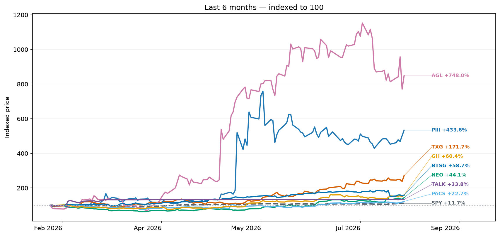

### Last 12 months

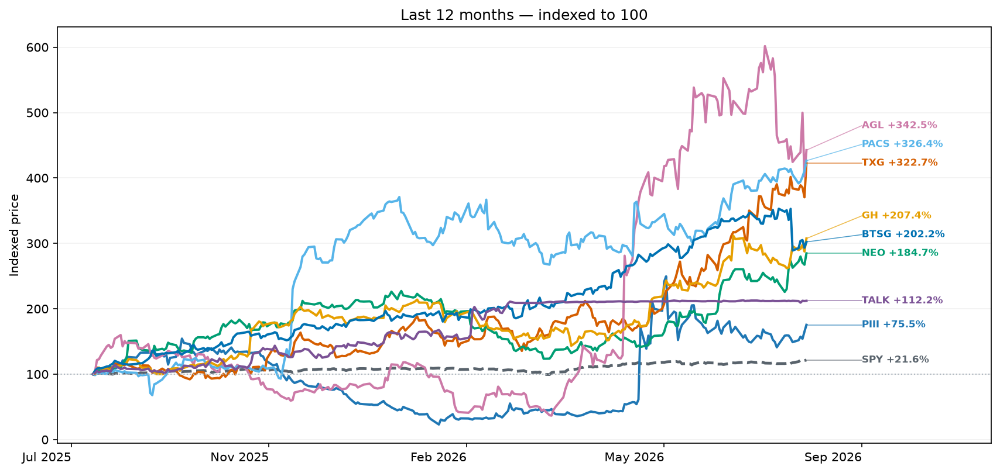

### Last 24 months

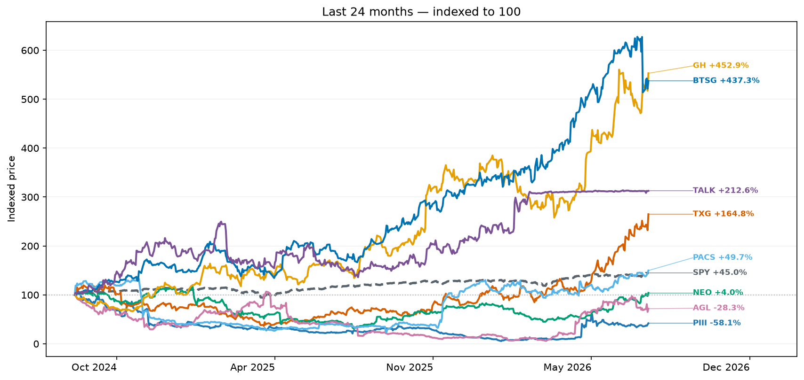

## Current Top Stocks

### Last 3 months

<table class="sortable"><thead><tr><th class="sortable-heading" data-column="0" data-type="number">Rank</th><th class="sortable-heading" data-column="1" data-type="text">Company</th><th class="sortable-heading" data-column="2" data-type="text">Ticker</th><th class="sortable-heading" data-column="3" data-type="number">Market cap</th><th class="sortable-heading" data-column="4" data-type="number">Return</th></tr></thead><tbody><tr><td class="" data-sort="1" style="">1</td><td class="text" data-sort="p3 health" style="">P3 Health</td><td class="text text" data-sort="piii" style=""><a href="#company-piii">PIII</a></td><td class="" data-sort="32693184.14" style="">$32.7M</td><td class="" data-sort="2.26390259026" style="background:#1a7a3c;color:#ffffff;">+226.4%</td></tr><tr><td class="" data-sort="2" style="">2</td><td class="text" data-sort="10x genomics" style=""><a href="#earnings-txg">10x Genomics</a></td><td class="text text" data-sort="txg" style=""><a href="#company-txg">TXG</a></td><td class="" data-sort="6076123205.54" style="">$6.1B</td><td class="" data-sort="1.4087962963" style="background:#2f9e44;color:#111820;">+140.9%</td></tr><tr><td class="" data-sort="3" style="">3</td><td class="text" data-sort="neogenomics" style="">NeoGenomics</td><td class="text text" data-sort="neo" style=""><a href="#company-neo">NEO</a></td><td class="" data-sort="2092864917.6" style="">$2.1B</td><td class="" data-sort="0.849330357143" style="background:#a9d9a4;color:#111820;">+84.9%</td></tr><tr><td class="" data-sort="4" style="">4</td><td class="text" data-sort="agilon health" style=""><a href="#earnings-agl">Agilon Health</a></td><td class="text text" data-sort="agl" style=""><a href="#company-agl">AGL</a></td><td class="" data-sort="2073627800.0" style="">$2.1B</td><td class="" data-sort="0.761202286557" style="background:#a9d9a4;color:#111820;">+76.1%</td></tr><tr><td class="" data-sort="5" style="">5</td><td class="text" data-sort="guardant health" style="">Guardant Health</td><td class="text text" data-sort="gh" style=""><a href="#company-gh">GH</a></td><td class="" data-sort="21443206004.3" style="">$21.4B</td><td class="" data-sort="0.760501567398" style="background:#a9d9a4;color:#111820;">+76.1%</td></tr></tbody></table>

### Last 12 months

<table class="sortable"><thead><tr><th class="sortable-heading" data-column="0" data-type="number">Rank</th><th class="sortable-heading" data-column="1" data-type="text">Company</th><th class="sortable-heading" data-column="2" data-type="text">Ticker</th><th class="sortable-heading" data-column="3" data-type="number">Market cap</th><th class="sortable-heading" data-column="4" data-type="number">Return</th></tr></thead><tbody><tr><td class="" data-sort="1" style="">1</td><td class="text" data-sort="agilon health" style=""><a href="#earnings-agl">Agilon Health</a></td><td class="text text" data-sort="agl" style=""><a href="#company-agl">AGL</a></td><td class="" data-sort="2073627800.0" style="">$2.1B</td><td class="" data-sort="3.37316849817" style="background:#1a7a3c;color:#ffffff;">+337.3%</td></tr><tr><td class="" data-sort="2" style="">2</td><td class="text" data-sort="pacs group" style=""><a href="#earnings-pacs">PACS Group</a></td><td class="text text" data-sort="pacs" style=""><a href="#company-pacs">PACS</a></td><td class="" data-sort="7282112019.76" style="">$7.3B</td><td class="" data-sort="3.34829443447" style="background:#1a7a3c;color:#ffffff;">+334.8%</td></tr><tr><td class="" data-sort="3" style="">3</td><td class="text" data-sort="10x genomics" style=""><a href="#earnings-txg">10x Genomics</a></td><td class="text text" data-sort="txg" style=""><a href="#company-txg">TXG</a></td><td class="" data-sort="6076123205.54" style="">$6.1B</td><td class="" data-sort="3.23352318959" style="background:#1a7a3c;color:#ffffff;">+323.4%</td></tr><tr><td class="" data-sort="4" style="">4</td><td class="text" data-sort="guardant health" style="">Guardant Health</td><td class="text text" data-sort="gh" style=""><a href="#company-gh">GH</a></td><td class="" data-sort="21443206004.3" style="">$21.4B</td><td class="" data-sort="2.10676747188" style="background:#2f9e44;color:#111820;">+210.7%</td></tr><tr><td class="" data-sort="5" style="">5</td><td class="text" data-sort="brightspring health services" style="">BrightSpring Health Services</td><td class="text text" data-sort="btsg" style=""><a href="#company-btsg">BTSG</a></td><td class="" data-sort="12419938407.6" style="">$12.4B</td><td class="" data-sort="2.00433108758" style="background:#7cc077;color:#111820;">+200.4%</td></tr></tbody></table>

### Last 24 months

<table class="sortable"><thead><tr><th class="sortable-heading" data-column="0" data-type="number">Rank</th><th class="sortable-heading" data-column="1" data-type="text">Company</th><th class="sortable-heading" data-column="2" data-type="text">Ticker</th><th class="sortable-heading" data-column="3" data-type="number">Market cap</th><th class="sortable-heading" data-column="4" data-type="number">Return</th></tr></thead><tbody><tr><td class="" data-sort="1" style="">1</td><td class="text" data-sort="guardant health" style="">Guardant Health</td><td class="text text" data-sort="gh" style=""><a href="#company-gh">GH</a></td><td class="" data-sort="21443206004.3" style="">$21.4B</td><td class="" data-sort="4.80965517241" style="background:#1a7a3c;color:#ffffff;">+481.0%</td></tr><tr><td class="" data-sort="2" style="">2</td><td class="text" data-sort="brightspring health services" style="">BrightSpring Health Services</td><td class="text text" data-sort="btsg" style=""><a href="#company-btsg">BTSG</a></td><td class="" data-sort="12419938407.6" style="">$12.4B</td><td class="" data-sort="4.40987868284" style="background:#1a7a3c;color:#ffffff;">+441.0%</td></tr><tr><td class="" data-sort="3" style="">3</td><td class="text" data-sort="talkspace" style="">Talkspace</td><td class="text text" data-sort="talk" style=""><a href="#company-talk">TALK</a></td><td class="" data-sort="874415594.52" style="">$874.4M</td><td class="" data-sort="2.08875739645" style="background:#7cc077;color:#111820;">+208.9%</td></tr><tr><td class="" data-sort="4" style="">4</td><td class="text" data-sort="natera" style=""><a href="#earnings-ntra">Natera</a></td><td class="text text" data-sort="ntra" style=""><a href="#company-ntra">NTRA</a></td><td class="" data-sort="39411440972.6" style="">$39.4B</td><td class="" data-sort="1.81138168805" style="background:#a9d9a4;color:#111820;">+181.1%</td></tr><tr><td class="" data-sort="5" style="">5</td><td class="text" data-sort="clover health" style=""><a href="#earnings-clov">Clover Health</a></td><td class="text text" data-sort="clov" style=""><a href="#company-clov">CLOV</a></td><td class="" data-sort="2196273631.08" style="">$2.2B</td><td class="" data-sort="1.55913978495" style="background:#a9d9a4;color:#111820;">+155.9%</td></tr></tbody></table>

## Companies by Subcategory

<h3 id="category-payers"><a href="#subcategory-performance">Payers</a>Last 3m: +8.3%</h3>

<table class="sortable"><thead><tr><th class="sortable-heading" data-column="0" data-type="text">Company</th><th class="sortable-heading" data-column="1" data-type="text">Ticker</th><th class="sortable-heading" data-column="2" data-type="number">Market cap</th><th class="sortable-heading" data-column="3" data-type="number">3m Return</th><th class="sortable-heading" data-column="4" data-type="number">12m Return</th><th class="sortable-heading" data-column="5" data-type="number">24m Return</th></tr></thead><tbody><tr><td class="text" data-sort="unitedhealth" style="">UnitedHealth</td><td class="text text" data-sort="unh" style=""><a href="#company-unh">UNH</a></td><td class="" data-sort="380076600000.0" style="">$380.1B</td><td class="" data-sort="0.0713195431338" style="background:#d6ecd4;color:#111820;">+7.1%</td><td class="" data-sort="0.62254374427" style="background:#a9d9a4;color:#111820;">+62.3%</td><td class="" data-sort="-0.271458228936" style="background:#fbd5d4;color:#111820;">-27.1%</td></tr><tr><td class="text" data-sort="cvs health" style=""><a href="#earnings-cvs">CVS Health</a></td><td class="text text" data-sort="cvs" style=""><a href="#company-cvs">CVS</a></td><td class="" data-sort="135133460000.0" style="">$135.1B</td><td class="" data-sort="0.0568746548868" style="background:#d6ecd4;color:#111820;">+5.7%</td><td class="" data-sort="0.46017699115" style="background:#a9d9a4;color:#111820;">+46.0%</td><td class="" data-sort="0.675713535283" style="background:#7cc077;color:#111820;">+67.6%</td></tr><tr><td class="text" data-sort="humana" style="">Humana</td><td class="text text" data-sort="hum" style=""><a href="#company-hum">HUM</a></td><td class="" data-sort="43692420868.9" style="">$43.7B</td><td class="" data-sort="0.400203665988" style="background:#2f9e44;color:#111820;">+40.0%</td><td class="" data-sort="0.443677816109" style="background:#a9d9a4;color:#111820;">+44.4%</td><td class="" data-sort="0.0973975999772" style="background:#d6ecd4;color:#111820;">+9.7%</td></tr><tr><td class="text" data-sort="oscar health" style=""><a href="#earnings-oscr">Oscar Health</a></td><td class="text text" data-sort="oscr" style=""><a href="#company-oscr">OSCR</a></td><td class="" data-sort="9412611460.0" style="">$9.4B</td><td class="" data-sort="0.309244486157" style="background:#7cc077;color:#111820;">+30.9%</td><td class="" data-sort="0.804657179819" style="background:#7cc077;color:#111820;">+80.5%</td><td class="" data-sort="0.545706371191" style="background:#a9d9a4;color:#111820;">+54.6%</td></tr><tr><td class="text" data-sort="molina healthcare" style="">Molina Healthcare</td><td class="text text" data-sort="moh" style=""><a href="#company-moh">MOH</a></td><td class="" data-sort="10211364000.0" style="">$10.2B</td><td class="" data-sort="0.0565236097666" style="background:#d6ecd4;color:#111820;">+5.7%</td><td class="" data-sort="0.252071383047" style="background:#d6ecd4;color:#111820;">+25.2%</td><td class="" data-sort="-0.419096339228" style="background:#f5aead;color:#111820;">-41.9%</td></tr><tr><td class="text" data-sort="cigna" style="">Cigna</td><td class="text text" data-sort="ci" style=""><a href="#company-ci">CI</a></td><td class="" data-sort="73736307618.3" style="">$73.7B</td><td class="" data-sort="-0.0193362493925" style="background:#fbd5d4;color:#111820;">-1.9%</td><td class="" data-sort="0.0276100400146" style="background:#d6ecd4;color:#111820;">+2.8%</td><td class="" data-sort="-0.159606116499" style="background:#fbd5d4;color:#111820;">-16.0%</td></tr><tr><td class="text" data-sort="elevance" style="">Elevance</td><td class="text text" data-sort="elv" style=""><a href="#company-elv">ELV</a></td><td class="" data-sort="81508153953.6" style="">$81.5B</td><td class="" data-sort="0.0426640569207" style="background:#d6ecd4;color:#111820;">+4.3%</td><td class="" data-sort="0.340861934079" style="background:#a9d9a4;color:#111820;">+34.1%</td><td class="" data-sort="-0.259120040596" style="background:#fbd5d4;color:#111820;">-25.9%</td></tr><tr><td class="text" data-sort="clover health" style=""><a href="#earnings-clov">Clover Health</a></td><td class="text text" data-sort="clov" style=""><a href="#company-clov">CLOV</a></td><td class="" data-sort="2196273631.08" style="">$2.2B</td><td class="" data-sort="0.525641025641" style="background:#1a7a3c;color:#ffffff;">+52.6%</td><td class="" data-sort="1.18348623853" style="background:#2f9e44;color:#111820;">+118.3%</td><td class="" data-sort="1.55913978495" style="background:#1a7a3c;color:#ffffff;">+155.9%</td></tr><tr><td class="text" data-sort="centene" style="">Centene</td><td class="text text" data-sort="cnc" style=""><a href="#company-cnc">CNC</a></td><td class="" data-sort="30736368900.0" style="">$30.7B</td><td class="" data-sort="0.17530378842" style="background:#a9d9a4;color:#111820;">+17.5%</td><td class="" data-sort="1.57014458773" style="background:#1a7a3c;color:#ffffff;">+157.0%</td><td class="" data-sort="-0.134605263158" style="background:#fbd5d4;color:#111820;">-13.5%</td></tr><tr><td class="text" data-sort="alignment health" style="">Alignment Health</td><td class="text text" data-sort="alhc" style=""><a href="#company-alhc">ALHC</a></td><td class="" data-sort="3080411962.65" style="">$3.1B</td><td class="" data-sort="-0.198549916341" style="background:#f5aead;color:#111820;">-19.9%</td><td class="" data-sort="-0.00964851826327" style="background:#fbd5d4;color:#111820;">-1.0%</td><td class="" data-sort="0.667053364269" style="background:#7cc077;color:#111820;">+66.7%</td></tr></tbody></table>

<h3 id="category-health-system-providers"><a href="#subcategory-performance">Health System Providers</a>Last 3m: +3.2%</h3>

<table class="sortable"><thead><tr><th class="sortable-heading" data-column="0" data-type="text">Company</th><th class="sortable-heading" data-column="1" data-type="text">Ticker</th><th class="sortable-heading" data-column="2" data-type="number">Market cap</th><th class="sortable-heading" data-column="3" data-type="number">3m Return</th><th class="sortable-heading" data-column="4" data-type="number">12m Return</th><th class="sortable-heading" data-column="5" data-type="number">24m Return</th></tr></thead><tbody><tr><td class="text" data-sort="hca healthcare" style="">HCA Healthcare</td><td class="text text" data-sort="hca" style=""><a href="#company-hca">HCA</a></td><td class="" data-sort="87161338885.0" style="">$87.2B</td><td class="" data-sort="-0.0501619982077" style="background:#fbd5d4;color:#111820;">-5.0%</td><td class="" data-sort="0.0832001257829" style="background:#d6ecd4;color:#111820;">+8.3%</td><td class="" data-sort="0.145358825159" style="background:#d6ecd4;color:#111820;">+14.5%</td></tr><tr><td class="text" data-sort="tenet health" style="">Tenet Health</td><td class="text text" data-sort="thc" style=""><a href="#company-thc">THC</a></td><td class="" data-sort="20514630820.0" style="">$20.5B</td><td class="" data-sort="0.376877823301" style="background:#1a7a3c;color:#ffffff;">+37.7%</td><td class="" data-sort="0.583101823892" style="background:#1a7a3c;color:#ffffff;">+58.3%</td><td class="" data-sort="0.746834599494" style="background:#1a7a3c;color:#ffffff;">+74.7%</td></tr><tr><td class="text" data-sort="universal health services" style="">Universal Health Services</td><td class="text text" data-sort="uhs" style=""><a href="#company-uhs">UHS</a></td><td class="" data-sort="10196742962.4" style="">$10.2B</td><td class="" data-sort="0.0210637797129" style="background:#d6ecd4;color:#111820;">+2.1%</td><td class="" data-sort="0.0071967498549" style="background:#d6ecd4;color:#111820;">+0.7%</td><td class="" data-sort="-0.193662299043" style="background:#f5aead;color:#111820;">-19.4%</td></tr><tr><td class="text" data-sort="community health systems" style="">Community Health Systems</td><td class="text text" data-sort="cyh" style=""><a href="#company-cyh">CYH</a></td><td class="" data-sort="417387696.72" style="">$417.4M</td><td class="" data-sort="0.0752688172043" style="background:#d6ecd4;color:#111820;">+7.5%</td><td class="" data-sort="0.204819277108" style="background:#a9d9a4;color:#111820;">+20.5%</td><td class="" data-sort="-0.380165289256" style="background:#ee8483;color:#111820;">-38.0%</td></tr><tr><td class="text" data-sort="ardent health partners" style=""><a href="#earnings-ardt">Ardent Health Partners</a></td><td class="text text" data-sort="ardt" style=""><a href="#company-ardt">ARDT</a></td><td class="" data-sort="1541012833.25" style="">$1.5B</td><td class="" data-sort="0.142433234421" style="background:#a9d9a4;color:#111820;">+14.2%</td><td class="" data-sort="-0.0285954583684" style="background:#fbd5d4;color:#111820;">-2.9%</td><td class="" data-sort="-0.261508951407" style="background:#f5aead;color:#111820;">-26.2%</td></tr></tbody></table>

<h3 id="category-inpatient-non-acute-providers"><a href="#subcategory-performance">Inpatient Non-Acute Providers</a>Last 3m: +21.0%</h3>

<table class="sortable"><thead><tr><th class="sortable-heading" data-column="0" data-type="text">Company</th><th class="sortable-heading" data-column="1" data-type="text">Ticker</th><th class="sortable-heading" data-column="2" data-type="number">Market cap</th><th class="sortable-heading" data-column="3" data-type="number">3m Return</th><th class="sortable-heading" data-column="4" data-type="number">12m Return</th><th class="sortable-heading" data-column="5" data-type="number">24m Return</th></tr></thead><tbody><tr><td class="text" data-sort="the ensign group" style="">The Ensign Group</td><td class="text text" data-sort="ensg" style=""><a href="#company-ensg">ENSG</a></td><td class="" data-sort="10383598441.4" style="">$10.4B</td><td class="" data-sort="0.0671916010499" style="background:#d6ecd4;color:#111820;">+6.7%</td><td class="" data-sort="0.139077382805" style="background:#d6ecd4;color:#111820;">+13.9%</td><td class="" data-sort="0.295362831858" style="background:#7cc077;color:#111820;">+29.5%</td></tr><tr><td class="text" data-sort="acadia healthcare" style="">Acadia Healthcare</td><td class="text text" data-sort="achc" style=""><a href="#company-achc">ACHC</a></td><td class="" data-sort="2757630145.5" style="">$2.8B</td><td class="" data-sort="0.252184273233" style="background:#7cc077;color:#111820;">+25.2%</td><td class="" data-sort="0.638773388773" style="background:#d6ecd4;color:#111820;">+63.9%</td><td class="" data-sort="-0.559513830679" style="background:#c0302f;color:#ffffff;">-56.0%</td></tr><tr><td class="text" data-sort="encompass health" style=""><a href="#earnings-ehc">Encompass Health</a></td><td class="text text" data-sort="ehc" style=""><a href="#company-ehc">EHC</a></td><td class="" data-sort="11018041815.6" style="">$11.0B</td><td class="" data-sort="0.180301602262" style="background:#7cc077;color:#111820;">+18.0%</td><td class="" data-sort="0.0650620853887" style="background:#d6ecd4;color:#111820;">+6.5%</td><td class="" data-sort="0.460919272049" style="background:#1a7a3c;color:#ffffff;">+46.1%</td></tr><tr><td class="text" data-sort="pacs group" style=""><a href="#earnings-pacs">PACS Group</a></td><td class="text text" data-sort="pacs" style=""><a href="#company-pacs">PACS</a></td><td class="" data-sort="7282112019.76" style="">$7.3B</td><td class="" data-sort="0.442095861864" style="background:#1a7a3c;color:#ffffff;">+44.2%</td><td class="" data-sort="3.34829443447" style="background:#1a7a3c;color:#ffffff;">+334.8%</td><td class="" data-sort="0.479083969466" style="background:#1a7a3c;color:#ffffff;">+47.9%</td></tr></tbody></table>

<h3 id="category-health-care-real-estate"><a href="#subcategory-performance">Health Care Real Estate</a>Last 3m: +8.3%</h3>

<table class="sortable"><thead><tr><th class="sortable-heading" data-column="0" data-type="text">Company</th><th class="sortable-heading" data-column="1" data-type="text">Ticker</th><th class="sortable-heading" data-column="2" data-type="number">Market cap</th><th class="sortable-heading" data-column="3" data-type="number">3m Return</th><th class="sortable-heading" data-column="4" data-type="number">12m Return</th><th class="sortable-heading" data-column="5" data-type="number">24m Return</th></tr></thead><tbody><tr><td class="text" data-sort="healthpeak properties" style=""><a href="#earnings-doc">Healthpeak properties</a></td><td class="text text" data-sort="doc" style=""><a href="#company-doc">DOC</a></td><td class="" data-sort="15050032094.7" style="">$15.1B</td><td class="" data-sort="0.0901221995927" style="background:#1a7a3c;color:#ffffff;">+9.0%</td><td class="" data-sort="0.262382075472" style="background:#2f9e44;color:#111820;">+26.2%</td><td class="" data-sort="-0.0101710587147" style="background:#fbd5d4;color:#111820;">-1.0%</td></tr><tr><td class="text" data-sort="ventas, inc" style="">Ventas, Inc</td><td class="text text" data-sort="vtr" style=""><a href="#company-vtr">VTR</a></td><td class="" data-sort="47965614030.1" style="">$48.0B</td><td class="" data-sort="0.0699060279624" style="background:#2f9e44;color:#111820;">+7.0%</td><td class="" data-sort="0.361528365174" style="background:#1a7a3c;color:#ffffff;">+36.2%</td><td class="" data-sort="0.572511369378" style="background:#7cc077;color:#111820;">+57.3%</td></tr><tr><td class="text" data-sort="medical properties trust" style="">Medical Properties Trust</td><td class="text text" data-sort="mpt" style=""><a href="#company-mpt">MPT</a></td><td class="" data-sort="2769203000.0" style="">$2.8B</td><td class="" data-sort="-0.0909090909091" style="background:#c0302f;color:#ffffff;">-9.1%</td><td class="missing" data-sort="—" style="background:#f0efec;color:#111820;">—</td><td class="missing" data-sort="—" style="background:#f0efec;color:#111820;">—</td></tr><tr><td class="text" data-sort="national health investors" style="">National Health Investors</td><td class="text text" data-sort="nhi" style=""><a href="#company-nhi">NHI</a></td><td class="" data-sort="3715308205.35" style="">$3.7B</td><td class="" data-sort="0.000531490831783" style="background:#d6ecd4;color:#111820;">+0.1%</td><td class="" data-sort="0.00507207688201" style="background:#d6ecd4;color:#111820;">+0.5%</td><td class="" data-sort="0.0069537309441" style="background:#d6ecd4;color:#111820;">+0.7%</td></tr><tr><td class="text" data-sort="omega healthcare investors" style="">Omega Healthcare Investors</td><td class="text text" data-sort="ohi" style=""><a href="#company-ohi">OHI</a></td><td class="" data-sort="15143989930.0" style="">$15.1B</td><td class="" data-sort="0.0269124814579" style="background:#a9d9a4;color:#111820;">+2.7%</td><td class="" data-sort="0.213016270338" style="background:#7cc077;color:#111820;">+21.3%</td><td class="" data-sort="0.27358738502" style="background:#a9d9a4;color:#111820;">+27.4%</td></tr><tr><td class="text" data-sort="welltower" style="">Welltower</td><td class="text text" data-sort="well" style=""><a href="#company-well">WELL</a></td><td class="" data-sort="166862860587.0" style="">$166.9B</td><td class="" data-sort="0.103853142618" style="background:#1a7a3c;color:#ffffff;">+10.4%</td><td class="" data-sort="0.409986311968" style="background:#1a7a3c;color:#ffffff;">+41.0%</td><td class="" data-sort="1.01805792164" style="background:#1a7a3c;color:#ffffff;">+101.8%</td></tr><tr><td class="text" data-sort="caretrust reit" style=""><a href="#earnings-ctre">CareTrust REIT</a></td><td class="text text" data-sort="ctre" style=""><a href="#company-ctre">CTRE</a></td><td class="" data-sort="9648051197.4" style="">$9.6B</td><td class="" data-sort="-0.00913461538462" style="background:#fbd5d4;color:#111820;">-0.9%</td><td class="" data-sort="0.252887537994" style="background:#2f9e44;color:#111820;">+25.3%</td><td class="" data-sort="0.481135465325" style="background:#7cc077;color:#111820;">+48.1%</td></tr><tr><td class="text" data-sort="sabra health care reit" style=""><a href="#earnings-sbra">Sabra Health Care REIT</a></td><td class="text text" data-sort="sbra" style=""><a href="#company-sbra">SBRA</a></td><td class="" data-sort="5277860538.96" style="">$5.3B</td><td class="" data-sort="0.0139759036145" style="background:#d6ecd4;color:#111820;">+1.4%</td><td class="" data-sort="0.123931623932" style="background:#a9d9a4;color:#111820;">+12.4%</td><td class="" data-sort="0.26139088729" style="background:#a9d9a4;color:#111820;">+26.1%</td></tr></tbody></table>

<h3 id="category-value-based-care"><a href="#subcategory-performance">Value-Based Care</a>Last 3m: +19.4%</h3>

<table class="sortable"><thead><tr><th class="sortable-heading" data-column="0" data-type="text">Company</th><th class="sortable-heading" data-column="1" data-type="text">Ticker</th><th class="sortable-heading" data-column="2" data-type="number">Market cap</th><th class="sortable-heading" data-column="3" data-type="number">3m Return</th><th class="sortable-heading" data-column="4" data-type="number">12m Return</th><th class="sortable-heading" data-column="5" data-type="number">24m Return</th></tr></thead><tbody><tr><td class="text" data-sort="privia health group" style=""><a href="#earnings-prva">Privia Health Group</a></td><td class="text text" data-sort="prva" style=""><a href="#company-prva">PRVA</a></td><td class="" data-sort="2982712892.58" style="">$3.0B</td><td class="" data-sort="-0.0264527320035" style="background:#fbd5d4;color:#111820;">-2.6%</td><td class="" data-sort="0.0908649173955" style="background:#d6ecd4;color:#111820;">+9.1%</td><td class="" data-sort="0.177241740954" style="background:#a9d9a4;color:#111820;">+17.7%</td></tr><tr><td class="text" data-sort="astrana health" style="">Astrana Health</td><td class="text text" data-sort="asth" style=""><a href="#company-asth">ASTH</a></td><td class="" data-sort="1763186344.08" style="">$1.8B</td><td class="" data-sort="-0.0900763358779" style="background:#fbd5d4;color:#111820;">-9.0%</td><td class="" data-sort="0.273504273504" style="background:#d6ecd4;color:#111820;">+27.4%</td><td class="" data-sort="-0.253600500939" style="background:#f5aead;color:#111820;">-25.4%</td></tr><tr><td class="text" data-sort="agilon health" style=""><a href="#earnings-agl">Agilon Health</a></td><td class="text text" data-sort="agl" style=""><a href="#company-agl">AGL</a></td><td class="" data-sort="2073627800.0" style="">$2.1B</td><td class="" data-sort="0.761202286557" style="background:#a9d9a4;color:#111820;">+76.1%</td><td class="" data-sort="3.37316849817" style="background:#1a7a3c;color:#ffffff;">+337.3%</td><td class="" data-sort="-0.307898550725" style="background:#f5aead;color:#111820;">-30.8%</td></tr><tr><td class="text" data-sort="evolent health" style=""><a href="#earnings-evh">Evolent Health</a></td><td class="text text" data-sort="evh" style=""><a href="#company-evh">EVH</a></td><td class="" data-sort="347566497.03" style="">$347.6M</td><td class="" data-sort="-0.055023923445" style="background:#fbd5d4;color:#111820;">-5.5%</td><td class="" data-sort="-0.561111111111" style="background:#fbd5d4;color:#111820;">-56.1%</td><td class="" data-sort="-0.850378787879" style="background:#c0302f;color:#ffffff;">-85.0%</td></tr><tr><td class="text" data-sort="p3 health" style="">P3 Health</td><td class="text text" data-sort="piii" style=""><a href="#company-piii">PIII</a></td><td class="" data-sort="32693184.14" style="">$32.7M</td><td class="" data-sort="2.26390259026" style="background:#1a7a3c;color:#ffffff;">+226.4%</td><td class="" data-sort="0.728358208955" style="background:#a9d9a4;color:#111820;">+72.8%</td><td class="" data-sort="-0.618325642716" style="background:#e34948;color:#111820;">-61.8%</td></tr></tbody></table>

<h3 id="category-outpatient-and-home-providers"><a href="#subcategory-performance">Outpatient and Home Providers</a>Last 3m: +12.7%</h3>

<table class="sortable"><thead><tr><th class="sortable-heading" data-column="0" data-type="text">Company</th><th class="sortable-heading" data-column="1" data-type="text">Ticker</th><th class="sortable-heading" data-column="2" data-type="number">Market cap</th><th class="sortable-heading" data-column="3" data-type="number">3m Return</th><th class="sortable-heading" data-column="4" data-type="number">12m Return</th><th class="sortable-heading" data-column="5" data-type="number">24m Return</th></tr></thead><tbody><tr><td class="text" data-sort="davita" style=""><a href="#earnings-dva">Davita</a></td><td class="text text" data-sort="dva" style=""><a href="#company-dva">DVA</a></td><td class="" data-sort="15410176650.0" style="">$15.4B</td><td class="" data-sort="-0.074905612887" style="background:#fbd5d4;color:#111820;">-7.5%</td><td class="" data-sort="0.419073359073" style="background:#a9d9a4;color:#111820;">+41.9%</td><td class="" data-sort="0.309836065574" style="background:#d6ecd4;color:#111820;">+31.0%</td></tr><tr><td class="text" data-sort="fresenius" style=""><a href="#earnings-fms">Fresenius</a></td><td class="text text" data-sort="fms" style=""><a href="#company-fms">FMS</a></td><td class="" data-sort="13782736811.6" style="">$13.8B</td><td class="" data-sort="0.101679527916" style="background:#a9d9a4;color:#111820;">+10.2%</td><td class="" data-sort="0.00830909846282" style="background:#d6ecd4;color:#111820;">+0.8%</td><td class="" data-sort="0.320457018498" style="background:#d6ecd4;color:#111820;">+32.0%</td></tr><tr><td class="text" data-sort="surgery partners" style="">Surgery Partners</td><td class="text text" data-sort="sgry" style=""><a href="#company-sgry">SGRY</a></td><td class="" data-sort="2014137694.8" style="">$2.0B</td><td class="" data-sort="0.0754847645429" style="background:#d6ecd4;color:#111820;">+7.5%</td><td class="" data-sort="-0.343062605753" style="background:#fbd5d4;color:#111820;">-34.3%</td><td class="" data-sort="-0.477807666443" style="background:#fbd5d4;color:#111820;">-47.8%</td></tr><tr><td class="text" data-sort="option care health" style="">Option Care Health</td><td class="text text" data-sort="opch" style=""><a href="#company-opch">OPCH</a></td><td class="" data-sort="3449554146.29" style="">$3.4B</td><td class="" data-sort="0.159921989274" style="background:#a9d9a4;color:#111820;">+16.0%</td><td class="" data-sort="-0.156382978723" style="background:#fbd5d4;color:#111820;">-15.6%</td><td class="" data-sort="-0.202747989276" style="background:#fbd5d4;color:#111820;">-20.3%</td></tr><tr><td class="text" data-sort="lifestance health" style=""><a href="#earnings-lfst">Lifestance Health</a></td><td class="text text" data-sort="lfst" style=""><a href="#company-lfst">LFST</a></td><td class="" data-sort="4001624847.36" style="">$4.0B</td><td class="" data-sort="0.407792207792" style="background:#1a7a3c;color:#ffffff;">+40.8%</td><td class="" data-sort="1.48054919908" style="background:#2f9e44;color:#111820;">+148.1%</td><td class="" data-sort="0.935714285714" style="background:#a9d9a4;color:#111820;">+93.6%</td></tr><tr><td class="text" data-sort="chemed (vitas)" style="">Chemed (Vitas)</td><td class="text text" data-sort="che" style=""><a href="#company-che">CHE</a></td><td class="" data-sort="7054119350.92" style="">$7.1B</td><td class="" data-sort="0.302786027436" style="background:#2f9e44;color:#111820;">+30.3%</td><td class="" data-sort="0.269657501206" style="background:#d6ecd4;color:#111820;">+27.0%</td><td class="" data-sort="-0.0471330552012" style="background:#fbd5d4;color:#111820;">-4.7%</td></tr><tr><td class="text" data-sort="addus homecare" style=""><a href="#earnings-adus">Addus HomeCare</a></td><td class="text text" data-sort="adus" style=""><a href="#company-adus">ADUS</a></td><td class="" data-sort="2121438440.16" style="">$2.1B</td><td class="" data-sort="0.201968464397" style="background:#7cc077;color:#111820;">+20.2%</td><td class="" data-sort="0.0861239676922" style="background:#d6ecd4;color:#111820;">+8.6%</td><td class="" data-sort="-0.0397175639894" style="background:#fbd5d4;color:#111820;">-4.0%</td></tr><tr><td class="text" data-sort="pennant group" style=""><a href="#earnings-pntg">Pennant Group</a></td><td class="text text" data-sort="pntg" style=""><a href="#company-pntg">PNTG</a></td><td class="" data-sort="1342375375.77" style="">$1.3B</td><td class="" data-sort="0.0863509749304" style="background:#a9d9a4;color:#111820;">+8.6%</td><td class="" data-sort="0.5" style="background:#a9d9a4;color:#111820;">+50.0%</td><td class="" data-sort="0.287553648069" style="background:#d6ecd4;color:#111820;">+28.8%</td></tr><tr><td class="text" data-sort="us physical therapy" style=""><a href="#earnings-usph">US Physical Therapy</a></td><td class="text text" data-sort="usph" style=""><a href="#company-usph">USPH</a></td><td class="" data-sort="1154497333.54" style="">$1.2B</td><td class="" data-sort="0.35014336313" style="background:#1a7a3c;color:#ffffff;">+35.0%</td><td class="" data-sort="-0.0870209854015" style="background:#fbd5d4;color:#111820;">-8.7%</td><td class="" data-sort="-0.0940470801268" style="background:#fbd5d4;color:#111820;">-9.4%</td></tr><tr><td class="text" data-sort="brightspring health services" style="">BrightSpring Health Services</td><td class="text text" data-sort="btsg" style=""><a href="#company-btsg">BTSG</a></td><td class="" data-sort="12419938407.6" style="">$12.4B</td><td class="" data-sort="0.138610249863" style="background:#a9d9a4;color:#111820;">+13.9%</td><td class="" data-sort="2.00433108758" style="background:#1a7a3c;color:#ffffff;">+200.4%</td><td class="" data-sort="4.40987868284" style="background:#1a7a3c;color:#ffffff;">+441.0%</td></tr><tr><td class="text" data-sort="aveanna healthcare" style="">Aveanna Healthcare</td><td class="text text" data-sort="avah" style=""><a href="#company-avah">AVAH</a></td><td class="" data-sort="2038188700.08" style="">$2.0B</td><td class="" data-sort="0.408011869436" style="background:#1a7a3c;color:#ffffff;">+40.8%</td><td class="" data-sort="0.545602605863" style="background:#a9d9a4;color:#111820;">+54.6%</td><td class="" data-sort="1.01486199575" style="background:#a9d9a4;color:#111820;">+101.5%</td></tr></tbody></table>

<h3 id="category-digital-health-specialty-benefits"><a href="#subcategory-performance">Digital Health, Specialty, Benefits</a>Last 3m: +22.5%</h3>

<table class="sortable"><thead><tr><th class="sortable-heading" data-column="0" data-type="text">Company</th><th class="sortable-heading" data-column="1" data-type="text">Ticker</th><th class="sortable-heading" data-column="2" data-type="number">Market cap</th><th class="sortable-heading" data-column="3" data-type="number">3m Return</th><th class="sortable-heading" data-column="4" data-type="number">12m Return</th><th class="sortable-heading" data-column="5" data-type="number">24m Return</th></tr></thead><tbody><tr><td class="text" data-sort="teladoc" style="">Teladoc</td><td class="text text" data-sort="tdoc" style=""><a href="#company-tdoc">TDOC</a></td><td class="" data-sort="1219099780.91" style="">$1.2B</td><td class="" data-sort="-0.0165517241379" style="background:#fbd5d4;color:#111820;">-1.7%</td><td class="" data-sort="0.0244252873563" style="background:#d6ecd4;color:#111820;">+2.4%</td><td class="" data-sort="-0.0027972027972" style="background:#fbd5d4;color:#111820;">-0.3%</td></tr><tr><td class="text" data-sort="amwell" style=""><a href="#earnings-amwl">Amwell</a></td><td class="text text" data-sort="amwl" style=""><a href="#company-amwl">AMWL</a></td><td class="" data-sort="179616192.25" style="">$179.6M</td><td class="" data-sort="0.696361355082" style="background:#1a7a3c;color:#ffffff;">+69.6%</td><td class="" data-sort="0.857142857143" style="background:#2f9e44;color:#111820;">+85.7%</td><td class="" data-sort="0.601895734597" style="background:#a9d9a4;color:#111820;">+60.2%</td></tr><tr><td class="text" data-sort="talkspace" style="">Talkspace</td><td class="text text" data-sort="talk" style=""><a href="#company-talk">TALK</a></td><td class="" data-sort="874415594.52" style="">$874.4M</td><td class="" data-sort="0.00578034682081" style="background:#d6ecd4;color:#111820;">+0.6%</td><td class="" data-sort="1.088" style="background:#1a7a3c;color:#ffffff;">+108.8%</td><td class="" data-sort="2.08875739645" style="background:#1a7a3c;color:#ffffff;">+208.9%</td></tr><tr><td class="text" data-sort="hims &amp; hers" style="">Hims &amp; Hers</td><td class="text text" data-sort="hims" style=""><a href="#company-hims">HIMS</a></td><td class="" data-sort="6427580190.15" style="">$6.4B</td><td class="" data-sort="0.117438981252" style="background:#d6ecd4;color:#111820;">+11.7%</td><td class="" data-sort="-0.391798228725" style="background:#f5aead;color:#111820;">-39.2%</td><td class="" data-sort="0.979323308271" style="background:#7cc077;color:#111820;">+97.9%</td></tr><tr><td class="text" data-sort="lifemd" style="">LifeMD</td><td class="text text" data-sort="lfmd" style=""><a href="#company-lfmd">LFMD</a></td><td class="" data-sort="169268785.0" style="">$169.3M</td><td class="" data-sort="-0.255230125523" style="background:#f5aead;color:#111820;">-25.5%</td><td class="" data-sort="-0.478005865103" style="background:#ee8483;color:#111820;">-47.8%</td><td class="" data-sort="-0.34438305709" style="background:#fbd5d4;color:#111820;">-34.4%</td></tr><tr><td class="text" data-sort="omada health" style=""><a href="#earnings-omda">Omada Health</a></td><td class="text text" data-sort="omda" style=""><a href="#company-omda">OMDA</a></td><td class="" data-sort="1179458378.88" style="">$1.2B</td><td class="" data-sort="0.597165991903" style="background:#1a7a3c;color:#ffffff;">+59.7%</td><td class="" data-sort="0.244479495268" style="background:#a9d9a4;color:#111820;">+24.4%</td><td class="missing" data-sort="—" style="background:#f0efec;color:#111820;">—</td></tr><tr><td class="text" data-sort="goodrx" style=""><a href="#earnings-gdrx">GoodRx</a></td><td class="text text" data-sort="gdrx" style=""><a href="#company-gdrx">GDRX</a></td><td class="" data-sort="1039733395.11" style="">$1.0B</td><td class="" data-sort="0.260273972603" style="background:#a9d9a4;color:#111820;">+26.0%</td><td class="" data-sort="0.0605187319885" style="background:#d6ecd4;color:#111820;">+6.1%</td><td class="" data-sort="-0.48959778086" style="background:#f5aead;color:#111820;">-49.0%</td></tr><tr><td class="text" data-sort="progyny" style=""><a href="#earnings-pgny">Progyny</a></td><td class="text text" data-sort="pgny" style=""><a href="#company-pgny">PGNY</a></td><td class="" data-sort="2465903007.6" style="">$2.5B</td><td class="" data-sort="0.184654300169" style="background:#a9d9a4;color:#111820;">+18.5%</td><td class="" data-sort="0.229759299781" style="background:#a9d9a4;color:#111820;">+23.0%</td><td class="" data-sort="0.300323924109" style="background:#d6ecd4;color:#111820;">+30.0%</td></tr><tr><td class="text" data-sort="concentra group" style=""><a href="#earnings-con">Concentra Group</a></td><td class="text text" data-sort="con" style=""><a href="#company-con">CON</a></td><td class="" data-sort="3982170593.6" style="">$4.0B</td><td class="" data-sort="0.409768211921" style="background:#7cc077;color:#111820;">+41.0%</td><td class="" data-sort="0.575393154487" style="background:#7cc077;color:#111820;">+57.5%</td><td class="" data-sort="0.484742807323" style="background:#a9d9a4;color:#111820;">+48.5%</td></tr><tr><td class="text" data-sort="healthequity" style="">HealthEquity</td><td class="text text" data-sort="hqy" style=""><a href="#company-hqy">HQY</a></td><td class="" data-sort="8775718420.29" style="">$8.8B</td><td class="" data-sort="0.233262611975" style="background:#a9d9a4;color:#111820;">+23.3%</td><td class="" data-sort="0.124449220849" style="background:#d6ecd4;color:#111820;">+12.4%</td><td class="" data-sort="0.470141913728" style="background:#a9d9a4;color:#111820;">+47.0%</td></tr></tbody></table>

<h3 id="category-health-it-and-data"><a href="#subcategory-performance">Health IT and Data</a>Last 3m: -13.9%</h3>

<table class="sortable"><thead><tr><th class="sortable-heading" data-column="0" data-type="text">Company</th><th class="sortable-heading" data-column="1" data-type="text">Ticker</th><th class="sortable-heading" data-column="2" data-type="number">Market cap</th><th class="sortable-heading" data-column="3" data-type="number">3m Return</th><th class="sortable-heading" data-column="4" data-type="number">12m Return</th><th class="sortable-heading" data-column="5" data-type="number">24m Return</th></tr></thead><tbody><tr><td class="text" data-sort="oracle-cerner" style="">Oracle-Cerner</td><td class="text text" data-sort="orcl" style=""><a href="#company-orcl">ORCL</a></td><td class="" data-sort="374086768770.0" style="">$374.1B</td><td class="" data-sort="-0.249706557795" style="background:#e34948;color:#111820;">-25.0%</td><td class="" data-sort="-0.412037592482" style="background:#ee8483;color:#111820;">-41.2%</td><td class="" data-sort="0.113281841587" style="background:#d6ecd4;color:#111820;">+11.3%</td></tr><tr><td class="text" data-sort="veradigm" style="">Veradigm</td><td class="text text" data-sort="mdrx" style=""><a href="#company-mdrx">MDRX</a></td><td class="" data-sort="n/a" style="">n/a</td><td class="" data-sort="0.0762331838565" style="background:#d6ecd4;color:#111820;">+7.6%</td><td class="" data-sort="0.0105263157895" style="background:#d6ecd4;color:#111820;">+1.1%</td><td class="" data-sort="-0.472527472527" style="background:#ee8483;color:#111820;">-47.3%</td></tr><tr><td class="text" data-sort="waystar" style="">Waystar</td><td class="text text" data-sort="way" style=""><a href="#company-way">WAY</a></td><td class="" data-sort="4047809061.76" style="">$4.0B</td><td class="" data-sort="0.133302151543" style="background:#a9d9a4;color:#111820;">+13.3%</td><td class="" data-sort="-0.299508528476" style="background:#f5aead;color:#111820;">-30.0%</td><td class="" data-sort="-0.0106165781952" style="background:#fbd5d4;color:#111820;">-1.1%</td></tr><tr><td class="text" data-sort="solventum" style=""><a href="#earnings-solv">Solventum</a></td><td class="text text" data-sort="solv" style=""><a href="#company-solv">SOLV</a></td><td class="" data-sort="13571702000.0" style="">$13.6B</td><td class="" data-sort="0.130825838103" style="background:#a9d9a4;color:#111820;">+13.1%</td><td class="" data-sort="0.130671753645" style="background:#d6ecd4;color:#111820;">+13.1%</td><td class="" data-sort="0.369532926225" style="background:#7cc077;color:#111820;">+37.0%</td></tr><tr><td class="text" data-sort="phreesia" style="">Phreesia</td><td class="text text" data-sort="phr" style=""><a href="#company-phr">PHR</a></td><td class="" data-sort="663241568.97" style="">$663.2M</td><td class="" data-sort="0.230088495575" style="background:#7cc077;color:#111820;">+23.0%</td><td class="" data-sort="-0.536838208071" style="background:#e34948;color:#111820;">-53.7%</td><td class="" data-sort="-0.458910034602" style="background:#ee8483;color:#111820;">-45.9%</td></tr><tr><td class="text" data-sort="consensus cloud solutions" style=""><a href="#earnings-ccsi">Consensus Cloud Solutions</a></td><td class="text text" data-sort="ccsi" style=""><a href="#company-ccsi">CCSI</a></td><td class="" data-sort="669685380.0" style="">$669.7M</td><td class="" data-sort="0.0335294117647" style="background:#d6ecd4;color:#111820;">+3.4%</td><td class="" data-sort="0.473993288591" style="background:#7cc077;color:#111820;">+47.4%</td><td class="" data-sort="0.768495218923" style="background:#1a7a3c;color:#ffffff;">+76.8%</td></tr><tr><td class="text" data-sort="definitive healthcare" style="">Definitive Healthcare</td><td class="text text" data-sort="dh" style=""><a href="#company-dh">DH</a></td><td class="" data-sort="85548500.0" style="">$85.5M</td><td class="" data-sort="-0.251075889577" style="background:#e34948;color:#111820;">-25.1%</td><td class="" data-sort="-0.815155440415" style="background:#c0302f;color:#ffffff;">-81.5%</td><td class="" data-sort="-0.816580976864" style="background:#c0302f;color:#ffffff;">-81.7%</td></tr><tr><td class="text" data-sort="iqvia" style="">Iqvia</td><td class="text text" data-sort="iqv" style=""><a href="#company-iqv">IQV</a></td><td class="" data-sort="38684292000.0" style="">$38.7B</td><td class="" data-sort="0.335683509597" style="background:#1a7a3c;color:#ffffff;">+33.6%</td><td class="" data-sort="0.327143333704" style="background:#7cc077;color:#111820;">+32.7%</td><td class="" data-sort="0.00517960163389" style="background:#d6ecd4;color:#111820;">+0.5%</td></tr><tr><td class="text" data-sort="health catalyst" style=""><a href="#earnings-hcat">Health Catalyst</a></td><td class="text text" data-sort="hcat" style=""><a href="#company-hcat">HCAT</a></td><td class="" data-sort="154438501.8" style="">$154.4M</td><td class="" data-sort="0.138157894737" style="background:#a9d9a4;color:#111820;">+13.8%</td><td class="" data-sort="-0.388692579505" style="background:#ee8483;color:#111820;">-38.9%</td><td class="" data-sort="-0.73984962406" style="background:#c0302f;color:#ffffff;">-74.0%</td></tr><tr><td class="text" data-sort="doximity" style=""><a href="#earnings-docs">Doximity</a></td><td class="text text" data-sort="docs" style=""><a href="#company-docs">DOCS</a></td><td class="" data-sort="3812680930.62" style="">$3.8B</td><td class="" data-sort="0.0546574287914" style="background:#d6ecd4;color:#111820;">+5.5%</td><td class="" data-sort="-0.588465004506" style="background:#e34948;color:#111820;">-58.8%</td><td class="" data-sort="-0.230337078652" style="background:#f5aead;color:#111820;">-23.0%</td></tr><tr><td class="text" data-sort="veeva systems" style="">Veeva Systems</td><td class="text text" data-sort="veev" style=""><a href="#company-veev">VEEV</a></td><td class="" data-sort="33102693840.0" style="">$33.1B</td><td class="" data-sort="0.385535649874" style="background:#1a7a3c;color:#ffffff;">+38.6%</td><td class="" data-sort="-0.183107078297" style="background:#f5aead;color:#111820;">-18.3%</td><td class="" data-sort="0.233449290875" style="background:#a9d9a4;color:#111820;">+23.3%</td></tr><tr><td class="text" data-sort="omnicell" style="">Omnicell</td><td class="text text" data-sort="omcl" style=""><a href="#company-omcl">OMCL</a></td><td class="" data-sort="1689541469.35" style="">$1.7B</td><td class="" data-sort="-0.159972615244" style="background:#ee8483;color:#111820;">-16.0%</td><td class="" data-sort="0.193966915342" style="background:#a9d9a4;color:#111820;">+19.4%</td><td class="" data-sort="-0.0988984088127" style="background:#fbd5d4;color:#111820;">-9.9%</td></tr></tbody></table>

<h3 id="category-pharma-distribution"><a href="#subcategory-performance">Pharma Distribution</a>Last 3m: +22.0%</h3>

<table class="sortable"><thead><tr><th class="sortable-heading" data-column="0" data-type="text">Company</th><th class="sortable-heading" data-column="1" data-type="text">Ticker</th><th class="sortable-heading" data-column="2" data-type="number">Market cap</th><th class="sortable-heading" data-column="3" data-type="number">3m Return</th><th class="sortable-heading" data-column="4" data-type="number">12m Return</th><th class="sortable-heading" data-column="5" data-type="number">24m Return</th></tr></thead><tbody><tr><td class="text" data-sort="mckesson" style=""><a href="#earnings-mck">McKesson</a></td><td class="text text" data-sort="mck" style=""><a href="#company-mck">MCK</a></td><td class="" data-sort="97224871780.3" style="">$97.2B</td><td class="" data-sort="0.181350106645" style="background:#a9d9a4;color:#111820;">+18.1%</td><td class="" data-sort="0.300637171318" style="background:#7cc077;color:#111820;">+30.1%</td><td class="" data-sort="0.606911207613" style="background:#7cc077;color:#111820;">+60.7%</td></tr><tr><td class="text" data-sort="cardinal health" style="">Cardinal Health</td><td class="text text" data-sort="cah" style=""><a href="#company-cah">CAH</a></td><td class="" data-sort="54698777435.2" style="">$54.7B</td><td class="" data-sort="0.287231146202" style="background:#7cc077;color:#111820;">+28.7%</td><td class="" data-sort="0.501810558414" style="background:#1a7a3c;color:#ffffff;">+50.2%</td><td class="" data-sort="1.34826661369" style="background:#1a7a3c;color:#ffffff;">+134.8%</td></tr><tr><td class="text" data-sort="cencora" style=""><a href="#earnings-cor">Cencora</a></td><td class="text text" data-sort="cor" style=""><a href="#company-cor">COR</a></td><td class="" data-sort="59590161456.8" style="">$59.6B</td><td class="" data-sort="0.227439865175" style="background:#7cc077;color:#111820;">+22.7%</td><td class="" data-sort="0.123908392663" style="background:#a9d9a4;color:#111820;">+12.4%</td><td class="" data-sort="0.347773057997" style="background:#a9d9a4;color:#111820;">+34.8%</td></tr><tr><td class="text" data-sort="accendra health" style="">Accendra Health</td><td class="text text" data-sort="ahco" style=""><a href="#company-ahco">AHCO</a></td><td class="" data-sort="912923359.92" style="">$912.9M</td><td class="" data-sort="-0.496460176991" style="background:#c0302f;color:#ffffff;">-49.6%</td><td class="" data-sort="-0.38084874864" style="background:#e34948;color:#111820;">-38.1%</td><td class="" data-sort="-0.395966029724" style="background:#f5aead;color:#111820;">-39.6%</td></tr><tr><td class="text" data-sort="henry schein" style=""><a href="#earnings-hsic">Henry Schein</a></td><td class="text text" data-sort="hsic" style=""><a href="#company-hsic">HSIC</a></td><td class="" data-sort="10151122216.3" style="">$10.2B</td><td class="" data-sort="0.244422479526" style="background:#7cc077;color:#111820;">+24.4%</td><td class="" data-sort="0.336518046709" style="background:#2f9e44;color:#111820;">+33.7%</td><td class="" data-sort="0.278357992457" style="background:#a9d9a4;color:#111820;">+27.8%</td></tr></tbody></table>

<h3 id="category-precision-diagnostics"><a href="#subcategory-performance">Precision Diagnostics</a>Last 3m: +45.6%</h3>

<table class="sortable"><thead><tr><th class="sortable-heading" data-column="0" data-type="text">Company</th><th class="sortable-heading" data-column="1" data-type="text">Ticker</th><th class="sortable-heading" data-column="2" data-type="number">Market cap</th><th class="sortable-heading" data-column="3" data-type="number">3m Return</th><th class="sortable-heading" data-column="4" data-type="number">12m Return</th><th class="sortable-heading" data-column="5" data-type="number">24m Return</th></tr></thead><tbody><tr><td class="text" data-sort="natera" style=""><a href="#earnings-ntra">Natera</a></td><td class="text text" data-sort="ntra" style=""><a href="#company-ntra">NTRA</a></td><td class="" data-sort="39411440972.6" style="">$39.4B</td><td class="" data-sort="0.658257825371" style="background:#7cc077;color:#111820;">+65.8%</td><td class="" data-sort="1.11977624218" style="background:#a9d9a4;color:#111820;">+112.0%</td><td class="" data-sort="1.81138168805" style="background:#a9d9a4;color:#111820;">+181.1%</td></tr><tr><td class="text" data-sort="neogenomics" style="">NeoGenomics</td><td class="text text" data-sort="neo" style=""><a href="#company-neo">NEO</a></td><td class="" data-sort="2092864917.6" style="">$2.1B</td><td class="" data-sort="0.849330357143" style="background:#2f9e44;color:#111820;">+84.9%</td><td class="" data-sort="1.85689655172" style="background:#7cc077;color:#111820;">+185.7%</td><td class="" data-sort="0.0012084592145" style="background:#d6ecd4;color:#111820;">+0.1%</td></tr><tr><td class="text" data-sort="billiontoone" style=""><a href="#earnings-blln">BillionToOne</a></td><td class="text text" data-sort="blln" style=""><a href="#company-blln">BLLN</a></td><td class="" data-sort="6542857599.0" style="">$6.5B</td><td class="" data-sort="0.0046256454389" style="background:#d6ecd4;color:#111820;">+0.5%</td><td class="missing" data-sort="—" style="background:#f0efec;color:#111820;">—</td><td class="missing" data-sort="—" style="background:#f0efec;color:#111820;">—</td></tr><tr><td class="text" data-sort="guardant health" style="">Guardant Health</td><td class="text text" data-sort="gh" style=""><a href="#company-gh">GH</a></td><td class="" data-sort="21443206004.3" style="">$21.4B</td><td class="" data-sort="0.760501567398" style="background:#7cc077;color:#111820;">+76.1%</td><td class="" data-sort="2.10676747188" style="background:#2f9e44;color:#111820;">+210.7%</td><td class="" data-sort="4.80965517241" style="background:#1a7a3c;color:#ffffff;">+481.0%</td></tr><tr><td class="text" data-sort="tempus ai" style="">Tempus AI</td><td class="text text" data-sort="tem" style=""><a href="#company-tem">TEM</a></td><td class="" data-sort="8489455269.8" style="">$8.5B</td><td class="" data-sort="0.0439229843562" style="background:#d6ecd4;color:#111820;">+4.4%</td><td class="" data-sort="-0.144898965007" style="background:#fbd5d4;color:#111820;">-14.5%</td><td class="" data-sort="0.343225806452" style="background:#d6ecd4;color:#111820;">+34.3%</td></tr><tr><td class="text" data-sort="illumina" style="">Illumina</td><td class="text text" data-sort="ilmn" style=""><a href="#company-ilmn">ILMN</a></td><td class="" data-sort="30654510000.0" style="">$30.7B</td><td class="" data-sort="0.324781505498" style="background:#a9d9a4;color:#111820;">+32.5%</td><td class="" data-sort="0.987732656514" style="background:#a9d9a4;color:#111820;">+98.8%</td><td class="" data-sort="0.521204273228" style="background:#d6ecd4;color:#111820;">+52.1%</td></tr><tr><td class="text" data-sort="10x genomics" style=""><a href="#earnings-txg">10x Genomics</a></td><td class="text text" data-sort="txg" style=""><a href="#company-txg">TXG</a></td><td class="" data-sort="6076123205.54" style="">$6.1B</td><td class="" data-sort="1.4087962963" style="background:#1a7a3c;color:#ffffff;">+140.9%</td><td class="" data-sort="3.23352318959" style="background:#1a7a3c;color:#ffffff;">+323.4%</td><td class="" data-sort="1.54674498287" style="background:#a9d9a4;color:#111820;">+154.7%</td></tr><tr><td class="text" data-sort="pacbio" style=""><a href="#earnings-pacb">PacBio</a></td><td class="text text" data-sort="pacb" style=""><a href="#company-pacb">PACB</a></td><td class="" data-sort="447266430.72" style="">$447.3M</td><td class="" data-sort="-0.159574468085" style="background:#fbd5d4;color:#111820;">-16.0%</td><td class="" data-sort="-0.122222222222" style="background:#fbd5d4;color:#111820;">-12.2%</td><td class="" data-sort="-0.254716981132" style="background:#fbd5d4;color:#111820;">-25.5%</td></tr><tr><td class="text" data-sort="quidelortho" style=""><a href="#earnings-qdel">QuidelOrtho</a></td><td class="text text" data-sort="qdel" style=""><a href="#company-qdel">QDEL</a></td><td class="" data-sort="1198797586.62" style="">$1.2B</td><td class="" data-sort="0.1375" style="background:#d6ecd4;color:#111820;">+13.8%</td><td class="" data-sort="-0.486198243413" style="background:#fbd5d4;color:#111820;">-48.6%</td><td class="" data-sort="-0.704829408938" style="background:#fbd5d4;color:#111820;">-70.5%</td></tr><tr><td class="text" data-sort="quest diagnostics" style="">Quest Diagnostics</td><td class="text text" data-sort="dgx" style=""><a href="#company-dgx">DGX</a></td><td class="" data-sort="25796461699.2" style="">$25.8B</td><td class="" data-sort="0.271946208442" style="background:#d6ecd4;color:#111820;">+27.2%</td><td class="" data-sort="0.346914556962" style="background:#d6ecd4;color:#111820;">+34.7%</td><td class="" data-sort="0.596343178622" style="background:#d6ecd4;color:#111820;">+59.6%</td></tr><tr><td class="text" data-sort="labcorp holdings" style="">Labcorp Holdings</td><td class="text text" data-sort="lh" style=""><a href="#company-lh">LH</a></td><td class="" data-sort="25268306000.0" style="">$25.3B</td><td class="" data-sort="0.255981426098" style="background:#d6ecd4;color:#111820;">+25.6%</td><td class="" data-sort="0.200564227948" style="background:#d6ecd4;color:#111820;">+20.1%</td><td class="" data-sort="0.409387971386" style="background:#d6ecd4;color:#111820;">+40.9%</td></tr><tr><td class="text" data-sort="certara" style=""><a href="#earnings-cert">Certara</a></td><td class="text text" data-sort="cert" style=""><a href="#company-cert">CERT</a></td><td class="" data-sort="1189802484.0" style="">$1.2B</td><td class="" data-sort="0.299524564184" style="background:#a9d9a4;color:#111820;">+30.0%</td><td class="" data-sort="-0.250457038391" style="background:#fbd5d4;color:#111820;">-25.0%</td><td class="" data-sort="-0.344524380496" style="background:#fbd5d4;color:#111820;">-34.5%</td></tr></tbody></table>

## Upcoming Earnings

### Health Care Real Estate

<table class="sortable"><thead><tr><th class="sortable-heading" data-column="0" data-type="text">Company</th><th class="sortable-heading" data-column="1" data-type="text">Ticker</th><th class="sortable-heading" data-column="2" data-type="text">Date</th><th class="sortable-heading" data-column="3" data-type="number">Market cap</th><th class="sortable-heading" data-column="4" data-type="number">3m Return</th><th class="sortable-heading" data-column="5" data-type="number">12m Return</th></tr></thead><tbody><tr><td class="text" data-sort="national health investors" style="">National Health Investors</td><td class="text text" data-sort="nhi" style=""><a href="#company-nhi">NHI</a></td><td class="text" data-sort="2026-08-11" style="">August 11, 2026</td><td class="" data-sort="3715308205.35" style="">$3.7B</td><td class="" data-sort="0.000531490831783" style="background:#d6ecd4;color:#111820;">+0.1%</td><td class="" data-sort="0.00507207688201" style="background:#1a7a3c;color:#ffffff;">+0.5%</td></tr><tr><td class="text" data-sort="medical properties trust" style="">Medical Properties Trust</td><td class="text text" data-sort="mpt" style=""><a href="#company-mpt">MPT</a></td><td class="text" data-sort="2026-08-10" style="">August 10, 2026</td><td class="" data-sort="2769203000.0" style="">$2.8B</td><td class="" data-sort="-0.0909090909091" style="background:#c0302f;color:#ffffff;">-9.1%</td><td class="missing" data-sort="—" style="background:#f0efec;color:#111820;">—</td></tr></tbody></table>

### Outpatient and Home Providers

<table class="sortable"><thead><tr><th class="sortable-heading" data-column="0" data-type="text">Company</th><th class="sortable-heading" data-column="1" data-type="text">Ticker</th><th class="sortable-heading" data-column="2" data-type="text">Date</th><th class="sortable-heading" data-column="3" data-type="number">Market cap</th><th class="sortable-heading" data-column="4" data-type="number">3m Return</th><th class="sortable-heading" data-column="5" data-type="number">12m Return</th></tr></thead><tbody><tr><td class="text" data-sort="aveanna healthcare" style="">Aveanna Healthcare</td><td class="text text" data-sort="avah" style=""><a href="#company-avah">AVAH</a></td><td class="text" data-sort="2026-08-13" style="">August 13, 2026</td><td class="" data-sort="2038188700.08" style="">$2.0B</td><td class="" data-sort="0.408011869436" style="background:#1a7a3c;color:#ffffff;">+40.8%</td><td class="" data-sort="0.545602605863" style="background:#1a7a3c;color:#ffffff;">+54.6%</td></tr><tr><td class="text" data-sort="surgery partners" style="">Surgery Partners</td><td class="text text" data-sort="sgry" style=""><a href="#company-sgry">SGRY</a></td><td class="text" data-sort="2026-08-10" style="">August 10, 2026</td><td class="" data-sort="2014137694.8" style="">$2.0B</td><td class="" data-sort="0.0754847645429" style="background:#d6ecd4;color:#111820;">+7.5%</td><td class="" data-sort="-0.343062605753" style="background:#e34948;color:#111820;">-34.3%</td></tr></tbody></table>

### Digital Health, Specialty, Benefits

<table class="sortable"><thead><tr><th class="sortable-heading" data-column="0" data-type="text">Company</th><th class="sortable-heading" data-column="1" data-type="text">Ticker</th><th class="sortable-heading" data-column="2" data-type="text">Date</th><th class="sortable-heading" data-column="3" data-type="number">Market cap</th><th class="sortable-heading" data-column="4" data-type="number">3m Return</th><th class="sortable-heading" data-column="5" data-type="number">12m Return</th></tr></thead><tbody><tr><td class="text" data-sort="hims &amp; hers" style="">Hims &amp; Hers</td><td class="text text" data-sort="hims" style=""><a href="#company-hims">HIMS</a></td><td class="text" data-sort="2026-08-10" style="">August 10, 2026</td><td class="" data-sort="6427580190.15" style="">$6.4B</td><td class="" data-sort="0.117438981252" style="background:#1a7a3c;color:#ffffff;">+11.7%</td><td class="" data-sort="-0.391798228725" style="background:#c0302f;color:#ffffff;">-39.2%</td></tr></tbody></table>

### Health IT and Data

<table class="sortable"><thead><tr><th class="sortable-heading" data-column="0" data-type="text">Company</th><th class="sortable-heading" data-column="1" data-type="text">Ticker</th><th class="sortable-heading" data-column="2" data-type="text">Date</th><th class="sortable-heading" data-column="3" data-type="number">Market cap</th><th class="sortable-heading" data-column="4" data-type="number">3m Return</th><th class="sortable-heading" data-column="5" data-type="number">12m Return</th></tr></thead><tbody><tr><td class="text" data-sort="definitive healthcare" style="">Definitive Healthcare</td><td class="text text" data-sort="dh" style=""><a href="#company-dh">DH</a></td><td class="text" data-sort="2026-08-10" style="">August 10, 2026</td><td class="" data-sort="85548500.0" style="">$85.5M</td><td class="" data-sort="-0.251075889577" style="background:#c0302f;color:#ffffff;">-25.1%</td><td class="" data-sort="-0.815155440415" style="background:#c0302f;color:#ffffff;">-81.5%</td></tr></tbody></table>

### Pharma Distribution

<table class="sortable"><thead><tr><th class="sortable-heading" data-column="0" data-type="text">Company</th><th class="sortable-heading" data-column="1" data-type="text">Ticker</th><th class="sortable-heading" data-column="2" data-type="text">Date</th><th class="sortable-heading" data-column="3" data-type="number">Market cap</th><th class="sortable-heading" data-column="4" data-type="number">3m Return</th><th class="sortable-heading" data-column="5" data-type="number">12m Return</th></tr></thead><tbody><tr><td class="text" data-sort="cardinal health" style="">Cardinal Health</td><td class="text text" data-sort="cah" style=""><a href="#company-cah">CAH</a></td><td class="text" data-sort="2026-08-11" style="">August 11, 2026</td><td class="" data-sort="54698777435.2" style="">$54.7B</td><td class="" data-sort="0.287231146202" style="background:#1a7a3c;color:#ffffff;">+28.7%</td><td class="" data-sort="0.501810558414" style="background:#1a7a3c;color:#ffffff;">+50.2%</td></tr></tbody></table>

## Recent Earnings Highlights — 3m Ret

Companies covered in this section:
<ul class="section-jump-list">
<li><a href="#earnings-cvs">CVS Health (CVS)</a></li>
<li><a href="#earnings-mck">McKesson (MCK)</a></li>
<li><a href="#earnings-cor">Cencora (COR)</a></li>
<li><a href="#earnings-ntra">Natera (NTRA)</a></li>
<li><a href="#earnings-dva">Davita (DVA)</a></li>
<li><a href="#earnings-doc">Healthpeak properties (DOC)</a></li>
<li><a href="#earnings-fms">Fresenius (FMS)</a></li>
<li><a href="#earnings-solv">Solventum (SOLV)</a></li>
<li><a href="#earnings-ehc">Encompass Health (EHC)</a></li>
<li><a href="#earnings-hsic">Henry Schein (HSIC)</a></li>
<li><a href="#earnings-ctre">CareTrust REIT (CTRE)</a></li>
<li><a href="#earnings-oscr">Oscar Health (OSCR)</a></li>
<li><a href="#earnings-pacs">PACS Group (PACS)</a></li>
<li><a href="#earnings-blln">BillionToOne (BLLN)</a></li>
<li><a href="#earnings-txg">10x Genomics (TXG)</a></li>
<li><a href="#earnings-sbra">Sabra Health Care REIT (SBRA)</a></li>
<li><a href="#earnings-lfst">Lifestance Health (LFST)</a></li>
<li><a href="#earnings-con">Concentra Group (CON)</a></li>
<li><a href="#earnings-docs">Doximity (DOCS)</a></li>
<li><a href="#earnings-prva">Privia Health Group (PRVA)</a></li>
<li><a href="#earnings-pgny">Progyny (PGNY)</a></li>
<li><a href="#earnings-clov">Clover Health (CLOV)</a></li>
<li><a href="#earnings-adus">Addus HomeCare (ADUS)</a></li>
<li><a href="#earnings-agl">Agilon Health (AGL)</a></li>
<li><a href="#earnings-ardt">Ardent Health Partners (ARDT)</a></li>
<li><a href="#earnings-pntg">Pennant Group (PNTG)</a></li>
<li><a href="#earnings-qdel">QuidelOrtho (QDEL)</a></li>
<li><a href="#earnings-cert">Certara (CERT)</a></li>
<li><a href="#earnings-omda">Omada Health (OMDA)</a></li>
<li><a href="#earnings-usph">US Physical Therapy (USPH)</a></li>
<li><a href="#earnings-gdrx">GoodRx (GDRX)</a></li>
<li><a href="#earnings-ccsi">Consensus Cloud Solutions (CCSI)</a></li>
<li><a href="#earnings-pacb">PacBio (PACB)</a></li>
<li><a href="#earnings-evh">Evolent Health (EVH)</a></li>
<li><a href="#earnings-amwl">Amwell (AMWL)</a></li>
<li><a href="#earnings-hcat">Health Catalyst (HCAT)</a></li>
</ul>
<h3 id="earnings-cvs">CVS Health (<a href="#company-cvs">CVS</a>) +5.7%</h3>

**Reported:** August 5, 2026 · [Google Finance earnings page](https://www.google.com/finance/quote/CVS:NYSE?tab=earnings&hl=en)

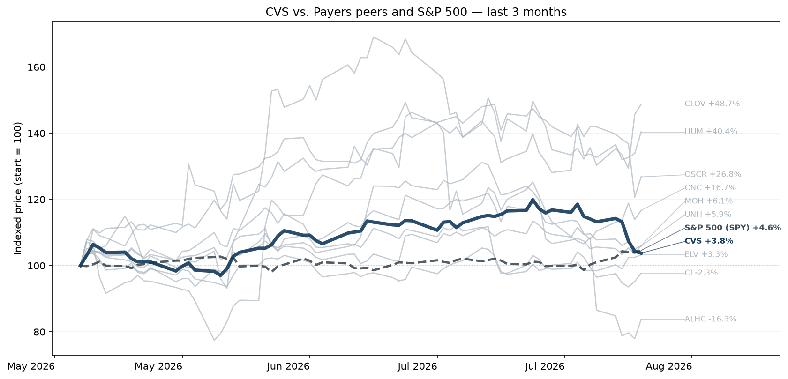

#### Earnings Call Summary

CVS Health reported robust Q2 2026 results, with revenue exceeding $106 billion (up over 7% YoY) and adjusted operating income growing 35% YoY to $5.2 billion. Adjusted EPS surged over 40% to $2.58, beating expectations across all operating segments and reflecting broad-based financial strength across the enterprise.

#### At a Glance

- **CVS Health Beats Second-Quarter Estimates:** CVS Health reported a strong bottom-line and top-line beat for the second quarter of 2026, posting a Reported Adjusted EPS of $2.31 against the estimated 1.851, and a Reported Revenue of $105.46 billion, which significantly surpassed the estimated $100.09 billion.
- **Medical Benefit Ratio Improves Meaningfully:** Aetna&#x27;s medical benefit ratio (MBR), a critical industry KPI representing total medical expenses paid relative to premiums, improved to 87.4% from 89.9% in the prior-year quarter, driving higher segment profitability despite ongoing elevated medical costs.
- **Guidance Raised Amid Headwind Warnings:** Management raised its full-year 2026 Adjusted EPS guidance range to $7.90–$8.10 and operational cash flow to at least $11.5 billion, while simultaneously cautioning investors about potential 2027 headwinds in the Health Services segment stemming from 340B program dynamics.
- **Strategic Collaboration Expands GLP-1 Access:** CVS Health announced a new collaboration with Eli Lilly to expand weight management offerings, allowing patients to view pricing options for GLP-1 medications inside the CVS app with potential same-day pickup by the fourth quarter.
- **Shares Decline on Forward Outlook:** Despite delivering a strong beat-and-raise quarter, CVS Health shares fell between 6% and 9% post-earnings as investors reacted to management&#x27;s conservative second-half growth implications and early conservative expectations for 2027.

#### Key Moments from the Call

- **2m 1s — Full-Year 2026 Guidance Raise:** CVS Health raised its full-year 2026 adjusted EPS guidance to $7.90-$8.10, signaling strong internal momentum, execution capability, and confidence in overcoming legacy contract resets.
- **23m 13s — Preliminary 2027 Consensus Validation:** Management pulled forward 2027 commentary, validating the current consensus floor of $8.44 adjusted EPS. This transparency reassures investors of a 13% growth trajectory despite incoming structural pharmacy headwinds.
- **24m 8s — Caremark 2027 Membership Headwinds:** Executives disclosed projected Caremark membership declines for 2027 due to a disciplined approach to underwriting renewals during the net-cost pricing model transition and client market exits.
- **24m 8s — 340B Program Pressures:** The company identified operational pressures in the 340B business driven by pharmaceutical manufacturer restrictions, signaling that these dynamics will present an ongoing financial headwind moving into fiscal 2027.
<h3 id="earnings-mck">McKesson (<a href="#company-mck">MCK</a>) +18.1%</h3>

**Reported:** August 5, 2026 · [Google Finance earnings page](https://www.google.com/finance/quote/MCK:NYSE?tab=earnings&hl=en)

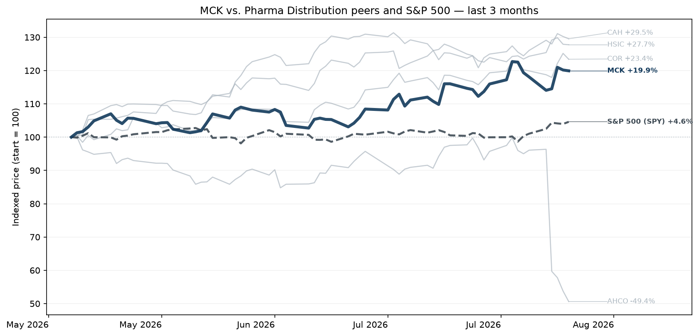

#### Earnings Call Summary

McKesson reported strong Q1 2027 revenues of $105.4 billion (+8% YoY) and adjusted EPS of $9.93 (+20% YoY), exceeding expectations. Driven by double-digit operating profit growth across three segments, management raised its full-year adjusted EPS guidance range to $44.20–$45.00, up from the prior outlook of $43.80–$44.60.

#### At a Glance

- **McKesson Tops Q1 Expectations Comfortably:** McKesson reported Q1 fiscal 2027 revenue of $105.38 billion and a reported adjusted EPS of $5.15, comfortably exceeding the estimated figures due to broad-based momentum across the enterprise.
- **Oncology Segment Drives Major Growth:** The Oncology &amp; Multispecialty segment emerged as a key driver, with revenue jumping 33% to $14.2 billion, supported by strong provider solutions and specialty distribution.
- **Full-Year Adjusted EPS Outlook Raised:** Following strong first-quarter operational momentum, management raised its fiscal 2027 full-year adjusted EPS guidance range to $44.20 to $45.00, up from the prior range of $43.80 to $44.60.
- **GLP-1 Portfolio Generates Surging Revenue:** The company&#x27;s distribution business experienced strong tailwinds from obesity medications, with GLP-1 related distribution revenue surging 24% year-over-year to $15 billion.
- **Medical-Surgical Unit Faces Profit Headwinds:** Despite a 4% increase in segment revenue to $2.8 billion, the Medical-Surgical Solutions operating profit declined 20% due to product mix challenges and one-time administrative expenses.
- **Aggressive Capital Returns to Shareholders:** McKesson returned $2.6 billion to shareholders during the quarter, deploying $2.5 billion in share repurchases and boosting its quarterly dividend by 15% to $0.94 per share.

#### Key Moments from the Call

- **11m 26s — Medical-Surgical Separation and Wellverse Branding:** Management advanced its plan to separate the Medical-Surgical business, announcing its new market brand, Wellverse, set to formally debut in January 2027. Separation readiness was underscored by a completed 13% minority investment from Apollo Funds and a new $2.25 billion Term Loan B structure.
- **21m 13s — Robust Growth in GLP-1 Distribution Platforms:** GLP-1 pharmaceutical revenues jumped 24% year-over-year and 13% sequentially to reach $15 billion for the quarter. This expansion reflects sustained market demand across both cash-pay and covered segments, alongside high-efficiency prior authorization systems delivering determinations quickly.
- **27m 8s — Full-Year Adjusted EPS Guidance Increase:** McKesson raised its fiscal 2027 adjusted EPS outlook to $44.20–$45.00, implying 15%–17% core operational growth. This exceeds their long-term growth target of 13%–16%, fueled by strong Q1 outperformance, robust underlying specialty volumes, and steady operational momentum across its primary segments.
- **45m 50s — WAC Reductions and Fee-For-Service Stability:** Executives reassured investors that wholesale acquisition cost reductions implemented in January 2026 primarily impact top-line revenue metrics without hurting profitability. Because over 95% of branded contracts utilize fee-for-service frameworks, gross margins expanded despite falling list prices.
<h3 id="earnings-cor">Cencora (<a href="#company-cor">COR</a>) +22.7%</h3>

**Reported:** August 5, 2026 · [Google Finance earnings page](https://www.google.com/finance/quote/COR:NYSE?tab=earnings&hl=en)

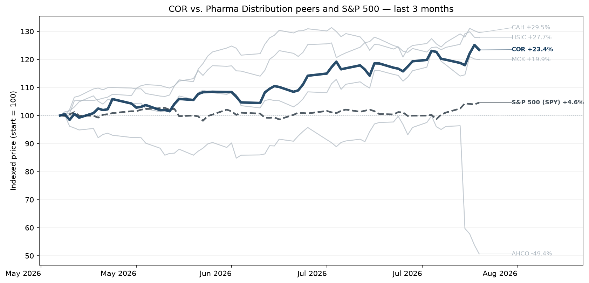

#### Earnings Call Summary

Cencora delivered 12% EPS growth in Q3 fiscal 2026, driven by execution across the firm and investments in its specialty positioning. Backed by $1 billion in opportunistic share repurchases, the company raised its full-year fiscal 2026 EPS guidance range to $17.75-$17.95, reflecting strong performance confidence.

#### At a Glance

- **Cencora Misses EPS, Beats Revenue:** Cencora reported a top-line revenue of $84.75 billion, beating expectations of $84.15 billion, while its reported adjusted EPS of $3.94 fell short of the estimated $4.35.
- **Margin Expansion Drives Profit Growth:** Cencora&#x27;s adjusted gross margin expanded by 61 basis points to 4.16%, heavily supported by the successful integration of its OneOncology acquisition and strong specialty pharmaceutical distribution mix.
- **Full Year EPS Guidance Lifted:** Management raised its full-year fiscal 2026 adjusted EPS guidance to a range of $17.75 to $17.95, while maintaining its annual revenue growth projection of 4% to 6%.
- **U.S. Healthcare Segments Post Gains:** The U.S. Healthcare Solutions segment saw revenue increase by 5% to $74.9 billion, driven by robust demand for expensive specialty medications and a $2.3 billion year-over-year jump in GLP-1 sales.
- **International Healthcare Solutions Segment Rebounds:** Reversing prior sluggishness, international revenue grew 6% to $7.7 billion, propelled by a strong operational recovery in European distribution and global specialty logistics.
- **Aggressive Capital Deployment Through Repurchases:** Cencora aggressively deployed capital by executing $1 billion in opportunistic share repurchases during the quarter, optimizing its outstanding share count to boost long-term value.

#### Key Moments from the Call

- **1m 48s — Fiscal 2026 EPS Guidance Raised:** Cencora increased its full-year fiscal 2026 adjusted EPS guidance to a range of $17.75-$17.95, signaling strong business momentum and execution confidence to the market.
- **9m 29s — Massive Share Repurchases Executed:** The company deployed $1 billion toward opportunistic share repurchases in the quarter, reducing diluted share counts and contributing to the double-digit adjusted EPS growth.
- **13m 26s — OneOncology and MSO Platforms Outperform:** The recently acquired OneOncology platform, alongside RCA, performed ahead of management's expectations, helping drive a 16% operating income increase in the U.S. Healthcare segment.
- **19m 50s — Fiscal 2027 Headwinds Outlined:** Management provided early modeling insights for fiscal 2027, projecting a potential $0.35 net EPS headwind from the pending merger of MWI Animal Health with Covetrus.
<h3 id="earnings-ntra">Natera (<a href="#company-ntra">NTRA</a>) +65.8%</h3>

**Reported:** August 6, 2026 · [Google Finance earnings page](https://www.google.com/finance/quote/NTRA:NASDAQ?tab=earnings&hl=en)

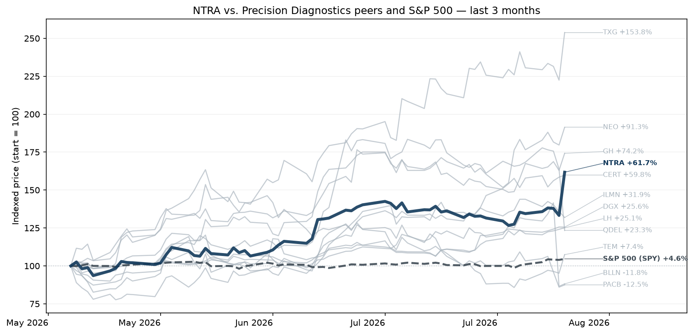

#### Earnings Call Summary

Natera processed over 1.04 million total tests in Q2 2026, setting a company record. Oncology clinical MRD units reached 283,000, representing 56% year-over-year growth and a record sequential increase of 34,000 units. Colorectal and breast cancers remain the largest indications, with strong contribution from other tumor types.

#### At a Glance

- **Natera Outperforms on Top and Bottom Lines:** Natera reported a Reported Adjusted EPS of -$0.47, beating the Estimated Adjusted EPS of -$0.534, while Reported Revenue of $752,750,000 exceeded the consensus estimate of $661,293,160.
- **Record Test Volumes Fuel Expansion:** The company processed approximately 1.044 million total tests in the quarter, marking a 22.4% year-over-year increase and establishing its second consecutive quarter above the 1 million unit milestone.
- **Full-Year Revenue Guidance Raised Substantially:** Natera raised its full-year 2026 revenue guidance by $100 million at the midpoint to a new range of $2.85 billion to $2.91 billion.
- **Oncology Segment Achieves Landmark Volume Growth:** Clinical molecular residual disease oncology units reached a record 283,000 tests, generating 56% year-over-year growth and the largest sequential increase in company history.
- **Strong Positive Market and Stock Response:** Driven by the substantial revenue beat and upgraded financial guidance, Natera&#x27;s shares jumped over 16% in after-hours trading to surpass its previous 52-week high.
- **Key Regulatory and Reimbursement Milestones Cleared:** The quarter was highlighted by FDA companion-diagnostic approval for Signatera in bladder cancer, positive Japanese PMDA regulatory momentum, and expanded Medicare coverage for Prospera.

#### Key Moments from the Call

- **3m 47s — Massive Revenue Guidance Increase:** Natera completely reset its full-year 2026 revenue guidance, raising the midpoint by $100 million to $2.85B–$2.91B, representing 31% annual growth excluding true-ups. This substantial increase highlights excellent top-line momentum, driven by outperforming volumes in Signatera and resilient seasonally adjusted performance in Women's Health.
- **10m 0s — Unoptimized New Product COGS Impact:** While gross margin reached a strong 65%, sequential margin expansion was slightly tempered by a step-up in volumes for newly launched products like Fetal Focus and Latitude. Management reassured investors that while initial COGS are unoptimized, they plan to run dedicated margin-improvement projects over the next 12–18 months.
- **13m 46s — Expanded Medicare Transplant Coverage:** The final Medicare LCD for organ transplant surveillance published in July materially expanded covered testing frequencies relative to draft proposals. Effective August 30, this policy change creates an immediate monetization tailwind, boosting Prospera's volume and ASP outlook for the back half of 2026.
- **15m 28s — Signatera Regulatory and Guideline Milestones:** Signatera secured major global catalysts in Q2, becoming the first MRD test to gain U.S. FDA approval as a companion diagnostic and Japanese PMDA approval in colorectal cancer. Furthermore, it achieved an NCCN Category 1 recommendation in muscle-invasive bladder cancer, accelerating clinical adoption and favorable commercial coverage policies.
<h3 id="earnings-dva">Davita (<a href="#company-dva">DVA</a>) -7.5%</h3>

**Reported:** August 4, 2026 · [Google Finance earnings page](https://www.google.com/finance/quote/DVA:NYSE?tab=earnings&hl=en)

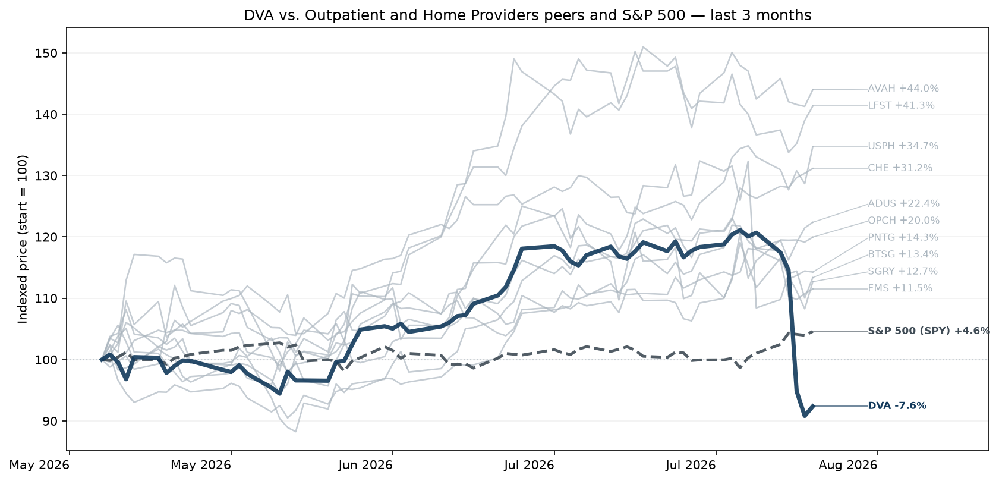

#### Earnings Call Summary

The 2027 CMS ESRD proposed rule tracks below cost trends but expands access by moving phosphate binders into the bundled payment. It reduced estimated drug spend by $500 million. DaVita supported the two-year TDAPA period limit, noting that ultimate 2027 financial impacts depend on final rule details later this year.

#### At a Glance

- **DaVita Tops EPS and Revenue Estimates:** DaVita Inc. reported second-quarter 2026 adjusted EPS of $4.02, beating the estimated $3.882, while its revenue of $3.554 billion also surpassed the estimated $3.494 billion.
- **Treatment Metrics Experience Mixed Performance:** U.S. dialysis treatment volume growth accelerated by 56 basis points year-over-year due to improved mortality, though revenue per treatment decreased by approximately $2 sequentially.
- **Full-Year Guidance Successfully Reaffirmed:** Management reconfirmed its full-year 2026 guidance, maintaining midpoints of $2.2 billion for adjusted operating income and $14.65 for adjusted EPS.
- **Commercial Mix Pressures Cloud Outlook:** The company expects a weaker mix as patients shift to government programs, leading to a projected $40 million headwind in 2026 and an expanded $70 million impact in 2027.
- **Stock Plummets Post-Earnings Despite Beat:** Despite surpassing top and bottom-line expectations, shares dropped over 7% in after-hours trading as investors focused on upcoming cost pressures and sequential declines in revenue per treatment.
- **Clinical Milestone Secured with New Dialyzers:** DaVita secured a full supply of newly FDA-approved expanded hemodialysis dialyzers following positive trial results, with plans to roll them out to facilities in upcoming quarters.

#### Key Moments from the Call

- **6m 36s — Expanded HD Dialyzer Deployment Acceleration:** DaVita secured a robust supply of NIPRO's new expanded HD dialyzers compatible with existing machines, enabling capital-efficient deployment. While financials are already within 2026 guidance, management noted a significant positive economic and mortality impact will not kick in or materialise until 2028.
- **9m 42s — Treatment Volume Outlook Nears Guidance Ceiling:** DaVita increased confidence in its volume trajectory, now expecting 2026 nominal treatment growth near the top end of its 25-50 basis points range. This acceleration is driven primarily by sustained improvements in patient mortality rather than new patient admissions, pleasing investors with solid clinical execution.
- **10m 55s — Commercial Mix Loss Impacts Revenue Per Treatment:** Revenue per treatment fell by $2 sequentially due to lower ACA exchange plan enrollment and commercial mix erosion. This shift creates a $40 million headwind in 2026 and an annualizing $70 million drag into 2027, explaining why second-half 2026 revenue per treatment growth will decelerate.
- **14m 36s — Integrated Care Performance and Phasing Details:** The Integrated Kidney Care segment delivered a stronger-than-expected $40 million in adjusted operating income due to revenue recognition timing. Management noted IKC continues to have a long runway for enterprise growth, and its timing will drive a major $50 million to $100 million sequential operating income step-up from Q3 to Q4.
<h3 id="earnings-doc">Healthpeak properties (<a href="#company-doc">DOC</a>) +9.0%</h3>

**Reported:** August 5, 2026 · [Google Finance earnings page](https://www.google.com/finance/quote/DOC:NYSE?tab=earnings&hl=en)

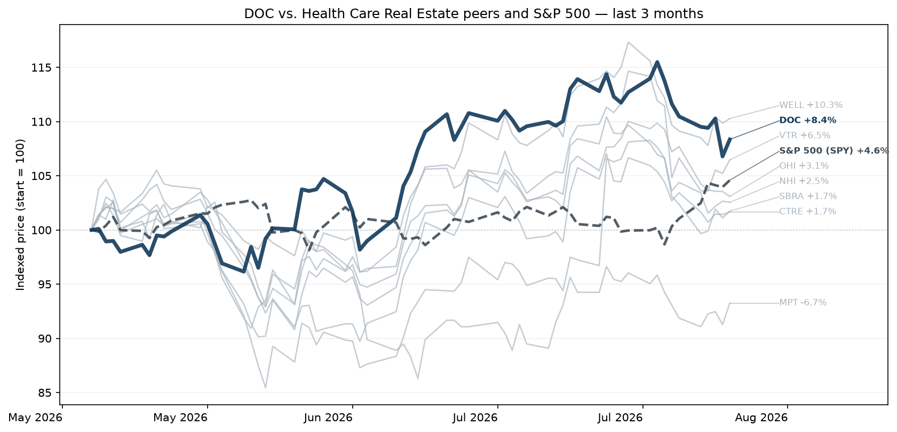

#### Earnings Call Summary

Healthpeak reported Q2 2026 adjusted FFO of $0.46 per share, beating the estimated EPS of $0.08. Total revenue reached $771.58M, outperforming the estimated $725.16M. President and CEO Scott Brinker highlighted strategic milestones, including a $5B merger, a $1B IPO, and joint ventures with Blackstone and Brookfield to maintain building control and secure alternative equity.

#### At a Glance

- **Healthpeak Beats Q2 Estimates Soundly:** Healthpeak Properties reported Q2 2026 adjusted EPS of $0.08 on revenue of $771.58 million, beating consensus expectations of $0.06 EPS and $725.16 million in revenue.
- **Strong Operational Gains Across Portfolio:** The company demonstrated sequential improvements in key real estate metrics, with outpatient medical occupancy rising 20 basis points to 90.7% and lab occupancy jumping 80 basis points to 78.5%.
- **Full-Year FFO Outlook Raised:** Fueled by accelerating same-store net operating income and leasing velocity, Healthpeak lifted its full-year 2026 adjusted FFO guidance range to $1.73 to $1.77 per share.
- **Brookfield Venture Injects Fresh Capital:** Healthpeak finalized a massive $2.1 billion strategic joint venture with Brookfield Asset Management for an 86-property outpatient portfolio, generating $1 billion in gross cash proceeds.
- **Senior Housing Consolidation Accelerates Expansion:** Following the Janus Living IPO transaction, Healthpeak shifted its senior housing strategy into hyperdrive, closing $1.8 billion in year-to-date acquisitions and logging 45% revenue growth for the segment.

#### Key Moments from the Call

- **6m 58s — Brookfield Joint Venture Deal Terms:** The Brookfield transaction features a trailing cash cap rate of 5.9%. Crucially, Healthpeak holds finite call rights after seven years to repurchase the non-controlling interest at a price delivering an unlevered 6.5% rate of return, positioning Healthpeak to capture upside in an in-the-money option.
- **10m 51s — Guidance Boost Sourced to Segment Strengths:** Management raised full-year adjusted FFO guidance to $1.73–$1.77 per share. This positive revision delights investors because it is supported by a 200 basis point increase in same-store NOI projections for both the reviving lab and booming senior housing segments.
- **18m 7s — Shift to Lab Consolidation Strategy:** CEO Scott Brinker noted that the life science sector is transitioning from a development game into an acquisition game. Armed with leverage below 5x, Healthpeak intends to act as a sector consolidator over the next 24 months, focusing on deeply discounted, core-market distressed assets.
- **32m 34s — Regional Divergence in Biotech Demand:** The Bay Area and San Diego show robust biotech demand, dramatically driving Torrey Pines leasing up to 97%. Conversely, Boston faces supply overhang. However, Boston showed signs of life in Q2 with market activity hitting 80% of full-year 2025 levels, reinforcing a localized sector inflection.
<h3 id="earnings-fms">Fresenius (<a href="#company-fms">FMS</a>) +10.2%</h3>

**Reported:** August 4, 2026 · [Google Finance earnings page](https://www.google.com/finance/quote/FMS:NYSE?tab=earnings&hl=en)

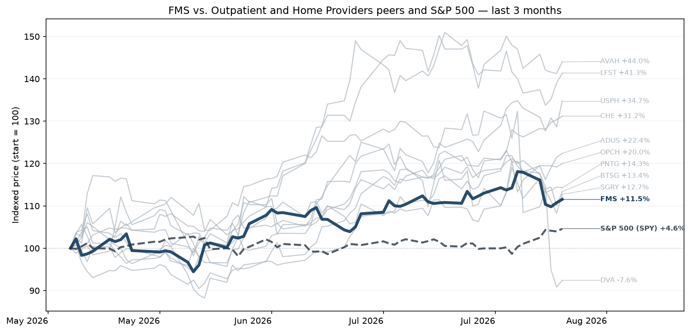

#### Earnings Call Summary

Fresenius Medical Care delivered a strong second quarter in 2026, accelerating operating income growth to 23% and continuing margin expansion, supported by the FME25+ transformation program which achieved EUR 67 million in sustainable savings. The initial EUR 1 billion share buyback program was completed early, and a second EUR 1 billion program has launched.

#### At a Glance

- **Fresenius Beats on EPS and Revenue:** Fresenius Medical Care reported an Adjusted EPS of 0.81, comfortably beating the estimated 0.499, while reported revenue of 4,860,566,000 slightly outpaced the estimated 4,789,945,660.
- **Mixed Performance Across Care Segments:** Organic revenue grew by 5%, supported by a 7% organic increase in Care Delivery and a 9% organic jump in Value-Based Care, though U.S. same-market treatment volume growth fell by 0.9%.
- **Full-Year 2026 Outlook Reaffirmed:** Management confirmed its full-year guidance expecting broadly flat revenue and mid-single-digit changes in operating income, though they revised full-year negative TDAPA headwinds to a narrower EUR 50 million.
- **Value-Based Care Business Turns Profitable:** The Value-Based Care operating income improved substantially to EUR 18 million from a EUR 9 million loss in the prior year, yielding a 500-basis-point margin enhancement due to positive business momentum.
- **Shares Fall On Volume Concerns:** Despite a bottom-line beat of nearly 50%, shares tumbled over 7% as investors prioritized the negative 0.9% U.S. same-market treatment growth caused by an internal execution gap in capturing patient referrals.
- **Cost Savings Plan Driving Margin Expansion:** The company&#x27;s group operating margin expanded by 180 basis points to 11.7%, significantly driven by an extra EUR 67 million in sustainable savings from the FME25+ transformation program.

#### Key Moments from the Call

- **3m 44s — U.S. Patient Referral Execution Gap:** Investors will face disappointment over a 0.9% decline in U.S. same-market treatment growth, driven by internal operational failures in capturing patient referrals rather than overall market issues. This operational miss has led management to lower its full-year volume growth expectations to match Q2 levels, pushing potential volume recoveries into 2027.
- **16m 39s — Value-Based Care Profit Turnaround:** Investors will be pleased with the robust improvement in Value-Based Care, which swung from a EUR 9 million loss to EUR 18 million in operating income. The margin expansion of 500 basis points and improved full-year revenue outlook indicate that the company's contracting strategy and vertically integrated model are translating into sustainable profitability.
- **18m 46s — Accelerated Share Buyback Launch:** The fast execution of capital return initiatives will satisfy investors, as the company completed its initial EUR 1 billion share buyback ahead of schedule and instantly deployed a second EUR 1 billion program. This aggressive strategy underscores balance sheet confidence while keeping leverage at the lower end of the target corridor.
- **20m 36s — Favorable TDAPA Headwind Revision:** The upward revision of full-year TDAPA outlook will please shareholders, as anticipated net regulatory headwinds dropped from EUR 100 million down to EUR 50 million. Stronger performance in the first half provided an EUR 80 million year-over-year tailwind, mitigating some of the anticipated downside from reimbursement shifts coming in the second half.
<h3 id="earnings-solv">Solventum (<a href="#company-solv">SOLV</a>) +13.1%</h3>

**Reported:** August 5, 2026 · [Google Finance earnings page](https://www.google.com/finance/quote/SOLV:NYSE?tab=earnings&hl=en)

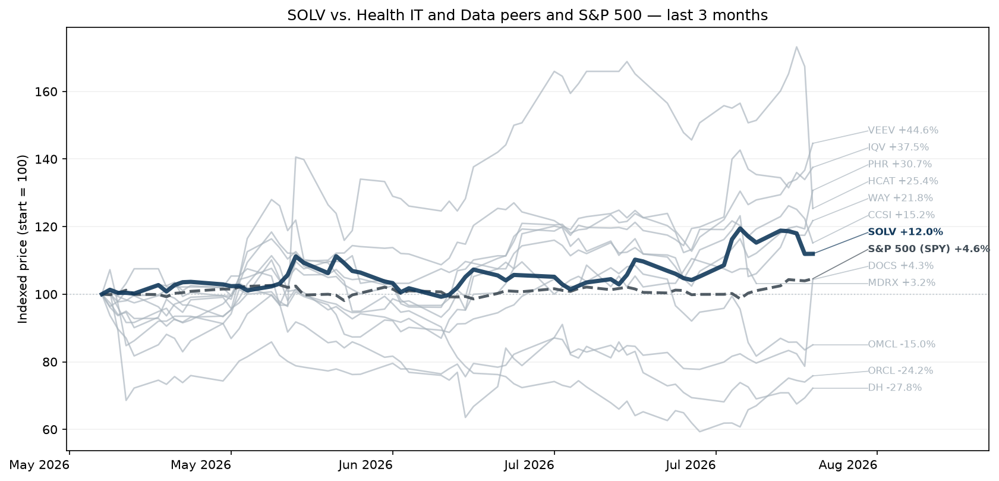

#### Earnings Call Summary

Solventum delivered a strong Q2 2026, exceeding top- and bottom-line expectations with reported revenue of $2.209B and EPS of $2.55, driven by healthy execution across all segments. Results included planned advanced orders of approximately $125 million ahead of the North America ERP cutover.

#### At a Glance

- **Solventum Tops EPS and Revenue Estimates:** Solventum reported a reported revenue of $2,209,000,000, surpassing the estimated $2,155,703,990, and posted a reported adjusted EPS of $2.55, which significantly outperformed the consensus forecast of $1.906.
- **Organic Growth Boosted Across Segments:** The company delivered organic sales growth of 9.5%, reflecting strong volume and product mix across all reportable segments, though normalized organic growth was closer to 4% after excluding advance ERP orders.
- **Solventum Raises Full-Year Guidance Considerably:** Management increased its full-year 2026 outlook, raising organic sales growth expectations to 2.5%–3.0%, free cash flow to $200M–$300M, and adjusted EPS to a range of $7.10–$7.20.
- **Health Information Systems Unit Separation:** Solventum announced its intent to separate its Health Information Systems business segment as part of a transformation strategy to sharpen its core focus as a dedicated MedTech company.
- **Tariff Refund Lifts Profitability Margins:** The company&#x27;s adjusted operating income margin rose to 28.4%, receiving a notable temporary lift from a one-time $100 million IEEPA tariff refund benefit.
- **Positive Initial Market Reaction Sparked:** Following the substantial bottom-line earnings beat and the upbeat guidance adjustments, Solventum shares gained 2.9% in immediate after-market trading.

#### Key Moments from the Call

- **4m 29s — Health Information Systems Strategic Separation:** Solventum announced plans to separate its Health Information Systems business. This strategic shift will transition Solventum into a pure-play med tech company focused on MedSurg and Dental, while allowing HIS to better capture AI-driven autonomous coding advances independently or with a scaled partner.
- **16m 37s — Acera Integration Outperformance:** The recently acquired Acera business delivered outstanding 48% growth in the quarter, generating $32 million in sales with gross margins over 80%. This strong execution validates the company's tuck-in M&A playbook and provides investors with a high-margin, high-growth catalyst within Advanced Wound Care.
- **21m 39s — Substantial Guidance Increase:** Management raised full-year 2026 EPS guidance to $7.10–$7.20 from $6.40–$6.60 and bumped ex-SKU organic growth expectations. This positive revision, supported by strong first-half execution and a $100 million tariff refund benefit, signals accelerating progress toward achieving long-range targets earlier than planned.
- **43m 38s — ERP Advanced Orders Cadence Volatility:** Results included $125 million in advanced orders to mitigate ERP cutover risks, boosting organic growth by 630 basis points. Management explicitly warned analysts that this timing benefit will reverse in Q3, leading to an expected sales decline of -3% to -4% before recovering in Q4.
<h3 id="earnings-ehc">Encompass Health (<a href="#company-ehc">EHC</a>) +18.0%</h3>

**Reported:** August 6, 2026 · [Google Finance earnings page](https://www.google.com/finance/quote/EHC:NYSE?tab=earnings&hl=en)

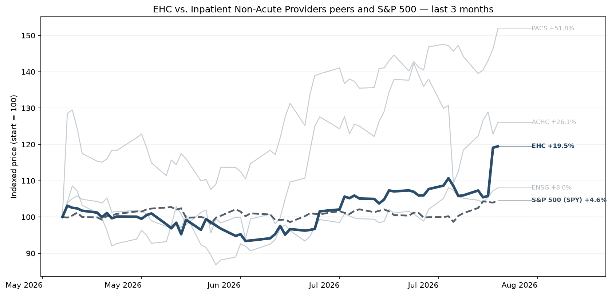

#### Earnings Call Summary

Encompass Health reported strong Q2 2026 results with revenue growth of 9.6% year-over-year to $1.597 billion, beating estimated revenue of $1.571 billion. Adjusted EBITDA increased 9.2% to $348 million, and adjusted EPS grew 10.7% to $1.55, exceeding the estimated EPS of $1.48, driven by volume growth and higher patient acuity.

#### At a Glance

- **Encompass Health Beats Earnings Estimates:** Encompass Health exceeded market expectations for the second quarter of 2026, delivering a reported adjusted EPS of $1.54 against a $1.48 estimate, alongside a reported revenue of $1.597 billion which topped the forecasted $1.571 billion.
- **Discharge Metrics Drive Volume Expansion:** The company achieved a 5.6% increase in total discharges for the quarter, balanced evenly with a 2.8% increase in same-store discharge growth and a 2.8% contribution from new-store discharge growth.
- **Full-Year Financial Guidance Raised:** Citing sustained operational momentum, management raised its full-year 2026 guidance, now projecting net operating revenue of $6.41 billion to $6.49 billion and adjusted EPS of $6.02 to $6.25.
- **Higher Patient Acuity Boosts Revenue:** Net patient revenue per discharge rose by 3.9%, largely driven by growth in medically complex categories like stroke and brain injury, which saw total volume increases of 7.9% and 8.0% respectively.
- **Positive Hospital Capacity and Openings:** Encompass Health expanded its footprint by opening three new hospitals and adding 54 beds during the first half of the year, with plans to add five more hospitals and over 100 beds before year-end.
- **Enhanced Capital Allocation Strategies:** The board approved a major expansion to its common stock repurchase program, boosting the aggregate authorization to $1 billion alongside a 10.5% increase in its quarterly dividend to $0.21 per share.

#### Key Moments from the Call

- **15m 11s — North Carolina CON Repeal Expansion Strategy:** The repeal of North Carolina's CON law opens up a large, underserved market. Encompass Health is moving quickly with a portfolio approach targeting 15 markets, which will likely accelerate long-term bed growth towards the high end of their 6-10 de novo annual range by 2029.
- **19m 49s — Full-Year 2026 Guidance Raised:** Encompass Health raised its full-year 2026 financial guidance across revenue, adjusted EBITDA, and adjusted EPS. This positive revision reflects strong first-half financial performance, solid volume growth, and higher patient acuity, which will please investors despite increased labor cost assumptions.
- **28m 44s — Successful Medicare Advantage Admit and Appeal Pilot:** Addressing persistent Medicare Advantage pre-authorization denials, the company's "admit and appeal" pilot achieved an 89% success rate across 144 adjudicated cases. Scaling this strategy will reassure investors of Encompass Health's ability to protect its volume and counter payer headwinds.
- **36m 17s — Career Ladders Drive Record Low Workforce Turnover:** Investments in clinical career ladders reduced nursing turnover to a 12-year low of ~19% and therapy turnover to a 5-year low of ~7%. This operational success directly lowered premium labor spend to 1.1% of total FTEs, improving P&L efficiency and supporting higher patient acuity capacity.
<h3 id="earnings-hsic">Henry Schein (<a href="#company-hsic">HSIC</a>) +24.4%</h3>

**Reported:** August 4, 2026 · [Google Finance earnings page](https://www.google.com/finance/quote/HSIC:NASDAQ?tab=earnings&hl=en)

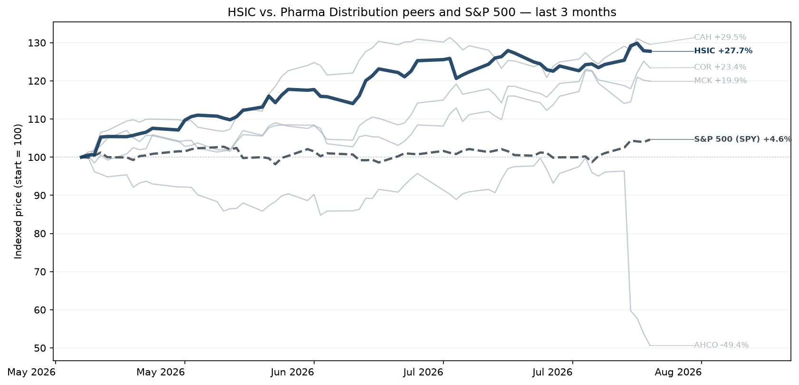

#### Earnings Call Summary

Henry Schein reported strong Q2 2026 sales and margin performance, with global sales increasing 6.7% to $3.5 billion, featuring internal local currency sales growth of 4.6%. Non-GAAP operating income grew 10.5% and non-GAAP EPS rose 15.5% to $1.27, driven by sustained business momentum and early benefits from value creation initiatives.

#### At a Glance

- **Henry Schein Beats Top-Line and Bottom-Line Estimates:** Henry Schein reported a reported revenue of $3,458,000,000, beating the estimated revenue of $3,373,884,700, and delivered a reported adjusted EPS of $0.82 compared to the estimated adjusted EPS of 1.239.
- **Organic Momentum Drives Core Industry KPIs:** The company achieved 4.6% internal constant-currency sales growth, reflecting accelerated momentum from previous quarters across its primary distribution and technology segments.
- **Management Lifts Full-Year 2026 Financial Guidance:** Henry Schein raised its full-year 2026 outlook, now expecting total sales growth of 4.5% to 5.5% and increasing its non-GAAP diluted EPS guidance range to $5.29 to $5.39.
- **Margin Expansion Boosted by Value Initiatives:** Gross margins expanded to 31.8% during the quarter, aided by early benefits from a multiyear cost-saving program designed to optimize operations and improve operating income.
- **Strategic Focus Pivots Toward Tech and Specialty:** The company is experiencing a profitable shift toward higher-margin specialty products and technology platforms, including upcoming launches of AI-enabled data query features for clinical practices.

#### Key Moments from the Call

- **16m 3s — Global Business Outsourcing Benefits Looming:** The company completed its global outsourcing provider selection for finance and customer service, initiating phase I in the U.S. This initiative is expected to unlock labor cost efficiencies beginning in Q3 2026 and eventually yield more than half of the targeted $200 million G&A savings.
- **20m 58s — Consumables Growth Outpacing Market:** U.S. Dental Merchandise sales grew an impressive 8.3% (6.5% internal local currency). This clear outperformance and market share expansion pleased investors, as the company successfully converted episodic buyers into active accounts through targeted promotional strategies despite tougher prior-year comparisons.
- **25m 55s — Full-Year 2026 Guidance Raised:** Management raised full-year 2026 sales growth guidance to 4.5%-5.5% and non-GAAP EPS guidance to $5.29-$5.39. This revision highlights robust underlying commercial momentum and stable end-market demand, though the bottom-line flow-through is partially tempered by a reduction in forecasted non-operating remeasurement gains.
- **51m 45s — Management Structural Optimization:** CEO Fred Lowery announced structural changes to the executive committee, removing a management layer to flatten the organization and integrate the supply chain directly into distribution operations. This adjustment aims to increase decision-making velocity and operational consistency.
<h3 id="earnings-ctre">CareTrust REIT (<a href="#company-ctre">CTRE</a>) -0.9%</h3>

**Reported:** August 7, 2026 · [Google Finance earnings page](https://www.google.com/finance/quote/CTRE:NYSE?tab=earnings&hl=en)

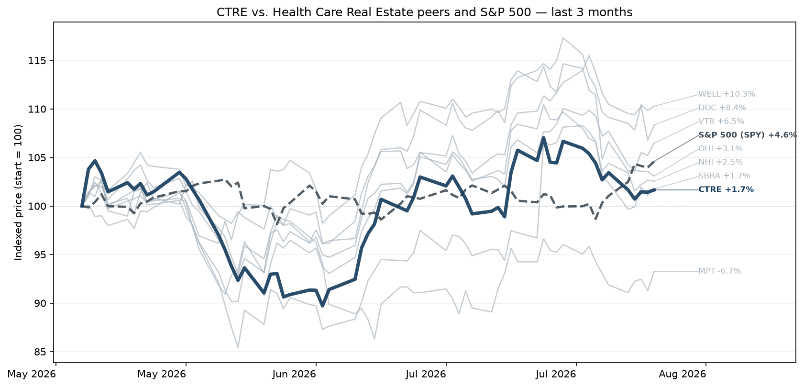

#### Earnings Call Summary

CareTrust REIT achieved a record investment quarter in Q2 2026, deploying approximately $900 million at a blended stabilized yield of 8.9%. Year-to-date investments have reached $1.5 billion, encompassing U.S. triple-net skilled nursing, U.S. senior housing, U.K. care homes, SHOP platforms, and real estate loans.

#### At a Glance

- **CareTrust Reports Mixed Quarterly Results:** CareTrust REIT reported a Reported Adjusted EPS of 0.38, missing the estimated 0.393, while its reported revenue of $161.35 million beat the estimate of $156.14 million.
- **Strong Core Real Estate KPIs:** The company recorded a 44% year-over-year surge in Normalized FFO to $119.7 million, with Normalized FFO per share expanding 19% to $0.51, matching consensus expectations.
- **Full Year Guidance Raised Significantly:** Management increased its full-year 2026 outlook, now projecting a normalized FFO per share range of $2.03 to $2.06 and a normalized FAD per share range of $2.01 to $2.04.
- **Record Capital Deployment Extends Pipeline:** CareTrust completed a record $900 million of investments during the quarter at an 8.9% blended stabilized yield, pushing year-to-date deployments to $1.5 billion.
- **Muted Immediate Market Stock Reaction:** The company&#x27;s stock reacted quietly to the mixed metrics, finishing nearly flat at $41.16 as the solid core FFO and guidance increase balanced out bottom-line variances.

#### Key Moments from the Call

- **1m 48s — Record Capital Deployment Milestone:** The company posted its single largest non-M&A investment quarter ever, putting $900 million to work at a high 8.9% blended yield, proving its unique capacity to expand aggressively in the skilled nursing and care home sectors.
- **10m 32s — Raised Full-Year 2026 Guidance:** CareTrust increased its full-year outlook to reflect massive year-to-date deployment. Midpoint projections signal double-digit FFO and FAD per-share growth of 16.2% and 15.1% respectively, providing a highly positive surprise for investors.
- **11m 39s — Ultra-Low Leverage and High Liquidity:** Reporting a leverage ratio of just 1.0x EBITDA and $1.4 billion in available dry powder, the company reassured investors of its stellar balance sheet insulation against fluctuating interest rates and macroeconomic volatility.
- **23m 48s — Strategic Patience on SHOP Assets:** Management defended the lack of near-term SHOP deals by emphasizing disciplined risk-adjusted returns over chasing low-cap-rate transactions, signaling to investors that they will not sacrifice long-term value for immediate growth metrics.
<h3 id="earnings-oscr">Oscar Health (<a href="#company-oscr">OSCR</a>) +30.9%</h3>

**Reported:** August 6, 2026 · [Google Finance earnings page](https://www.google.com/finance/quote/OSCR:NYSE?tab=earnings&hl=en)

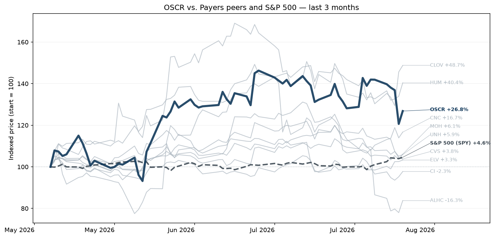

#### Earnings Call Summary

Oscar Health reported strong Q2 2026 results, with revenue up 70% year-over-year to $4.9 billion, driven by higher membership and rate increases. First-half results delivered record profitability, generating $1.1 billion in earnings from operations and $1 billion in net income, while second-quarter earnings from operations increased by $619 million year-over-year to $389 million.

#### At a Glance

- **Oscar Health Beats Earnings Estimates:** Oscar Health reported a Reported Adjusted EPS of 1.1, beating the Estimated Adjusted EPS of 0.38, while Reported Revenue reached 4,880,220,000 against the estimated 4,751,123,190.
- **Medical Loss Ratio Improves Sharply:** The company&#x27;s core Medical Loss Ratio (MLR) collapsed by roughly 12 percentage points year-over-year to 79.2% for the second quarter, indicating significantly improved underwriting margins compared to past performance.
- **Full Year Operating Outlook Raised:** Management raised its full-year 2026 operational earnings guidance to a range of $500 million to $700 million, a major increase from its previous outlook of $250 million to $450 million.
- **Membership Base Surges Significantly:** Oscar Health reached 2.96 million effectuated members as of June 30, 2026, representing a robust 46% increase year-over-year.
- **Elevated Enrollment Churn Expected Ahead:** Management warned that membership churn could double to around 2% to 4% in the second half of 2026 due to accelerated CMS eligibility verification processes.
- **Record Efficiencies Drive Bottom Line:** The SG&amp;A expense ratio reached a record low of 14.2%, down 450 basis points year-over-year, heavily supported by AI-driven automation and technology efficiencies.

#### Key Moments from the Call

- **10m 12s — Favorable Risk Adjustment and Morbidity:** The company recorded a $160 million favorable true-up from the final 2025 CMS risk adjustment report. Additionally, early 2026 market morbidity data from Wakely tracks favorable to pricing assumptions, pointing to potential tailwinds if these positive trends hold through the remainder of the year.
- **11m 3s — Elevated Outpatient Utilization Stability:** While inpatient, professional, and pharmacy utilization were favorable in the first half of the year, outpatient utilization was noted as elevated. However, management reassured investors that these trends remain stable, reasonable, and favorable to overall initial pricing expectations.
- **13m 16s — Full-Year 2026 Guidance Raise:** Oscar Health raised its full-year 2026 earnings from operations outlook by $250 million to a range of $500 million–$700 million, while improving full-year MLR expectations by 90 basis points at the midpoint to 81.5%–82.5%, highlighting strong first-half operating momentum and favorable market morbidity.
- **38m 14s — Second-Half Membership Churn Guidance:** Management forecasts an acceleration in membership churn during the second half of 2026, estimating monthly lapse rates will double from previous 1%–2% expectations. This is attributed to delayed CMS eligibility verification and program integrity processes, though financial impacts are already factored into full-year guidance.
<h3 id="earnings-pacs">PACS Group (<a href="#company-pacs">PACS</a>) +44.2%</h3>

**Reported:** August 5, 2026 · [Google Finance earnings page](https://www.google.com/finance/quote/PACS:NYSE?tab=earnings&hl=en)

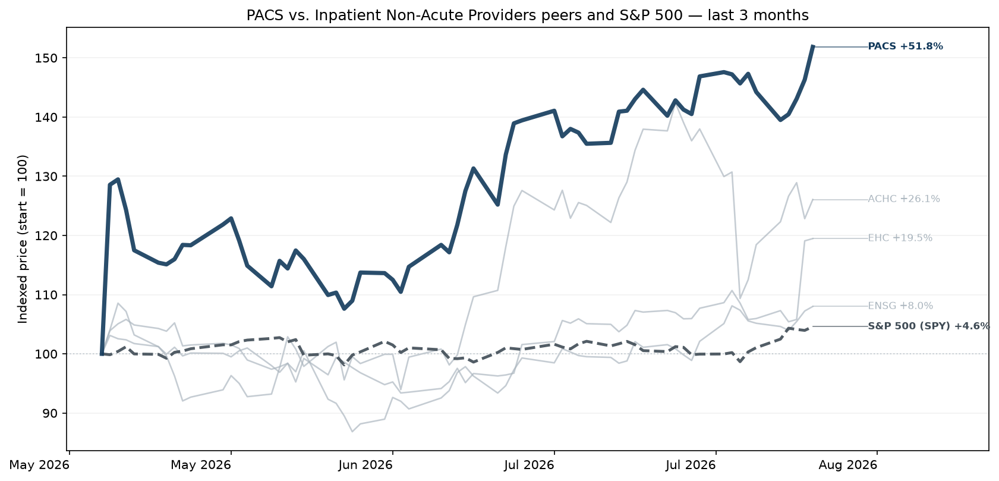

#### Earnings Call Summary

PACS Group reported strong Q2 2026 results, with revenue growing 9.1% year-over-year to $1.43 billion and net income increasing 50% to $76.4 million. Adjusted EBITDA grew 25% to $166.8 million, demonstrating meaningful margin expansion as facilities mature, occupancy climbs, and patient mix improves.

#### At a Glance

- **PACS Group Tops Revenue Estimates:** PACS Group reported Q2 2026 revenue of $1.43 billion, beating the estimated $1.41 billion, while reported adjusted EPS came in at $0.47, missing the estimated $0.56.
- **Strong Occupancy and Portfolio Growth:** The company&#x27;s overall occupancy rate reached 90.4%, an improvement of 180 basis points year-over-year, which significantly outperforms the current industry average of 79.5%.
- **Full-Year Guidance Significantly Raised:** Management increased its full-year 2026 revenue guidance to a range of $5.75 billion to $5.85 billion and adjusted EBITDA to between $640 million and $660 million, driven by organic momentum and recent acquisitions.
- **Strategic Expansion via Eduro Acquisition:** PACS Group expanded its geographic footprint by executing a definitive agreement to acquire 34 skilled nursing facilities from Eduro Healthcare, closing the first 20 facilities in Texas on August 1, 2026.
- **Labor Cost Stabilization Enhances Margins:** The company&#x27;s adjusted EBITDA margin expanded by 150 basis points to 11.7%, primarily aided by stabilizing labor costs and reducing reliance on temporary agency staffing to a two-year low.

#### Key Moments from the Call

- **12m 32s — Strategic Expansion via Eduro Asset Acquisition:** The company announced a definitive agreement to acquire 34 skilled nursing facilities from Eduro Healthcare. Having closed on the first 20 facilities in Texas on August 1, management notes significant upside to transition these low-occupancy assets (mid-60%) into its higher-performing ramping and mature cohorts.
- **21m 38s — Strong Earnings Beat and Raised Guidance:** PACS Group significantly exceeded Q2 expectations with a reported EPS of $0.626 versus the $0.56 estimate, and revenue of $1.43 billion ahead of the $1.41 billion estimate. Backed by core portfolio momentum, management raised full-year 2026 revenue and adjusted EBITDA guidance ranges by $100 million and $35 million, respectively, pleasing investors.
- **38m 32s — Improving Labor Dynamics and Margin Expansion:** Contract labor in Q2 reached its lowest level in two years, signaling a continuing stabilization in the broader healthcare labor market. This reduction in high-cost agency staff and overtime, alongside robust same-store occupancy gains, is directly translating into meaningful operating leverage and margin expansion for the business.
- **42m 39s — Unquantified Reimbursement Upside Excluded from Guidance:** Management revealed that anticipated supplemental payments, including Ohio prior-year quality incentives and a California WQIP payment, have been completely excluded from the raised 2026 guidance due to timing and sizing uncertainty. Investors will view this conservative methodology as an embedded catalyst for financial upside in the back half of 2026.
<h3 id="earnings-blln">BillionToOne (<a href="#company-blln">BLLN</a>) +0.5%</h3>

**Reported:** August 5, 2026 · [Google Finance earnings page](https://www.google.com/finance/quote/BLLN:NASDAQ?tab=earnings&hl=en)

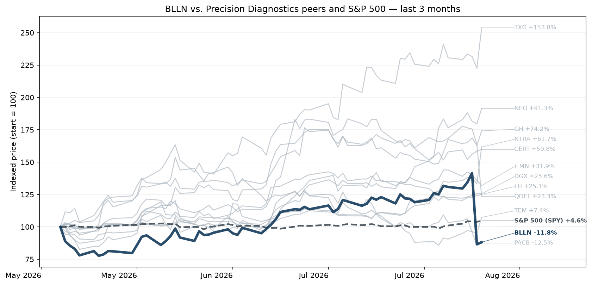

#### Earnings Call Summary

BillionToOne reported strong Q2 2026 results, with total revenue increasing 64% year-over-year to $109.4 million, driven by a 35% increase in test volumes to 196,000 and a 21% increase in ASP to $551. The company achieved GAAP operating income of $5.5 million (5% margin) and an adjusted EBITDA margin of 15%.

#### At a Glance

- **BillionToOne Beats EPS and Revenue Estimates:** BillionToOne Inc reported Q2 2026 adjusted EPS of $0.15, beating the estimated $0.09, and generated revenue of $109,448,000 against the estimated $108,520,000.
- **Strong Test Volume and ASP Growth:** The company&#x27;s performance was driven by an industry KPI of approximately 196,000 tests delivered, representing 35% year-over-year growth, alongside a 21% increase in Overall Average Selling Price to $551 per test.
- **Full-Year 2026 Guidance Reiterate:** BillionToOne reiterated its full-year 2026 revenue guidance of $450 million to $465 million, which represents an expected growth rate of 48% to 52% over 2025 results.
- **Oncology Segment Achieves Explosive Scale:** While the core prenatal clinical testing segment brought in $95.8 million, oncology segment revenue surged by 176% year-over-year to $13.7 million, validating the company&#x27;s expansion into cancer diagnostics.
- **Stock Plunges Despite Earnings Beat:** Despite beating top and bottom-line expectations, BillionToOne shares plummeted over 38% following the release, as investors reacted with disappointment to the unchanged full-year guidance and over $10 million in claims temporarily held up by payers.
- **Expanding Commercial Infrastructure and Partnerships:** Management accelerated commercial investment by adding roughly 70 sales representatives in the first half of 2026 and reached an infrastructure milestone with a rapid platform launch integration on Epic Aura.

#### Key Moments from the Call

- **9m 21s — MolDX Coverage Timeline Secured:** A peer-reviewed study validating Northstar Response for immunotherapy monitoring was published in June. This clinical evidence supports the pursuit of MolDX Medicare coverage for the assay, which represents two-thirds of oncology volume and remains on track for approval by the end of 2026.
- **13m 29s — Epic Aura Integration Milestone:** BillionToOne successfully launched on the Epic Aura platform in under five months, completing its first health system integration in just two weeks. This removes a critical IT barrier, enabling seamless electronic medical record (EMR) test ordering and positioning the company for accelerated health system adoption entering 2027.
- **13m 29s — Accelerated Sales Hiring:** The company hired 70 sales representatives in the first half of 2026, moving ahead of its initial plan due to a strong talent pipeline. While the rapid expansion temporarily diluted short-term sales productivity, it is expected to fuel significant growth late this year as reps become fully productive.
- **40m 54s — Insulated From Payer Friction:** Unlike competitors facing increased payer friction and unbundling issues in carrier screening, BillionToOne remains unaffected. The company intentionally utilizes proprietary PLA codes effective since January 2025, rather than stacked billing codes, shielding its prenatal business from national payer restrictions.
<h3 id="earnings-txg">10x Genomics (<a href="#company-txg">TXG</a>) +140.9%</h3>

**Reported:** August 6, 2026 · [Google Finance earnings page](https://www.google.com/finance/quote/TXG:NASDAQ?tab=earnings&hl=en)

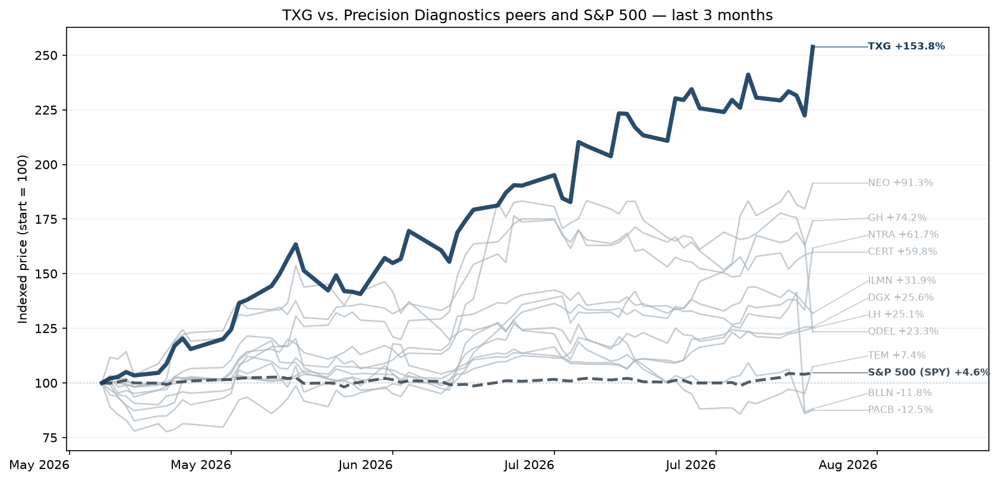

#### Earnings Call Summary

10x Genomics reported Q2 2026 revenue of $151 million, which included $1.6 million from a settlement with Takara. Excluding this settlement, Q2 revenue was $149 million, representing a 3% year-over-year growth driven by continuous momentum across key business segments.

#### At a Glance

- **10x Genomics Beats Q2 Expectations:** 10x Genomics reported a Q2 2026 revenue of $151.04 million, outperforming the estimated $146.62 million, while its reported adjusted EPS loss of $0.14 was narrower than the projected loss of $0.017.
- **Consumables Scale Amid Instrument Decline:** Total consumables revenue grew 7% year-over-year, driven by a 16% jump in spatial consumables, though instrument revenue plummeted 47% as customers delayed purchases ahead of a platform transition.
- **Full-Year Outlook Lifted On Guidance:** Management raised its full-year 2026 revenue guidance to a range of $610 million to $630 million, predicting a brief sequential drop in Q3 before a substantial ramp-up in final quarter shipments.
- **Strategic Launch of Atera Platform:** The company expects to ship approximately 40 units of its new Atera spatial platform in the second half of 2026, though booked customer orders already exceed initial production limits.
- **Market Pullback On Near-Term Outlook:** Shares fell nearly 7% in after-hours trading following the report as investors shrugged off the earnings beat to focus on a softer sequential forecast and ongoing production capacity limits.

#### Key Moments from the Call

- **20m 2s — Atera Revenue Impact and Production Outlook:** Atera instrument orders have significantly outpaced the company's full-year shipment target of approximately 40 units. Due to manufacturing and production capacity constraints, management left its shipment outlook unchanged for 2026, keeping a back-half weighted trajectory mostly targeted at Q4.
- **21m 9s — Quarterly Cadence and Sequential Revenue Step-down:** Management projected a modest sequential revenue step-down in Q3 2026 due to anticipated spatial transition dynamics, as customers temporarily moderate current spatial product and consumable purchases ahead of receiving Atera. A significant step-up is forecasted for Q4 as Atera shipments ramp up.
- **38m 32s — Chromium Consumable Volume Growth and Centralization:** Chromium consumable reaction volume grew robustly, driven by the adoption of Flex Apex for large-scale perturbation screening. This scalability has caused sample processing to centralize into larger core labs, decreasing the immediate need to place new Chromium instruments at individual labs.
- **48m 9s — Macro Academic Funding Hurdles Persist:** The academic end-market macro environment remains tenuous. While high-level funding and grant approvals are occurring, multi-year allocation rules, staffing shortages, and strict review administrative constraints continue to delay these funds from translating into immediate purchasing activity or revenue.
<h3 id="earnings-sbra">Sabra Health Care REIT (<a href="#company-sbra">SBRA</a>) +1.4%</h3>

**Reported:** August 4, 2026 · [Google Finance earnings page](https://www.google.com/finance/quote/SBRA:NASDAQ?tab=earnings&hl=en)

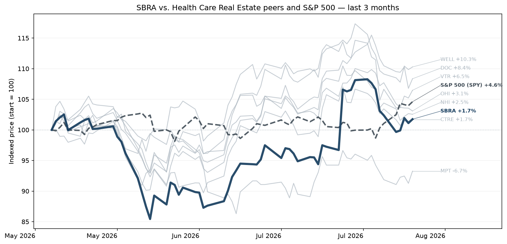

#### Earnings Call Summary

Sabra Health Care REIT closed $600 million in investments, with an additional $100 million in SHOP investments expected before year-end. Total year-to-date investments reached approximately $599 million at a 7.5% cash yield, while the forward-looking pipeline exceeds $1 billion, predominantly focused on SHOP opportunities to continue growing senior housing exposure.

#### At a Glance

- **Sabra Misses EPS but Beats Revenue:** Sabra Health Care REIT reported a Q2 Adjusted EPS of -$0.10, missing the estimated profit of $0.167, while total revenue came in at $238,090,000, beating the estimated $219,459,600.
- **Strong Same-Store Senior Housing Performance:** The company&#x27;s Senior Housing Managed portfolio (SHOP) delivered robust growth, with same-store cash NOI increasing 13.7% year-over-year and same-store occupancy improving by 170 basis points to 88.2%.
- **Full-Year 2026 Guidance Reaffirmed:** Management reiterated its previously upgraded full-year 2026 guidance, expecting normalized FFO per share growth of approximately 7% and normalized AFFO per share growth of roughly 8% at the midpoint.
- **Loan Loss Provision Weights on Earnings:** Headline GAAP net income was heavily impacted by a $102.4 million non-cash provision for loan losses and other reserves resulting from the discounted payoff of the RCA mortgage loan.
- **Significant Sequential Leverage Position Improvement:** Sabra&#x27;s Net Debt to Adjusted EBITDA improved to 4.61x down from 5.04x at the end of March, placing the company comfortably below its historical leverage target threshold.

#### Key Moments from the Call

- **7m 37s — Avamere Rent Reset and Transition Step-Up:** Sabra reset its Avamere lease rent to $48 million retroactively, adding $3.2 million to the quarter's revenue. Management expects this rent to step up to $53 million post-transition later this year, providing a significant annualized organic revenue lift heading into 2027.
- **11m 49s — Improved Balance Sheet and Reduced Leverage:** Sabra's net debt to adjusted EBITDA improved significantly to 4.61x from 5.04x in the prior quarter. This drop puts the company comfortably below its 5.0x target, driven by the payoff of the RCA Mortgage Loan and robust core earnings growth.
- **15m 46s — SHOP Value-Add Pipeline Expansion:** Management detailed a targeted value-add pipeline involving six senior housing properties at ~80% occupancy. Acquired below replacement costs with existing operator relationships, these assets are projected to move from a 6% year-one yield to a 9% stabilized yield with mid-teens IRRs.
- **32m 11s — Sustainable High-Single Digit Growth Target:** Following an upward revision in July, management reaffirmed its 2026 earnings guidance, which projects 7% FFO and 8% AFFO growth at the midpoint. Leadership expressed confidence that benefits from recent acquisitions and structural SHOP expansion make these growth rates highly sustainable into 2027 and 2028.
<h3 id="earnings-lfst">Lifestance Health (<a href="#company-lfst">LFST</a>) +40.8%</h3>

**Reported:** August 6, 2026 · [Google Finance earnings page](https://www.google.com/finance/quote/LFST:NASDAQ?tab=earnings&hl=en)

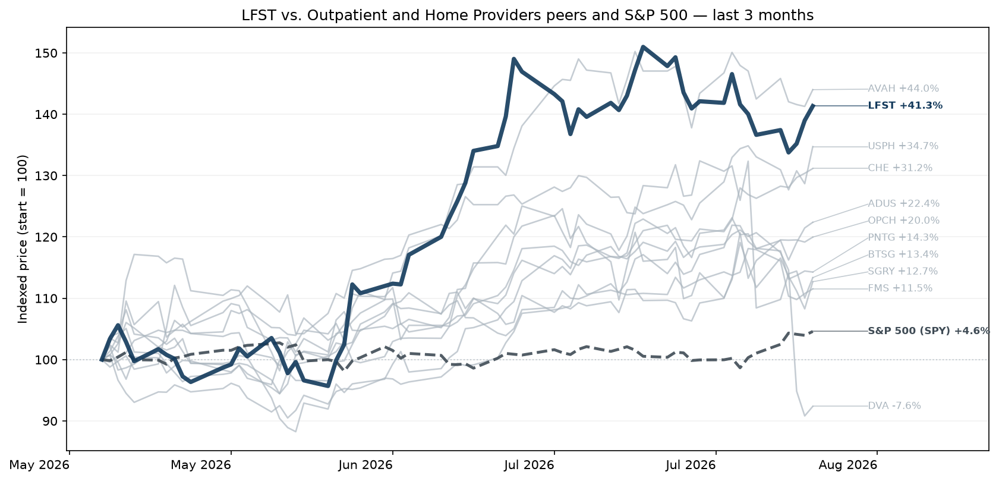

#### Earnings Call Summary

LifeStance Health reported exceptional Q2 2026 financial results with revenue growing 26% year-over-year to $435 million, beating expectations. The growth was driven by a 19% increase in visit volumes to 2.6 million and a 6% increase in total revenue per visit to $167.

#### At a Glance

- **LifeStance Beats Q2 Revenue Estimates:** LifeStance Health reported a Q2 2026 revenue of $435,354,000, outperforming the estimated $414,532,890, while its reported adjusted EPS of $0.06 was down from the estimated $0.082.
- **Clinician Expansion Drives Operational Volume:** The company&#x27;s core KPIs excelled as total visit volumes rose 19% year-over-year to 2.6 million, fueled by expanding the total clinician base 11% to 8,542 and growing visits per clinician by 7%.
- **Full-Year 2026 Guidance Upgraded:** Management raised its full-year 2026 revenue guidance to a range of $1.685 billion to $1.725 billion, surpassing previous expectations due to strong year-to-date performance and durable payer contract rate increases.
- **EBITDA and Cash Generation Surge:** Adjusted EBITDA surged 94% year-over-year to $66 million, expanding the adjusted EBITDA margin by over 500 basis points to 15.2% while driving a significant swing to a positive net income of $24 million.
- **Share Buyback Program and Reinvestment:** LifeStance authorized a new $100 million share repurchase program and announced plans to reinvest a portion of its outperformance into technology, AI tools, and specialty clinical services.

#### Key Moments from the Call

- **9m 13s — Impressive EBITDA Margin Expansion Beat:** Q2 adjusted EBITDA margins reached 15.2%, a year-over-year improvement of over 500 basis points. The $66 million reported EBITDA vastly exceeded expectations, providing concrete evidence that management's discipline and enhanced clinician productivity are successfully translating into powerful bottom-line leverage.
- **11m 34s — Comprehensive Full-Year Guidance Increase:** LifeStance significantly increased its full-year 2026 revenue guidance by $45 million and adjusted EBITDA by $15 million at the midpoint. This comprehensive upward revision highlights strong operational execution and robust volume and rate performance that will please investors looking for sustained top-line momentum.
- **19m 5s — Upward Shift in Pricing Visibility:** Management reported a 6% increase in total revenue per visit to $167 and upgraded its growth expectations from low-to-mid single digits to mid-single digits. Clear line of sight into payer contracting and constructive commercial partnerships provide confidence in near-term pricing power.
- **49m 19s — New EHR Rollout Productivity Risks:** LifeStance plans to deploy a new EHR vendor in waves during 2027. While foundational for long-term clinical excellence and automation, management acknowledged it will cause short-term blips in clinician productivity during implementation, introducing a near-term execution variable for 2027 performance.
<h3 id="earnings-con">Concentra Group (<a href="#company-con">CON</a>) +41.0%</h3>

**Reported:** August 7, 2026 · [Google Finance earnings page](https://www.google.com/finance/quote/CON:NYSE?tab=earnings&hl=en)

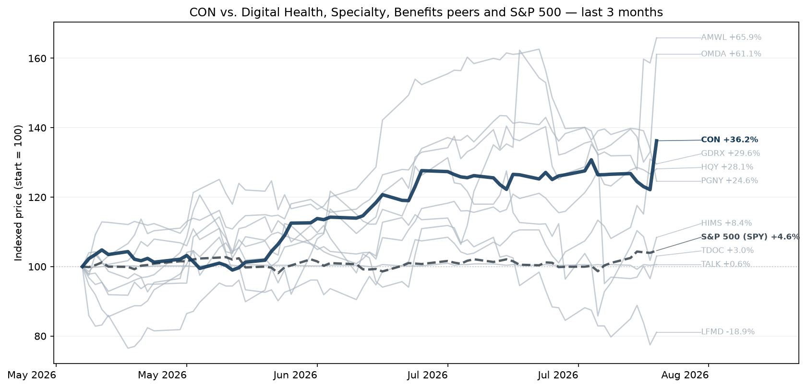

#### Earnings Call Summary

Concentra Group Holdings reported Q2 2026 revenue of $606 million, representing 10% year-over-year growth (8% excluding Pivot). Total occupational health center patient visits rose 2.6% to over 56,000 per day, with work comp visits up 3.7% and employer services up 1.8%, driven by a resilient blue-collar labor market and market share gains.

#### At a Glance

- **Concentra Strong Beats Q2 Expectations:** Concentra Group Holdings reported Q2 2026 adjusted EPS of $0.51, beating the estimated $0.421, while revenue reached $606.03 million against expectations of $591.99 million.
- **Patient Traffic and Revenue Expand:** The company delivered strong occupational health center metrics, with daily patient visits growing 2.6% to 56,421 and average revenue per visit increasing 4.6% to $152.67 compared to the prior year.
- **Full-Year Guidance Revised Upward:** Management raised its full-year 2026 revenue guidance to a range of $2.325 billion to $2.375 billion and adjusted EBITDA expectations to between $485 million and $495 million due to sustained operational momentum.
- **Strategic Leadership Succession Announced:** Concentra announced that long-time CEO Keith Newton will transition to Executive Chairman effective November 1, 2026, with current President and CFO Matt DiCanio succeeding him as the next CEO.
- **Leverage Milestone Triggers Interest Savings:** The company reduced its net leverage ratio ahead of schedule to 2.99x, triggering a favorable 25 basis point reduction in its credit agreement interest rate spread.

#### Key Moments from the Call

- **1m 21s — CEO Succession Plan Announced:** CEO Keith Newton will transition to Executive Chairman on November 1st, 2026, after over a decade in the role. Matt DiCanio, current President and CFO, will succeed him as President and CEO, signaling continuity in the company's long-term growth strategy.
- **9m 58s — Onsite Health Clinics Segment Outperforms:** The Onsite Health Clinics segment posted 72.1% revenue growth (27.9% organic), driven by the successful integration of the Pivot acquisition and expanding advanced primary care services, capturing high employer demand for workplace healthcare.
- **15m 57s — Leverage Target Reached Ahead of Schedule:** Net leverage dropped below 3.0x in Q2, hitting management's year-end goal early due to robust cash generation. This reduction triggers an automatic 25 basis point reduction in interest rate spreads on its term loan B, lowering forward interest expenses.
- **18m 11s — Full-Year 2026 Guidance Raised:** Management raised full-year 2026 guidance across revenue, Adjusted EBITDA, and free cash flow. This positive revision reflects strong year-to-date visit and rate growth, operational cost efficiencies, and market share gains, providing a strong positive signal to investors.
<h3 id="earnings-docs">Doximity (<a href="#company-docs">DOCS</a>) +5.5%</h3>

**Reported:** August 6, 2026 · [Google Finance earnings page](https://www.google.com/finance/quote/DOCS:NYSE?tab=earnings&hl=en)

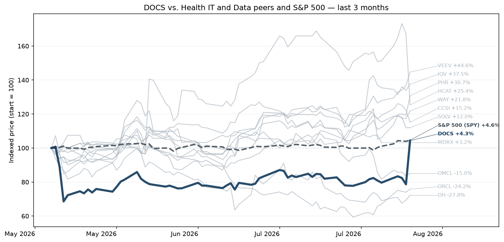

#### Earnings Call Summary

Doximity reported Q1 2027 revenue of $157M, up 7% year-over-year, and an adjusted EBITDA of $75M (48% margin), beating the high end of guidance by 3% and 8% respectively. This performance was driven by a re-acceleration across pharma and hospital clients, along with robust engagement from its largest subscription customers.

#### At a Glance

- **Doximity Tops Revenue but Misses EPS:** For the fiscal first quarter of 2027, Doximity reported revenue of $156,618,000, beating the estimated $151,726,660, while its reported adjusted EPS of $0.13 missed the estimated 0.303.
- **Strong Engagement and Prescriber Growth:** The company achieved record platform engagement, highlighted by workflow active prescriber growth of more than 30% year-over-year and AI Search query growth exceeding 25% sequentially.
- **Full Year Revenue Guidance Raised:** Doximity raised its full-year fiscal 2027 revenue guidance to a range of $671 million to $681 million, up from its previous outlook of $664 million to $676 million.
- **Market Reacts with Massive Surge:** Despite the narrow adjusted earnings miss, the stock soared roughly 80% in extended trading due to robust top-line numbers, strong full-year projections, and early commercial traction in AI products.
- **Rapid Clinical AI Enterprise Adoption:** Doximity successfully scaled its clinical artificial intelligence tools, securing 165 health system AI clients and expanding early monetization of its AI Search tool with pharmaceutical customers.

#### Key Moments from the Call

- **3m 45s — Independent Clinical AI Validation:** Doximity Ask outperformed major competitors like Anthropic's Fable 5 in the independent NOHARM study, validating the company's clinical accuracy and enhancing its competitive position with hospital AI steering committees.
- **8m 41s — AI Search Commercial Pipeline:** While no revenue was recognized from AI Search in Q1, the product is driving significant client engagement and unlocking innovation budgets. The majority of contracted AI Search revenue is expected to hit in Q3.
- **10m 32s — Gross Margin Compression from AI Compute:** Non-GAAP gross margin declined to 88% from 91% last year due to intentional increases in AI compute spend to support surging clinician usage, which will continue throughout fiscal 2027.
- **12m 30s — Full-Year Guidance Increase:** Management raised full-year fiscal 2027 revenue guidance by $6M to $671M-$681M, reflecting a more stable pharma budget environment, increased customer interaction velocity, and a growing commercial AI pipeline following the rollout of AI Search.
<h3 id="earnings-prva">Privia Health Group (<a href="#company-prva">PRVA</a>) -2.6%</h3>

**Reported:** August 6, 2026 · [Google Finance earnings page](https://www.google.com/finance/quote/PRVA:NASDAQ?tab=earnings&hl=en)

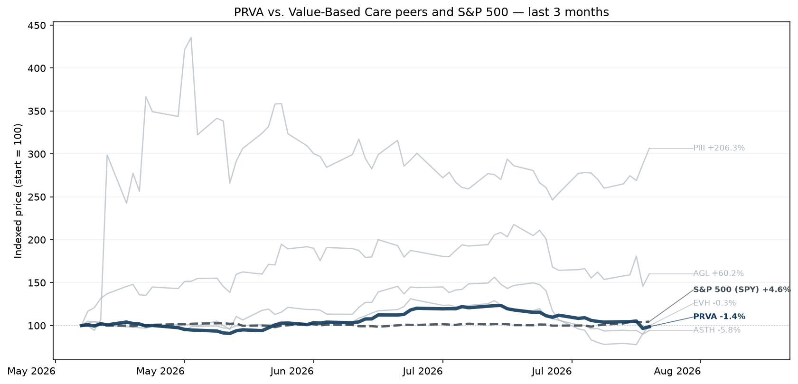

#### Earnings Call Summary

Privia Health achieved Q2 2026 practice collections growth of 12.4% year-over-year to $970 million, driven by a 10.1% increase in implemented providers and a 19.2% increase in value-based attributed lives. Adjusted EBITDA rose 29% to $37.4 million, reflecting 28.3% of care margin, expanding the EBITDA margin by 310 basis points due to operational leverage.

#### At a Glance

- **Top-Line Revenue Beats While EPS Misses Estimates:** Privia Health Group reported Q2 2026 revenue of $632.63 million, topping expectations of $600,761,020, but its reported adjusted EPS of $0.07 missed the consensus estimate of $0.244.
- **Strong Operational KPIs and Network Scaling:** The company&#x27;s implemented provider base scaled up by 10.1% year-over-year to 5,644, while value-based care attributed lives jumped 19.2% to 1.64 million.
- **Management Raises Full-Year 2026 Guidance:** Following strong first-half momentum, management raised its full-year GAAP revenue guidance toward the high end of its prior $2.35 billion to $2.45 billion range.
- **Diversified Streams Fuel Local Utilization Health:** Fee-for-service patient care revenue rose 24.5% year-over-year to $412.6 million, capitated revenue grew 26.0% to $95.2 million, and care management fees increased 22.5% to $20.7 million.
- **Shares Drop on Cautious Growth Factors:** Despite the revenue beat and upgraded outlook, Privia Health shares fell roughly 5.2% to 11.3% as investors reacted to slower implied growth for the second half and potential timing delays in Medicare Shared Savings Program cash flows.
- **Margin Improvement Driven by Platform Leverage:** Adjusted EBITDA rose 29% year-over-year to $37.4 million, expanding its margin by 310 basis points to 28.3% of care margin as the company works toward its long-term 30% to 35% target.

#### Key Moments from the Call

- **7m 41s — Full-Year 2026 Guidance Increase:** Privia Health raised its 2026 full-year expectations for attributed lives above its prior guidance bracket, and moved practice collections, GAAP revenue, care margin, and adjusted EBITDA forecasts toward the upper ends of their ranges due to a strong first half.
- **11m 18s — EBITDA Margin Target Confidence:** Management expressed strong confidence in reaching the high end of its long-term 30% to 35% adjusted EBITDA margin as a percentage of care margin over the next few years, fueled by market maturity and ongoing deployments of corporate and clinical AI tools.
- **12m 30s — Conservative Second-Half Revenue Projections:** Analysts highlighted that the updated guidance implies a deceleration from 13% practice collections growth in the first half to 3% in the second half. Management characterized this as routine mid-year prudence rather than operational or market-driven utilization headwinds.
- **19m 7s — Integration of Evolent and IMS:** The company reported seamless operational integration of its prior-year acquisitions, Evolent's Care Partners and Arizona-based IMS. These assets are successfully expanding Privia's total addressable market through a dual-pronged go-to-market structure consisting of full medical groups and an ACO-only network model.
<h3 id="earnings-pgny">Progyny (<a href="#company-pgny">PGNY</a>) +18.5%</h3>

**Reported:** August 6, 2026 · [Google Finance earnings page](https://www.google.com/finance/quote/PGNY:NASDAQ?tab=earnings&hl=en)

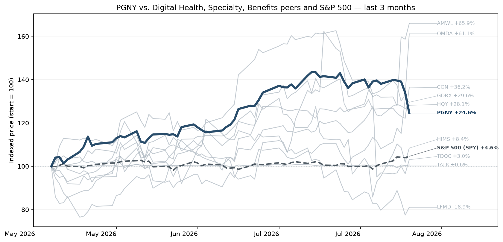

#### Earnings Call Summary

Progyny reported a strong Q2 2026, delivering record quarterly revenue of $350.51M, a 5.3% reported increase (11% excluding a transitioned client). Gross margin expanded 180 basis points, and adjusted EBITDA margin reached 17.2% on a trailing 12-month basis. The company maintains strong cash generation, exceeding $50M in operating cash flow for four of the last five quarters.

#### At a Glance

- **Progyny Beats Estimates on Top and Bottom Lines:** Progyny reported Q2 2026 revenue of $350.51 million, beating the analyst expectation of $346.25 million, while reported adjusted EPS came in at $0.34 against the estimated $0.519.
- **Margin Expansion Drives Key Profitability Performance:** Gross margin expanded by 180 basis points year-over-year to 25.5%, while Adjusted EBITDA increased 7.2% to $62.1 million, reflecting care management efficiencies and lower stock-based compensation.
- **Weak Guidance Overshadows Solid Q2 Results:** Management lowered its full-year 2026 revenue guidance to a midpoint of $1.37 billion due to a more pronounced summer slowdown, underperforming previous analyst expectations.
- **Shares Tumbler Following Earnings Release:** Despite achieving record quarterly revenue, Progyny&#x27;s stock plummeted over 15% in after-hours trading as investors focused heavily on near-term seasonal growth headwinds and reduced guidance.
- **Aggressive Share Repurchases Shrink Outstanding Volume:** Progyny continued its capital return strategy by purchasing nearly 1.2 million shares in Q2, contributing to a total 12.5% reduction in overall shares outstanding since November 2025.

#### Key Moments from the Call

- **5m 53s — Accelerated Selling Season Secures 1M Lives Target:** Investors will be pleased by early commitments and de-risked client renewals pacing ahead of historical timelines. Driven by employers seeking cost-containment options against a 10%+ inflation environment, Progyny secured early jumbo wins and conversions, reinforcing high confidence in hitting its 1 million new lives target.
- **14m 19s — Robust Share Buybacks Support EPS Flexibility:** Progyny pleased shareholders by leveraging its consistent $200M+ trailing operating cash flow to fuel an aggressive buyback program. Total share repurchases since November have successfully reduced outstanding shares by 12.5%, providing a solid mechanism to enhance shareholder value alongside ongoing internal investments.
- **15m 17s — Pronounced Summer Seasonality Triggers Guidance Re-calibration:** Investors may feel cautious as management highlighted a more pronounced summer slowdown in member engagement. Though September scheduling indicates a return to normal baseline trends, the near-term softness prompted a narrowing of full-year revenue guidance to a 5.5% to 7.5% growth range, reflecting stable but conservative utilization expectations.
- **31m 48s — Favorable Shift Toward Competitive Brownfield Conversions:** Analysts heavily focused on market demand trends. Management revealed a significant shift toward "brownfield" wins, capturing market share directly from carrier and venture-backed solutions. Employers facing escalating healthcare and GLP-1 costs are actively seeking out Progyny due to its transparent ROI and proven total cost-containment track record.
<h3 id="earnings-clov">Clover Health (<a href="#company-clov">CLOV</a>) +52.6%</h3>

**Reported:** August 5, 2026 · [Google Finance earnings page](https://www.google.com/finance/quote/CLOV:NASDAQ?tab=earnings&hl=en)

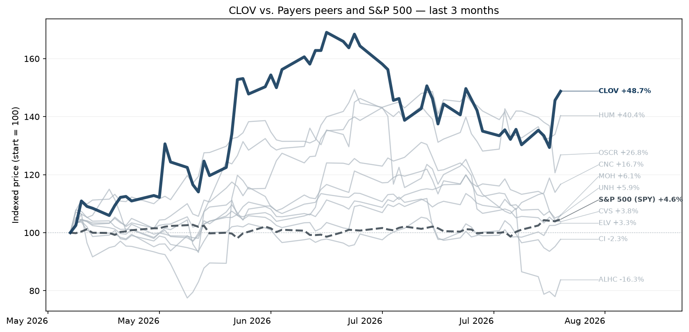

#### Earnings Call Summary

Clover Health reported strong performance for the first half of 2026, delivering 48% year-over-year Medicare Advantage membership growth and increasing GAAP net income by $67 million. Total revenue for the first half increased by over $550 million year-over-year to $1.5 billion, while consolidated gross profit grew by $104 million with operating leverage expanding by over 200 basis points.

#### At a Glance

- **Clover Health Meets EPS, Beats Revenue:** Clover Health reported an Adjusted EPS of $0.05, matching the analyst estimate, while total revenue reached $743,167,000, beating the expected $732,669,000.
- **Strong Medicare Advantage Membership Growth:** The company&#x27;s core KPI, Medicare Advantage membership, surged 48% year-over-year to 157,309 average members, while its benefit-expense ratio improved to 87.6% from 88.4% in Q2 2025.
- **Full-Year Guidance Lifted Broadly:** Management raised its full-year 2026 revenue guidance midpoint to $2.96 billion alongside an upward adjustment to its Adjusted EBITDA outlook to $77.5 million at the midpoint.
- **AI Clinical Software Accelerates Profitability:** Operational improvements were largely driven by the scaling of the Clover Assistant platform, which enhances point-of-care clinical decisions and accelerates cohort maturation.
- **Market Reacts Positively After Hours:** Following the strong revenue beat and raised guidance, Clover Health&#x27;s stock price jumped 10.39% in after-hours trading.

#### Key Moments from the Call

- **14m 27s — Full-Year 2026 Guidance Increased Across All Metrics:** Clover Health raised its full-year 2026 outlook following a strong first half, projecting full-year GAAP net income profitability of $20 million to $35 million and adjusted EBITDA of $70 million to $85 million, signaling greater confidence that recent member growth is successfully converting into expected long-term earnings.
- **17m 40s — Medicare Advantage Cohort Maturation Confirms Margin Improvement:** Management highlighted that historical member cohorts show a $70 PMPM gross profit step-up from year one to year two. This maturation curve is tracking as expected for the large 2025 cohort, validating the underlying earnings power and margin expansion potential of their full-risk care model heading into 2027.
- **20m 18s — Strategic Expansion of Back-Office AI Operations:** CEO Andrew Toy announced plans to quickly deploy AI into back-office insurance operations, including claims processing speed and accuracy. This administrative optimization aims to compound future margin opportunities and lower overhead, complementing the clinical benefits already realized through the flagship Clover Assistant platform.
- **27m 47s — Bids Factor in Continued Competitor Market Disruptions:** During the Q&A session, management disclosed that their 2027 Medicare Advantage bids accounted for continued market disruption and market exits by national and local competitors in core New Jersey and Georgia regions, allowing Clover to maintain a highly competitive and profitable growth posture.
<h3 id="earnings-adus">Addus HomeCare (<a href="#company-adus">ADUS</a>) +20.2%</h3>

**Reported:** August 4, 2026 · [Google Finance earnings page](https://www.google.com/finance/quote/ADUS:NASDAQ?tab=earnings&hl=en)

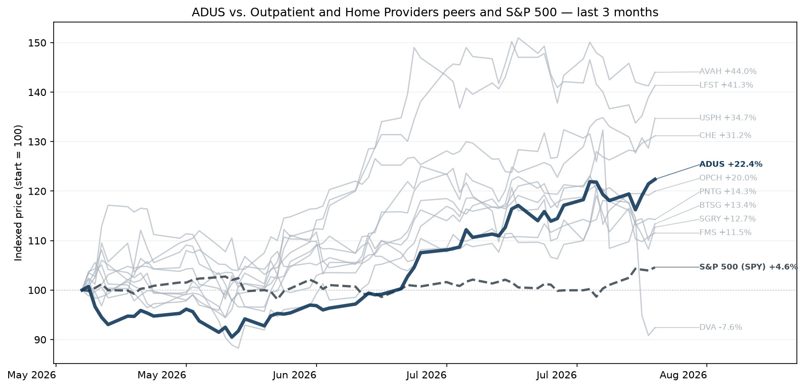

#### Earnings Call Summary

Addus HomeCare reported Q2 2026 revenue of $377.4 million, an 8% increase year-over-year from $349.4 million. Adjusted EPS grew 16.1% to $1.73, and adjusted EBITDA increased 11.9% to $49.2 million. Operating cash flow grew significantly to $40 million, enabling debt reduction to $64.3 million.

#### At a Glance

- **Addus Misses EPS, Beats Revenue:** Addus HomeCare reported an adjusted EPS of $1.49, missing the analyst estimate of $1.698, while quarterly revenue reached $377.42 million, slightly ahead of the expected $376.22 million.
- **Robust Growth Across Care Segments:** The personal care segment generated a robust 6.8% organic revenue growth, while hospice operations delivered an outstanding 11.1% same-store revenue growth.
- **Positive Full-Year Margin Guidance:** Management projected steady full-year growth and guided toward the upper end of its 12% to 13% adjusted EBITDA margin range.
- **Significant Debt Reduction Boosts Liquidity:** Operating cash flow increased to $40 million, allowing Addus to reduce its bank debt by $30 million from the previous quarter and secure greater financial flexibility for strategic acquisitions.
- **Market Pullback Followed by Rebound:** The company&#x27;s stock experienced a minor initial post-earnings pullback before recovering ground to close nearly 2% higher as investors processed the steady segments&#x27; underlying strength.

#### Key Moments from the Call

- **9m 26s — Medicare Cap Headwind in Hospice:** Investors may be concerned by a $3 million Medicare cap accrual penalty that impacted hospice margins this quarter. Management implements mitigation strategies and expects no further cap exposure for the remainder of 2026, targeting potential cost recovery before the cap year concludes.
- **21m 42s — Caregiver App Accelerated Texas Fill Rates:** The rollout of the new caregiver app has exceeded expectations in Texas, driving consolidated fill rates to 84%-85%. This digital tool has also contributed to a decline in caregiver turnover, helping alleviate the industry's primary constraint of labor supply to capture organic demand.
- **23m 27s — Full-Year Margin Guidance Rises Within Range:** Strong Q2 financial execution and G&A leverage positioned Addus to project full-year adjusted EBITDA margins toward the upper end of its 12% to 13% range. This operational efficiency gives investors greater confidence in bottom-line execution despite regional wage inflation pressures.
- **28m 59s — Scalable M&A Pipeline and Outlook:** Easing macro anxieties regarding regulatory Medicaid rule changes has motivated independent owners, driving an uptick in personal care pipeline opportunities. Combined with optimism surrounding the proposed 2027 home health payment rule, Addus is actively evaluating scaled platform acquisitions using its low leverage profile.
<h3 id="earnings-agl">Agilon Health (<a href="#company-agl">AGL</a>) +76.1%</h3>

**Reported:** August 5, 2026 · [Google Finance earnings page](https://www.google.com/finance/quote/AGL:NYSE?tab=earnings&hl=en)

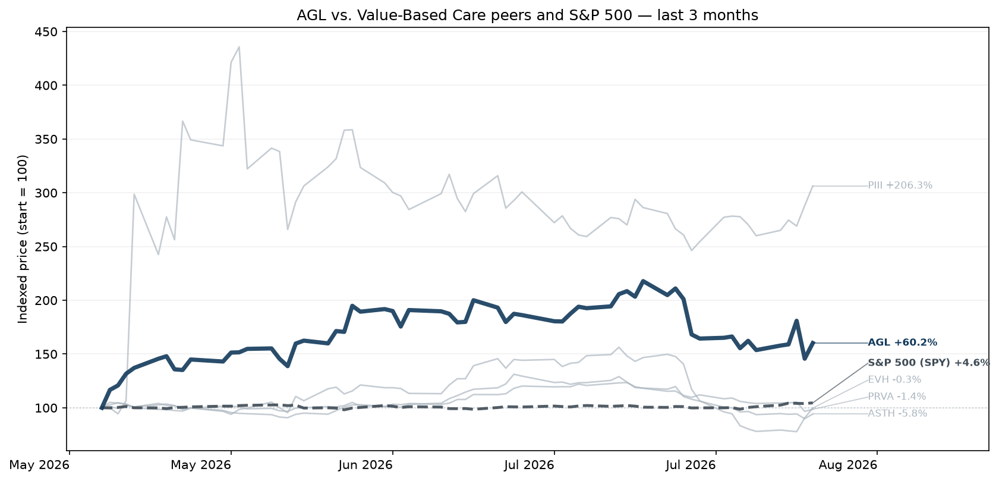

#### Earnings Call Summary

CEO Tim O'Rourke and CFO Jeff Schwaneke highlighted that agilon health exceeded Q2 2026 guidance across key financial metrics and raised its full-year 2026 outlook. The performance was driven by Q2 strength, moderating medical cost trends first seen in Q1, and a stronger-than-expected burden of illness program performance.

#### At a Glance

- **Agilon Health Beats Q2 Estimates:** Agilon Health reported a substantial bottom-line surprise with an Adjusted EPS of $1.04 compared to the estimated $0.272, alongside revenues of $1.49 billion that surpassed the $1.45 billion estimate.
- **Profits Swing High on KPIs:** The company&#x27;s key performance metrics showed a powerful turnaround, with medical margin swinging to a positive $197 million from negative $53 million a year ago, and Adjusted EBITDA reaching $70 million.
- **Management Hikes Full-Year Guidance:** Capitalizing on strong performance, agilon health raised its full-year 2026 revenue guidance midpoint to $5.82 billion and pushed its expected full-year Adjusted EBITDA up to approximately $85 million.
- **Membership Shrinks for Strategic Profitability:** Total platform membership fell 10% year-over-year to 549,000, representing an intentional and disciplined contracting strategy to exit certain markets and prioritize long-term profitability.
- **Stock Rallies Following Core Turnaround:** Driven by the large earnings beat and enhanced full-year outlook, agilon health&#x27;s stock reacted strongly, closing regular trading up over 13% after the release.

#### Key Moments from the Call

- **3m 30s — Full-Year 2026 Guidance Increase:** Agilon health raised its full-year 2026 guidance to $5.8B revenue, $485M medical margin, and $85M adjusted EBITDA. This positive revision will please investors as it reflects structural medical cost moderation and higher risk adjustment revenue, proving that the company's operational discipline and data pipelines are driving material financial improvements.
- **14m 25s — Significant Risk Score Uplift:** Net risk adjustment revenue estimates increased to 3% year-over-year, doubling the prior 1.5% estimate. This positive development will please investors because it demonstrates the clear success of agilon's clinical programs and enhanced data pipeline, providing better-than-expected revenue flow-through and earlier operational visibility.
- **15m 28s — Favorable Medical Cost Trend Developments:** Estimated full-year 2025 cost trends dropped to 5.8% from 6.2%, and Q1 2026 trends improved to the low 6% range. This structural improvement will reassure investors that macro utilization pressures are easing and that agilon's clinical pathways are successfully reducing unnecessary hospitalizations and ER visits.
- **23m 17s — Payer Contracting and 2027 Outlook:** Management touched 80% of contracts last year and has 50% open for renegotiation this year, aiming to minimize Part D exposure below the current 15% level. This strategic shift will comfort investors by showcasing continuous portfolio refinement to lock in profitability ahead of 2027 market changes.
<h3 id="earnings-ardt">Ardent Health Partners (<a href="#company-ardt">ARDT</a>) +14.2%</h3>

**Reported:** August 5, 2026 · [Google Finance earnings page](https://www.google.com/finance/quote/ARDT:NYSE?tab=earnings&hl=en)

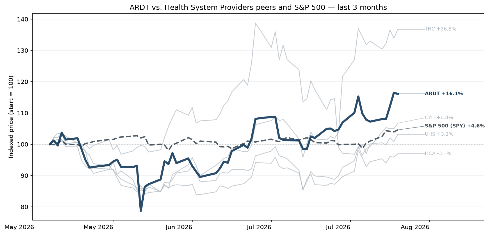

#### Earnings Call Summary

Management implemented a multi-year operational transformation program named IMPACT, increasing the 2026 savings target from $55M to at least $70M. This expansion was driven by structural changes executed in Q2 to reduce managerial layers across corporate and field locations, which is expected to yield $15M-$20M in additional savings this year.

#### At a Glance

- **Ardent Health Misses EPS Estimates:** Ardent Health reported Q2 2026 adjusted EPS of $0.12, missing the estimated $0.19, while quarterly revenue came in at $1.62 billion, which beat the estimated $1.59 billion.
- **Mixed Volume Performance in KPIs:** Adjusted admissions grew by 2.5% year-over-year, but actual admissions fell 1.0% and total surgeries declined 2.9% due to weakness in April and May before rebounding in June.
- **Full-Year Financial Guidance Maintained:** Management reaffirmed its full-year 2026 outlook, projecting total revenue between $6.4 billion and $6.7 billion and adjusted EBITDA between $485 million and $535 million.
- **Robust Operating Cash Flow Surge:** Despite profitability pressures and volume headwinds, operating cash flow jumped 67.4% year-over-year to reach $197 million for the quarter.
- **Positive Stock Performance Following Results:** Shares of Ardent Health rose over 7.8% following the earnings release as investors prioritized strong cash flow generation and tighter cost controls over the profit miss.
- **IMPACT Savings Target Increased Higher:** The company raised its full-year 2026 IMPACT program efficiency savings target to at least $70 million, up from the previous projection of $55 million.

#### Key Moments from the Call

- **5m 41s — Strategic Outpatient Payer Contract Win:** The execution of a data-driven contract renewal added an unexpected $5M-$10M to this year's EBITDA. Management highlighted that this single market renewal validates an ongoing portfolio-wide strategy to recontract underpriced outpatient rates, giving investors a clear catalyst for future structural revenue yield improvements.
- **7m 41s — IMPACT Program Target Upgraded to $70M:** To counteract challenging volume dynamics, management aggressively pulled forward internal cost initiatives and streamlined corporate and field managerial structures. This decision increased the 2026 cost savings target to at least $70M, demonstrating strong operational flexibility and reassuring investors focused on near-term margin protection.
- **15m 54s — Lower Revenue Outlook but Confirmed EBITDA Guidance:** Ardent Health now biases full-year revenue toward the low end of its $6.4B-$6.7B range due to early Q2 volume softness. However, management pleased investors by maintaining its full-year adjusted EBITDA guidance of $485M-$535M, utilizing immediate cost actions and a key payer renewal to fully offset the $25M volume headwind.
- **22m 3s — Inpatient to Outpatient Surgical Mix Shift:** Analysts probed a steep drop in inpatient surgeries. Management explained this was driven primarily by procedures moving off the inpatient-only list, and reassured investors that the net financial impact of this mix shift was extremely modest at just $1M-$2M for the quarter.
<h3 id="earnings-pntg">Pennant Group (<a href="#company-pntg">PNTG</a>) +8.6%</h3>

**Reported:** August 6, 2026 · [Google Finance earnings page](https://www.google.com/finance/quote/PNTG:NASDAQ?tab=earnings&hl=en)

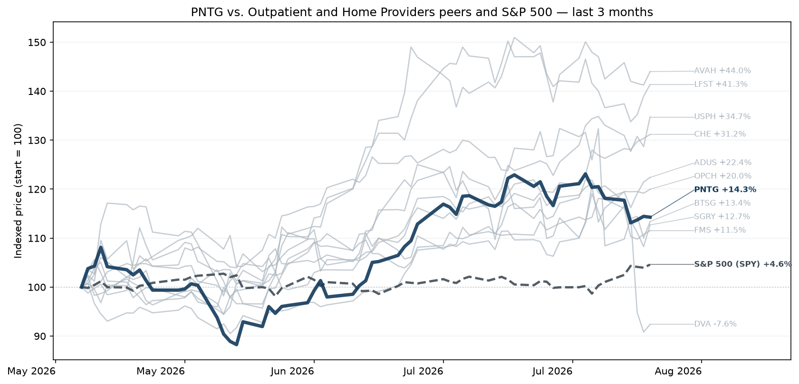

#### Earnings Call Summary

The Pennant Group reported strong Q2 2026 revenue of $298.0 million, up 35.8% year-over-year, and adjusted EPS of $0.36, up 33.3%, both beating market consensus. Growth was driven by solid organic trends and the successful transition of its largest historical acquisition in the Southeast.

#### At a Glance

- **Pennant Group Exceeds Top-Line Expectations:** The Pennant Group reported a Q2 2026 revenue of $297,984,000, beating estimates of $288,707,430, while reported adjusted EPS came in at $0.25 compared to the $0.33 estimate.
- **Home Health and Admissions Drive Performance:** The Home Health and Hospice Services segment drove strong expansion, with segment revenue rising 43.2% year-over-year to $237.8 million, supported by a 62.3% surge in total home health admissions.
- **Full-Year 2026 Guidance Significantly Raised:** Encouraged by a strong first half, management raised its full-year outlook, now projecting revenue between $1.17 billion and $1.19 billion, and adjusted diluted EPS between $1.34 and $1.41.
- **Strategic Acquisitions Expand Footprint Faster:** The operational momentum was accelerated by the integration of recently acquired Southeast operations from UnitedHealth and Amedisys, which is progressing ahead of management expectations.
- **Operating Cash Flow Surges Dramatically:** Alongside top-line improvements, the company&#x27;s operating cash flow surged 225.5% year-over-year to $21.8 million, showcasing increased operational leverage and efficient growth conversion.

#### Key Moments from the Call

- **4m 54s — Favorable Proposed Home Health Rule:** The 2027 proposed home health rule indicates a positive reversal in the regulatory rate cycle with a modeled 1.7% base rate increase for Pennant, relieving multi-year reimbursement pressures and improving long-term outlook visibility.
- **6m 50s — Full Year 2026 Guidance Raised:** Management increased full year revenue and EPS guidance above initial expectations, signaling strong operational momentum and faster-than-planned financial integration of their large Southeast acquisition, which will please investors looking for sustained growth.
- **11m 30s — Southeast Integration Outperformance:** Integration of the massive Amedisys asset package in the Southeast is trending ahead of internal expectations on volume retention and financial margins, reducing execution risk during its peak transition waves through October.
- **45m 6s — CapEx Drag on Near-Term Cash Flow:** Elevated CapEx driven by turnaround efforts at distressed, newly acquired senior living buildings, alongside increased debt from the Hartford investment, highlights an ongoing capital allocation trade-off between growth funding and near-term leverage reduction.
<h3 id="earnings-qdel">QuidelOrtho (<a href="#company-qdel">QDEL</a>) +13.8%</h3>

**Reported:** August 6, 2026 · [Google Finance earnings page](https://www.google.com/finance/quote/QDEL:NASDAQ?tab=earnings&hl=en)

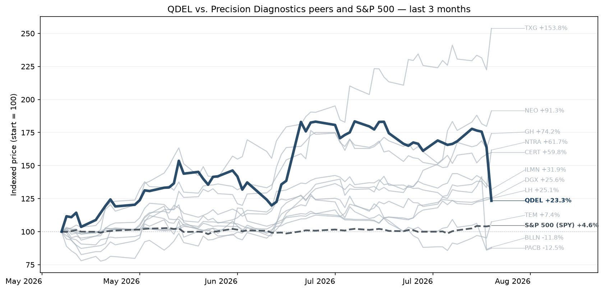

#### Earnings Call Summary

QuidelOrtho reported Q2 2026 total revenue growth of 2% on a constant currency basis. Growth reached 6% excluding China, driven by broad-based core strength including 9% non-China labs revenue growth and a 9% expansion in TRIAGE. Adjusted EBITDA surged 21% to $129 million, expanding margins by 310 basis points to 20%.

#### At a Glance

- **QuidelOrtho Surpasses Q2 Top-Line Estimates:** QuidelOrtho reported revenue of $630.9 million, beating the estimated $618.83 million, while reported adjusted EPS came in at $0.13, significantly ahead of the estimated loss of $0.05 per share.
- **Core Regions Performance Offsets China Weakness:** Excluding China, total revenue grew 6% constant currency with Labs segment revenue up 9% and TRIAGE revenue expanding 9%, although a 23% year-over-year revenue drop in China due to policy changes pressured overall growth.
- **Management Drastically Lowers Full-Year Outlook:** QuidelOrtho slashed its full-year 2026 revenue guidance to a range of $2.52 billion to $2.60 billion from the prior $2.70 billion to $2.75 billion, alongside withdrawing its free cash flow guidance due to respiratory market and China uncertainties.
- **Adjusted EBITDA Margins Expand From Cost-Savings:** Adjusted EBITDA grew 21% year over year to $129.3 million, driving a 310-basis-point margin expansion to 20.5% thanks to active internal cost-cutting initiatives.
- **Market Reaction Sinks Share Price Post-Earnings:** Despite the second-quarter earnings beat, QuidelOrtho shares plummeted over 21% as investor sentiment turned sharply negative following the massive full-year guidance cuts.

#### Key Moments from the Call

- **3m 28s — Strong EBITDA Expansion Despite China Headwinds:** Investors will be pleased by a 21% increase in adjusted EBITDA to $129 million and 310 basis points of EBITDA margin expansion. This highlights resilient operational productivity, cost discipline, and 6% revenue growth outside of China, showcasing underlying business health despite regional market volatility.
- **8m 8s — Full Year 2026 Guidance Downgrade:** QuidelOrtho disappointed investors by lowering its full year revenue, adjusted EBITDA, and EPS guidance, while withdrawing free cash flow guidance entirely. This retreat stems from prolonged buying friction and policy uncertainty in China, combined with conservative, below-average modeling for the upcoming respiratory season due to low early positivity rates.
- **12m 32s — New CFO Outlines Balance Sheet Priorities:** Newly appointed CFO Micah Young focused heavily on stabilizing the company's financial profile. Addressing a net debt leverage of 4.3x adjusted EBITDA, he prioritized working capital improvements, optimizing instrument investment returns, and scaling back capital expenditures to accelerate debt reduction and improve cash conversion efficiency.
- **19m 22s — Addressing Point-of-Care Business Sale Rumors:** During the Q&A session, CEO Brian Blaser refused to comment directly on media speculation regarding a potential sale of the company's point-of-care business. However, he noted that the board regularly evaluates portfolio optimization opportunities to enhance shareholder returns, keeping investors attentive to future strategic shifts.
<h3 id="earnings-cert">Certara (<a href="#company-cert">CERT</a>) +30.0%</h3>

**Reported:** August 4, 2026 · [Google Finance earnings page](https://www.google.com/finance/quote/CERT:NASDAQ?tab=earnings&hl=en)

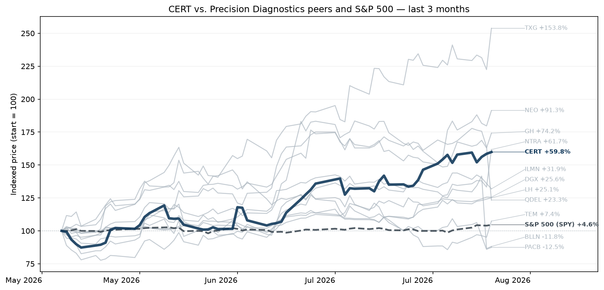

#### Earnings Call Summary

Certara reported Q2 2026 total revenue of $93.3M, missing the estimated $98.1M and representing modest 1% YoY growth. Software revenue rose 4% to $48.8M, representing 53% of the business, while services revenue declined 3% to $44.5M following the Regulatory and Medical Writing business carve-out.

#### At a Glance

- **Certara Misses Financial Estimates Widely:** Certara reported a top-line miss with revenue of $93,271,000 against expectations of $98,079,000, while reported adjusted EPS fell significantly short at -$0.36 compared to the estimated $0.091.
- **Software Bookings Drive Segment Divergence:** Software bookings increased 9% year-over-year to $50.7 million, outperforming services bookings which fell 6% due to go-to-market adjustments and past divestitures.
- **Management Adjusts Margin Guidance Downward:** The company adjusted its full-year 2026 adjusted EBITDA margin guidance downward to a range of 29% to 31% to solely reflect stranded infrastructure costs from the divestiture of its regulatory business.
- **Strategic Focus Shifts Toward AI:** Certara highlighted growing AI-driven productivity enhancements, revealing that up to 85% of its new software code is now AI-assisted, boosting engineer development rates by 65% year-over-year.
- **Revenue Miss Prompts Market Selloff:** Following the earnings release, investor disappointment over the performance and ongoing structural transition triggered a sharp market reaction, causing the stock to plunge over 16% in premarket trading.

#### Key Moments from the Call

- **14m 0s — Revenue and EPS Miss Market Estimates:** Certara's Q2 2026 revenue of $93.3M and adjusted EPS of $0.08 came in below analyst expectations of $98.1M and $0.091. This softer financial showing was heavily impacted by the divestiture of its Regulatory and Medical Writing business, which caused a 3% decline in services segment revenue.
- **19m 4s — Full-Year Margin and EPS Guidance Cut:** Management lowered its 2026 adjusted EBITDA margin guidance midpoint by 100 basis points to 29%–31% and reduced full-year adjusted EPS guidance to $0.31–$0.36. While the business unit underlying trends remain intact, the cuts reflect lingering unallocated infrastructure overhead following the May asset sale.
- **21m 9s — Strategic Commercial Transformation and New Leadership:** Investors will be pleased by a 27% YoY pipeline expansion following a pivot back to specialist, scientist-led commercial teams. The operational course correction is being solidified by the appointment of Julien Perrier as Chief Commercial Officer to aggressively monetize cloud-based pharmacometrics and international markets.
- **39m 25s — Increased Cost Savings Framework:** To defend margins against structural headwinds, Certara boosted its annualized run-rate cost savings target to $13 million, up from the previously outlined $10 million plan. The enhanced savings will be driven by the 5% reduction in force implemented at the start of Q3.
<h3 id="earnings-omda">Omada Health (<a href="#company-omda">OMDA</a>) +59.7%</h3>

**Reported:** August 6, 2026 · [Google Finance earnings page](https://www.google.com/finance/quote/OMDA:NASDAQ?tab=earnings&hl=en)

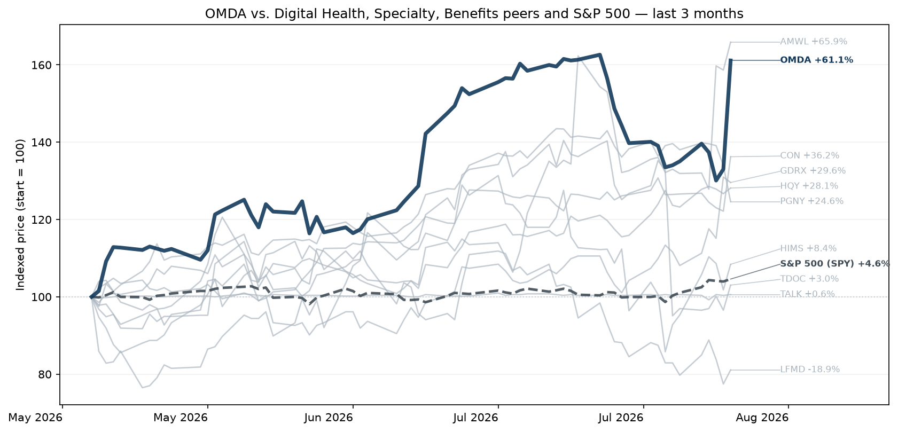

#### Earnings Call Summary

Co-founder and CEO Sean Duffy announced he will pass leadership to President Wei-Li Shao on January 1, 2027, transitioning to Executive Chair to focus on long-term strategy and partnerships after 15 years at the helm.

#### At a Glance

- **Omada Health Beats Q2 Estimates:** Omada Health reported an adjusted EPS of $0.08, beating the estimated $0.061, and generated revenue of $87.84 million, outperforming the projected $80.06 million.
- **Strong Growth in Core KPIs:** Total members increased 45% year-over-year to approximately 1.1 million, while trailing twelve-month revenue per total member edged up to $284.
- **Full Year 2026 Guidance Raised:** The company raised its full-year 2026 revenue guidance to between $334 million and $340 million, alongside an updated adjusted EBITDA projection of $21 million to $27 million.
- **Upcoming CEO Leadership Transition Planned:** Co-founder Sean Duffy will transition to Executive Chair on January 1, 2027, with President Wei-Li Shao slated to succeed him as Chief Executive Officer.
- **Positive Market and Profitability Reaction:** Shares climbed over 5% in after-hours trading as the company secured its second consecutive quarter of GAAP profitability, netting $5 million.

#### Key Moments from the Call

- **1m 25s — CEO Succession Announced:** Co-founder Sean Duffy is handing the CEO role to President Wei-Li Shao effective January 1, 2027. This planned leadership transition positions the company to tackle its next expansion phase under a trusted commercial veteran.
- **5m 12s — Significant Gross Margin Expansion:** GAAP gross margin expanded by 700 basis points year-over-year to 73%, exceeding long-term targets. This structural profitability was driven by lower care delivery costs and deployment of AI efficiencies across operations.
- **18m 25s — Full-Year 2026 Guidance Raised:** Omada raised its full-year revenue and adjusted EBITDA guidance following significant Q2 beats, signaling strong fundamental momentum, even though year-over-year growth rates are expected to moderate in H2 due to traditional benefit-cycle seasonality.
- **28m 15s — Core Cardiometabolic Books Growth outpaces GLP-1s:** Diabetes and Hypertension program books grew over 50% year-over-year, outpacing overall revenue growth. Management highlighted that GLP-1 discussions act as a strategic pipeline bridge to cross-sell these higher-value, longer-duration programs.
<h3 id="earnings-usph">US Physical Therapy (<a href="#company-usph">USPH</a>) +35.0%</h3>

**Reported:** August 6, 2026 · [Google Finance earnings page](https://www.google.com/finance/quote/USPH:NYSE?tab=earnings&hl=en)

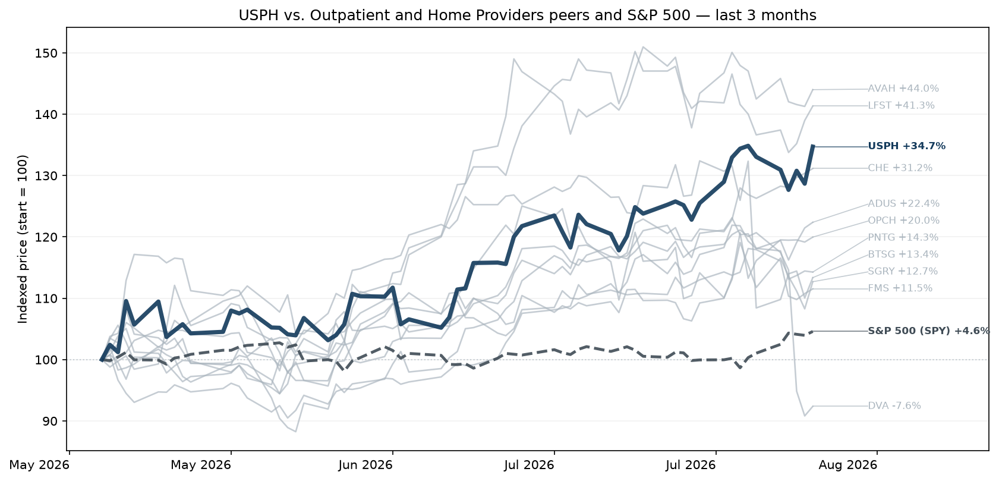

#### Earnings Call Summary

U.S. Physical Therapy reported record Q2 2026 average daily visits per clinic of 33.5, showing persistent volume strength across the business. Total revenue increased 8.5% year-over-year to $214 million, with physical therapy revenue up 8.4% to $182 million. PT same-store revenue grew over 3% for the quarter.

#### At a Glance

- **Revenue Beats but Profits Miss Expectations:** U.S. Physical Therapy reported a reported revenue of $211,939,000, slightly beating the estimated revenue of $211,813,000, while reported adjusted EPS came in at $0 compared to the estimated $0.825.
- **Clinic Volumes Set Historic Records:** The company achieved an all-time high of 33.5 average daily patient visits per clinic and expanded total patient visits by 6.6% year-over-year to 1.662 million.
- **Full-Year EBITDA Guidance Reaffirmed:** Despite near-term profitability headwinds, management maintained its outlook by reaffirming full-year 2026 adjusted EBITDA guidance of $102 million to $106 million.
- **Rising Operational Costs Pressure Margins:** Adjusted physical therapy gross margin contracted to 19.9% from 21.4% due to a $3.2 million headwind in self-insured healthcare claims and front-loaded hiring.
- **Hospital Affiliation Partnerships Expand Rollout:** The strategic transition of 60 Metro clinics into the NYU Langone affiliation progressed strongly, with 31 clinics successfully integrated during the second quarter.
- **Market Focuses on Profit Shortfall:** The stock fell 4.76% to $74.01 in immediate market reaction as investors prioritized near-term profitability concerns over robust operational volumes.

#### Key Moments from the Call

- **15m 27s — Adjusted EBITDA Guidance Reaffirmed:** U.S. Physical Therapy reaffirmed its full year 2026 adjusted EBITDA guidance of $102 million to $106 million, balancing year-to-date performance with an expected back-half volume and revenue lift from accelerating hospital affiliations.
- **19m 1s — Hospital Affiliation Revenue Model:** Management clarified that hospital affiliation revenue of $5.6 million is comprised of a per-visit fee and direct reimbursement for clinical staff salaries. This framework protects bottom-line margins and shifts clinician costs directly to hospital partners.
- **36m 25s — 2027/2028 Medicare Pricing Catalysts:** Investors will be pleased by early CMS indications for a 1.5% price increase next year, alongside long-term structural rate optimization via an 'IPSE multiplier' adjustments expected in 2028 to fix specialized coding underpayments.
- **43m 13s — Higher Upgraded 2027 Outlook:** Management indicated that conservative original projections of a $7.3 million adjusted EBITDA contribution from hospital partnerships for 2027 will likely be raised due to unmodeled cost takeouts in billing and collections.
<h3 id="earnings-gdrx">GoodRx (<a href="#company-gdrx">GDRX</a>) +26.0%</h3>

**Reported:** August 6, 2026 · [Google Finance earnings page](https://www.google.com/finance/quote/GDRX:NASDAQ?tab=earnings&hl=en)

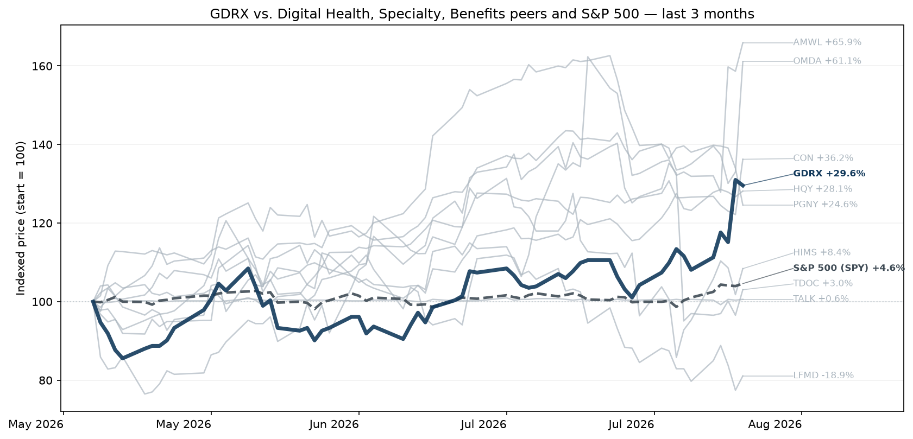

#### Earnings Call Summary

GoodRx reported Q2 2026 revenue of $200.41M, beating estimates, and an adjusted EBITDA of $63.7M (31.8% margin), driven by growth in Pharma Direct and subscriptions. Management raised full-year 2026 revenue guidance to $790M-$805M and adjusted EBITDA to $240M-$250M, anticipating an earlier-than-expected return to year-over-year revenue growth.

#### At a Glance

- **Revenue Beats, Adjusted EPS Expected:** GoodRx reported Q2 2026 revenue of $200.41 million, exceeding the estimated $193.16 million, while its reported Adjusted EPS of $0.02 fell short of the estimated $0.08.
- **Pharma Direct and Subscriptions Surge:** Pharma Direct revenue surged 76% year-over-year to $61.6 million, and subscription revenue rose 39% to $28.5 million, significantly outperforming legacy segments despite a 12% drop in monthly active consumers.
- **Full Year 2026 Guidance Raised:** Management raised its full-year 2026 revenue guidance to a range of $790 million to $805 million, signaling an earlier-than-expected return to year-over-year growth.
- **Core Transaction Revenues Experience Pressure:** Prescription transactions revenue fell 26% year-over-year to $106.4 million, impacted by retail pharmacy closures and a deliberate strategic pivot toward high-retention subscription offerings.
- **Market Welcomes Accelerated Pivot Strategy:** GoodRx shares climbed roughly 4% to 5% in extended trading following the release as investors prioritized the improved full-year outlook over legacy revenue declines.

#### Key Moments from the Call

- **17m 23s — Full-Year 2026 Guidance Raise:** GoodRx raised its full-year 2026 revenue guidance midpoint to $797.5M and adjusted EBITDA guidance to $240M-$250M. This pleasant surprise reflects accelerated monetization in Pharma Direct, which is now expected to grow over 70% year-over-year, more than offsetting prescription transaction declines.
- **20m 48s — Strategic Pivot from MAC to Subscriptions:** Investors may find the 12% decline in Monthly Active Consumers concerning, but management clarified this is a deliberate transition. GoodRx is reorienting its platform to shift transactional users into recurring subscription plans like Companion, expanding long-term revenue durability and lifetime value.
- **24m 7s — Pharma Direct ROI and GLP-1 Momentum:** Pharma Direct's enterprise model is pleasing manufacturers by delivering 8x to 18x ROI compared to alternative direct-to-consumer cash programs. Furthermore, management expects high demand for transparent self-pay GLP-1 access to persist as a durable driver despite newly implemented Medicare bridge alternatives.
- **45m 52s — Employer Direct Expansion Pipeline:** GoodRx is building a substantial pipeline for its Employer Direct offering, targeting live rollouts in Q4 2026 and Q1 2027. The initiative addresses corporate coverage rollbacks by integrating GLP-1 consumer pricing and subsidized Companion memberships directly into employer-funded wellness accounts.
<h3 id="earnings-ccsi">Consensus Cloud Solutions (<a href="#company-ccsi">CCSI</a>) +3.4%</h3>

**Reported:** August 6, 2026 · [Google Finance earnings page](https://www.google.com/finance/quote/CCSI:NASDAQ?tab=earnings&hl=en)

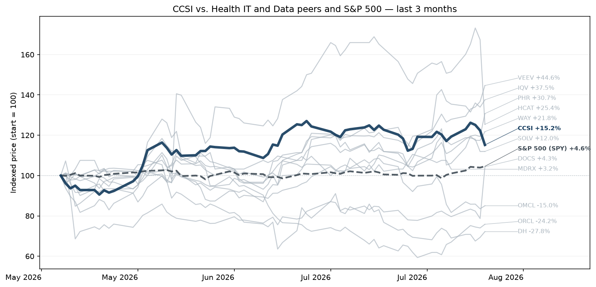

#### Earnings Call Summary

Consensus Cloud Solutions reported Q2 2026 consolidated revenue up 4.1% year-over-year to $91.4 million, driven by corporate channel growth of 9.3% to $60.5 million. Free cash flow rose 25% to $25.5 million due to receivable management and lower interest. Adjusted non-GAAP EPS was $1.49, representing a 2.1% increase compared to Q2 2025.

#### At a Glance

- **Consensus Cloud Beats Estimates by the Numbers:** Consensus Cloud Solutions reported Q2 2026 revenue of $91.36 million, beating the estimated $89.63 million, while reported adjusted EPS came in at $1.43 against the estimated 1.478.
- **Corporate and SoHo Segment Performance Diverge:** The corporate segment reached a record quarterly revenue threshold of $60.5 million, reflecting 9.3% year-over-year growth, which countered a deliberate 4.7% contraction in the smaller SoHo segment.
- **Management Maintains Flat Full-Year Guidance Outlook:** The company maintained its full-year 2026 guidance unchanged, expecting revenue between $350 million and $364 million and adjusted EPS between $5.55 and $5.95, while issuing third-quarter revenue guidance centered at a midpoint of $91.2 million.
- **Unchanged Full-Year Outlook Disappoints Investors:** Despite the top-line quarterly beat, shares dropped approximately 5.7% in after-hours trading as investors expressed disappointment over flat forward guidance and sequential pressure on customer retention.
- **Share Repurchase Program Significantly Expanded:** The company bought back roughly 300,000 shares during the quarter and announced an increase in its total stock buyback authorization limit to $200 million.
- **Strategic Healthcare Portfolio Segment Expands:** Consensus Cloud Solutions launched a new Healthcare Strategy and Solutions Group and acquired clinical workflow platform doc.health to drive non-fax digital enterprise expansion.

#### Key Moments from the Call

- **2m 8s — Corporate Performance Beats Internal Expectations:** Corporate revenue increased 9.3% year-over-year, beating internal forecasts due to record usage and higher net retention. This marked the strongest growth rate since Q4 2022, pleasing investors with continued top-line acceleration.
- **21m 2s — Expanded Share Repurchase Authorization:** The Board increased the total equity repurchase plan authorization to $200 million. During Q2, the company repurchased 300,000 shares for $9.6 million, signaling significant commitment to capital return.
- **22m 5s — Full-Year Guidance Reaffirmed Despite Beat:** Management chose to reaffirm rather than raise full-year 2026 guidance despite Q2 outperformance. They noted a historical philosophy against mid-year adjustments, though performance is expected to track toward the higher end.
- **37m 57s — Hiring Catch-Up and Back-Half Margins:** EBITDA margins face sequential pressure in H2 2026 due to catch-up hiring in product teams and seasonal backend professional fees. Management plans to spread these fees ratably starting in 2027.
<h3 id="earnings-pacb">PacBio (<a href="#company-pacb">PACB</a>) -16.0%</h3>

**Reported:** August 5, 2026 · [Google Finance earnings page](https://www.google.com/finance/quote/PACB:NASDAQ?tab=earnings&hl=en)

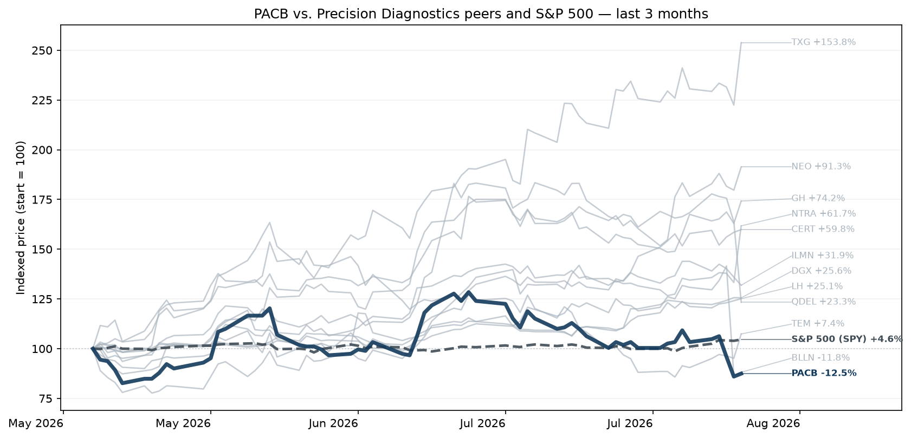

#### Earnings Call Summary

PacBio announced that Christian Henry is stepping down as President and CEO, with Mark Van Oene, formerly Chief Operating Officer, taking over the role effective immediately. Henry will remain on the board of directors and serve as an advisor to help drive the company's global clinical sequencing strategy.

#### At a Glance

- **PacBio Misses Q2 Estimates Slightly:** Pacific Biosciences reported a reported adjusted EPS of -$0.14, missing the estimated adjusted EPS of -$0.131, while its reported revenue of $39,007,000 also fell short of the estimated $40,033,600.
- **Mixed Trends in Key KPIs:** Consumables revenue grew 6% year-over-year to $20.1 million driven by strong clinical adoption, but this was offset by a 9% decline in instrument revenue to $12.8 million as Vega system placements fell from 38 down to 26.
- **Full-Year Guidance Cut Heavily:** Management slashed its full-year 2026 revenue guidance to a range of $155 million to $165 million and pushed its anticipated cash flow breakeven target out to 2028.
- **Immediate CEO Transition Announced:** Christian Henry has stepped down as President and CEO, with former commercial and R&amp;D operations chief Mark Van Oene succeeding him immediately to drive greater operational focus.
- **Negative Market and Stock Reaction:** Following the earnings miss and downbeat forward revisions, the company&#x27;s stock fell nearly 10% during regular trading hours, continuing to hover near its 52-week lows.
- **Macro Headwinds Squeeze Margins:** Non-GAAP gross margins contracted to 36% due to elevated compute and memory costs, manufacturing transition expenses for Vega, and academic and government funding constraints in the US.

#### Key Moments from the Call

- **10m 21s — Persistent Macro and Academic Funding Headwinds:** Ongoing capital constraints and funding uncertainty from the NIH and academic institutions in the Americas negatively impacted instrument shipments, particularly for the Vega platform. Management expects these macro funding headwinds to persist through the second half of 2026 without meaningful recovery.
- **13m 0s — SPRQ-Nx Chemistry Rollout for Vega Instrument:** PacBio announced the upcoming launch of its new SPRQ-Nx chemistry on the Vega system in August 2026. The enhancement will boost Vega's throughput to 90 gigabases per run and reduce DNA input requirements, matching the economics and operational consistency across both the Revio and Vega platforms.
- **21m 44s — Full-Year 2026 Revenue and Margin Guidance Lowered:** PacBio lowered its full-year 2026 revenue guidance to $155M-$165M and non-GAAP gross margin to 35%-37%. This revised outlook reflects a more gradual SPRQ-Nx chemistry adoption curve, persistent compute and memory cost inflation, and ongoing academic and government funding constraints in the Americas.
- **24m 26s — Cash Flow Breakeven Timeline Delayed to 2028:** Management pushed its anticipated cash flow breakeven timeline from the end of 2027 to 2028. Elevated compute costs and slower gross margin improvements necessitated the delay, though the company notes its $236.9M in cash reserves remain sufficient to fund operations through the new breakeven target.
<h3 id="earnings-evh">Evolent Health (<a href="#company-evh">EVH</a>) -5.5%</h3>

**Reported:** August 6, 2026 · [Google Finance earnings page](https://www.google.com/finance/quote/EVH:NYSE?tab=earnings&hl=en)

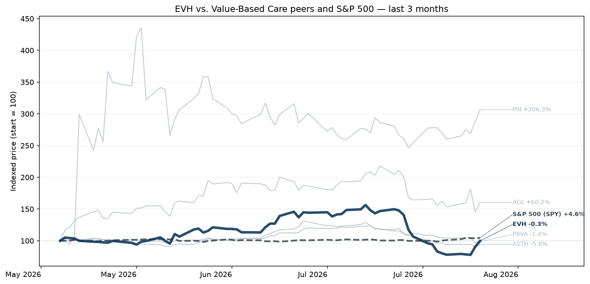

#### Earnings Call Summary

Evolent reported strong Q2 2026 total revenue of $653 million, up 31% versus Q1, and adjusted EBITDA of $28 million, up 27% versus Q1. The Q2 medical expense ratio (MER) increased to 95% from 93% in Q1 due to the launch of Highmark on May 1, 2026.

#### At a Glance

- **Evolent Beats Revenue and EPS:** Evolent Health reported a reported revenue of $652.52 million, beating Wall Street estimates of $599.79 million, and delivered a reported adjusted EPS of $0.00, ahead of the estimated loss of $0.015 per share.
- **Performance Suite Revenue Surges Extensively:** The company&#x27;s Performance Suite revenue jumped 50% quarter-over-quarter to $485 million, although its Medical Expense Ratio inflated to 95% compared to 93% in the prior quarter.
- **Full Year Revenue Vision Raised:** Evolent raised its full-year 2026 revenue guidance to a range of $2.6 billion to $2.7 billion and narrowed its adjusted EBITDA target to $120 million to $135 million.
- **AuthIntelligence Platform Gains Traction Scaled:** Management marked Q2 as a tipping point for its AI solutions, noting that more than one-third of manual authorization volume is now processed through the automated platform.
- **Market Welcomes Strong Results Enthusiastically:** Evolent&#x27;s share price surged by more than 18% following the release, driven by investor enthusiasm over the massive revenue outperformance and bullish 2027 growth commentary.
- **Margin Pressure and Leverage Continuous:** Rapid cost of revenue increases created operational headwinds that compressed margins, while an elevated 6.4x net leverage ratio leaves the firm with limited near-term financial flexibility.

#### Key Moments from the Call

- **3m 1s — Raised Full Year 2026 Guidance:** Evolent increased its 2026 revenue guidance to $2.6B-$2.7B (up from $2.4B-$2.6B) and tightened its adjusted EBITDA range to $120M-$135M. This revision highlights robust business momentum and management's growing confidence in second-half financial visibility and operational scalability.
- **4m 8s — $300M Performance Suite Expansion:** The announcement of an oncology Performance Suite expansion covering 1.5 million lives across 11 states by December 2026 adds $300 million in annualized revenue. This substantial expansion reinforces Evolent's strong cross-selling capabilities and high-impact specialized oncology solutions.
- **6m 59s — AuthIntelligence Scaling to Drive Margins:** Evolent's AI-enabled AuthIntelligence platform moved past pilot phases into meaningful scale, increasing auto-approval rates by up to 20 percentage points. This optimization accelerates case processing to minutes and serves as a fundamental pillar to achieve long-term profitability targets and 2027 earnings growth.
- **17m 34s — Early 2027 Revenue and EBITDA Targets:** Management projected 2027 revenue growth exceeding 25% and set an adjusted EBITDA midpoint target at or above $150 million. The positive target reassures investors by fully absorbing expected industry headwinds from Medicaid redeterminations and client-specific exchange attrition.
<h3 id="earnings-amwl">Amwell (<a href="#company-amwl">AMWL</a>) +69.6%</h3>

**Reported:** August 4, 2026 · [Google Finance earnings page](https://www.google.com/finance/quote/AMWL:NYSE?tab=earnings&hl=en)

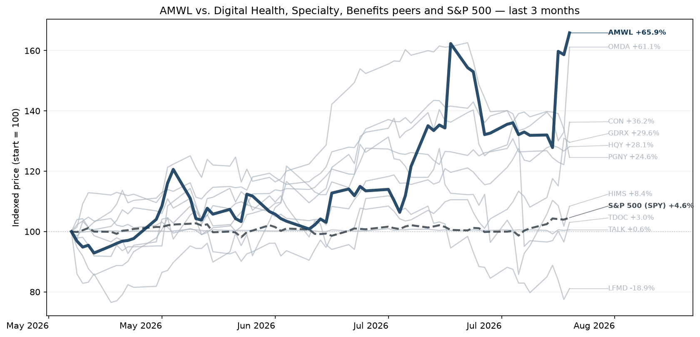

#### Earnings Call Summary

Amwell reported Q2 2026 revenue of $52M, down 26.6% year-over-year but beating the $49.3M estimate. Subscription revenue reached $25.7M (over half of total revenue), down 36.5% year-over-year due to churn and a tough prior-year comp, but up 3.2% sequentially, indicating core payer and government stability.

#### At a Glance

- **Amwell Tops Q2 Estimates Comfortably:** American Well Corporation reported a Q2 2026 adjusted EPS loss of -$0.59, narrowly beating estimates of -$0.60, while revenue reached $52,048,000, outperforming the estimated $49,253,800.
- **Mixed Shift Across Core KPIs:** Subscription revenue reached $25.7 million, climbing 3.2% sequentially despite dropping 36.5% year-over-year, while Amwell Medical Group visit revenue rose 7.4% year-over-year to $24.4 million.
- **Full-Year Profitability Outlook Raised:** Management tightened its full-year 2026 revenue guidance to $200–$205 million and raised its adjusted EBITDA guidance to a loss of $7–$9 million, while confirming expectations for a positive cash flow and EBITDA milestone in Q4 2026.
- **Strategic Government Backing Secured:** The company highlighted a significant strategic milestone with the Defense Health Agency&#x27;s intent to award a sole-source prime contract to Amwell, providing a powerful long-term validation of its software platform.
- **EBITDA Loss Nears Breakeven Milestone:** Amwell successfully narrowed its adjusted EBITDA loss to $1.15 million, down from $4.7 million in the same quarter last year, marking its closest performance to operational breakeven as a public entity.
- **Positive Initial Post-Market Response:** Although the stock experienced minor losses during regular trading hours, shares surged as much as 31% the following day as investors reacted to the profitability improvements and management&#x27;s upbeat guidance revisions.

#### Key Moments from the Call

- **1m 9s — DHA Direct Contract Intent:** Amwell received an intent to award a direct sole-source contract from the Defense Health Agency, transitioning away from third-party integrators like Leidos. This long-term contract secures continuity across the Military Health System and offers expansion opportunities through broader service scopes starting in 2027.
- **16m 27s — Q3 Seasonality and EBITDA Step Down:** Management flagged a sequential revenue decline ($46M-$48M) and a wider Adjusted EBITDA loss (-$5M to -$3M) for Q3 due to typical summer visit seasonality and temporary costs from completing internal projects. Investors are reassured that these dynamics will clear ahead of a profitable Q4.
- **17m 16s — Raised Full-Year EBITDA Guidance:** Driven by robust cost discipline and AI-powered workflow efficiencies, management raised its full-year Adjusted EBITDA guidance range by $7M at the midpoint. This tracking data strongly reinforces Amwell’s commitment to achieving cash flow breakeven in Q4 2026, pleasing investors focused on near-term profitability.
- **47m 45s — Strategic Focus and Asset Divestitures:** Management confirmed a deliberate strategy to shift resources entirely to government and payer sectors while actively divesting non-core assets. Operating on a single unified platform backbone removes custom development burdens, improves corporate efficiency, and targets a return to double-digit revenue growth by 2027.
<h3 id="earnings-hcat">Health Catalyst (<a href="#company-hcat">HCAT</a>) +13.8%</h3>

**Reported:** August 6, 2026 · [Google Finance earnings page](https://www.google.com/finance/quote/HCAT:NASDAQ?tab=earnings&hl=en)

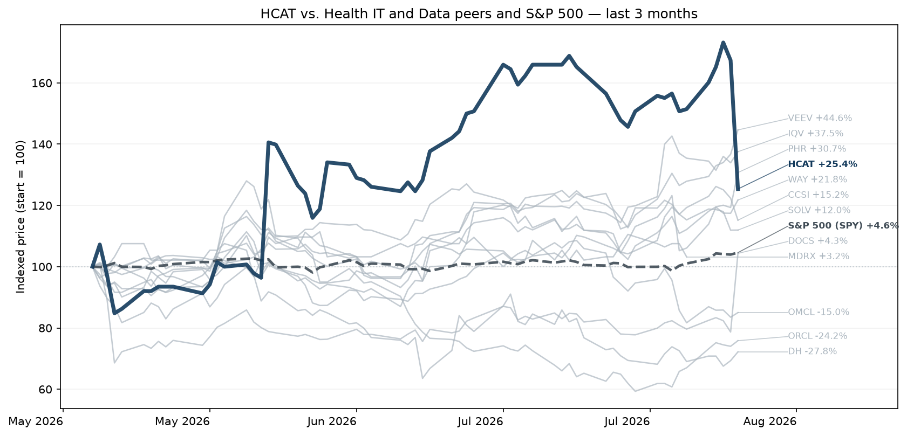

#### Earnings Call Summary

Health Catalyst reported productive Q2 2026 results, exceeding revenue guidance with total revenue of $70.5M and hitting the high end of adjusted EBITDA at $9.9M. Non-GAAP EPS was $0.04. Progress continues under Project Nexus to transform the operating model and reposition the business.

#### At a Glance

- **Health Catalyst Outperforms Quarterly Estimates:** The company reported a top-line revenue of $70.49 million, which beat the estimated $69.28 million, while its reported adjusted EPS of -$0.55 came in lower than the expected $0.031.
- **Mixed Trends in Core KPIs:** Technology revenue for the quarter declined 8% year-over-year to $48.8 million, while adjusted gross margin slightly improved to 51% compared to 50% in the prior year period.
- **Full-Year Forward Guidance Slashed:** Following strategic shifts, the company lowered its full-year 2026 revenue guidance to a range of $246 million to $249 million, down from its previous expectation of $262.5 million.
- **Strategic Divestiture Eliminates Debt:** Health Catalyst completed the sale of its Vitalware business, using the proceeds to fully retire approximately $160 million in credit facility debt and achieve a debt-free capital structure.
- **Platform Migration Churn Drags Results:** The ongoing legacy DOS-to-Ignite platform migration continues to create headwinds, causing earlier-than-expected client churn that is negatively impacting services revenue projections.
- **Shares Plunge on Weak Outlook:** Despite beating quarterly revenue expectations, the stock plummeted over 25% in post-earnings trading due to investor disappointment over the reduced full-year guidance and near-term outlook.

#### Key Moments from the Call

- **4m 36s — Debt Elimination via Vitalware Divestiture:** Investors will appreciate the strategic divestiture of Vitalware for $147M, which allowed Health Catalyst to completely retire its $160M credit facility debt. This eliminates $19M in annual GAAP interest expense, creating a clean, debt-free balance sheet to support their multi-year corporate transformation.
- **11m 19s — Full Year 2026 Guidance Reset:** The significant downward revision in full year 2026 guidance—now targeting revenue of $246M-$249M and adjusted EBITDA of $18M-$18.5M—will disappoint investors, even though it is primarily a mathematical drop driven by removing five months of Vitalware's high-margin contribution.
- **15m 51s — Persistent Migration Churn and Revenue Headwinds:** Investors will face ongoing concern as platform migration churn from DOS to Ignite has pulled forward, pressuring second-half outlooks. Churn tracking remains severe with $12.5M in notified ARR down-sell and $52M additional at-risk ARR, with headwinds expected to linger through 2027.
- **16m 49s — Services Revenue Guidance Lowered:** Management lowered expectations for the professional services business, anticipating an annualized exit rate at the bottom of their previous range near $55M. This adjustment, driven by clients pulling managed services back in-house, highlights structural shifts that could worry growth-focused investors.

## Company Overviews

<h3 id="company-unh">UnitedHealth (UNH)</h3>

*Payers · $380.1B · 3m +7.1% · 12m +62.3% · 24m -27.1%*

[Google Finance](https://www.google.com/finance/quote/UNH:NYSE?tab=earnings&hl=en)

Diversified healthcare company operating UHC insurance businesses and the Optum health services platform.

UnitedHealth Group is one of the largest private health insurers and provides medical benefits to about 51 million members globally, including 1 million outside the US as of December 2025. As a leader in employer-sponsored, self-directed, and government-backed insurance plans, UnitedHealth has obtained massive scale in medical insurance. Along with its insurance assets, UnitedHealth's Optum franchises help create a healthcare services colossus that spans everything from pharmaceutical benefits to providing outpatient care and analytics to affiliates and third parties.

<h3 id="company-cvs">CVS Health (CVS)</h3>

*Payers · $135.1B · 3m +5.7% · 12m +46.0% · 24m +67.6%*

[Google Finance](https://www.google.com/finance/quote/CVS:NYSE?tab=earnings&hl=en)

Healthcare retail ecosystem.

CVS Health offers a diverse set of healthcare services. Its roots are in its retail pharmacy operations, where it operates around 9,000 stores primarily in the US. CVS is also a large pharmacy benefit manager (acquired through Caremark), processing about 2 billion adjusted claims annually. It operates a top-tier health insurer (acquired through Aetna) through which it serves about 27 million medical members. The acquisition of Oak Street Health added primary care services to the mix, which could have significant synergies with all existing business lines.

<h3 id="company-hum">Humana (HUM)</h3>

*Payers · $43.7B · 3m +40.0% · 12m +44.4% · 24m +9.7%*

[Google Finance](https://www.google.com/finance/quote/HUM:NYSE?tab=earnings&hl=en)

Large payer, Medicare and Medicare Advantage focused.

Humana is one of the largest private health insurers in the US, and the firm has built a niche specializing in government-sponsored programs, with nearly all its medical membership stemming from Medicare, Medicaid, and the military's Tricare program. Beyond medical insurance, the company provides other healthcare services, including primary-care services, at-home services, and pharmacy benefit management.

<h3 id="company-oscr">Oscar Health (OSCR)</h3>

*Payers · $9.4B · 3m +30.9% · 12m +80.5% · 24m +54.6%*

[Google Finance](https://www.google.com/finance/quote/OSCR:NYSE?tab=earnings&hl=en)

Tech-focused payer with large exposure to exchange products and ICHRAs.

Oscar Health Inc is a healthcare technology company built around a full stack technology platform and a relentless focus on serving its members. It offers Individual & Family plans and health technology solutions that power the healthcare industry. Oscar operates as one segment to sell insurance to individuals, families and employees through the federal and state-run healthcare exchanges formed in conjunction with the Patient Protection and Affordable Care Act (ACA) and leverages its technology platform to provide services via its Oscar offering.

<h3 id="company-moh">Molina Healthcare (MOH)</h3>

*Payers · $10.2B · 3m +5.7% · 12m +25.2% · 24m -41.9%*

[Google Finance](https://www.google.com/finance/quote/MOH:NYSE?tab=earnings&hl=en)

Managed-care company providing health insurance through government programs.

Molina Healthcare Inc provides medical insurance plans through Medicaid, the individual exchanges, and Medicare. The company operates in four reportable segments consisting of: 1) Medicaid; 2) Medicare; 3) Marketplace; and 4) Other. It manages health benefit risks for more than 5 million people, with more than 85% of those members coming through contracts with state governments for their Medicaid programs. Medicaid contracts in four states-California, New York, Texas, and Washington-account for over half of its enrollees.

<h3 id="company-ci">Cigna (CI)</h3>

*Payers · $73.7B · 3m -1.9% · 12m +2.8% · 24m -16.0%*

[Google Finance](https://www.google.com/finance/quote/CI:NYSE?tab=earnings&hl=en)

Employer-focused health insurance company.

Cigna primarily provides pharmacy benefit management and health insurance services. Its PBM and specialty pharmacy services, which were greatly expanded by its 2018 merger with Express Scripts, are mostly sold to health insurance plans and employers. Its largest PBM contract is with the Department of Defense, and it recently won a multiyear deal with top-tier insurer Centene. In health insurance and other benefits, Cigna primarily serves employers through self-funding arrangements, and the company operates mostly in the US with 16 million US and 2 million international medical members covered as of December 2025.

<h3 id="company-elv">Elevance (ELV)</h3>

*Payers · $81.5B · 3m +4.3% · 12m +34.1% · 24m -25.9%*

[Google Finance](https://www.google.com/finance/quote/ELV:NYSE?tab=earnings&hl=en)

Health insurance company, previously named Anthem.

Elevance Health remains one of the leading health insurers in the US, providing medical benefits to 45 million medical members at the end of 2025. The company offers employer, individual, and government-sponsored coverage plans. Elevance differs from its peers in its unique position as the largest single provider of Blue Cross Blue Shield branded coverage, operating as the licensee for the Blue Cross Blue Shield Association in 14 states. Through acquisitions, such as the Amerigroup deal in 2012 and MMM in 2021, Elevance's reach expands beyond those states in government-sponsored programs, such as Medicaid and Medicare Advantage plans, too. It is also an emerging player in pharmacy benefit management and other healthcare services.

<h3 id="company-clov">Clover Health (CLOV)</h3>

*Payers · $2.2B · 3m +52.6% · 12m +118.3% · 24m +155.9%*

[Google Finance](https://www.google.com/finance/quote/CLOV:NASDAQ?tab=earnings&hl=en)

American healthcare company company providing Medicare Advantage insurance plans.

Clover Health Investments Corp is a healthcare technology company. It focuses on empowering Medicare physicians to proactively manage chronic diseases through its proprietary software platform, Clover Assistant. This cloud-based solution provides personalized insights to physicians, enabling early detection and management of chronic conditions. It operates in one segment: Insurance, through which it offers PPO and HMO plans to Medicare Advantage members in several states.

<h3 id="company-cnc">Centene (CNC)</h3>

*Payers · $30.7B · 3m +17.5% · 12m +157.0% · 24m -13.5%*

[Google Finance](https://www.google.com/finance/quote/CNC:NYSE?tab=earnings&hl=en)

Health insurance for government and privately insured healthcare programs.

Centene is a managed care organization that focuses on government-sponsored healthcare plans, including Medicaid, Medicare, and the individual exchanges. Centene served 20 million medical members as of December 2025, mostly in Medicaid (about 64% of membership), the individual exchanges (about 28%), and Medicare (about 5%). The company also provides Medicare Part D pharmaceutical plans.

<h3 id="company-alhc">Alignment Health (ALHC)</h3>

*Payers · $3.1B · 3m -19.9% · 12m -1.0% · 24m +66.7%*

[Google Finance](https://www.google.com/finance/quote/ALHC:NASDAQ?tab=earnings&hl=en)

Tech-enabled Medicare Advantage Company.

Alignment Healthcare Inc is a next-generation, consumer-centric platform that is revolutionizing the healthcare experience for seniors through Medicare Advantage plans. These plans are marketed and sold direct-to-consumer, allowing seniors to select the manner in which customers receive healthcare coverage and services on an annual basis. The company combines a technology platform and clinical model for more effective health outcomes.

<h3 id="company-hca">HCA Healthcare (HCA)</h3>

*Health System Providers · $87.2B · 3m -5.0% · 12m +8.3% · 24m +14.5%*

[Google Finance](https://www.google.com/finance/quote/HCA:NYSE?tab=earnings&hl=en)

Largest for-profit hospital and outpatient care operator in the United States.

HCA Healthcare is a Nashville-based healthcare provider organization operating the largest collection of acute-care hospitals in the United States. As of December 2025, the firm owned and operated 190 hospitals and over 2,500 outpatient facillities across 19 states and a small foothold in the United Kingdom.

<h3 id="company-thc">Tenet Health (THC)</h3>

*Health System Providers · $20.5B · 3m +37.7% · 12m +58.3% · 24m +74.7%*

[Google Finance](https://www.google.com/finance/quote/THC:NYSE?tab=earnings&hl=en)

Diversified healthcare provider with hospitals and a leading ambulatory surgery center platform through USPI.

Tenet Healthcare is a Dallas-based healthcare services organization. It operates acute and specialty hospitals (50 as of December 2025) and hundreds of ambulatory surgery centers and other outpatient facilities across the US, primarily in the South. Through its Conifer segment, Tenet also provides revenue cycle management solutions.

<h3 id="company-uhs">Universal Health Services (UHS)</h3>

*Health System Providers · $10.2B · 3m +2.1% · 12m +0.7% · 24m -19.4%*

[Google Finance](https://www.google.com/finance/quote/UHS:NYSE?tab=earnings&hl=en)

Hospital operator with significant acute care and behavioral health business.

Universal Health Services Inc offers healthcare services through its behavioral health centers, acute care hospitals, and related outpatient facilities. As of late 2025, the company operated 346 inpatient behavioral health centers, 29 acute care hospitals, and many supportive outpatient facilities. Its operations are concentrated in the U.S, particularly in Nevada (21% of 2025 operating profits), Texas (19%), and California (13%), although it does have some exposure to the UK behavioral health market (6% of 2025 sales) too. While its acute care services account for over 55% of revenue, the behavioral health centers sport higher margins and account for over 55% of pretax profits.

<h3 id="company-cyh">Community Health Systems (CYH)</h3>

*Health System Providers · $417.4M · 3m +7.5% · 12m +20.5% · 24m -38.0%*

[Google Finance](https://www.google.com/finance/quote/CYH:NYSE?tab=earnings&hl=en)

Operator of community hospitals primarily serving non-urban and regional markets.

Community Health Systems Inc is a publicly owned hospital operator in the United States. The company also owns four home health agencies and provides management and consulting services to independent hospitals. The firm derives revenue through a broad range of general and specialized hospital healthcare services and outpatient services.

<h3 id="company-ardt">Ardent Health Partners (ARDT)</h3>

*Health System Providers · $1.5B · 3m +14.2% · 12m -2.9% · 24m -26.2%*

[Google Finance](https://www.google.com/finance/quote/ARDT:NYSE?tab=earnings&hl=en)

Regional hospital operator focused on integrated health systems across mid-sized US markets.

Ardent Health Inc is a provider of healthcare in growing mid-sized urban communities across the U.S and operating in eight growing mid-sized urban markets across six states Texas, Oklahoma, New Mexico, New Jersey, Idaho, and Kansas. The main focus on people and investments in services and technologies.

<h3 id="company-ensg">The Ensign Group (ENSG)</h3>

*Inpatient Non-Acute Providers · $10.4B · 3m +6.7% · 12m +13.9% · 24m +29.5%*

[Google Finance](https://www.google.com/finance/quote/ENSG:NASDAQ?tab=earnings&hl=en)

Leading operator of skilled nursing facilities, rehabilitation centers, and senior-care services.

Ensign Group Inc provides post-acute healthcare services in the United States. Its regional subsidiaries oversee skilled nursing, assisted living, home health and hospice, mobile ancillary, and urgent care operations. Medicare and Medicaid programs contribute majority of revenue received for Ensign's services. The firm operates through two segments, Skilled services, and Standard Bearer. The skilled services segment includes the operation of skilled nursing facilities and rehabilitation therapy services. The Standard Bearer segment comprises of properties owned by the company through its captive REIT and leased to skilled nursing and assisted living operations. The majority of the revenue is generated from the skilled services segment.

<h3 id="company-achc">Acadia Healthcare (ACHC)</h3>

*Inpatient Non-Acute Providers · $2.8B · 3m +25.2% · 12m +63.9% · 24m -56.0%*

[Google Finance](https://www.google.com/finance/quote/ACHC:NASDAQ?tab=earnings&hl=en)

Largest provider of behavioral health and addiction treatment services.

Acadia Healthcare Co Inc acquires and develops behavioral healthcare facilities. Its facilities and services are classified into the following categories: acute inpatient psychiatric facilities; specialty treatment facilities; CTCs; and residential treatment centers. In which Acute inpatient psychiatric facilities contribute the majority of revenue in the United States. The Company has one reportable segment, behavioral healthcare services. The behavioral healthcare services segment provides inpatient and outpatient behavioral healthcare services.

<h3 id="company-ehc">Encompass Health (EHC)</h3>

*Inpatient Non-Acute Providers · $11.0B · 3m +18.0% · 12m +6.5% · 24m +46.1%*

[Google Finance](https://www.google.com/finance/quote/EHC:NYSE?tab=earnings&hl=en)

In-patient post-acute rehabilitation services.

Encompass Health Corp provides post-acute healthcare services in the United States through a network of inpatient rehabilitation hospitals, which is the company's sole segment. Inpatient rehabilitation contributes the majority of the firm's revenue and provides specialized rehabilitative treatment through a network of inpatient hospitals. The company's inpatient rehabilitation hospitals provide a higher level of rehabilitative care to patients who are recovering from conditions such as stroke and other neurological disorders, cardiac and pulmonary conditions, brain and spinal cord injuries, complex orthopedic conditions, and amputations.

<h3 id="company-pacs">PACS Group (PACS)</h3>

*Inpatient Non-Acute Providers · $7.3B · 3m +44.2% · 12m +334.8% · 24m +47.9%*

[Google Finance](https://www.google.com/finance/quote/PACS:NYSE?tab=earnings&hl=en)

Post-acute care and skilled nursing company.

PACS Group Inc is a post-acute healthcare company mainly focused on delivering skilled nursing care through a portfolio of independently operated facilities. The post-acute care ecosystem serves individuals who need additional help recuperating from acute conditions, illnesses, or serious medical procedures after getting discharged from the hospital. It also provides senior care, assisted living, and independent living options in some of the communities. The company has one reportable segment.

<h3 id="company-doc">Healthpeak properties (DOC)</h3>

*Health Care Real Estate · $15.1B · 3m +9.0% · 12m +26.2% · 24m -1.0%*

[Google Finance](https://www.google.com/finance/quote/DOC:NYSE?tab=earnings&hl=en)

Healthcare industry real estate investment trust focused on outpatient medical offices, life science properties, an senior housing.

Healthpeak owns a diversified healthcare portfolio of approximately 700 in-place properties spread across mainly medical office and life science assets, plus a handful of senior housing, hospital, and skilled nursing/post-acute care assets, as well.

<h3 id="company-vtr">Ventas, Inc (VTR)</h3>

*Health Care Real Estate · $48.0B · 3m +7.0% · 12m +36.2% · 24m +57.3%*

[Google Finance](https://www.google.com/finance/quote/VTR:NYSE?tab=earnings&hl=en)

Real estate investment trust focused  on ownership and management of senior housing, research, medicine office buildings, and healthcare facilities.

Ventas owns a diversified healthcare portfolio of almost 1,400 in-place properties spread across the senior housing, medical office, hospital, life science, and skilled nursing/post-acute care. The portfolio includes almost 100 properties in Canada and the United Kingdom as the company looks for additional investment opportunities in countries with mature healthcare systems that operate similarly to the United States. The firm also owns mortgages and other loans, contributing about 1% of net operating income.

<h3 id="company-mpt">Medical Properties Trust (MPT)</h3>

*Health Care Real Estate · $2.8B · 3m -9.1% · 12m n/a · 24m n/a*

[Google Finance](https://www.google.com/finance/quote/MPT:NYSE?tab=earnings&hl=en)

Real estate investment trust for healthcare facilities in the US and Europe.

Medical Properties Trust Inc acquires and develops net-leased healthcare facilities. Its investments in healthcare real estate, other loans, and any investments in tenants are considered a single reportable segment. Its business strategy is to acquire and develop healthcare facilities and lease the facilities to healthcare operating companies under long-term net leases, which require the tenant to bear of the costs associated with the property. The group's geographic areas are the United States, the United Kingdom, and All other countries.

<h3 id="company-nhi">National Health Investors (NHI)</h3>

*Health Care Real Estate · $3.7B · 3m +0.1% · 12m +0.5% · 24m +0.7%*

[Google Finance](https://www.google.com/finance/quote/NHI:NYSE?tab=earnings&hl=en)

Healthcare REIT focused on senior housing, skilled nursing, and long-term care properties.

National Health Investors Inc is a self-managed REIT that owns, leases, operates, and finances the development of senior housing communities and medical facilities. It operates through two segments: Real Estate Investments and Senior Housing Operating Portfolio (SHOP). The Real Estate Investments segment, which generates the majority of revenue, includes real estate leases, mortgages, and other notes receivable related to independent living facilities, assisted living facilities, entrance fee communities, senior living campuses, skilled nursing facilities, and a hospital. The SHOP segment consists of ventures that own and operate independent living facilities. The company's revenues are derived from rental income, interest and other income, and resident fees and services.

<h3 id="company-ohi">Omega Healthcare Investors (OHI)</h3>

*Health Care Real Estate · $15.1B · 3m +2.7% · 12m +21.3% · 24m +27.4%*

[Google Finance](https://www.google.com/finance/quote/OHI:NYSE?tab=earnings&hl=en)

Healthcare REIT healthcare REIT focused on skilled nursing and assisted living facilities.

Omega Healthcare Investors Inc is a real estate investment trust that invests in healthcare-related real estate properties located in the United States (U.S.), the United Kingdom (U.K.), and Canada. The company's objective is to provide attractive returns to investors while serving as the preferred capital partner to its third-party healthcare operating companies and affiliates, as well as other third-party healthcare operators, allowing them to focus on delivering a high level of care to their resident patients. Omega's investment portfolio mainly consists of skilled nursing facilities, assisted living facilities (ALFs), including care homes in the U.K., independent living facilities, rehabilitation and acute care facilities, and continuing care retirement communities.

<h3 id="company-well">Welltower (WELL)</h3>

*Health Care Real Estate · $166.9B · 3m +10.4% · 12m +41.0% · 24m +101.8%*

[Google Finance](https://www.google.com/finance/quote/WELL:NYSE?tab=earnings&hl=en)

Largest healthcare REIT, focused on senior housing, outpatient medical, and wellness-oriented healthcare properties.

Welltower owns a diversified healthcare portfolio of 2,800 in-place properties spread across the senior housing, medical office, and skilled nursing/postacute care sectors. The portfolio includes over 900 properties in Canada and the United Kingdom as the company looks for additional investment opportunities in countries with mature healthcare systems that operate similarly to that of the United States.

<h3 id="company-ctre">CareTrust REIT (CTRE)</h3>

*Health Care Real Estate · $9.6B · 3m -0.9% · 12m +25.3% · 24m +48.1%*

[Google Finance](https://www.google.com/finance/quote/CTRE:NYSE?tab=earnings&hl=en)

Healthcare REIT focused on skilled nursing, senior housing, and other post-acute care facilities.

CareTrust REIT Inc is a self-administered, publicly traded REIT engaged in the ownership, acquisition, financing, development, and leasing of skilled nursing, seniors housing, and other healthcare-related properties. The company has one reportable segment consisting of investments in healthcare-related real estate assets. It generates revenues by leasing healthcare-related properties to healthcare operators under triple-net lease arrangements, in which the tenant is solely responsible for property-related costs. The company operates in Domestic and Foreign markets, with the majority of revenue coming from Domestic operations.

<h3 id="company-sbra">Sabra Health Care REIT (SBRA)</h3>

*Health Care Real Estate · $5.3B · 3m +1.4% · 12m +12.4% · 24m +26.1%*

[Google Finance](https://www.google.com/finance/quote/SBRA:NASDAQ?tab=earnings&hl=en)

healthcare REIT focused on skilled nursing, senior housing, and behavioral health properties.

Sabra Health Care REIT Inc is a healthcare facility real estate investment trust. The company operates one segment that owns and invests in healthcare real estate. All of the company's revenue is generated in the United States. Sabra's operations consist of nursing facilities, assisted living centers, and mental health facilities.

<h3 id="company-prva">Privia Health Group (PRVA)</h3>

*Value-Based Care · $3.0B · 3m -2.6% · 12m +9.1% · 24m +17.7%*

[Google Finance](https://www.google.com/finance/quote/PRVA:NASDAQ?tab=earnings&hl=en)

Value-based care company focusing on physician enablement for independent practices.

Privia Health Group Inc is one of the physician enablement companies in the United States with a presence in around 24 states and the District of Columbia. The group builds scaled provider networks with primary-care centric medical groups, risk-bearing entities, a physician-led governance structure, and the Privia Platform comprising an extensive suite of technology and service solutions. It collaborates with medical groups, health plans, and health systems to optimize approximately 1,300+ physician practices, improve the patient experience for over 5.8+ million patients, and reward around 5,300+ physicians and practitioners for delivering high-value care.

<h3 id="company-asth">Astrana Health (ASTH)</h3>

*Value-Based Care · $1.8B · 3m -9.0% · 12m +27.4% · 24m -25.4%*

[Google Finance](https://www.google.com/finance/quote/ASTH:NASDAQ?tab=earnings&hl=en)

Physician centric management company that operates and coordinates provider networks to take on risk contracts.

Astrana Health Inc is a patient-centered, physician-centric integrated population health management company. The company is working to provide coordinated, outcomes-based medical care cost-effectively. It is focused on physicians providing high-quality medical care, population health management, and care coordination for patients, particularly senior patients and patients with multiple chronic conditions. The company's three reportable segments are Care Partners, Care Delivery, and Care Enablement. It generates the majority of its revenue from the Care Partners segment.

<h3 id="company-agl">Agilon Health (AGL)</h3>

*Value-Based Care · $2.1B · 3m +76.1% · 12m +337.3% · 24m -30.8%*

[Google Finance](https://www.google.com/finance/quote/AGL:NYSE?tab=earnings&hl=en)

Value-based care company focused on partnerships with primary care physicians for Medicare Advantage seniors.

Agilon Health Inc is a healthcare services company that partners with primary care physicians to support value-based care for senior patients. The company provides a platform that enables physician groups to manage healthcare outcomes and costs through a Medicare-centric, capitated care model and long-term partnerships with community-based physicians.

<h3 id="company-evh">Evolent Health (EVH)</h3>

*Value-Based Care · $347.6M · 3m -5.5% · 12m -56.1% · 24m -85.0%*

[Google Finance](https://www.google.com/finance/quote/EVH:NYSE?tab=earnings&hl=en)

Specialty-care management and healthcare-services company focused on oncology, cardiology, and musculoskeletal care.

Evolent Health Inc is engaged in healthcare delivery and payment. The company supports health systems and physician organizations in their migration toward value-based care and population health management. It provides specialty care management services in oncology, cardiology, musculoskeletal markets and holistic total cost of care management along with an integrated platform for health plan administration and value-based business infrastructure under one go to market package. The solutions provided by the company includes: Oncology, Cardiology, Musculoskeletal, Administrative Services, Advanced Illness, Genetic Testing, Physical Medicine, Radiology, and Surgical Management.

<h3 id="company-piii">P3 Health (PIII)</h3>

*Value-Based Care · $32.7M · 3m +226.4% · 12m +72.8% · 24m -61.8%*

[Google Finance](https://www.google.com/finance/quote/PIII:NASDAQ?tab=earnings&hl=en)

Physician-led population ehalth company focused on coordinating care for Medicare Advantage Patients.

P3 Health Partners Inc is a patient-centered and physician-led population health management company. P3's model aggregates and supports the community's existing healthcare resources to build a network of community providers working together to deliver coordinated and integrated care to patients with a shared commitment to improving patient outcomes, lowering cost, and delivering experience for all. It includes utilization management, care management, disease education, and maintenance of a quality improvement and quality management program for members assigned to the Company. The Company is also responsible for the credentialing of its providers, processing and payment of claims, and the establishment of a provider network for certain health plans.

<h3 id="company-dva">Davita (DVA)</h3>

*Outpatient and Home Providers · $15.4B · 3m -7.5% · 12m +41.9% · 24m +31.0%*

[Google Finance](https://www.google.com/finance/quote/DVA:NYSE?tab=earnings&hl=en)

One of two dominant US dialysis providers.

DaVita is one of the largest providers of dialysis services in the United States, boasting a market share of about 35%. The firm operates over 3,200 facilities worldwide, mostly in the US, and treats about 300,000 patients annually. Government payers dominate US dialysis reimbursement. DaVita receives about two-thirds of US sales at government (primarily Medicare) reimbursement rates, with the remainder coming from commercial insurers. While commercial insurers represent only about 10% of US patients treated, they represent nearly all of the profits generated by DaVita in the US dialysis business.

<h3 id="company-fms">Fresenius (FMS)</h3>

*Outpatient and Home Providers · $13.8B · 3m +10.2% · 12m +0.8% · 24m +32.0%*

[Google Finance](https://www.google.com/finance/quote/FMS:NYSE?tab=earnings&hl=en)

Global leaders in dialysis clinics, equipment, and renal services.

Fresenius Medical Care is the largest dialysis company in the world, treating nearly 300,000 patients from about 3,600 clinics worldwide as of December 2025. In addition to providing dialysis services, the firm is a leading supplier of dialysis products, including machines, dialyzers, and concentrates. Fresenius accounts for about 35% of the global dialysis products market, creating the world's only fully integrated dialysis business. Services account for about three-fourths of sales, while the balance is generated from medical technology products that enable dialysis treatments.

<h3 id="company-sgry">Surgery Partners (SGRY)</h3>

*Outpatient and Home Providers · $2.0B · 3m +7.5% · 12m -34.3% · 24m -47.8%*

[Google Finance](https://www.google.com/finance/quote/SGRY:NASDAQ?tab=earnings&hl=en)

Operator of Ambulatory Surgery Centers.

Surgery Partners Inc is a healthcare services company with an integrated outpatient delivery model focused on providing quality, cost-effective solutions for surgical and related ancillary care in support of both patients and physicians. It has one reportable segment: Surgical Facilities, which includes the operation of ASCs, surgical hospitals, anesthesia services, and multi-specialty physician practices, which earn revenues from contracts with patients in which the performance obligations are to provide health care services.

<h3 id="company-opch">Option Care Health (OPCH)</h3>

*Outpatient and Home Providers · $3.4B · 3m +16.0% · 12m -15.6% · 24m -20.3%*

[Google Finance](https://www.google.com/finance/quote/OPCH:NASDAQ?tab=earnings&hl=en)

Largest independent provider of home and alternate-site infusion therapy services in the United States.

Option Care Health Inc is the provider of home and alternate-site infusion services. It provides treatment for bleeding disorders, neurological disorders, heart failure, anti-infectives, and chronic inflammatory disorders, among others. The Company operates in one segment, infusion services.

<h3 id="company-lfst">Lifestance Health (LFST)</h3>

*Outpatient and Home Providers · $4.0B · 3m +40.8% · 12m +148.1% · 24m +93.6%*

[Google Finance](https://www.google.com/finance/quote/LFST:NASDAQ?tab=earnings&hl=en)

Outpatient behavioral-health providers of psychiatry and therapy services.

LifeStance Health Group Inc is a mental healthcare company that operates as a provider of outpatient mental health services, spanning psychiatric evaluations and treatment, psychological and neuropsychological testing, and individual, family, and group therapy. It treats a broad range of mental health conditions, including anxiety, depression, bipolar disorder, eating disorders, psychotic disorders, and post-traumatic stress disorder, using evidence-based approaches to ensure effective treatment. The group has a single operating and reportable segment of mental health services.

<h3 id="company-che">Chemed (Vitas) (CHE)</h3>

*Outpatient and Home Providers · $7.1B · 3m +30.3% · 12m +27.0% · 24m -4.7%*

[Google Finance](https://www.google.com/finance/quote/CHE:NYSE?tab=earnings&hl=en)

Hospice and end of life provider through VITAS healthcare.

Chemed Corp purchases, operates, and divests subsidiaries engaged in diverse business activities to maximize shareholder value. The company operates in the following segments: VITAS and Roto-Rooter. The VITAS segment generates the majority of the firm's revenue and provides hospice and palliative care services to patients with terminal illnesses through a network of physicians, registered nurses, home health aides, social workers, and volunteers. The Roto-Rooter segment provides plumbing, drain cleaning, water restoration, and related services to residential and commercial customers.

<h3 id="company-adus">Addus HomeCare (ADUS)</h3>

*Outpatient and Home Providers · $2.1B · 3m +20.2% · 12m +8.6% · 24m -4.0%*

[Google Finance](https://www.google.com/finance/quote/ADUS:NASDAQ?tab=earnings&hl=en)

Provider of personal care, hospice, and home health services.

Addus HomeCare Corp is engaged in the provision of in-home care services. The Company has three reportable segments: Personal Care, Hospice, and Home Health. The Personal Care segment provides non-medical assistance with activities of daily living, mainly to the elderly, chronically ill, and disabled individuals. The Hospice segment provides physical, emotional, and spiritual care for terminally ill patients and their families. The Home Health segment provides medical services to individuals requiring care during illness or recovery. It generates the majority of its revenue from the Personal Care segment.

<h3 id="company-pntg">Pennant Group (PNTG)</h3>

*Outpatient and Home Providers · $1.3B · 3m +8.6% · 12m +50.0% · 24m +28.8%*

[Google Finance](https://www.google.com/finance/quote/PNTG:NASDAQ?tab=earnings&hl=en)

provider of home health, hospice, and senior living services.

Pennant Group Inc is engaged in providing healthcare services to patients of all ages, including the growing senior population, in the United States. It operates in multiple lines of business including home health, hospice, and senior living which includes the company's assisted living, independent living, and memory care communities across Arizona, California, Colorado, Idaho, Montana, Nevada, Oklahoma, Oregon, Texas, Utah, Washington, Wisconsin, and Wyoming. It operates in two segments; home health and hospice services and senior living services. The company generates majority of its revenue from home health and hospice services segment, which includes its home health, hospice and home care businesses.

<h3 id="company-usph">US Physical Therapy (USPH)</h3>

*Outpatient and Home Providers · $1.2B · 3m +35.0% · 12m -8.7% · 24m -9.4%*

[Google Finance](https://www.google.com/finance/quote/USPH:NYSE?tab=earnings&hl=en)

operator of outpatient physical therapy clinics and industrial injury prevention services.

US Physical Therapy Inc through its subsidiaries operate outpatient physical therapy clinics that provide pre-and post-operative care and treatment for orthopedic-related disorders, sports-related injuries, preventative care, rehabilitation of injured workers, and neurological-related injuries. The principal payment sources for the clinics' services are managed care programs, commercial health insurance, Medicare/Medicaid, workers' compensation insurance, and proceeds from personal injury cases. Its operating segment includes Physical therapy operations and Industrial injury prevention services. The company generates maximum revenue from the Physical therapy operations segment.

<h3 id="company-btsg">BrightSpring Health Services (BTSG)</h3>

*Outpatient and Home Providers · $12.4B · 3m +13.9% · 12m +200.4% · 24m +441.0%*

[Google Finance](https://www.google.com/finance/quote/BTSG:NASDAQ?tab=earnings&hl=en)

provider of home and community-based healthcare services, including pharmacy, rehabilitation, primary care, and hospice.

BrightSpring Health Services Inc is a home and community-based healthcare services platform, focused on delivering complementary pharmacy and provider services to complex patients. Its platform delivers clinical services and pharmacy solutions across Medicare, Medicaid, and commercially insured populations. Its segments include Pharmacy Solutions, Provider Services, and others. It generates the majority of its revenue from the Pharmacy Solutions segment.

<h3 id="company-avah">Aveanna Healthcare (AVAH)</h3>

*Outpatient and Home Providers · $2.0B · 3m +40.8% · 12m +54.6% · 24m +101.5%*

[Google Finance](https://www.google.com/finance/quote/AVAH:NASDAQ?tab=earnings&hl=en)

provider of pediatric and adult home healthcare, private-duty nursing, and hospice services.

Aveanna Healthcare Holdings Inc is a diversified home care platform that provides care to medically complex, high-cost patient populations. It directly addresses the pressing challenges facing the U.S. healthcare system by providing safe, high-quality care in the home. The firm provides its services through three segments: Private Duty Services (PDS); Home Health & Hospice (HHH); and Medical Solutions (MS). The Private Duty Services segment generates the majority of revenue, which includes private duty skilled nursing services, non-clinical and personal care services, and pediatric therapy services, and is principally reimbursed by Medicaid and Medicaid MCO.

<h3 id="company-tdoc">Teladoc (TDOC)</h3>

*Digital Health, Specialty, Benefits · $1.2B · 3m -1.7% · 12m +2.4% · 24m -0.3%*

[Google Finance](https://www.google.com/finance/quote/TDOC:NYSE?tab=earnings&hl=en)

Largest pure-play virtual care platform, offering telemedicine, chronic-care management, and specialty virtual health services.

Teladoc Health Inc is engaged in the provision of virtual healthcare services, connecting patients, providers, and healthcare systems through technology-enabled platforms. The company has two reportable segments: Integrated Care and BetterHelp. The Integrated Care segment provides virtual healthcare solutions, including primary care, mental health, chronic care management, and telehealth enablement services for employers, insurers, and healthcare systems, mainly on a business-to-business basis, while the BetterHelp segment offers direct-to-consumer online mental health services, including counseling and therapy delivered through digital platforms. It generates the majority of its revenue from the Integrated Care segment.

<h3 id="company-amwl">Amwell (AMWL)</h3>

*Digital Health, Specialty, Benefits · $179.6M · 3m +69.6% · 12m +85.7% · 24m +60.2%*

[Google Finance](https://www.google.com/finance/quote/AMWL:NYSE?tab=earnings&hl=en)

Telehealth infrastructure company providing virtual-care technology.

American Well Corp is an enterprise platform and software company digitally enabling hybrid care by offering payers and health systems a technology-enabled care platform. The Amwell Platform, its cloud-based enablement platform, digitally enables a scalable healthcare experience across all care settings by enabling critical services like virtual primary care, urgent care, clinical partner programs, scheduling visits, etc. Additionally, the healthcare providers can use the platform to access familiar workflows for taking notes, prescribing, referencing clinical treatment guidelines, and other related activities. The firm also offers various paid services, including licensed clinical staffing, implementation support, workflow design, etc, to help clients execute their hybrid care strategies.

<h3 id="company-talk">Talkspace (TALK)</h3>

*Digital Health, Specialty, Benefits · $874.4M · 3m +0.6% · 12m +108.8% · 24m +208.9%*

[Google Finance](https://www.google.com/finance/quote/TALK:NASDAQ?tab=earnings&hl=en)

Digital behavioral-health company providing online therapy and mental-health services through employers and health-plans.

Talkspace Inc is a virtual behavioral healthcare company offering its members convenient and affordable access to a fully-credentialed network of qualified providers across a wide and growing spectrum of care through virtual psychotherapy and psychiatry. It is a single destination for comprehensive mental health care, including therapy for individuals, couples, and teens, as well as psychiatric treatment and medication management (18+), and self-guided tools and resources. The company's customers include Health insurance plans from commercial and government institutions, and employee assistance programs, Direct-to-Enterprise, and Individual subscribers. The company operates as a single segment.

<h3 id="company-hims">Hims &amp; Hers (HIMS)</h3>

*Digital Health, Specialty, Benefits · $6.4B · 3m +11.7% · 12m -39.2% · 24m +97.9%*

[Google Finance](https://www.google.com/finance/quote/HIMS:NYSE?tab=earnings&hl=en)

Direct-to-Consumer telehealth platform for primary care, weight management, mental health, sexual health, and wellness.

Hims & Hers, launched in 2017, is a telehealth platform that connects patients and healthcare providers to offer treatment options for specialties like erectile dysfunction, hair loss, skin care, mental health, and weight loss. Its offerings include generic, branded, and compounded prescription drugs as well as over-the-counter medicines, cosmetics, and supplements. The platform, which has more than 2 million subscribers, is available in all 50 states and certain European markets like the UK. It includes provider networks, electronic medical records, cloud pharmacy fulfillment, and personalization capabilities. Hims does not take insurance and only accepts payments directly from customers.

<h3 id="company-lfmd">LifeMD (LFMD)</h3>

*Digital Health, Specialty, Benefits · $169.3M · 3m -25.5% · 12m -47.8% · 24m -34.4%*

[Google Finance](https://www.google.com/finance/quote/LFMD:NASDAQ?tab=earnings&hl=en)

Virtual primary-care and telehealth company known for chronic condition management.

LifeMD Inc is a patient-centric, direct-to-patient healthcare company providing a high-quality, cost-effective, and convenient way for patients to access virtual medical care and pharmacy services. The Company's portfolio of brands within continuing operations is now managed as a single operating segment, Telehealth. Telehealth platform integrates core capabilities, includes: A nationwide pharmacy network, A wholly-owned commercial pharmacy, A fully integrated patient care center, A direct-to-patient marketing infrastructure for acquisition and retention, and AI-enabled clinical and operational technologies.

<h3 id="company-omda">Omada Health (OMDA)</h3>

*Digital Health, Specialty, Benefits · $1.2B · 3m +59.7% · 12m +24.4% · 24m n/a*

[Google Finance](https://www.google.com/finance/quote/OMDA:NASDAQ?tab=earnings&hl=en)

Virtual chronic-care platform focused on diabetes, hypertension, obesity, and musculoskeletal conditions through employers and health plans.

Omada Health Inc empowers individuals to make lasting health changes through personalized, virtual care between doctor's visits. The integrated platform of the company supports members with cardiometabolic conditions like prediabetes, diabetes, hypertension, musculoskeletal issues, and behavioral health needs. The company's specialized care tracks also assist members using GLP-1 medications. The company delivers measurable health outcomes and value for employers, health plans, health systems, and pharmacy benefit managers.

<h3 id="company-gdrx">GoodRx (GDRX)</h3>

*Digital Health, Specialty, Benefits · $1.0B · 3m +26.0% · 12m +6.1% · 24m -49.0%*

[Google Finance](https://www.google.com/finance/quote/GDRX:NASDAQ?tab=earnings&hl=en)

Prescription-pricing and healthcare-shopping platform that helps consumers find discounts on medications and healthcare services.

GoodRx Holdings Inc is a consumer-focused digital healthcare platform that aims to lower the cost of healthcare in the United States. It operates a price comparison platform that provides consumers with curated, geographically relevant prescription pricing, and provides access to negotiated prices through codes that can be used to save money on prescriptions across the United States. GoodRx generates revenue from core business from pharmacy benefit managers (PBMs) that manage formularies and prescription transactions including establishing pricing between consumers and pharmacies. It also offers various healthcare products and services, including pharma manufacturer solutions, subscriptions, and telehealth services.

<h3 id="company-pgny">Progyny (PGNY)</h3>

*Digital Health, Specialty, Benefits · $2.5B · 3m +18.5% · 12m +23.0% · 24m +30.0%*

[Google Finance](https://www.google.com/finance/quote/PGNY:NASDAQ?tab=earnings&hl=en)

fertility and family-building benefits manager that provides employer-sponsored fertility, maternity, and women's health programs.

Progyny Inc is a benefits management company specializing in fertility, family building, and women's health benefits solutions. Its clients include employers across various industries. The fertility benefits solution consists of treatment services (Smart Cycles), access to the Progyny network of high-quality fertility specialists that perform the Smart Cycle treatments, and active management of the selective network of high-quality provider clinics.

<h3 id="company-con">Concentra Group (CON)</h3>

*Digital Health, Specialty, Benefits · $4.0B · 3m +41.0% · 12m +57.5% · 24m +48.5%*

[Google Finance](https://www.google.com/finance/quote/CON:NYSE?tab=earnings&hl=en)

leading provider of occupational health, workers’ compensation, and employer health services.

Concentra Group Holdings Parent Inc is a provider of occupational health services in the USA. The business is organized into three operating segments: occupational health centers, onsite health clinics, and other businesses.

<h3 id="company-hqy">HealthEquity (HQY)</h3>

*Digital Health, Specialty, Benefits · $8.8B · 3m +23.3% · 12m +12.4% · 24m +47.0%*

[Google Finance](https://www.google.com/finance/quote/HQY:NASDAQ?tab=earnings&hl=en)

administrator of health savings accounts (HSAs) and consumer-directed healthcare benefits.

HealthEquity Inc provides solutions that allow consumers to make healthcare saving and spending decisions. It provides payment processing services, personalized benefit information, the ability to earn wellness incentives, and investment advice to grow their tax-advantaged healthcare savings. It manages consumers' tax-advantaged health savings accounts (HSAs) and other consumer-directed benefits (CDBs) offered by employers, including flexible spending accounts and health reimbursement arrangements (FSAs and HRAs), and administers Consolidated Omnibus Budget Reconciliation Act (COBRA), commuter and other benefits. It also provides investment advisory services to customers whose account balances exceed a certain threshold. HealthEquity generates its revenue in the United States.

<h3 id="company-orcl">Oracle-Cerner (ORCL)</h3>

*Health IT and Data · $374.1B · 3m -25.0% · 12m -41.2% · 24m +11.3%*

[Google Finance](https://www.google.com/finance/quote/ORCL:NYSE?tab=earnings&hl=en)

Largest healthcare IT platform vendor, providing EHRs, clinical workflow software, and healthcare data infrastructure.

Oracle provides enterprise applications and infrastructure offerings through a variety of flexible IT deployment models, including on-premises, cloud-based, and hybrid. Founded in 1977, Oracle pioneered the first commercial SQL-based relational database management system, which is commonly used by the world's largest companies for high-volume online transaction processing workloads. Besides databases, Oracle also sells enterprise resource planning platforms and cloud infrastructure that play an increasingly important role in large language model training and inferencing.

<h3 id="company-mdrx">Veradigm (MDRX)</h3>

*Health IT and Data · n/a · 3m +7.6% · 12m +1.1% · 24m -47.3%*

[Google Finance](https://www.google.com/finance/quote/MDRX:NYSE?tab=earnings&hl=en)

Healthcare data, EHR (AllScripts) and interoperability.

VERADIGM INC

<h3 id="company-way">Waystar (WAY)</h3>

*Health IT and Data · $4.0B · 3m +13.3% · 12m -30.0% · 24m -1.1%*

[Google Finance](https://www.google.com/finance/quote/WAY:NASDAQ?tab=earnings&hl=en)

Healthcare payments and revenue cycle platform.

Waystar Holding Corp is a provider of mission-critical cloud technology to healthcare organizations. Its enterprise-grade platform transforms the complex and disparate processes comprising healthcare payments received by healthcare providers from payers and patients, from pre-service engagement through post-service remittance and reconciliation. its platform enhances data integrity, eliminates manual tasks, and improves claim and billing accuracy, which results in transparency, reduced labor costs, and faster, more accurate reimbursement and cash flow. The market for solutions extends throughout the United States and includes Puerto Rico and other USA Territories.

<h3 id="company-solv">Solventum (SOLV)</h3>

*Health IT and Data · $13.6B · 3m +13.1% · 12m +13.1% · 24m +37.0%*

[Google Finance](https://www.google.com/finance/quote/SOLV:NYSE?tab=earnings&hl=en)

Revenue-cycle, clinical documentation, coding, and healthcare workflow solutions.

Solventum Corp is a healthcare company developing, manufacturing, and commercializing solutions leveraging material science, data science, and digital capabilities to address customer and patient needs. Its segments include MedSurg, which earns maximum revenue and provides wound therapy, I.V. site management, surgical supplies, medical tapes and wraps, stethoscopes, medical electrodes, and OEM medical technologies; Dental Solutions, offering dental and orthodontic products such as brackets, restorative cements, and bonding agents; and Health Information Systems, providing software solutions including physician documentation, coding automation, speech recognition, and data visualization platforms. It operates in the United States, which earns the majority of revenue, and internationally.

<h3 id="company-phr">Phreesia (PHR)</h3>

*Health IT and Data · $663.2M · 3m +23.0% · 12m -53.7% · 24m -45.9%*

[Google Finance](https://www.google.com/finance/quote/PHR:NYSE?tab=earnings&hl=en)

Patient-intake and engagement platform that digitizes registration, scheduling, intake forms, payments, and communications.

Phreesia Inc is a provides an integrated software, payments, and engagement platform designed to address three foundational challenges in healthcare delivery: access to care, affordability of care, and patient health outcomes. Its platform is embedded directly into provider workflows and patient interactions, enabling healthcare organizations to activate patients, streamline administrative processes, and improve financial performance across the care continuum. The group serves a diverse group of healthcare organizations, including ambulatory practices, health systems, and hospitals, as well as life sciences companies, government entities, patient advocacy, public interest, and not-for-profit and other organizations.

<h3 id="company-ccsi">Consensus Cloud Solutions (CCSI)</h3>

*Health IT and Data · $669.7M · 3m +3.4% · 12m +47.4% · 24m +76.8%*

[Google Finance](https://www.google.com/finance/quote/CCSI:NASDAQ?tab=earnings&hl=en)

Healthcare-focused cloud communications company known for secure-faxing, interoperability, and clinical document exchange.

Consensus Cloud Solutions Inc is a provider of secure information delivery services with a scalable Software-as-a-Service SaaS platform. It is engaged in the fax cloud business. The company's offerings include communication, data extraction, and digital signature solutions that enable users to securely access, exchange, and manage information across organizational and geographic boundaries. It serves multiple industry verticals, including healthcare, government, financial services, legal, and education. Geographically, the company operates in the United States, Canada, Ireland, and other countries. It derives the maximum revenue from the United States.

<h3 id="company-dh">Definitive Healthcare (DH)</h3>

*Health IT and Data · $85.5M · 3m -25.1% · 12m -81.5% · 24m -81.7%*

[Google Finance](https://www.google.com/finance/quote/DH:NASDAQ?tab=earnings&hl=en)

Healthcare data providers for provider, hospital, physician, and payer intelligence databases.

Definitive Healthcare Corp is a provider of healthcare commercial intelligence. Its SaaS-based healthcare commercial intelligence platform is designed to provide comprehensive and accurate information on the healthcare ecosystem in the U.S. The platform uses deep analytics and data science to help customers develop data-driven strategic decisions, such as finding new markets to enter, building comprehensive go-to-market strategies, accessing tactical information to help target the right decision makers, and improving win rates with detailed contextual information. The company derives substantially all of its revenue from the sale of subscription fees for access to its platform and stand-ready support. Geographically, it derives a majority of its revenue from the United States.

<h3 id="company-iqv">Iqvia (IQV)</h3>

*Health IT and Data · $38.7B · 3m +33.6% · 12m +32.7% · 24m +0.5%*

[Google Finance](https://www.google.com/finance/quote/IQV:NYSE?tab=earnings&hl=en)

Dominant healthcare data, analytics, and contract research organization, supplying pharmaceutical companies with clinical reearch and commercial intelligence.

Iqvia is a global leader in clinical research and technology solutions for the life science industry. Formed in 2016 from the merger of Quintiles and IMS Health, it combined clinical trial services with extensive healthcare data and analytics. Its research and development solutions segment provides outsourced clinical development services spanning drug discovery, trial design, patient recruitment, site management, clinical testing, real-world studies, and the regulatory approval process. Its commercial solutions segment helps companies optimize product commercialization through analytics, technology, and outsourced sales and medical services. Together, Iqvia supports customers across the life science industry, and it serves biopharmaceutical firms, providers, payers, and policymakers.

<h3 id="company-hcat">Health Catalyst (HCAT)</h3>

*Health IT and Data · $154.4M · 3m +13.8% · 12m -38.9% · 24m -74.0%*

[Google Finance](https://www.google.com/finance/quote/HCAT:NASDAQ?tab=earnings&hl=en)

Healthcare analytics and data-platform company that helps providers improve clinical, operational, and financial performance.

Health Catalyst Inc provides data and analytics technology and services to healthcare organizations. It has two operating segments. The Technology segment, the key revenue driver, includes data platform, analytics applications and support services and generates revenues mainly from contracts that are cloud-based subscription arrangements, time-based license arrangements, and maintenance and support fees; the Professional Services segment is generally the combination of analytics, implementation, strategic advisory, outsourcing, and improvement services to deliver expertise to its customers to more fully configure and utilize the benefits of the technology offerings.

<h3 id="company-docs">Doximity (DOCS)</h3>

*Health IT and Data · $3.8B · 3m +5.5% · 12m -58.8% · 24m -23.0%*

[Google Finance](https://www.google.com/finance/quote/DOCS:NYSE?tab=earnings&hl=en)

Professional network for physicians, combining recruiting, communications, telehealth, and workflow tools.

Doximity Inc provides an online platform, which enables physicians and other healthcare professionals to collaborate with colleagues, stay up to date with the latest medical news and research, manage their careers and on-call schedules, streamline documentation and administrative paperwork, and conduct virtual patient visits. The Company's customers include pharmaceutical companies and health systems that connect with healthcare professionals through the Company's digital Marketing, Hiring, and Workflow Solutions. Marketing Solutions provide customers with the ability to share tailored content on the network. Hiring Solutions enable customers to identify, connect with, and hire from the network of both active and passive potential medical professional candidates.

<h3 id="company-veev">Veeva Systems (VEEV)</h3>

*Health IT and Data · $33.1B · 3m +38.6% · 12m -18.3% · 24m +23.3%*

[Google Finance](https://www.google.com/finance/quote/VEEV:NYSE?tab=earnings&hl=en)

Leading cloud-software provider for life sciences companies, supporting CRM, clinical trails, regulatory processes, and commercialization.

Veeva is the global leading supplier of cloud-based software solutions for the life sciences industry. The company's best-of-breed offerings address operating and regulatory requirements for customers ranging from small, emerging biotechnology companies to departments of global pharmaceutical manufacturers. The company leverages its domain expertise to improve the efficiency and compliance of the underserved life sciences industry, displacing large, highly customized and dated enterprise resource planning systems that have limited flexibility. Its two main products are Veeva CRM, a customer relationship management platform for companies with a salesforce, and Veeva Vault, a content management platform that tackles various functions within any life sciences company.

<h3 id="company-omcl">Omnicell (OMCL)</h3>

*Health IT and Data · $1.7B · 3m -16.0% · 12m +19.4% · 24m -9.9%*

[Google Finance](https://www.google.com/finance/quote/OMCL:NASDAQ?tab=earnings&hl=en)

Pharmacy automation, medication management, and healthcare workflow software.

Omnicell Inc provides automation and business analytics software for healthcare providers. The company is engaged in transforming the pharmacy and nursing care delivery model. The company helps its customers define and deliver cost-effective medication management designed to equip and empower pharmacists and nurses to focus on patient care rather than administrative tasks and drive improved clinical, operational, and financial outcomes across all care settings. The company derives the majority of its revenue from the United States.

<h3 id="company-mck">McKesson (MCK)</h3>

*Pharma Distribution · $97.2B · 3m +18.1% · 12m +30.1% · 24m +60.7%*

[Google Finance](https://www.google.com/finance/quote/MCK:NYSE?tab=earnings&hl=en)

Largest pharmaceutical distributor in North America.

McKesson is one of three leading pharmaceutical wholesalers in the US engaged in sourcing and distributing branded, generic, and specialty pharmaceutical products to pharmacies (retail chains, independent, and mail order), hospitals networks, and healthcare providers. Along with Cencora and Cardinal Health, the three account for over 90% of the US pharmaceutical wholesale industry. Outside the US market, McKesson engages in pharmaceutical wholesale and distribution in Canada. Additionally, the company supplies medical-surgical products and equipment to healthcare facilities and provides a variety of technology solutions for pharmacies.

<h3 id="company-cah">Cardinal Health (CAH)</h3>

*Pharma Distribution · $54.7B · 3m +28.7% · 12m +50.2% · 24m +134.8%*

[Google Finance](https://www.google.com/finance/quote/CAH:NYSE?tab=earnings&hl=en)

One of the big three drug wholesalesrs, providing pharma distribution, medical products, and supply chain services.

Cardinal Health is one of three leading pharmaceutical wholesalers in the US, engaged in sourcing and distributing of branded, generic, and specialty pharmaceutical products to pharmacies (retail chains, independent, and mail order), hospital networks, and healthcare providers. Cardinal, Cencora, and McKesson hold well over 90% of the US pharmaceutical wholesale industry. Cardinal Health also supplies medical-surgical products and equipment to healthcare facilities in North America, Europe, and Asia.

<h3 id="company-cor">Cencora (COR)</h3>

*Pharma Distribution · $59.6B · 3m +22.7% · 12m +12.4% · 24m +34.8%*

[Google Finance](https://www.google.com/finance/quote/COR:NYSE?tab=earnings&hl=en)

Formerly AmerisourceBergen, Global pharmaceutical distribution and specialty-services leader.

Cencora is one of three leading domestic pharmaceutical wholesalers. It sources and distributes branded, generic, and specialty pharmaceutical products to pharmacies (retail chains, independent, and mail order), hospital networks, and healthcare providers. It and McKesson and Cardinal Health hold over 90% share of the US pharmaceutical wholesale industry. Cencora also provides commercialization services for manufacturers of pharmaceuticals and medical devices, global specialty drug logistics (World Courier), and animal health product distribution (MWI Animal Health). Cencora expanded its international presence in 2021 by purchasing Alliance Healthcare, one of the leading drug wholesalers in Europe.

<h3 id="company-ahco">Accendra Health (AHCO)</h3>

*Pharma Distribution · $912.9M · 3m -49.6% · 12m -38.1% · 24m -39.6%*

[Google Finance](https://www.google.com/finance/quote/AHCO:NASDAQ?tab=earnings&hl=en)

Medical and Surgical supply distributor with a significant healthcare logistics business.

AdaptHealth Corp is engaged in providing patient-centered, healthcare-at-home solutions including home medical equipment (HME), medical supplies, and related services. The Company operates under four reportable segments that align with its product categories: (i) Sleep Health, (ii) Respiratory Health, (iii) Diabetes Health, and (iv) Wellness at Home. The company generates majority of its revenue from the Sleep Health segment. The Sleep Health segment provides sleep therapy equipment, supplies and related services (including continuous positive airway pressure and BiLevel services) to individuals for the treatment of obstructive sleep apnea.

<h3 id="company-hsic">Henry Schein (HSIC)</h3>

*Pharma Distribution · $10.2B · 3m +24.4% · 12m +33.7% · 24m +27.8%*

[Google Finance](https://www.google.com/finance/quote/HSIC:NASDAQ?tab=earnings&hl=en)

Leading dental product, tech, and physician office supply distributor.

Henry Schein Inc is a solutions company for healthcare professionals. It offers healthcare equipment, products, and services to office-based dental and medical practitioners, as well as alternative sites of care. The company's reportable segments are: Global Distribution and Value-Added Services, Global Specialty Products, and Global Technology. It generates maximum revenue from the Global Distribution and Value-Added Services segment, which includes distribution to the dental and medical markets of national brand and corporate brand merchandise, as well as equipment and related technical services. This segment also includes value-added services such as financial services, continuing education services, consulting, and other practice services.

<h3 id="company-ntra">Natera (NTRA)</h3>

*Precision Diagnostics · $39.4B · 3m +65.8% · 12m +112.0% · 24m +181.1%*

[Google Finance](https://www.google.com/finance/quote/NTRA:NASDAQ?tab=earnings&hl=en)

molecular diagnostics leader using cell-free DNA testing for prenatal screening, oncology monitoring, and transplant surveillance.

Natera Inc is a diagnostic and research company with proprietary molecular and bioinformatics technology. The company's key product offerings include its Panorama Non-Invasive Prenatal Test (NIPT) which screens for chromosomal abnormalities of a fetus as well as in twin pregnancies, typically with a blood draw from the mother, Horizon Carrier Screening (HCS) to determine carrier status for a large number of severe genetic diseases that could be passed on to the carrier's children, Signatera molecular residual disease (MRD) test, which detects circulating tumor DNA in patients previously diagnosed with cancer to assess molecular residual disease and monitor for recurrence; and Prospera, to assess organ transplant rejection.

<h3 id="company-neo">NeoGenomics (NEO)</h3>

*Precision Diagnostics · $2.1B · 3m +84.9% · 12m +185.7% · 24m +0.1%*

[Google Finance](https://www.google.com/finance/quote/NEO:NASDAQ?tab=earnings&hl=en)

precision oncology diagnostics company providing cancer testing, genomic profiling, and biomarker services.

NeoGenomics Inc provides oncology diagnostic testing and consultative services which include technical laboratory services and professional interpretation of laboratory test results by licensed physicians or molecular experts in pathology and oncology. The company operates a network of cancer-focused testing laboratories in the United States and the United Kingdom. The company operates in a single segment and derives revenue from clients by providing clinical cancer testing, interpretation, and consultative services, molecular and NGS testing, comprehensive technical and professional services offerings, clinical trials and research, validation laboratory services, and oncology data solutions.

<h3 id="company-blln">BillionToOne (BLLN)</h3>

*Precision Diagnostics · $6.5B · 3m +0.5% · 12m n/a · 24m n/a*

[Google Finance](https://www.google.com/finance/quote/BLLN:NASDAQ?tab=earnings&hl=en)

molecular diagnostics company focused on prenatal screening and precision oncology testing.

BillionToOne Inc is a molecular diagnostics company. It offers a portfolio of ultrasensitive tests covering prenatal genetic testing, cancer therapy selection, and response monitoring, which are based on its Quantitative Counting Templates (QCT) molecular counting platform. The company's product portfolio comprises UNITY, a portfolio of prenatal testing products that can conduct fetal risk analysis without requiring a paternal sample; Northstar Select, a ultrasensitive liquid biopsy test that provides insights into appropriate therapies for stage III or IV cancer patients; and Northstar Response, a tissue-free, pan-cancer, liquid biopsy test that measures several genomic loci uniquely methylated in cancer to provide insight into dynamic changes in therapy response.

<h3 id="company-gh">Guardant Health (GH)</h3>

*Precision Diagnostics · $21.4B · 3m +76.1% · 12m +210.7% · 24m +481.0%*

[Google Finance](https://www.google.com/finance/quote/GH:NASDAQ?tab=earnings&hl=en)

liquid-biopsy leader using blood-based genomic testing for cancer detection, treatment selection, and disease monitoring.

Guardant Health, based in Redwood City, California, is a leader in liquid-based cancer tests for clinical and research use. The company's main franchises are Guardant360 for genomic profiling of tumors, Reveal for molecular residual disease testing, and Shield for colorectal cancer screening. Additionally, Guardant offers research development services such as regulatory approval consultancy and clinical trial referrals.

<h3 id="company-tem">Tempus AI (TEM)</h3>

*Precision Diagnostics · $8.5B · 3m +4.4% · 12m -14.5% · 24m +34.3%*

[Google Finance](https://www.google.com/finance/quote/TEM:NASDAQ?tab=earnings&hl=en)

precision medicine company combining genomic testing, clinical data, and artificial intelligence to support treatment decisions and drug development.

Tempus AI Inc is a technology company. It has built the Tempus Platform, which comprises both a technology platform to free healthcare data from silos and an operating system to make the resulting data useful. Its Intelligent Diagnostics use AI, including generative AI, to make laboratory tests more accurate, tailored, and personal.

<h3 id="company-ilmn">Illumina (ILMN)</h3>

*Precision Diagnostics · $30.7B · 3m +32.5% · 12m +98.8% · 24m +52.1%*

[Google Finance](https://www.google.com/finance/quote/ILMN:NASDAQ?tab=earnings&hl=en)

leading DNA sequencing platform company providing foundational technology for genomics research and clinical testing.

Illumina provides tools and services to analyze genetic material with life science and clinical lab applications. The company generates over 90% of its revenue from sequencing instruments, consumables, and services. Illumina's high-throughput technology enables whole genome sequencing in humans and other large organisms. Its lower throughput tools enable applications that require smaller data outputs, such as viral and cancer tumor screening. Illumina also sells microarrays that enable lower-cost, focused genetic screening with primarily consumer and agricultural applications.

<h3 id="company-txg">10x Genomics (TXG)</h3>

*Precision Diagnostics · $6.1B · 3m +140.9% · 12m +323.4% · 24m +154.7%*

[Google Finance](https://www.google.com/finance/quote/TXG:NASDAQ?tab=earnings&hl=en)

leader in single-cell and spatial biology technologies used in genomics research and drug discovery.

10x Genomics Inc is a life science technology company based in the United States. Its solutions include instruments, consumables, and software for analyzing biological systems. The company's integrated solutions include instruments, consumables, and software for analyzing biological systems at a resolution and scale that matches the complexity of biology. Its product offerings include a Chromium platform comprising microfluidic chips and related consumables, Chromium X series, Visium and Xenium platforms, and others, which are predominantly used for the study of biological components. Geographically, the company derives operates from the United States and the rest from Americas (excluding the United States), Europe, Middle East and Africa, China, and Asia-Pacific (excluding China).

<h3 id="company-pacb">PacBio (PACB)</h3>

*Precision Diagnostics · $447.3M · 3m -16.0% · 12m -12.2% · 24m -25.5%*

[Google Finance](https://www.google.com/finance/quote/PACB:NASDAQ?tab=earnings&hl=en)

developer of long-read DNA sequencing technologies used to analyze complex genomes.

Pacific Biosciences of California Inc is a biotechnology company focused on designing, developing, and manufacturing sequencing solutions that enable scientists and clinical researchers to improve their understanding of the genome and ultimately, resolve genetically complex problems. It operates in, one reportable segment: the development, manufacturing, and marketing of an integrated platform for genetic analysis. The majority of the company's revenue is derived from Americas, followed by Europe Middle East, and Africa and Asia-Pacific.

<h3 id="company-qdel">QuidelOrtho (QDEL)</h3>

*Precision Diagnostics · $1.2B · 3m +13.8% · 12m -48.6% · 24m -70.5%*

[Google Finance](https://www.google.com/finance/quote/QDEL:NASDAQ?tab=earnings&hl=en)

diagnostics company providing clinical laboratory, immunoassay, and point-of-care testing solutions.

QuidelOrtho Corp is engaged in the development, manufacturing, and marketing of rapid diagnostic testing solutions. The company is engaged in immunoassay and molecular testing, clinical chemistry, and transfusion medicine, which helps clinicians and patients to make decisions across the globe. Geographically, the company has its presence in North America, EMEA, China, and Other countries. It generates the majority of its revenue from North America.

<h3 id="company-dgx">Quest Diagnostics (DGX)</h3>

*Precision Diagnostics · $25.8B · 3m +27.2% · 12m +34.7% · 24m +59.6%*

[Google Finance](https://www.google.com/finance/quote/DGX:NYSE?tab=earnings&hl=en)

largest U.S. independent clinical laboratory and diagnostic testing company.

Quest Diagnostics is a leading independent provider of diagnostic testing, information, and services in the US. The company generates over 97% of its revenue through clinical testing, anatomic pathology, esoteric testing, and substance abuse testing with specimens collected at its national network of roughly 2,400 patient service centers, as well as multiple doctors offices and hospitals. The firm also runs a much smaller diagnostic solutions segment that provides clinical trials testing, risk-assessment services, and information technology solutions.

<h3 id="company-lh">Labcorp Holdings (LH)</h3>

*Precision Diagnostics · $25.3B · 3m +25.6% · 12m +20.1% · 24m +40.9%*

[Google Finance](https://www.google.com/finance/quote/LH:NYSE?tab=earnings&hl=en)

leading diagnostics and laboratory services company with substantial genomic and specialty testing capabilities.

Labcorp is one of the nation's two largest independent clinical laboratories, with roughly 20% of the independent lab market. The company operates approximately 2,000 patient-service centers, offering a broad range of 5,000 clinical lab tests, ranging from uncomplicated routine blood and urine screens to complex oncology and genomic testing.

<h3 id="company-cert">Certara (CERT)</h3>

*Precision Diagnostics · $1.2B · 3m +30.0% · 12m -25.0% · 24m -34.5%*

[Google Finance](https://www.google.com/finance/quote/CERT:NASDAQ?tab=earnings&hl=en)

biosimulation and data-driven drug development company supporting precision medicine and clinical development.

Certara Inc accelerates medicines to patients using biosimulation software and technology to transform traditional drug discovery and development. It provides modeling and simulation, regulatory science, and assessment software and services to help clients reduce clinical trials, accelerate regulatory approval, and increase patient access to medicines. The company has its business presence in the Americas, which is also its key revenue-generating market, EMEA, and the Asia Pacific region.

