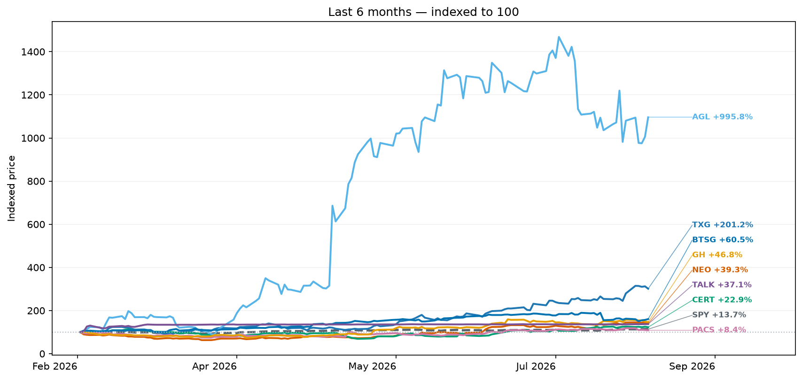
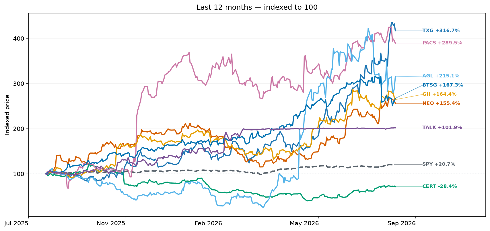
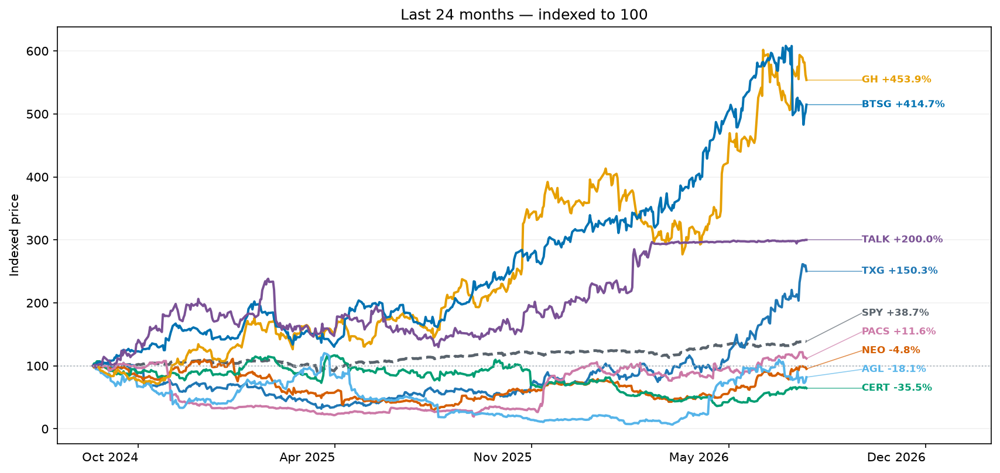
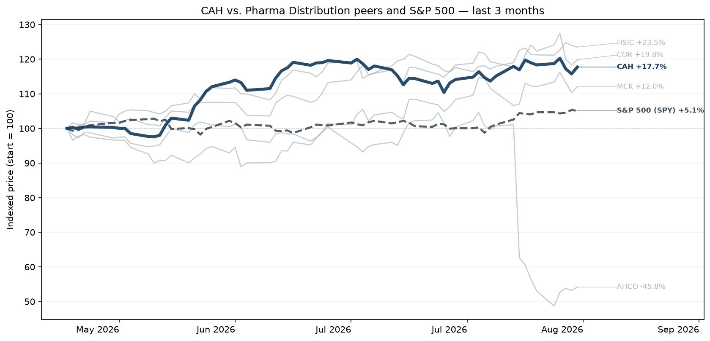
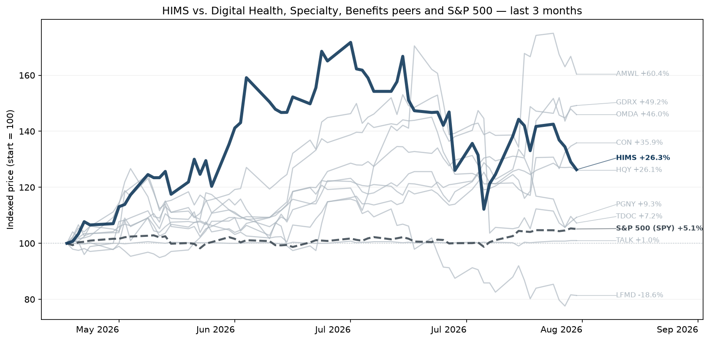
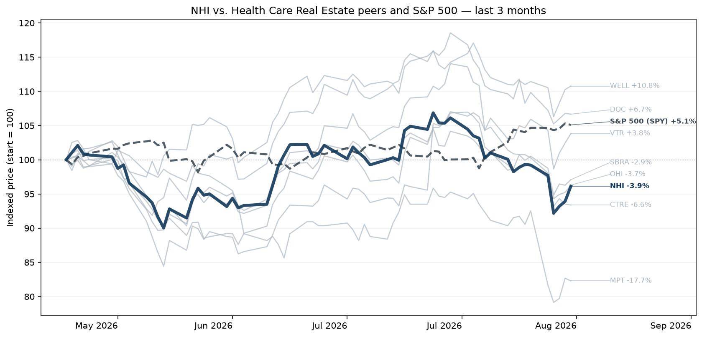
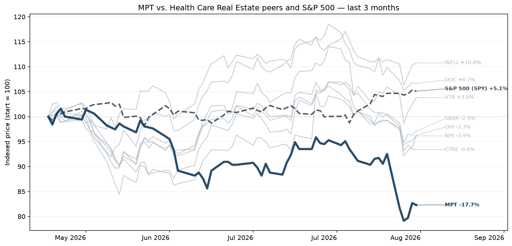
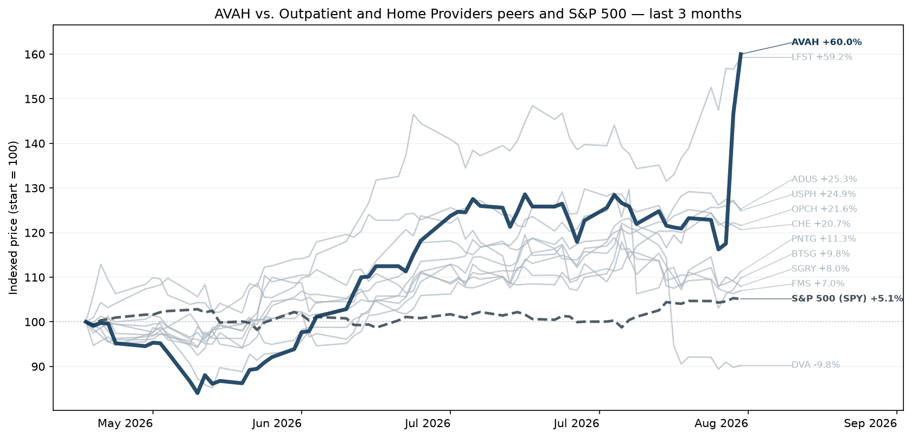
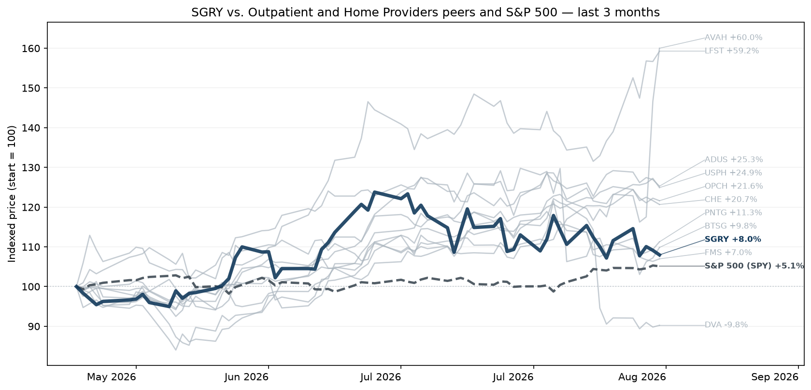
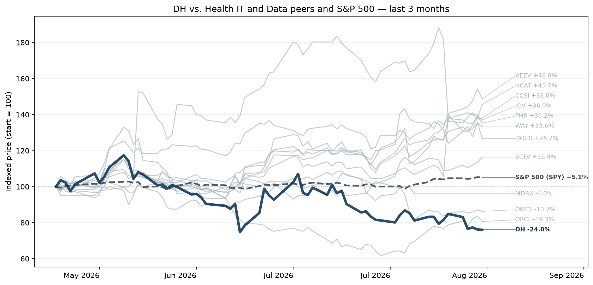

# Healthcare Intel Digest

<strong>Week of August 17, 2026</strong>Market data through: August 14, 2026Narrative created: August 17, 2026

Weekly review of healthcare services, technology, distribution, and diagnostic company performance, changes, earnings activity, and strategy narrative.

## Strategy Narrative

This week produced four developments worth carrying forward. The most consequential is **new empirical prior-authorization data that turns the transparency regime discussed in prior briefs into an actual competitive benchmark**. Separately, the Fifth Circuit materially altered No Surprises Act economics, Epic extended its interoperability platform into diagnostic imaging, and the administration converted a Medicaid coverage policy into a payment-integrity enforcement campaign.

I am intentionally **not** giving Aetna, Humana or UnitedHealth standalone earnings updates this week. Their recent-quarter theses remain largely unchanged, and I found no company-specific disclosure in the last seven days significant enough to justify repeating them. The one exception is UnitedHealth's appearance in the new cross-payer prior-authorization data.

<h3 id="1-resolve-prior-authorization-transparency-has-moved-from-theoretical-reputational-risk-to-measurable-payer-differentiation">1. RESOLVE — Prior-authorization transparency has moved from theoretical reputational risk to measurable payer differentiation</h3>

Prior briefs identified CMS's new authorization reporting regime as likely to create external comparisons among insurers. This week, KFF performed essentially that first large-scale comparison using federally required 2025 disclosures across Medicare Advantage, Medicaid managed care and ACA plans. [KFF+1](https://www.kff.org/patient-consumer-protections/prior-authorization-metrics-provide-new-insights-into-insurer-practices-but-gaps-remain/)

**What changed:** The differences are large enough to matter strategically. Standard-request denial rates averaged **12% in Medicare Advantage, 14% in Medicaid managed care and 18% in ACA Marketplace plans**. Within MA, rates among six major insurers ranged from **5% for Elevance to 17% for UnitedHealth Group**. UnitedHealth's reported standard denial rates also varied significantly by business: 17% in MA, 11% in Medicaid managed care and 21% in the ACA Marketplace. [KFF+1](https://www.kff.org/patient-consumer-protections/prior-authorization-metrics-provide-new-insights-into-insurer-practices-but-gaps-remain/)

The more consequential figure may be appeals. **67% of appealed MA authorization denials were eventually overturned**, versus 47% in Medicaid managed care and 43% in the Marketplace. UnitedHealth overturned 81% of appealed Medicaid managed-care denials in KFF's dataset. [KFF](https://www.kff.org/patient-consumer-protections/prior-authorization-metrics-provide-new-insights-into-insurer-practices-but-gaps-remain/)

At the same time, the data weaken a simple “payers are too slow” narrative: median standard decision time was about **one day** across all three markets, materially faster than regulatory maximums. CVS/Aetna, Humana and Kaiser reported MA median standard response times of less than one day. [KFF+1](https://www.kff.org/patient-consumer-protections/prior-authorization-metrics-provide-new-insights-into-insurer-practices-but-gaps-remain/)

**What it tells us:** Our prior thesis needs refinement. **Decision speed is becoming less differentiated than decision quality.** As electronic authorization accelerates, the strategic battleground shifts toward what gets denied, why it gets denied and whether the initial determination survives appeal.

A high overturn rate can reflect missing documentation rather than an incorrect initial decision, and KFF warns that current reporting lacks enough service-level detail to separate those explanations. But that limitation itself identifies the next technology opportunity: payer systems need to connect **coverage requirements → submitted evidence → initial decision → additional documentation → appeal outcome**. [KFF](https://www.kff.org/patient-consumer-protections/prior-authorization-metrics-provide-new-insights-into-insurer-practices-but-gaps-remain/)

**Strategic implication:** Payment Integrity, UM and EDI increasingly share the same KPI: **first-pass decision accuracy**. A system that makes an authorization decision in minutes but creates appeals and provider rework has automated latency without solving administrative cost.

**Watch next:** CMS reporting enhancements requiring numeric volumes and more standardized metrics would dramatically increase benchmarking value. Also watch whether health systems and employer groups begin using insurer-level denial and overturn data in contracting.

---

<h3 id="2-new-the-no-surprises-act-ruling-shifts-dollars-toward-providers-and-increases-the-value-of-contract-rate-intelligence">2. NEW — The No Surprises Act ruling shifts dollars toward providers and increases the value of contract-rate intelligence</h3>

On August 11, the en banc Fifth Circuit invalidated key elements of the federal methodology for calculating the No Surprises Act's **Qualifying Payment Amount (QPA)**. The court ruled that insurers may not incorporate “ghost rates”—contracted prices for services a provider does not actually perform—and must include bonus and incentive payments when calculating the benchmark. It allowed insurers to continue excluding one-off agreements such as individual air-ambulance arrangements. [Reuters+1](https://www.reuters.com/legal/litigation/us-appeals-court-voids-formula-used-avert-surprise-medical-bills-2026-08-12/)

**Why it matters:** This is a substantive payer/provider financial delta rather than another procedural NSA lawsuit. QPAs influence the independent dispute-resolution process for out-of-network claims; removing artificially low contractual rates and adding incentive payments should generally push the relevant benchmark upward. The ruling therefore favors providers economically and weakens one lever insurers have used to constrain out-of-network reimbursement. [Reuters](https://www.reuters.com/legal/litigation/us-appeals-court-voids-formula-used-avert-surprise-medical-bills-2026-08-12/)

The magnitude could be meaningful. CMS recently said arbitration awards grew from **$4.1 billion in 2024 to $14.9 billion in 2025**, while arguing that parts of the dispute process were being gamed. [Reuters](https://www.reuters.com/legal/litigation/us-appeals-court-voids-formula-used-avert-surprise-medical-bills-2026-08-12/)

**What it tells us:** Contract intelligence is becoming a more strategic capability on both sides. Payers need defensible QPA construction and stronger visibility into actual contracted-rate distributions; providers need sufficient reimbursement analytics to identify claims where arbitration has positive expected value.

This also intersects with payment integrity. As out-of-network settlements become more valuable, payers have greater incentive to scrutinize eligibility, coding, bundling and documentation surrounding disputed claims—while providers have greater incentive to automate identification and pursuit of underpayments.

**Watch next:** Federal agency guidance is the immediate catalyst. The court specifically noted that agencies can use enforcement discretion while replacing the methodology, so operational disruption may be limited initially. The new formula—and whether litigation follows it—will determine the longer-run economics. [Reuters](https://www.reuters.com/legal/litigation/us-appeals-court-voids-formula-used-avert-surprise-medical-bills-2026-08-12/)

---

<h3 id="3-confirm-epic-is-turning-interoperability-from-document-exchange-into-workflow-infrastructure">3. CONFIRM — Epic is turning interoperability from document exchange into workflow infrastructure</h3>

On August 13, Epic made **Care Everywhere Diagnostic Image Exchange** broadly available, allowing clinicians to retrieve full diagnostic-quality CTs, MRIs, X-rays and other images from participating Epic health systems with one click. Previously, Epic could exchange radiology reports and lower-resolution reference images; full diagnostic images frequently required separate retrieval processes or physical media. [Epic](https://www.epic.com/epic/post/diagnostic-image-exchange-helps-clinicians-and-patients-get-answers-sooner/)

**Why it matters:** Last week's brief argued that the strategic value in health technology is increasingly accruing to platforms controlling shared infrastructure and adjacent workflows. Epic's move strengthens that thesis.

Diagnostic imaging has historically sat partly outside the EHR in PACS and image-archive systems. Epic is now using its installed interoperability network and open image-sharing standards to bridge those systems directly. Epic says its existing duplicate-order checks already prevent more than **21,000 repeat scans annually**; direct image access potentially extends that benefit. [Epic](https://www.epic.com/epic/post/diagnostic-image-exchange-helps-clinicians-and-patients-get-answers-sooner/)

**What it tells us:** Epic's moat is expanding beyond the medical record itself toward the **network connecting clinical organizations**. Every workflow that migrates into Care Everywhere makes the installed ecosystem more useful and potentially reduces the role of standalone exchange vendors.

For payers, there is an indirect but important implication. As richer clinical evidence becomes electronically portable, imaging increasingly becomes available to authorization, quality and payment-integrity workflows without bespoke medical-record retrieval.

**Watch next:** Epic is advocating inclusion of open image-sharing standards within TEFCA. If diagnostic imaging becomes a routine national exchange capability rather than an Epic-to-Epic feature, the bigger opportunity shifts toward software that can interpret and operationalize the images and associated metadata. [Epic](https://www.epic.com/epic/post/diagnostic-image-exchange-helps-clinicians-and-patients-get-answers-sooner/)

---

<h3 id="4-new-the-administration-is-linking-coverage-policy-coding-analytics-and-fraud-enforcement">4. NEW — The administration is linking coverage policy, coding analytics and fraud enforcement</h3>

CMS finalized a rule on August 11 ending federal Medicaid and CHIP funding for specified gender-transition procedures for minors, effective **October 13, 2026**, with a limited six-month transition for certain existing hormone-therapy patients. The policy applies to federal matching funds rather than prohibiting states from financing care themselves. [Centers for Medicare & Medicaid Services+1](https://www.cms.gov/newsroom/press-releases/cms-ends-federal-medicaid-chip-funding-sex-rejecting-procedures-children-youth)

Two days later, HHS escalated the issue from coverage policy to payment integrity. It referred more than 200 hospitals, physician groups, pharmacies, PBMs and other organizations to federal investigators after alleging anomalous billing patterns, including use of endocrine or other diagnosis codes in claims associated with gender-related treatment. HHS cited roughly $120 million in related billing since 2019; targeted providers and advocates dispute the administration's underlying characterization of this care, and investigations have not established fraud. [Reuters+1](https://www.reuters.com/legal/litigation/trump-administration-accuses-hospitals-improper-billing-over-gender-care-minors-2026-08-13/?utm_source=chatgpt.com)

**What it tells us:** Whatever one's view of the underlying clinical policy, the operational lesson for payers and providers is significant: **the administration is willing to use claims analytics to convert a policy priority into targeted coding and payment investigations.**

That strengthens the broader thesis from recent Medicaid Fraud War Room activity: diagnosis-code integrity, clinical indication and coverage policy are becoming tightly coupled enforcement domains.

For providers, coding governance therefore needs to answer not only “does this code support reimbursement?” but “does the longitudinal clinical record support why this code was selected?” For Medicaid plans and PBMs, new exclusions also require benefit configuration, edits and clinical-policy changes before October 13. [Centers for Medicare & Medicaid Services](https://www.cms.gov/newsroom/press-releases/cms-ends-federal-medicaid-chip-funding-sex-rejecting-procedures-children-youth)

**Watch next:** Legal challenges are highly likely to determine the policy's durability. Separately, watch whether OIG/DOJ investigations substantiate the billing allegations. That distinction matters: a policy disagreement becoming an investigation is not the same as evidence ultimately demonstrating improper claims.

---

<h3 id="strategic-synthesis">Strategic synthesis</h3>

The strongest new inference this week is that **transparency is beginning to change the value of automation**.

Until now, payer automation could be evaluated primarily internally: faster decisions, lower administrative cost, more savings. The new prior-authorization disclosures allow outsiders to observe outputs—denial rates, response times and overturned decisions. The NSA decision increases financial consequences when payer reimbursement methodology is successfully challenged. Meanwhile, federal investigators are using claims data to scrutinize diagnosis selection.

That shifts competitive advantage from **“automate more decisions”** toward **“make automated decisions that remain defensible when someone else can inspect the outcome.”**

For Payment Integrity, Risk, Quality and EDI, that means evidence provenance, explainability, consistent policy logic and appeal feedback loops are moving from compliance features toward core product capabilities.

On the provider side, Epic's image exchange illustrates the complementary trend: the data needed to support those decisions are becoming easier to move.

Taken together, the architecture becoming more valuable is not merely:

**data → AI → decision**

but:

**clinical evidence → policy → decision → external scrutiny → outcome → feedback into the next decision.**

That is the incremental strategic thesis I would carry into next week.

## Notable Changes

Comparison with the final report dated August 3, 2026 (market data through July 31, 2026).
- Health Care Real Estate moved from rank #5 to #5 among subcategories at 12 months; return +33.4% to +37.2%.
- Health Care Real Estate moved from rank #2 to #3 among subcategories at 24 months; return +47.9% to +78.7%.
- Health Care Real Estate moved from rank #4 to #6 among subcategories at 3 months; return +10.5% to +7.1%.
- Health IT and Data moved from rank #8 to #10 among subcategories at 12 months; return -37.3% to -30.3%.
- Health IT and Data moved from rank #6 to #8 among subcategories at 24 months; return +3.3% to +10.4%.
- Health IT and Data moved from rank #8 to #10 among subcategories at 3 months; return -13.4% to -9.2%.
- Health System Providers moved from rank #6 to #8 among subcategories at 12 months; return +20.4% to +10.6%.
- Health System Providers moved from rank #5 to #7 among subcategories at 24 months; return +22.5% to +15.5%.
- Health System Providers moved from rank #7 to #9 among subcategories at 3 months; return +1.7% to +3.2%.
- Inpatient Non-Acute Providers moved from rank #1 to #3 among subcategories at 12 months; return +87.3% to +74.5%.
- Inpatient Non-Acute Providers moved from rank #4 to #6 among subcategories at 24 months; return +22.7% to +21.5%.
- Inpatient Non-Acute Providers moved from rank #5 to #5 among subcategories at 3 months; return +9.9% to +12.3%.
- Payers moved from rank #2 to #6 among subcategories at 12 months; return +63.4% to +35.2%.
- Payers moved from rank #7 to #9 among subcategories at 24 months; return -5.2% to -6.9%.
- Payers moved from rank #3 to #8 among subcategories at 3 months; return +15.6% to +4.3%.
- Value-Based Care moved from rank #3 to #2 among subcategories at 12 months; return +56.6% to +80.6%.
- Value-Based Care moved from rank #8 to #10 among subcategories at 24 months; return -13.1% to -9.5%.
- Value-Based Care moved from rank #1 to #7 among subcategories at 3 months; return +59.1% to +6.1%.
- Healthpeak properties moved from rank #2 to #3 within Health Care Real Estate at 12 months; return +30.2% to +20.1%.
- Healthpeak properties moved from rank #4 to #7 within Health Care Real Estate at 24 months; return +5.3% to -3.2%.
- Healthpeak properties moved from rank #1 to #2 within Health Care Real Estate at 3 months; return +32.9% to +7.4%.
- Medical Properties Trust moved from rank #5 to #8 within Health Care Real Estate at 3 months; return -8.3% to -17.2%.
- National Health Investors moved from rank #4 to #7 within Health Care Real Estate at 12 months; return +7.5% to -2.3%.
- National Health Investors moved from rank #3 to #6 within Health Care Real Estate at 24 months; return +5.8% to -1.8%.
- National Health Investors moved from rank #4 to #6 within Health Care Real Estate at 3 months; return -0.1% to -2.3%.
- Omega Healthcare Investors moved from rank #3 to #5 within Health Care Real Estate at 12 months; return +26.7% to +13.5%.
- Omega Healthcare Investors moved from rank #2 to #5 within Health Care Real Estate at 24 months; return +36.8% to +24.3%.
- Omega Healthcare Investors moved from rank #2 to #4 within Health Care Real Estate at 3 months; return +7.8% to -1.7%.
- Ventas, Inc moved from rank #1 to #2 within Health Care Real Estate at 12 months; return +38.5% to +35.0%.
- Ventas, Inc moved from rank #1 to #2 within Health Care Real Estate at 24 months; return +68.0% to +56.7%.
- Consensus Cloud Solutions moved from rank #1 to #1 within Health IT and Data at 12 months; return +85.1% to +51.0%.
- Consensus Cloud Solutions moved from rank #1 to #1 within Health IT and Data at 24 months; return +89.6% to +93.7%.
- Consensus Cloud Solutions moved from rank #3 to #6 within Health IT and Data at 3 months; return +32.6% to +38.0%.
- Definitive Healthcare moved from rank #11 to #12 within Health IT and Data at 12 months; return -81.8% to -83.5%.
- Definitive Healthcare moved from rank #11 to #12 within Health IT and Data at 24 months; return -81.6% to -84.1%.
- Definitive Healthcare moved from rank #11 to #11 within Health IT and Data at 3 months; return -30.8% to -20.9%.
- Doximity moved from rank #10 to #11 within Health IT and Data at 12 months; return -63.5% to -61.9%.
- Doximity moved from rank #7 to #8 within Health IT and Data at 24 months; return -19.5% to -30.6%.
- Doximity moved from rank #9 to #7 within Health IT and Data at 3 months; return -16.3% to +30.7%.
- Health Catalyst moved from rank #6 to #8 within Health IT and Data at 12 months; return -40.6% to -36.6%.
- Health Catalyst moved from rank #10 to #11 within Health IT and Data at 24 months; return -65.3% to -72.6%.
- Health Catalyst moved from rank #2 to #1 within Health IT and Data at 3 months; return +44.1% to +55.5%.
- Iqvia moved from rank #2 to #3 within Health IT and Data at 12 months; return +28.8% to +23.8%.
- Iqvia moved from rank #1 to #4 within Health IT and Data at 3 months; return +49.0% to +39.9%.
- Veradigm moved from rank #4 to #5 within Health IT and Data at 12 months; return -1.0% to +4.3%.
- Veradigm moved from rank #8 to #10 within Health IT and Data at 24 months; return -48.8% to -50.0%.
- Veradigm moved from rank #8 to #9 within Health IT and Data at 3 months; return -1.0% to -4.0%.
- Oracle-Cerner moved from rank #8 to #9 within Health IT and Data at 12 months; return -46.9% to -39.4%.
- Oracle-Cerner moved from rank #4 to #4 within Health IT and Data at 24 months; return +1.6% to +9.5%.
- Oracle-Cerner moved from rank #10 to #12 within Health IT and Data at 3 months; return -24.4% to -22.0%.
- Phreesia moved from rank #9 to #10 within Health IT and Data at 12 months; return -59.3% to -57.2%.
- Phreesia moved from rank #9 to #9 within Health IT and Data at 24 months; return -52.7% to -49.4%.
- Phreesia moved from rank #6 to #3 within Health IT and Data at 3 months; return +11.0% to +40.0%.
- Solventum moved from rank #3 to #2 within Health IT and Data at 12 months; return +19.1% to +24.0%.
- Solventum moved from rank #4 to #8 within Health IT and Data at 3 months; return +28.2% to +19.3%.
- Veeva Systems moved from rank #5 to #6 within Health IT and Data at 12 months; return -27.6% to -13.1%.
- Veeva Systems moved from rank #3 to #3 within Health IT and Data at 24 months; return +9.9% to +26.6%.
- Veeva Systems moved from rank #5 to #2 within Health IT and Data at 3 months; return +18.8% to +53.4%.
- Waystar moved from rank #7 to #7 within Health IT and Data at 12 months; return -40.7% to -31.3%.
- Waystar moved from rank #7 to #5 within Health IT and Data at 3 months; return +0.8% to +38.2%.
- HCA Healthcare moved from rank #2 to #3 within Health System Providers at 12 months; return +12.8% to +2.2%.
- HCA Healthcare moved from rank #2 to #2 within Health System Providers at 24 months; return +15.0% to +8.3%.
- HCA Healthcare moved from rank #3 to #5 within Health System Providers at 3 months; return -7.0% to -4.3%.
- Tenet Health moved from rank #1 to #1 within Health System Providers at 12 months; return +61.2% to +55.7%.
- Tenet Health moved from rank #1 to #1 within Health System Providers at 24 months; return +75.7% to +71.0%.
- Tenet Health moved from rank #1 to #1 within Health System Providers at 3 months; return +39.0% to +36.2%.
- Universal Health Services moved from rank #3 to #4 within Health System Providers at 12 months; return +3.4% to -4.7%.
- Universal Health Services moved from rank #3 to #3 within Health System Providers at 24 months; return -20.2% to -24.9%.
- Universal Health Services moved from rank #2 to #4 within Health System Providers at 3 months; return +0.9% to +0.8%.
- Acadia Healthcare moved from rank #2 to #2 within Inpatient Non-Acute Providers at 12 months; return +40.4% to +46.9%.
- Acadia Healthcare moved from rank #2 to #1 within Inpatient Non-Acute Providers at 3 months; return +6.4% to +19.4%.
- Encompass Health moved from rank #3 to #1 within Inpatient Non-Acute Providers at 24 months; return +23.9% to +39.5%.
- Encompass Health moved from rank #3 to #3 within Inpatient Non-Acute Providers at 3 months; return +3.3% to +15.9%.
- The Ensign Group moved from rank #3 to #3 within Inpatient Non-Acute Providers at 12 months; return +17.4% to +9.3%.
- The Ensign Group moved from rank #4 to #4 within Inpatient Non-Acute Providers at 3 months; return -3.0% to +2.2%.
- PACS Group moved from rank #1 to #1 within Inpatient Non-Acute Providers at 12 months; return +333.2% to +286.4%.
- PACS Group moved from rank #1 to #3 within Inpatient Non-Acute Providers at 24 months; return +41.4% to +14.6%.
- PACS Group moved from rank #1 to #2 within Inpatient Non-Acute Providers at 3 months; return +39.4% to +18.6%.
- Alignment Health moved from rank #9 to #10 within Payers at 12 months; return +14.5% to -7.2%.
- Alignment Health moved from rank #4 to #4 within Payers at 24 months; return +68.2% to +60.5%.
- Alignment Health moved from rank #10 to #10 within Payers at 3 months; return -26.7% to -11.3%.
- Cigna moved from rank #10 to #9 within Payers at 12 months; return +6.4% to -4.8%.
- Cigna moved from rank #6 to #7 within Payers at 24 months; return -14.3% to -17.5%.
- Clover Health moved from rank #5 to #3 within Payers at 12 months; return +50.0% to +73.6%.
- Clover Health moved from rank #1 to #3 within Payers at 24 months; return +121.8% to +62.5%.
- Clover Health moved from rank #3 to #2 within Payers at 3 months; return +53.9% to +32.6%.
- Centene moved from rank #1 to #1 within Payers at 12 months; return +140.1% to +136.8%.
- Centene moved from rank #7 to #6 within Payers at 24 months; return -19.6% to -13.6%.
- Centene moved from rank #5 to #4 within Payers at 3 months; return +16.6% to +15.8%.
- CVS Health moved from rank #4 to #4 within Payers at 12 months; return +67.2% to +41.6%.
- CVS Health moved from rank #3 to #2 within Payers at 24 months; return +76.0% to +66.5%.
- CVS Health moved from rank #4 to #8 within Payers at 3 months; return +27.2% to +1.3%.
- Elevance moved from rank #7 to #7 within Payers at 12 months; return +36.8% to +29.3%.
- Elevance moved from rank #8 to #7 within Payers at 3 months; return +0.8% to +1.9%.
- Humana moved from rank #6 to #5 within Payers at 12 months; return +47.2% to +35.8%.
- Humana moved from rank #5 to #5 within Payers at 24 months; return +2.1% to +11.0%.
- Humana moved from rank #2 to #3 within Payers at 3 months; return +55.7% to +27.5%.
- Molina Healthcare moved from rank #10 to #10 within Payers at 24 months; return -43.6% to -39.3%.
- Molina Healthcare moved from rank #7 to #5 within Payers at 3 months; return +1.5% to +14.8%.
- Oscar Health moved from rank #2 to #2 within Payers at 12 months; return +129.9% to +109.5%.
- Oscar Health moved from rank #2 to #1 within Payers at 24 months; return +90.1% to +75.2%.
- Oscar Health moved from rank #1 to #1 within Payers at 3 months; return +68.8% to +40.5%.
- UnitedHealth moved from rank #3 to #6 within Payers at 12 months; return +74.3% to +32.1%.
- UnitedHealth moved from rank #6 to #6 within Payers at 3 months; return +12.4% to +2.0%.
- Agilon Health moved from rank #1 to #1 within Value-Based Care at 12 months; return +115.6% to +249.2%.
- Agilon Health moved from rank #3 to #3 within Value-Based Care at 24 months; return -42.2% to -20.1%.
- Agilon Health moved from rank #2 to #1 within Value-Based Care at 3 months; return +209.7% to +18.6%.
- Astrana Health moved from rank #2 to #3 within Value-Based Care at 12 months; return +64.9% to +39.1%.
- Astrana Health moved from rank #2 to #2 within Value-Based Care at 24 months; return -24.6% to -15.4%.
- Astrana Health moved from rank #3 to #3 within Value-Based Care at 3 months; return +1.9% to +6.7%.
- Evolent Health moved from rank #5 to #5 within Value-Based Care at 12 months; return -69.0% to -49.7%.
- Evolent Health moved from rank #5 to #5 within Value-Based Care at 24 months; return -85.3% to -82.9%.
- Evolent Health moved from rank #5 to #2 within Value-Based Care at 3 months; return -17.6% to +18.2%.
- P3 Health moved from rank #3 to #2 within Value-Based Care at 12 months; return +33.7% to +57.7%.
- P3 Health moved from rank #4 to #4 within Value-Based Care at 24 months; return -67.2% to -64.3%.
- P3 Health moved from rank #1 to #5 within Value-Based Care at 3 months; return +235.5% to -5.4%.
- Privia Health Group moved from rank #4 to #4 within Value-Based Care at 12 months; return +25.5% to +3.4%.
- Privia Health Group moved from rank #1 to #1 within Value-Based Care at 24 months; return +22.9% to +10.6%.
- Acadia Healthcare moved from rank #27 to #35 across the watchlist at 3 months; return +6.4% to +19.4%.
- Acadia Healthcare moved from rank #16 to #22 across the watchlist at 12 months; return +40.4% to +46.9%.
- Acadia Healthcare moved from rank #43 to #74 across the watchlist at 24 months; return -58.3% to -58.6%.
- Agilon Health moved from rank #2 to #39 across the watchlist at 3 months; return +209.7% to +18.6%.
- Agilon Health moved from rank #6 to #3 across the watchlist at 12 months; return +115.6% to +249.2%.
- Agilon Health moved from rank #38 to #57 across the watchlist at 24 months; return -42.2% to -20.1%.
- Alignment Health moved from rank #48 to #76 across the watchlist at 3 months; return -26.7% to -11.3%.
- Alignment Health moved from rank #27 to #61 across the watchlist at 12 months; return +14.5% to -7.2%.
- Alignment Health moved from rank #9 to #16 across the watchlist at 24 months; return +68.2% to +60.5%.
- Amwell moved from rank #3 to #6 across the watchlist at 3 months; return +75.7% to +64.5%.
- Amwell moved from rank #13 to #13 across the watchlist at 12 months; return +53.4% to +74.1%.
- Amwell moved from rank #20 to #23 across the watchlist at 24 months; return +12.4% to +43.8%.
- Astrana Health moved from rank #31 to #55 across the watchlist at 3 months; return +1.9% to +6.7%.
- Astrana Health moved from rank #11 to #25 across the watchlist at 12 months; return +64.9% to +39.1%.
- Astrana Health moved from rank #34 to #55 across the watchlist at 24 months; return -24.6% to -15.4%.
- Consensus Cloud Solutions moved from rank #14 to #18 across the watchlist at 3 months; return +32.6% to +38.0%.
- Consensus Cloud Solutions moved from rank #7 to #21 across the watchlist at 12 months; return +85.1% to +51.0%.
- Consensus Cloud Solutions moved from rank #5 to #10 across the watchlist at 24 months; return +89.6% to +93.7%.
- Cigna moved from rank #40 to #66 across the watchlist at 3 months; return -1.4% to -0.9%.
- Cigna moved from rank #31 to #58 across the watchlist at 12 months; return +6.4% to -4.8%.
- Cigna moved from rank #29 to #56 across the watchlist at 24 months; return -14.3% to -17.5%.
- Clover Health moved from rank #7 to #22 across the watchlist at 3 months; return +53.9% to +32.6%.
- Clover Health moved from rank #14 to #15 across the watchlist at 12 months; return +50.0% to +73.6%.
- Clover Health moved from rank #2 to #15 across the watchlist at 24 months; return +121.8% to +62.5%.
- Centene moved from rank #20 to #42 across the watchlist at 3 months; return +16.6% to +15.8%.
- Centene moved from rank #3 to #7 across the watchlist at 12 months; return +140.1% to +136.8%.
- Centene moved from rank #31 to #54 across the watchlist at 24 months; return -19.6% to -13.6%.
- CVS Health moved from rank #17 to #63 across the watchlist at 3 months; return +27.2% to +1.3%.
- CVS Health moved from rank #10 to #24 across the watchlist at 12 months; return +67.2% to +41.6%.
- CVS Health moved from rank #7 to #14 across the watchlist at 24 months; return +76.0% to +66.5%.
- Definitive Healthcare moved from rank #50 to #80 across the watchlist at 3 months; return -30.8% to -20.9%.
- Definitive Healthcare moved from rank #49 to #80 across the watchlist at 12 months; return -81.8% to -83.5%.
- Definitive Healthcare moved from rank #47 to #79 across the watchlist at 24 months; return -81.6% to -84.1%.
- Healthpeak properties moved from rank #13 to #53 across the watchlist at 3 months; return +32.9% to +7.4%.
- Healthpeak properties moved from rank #20 to #37 across the watchlist at 12 months; return +30.2% to +20.1%.
- Healthpeak properties moved from rank #23 to #47 across the watchlist at 24 months; return +5.3% to -3.2%.
- Doximity moved from rank #45 to #23 across the watchlist at 3 months; return -16.3% to +30.7%.
- Doximity moved from rank #46 to #79 across the watchlist at 12 months; return -63.5% to -61.9%.
- Doximity moved from rank #30 to #63 across the watchlist at 24 months; return -19.5% to -30.6%.
- Davita moved from rank #5 to #75 across the watchlist at 3 months; return +58.3% to -9.9%.
- Davita moved from rank #9 to #28 across the watchlist at 12 months; return +73.4% to +33.0%.
- Davita moved from rank #6 to #37 across the watchlist at 24 months; return +77.3% to +19.8%.
- Encompass Health moved from rank #30 to #41 across the watchlist at 3 months; return +3.3% to +15.9%.
- Encompass Health moved from rank #33 to #52 across the watchlist at 12 months; return +2.3% to +2.7%.
- Encompass Health moved from rank #17 to #26 across the watchlist at 24 months; return +23.9% to +39.5%.
- Elevance moved from rank #35 to #62 across the watchlist at 3 months; return +0.8% to +1.9%.
- Elevance moved from rank #18 to #32 across the watchlist at 12 months; return +36.8% to +29.3%.
- Elevance moved from rank #35 to #61 across the watchlist at 24 months; return -28.2% to -26.4%.
- The Ensign Group moved from rank #41 to #60 across the watchlist at 3 months; return -3.0% to +2.2%.
- The Ensign Group moved from rank #26 to #48 across the watchlist at 12 months; return +17.4% to +9.3%.
- The Ensign Group moved from rank #16 to #30 across the watchlist at 24 months; return +29.9% to +28.6%.
- Evolent Health moved from rank #46 to #40 across the watchlist at 3 months; return -17.6% to +18.2%.
- Evolent Health moved from rank #48 to #77 across the watchlist at 12 months; return -69.0% to -49.7%.
- Evolent Health moved from rank #48 to #78 across the watchlist at 24 months; return -85.3% to -82.9%.
- Fresenius moved from rank #22 to #50 across the watchlist at 3 months; return +14.1% to +10.0%.
- Fresenius moved from rank #34 to #59 across the watchlist at 12 months; return +2.1% to -5.2%.
- Fresenius moved from rank #15 to #33 across the watchlist at 24 months; return +36.7% to +25.3%.
- GoodRx moved from rank #18 to #10 across the watchlist at 3 months; return +20.4% to +53.5%.
- GoodRx moved from rank #40 to #55 across the watchlist at 12 months; return -32.2% to +0.0%.
- GoodRx moved from rank #44 to #70 across the watchlist at 24 months; return -62.8% to -48.0%.
- HCA Healthcare moved from rank #43 to #72 across the watchlist at 3 months; return -7.0% to -4.3%.
- HCA Healthcare moved from rank #29 to #53 across the watchlist at 12 months; return +12.8% to +2.2%.
- HCA Healthcare moved from rank #19 to #42 across the watchlist at 24 months; return +15.0% to +8.3%.
- Health Catalyst moved from rank #9 to #9 across the watchlist at 3 months; return +44.1% to +55.5%.
- Health Catalyst moved from rank #41 to #71 across the watchlist at 12 months; return -40.6% to -36.6%.
- Health Catalyst moved from rank #45 to #77 across the watchlist at 24 months; return -65.3% to -72.6%.
- Hims & Hers moved from rank #33 to #47 across the watchlist at 3 months; return +1.3% to +12.4%.
- Hims & Hers moved from rank #44 to #73 across the watchlist at 12 months; return -55.6% to -38.8%.
- Hims & Hers moved from rank #11 to #11 across the watchlist at 24 months; return +55.7% to +80.7%.
- Humana moved from rank #6 to #26 across the watchlist at 3 months; return +55.7% to +27.5%.
- Humana moved from rank #15 to #26 across the watchlist at 12 months; return +47.2% to +35.8%.
- Humana moved from rank #24 to #39 across the watchlist at 24 months; return +2.1% to +11.0%.
- Iqvia moved from rank #8 to #15 across the watchlist at 3 months; return +49.0% to +39.9%.
- Iqvia moved from rank #21 to #36 across the watchlist at 12 months; return +28.8% to +23.8%.
- Iqvia moved from rank #26 to #44 across the watchlist at 24 months; return +0.6% to -1.2%.
- LifeMD moved from rank #49 to #79 across the watchlist at 3 months; return -30.0% to -20.3%.
- LifeMD moved from rank #47 to #76 across the watchlist at 12 months; return -64.8% to -46.3%.
- LifeMD moved from rank #37 to #65 across the watchlist at 24 months; return -41.5% to -33.8%.
- Lifestance Health moved from rank #11 to #7 across the watchlist at 3 months; return +39.2% to +62.4%.
- Lifestance Health moved from rank #2 to #8 across the watchlist at 12 months; return +176.5% to +128.3%.
- Lifestance Health moved from rank #3 to #7 across the watchlist at 24 months; return +90.2% to +119.8%.
- Veradigm moved from rank #39 to #70 across the watchlist at 3 months; return -1.0% to -4.0%.
- Veradigm moved from rank #35 to #50 across the watchlist at 12 months; return -1.0% to +4.3%.
- Veradigm moved from rank #41 to #73 across the watchlist at 24 months; return -48.8% to -50.0%.
- Molina Healthcare moved from rank #32 to #43 across the watchlist at 3 months; return +1.5% to +14.8%.
- Molina Healthcare moved from rank #23 to #34 across the watchlist at 12 months; return +26.1% to +26.8%.
- Molina Healthcare moved from rank #39 to #67 across the watchlist at 24 months; return -43.6% to -39.3%.
- Medical Properties Trust moved from rank #44 to #78 across the watchlist at 3 months; return -8.3% to -17.2%.
- National Health Investors moved from rank #38 to #69 across the watchlist at 3 months; return -0.1% to -2.3%.
- National Health Investors moved from rank #30 to #56 across the watchlist at 12 months; return +7.5% to -2.3%.
- National Health Investors moved from rank #22 to #46 across the watchlist at 24 months; return +5.8% to -1.8%.
- Omega Healthcare Investors moved from rank #26 to #67 across the watchlist at 3 months; return +7.8% to -1.7%.
- Omega Healthcare Investors moved from rank #22 to #44 across the watchlist at 12 months; return +26.7% to +13.5%.
- Omega Healthcare Investors moved from rank #14 to #35 across the watchlist at 24 months; return +36.8% to +24.3%.
- Omada Health moved from rank #15 to #12 across the watchlist at 3 months; return +29.8% to +45.2%.
- Omada Health moved from rank #28 to #41 across the watchlist at 12 months; return +14.2% to +17.1%.
- Option Care Health moved from rank #21 to #31 across the watchlist at 3 months; return +15.0% to +22.7%.
- Option Care Health moved from rank #37 to #66 across the watchlist at 12 months; return -18.5% to -15.4%.
- Option Care Health moved from rank #33 to #58 across the watchlist at 24 months; return -22.4% to -23.7%.
- Oracle-Cerner moved from rank #47 to #81 across the watchlist at 3 months; return -24.4% to -22.0%.
- Oracle-Cerner moved from rank #43 to #74 across the watchlist at 12 months; return -46.9% to -39.4%.
- Oracle-Cerner moved from rank #25 to #41 across the watchlist at 24 months; return +1.6% to +9.5%.
- Oscar Health moved from rank #4 to #13 across the watchlist at 3 months; return +68.8% to +40.5%.
- Oscar Health moved from rank #4 to #9 across the watchlist at 12 months; return +129.9% to +109.5%.
- Oscar Health moved from rank #4 to #12 across the watchlist at 24 months; return +90.1% to +75.2%.
- PACS Group moved from rank #10 to #38 across the watchlist at 3 months; return +39.4% to +18.6%.
- PACS Group moved from rank #1 to #2 across the watchlist at 12 months; return +333.2% to +286.4%.
- PACS Group moved from rank #13 to #38 across the watchlist at 24 months; return +41.4% to +14.6%.
- Phreesia moved from rank #24 to #14 across the watchlist at 3 months; return +11.0% to +40.0%.
- Phreesia moved from rank #45 to #78 across the watchlist at 12 months; return -59.3% to -57.2%.
- Phreesia moved from rank #42 to #72 across the watchlist at 24 months; return -52.7% to -49.4%.
- P3 Health moved from rank #1 to #73 across the watchlist at 3 months; return +235.5% to -5.4%.
- P3 Health moved from rank #19 to #16 across the watchlist at 12 months; return +33.7% to +57.7%.
- P3 Health moved from rank #46 to #75 across the watchlist at 24 months; return -67.2% to -64.3%.
- Privia Health Group moved from rank #42 to #71 across the watchlist at 3 months; return -4.7% to -4.1%.
- Privia Health Group moved from rank #24 to #51 across the watchlist at 12 months; return +25.5% to +3.4%.
- Privia Health Group moved from rank #18 to #40 across the watchlist at 24 months; return +22.9% to +10.6%.
- Surgery Partners moved from rank #25 to #52 across the watchlist at 3 months; return +7.9% to +7.7%.
- Surgery Partners moved from rank #39 to #70 across the watchlist at 12 months; return -27.6% to -34.1%.
- Surgery Partners moved from rank #40 to #71 across the watchlist at 24 months; return -46.4% to -48.2%.
- Solventum moved from rank #16 to #36 across the watchlist at 3 months; return +28.2% to +19.3%.
- Solventum moved from rank #25 to #35 across the watchlist at 12 months; return +19.1% to +24.0%.
- Solventum moved from rank #12 to #21 across the watchlist at 24 months; return +49.1% to +49.1%.
- Talkspace moved from rank #37 to #64 across the watchlist at 3 months; return +0.6% to +1.0%.
- Talkspace moved from rank #5 to #10 across the watchlist at 12 months; return +126.0% to +105.1%.
- Talkspace moved from rank #1 to #3 across the watchlist at 24 months; return +194.9% to +198.3%.
- Teladoc moved from rank #29 to #54 across the watchlist at 3 months; return +3.9% to +7.1%.
- Teladoc moved from rank #36 to #62 across the watchlist at 12 months; return -3.3% to -9.4%.
- Teladoc moved from rank #28 to #50 across the watchlist at 24 months; return -11.7% to -4.2%.
- Tenet Health moved from rank #12 to #20 across the watchlist at 3 months; return +39.0% to +36.2%.
- Tenet Health moved from rank #12 to #18 across the watchlist at 12 months; return +61.2% to +55.7%.
- Tenet Health moved from rank #8 to #13 across the watchlist at 24 months; return +75.7% to +71.0%.
- Universal Health Services moved from rank #34 to #65 across the watchlist at 3 months; return +0.9% to +0.8%.
- Universal Health Services moved from rank #32 to #57 across the watchlist at 12 months; return +3.4% to -4.7%.
- Universal Health Services moved from rank #32 to #59 across the watchlist at 24 months; return -20.2% to -24.9%.
- UnitedHealth moved from rank #23 to #61 across the watchlist at 3 months; return +12.4% to +2.0%.
- UnitedHealth moved from rank #8 to #30 across the watchlist at 12 months; return +74.3% to +32.1%.
- UnitedHealth moved from rank #36 to #62 across the watchlist at 24 months; return -29.7% to -30.5%.
- Veeva Systems moved from rank #19 to #11 across the watchlist at 3 months; return +18.8% to +53.4%.
- Veeva Systems moved from rank #38 to #65 across the watchlist at 12 months; return -27.6% to -13.1%.
- Veeva Systems moved from rank #21 to #31 across the watchlist at 24 months; return +9.9% to +26.6%.
- Ventas, Inc moved from rank #28 to #58 across the watchlist at 3 months; return +6.2% to +4.7%.
- Ventas, Inc moved from rank #17 to #27 across the watchlist at 12 months; return +38.5% to +35.0%.
- Ventas, Inc moved from rank #10 to #18 across the watchlist at 24 months; return +68.0% to +56.7%.
- Waystar moved from rank #36 to #17 across the watchlist at 3 months; return +0.8% to +38.2%.
- Waystar moved from rank #42 to #69 across the watchlist at 12 months; return -40.7% to -31.3%.
- Waystar moved from rank #27 to #49 across the watchlist at 24 months; return -2.2% to -3.8%.
- Amwell (AMWL) was added to Digital Health, Specialty, Benefits.
- Concentra Group (CON) was added to Digital Health, Specialty, Benefits.
- GoodRx (GDRX) was added to Digital Health, Specialty, Benefits.
- Hims & Hers (HIMS) was added to Digital Health, Specialty, Benefits.
- HealthEquity (HQY) was added to Digital Health, Specialty, Benefits.
- LifeMD (LFMD) was added to Digital Health, Specialty, Benefits.
- Omada Health (OMDA) was added to Digital Health, Specialty, Benefits.
- Progyny (PGNY) was added to Digital Health, Specialty, Benefits.
- Talkspace (TALK) was added to Digital Health, Specialty, Benefits.
- Teladoc (TDOC) was added to Digital Health, Specialty, Benefits.
- CareTrust REIT (CTRE) was added to Health Care Real Estate.
- Sabra Health Care REIT (SBRA) was added to Health Care Real Estate.
- Welltower (WELL) was added to Health Care Real Estate.
- Omnicell (OMCL) was added to Health IT and Data.
- Ardent Health Partners (ARDT) was added to Health System Providers.
- Community Health Systems (CYH) was added to Health System Providers.
- Addus HomeCare (ADUS) was added to Outpatient and Home Providers.
- Aveanna Healthcare (AVAH) was added to Outpatient and Home Providers.
- BrightSpring Health Services (BTSG) was added to Outpatient and Home Providers.
- Chemed (Vitas) (CHE) was added to Outpatient and Home Providers.
- Davita (DVA) was added to Outpatient and Home Providers.
- Fresenius (FMS) was added to Outpatient and Home Providers.
- Lifestance Health (LFST) was added to Outpatient and Home Providers.
- Option Care Health (OPCH) was added to Outpatient and Home Providers.
- Pennant Group (PNTG) was added to Outpatient and Home Providers.
- Surgery Partners (SGRY) was added to Outpatient and Home Providers.
- US Physical Therapy (USPH) was added to Outpatient and Home Providers.
- Accendra Health (AHCO) was added to Pharma Distribution.
- Cardinal Health (CAH) was added to Pharma Distribution.
- Cencora (COR) was added to Pharma Distribution.
- Henry Schein (HSIC) was added to Pharma Distribution.
- McKesson (MCK) was added to Pharma Distribution.
- BillionToOne (BLLN) was added to Precision Diagnostics.
- Certara (CERT) was added to Precision Diagnostics.
- Quest Diagnostics (DGX) was added to Precision Diagnostics.
- Guardant Health (GH) was added to Precision Diagnostics.
- Illumina (ILMN) was added to Precision Diagnostics.
- Labcorp Holdings (LH) was added to Precision Diagnostics.
- NeoGenomics (NEO) was added to Precision Diagnostics.
- Natera (NTRA) was added to Precision Diagnostics.
- PacBio (PACB) was added to Precision Diagnostics.
- QuidelOrtho (QDEL) was added to Precision Diagnostics.
- Tempus AI (TEM) was added to Precision Diagnostics.
- 10x Genomics (TXG) was added to Precision Diagnostics.
- Amwell (AMWL) was removed from Digital Health.
- GoodRx (GDRX) was removed from Digital Health.
- Hims & Hers (HIMS) was removed from Digital Health.
- LifeMD (LFMD) was removed from Digital Health.
- Omada Health (OMDA) was removed from Digital Health.
- Talkspace (TALK) was removed from Digital Health.
- Teladoc (TDOC) was removed from Digital Health.
- Davita (DVA) was removed from Outpatient Providers.
- Fresenius (FMS) was removed from Outpatient Providers.
- Lifestance Health (LFST) was removed from Outpatient Providers.
- Option Care Health (OPCH) was removed from Outpatient Providers.
- Surgery Partners (SGRY) was removed from Outpatient Providers.

### Subcategory movement since the previous report

<table class="sortable"><thead><tr><th class="sortable-heading" data-column="0" data-type="text">Subcategory</th><th class="sortable-heading" data-column="1" data-type="number">Move</th></tr></thead><tbody><tr><td class="text" data-sort="health it and data" style="">Health IT and Data</td><td class="" data-sort="0.14529637693820402" style="background:#1a7a3c;color:#ffffff;">+14.5%</td></tr><tr><td class="text" data-sort="value-based care" style="">Value-Based Care</td><td class="" data-sort="0.04879338734059127" style="background:#a9d9a4;color:#111820;">+4.9%</td></tr><tr><td class="text" data-sort="inpatient non-acute providers" style="">Inpatient Non-Acute Providers</td><td class="" data-sort="0.04165026400878604" style="background:#a9d9a4;color:#111820;">+4.2%</td></tr><tr><td class="text" data-sort="digital health, specialty, benefits" style="">Digital Health, Specialty, Benefits</td><td class="" data-sort="0.0403270128263293" style="background:#a9d9a4;color:#111820;">+4.0%</td></tr><tr><td class="text" data-sort="precision diagnostics" style="">Precision Diagnostics</td><td class="" data-sort="0.02811909868930254" style="background:#d6ecd4;color:#111820;">+2.8%</td></tr><tr><td class="text" data-sort="pharma distribution" style="">Pharma Distribution</td><td class="" data-sort="0.01440231574872148" style="background:#d6ecd4;color:#111820;">+1.4%</td></tr><tr><td class="text" data-sort="health system providers" style="">Health System Providers</td><td class="" data-sort="0.013941480139320356" style="background:#d6ecd4;color:#111820;">+1.4%</td></tr><tr><td class="text" data-sort="payers" style="">Payers</td><td class="" data-sort="-0.010119278506951658" style="background:#fbd5d4;color:#111820;">-1.0%</td></tr><tr><td class="text" data-sort="health care real estate" style="">Health Care Real Estate</td><td class="" data-sort="-0.013455785022063441" style="background:#fbd5d4;color:#111820;">-1.3%</td></tr><tr><td class="text" data-sort="outpatient and home providers" style="">Outpatient and Home Providers</td><td class="" data-sort="-0.045829542924277156" style="background:#f5aead;color:#111820;">-4.6%</td></tr></tbody></table>

### Largest company moves

<table class="sortable"><thead><tr><th class="sortable-heading" data-column="0" data-type="text">Direction</th><th class="sortable-heading" data-column="1" data-type="text">Company</th><th class="sortable-heading" data-column="2" data-type="text">Ticker</th><th class="sortable-heading" data-column="3" data-type="number">Move</th></tr></thead><tbody><tr><td class="text" data-sort="0" style="">Gain</td><td class="text" data-sort="evolent health" style="">Evolent Health</td><td class="text text" data-sort="evh" style=""><a href="#company-evh">EVH</a></td><td class="" data-sort="0.5145631067961165" style="background:#1a7a3c;color:#ffffff;">+51.5%</td></tr><tr><td class="text" data-sort="0" style="">Gain</td><td class="text" data-sort="aveanna healthcare" style=""><a href="#earnings-avah">Aveanna Healthcare</a></td><td class="text text" data-sort="avah" style=""><a href="#company-avah">AVAH</a></td><td class="" data-sort="0.31203407880724177" style="background:#2f9e44;color:#111820;">+31.2%</td></tr><tr><td class="text" data-sort="0" style="">Gain</td><td class="text" data-sort="goodrx" style="">GoodRx</td><td class="text text" data-sort="gdrx" style=""><a href="#company-gdrx">GDRX</a></td><td class="" data-sort="0.21498371335504896" style="background:#7cc077;color:#111820;">+21.5%</td></tr><tr><td class="text" data-sort="1" style="">Decline</td><td class="text" data-sort="accendra health" style="">Accendra Health</td><td class="text text" data-sort="ahco" style=""><a href="#company-ahco">AHCO</a></td><td class="" data-sort="-0.46203703703703713" style="background:#c0302f;color:#ffffff;">-46.2%</td></tr><tr><td class="text" data-sort="1" style="">Decline</td><td class="text" data-sort="billiontoone" style="">BillionToOne</td><td class="text text" data-sort="blln" style=""><a href="#company-blln">BLLN</a></td><td class="" data-sort="-0.3266233766233766" style="background:#e34948;color:#111820;">-32.7%</td></tr><tr><td class="text" data-sort="1" style="">Decline</td><td class="text" data-sort="davita" style="">Davita</td><td class="text text" data-sort="dva" style=""><a href="#company-dva">DVA</a></td><td class="" data-sort="-0.2500312382856429" style="background:#ee8483;color:#111820;">-25.0%</td></tr></tbody></table>

## Subcategory Performance

<table class="sortable"><thead><tr><th class="sortable-heading" data-column="0" data-type="text">Subcategory</th><th class="sortable-heading" data-column="1" data-type="number">Companies</th><th class="sortable-heading" data-column="2" data-type="number">Market cap</th><th class="sortable-heading" data-column="3" data-type="number">3m Return</th><th class="sortable-heading" data-column="4" data-type="number">12m Return</th><th class="sortable-heading" data-column="5" data-type="number">24m Return</th></tr></thead><tbody><tr><td class="text" data-sort="payers" style=""><a href="#category-payers">Payers</a></td><td class="" data-sort="10" style="">10</td><td class="" data-sort="769783972394.51" style="">$769.8B</td><td class="" data-sort="0.04266709805213089" style="background:#d6ecd4;color:#111820;">+4.3%</td><td class="" data-sort="0.35194818465238387" style="background:#7cc077;color:#111820;">+35.2%</td><td class="" data-sort="-0.06925619630735891" style="background:#fbd5d4;color:#111820;">-6.9%</td></tr><tr><td class="text" data-sort="health system providers" style=""><a href="#category-health-system-providers">Health System Providers</a></td><td class="" data-sort="5" style="">5</td><td class="" data-sort="119831113197.41" style="">$119.8B</td><td class="" data-sort="0.0324636421947486" style="background:#d6ecd4;color:#111820;">+3.2%</td><td class="" data-sort="0.10645636939352762" style="background:#d6ecd4;color:#111820;">+10.6%</td><td class="" data-sort="0.154536781620892" style="background:#d6ecd4;color:#111820;">+15.5%</td></tr><tr><td class="text" data-sort="inpatient non-acute providers" style=""><a href="#category-inpatient-non-acute-providers">Inpatient Non-Acute Providers</a></td><td class="" data-sort="4" style="">4</td><td class="" data-sort="31441382422.3" style="">$31.4B</td><td class="" data-sort="0.12316611154880694" style="background:#a9d9a4;color:#111820;">+12.3%</td><td class="" data-sort="0.7446971564064635" style="background:#1a7a3c;color:#ffffff;">+74.5%</td><td class="" data-sort="0.21507869940966806" style="background:#d6ecd4;color:#111820;">+21.5%</td></tr><tr><td class="text" data-sort="health care real estate" style=""><a href="#category-health-care-real-estate">Health Care Real Estate</a></td><td class="" data-sort="8" style="">8</td><td class="" data-sort="266432919583.72998" style="">$266.4B</td><td class="" data-sort="0.07088238427203941" style="background:#d6ecd4;color:#111820;">+7.1%</td><td class="" data-sort="0.37203808619218615" style="background:#7cc077;color:#111820;">+37.2%</td><td class="" data-sort="0.7873936807451629" style="background:#2f9e44;color:#111820;">+78.7%</td></tr><tr><td class="text" data-sort="value-based care" style=""><a href="#category-value-based-care">Value-Based Care</a></td><td class="" data-sort="5" style="">5</td><td class="" data-sort="7199786717.830001" style="">$7.2B</td><td class="" data-sort="0.06116542919433778" style="background:#d6ecd4;color:#111820;">+6.1%</td><td class="" data-sort="0.8064066988930014" style="background:#1a7a3c;color:#ffffff;">+80.6%</td><td class="" data-sort="-0.09474168790459937" style="background:#fbd5d4;color:#111820;">-9.5%</td></tr><tr><td class="text" data-sort="outpatient and home providers" style=""><a href="#category-outpatient-and-home-providers">Outpatient and Home Providers</a></td><td class="" data-sort="11" style="">11</td><td class="" data-sort="64788787758.09" style="">$64.8B</td><td class="" data-sort="0.12337975906868628" style="background:#a9d9a4;color:#111820;">+12.3%</td><td class="" data-sort="0.5189024267633878" style="background:#2f9e44;color:#111820;">+51.9%</td><td class="" data-sort="0.9794665090812597" style="background:#2f9e44;color:#111820;">+97.9%</td></tr><tr><td class="text" data-sort="digital health, specialty, benefits" style=""><a href="#category-digital-health-specialty-benefits">Digital Health, Specialty, Benefits</a></td><td class="" data-sort="10" style="">10</td><td class="" data-sort="26312964338.309998" style="">$26.3B</td><td class="" data-sort="0.23801198533150578" style="background:#7cc077;color:#111820;">+23.8%</td><td class="" data-sort="0.09140791507900325" style="background:#d6ecd4;color:#111820;">+9.1%</td><td class="" data-sort="0.4992539807659292" style="background:#a9d9a4;color:#111820;">+49.9%</td></tr><tr><td class="text" data-sort="health it and data" style=""><a href="#category-health-it-and-data">Health IT and Data</a></td><td class="" data-sort="12" style="">12</td><td class="" data-sort="470568402022.48" style="">$470.6B</td><td class="" data-sort="-0.09228762672733055" style="background:#fbd5d4;color:#111820;">-9.2%</td><td class="" data-sort="-0.3031489122917311" style="background:#f5aead;color:#111820;">-30.3%</td><td class="" data-sort="0.10434017523289262" style="background:#d6ecd4;color:#111820;">+10.4%</td></tr><tr><td class="text" data-sort="pharma distribution" style=""><a href="#category-pharma-distribution">Pharma Distribution</a></td><td class="" data-sort="5" style="">5</td><td class="" data-sort="222577856248.59" style="">$222.6B</td><td class="" data-sort="0.17971291140895895" style="background:#a9d9a4;color:#111820;">+18.0%</td><td class="" data-sort="0.30006867307391244" style="background:#a9d9a4;color:#111820;">+30.0%</td><td class="" data-sort="0.6329575696583783" style="background:#7cc077;color:#111820;">+63.3%</td></tr><tr><td class="text" data-sort="precision diagnostics" style=""><a href="#category-precision-diagnostics">Precision Diagnostics</a></td><td class="" data-sort="12" style="">12</td><td class="" data-sort="168611092169.36" style="">$168.6B</td><td class="" data-sort="0.4734825832244032" style="background:#1a7a3c;color:#ffffff;">+47.3%</td><td class="" data-sort="0.8066114349386314" style="background:#1a7a3c;color:#ffffff;">+80.7%</td><td class="" data-sort="1.2660337433117494" style="background:#1a7a3c;color:#ffffff;">+126.6%</td></tr></tbody></table>

Subcategory returns use the most recently saved market capitalizations as weights.

## Stock Performance vs. SPY

The same selected stocks appear in every chart. Each line is labeled at the right with its ticker and return for the displayed window.
### Last 6 months

### Last 12 months

### Last 24 months

## Current Top Stocks

### Last 3 months

<table class="sortable"><thead><tr><th class="sortable-heading" data-column="0" data-type="number">Rank</th><th class="sortable-heading" data-column="1" data-type="text">Company</th><th class="sortable-heading" data-column="2" data-type="text">Ticker</th><th class="sortable-heading" data-column="3" data-type="number">Market cap</th><th class="sortable-heading" data-column="4" data-type="number">Return</th></tr></thead><tbody><tr><td class="" data-sort="1" style="">1</td><td class="text" data-sort="10x genomics" style="">10x Genomics</td><td class="text text" data-sort="txg" style=""><a href="#company-txg">TXG</a></td><td class="" data-sort="6076123205.54" style="">$6.1B</td><td class="" data-sort="1.6457547169811324" style="background:#1a7a3c;color:#ffffff;">+164.6%</td></tr><tr><td class="" data-sort="2" style="">2</td><td class="text" data-sort="neogenomics" style="">NeoGenomics</td><td class="text text" data-sort="neo" style=""><a href="#company-neo">NEO</a></td><td class="" data-sort="2092864917.6" style="">$2.1B</td><td class="" data-sort="0.9344660194174756" style="background:#7cc077;color:#111820;">+93.4%</td></tr><tr><td class="" data-sort="3" style="">3</td><td class="text" data-sort="certara" style="">Certara</td><td class="text text" data-sort="cert" style=""><a href="#company-cert">CERT</a></td><td class="" data-sort="1189802484.0" style="">$1.2B</td><td class="" data-sort="0.7857142857142856" style="background:#7cc077;color:#111820;">+78.6%</td></tr><tr><td class="" data-sort="4" style="">4</td><td class="text" data-sort="natera" style="">Natera</td><td class="text text" data-sort="ntra" style=""><a href="#company-ntra">NTRA</a></td><td class="" data-sort="39411440972.58" style="">$39.4B</td><td class="" data-sort="0.6630714745653572" style="background:#7cc077;color:#111820;">+66.3%</td></tr><tr><td class="" data-sort="5" style="">5</td><td class="text" data-sort="guardant health" style="">Guardant Health</td><td class="text text" data-sort="gh" style=""><a href="#company-gh">GH</a></td><td class="" data-sort="21443206004.3" style="">$21.4B</td><td class="" data-sort="0.6562368310155922" style="background:#a9d9a4;color:#111820;">+65.6%</td></tr></tbody></table>

### Last 12 months

<table class="sortable"><thead><tr><th class="sortable-heading" data-column="0" data-type="number">Rank</th><th class="sortable-heading" data-column="1" data-type="text">Company</th><th class="sortable-heading" data-column="2" data-type="text">Ticker</th><th class="sortable-heading" data-column="3" data-type="number">Market cap</th><th class="sortable-heading" data-column="4" data-type="number">Return</th></tr></thead><tbody><tr><td class="" data-sort="1" style="">1</td><td class="text" data-sort="10x genomics" style="">10x Genomics</td><td class="text text" data-sort="txg" style=""><a href="#company-txg">TXG</a></td><td class="" data-sort="6076123205.54" style="">$6.1B</td><td class="" data-sort="3.1983532934131738" style="background:#1a7a3c;color:#ffffff;">+319.8%</td></tr><tr><td class="" data-sort="2" style="">2</td><td class="text" data-sort="pacs group" style="">PACS Group</td><td class="text text" data-sort="pacs" style=""><a href="#company-pacs">PACS</a></td><td class="" data-sort="7282112019.759999" style="">$7.3B</td><td class="" data-sort="2.864347826086956" style="background:#1a7a3c;color:#ffffff;">+286.4%</td></tr><tr><td class="" data-sort="3" style="">3</td><td class="text" data-sort="agilon health" style="">Agilon Health</td><td class="text text" data-sort="agl" style=""><a href="#company-agl">AGL</a></td><td class="" data-sort="2073627800.0" style="">$2.1B</td><td class="" data-sort="2.491891891891892" style="background:#2f9e44;color:#111820;">+249.2%</td></tr><tr><td class="" data-sort="4" style="">4</td><td class="text" data-sort="brightspring health services" style="">BrightSpring Health Services</td><td class="text text" data-sort="btsg" style=""><a href="#company-btsg">BTSG</a></td><td class="" data-sort="12419938407.57" style="">$12.4B</td><td class="" data-sort="1.75" style="background:#7cc077;color:#111820;">+175.0%</td></tr><tr><td class="" data-sort="5" style="">5</td><td class="text" data-sort="guardant health" style="">Guardant Health</td><td class="text text" data-sort="gh" style=""><a href="#company-gh">GH</a></td><td class="" data-sort="21443206004.3" style="">$21.4B</td><td class="" data-sort="1.6700067934782608" style="background:#7cc077;color:#111820;">+167.0%</td></tr></tbody></table>

### Last 24 months

<table class="sortable"><thead><tr><th class="sortable-heading" data-column="0" data-type="number">Rank</th><th class="sortable-heading" data-column="1" data-type="text">Company</th><th class="sortable-heading" data-column="2" data-type="text">Ticker</th><th class="sortable-heading" data-column="3" data-type="number">Market cap</th><th class="sortable-heading" data-column="4" data-type="number">Return</th></tr></thead><tbody><tr><td class="" data-sort="1" style="">1</td><td class="text" data-sort="guardant health" style="">Guardant Health</td><td class="text text" data-sort="gh" style=""><a href="#company-gh">GH</a></td><td class="" data-sort="21443206004.3" style="">$21.4B</td><td class="" data-sort="4.624686940966011" style="background:#1a7a3c;color:#ffffff;">+462.5%</td></tr><tr><td class="" data-sort="2" style="">2</td><td class="text" data-sort="brightspring health services" style="">BrightSpring Health Services</td><td class="text text" data-sort="btsg" style=""><a href="#company-btsg">BTSG</a></td><td class="" data-sort="12419938407.57" style="">$12.4B</td><td class="" data-sort="4.138218151540383" style="background:#1a7a3c;color:#ffffff;">+413.8%</td></tr><tr><td class="" data-sort="3" style="">3</td><td class="text" data-sort="talkspace" style="">Talkspace</td><td class="text text" data-sort="talk" style=""><a href="#company-talk">TALK</a></td><td class="" data-sort="874415594.52" style="">$874.4M</td><td class="" data-sort="1.9829545454545454" style="background:#7cc077;color:#111820;">+198.3%</td></tr><tr><td class="" data-sort="4" style="">4</td><td class="text" data-sort="10x genomics" style="">10x Genomics</td><td class="text text" data-sort="txg" style=""><a href="#company-txg">TXG</a></td><td class="" data-sort="6076123205.54" style="">$6.1B</td><td class="" data-sort="1.5788505747126438" style="background:#a9d9a4;color:#111820;">+157.9%</td></tr><tr><td class="" data-sort="5" style="">5</td><td class="text" data-sort="natera" style="">Natera</td><td class="text text" data-sort="ntra" style=""><a href="#company-ntra">NTRA</a></td><td class="" data-sort="39411440972.58" style="">$39.4B</td><td class="" data-sort="1.4998386836586546" style="background:#a9d9a4;color:#111820;">+150.0%</td></tr></tbody></table>

## Companies by Subcategory

<h3 id="category-payers"><a href="#subcategory-performance">Payers</a>Last 3m: +4.3%</h3>

<table class="sortable"><thead><tr><th class="sortable-heading" data-column="0" data-type="text">Company</th><th class="sortable-heading" data-column="1" data-type="text">Ticker</th><th class="sortable-heading" data-column="2" data-type="number">Market cap</th><th class="sortable-heading" data-column="3" data-type="number">3m Return</th><th class="sortable-heading" data-column="4" data-type="number">12m Return</th><th class="sortable-heading" data-column="5" data-type="number">24m Return</th></tr></thead><tbody><tr><td class="text" data-sort="unitedhealth" style="">UnitedHealth</td><td class="text text" data-sort="unh" style=""><a href="#company-unh">UNH</a></td><td class="" data-sort="380076600000.0" style="">$380.1B</td><td class="" data-sort="0.02000761711311405" style="background:#d6ecd4;color:#111820;">+2.0%</td><td class="" data-sort="0.32143679484227494" style="background:#a9d9a4;color:#111820;">+32.1%</td><td class="" data-sort="-0.30458039052762764" style="background:#ee8483;color:#111820;">-30.5%</td></tr><tr><td class="text" data-sort="cvs health" style="">CVS Health</td><td class="text text" data-sort="cvs" style=""><a href="#company-cvs">CVS</a></td><td class="" data-sort="135133460000.0" style="">$135.1B</td><td class="" data-sort="0.013244342475753346" style="background:#d6ecd4;color:#111820;">+1.3%</td><td class="" data-sort="0.416326530612245" style="background:#a9d9a4;color:#111820;">+41.6%</td><td class="" data-sort="0.6651242502142245" style="background:#1a7a3c;color:#ffffff;">+66.5%</td></tr><tr><td class="text" data-sort="humana" style="">Humana</td><td class="text text" data-sort="hum" style=""><a href="#company-hum">HUM</a></td><td class="" data-sort="43692420868.880005" style="">$43.7B</td><td class="" data-sort="0.27507210277923444" style="background:#2f9e44;color:#111820;">+27.5%</td><td class="" data-sort="0.3584622368099446" style="background:#a9d9a4;color:#111820;">+35.8%</td><td class="" data-sort="0.1104292727480305" style="background:#d6ecd4;color:#111820;">+11.0%</td></tr><tr><td class="text" data-sort="oscar health" style="">Oscar Health</td><td class="text text" data-sort="oscr" style=""><a href="#company-oscr">OSCR</a></td><td class="" data-sort="9412611460.0" style="">$9.4B</td><td class="" data-sort="0.4048027444253859" style="background:#1a7a3c;color:#ffffff;">+40.5%</td><td class="" data-sort="1.09462915601023" style="background:#1a7a3c;color:#ffffff;">+109.5%</td><td class="" data-sort="0.7518716577540105" style="background:#1a7a3c;color:#ffffff;">+75.2%</td></tr><tr><td class="text" data-sort="molina healthcare" style="">Molina Healthcare</td><td class="text text" data-sort="moh" style=""><a href="#company-moh">MOH</a></td><td class="" data-sort="10211364000.0" style="">$10.2B</td><td class="" data-sort="0.14833234228877235" style="background:#a9d9a4;color:#111820;">+14.8%</td><td class="" data-sort="0.26831452624037255" style="background:#d6ecd4;color:#111820;">+26.8%</td><td class="" data-sort="-0.39300511472411925" style="background:#ee8483;color:#111820;">-39.3%</td></tr><tr><td class="text" data-sort="cigna" style="">Cigna</td><td class="text text" data-sort="ci" style=""><a href="#company-ci">CI</a></td><td class="" data-sort="73736307618.3" style="">$73.7B</td><td class="" data-sort="-0.009499772145686425" style="background:#fbd5d4;color:#111820;">-0.9%</td><td class="" data-sort="-0.04817085494846063" style="background:#fbd5d4;color:#111820;">-4.8%</td><td class="" data-sort="-0.1745734984809535" style="background:#f5aead;color:#111820;">-17.5%</td></tr><tr><td class="text" data-sort="elevance" style="">Elevance</td><td class="text text" data-sort="elv" style=""><a href="#company-elv">ELV</a></td><td class="" data-sort="81508153953.59999" style="">$81.5B</td><td class="" data-sort="0.01945604563512271" style="background:#d6ecd4;color:#111820;">+1.9%</td><td class="" data-sort="0.29314856090706454" style="background:#a9d9a4;color:#111820;">+29.3%</td><td class="" data-sort="-0.2637116056648888" style="background:#f5aead;color:#111820;">-26.4%</td></tr><tr><td class="text" data-sort="clover health" style="">Clover Health</td><td class="text text" data-sort="clov" style=""><a href="#company-clov">CLOV</a></td><td class="" data-sort="2196273631.08" style="">$2.2B</td><td class="" data-sort="0.3256484149855905" style="background:#1a7a3c;color:#ffffff;">+32.6%</td><td class="" data-sort="0.7358490566037734" style="background:#7cc077;color:#111820;">+73.6%</td><td class="" data-sort="0.625441696113074" style="background:#1a7a3c;color:#ffffff;">+62.5%</td></tr><tr><td class="text" data-sort="centene" style="">Centene</td><td class="text text" data-sort="cnc" style=""><a href="#company-cnc">CNC</a></td><td class="" data-sort="30736368900.0" style="">$30.7B</td><td class="" data-sort="0.15788570447914863" style="background:#a9d9a4;color:#111820;">+15.8%</td><td class="" data-sort="1.3681993681993685" style="background:#1a7a3c;color:#ffffff;">+136.8%</td><td class="" data-sort="-0.13621815388554603" style="background:#fbd5d4;color:#111820;">-13.6%</td></tr><tr><td class="text" data-sort="alignment health" style="">Alignment Health</td><td class="text text" data-sort="alhc" style=""><a href="#company-alhc">ALHC</a></td><td class="" data-sort="3080411962.65" style="">$3.1B</td><td class="" data-sort="-0.112523839796567" style="background:#f5aead;color:#111820;">-11.3%</td><td class="" data-sort="-0.07242524916943516" style="background:#fbd5d4;color:#111820;">-7.2%</td><td class="" data-sort="0.6045977011494255" style="background:#1a7a3c;color:#ffffff;">+60.5%</td></tr></tbody></table>

<h3 id="category-health-system-providers"><a href="#subcategory-performance">Health System Providers</a>Last 3m: +3.2%</h3>

<table class="sortable"><thead><tr><th class="sortable-heading" data-column="0" data-type="text">Company</th><th class="sortable-heading" data-column="1" data-type="text">Ticker</th><th class="sortable-heading" data-column="2" data-type="number">Market cap</th><th class="sortable-heading" data-column="3" data-type="number">3m Return</th><th class="sortable-heading" data-column="4" data-type="number">12m Return</th><th class="sortable-heading" data-column="5" data-type="number">24m Return</th></tr></thead><tbody><tr><td class="text" data-sort="hca healthcare" style="">HCA Healthcare</td><td class="text text" data-sort="hca" style=""><a href="#company-hca">HCA</a></td><td class="" data-sort="87161338885.0" style="">$87.2B</td><td class="" data-sort="-0.04330969267139473" style="background:#fbd5d4;color:#111820;">-4.3%</td><td class="" data-sort="0.02246140630132132" style="background:#d6ecd4;color:#111820;">+2.2%</td><td class="" data-sort="0.08269791583059116" style="background:#d6ecd4;color:#111820;">+8.3%</td></tr><tr><td class="text" data-sort="tenet health" style="">Tenet Health</td><td class="text text" data-sort="thc" style=""><a href="#company-thc">THC</a></td><td class="" data-sort="20514630820.0" style="">$20.5B</td><td class="" data-sort="0.3622495677819586" style="background:#1a7a3c;color:#ffffff;">+36.2%</td><td class="" data-sort="0.5573770491803276" style="background:#1a7a3c;color:#ffffff;">+55.7%</td><td class="" data-sort="0.7100727690540023" style="background:#1a7a3c;color:#ffffff;">+71.0%</td></tr><tr><td class="text" data-sort="universal health services" style="">Universal Health Services</td><td class="text text" data-sort="uhs" style=""><a href="#company-uhs">UHS</a></td><td class="" data-sort="10196742962.44" style="">$10.2B</td><td class="" data-sort="0.00818311195445931" style="background:#d6ecd4;color:#111820;">+0.8%</td><td class="" data-sort="-0.047346893035243975" style="background:#fbd5d4;color:#111820;">-4.7%</td><td class="" data-sort="-0.24916092563151382" style="background:#f5aead;color:#111820;">-24.9%</td></tr><tr><td class="text" data-sort="community health systems" style="">Community Health Systems</td><td class="text text" data-sort="cyh" style=""><a href="#company-cyh">CYH</a></td><td class="" data-sort="417387696.71999997" style="">$417.4M</td><td class="" data-sort="0.06382978723404253" style="background:#d6ecd4;color:#111820;">+6.4%</td><td class="" data-sort="0.098901098901099" style="background:#d6ecd4;color:#111820;">+9.9%</td><td class="" data-sort="-0.4011976047904191" style="background:#ee8483;color:#111820;">-40.1%</td></tr><tr><td class="text" data-sort="ardent health partners" style="">Ardent Health Partners</td><td class="text text" data-sort="ardt" style=""><a href="#company-ardt">ARDT</a></td><td class="" data-sort="1541012833.25" style="">$1.5B</td><td class="" data-sort="0.08019801980198027" style="background:#a9d9a4;color:#111820;">+8.0%</td><td class="" data-sort="-0.12580128205128205" style="background:#f5aead;color:#111820;">-12.6%</td><td class="" data-sort="-0.3559622195985833" style="background:#ee8483;color:#111820;">-35.6%</td></tr></tbody></table>

<h3 id="category-inpatient-non-acute-providers"><a href="#subcategory-performance">Inpatient Non-Acute Providers</a>Last 3m: +12.3%</h3>

<table class="sortable"><thead><tr><th class="sortable-heading" data-column="0" data-type="text">Company</th><th class="sortable-heading" data-column="1" data-type="text">Ticker</th><th class="sortable-heading" data-column="2" data-type="number">Market cap</th><th class="sortable-heading" data-column="3" data-type="number">3m Return</th><th class="sortable-heading" data-column="4" data-type="number">12m Return</th><th class="sortable-heading" data-column="5" data-type="number">24m Return</th></tr></thead><tbody><tr><td class="text" data-sort="the ensign group" style="">The Ensign Group</td><td class="text text" data-sort="ensg" style=""><a href="#company-ensg">ENSG</a></td><td class="" data-sort="10383598441.44" style="">$10.4B</td><td class="" data-sort="0.022401080655147343" style="background:#d6ecd4;color:#111820;">+2.2%</td><td class="" data-sort="0.09315760967683717" style="background:#d6ecd4;color:#111820;">+9.3%</td><td class="" data-sort="0.28601769911504427" style="background:#7cc077;color:#111820;">+28.6%</td></tr><tr><td class="text" data-sort="acadia healthcare" style="">Acadia Healthcare</td><td class="text text" data-sort="achc" style=""><a href="#company-achc">ACHC</a></td><td class="" data-sort="2757630145.5" style="">$2.8B</td><td class="" data-sort="0.19449825648973262" style="background:#1a7a3c;color:#ffffff;">+19.4%</td><td class="" data-sort="0.4694947569113441" style="background:#d6ecd4;color:#111820;">+46.9%</td><td class="" data-sort="-0.5860077883711562" style="background:#c0302f;color:#ffffff;">-58.6%</td></tr><tr><td class="text" data-sort="encompass health" style="">Encompass Health</td><td class="text text" data-sort="ehc" style=""><a href="#company-ehc">EHC</a></td><td class="" data-sort="11018041815.599998" style="">$11.0B</td><td class="" data-sort="0.15894598649662428" style="background:#1a7a3c;color:#ffffff;">+15.9%</td><td class="" data-sort="0.026665559062967414" style="background:#d6ecd4;color:#111820;">+2.7%</td><td class="" data-sort="0.39460618370570977" style="background:#2f9e44;color:#111820;">+39.5%</td></tr><tr><td class="text" data-sort="pacs group" style="">PACS Group</td><td class="text text" data-sort="pacs" style=""><a href="#company-pacs">PACS</a></td><td class="" data-sort="7282112019.759999" style="">$7.3B</td><td class="" data-sort="0.18569903948772692" style="background:#1a7a3c;color:#ffffff;">+18.6%</td><td class="" data-sort="2.864347826086956" style="background:#1a7a3c;color:#ffffff;">+286.4%</td><td class="" data-sort="0.14565609693219894" style="background:#a9d9a4;color:#111820;">+14.6%</td></tr></tbody></table>

<h3 id="category-health-care-real-estate"><a href="#subcategory-performance">Health Care Real Estate</a>Last 3m: +7.1%</h3>

<table class="sortable"><thead><tr><th class="sortable-heading" data-column="0" data-type="text">Company</th><th class="sortable-heading" data-column="1" data-type="text">Ticker</th><th class="sortable-heading" data-column="2" data-type="number">Market cap</th><th class="sortable-heading" data-column="3" data-type="number">3m Return</th><th class="sortable-heading" data-column="4" data-type="number">12m Return</th><th class="sortable-heading" data-column="5" data-type="number">24m Return</th></tr></thead><tbody><tr><td class="text" data-sort="healthpeak properties" style="">Healthpeak properties</td><td class="text text" data-sort="doc" style=""><a href="#company-doc">DOC</a></td><td class="" data-sort="15050032094.659998" style="">$15.1B</td><td class="" data-sort="0.07386363636363624" style="background:#7cc077;color:#111820;">+7.4%</td><td class="" data-sort="0.20103986135181984" style="background:#7cc077;color:#111820;">+20.1%</td><td class="" data-sort="-0.032122905027933024" style="background:#fbd5d4;color:#111820;">-3.2%</td></tr><tr><td class="text" data-sort="ventas, inc" style="">Ventas, Inc</td><td class="text text" data-sort="vtr" style=""><a href="#company-vtr">VTR</a></td><td class="" data-sort="47965614030.090004" style="">$48.0B</td><td class="" data-sort="0.046540880503144644" style="background:#a9d9a4;color:#111820;">+4.7%</td><td class="" data-sort="0.3504500516452709" style="background:#2f9e44;color:#111820;">+35.0%</td><td class="" data-sort="0.5665867853474835" style="background:#7cc077;color:#111820;">+56.7%</td></tr><tr><td class="text" data-sort="medical properties trust" style=""><a href="#earnings-mpt">Medical Properties Trust</a></td><td class="text text" data-sort="mpt" style=""><a href="#company-mpt">MPT</a></td><td class="" data-sort="2769203000.0" style="">$2.8B</td><td class="" data-sort="-0.17227722772277232" style="background:#c0302f;color:#ffffff;">-17.2%</td><td class="missing" data-sort="—" style="background:#f0efec;color:#111820;">—</td><td class="missing" data-sort="—" style="background:#f0efec;color:#111820;">—</td></tr><tr><td class="text" data-sort="national health investors" style=""><a href="#earnings-nhi">National Health Investors</a></td><td class="text text" data-sort="nhi" style=""><a href="#company-nhi">NHI</a></td><td class="" data-sort="3715308205.3500004" style="">$3.7B</td><td class="" data-sort="-0.02251105453570945" style="background:#fbd5d4;color:#111820;">-2.3%</td><td class="" data-sort="-0.02290383069916946" style="background:#fbd5d4;color:#111820;">-2.3%</td><td class="" data-sort="-0.01803742091802396" style="background:#fbd5d4;color:#111820;">-1.8%</td></tr><tr><td class="text" data-sort="omega healthcare investors" style="">Omega Healthcare Investors</td><td class="text text" data-sort="ohi" style=""><a href="#company-ohi">OHI</a></td><td class="" data-sort="15143989930.0" style="">$15.1B</td><td class="" data-sort="-0.016902598774561572" style="background:#fbd5d4;color:#111820;">-1.7%</td><td class="" data-sort="0.1346013167520117" style="background:#a9d9a4;color:#111820;">+13.5%</td><td class="" data-sort="0.2431204915842906" style="background:#a9d9a4;color:#111820;">+24.3%</td></tr><tr><td class="text" data-sort="welltower" style="">Welltower</td><td class="text text" data-sort="well" style=""><a href="#company-well">WELL</a></td><td class="" data-sort="166862860587.27" style="">$166.9B</td><td class="" data-sort="0.10189950407036585" style="background:#7cc077;color:#111820;">+10.2%</td><td class="" data-sort="0.44579496623695514" style="background:#1a7a3c;color:#ffffff;">+44.6%</td><td class="" data-sort="1.0317460317460316" style="background:#1a7a3c;color:#ffffff;">+103.2%</td></tr><tr><td class="text" data-sort="caretrust reit" style="">CareTrust REIT</td><td class="text text" data-sort="ctre" style=""><a href="#company-ctre">CTRE</a></td><td class="" data-sort="9648051197.400002" style="">$9.6B</td><td class="" data-sort="-0.05760816723383566" style="background:#f5aead;color:#111820;">-5.8%</td><td class="" data-sort="0.14365781710914471" style="background:#a9d9a4;color:#111820;">+14.4%</td><td class="" data-sort="0.39310097017606926" style="background:#a9d9a4;color:#111820;">+39.3%</td></tr><tr><td class="text" data-sort="sabra health care reit" style="">Sabra Health Care REIT</td><td class="text text" data-sort="sbra" style=""><a href="#company-sbra">SBRA</a></td><td class="" data-sort="5277860538.96" style="">$5.3B</td><td class="" data-sort="-0.0169327527818095" style="background:#fbd5d4;color:#111820;">-1.7%</td><td class="" data-sort="0.1007583965330443" style="background:#a9d9a4;color:#111820;">+10.1%</td><td class="" data-sort="0.25509573810994435" style="background:#a9d9a4;color:#111820;">+25.5%</td></tr></tbody></table>

<h3 id="category-value-based-care"><a href="#subcategory-performance">Value-Based Care</a>Last 3m: +6.1%</h3>

<table class="sortable"><thead><tr><th class="sortable-heading" data-column="0" data-type="text">Company</th><th class="sortable-heading" data-column="1" data-type="text">Ticker</th><th class="sortable-heading" data-column="2" data-type="number">Market cap</th><th class="sortable-heading" data-column="3" data-type="number">3m Return</th><th class="sortable-heading" data-column="4" data-type="number">12m Return</th><th class="sortable-heading" data-column="5" data-type="number">24m Return</th></tr></thead><tbody><tr><td class="text" data-sort="privia health group" style="">Privia Health Group</td><td class="text text" data-sort="prva" style=""><a href="#company-prva">PRVA</a></td><td class="" data-sort="2982712892.5800004" style="">$3.0B</td><td class="" data-sort="-0.04139433551198257" style="background:#f5aead;color:#111820;">-4.1%</td><td class="" data-sort="0.03432063939821339" style="background:#d6ecd4;color:#111820;">+3.4%</td><td class="" data-sort="0.1055276381909549" style="background:#d6ecd4;color:#111820;">+10.6%</td></tr><tr><td class="text" data-sort="astrana health" style="">Astrana Health</td><td class="text text" data-sort="asth" style=""><a href="#company-asth">ASTH</a></td><td class="" data-sort="1763186344.0800002" style="">$1.8B</td><td class="" data-sort="0.06664924202822808" style="background:#a9d9a4;color:#111820;">+6.7%</td><td class="" data-sort="0.3914081145584727" style="background:#d6ecd4;color:#111820;">+39.1%</td><td class="" data-sort="-0.15384615384615374" style="background:#fbd5d4;color:#111820;">-15.4%</td></tr><tr><td class="text" data-sort="agilon health" style="">Agilon Health</td><td class="text text" data-sort="agl" style=""><a href="#company-agl">AGL</a></td><td class="" data-sort="2073627800.0" style="">$2.1B</td><td class="" data-sort="0.18561115869325828" style="background:#1a7a3c;color:#ffffff;">+18.6%</td><td class="" data-sort="2.491891891891892" style="background:#1a7a3c;color:#ffffff;">+249.2%</td><td class="" data-sort="-0.20082474226804115" style="background:#f5aead;color:#111820;">-20.1%</td></tr><tr><td class="text" data-sort="evolent health" style="">Evolent Health</td><td class="text text" data-sort="evh" style=""><a href="#company-evh">EVH</a></td><td class="" data-sort="347566497.03" style="">$347.6M</td><td class="" data-sort="0.18181818181818166" style="background:#1a7a3c;color:#ffffff;">+18.2%</td><td class="" data-sort="-0.49677419354838714" style="background:#fbd5d4;color:#111820;">-49.7%</td><td class="" data-sort="-0.829072315558802" style="background:#c0302f;color:#ffffff;">-82.9%</td></tr><tr><td class="text" data-sort="p3 health" style="">P3 Health</td><td class="text text" data-sort="piii" style=""><a href="#company-piii">PIII</a></td><td class="" data-sort="32693184.14" style="">$32.7M</td><td class="" data-sort="-0.05358724534986703" style="background:#f5aead;color:#111820;">-5.4%</td><td class="" data-sort="0.5771217712177121" style="background:#a9d9a4;color:#111820;">+57.7%</td><td class="" data-sort="-0.6431195724782899" style="background:#e34948;color:#111820;">-64.3%</td></tr></tbody></table>

<h3 id="category-outpatient-and-home-providers"><a href="#subcategory-performance">Outpatient and Home Providers</a>Last 3m: +12.3%</h3>

<table class="sortable"><thead><tr><th class="sortable-heading" data-column="0" data-type="text">Company</th><th class="sortable-heading" data-column="1" data-type="text">Ticker</th><th class="sortable-heading" data-column="2" data-type="number">Market cap</th><th class="sortable-heading" data-column="3" data-type="number">3m Return</th><th class="sortable-heading" data-column="4" data-type="number">12m Return</th><th class="sortable-heading" data-column="5" data-type="number">24m Return</th></tr></thead><tbody><tr><td class="text" data-sort="davita" style="">Davita</td><td class="text text" data-sort="dva" style=""><a href="#company-dva">DVA</a></td><td class="" data-sort="15410176650.0" style="">$15.4B</td><td class="" data-sort="-0.09852808651246625" style="background:#fbd5d4;color:#111820;">-9.9%</td><td class="" data-sort="0.33003397843108284" style="background:#d6ecd4;color:#111820;">+33.0%</td><td class="" data-sort="0.19800399201596797" style="background:#d6ecd4;color:#111820;">+19.8%</td></tr><tr><td class="text" data-sort="fresenius" style="">Fresenius</td><td class="text text" data-sort="fms" style=""><a href="#company-fms">FMS</a></td><td class="" data-sort="13782736811.6" style="">$13.8B</td><td class="" data-sort="0.10046296296296298" style="background:#d6ecd4;color:#111820;">+10.0%</td><td class="" data-sort="-0.05223285486443374" style="background:#fbd5d4;color:#111820;">-5.2%</td><td class="" data-sort="0.253031101739589" style="background:#d6ecd4;color:#111820;">+25.3%</td></tr><tr><td class="text" data-sort="surgery partners" style=""><a href="#earnings-sgry">Surgery Partners</a></td><td class="text text" data-sort="sgry" style=""><a href="#company-sgry">SGRY</a></td><td class="" data-sort="2014137694.8" style="">$2.0B</td><td class="" data-sort="0.07741935483870965" style="background:#d6ecd4;color:#111820;">+7.7%</td><td class="" data-sort="-0.34078947368421053" style="background:#fbd5d4;color:#111820;">-34.1%</td><td class="" data-sort="-0.4820813232253618" style="background:#fbd5d4;color:#111820;">-48.2%</td></tr><tr><td class="text" data-sort="option care health" style="">Option Care Health</td><td class="text text" data-sort="opch" style=""><a href="#company-opch">OPCH</a></td><td class="" data-sort="3449554146.29" style="">$3.4B</td><td class="" data-sort="0.22669057377049184" style="background:#a9d9a4;color:#111820;">+22.7%</td><td class="" data-sort="-0.15448446327683618" style="background:#fbd5d4;color:#111820;">-15.4%</td><td class="" data-sort="-0.23669110615237487" style="background:#fbd5d4;color:#111820;">-23.7%</td></tr><tr><td class="text" data-sort="lifestance health" style="">Lifestance Health</td><td class="text text" data-sort="lfst" style=""><a href="#company-lfst">LFST</a></td><td class="" data-sort="4001624847.36" style="">$4.0B</td><td class="" data-sort="0.6235294117647059" style="background:#1a7a3c;color:#ffffff;">+62.4%</td><td class="" data-sort="1.2830882352941173" style="background:#2f9e44;color:#111820;">+128.3%</td><td class="" data-sort="1.198230088495575" style="background:#a9d9a4;color:#111820;">+119.8%</td></tr><tr><td class="text" data-sort="chemed (vitas)" style="">Chemed (Vitas)</td><td class="text text" data-sort="che" style=""><a href="#company-che">CHE</a></td><td class="" data-sort="7054119350.92" style="">$7.1B</td><td class="" data-sort="0.22633650150737594" style="background:#a9d9a4;color:#111820;">+22.6%</td><td class="" data-sort="0.19718721214980572" style="background:#d6ecd4;color:#111820;">+19.7%</td><td class="" data-sort="-0.07531061289650864" style="background:#fbd5d4;color:#111820;">-7.5%</td></tr><tr><td class="text" data-sort="addus homecare" style="">Addus HomeCare</td><td class="text text" data-sort="adus" style=""><a href="#company-adus">ADUS</a></td><td class="" data-sort="2121438440.1599998" style="">$2.1B</td><td class="" data-sort="0.2756649813145746" style="background:#7cc077;color:#111820;">+27.6%</td><td class="" data-sort="0.008252975414820618" style="background:#d6ecd4;color:#111820;">+0.8%</td><td class="" data-sort="-0.11640654739246281" style="background:#fbd5d4;color:#111820;">-11.6%</td></tr><tr><td class="text" data-sort="pennant group" style="">Pennant Group</td><td class="text text" data-sort="pntg" style=""><a href="#company-pntg">PNTG</a></td><td class="" data-sort="1342375375.77" style="">$1.3B</td><td class="" data-sort="0.10604781997187063" style="background:#d6ecd4;color:#111820;">+10.6%</td><td class="" data-sort="0.5566112430720507" style="background:#a9d9a4;color:#111820;">+55.7%</td><td class="" data-sort="0.23881537492123517" style="background:#d6ecd4;color:#111820;">+23.9%</td></tr><tr><td class="text" data-sort="us physical therapy" style="">US Physical Therapy</td><td class="text text" data-sort="usph" style=""><a href="#company-usph">USPH</a></td><td class="" data-sort="1154497333.54" style="">$1.2B</td><td class="" data-sort="0.29342461391498165" style="background:#7cc077;color:#111820;">+29.3%</td><td class="" data-sort="-0.05292608999766857" style="background:#fbd5d4;color:#111820;">-5.3%</td><td class="" data-sort="-0.03526897043106514" style="background:#fbd5d4;color:#111820;">-3.5%</td></tr><tr><td class="text" data-sort="brightspring health services" style="">BrightSpring Health Services</td><td class="text text" data-sort="btsg" style=""><a href="#company-btsg">BTSG</a></td><td class="" data-sort="12419938407.57" style="">$12.4B</td><td class="" data-sort="0.06580310880829021" style="background:#d6ecd4;color:#111820;">+6.6%</td><td class="" data-sort="1.75" style="background:#1a7a3c;color:#ffffff;">+175.0%</td><td class="" data-sort="4.138218151540383" style="background:#1a7a3c;color:#ffffff;">+413.8%</td></tr><tr><td class="text" data-sort="aveanna healthcare" style=""><a href="#earnings-avah">Aveanna Healthcare</a></td><td class="text text" data-sort="avah" style=""><a href="#company-avah">AVAH</a></td><td class="" data-sort="2038188700.08" style="">$2.0B</td><td class="" data-sort="0.5958549222797929" style="background:#1a7a3c;color:#ffffff;">+59.6%</td><td class="" data-sort="0.7401129943502824" style="background:#7cc077;color:#111820;">+74.0%</td><td class="" data-sort="1.47887323943662" style="background:#a9d9a4;color:#111820;">+147.9%</td></tr></tbody></table>

<h3 id="category-digital-health-specialty-benefits"><a href="#subcategory-performance">Digital Health, Specialty, Benefits</a>Last 3m: +23.8%</h3>

<table class="sortable"><thead><tr><th class="sortable-heading" data-column="0" data-type="text">Company</th><th class="sortable-heading" data-column="1" data-type="text">Ticker</th><th class="sortable-heading" data-column="2" data-type="number">Market cap</th><th class="sortable-heading" data-column="3" data-type="number">3m Return</th><th class="sortable-heading" data-column="4" data-type="number">12m Return</th><th class="sortable-heading" data-column="5" data-type="number">24m Return</th></tr></thead><tbody><tr><td class="text" data-sort="teladoc" style="">Teladoc</td><td class="text text" data-sort="tdoc" style=""><a href="#company-tdoc">TDOC</a></td><td class="" data-sort="1219099780.91" style="">$1.2B</td><td class="" data-sort="0.070754716981132" style="background:#d6ecd4;color:#111820;">+7.1%</td><td class="" data-sort="-0.09441489361702127" style="background:#fbd5d4;color:#111820;">-9.4%</td><td class="" data-sort="-0.04219409282700437" style="background:#fbd5d4;color:#111820;">-4.2%</td></tr><tr><td class="text" data-sort="amwell" style="">Amwell</td><td class="text text" data-sort="amwl" style=""><a href="#company-amwl">AMWL</a></td><td class="" data-sort="179616192.25" style="">$179.6M</td><td class="" data-sort="0.6446499339498017" style="background:#1a7a3c;color:#ffffff;">+64.5%</td><td class="" data-sort="0.741258741258741" style="background:#2f9e44;color:#111820;">+74.1%</td><td class="" data-sort="0.43764434180138556" style="background:#a9d9a4;color:#111820;">+43.8%</td></tr><tr><td class="text" data-sort="talkspace" style="">Talkspace</td><td class="text text" data-sort="talk" style=""><a href="#company-talk">TALK</a></td><td class="" data-sort="874415594.52" style="">$874.4M</td><td class="" data-sort="0.009615384615384581" style="background:#d6ecd4;color:#111820;">+1.0%</td><td class="" data-sort="1.05078125" style="background:#1a7a3c;color:#ffffff;">+105.1%</td><td class="" data-sort="1.9829545454545454" style="background:#1a7a3c;color:#ffffff;">+198.3%</td></tr><tr><td class="text" data-sort="hims &amp; hers" style=""><a href="#earnings-hims">Hims &amp; Hers</a></td><td class="text text" data-sort="hims" style=""><a href="#company-hims">HIMS</a></td><td class="" data-sort="6427580190.15" style="">$6.4B</td><td class="" data-sort="0.12375249500997998" style="background:#d6ecd4;color:#111820;">+12.4%</td><td class="" data-sort="-0.38830943068231216" style="background:#f5aead;color:#111820;">-38.8%</td><td class="" data-sort="0.8068035943517329" style="background:#7cc077;color:#111820;">+80.7%</td></tr><tr><td class="text" data-sort="lifemd" style="">LifeMD</td><td class="text text" data-sort="lfmd" style=""><a href="#company-lfmd">LFMD</a></td><td class="" data-sort="169268785.0" style="">$169.3M</td><td class="" data-sort="-0.20323325635103928" style="background:#f5aead;color:#111820;">-20.3%</td><td class="" data-sort="-0.46345256609642294" style="background:#ee8483;color:#111820;">-46.3%</td><td class="" data-sort="-0.3378119001919385" style="background:#fbd5d4;color:#111820;">-33.8%</td></tr><tr><td class="text" data-sort="omada health" style="">Omada Health</td><td class="text text" data-sort="omda" style=""><a href="#company-omda">OMDA</a></td><td class="" data-sort="1179458378.8799999" style="">$1.2B</td><td class="" data-sort="0.45169082125603865" style="background:#2f9e44;color:#111820;">+45.2%</td><td class="" data-sort="0.17096931320019482" style="background:#d6ecd4;color:#111820;">+17.1%</td><td class="missing" data-sort="—" style="background:#f0efec;color:#111820;">—</td></tr><tr><td class="text" data-sort="goodrx" style="">GoodRx</td><td class="text text" data-sort="gdrx" style=""><a href="#company-gdrx">GDRX</a></td><td class="" data-sort="1039733395.1099999" style="">$1.0B</td><td class="" data-sort="0.5349794238683125" style="background:#1a7a3c;color:#ffffff;">+53.5%</td><td class="" data-sort="0.0" style="background:#f0efec;color:#111820;">+0.0%</td><td class="" data-sort="-0.47977684797768483" style="background:#f5aead;color:#111820;">-48.0%</td></tr><tr><td class="text" data-sort="progyny" style="">Progyny</td><td class="text text" data-sort="pgny" style=""><a href="#company-pgny">PGNY</a></td><td class="" data-sort="2465903007.6" style="">$2.5B</td><td class="" data-sort="0.13032258064516133" style="background:#a9d9a4;color:#111820;">+13.0%</td><td class="" data-sort="0.12307692307692308" style="background:#d6ecd4;color:#111820;">+12.3%</td><td class="" data-sort="0.24904942965779475" style="background:#d6ecd4;color:#111820;">+24.9%</td></tr><tr><td class="text" data-sort="concentra group" style="">Concentra Group</td><td class="text text" data-sort="con" style=""><a href="#company-con">CON</a></td><td class="" data-sort="3982170593.6" style="">$4.0B</td><td class="" data-sort="0.3695400077309625" style="background:#7cc077;color:#111820;">+37.0%</td><td class="" data-sort="0.524526678141136" style="background:#7cc077;color:#111820;">+52.5%</td><td class="" data-sort="0.513455788124733" style="background:#a9d9a4;color:#111820;">+51.3%</td></tr><tr><td class="text" data-sort="healthequity" style="">HealthEquity</td><td class="text text" data-sort="hqy" style=""><a href="#company-hqy">HQY</a></td><td class="" data-sort="8775718420.289999" style="">$8.8B</td><td class="" data-sort="0.2745527564804673" style="background:#7cc077;color:#111820;">+27.5%</td><td class="" data-sort="0.1650906663700078" style="background:#d6ecd4;color:#111820;">+16.5%</td><td class="" data-sort="0.3986378205128207" style="background:#a9d9a4;color:#111820;">+39.9%</td></tr></tbody></table>

<h3 id="category-health-it-and-data"><a href="#subcategory-performance">Health IT and Data</a>Last 3m: -9.2%</h3>

<table class="sortable"><thead><tr><th class="sortable-heading" data-column="0" data-type="text">Company</th><th class="sortable-heading" data-column="1" data-type="text">Ticker</th><th class="sortable-heading" data-column="2" data-type="number">Market cap</th><th class="sortable-heading" data-column="3" data-type="number">3m Return</th><th class="sortable-heading" data-column="4" data-type="number">12m Return</th><th class="sortable-heading" data-column="5" data-type="number">24m Return</th></tr></thead><tbody><tr><td class="text" data-sort="oracle-cerner" style="">Oracle-Cerner</td><td class="text text" data-sort="orcl" style=""><a href="#company-orcl">ORCL</a></td><td class="" data-sort="374086768770.0" style="">$374.1B</td><td class="" data-sort="-0.21990152889349568" style="background:#f5aead;color:#111820;">-22.0%</td><td class="" data-sort="-0.3937489930723377" style="background:#ee8483;color:#111820;">-39.4%</td><td class="" data-sort="0.09492980286607988" style="background:#d6ecd4;color:#111820;">+9.5%</td></tr><tr><td class="text" data-sort="veradigm" style="">Veradigm</td><td class="text text" data-sort="mdrx" style=""><a href="#company-mdrx">MDRX</a></td><td class="" data-sort="n/a" style="">n/a</td><td class="" data-sort="-0.040000000000000036" style="background:#fbd5d4;color:#111820;">-4.0%</td><td class="" data-sort="0.04347826086956519" style="background:#d6ecd4;color:#111820;">+4.3%</td><td class="" data-sort="-0.5" style="background:#ee8483;color:#111820;">-50.0%</td></tr><tr><td class="text" data-sort="waystar" style="">Waystar</td><td class="text text" data-sort="way" style=""><a href="#company-way">WAY</a></td><td class="" data-sort="4047809061.7599998" style="">$4.0B</td><td class="" data-sort="0.3820412716118238" style="background:#2f9e44;color:#111820;">+38.2%</td><td class="" data-sort="-0.3131929046563192" style="background:#f5aead;color:#111820;">-31.3%</td><td class="" data-sort="-0.038416763678696064" style="background:#fbd5d4;color:#111820;">-3.8%</td></tr><tr><td class="text" data-sort="solventum" style="">Solventum</td><td class="text text" data-sort="solv" style=""><a href="#company-solv">SOLV</a></td><td class="" data-sort="13571702000.0" style="">$13.6B</td><td class="" data-sort="0.19297064368435235" style="background:#a9d9a4;color:#111820;">+19.3%</td><td class="" data-sort="0.24040884906188742" style="background:#a9d9a4;color:#111820;">+24.0%</td><td class="" data-sort="0.4914141414141415" style="background:#7cc077;color:#111820;">+49.1%</td></tr><tr><td class="text" data-sort="phreesia" style="">Phreesia</td><td class="text text" data-sort="phr" style=""><a href="#company-phr">PHR</a></td><td class="" data-sort="663241568.97" style="">$663.2M</td><td class="" data-sort="0.4002280501710376" style="background:#2f9e44;color:#111820;">+40.0%</td><td class="" data-sort="-0.5721254355400697" style="background:#e34948;color:#111820;">-57.2%</td><td class="" data-sort="-0.4936082474226804" style="background:#ee8483;color:#111820;">-49.4%</td></tr><tr><td class="text" data-sort="consensus cloud solutions" style="">Consensus Cloud Solutions</td><td class="text text" data-sort="ccsi" style=""><a href="#company-ccsi">CCSI</a></td><td class="" data-sort="669685380.0" style="">$669.7M</td><td class="" data-sort="0.379590395480226" style="background:#2f9e44;color:#111820;">+38.0%</td><td class="" data-sort="0.509659969088099" style="background:#2f9e44;color:#111820;">+51.0%</td><td class="" data-sort="0.9370352007932572" style="background:#1a7a3c;color:#ffffff;">+93.7%</td></tr><tr><td class="text" data-sort="definitive healthcare" style=""><a href="#earnings-dh">Definitive Healthcare</a></td><td class="text text" data-sort="dh" style=""><a href="#company-dh">DH</a></td><td class="" data-sort="85548500.0" style="">$85.5M</td><td class="" data-sort="-0.20881297190246317" style="background:#f5aead;color:#111820;">-20.9%</td><td class="" data-sort="-0.8348320413436693" style="background:#c0302f;color:#ffffff;">-83.5%</td><td class="" data-sort="-0.8409950248756219" style="background:#c0302f;color:#ffffff;">-84.1%</td></tr><tr><td class="text" data-sort="iqvia" style="">Iqvia</td><td class="text text" data-sort="iqv" style=""><a href="#company-iqv">IQV</a></td><td class="" data-sort="38684292000.0" style="">$38.7B</td><td class="" data-sort="0.39936140018921473" style="background:#2f9e44;color:#111820;">+39.9%</td><td class="" data-sort="0.23847401747867503" style="background:#a9d9a4;color:#111820;">+23.8%</td><td class="" data-sort="-0.012394107582523017" style="background:#fbd5d4;color:#111820;">-1.2%</td></tr><tr><td class="text" data-sort="health catalyst" style="">Health Catalyst</td><td class="text text" data-sort="hcat" style=""><a href="#company-hcat">HCAT</a></td><td class="" data-sort="154438501.79999998" style="">$154.4M</td><td class="" data-sort="0.554621848739496" style="background:#1a7a3c;color:#ffffff;">+55.5%</td><td class="" data-sort="-0.36643835616438347" style="background:#ee8483;color:#111820;">-36.6%</td><td class="" data-sort="-0.7261287934863064" style="background:#e34948;color:#111820;">-72.6%</td></tr><tr><td class="text" data-sort="doximity" style="">Doximity</td><td class="text text" data-sort="docs" style=""><a href="#company-docs">DOCS</a></td><td class="" data-sort="3812680930.62" style="">$3.8B</td><td class="" data-sort="0.3073273589878758" style="background:#7cc077;color:#111820;">+30.7%</td><td class="" data-sort="-0.6192230922769845" style="background:#e34948;color:#111820;">-61.9%</td><td class="" data-sort="-0.3062937062937062" style="background:#f5aead;color:#111820;">-30.6%</td></tr><tr><td class="text" data-sort="veeva systems" style="">Veeva Systems</td><td class="text text" data-sort="veev" style=""><a href="#company-veev">VEEV</a></td><td class="" data-sort="33102693839.98" style="">$33.1B</td><td class="" data-sort="0.5343698854337151" style="background:#1a7a3c;color:#ffffff;">+53.4%</td><td class="" data-sort="-0.13135668721713412" style="background:#fbd5d4;color:#111820;">-13.1%</td><td class="" data-sort="0.26623376623376616" style="background:#a9d9a4;color:#111820;">+26.6%</td></tr><tr><td class="text" data-sort="omnicell" style="">Omnicell</td><td class="text text" data-sort="omcl" style=""><a href="#company-omcl">OMCL</a></td><td class="" data-sort="1689541469.35" style="">$1.7B</td><td class="" data-sort="-0.1349721706864564" style="background:#f5aead;color:#111820;">-13.5%</td><td class="" data-sort="0.17702745345534865" style="background:#a9d9a4;color:#111820;">+17.7%</td><td class="" data-sort="-0.1233842538190364" style="background:#fbd5d4;color:#111820;">-12.3%</td></tr></tbody></table>

<h3 id="category-pharma-distribution"><a href="#subcategory-performance">Pharma Distribution</a>Last 3m: +18.0%</h3>

<table class="sortable"><thead><tr><th class="sortable-heading" data-column="0" data-type="text">Company</th><th class="sortable-heading" data-column="1" data-type="text">Ticker</th><th class="sortable-heading" data-column="2" data-type="number">Market cap</th><th class="sortable-heading" data-column="3" data-type="number">3m Return</th><th class="sortable-heading" data-column="4" data-type="number">12m Return</th><th class="sortable-heading" data-column="5" data-type="number">24m Return</th></tr></thead><tbody><tr><td class="text" data-sort="mckesson" style="">McKesson</td><td class="text text" data-sort="mck" style=""><a href="#company-mck">MCK</a></td><td class="" data-sort="97224871780.34999" style="">$97.2B</td><td class="" data-sort="0.14256412953442799" style="background:#a9d9a4;color:#111820;">+14.3%</td><td class="" data-sort="0.2911373597801057" style="background:#7cc077;color:#111820;">+29.1%</td><td class="" data-sort="0.5866060506472401" style="background:#7cc077;color:#111820;">+58.7%</td></tr><tr><td class="text" data-sort="cardinal health" style=""><a href="#earnings-cah">Cardinal Health</a></td><td class="text text" data-sort="cah" style=""><a href="#company-cah">CAH</a></td><td class="" data-sort="54698777435.25" style="">$54.7B</td><td class="" data-sort="0.20476434426229506" style="background:#7cc077;color:#111820;">+20.5%</td><td class="" data-sort="0.5718869059554841" style="background:#1a7a3c;color:#ffffff;">+57.2%</td><td class="" data-sort="1.1408284023668638" style="background:#1a7a3c;color:#ffffff;">+114.1%</td></tr><tr><td class="text" data-sort="cencora" style="">Cencora</td><td class="text text" data-sort="cor" style=""><a href="#company-cor">COR</a></td><td class="" data-sort="59590161456.799995" style="">$59.6B</td><td class="" data-sort="0.21772535019983708" style="background:#7cc077;color:#111820;">+21.8%</td><td class="" data-sort="0.07171641281333252" style="background:#d6ecd4;color:#111820;">+7.2%</td><td class="" data-sort="0.31796228633824697" style="background:#a9d9a4;color:#111820;">+31.8%</td></tr><tr><td class="text" data-sort="accendra health" style="">Accendra Health</td><td class="text text" data-sort="ahco" style=""><a href="#company-ahco">AHCO</a></td><td class="" data-sort="912923359.92" style="">$912.9M</td><td class="" data-sort="-0.45497185741088186" style="background:#c0302f;color:#ffffff;">-45.5%</td><td class="" data-sort="-0.38745387453874536" style="background:#e34948;color:#111820;">-38.7%</td><td class="" data-sort="-0.44455066921606123" style="background:#f5aead;color:#111820;">-44.5%</td></tr><tr><td class="text" data-sort="henry schein" style="">Henry Schein</td><td class="text text" data-sort="hsic" style=""><a href="#company-hsic">HSIC</a></td><td class="" data-sort="10151122216.27" style="">$10.2B</td><td class="" data-sort="0.23446094609460943" style="background:#7cc077;color:#111820;">+23.4%</td><td class="" data-sort="0.32326061320754707" style="background:#7cc077;color:#111820;">+32.3%</td><td class="" data-sort="0.2862874337297605" style="background:#a9d9a4;color:#111820;">+28.6%</td></tr></tbody></table>

<h3 id="category-precision-diagnostics"><a href="#subcategory-performance">Precision Diagnostics</a>Last 3m: +47.3%</h3>

<table class="sortable"><thead><tr><th class="sortable-heading" data-column="0" data-type="text">Company</th><th class="sortable-heading" data-column="1" data-type="text">Ticker</th><th class="sortable-heading" data-column="2" data-type="number">Market cap</th><th class="sortable-heading" data-column="3" data-type="number">3m Return</th><th class="sortable-heading" data-column="4" data-type="number">12m Return</th><th class="sortable-heading" data-column="5" data-type="number">24m Return</th></tr></thead><tbody><tr><td class="text" data-sort="natera" style="">Natera</td><td class="text text" data-sort="ntra" style=""><a href="#company-ntra">NTRA</a></td><td class="" data-sort="39411440972.58" style="">$39.4B</td><td class="" data-sort="0.6630714745653572" style="background:#7cc077;color:#111820;">+66.3%</td><td class="" data-sort="0.9011777695988221" style="background:#a9d9a4;color:#111820;">+90.1%</td><td class="" data-sort="1.4998386836586546" style="background:#a9d9a4;color:#111820;">+150.0%</td></tr><tr><td class="text" data-sort="neogenomics" style="">NeoGenomics</td><td class="text text" data-sort="neo" style=""><a href="#company-neo">NEO</a></td><td class="" data-sort="2092864917.6" style="">$2.1B</td><td class="" data-sort="0.9344660194174756" style="background:#7cc077;color:#111820;">+93.4%</td><td class="" data-sort="1.5668276972624797" style="background:#7cc077;color:#111820;">+156.7%</td><td class="" data-sort="-0.014833127317676165" style="background:#fbd5d4;color:#111820;">-1.5%</td></tr><tr><td class="text" data-sort="billiontoone" style="">BillionToOne</td><td class="text text" data-sort="blln" style=""><a href="#company-blln">BLLN</a></td><td class="" data-sort="6542857599.0" style="">$6.5B</td><td class="" data-sort="0.12949292024688375" style="background:#d6ecd4;color:#111820;">+12.9%</td><td class="missing" data-sort="—" style="background:#f0efec;color:#111820;">—</td><td class="missing" data-sort="—" style="background:#f0efec;color:#111820;">—</td></tr><tr><td class="text" data-sort="guardant health" style="">Guardant Health</td><td class="text text" data-sort="gh" style=""><a href="#company-gh">GH</a></td><td class="" data-sort="21443206004.3" style="">$21.4B</td><td class="" data-sort="0.6562368310155922" style="background:#a9d9a4;color:#111820;">+65.6%</td><td class="" data-sort="1.6700067934782608" style="background:#7cc077;color:#111820;">+167.0%</td><td class="" data-sort="4.624686940966011" style="background:#1a7a3c;color:#ffffff;">+462.5%</td></tr><tr><td class="text" data-sort="tempus ai" style="">Tempus AI</td><td class="text text" data-sort="tem" style=""><a href="#company-tem">TEM</a></td><td class="" data-sort="8489455269.799999" style="">$8.5B</td><td class="" data-sort="0.185977691782381" style="background:#d6ecd4;color:#111820;">+18.6%</td><td class="" data-sort="-0.2938465708864191" style="background:#fbd5d4;color:#111820;">-29.4%</td><td class="" data-sort="0.023977987421383684" style="background:#d6ecd4;color:#111820;">+2.4%</td></tr><tr><td class="text" data-sort="illumina" style="">Illumina</td><td class="text text" data-sort="ilmn" style=""><a href="#company-ilmn">ILMN</a></td><td class="" data-sort="30654510000.0" style="">$30.7B</td><td class="" data-sort="0.33920303072821656" style="background:#a9d9a4;color:#111820;">+33.9%</td><td class="" data-sort="0.9068025172310457" style="background:#a9d9a4;color:#111820;">+90.7%</td><td class="" data-sort="0.4648914127848973" style="background:#d6ecd4;color:#111820;">+46.5%</td></tr><tr><td class="text" data-sort="10x genomics" style="">10x Genomics</td><td class="text text" data-sort="txg" style=""><a href="#company-txg">TXG</a></td><td class="" data-sort="6076123205.54" style="">$6.1B</td><td class="" data-sort="1.6457547169811324" style="background:#1a7a3c;color:#ffffff;">+164.6%</td><td class="" data-sort="3.1983532934131738" style="background:#1a7a3c;color:#ffffff;">+319.8%</td><td class="" data-sort="1.5788505747126438" style="background:#a9d9a4;color:#111820;">+157.9%</td></tr><tr><td class="text" data-sort="pacbio" style="">PacBio</td><td class="text text" data-sort="pacb" style=""><a href="#company-pacb">PACB</a></td><td class="" data-sort="447266430.71999997" style="">$447.3M</td><td class="" data-sort="0.02678571428571419" style="background:#d6ecd4;color:#111820;">+2.7%</td><td class="" data-sort="-0.12213740458015276" style="background:#fbd5d4;color:#111820;">-12.2%</td><td class="" data-sort="-0.2628205128205129" style="background:#fbd5d4;color:#111820;">-26.3%</td></tr><tr><td class="text" data-sort="quidelortho" style="">QuidelOrtho</td><td class="text text" data-sort="qdel" style=""><a href="#company-qdel">QDEL</a></td><td class="" data-sort="1198797586.62" style="">$1.2B</td><td class="" data-sort="0.3856589147286822" style="background:#a9d9a4;color:#111820;">+38.6%</td><td class="" data-sort="-0.44851523332047816" style="background:#fbd5d4;color:#111820;">-44.9%</td><td class="" data-sort="-0.6745562130177514" style="background:#fbd5d4;color:#111820;">-67.5%</td></tr><tr><td class="text" data-sort="quest diagnostics" style="">Quest Diagnostics</td><td class="text text" data-sort="dgx" style=""><a href="#company-dgx">DGX</a></td><td class="" data-sort="25796461699.2" style="">$25.8B</td><td class="" data-sort="0.2560956004501367" style="background:#d6ecd4;color:#111820;">+25.6%</td><td class="" data-sort="0.30388830171886294" style="background:#d6ecd4;color:#111820;">+30.4%</td><td class="" data-sort="0.5484211917029991" style="background:#d6ecd4;color:#111820;">+54.8%</td></tr><tr><td class="text" data-sort="labcorp holdings" style="">Labcorp Holdings</td><td class="text text" data-sort="lh" style=""><a href="#company-lh">LH</a></td><td class="" data-sort="25268305999.999996" style="">$25.3B</td><td class="" data-sort="0.27048722044728435" style="background:#d6ecd4;color:#111820;">+27.0%</td><td class="" data-sort="0.17660329906058148" style="background:#d6ecd4;color:#111820;">+17.7%</td><td class="" data-sort="0.3983736263736264" style="background:#d6ecd4;color:#111820;">+39.8%</td></tr><tr><td class="text" data-sort="certara" style="">Certara</td><td class="text text" data-sort="cert" style=""><a href="#company-cert">CERT</a></td><td class="" data-sort="1189802484.0" style="">$1.2B</td><td class="" data-sort="0.7857142857142856" style="background:#7cc077;color:#111820;">+78.6%</td><td class="" data-sort="-0.27404718693284935" style="background:#fbd5d4;color:#111820;">-27.4%</td><td class="" data-sort="-0.33554817275747506" style="background:#fbd5d4;color:#111820;">-33.6%</td></tr></tbody></table>

## Upcoming Earnings

No saved earnings dates fall within the next seven days.

## Recent Earnings Highlights — 3m Ret

Companies covered in this section:
<ul class="section-jump-list">
<li><a href="#earnings-cah">Cardinal Health (CAH)</a></li>
<li><a href="#earnings-hims">Hims &amp; Hers (HIMS)</a></li>
<li><a href="#earnings-nhi">National Health Investors (NHI)</a></li>
<li><a href="#earnings-mpt">Medical Properties Trust (MPT)</a></li>
<li><a href="#earnings-avah">Aveanna Healthcare (AVAH)</a></li>
<li><a href="#earnings-sgry">Surgery Partners (SGRY)</a></li>
<li><a href="#earnings-dh">Definitive Healthcare (DH)</a></li>
</ul>
<h3 id="earnings-cah">Cardinal Health (<a href="#company-cah">CAH</a>) +20.5%</h3>

**Reported:** August 11, 2026 · [Google Finance earnings page](https://www.google.com/finance/quote/CAH:NYSE?tab=earnings&hl=en)

#### Earnings Call Summary

Cardinal Health reported strong Q4 fiscal 2026 performance with total company revenue growing 6% to $63.7B, driven by the Pharmaceutical and Specialty Solutions segment. Enterprise operating income grew 30% to $935M, and diluted EPS increased 40% to $2.91, which included a $0.31 one-time benefit from IEEPA tariff refunds.

#### At a Glance

- **Cardinal Health Delivers Mixed Financial Results:** Cardinal Health reported an adjusted EPS of $1.68, which fell short of the estimated $2.421, while reported quarterly revenue reached $63.67 billion, missing the projected $65.11 billion despite growing 6% year-over-year.
- **Pharma Core Drives Steady Performance Growth:** The Pharmaceutical and Specialty Solutions segment drove overall momentum with a 6% revenue increase to $58.8 billion and a 21% jump in profit, contrasting with a 2% volume-driven revenue decline in Global Medical Products and Distribution.
- **Guidance Outpaces Long-Term Targets:** Management issued an upbeat outlook for fiscal year 2027, projecting non-GAAP EPS growth of 13% to 15% ($12.40 to $12.60) which sits comfortably above the company&#x27;s long-term annual target of 12% to 14%.
- **Tariff Winds Yield Temporary Profit Gain:** The bottom line benefited from a non-recurring $100 million net operating profit impact from an IEEPA tariff refund, which added an extra $0.31 to the company&#x27;s baseline diluted EPS.
- **Massive New Share Buyback Authorized:** Fueled by full-year adjusted free cash flow generation of $5 billion, the company&#x27;s board approved a substantial $5 billion increase to its share repurchase program.
- **Higher-Margin Growth Businesses Accelerate Portfolio:** Cardinal Health&#x27;s smaller growth businesses, including at-Home Solutions and OptiFreight Logistics, delivered an aggregate 14% profit increase, supported by secular care trends and strategic capacity expansions.

#### Key Moments from the Call

- **11m 41s — Strong Fiscal 2027 Guidance Above Long-Term Targets:** Management projected fiscal 2027 EPS growth of 13% to 15% ($12.40-$12.60), outpacing its reconfirmed long-term growth rate of 12% to 14%. This strong outlook reassures investors of continued growth durability, supported by solid core volume demand and strategic multi-year investments across segments.
- **13m 37s — Pharma Margin Profile Aided by Generic Launches:** The Pharmaceutical segment profit is guided to grow 8% to 11% in fiscal 2027, driven by higher-margin specialty expansions and carryover generic launches. Investors will appreciate that expected IRA price changes will create top-line headwinds without adversely impacting bottom-line profitability.
- **15m 25s — Geopolitical Conflicts Threaten Lower-End GMPD Targets:** While the GMPD segment profit is guided to $200M-$220M, management explicitly highlighted that a protracted conflict in Iran and subsequent commodity or fuel cost escalation would push performance to the lower end of expectations, creating an area of macro concern for investors.
- **26m 57s — Massive $5 Billion Increase in Share Repurchase Authorization:** Cardinal Health announced a new $5B increase to its share repurchase authority, bringing the total program availability to $6.4B. Backed by a baseline commitment of at least $1B in buybacks for fiscal 2027, this aggressive capital deployment signals deep management confidence in sustained cash generation.
<h3 id="earnings-hims">Hims &amp; Hers (<a href="#company-hims">HIMS</a>) +12.4%</h3>

**Reported:** August 10, 2026 · [Google Finance earnings page](https://www.google.com/finance/quote/HIMS:NYSE?tab=earnings&hl=en)

#### Earnings Call Summary

Hims & Hers reported Q2 2026 revenue of $753.2M, up nearly 40% year-over-year, beating the estimated $730.1M. Subscriptions grew to nearly 3 million with 300,000 net additions. However, the company posted a GAAP net loss of $86M (-$0.089 EPS vs. $0.091 estimated) due to $81M in non-recurring acquisition, restructuring, and legal contingency costs.

#### At a Glance

- **Revenue Beats but EPS Deeply Misses:** Hims &amp; Hers Health reported Q2 2026 revenue of $753,214,000, which beat the estimated $730,124,130, but its reported Adjusted EPS of -$0.37 missed the estimated 0.091 due to surging non-recurring costs.
- **Strong Growth in Subscriber KPIs:** The company&#x27;s subscriber base expanded 19% year-over-year to nearly 2.9 million, while monthly online revenue per average subscriber rose 21% to $92, driven by product mix and weight-loss offerings.
- **Full-Year 2026 Guidance Upgraded Significantly:** Management raised its full-year 2026 revenue guidance to a range of $3.1 billion to $3.3 billion, highlighting strong underlying demand for its personalized consumer health offerings.
- **Acquisitions Drive Explosive International Growth:** Rest of the World revenue surged over 17-fold year-over-year to $131.4 million, fueled directly by the strategic closure of the Eucalyptus acquisition in June 2026.
- **Surging Expenses Compress Gross Margins:** Gross margin fell to 64% from 76% in the prior year&#x27;s quarter, severely impacted by a strategic shift toward branded weight-loss solutions alongside legal, acquisition, and restructuring expenses.
- **Market Reacts Negatively to Profitability Concerns:** Shares declined following the announcement as investors prioritized the wider-than-expected net loss and compressed margins over the substantial top-line outperformance.

#### Key Moments from the Call

- **24m 4s — GAAP Net Loss and FTC Litigation:** Investors may be disappointed by the GAAP net loss of $86M and missed EPS expectations. This was driven by $81M in one-time costs, including legal contingency accruals after the FTC filed a complaint on July 29 following failed settlement talks. Management intends to defend its position vigorously.
- **24m 53s — Gross Margin Compression from Mix Shift:** Adjusted gross margins compressed by 6 points quarter-over-quarter to 64%. This contraction will please long-term growth investors as it reflects deliberate scaling of high-demand branded weight loss products and lower-margin international operations, though gross margins are expected to remain below historical levels.
- **30m 33s — AI Efficiency Gains Drive Deflationary Strategy:** An AI rollout for Hers weight loss users reduced non-clinical support tasks by 50% while tripling user messaging. Management plans to pass these cost savings back to consumers via lower weight loss subscription prices and new tools by year-end, echoing a proven market-expansion playbook used in hair and sexual health.
- **36m 35s — Peptides Pipeline and Regulatory Strategy:** Management revealed they are preparing a U.S.-manufactured peptides portfolio. They are currently running validation and stability testing on APIs at their Menlo Park facility, positioning them to launch immediately if and when the FDA issues final 503A compounding regulations, while offering allowed wellness options by year-end.
<h3 id="earnings-nhi">National Health Investors (<a href="#company-nhi">NHI</a>) -2.3%</h3>

**Reported:** August 11, 2026 · [Google Finance earnings page](https://www.google.com/finance/quote/NHI:NYSE?tab=earnings&hl=en)

#### Earnings Call Summary

NHI advanced its strategy by completing the sale of the NHC portfolio on July 1, expanding its SHOP platform, and strengthening its balance sheet. The SHOP portfolio performed as expected, and the full-year 2026 outlook remains unchanged, supported by improving sequential same-store results and investments collectively tracking within original underwriting assumptions.

#### At a Glance

- **NHI Missing Revenue and EPS Estimates:** National Health Investors reported an Adjusted EPS of $1.15, missing the estimated $4.567, while its reported revenue of $121,319,000 beat the estimated $112,511,740.
- **SHOP NOI Experiences Extreme Surge:** Total Senior Housing Operating Portfolio (SHOP) Net Operating Income (NOI) surged 188.5% year-over-year to $11 million, driven by the acquisition and transition of 27 properties.
- **Management Set Multi-Year SHOP Target:** Management outlined its most significant forward guidance target to increase SHOP exposure to 40% to 50% of total assets over the next three years, up from 24% at the end of June.
- **NHC Portfolio Sale Completes Successfully:** NHI completed the sale of its NHC portfolio on July 1, 2026, for $560 million in cash, and expects to recognize a massive real estate gain of $541.6 million in the third quarter.
- **Board Raises Quarterly Dividend Payout:** Signaling strong confidence in cash flow and capital returns, the Board of Directors approved a $0.02 per share increase to the quarterly dividend, bringing it to $0.94.

#### Key Moments from the Call

- **15m 20s — NHC Sale Proceeds Deployment:** The $560 million cash sale of the NHC portfolio closed in July. NHI deployed $221 million via reverse Section 1031 exchanges for previous replacements and holds $334 million for future tax-deferred reinvestments, aiming to avoid a special dividend.
- **19m 46s — Accelerated SHOP Platform Goals:** Management plans to grow its SHOP portfolio from 24% to 40%–50% of the total mix over three years. With a new COO onboard, NHI intends to boost its annual acquisition run rate from $200M–$400M to $500M–$700M.
- **26m 11s — Same-Store SHOP Guidance Bridge:** Management maintained its 1% to 3% full-year same-store SHOP NOI guidance despite negative first-half results. Meeting this target implies back-half growth of 8% to 9%, driven by pricing improvements, pipeline rebuilding, and resolving offline unit issues.
- **36m 56s — Triple Net to SHOP Conversions:** NHI sees avenues to convert triple net properties to SHOP before lease expirations. Operators facing CapEx needs or seeking to unlock value and eliminate guarantees create potential negotiation opportunities to capture greater cash flow upside.
<h3 id="earnings-mpt">Medical Properties Trust (<a href="#company-mpt">MPT</a>) -17.2%</h3>

**Reported:** August 10, 2026 · [Google Finance earnings page](https://www.google.com/finance/quote/MPT:NYSE?tab=earnings&hl=en)

#### Earnings Call Summary

MPT announced a comprehensive refinancing transaction extending $2.4 billion of debt maturities to 2032, addressing near-term obligations. Post-acute operators led portfolio growth with an EBITDARM increase of over $70 million year-over-year, including a 24% rise at MEDIAN and 13% at Ernest Health, while behavioral health remains under pressure.

#### At a Glance

- **Revenue Beats Expectations While EPS Misses:** Medical Properties Trust reported Q2 2026 revenue of $270,691,000, beating the estimated $253,284,750, while its reported adjusted EPS of -$0.01 missed the analyst consensus estimate of $0.00.
- **Normalized FFO Remains Relatively Stable:** The company recorded Normalized Funds From Operations (NFFO) of $0.15 per share, matching consensus expectations and improving slightly from $0.14 per share in the prior quarter.
- **Ambitious Long-Term Cash Rent Targets Reaffirmed:** Management highlighted forward targets expecting to achieve an annualized cash rent run-rate exceeding $1 billion by the end of 2026 as collections from key tenants ramp up.
- **Massive Refinancing Package Executed Subsequentially:** The company announced a privately negotiated $2.4 billion refinancing transaction that captures a discount of approximately $123 million and successfully extends major debt maturities.
- **Segment Performance Shows Mixed Operational Results:** Post-acute operators drove the strongest portfolio gains with year-over-year EBITDARM growth of over $70 million, though performance was partially offset by margin pressures in the behavioral health segment.
- **Negative Market Reaction Triggers Share Slide:** Shares of Medical Properties Trust dropped over 12% in immediate trading following the release as investors focused on international market challenges and ongoing tenant execution risks.

#### Key Moments from the Call

- **12m 11s — Comprehensive Two-Step Debt Refinancing:** MPT initiated a two-step refinancing of $2.7 billion in 2026-2027 maturities. Step one issues $2.4 billion in 9.25% secured notes to redeem immediate debt and exchange longer-dated notes, clearing the runway until late 2028 and boosting its unencumbered asset covenant ratio from ~160% toward 300%. This relieves critical near-term liquidity pressure.
- **15m 18s — Asset Sales Validate Private Market Premium:** Management highlighted that third-party transactions demonstrate asset values well above net book values. An imminent asset sale will yield $172 million in net cash proceeds, reflecting a 60% premium over MPT's original investment and a 34% IRR. Further pipeline sales could generate an additional $200 million to $400 million.
- **21m 13s — HSA Cash Collections Lag Operational Strength:** Analysts pressed for details on HSA, which generated a healthy 2x operational coverage but lagged in cash collections (stuck in the 80% range). Temporary billing disruptions from an EMR conversion and state funding delays strained liquidity, though August funding allowed HSA to begin repaying MPT's working capital advances.
- **35m 45s — Secured Debt Capacity Restrictions:** Management acknowledged that the new phase 1 financing pushes MPT's secured debt ratio from 25% to near its 40% covenant ceiling. To regain secured debt capacity for phase 2 and continue deleveraging without dilutive equity issuance, MPT remains highly dependent on completing its ongoing pipeline of asset sales.
<h3 id="earnings-avah">Aveanna Healthcare (<a href="#company-avah">AVAH</a>) +59.6%</h3>

**Reported:** August 13, 2026 · [Google Finance earnings page](https://www.google.com/finance/quote/AVAH:NASDAQ?tab=earnings&hl=en)

#### Earnings Call Summary

Aveanna Healthcare reported Q2 2026 revenue of $670.5 million, up 13.7% year-over-year, and adjusted EBITDA of $95.4 million, an 8% increase driven by improved rates, volume growth, and operational efficiencies. Performance beat estimates, indicating a stable return to organic growth across all three operating segments.

#### At a Glance

- **Aveanna Beats EPS and Revenue Estimates:** Aveanna Healthcare reported Q2 2026 Adjusted EPS of $0.18, beating the estimated $0.167, and delivered revenue of $670.48 million, which surpassed the estimated $638.63 million.
- **Segment Growth Drives Key KPIs Higher:** The company delivered robust performance across core KPIs, with Private Duty Services revenue increasing 14.0% year-over-year and Home Health and Hospice revenue climbing 14.8% due to higher volumes and improved reimbursement rates.
- **Management Significantly Raises Full-Year Guidance:** Aveanna raised its full-year 2026 outlook, now expecting revenue to exceed $2.68 billion and Adjusted EBITDA to top $365 million, driven by organic strength rather than its recent acquisition.
- **Strong Cash Flow Strengthens Liquidity Position:** The company generated $75.4 million in positive free cash flow year-to-date and exited the quarter with solid total liquidity of approximately $433 million.
- **Market Welcomes Strong Results with Surge:** Following the earnings release, Aveanna&#x27;s stock surged more than 18% to nearly touch its 52-week high, prompting multiple Wall Street banks to lift their price targets.

#### Key Moments from the Call

- **4m 41s — Long-Awaited California Rate Breakthrough:** Securing a significant private duty nursing rate increase in California for 2027 marks a major legislative milestone. This allows Aveanna to resolve sub-market caregiver wages and unlock substantial latent volume demand in a previously stagnant state.
- **12m 50s — Guidance Raised and Outlook Enhanced:** Management increased full-year 2026 revenue and EBITDA guidance due to strong core performance. It also raised long-term organic growth expectations across core segments, signaling long-term structural tailwinds from government advocacy.
- **21m 44s — Successful Term Loan Repricing:** Aveanna capitalized on recent credit rating upgrades to reprice its variable term loan, reducing the interest rate by 75 basis points. This move structurally improves the bottom line by lowering annual interest expenses by $10 million.
- **30m 31s — M&A Acceleration and De-leveraging Focus:** The integration of Family First remains ahead of schedule. Fueled by strong free cash flow, management expressed enhanced appetite for future adult Home Health acquisitions while maintaining a strict commitment to reduce leverage below 3x by 2027.
<h3 id="earnings-sgry">Surgery Partners (<a href="#company-sgry">SGRY</a>) +7.7%</h3>

**Reported:** August 10, 2026 · [Google Finance earnings page](https://www.google.com/finance/quote/SGRY:NASDAQ?tab=earnings&hl=en)

#### Earnings Call Summary

Surgery Partners delivered Q2 2026 results ahead of internal expectations, posting net revenue of approximately $849 million (up 2.7% year-over-year) and adjusted EBITDA of $125 million, yielding a 14.7% margin. For the first half of 2026, net revenue reached $1.66 billion (+3.6% YoY) while adjusted EBITDA was $228 million.

#### At a Glance

- **Revenue Beats While EPS Misses:** Surgery Partners reported Q2 2026 revenue of $848.90 million, beating the estimated $830.32 million, while reporting an adjusted EPS loss of -$0.12 which missed the estimated profit of $0.063.
- **Same-Facility Growth Driven by Acuity:** Same-facility revenues increased by 5.0% year-over-year, supported by a 4.8% surge in revenue per case despite flat same-facility case volume growth of 0.3%.
- **Full-Year Guidance Reaffirmed Amid Divestitures:** Management maintained its full-year 2026 revenue guidance of $3.35 billion to $3.45 billion and adjusted EBITDA of at least $530 million, excluding the upcoming impact of its Idaho Falls facility divestiture.
- **Idaho Falls Portfolio Optimization Announced:** The company highlighted a significant portfolio optimization via the pending $795 million divestiture of its Idaho Falls market operations to Intermountain Health to sharpen focus on short-stay surgical facilities.
- **Profitability Squeezed by Margin Compression:** Adjusted EBITDA decreased to $125.2 million from $129.0 million in the prior-year quarter, causing adjusted EBITDA margins to compress to 14.7% due to rising salary expenses and a lack of volume leverage.
- **Elevated Debt Burden Limits Cash Flow:** Operating cash flow dropped 27% year-over-year to $59.3 million, weighed down by high net interest expenses as net leverage remained elevated at 4.4x.

#### Key Moments from the Call

- **1m 19s — Strategic Divestiture of Idaho Falls Assets:** Surgery Partners announced the sale of its Idaho Falls market interests to Intermountain Health for $795 million in gross proceeds. This major portfolio optimization simplifies operations into a pure-play short-stay surgical model, removes capital-intensive non-core acute services, and allows net proceeds to pay down debt, reducing leverage by 0.3 turns.
- **5m 3s — Payer Mix Moderation Impacts Operating Margins:** Commercial payer mix fell 350 basis points year-over-year to 49% of net revenue in Q2, driven by shifts toward government payers in larger surgical hospitals. This anticipated trend increased salaries and wages to 29.8% of revenue (up from 28.5% YoY), though seasonal volume step-ups drove sequential expense improvements.
- **6m 48s — Missing 2026 Annual M&A Target:** Management acknowledged the company will not reach its $200 million average annual M&A investment target in 2026. While disappointing to growth-focused investors, executives clarified that resources were intentionally diverted toward core portfolio optimization, and disciplined, highly strategic integrations will resume late in the year.
- **19m 41s — Acuity Gains and Outpatient Migration Tailwinds:** High-acuity case growth in orthopedics (total joints), spine, and vascular procedures continues to shift from traditional hospitals to ASCs. This structural migration, supported by positive secular regulatory environments like Medicare's inpatient-only list removals, drove an outstanding 4.8% expansion in net revenue per case.
<h3 id="earnings-dh">Definitive Healthcare (<a href="#company-dh">DH</a>) -20.9%</h3>

**Reported:** August 10, 2026 · [Google Finance earnings page](https://www.google.com/finance/quote/DH:NASDAQ?tab=earnings&hl=en)

#### Earnings Call Summary

Definitive Healthcare reported Q2 2026 revenue of $55.2 million, down 9% year-over-year, which met guidance. Adjusted EBITDA was $14.6 million with a 26% margin, exceeding expectations. The company sustained solid cash flow, generating approximately $50 million of unlevered free cash flow for the trailing 12 months.

#### At a Glance

- **EPS Beats While Revenue Misses:** Definitive Healthcare reported a Reported Adjusted EPS of 0, which surpassed the estimated Adjusted EPS of 0.043, while Reported Revenue of 55,195,000 slightly missed the estimated 55,385,730.
- **Subscription and EBITDA Metrics Stabilize:** Subscription revenues fell 9% year-over-year to $52.8 million, while adjusted EBITDA reached $14.6 million, representing a 26% margin that landed slightly above the high end of internal company guidance.
- **Full-Year Guidance Midpoint Raised:** Management tightened its full-year 2026 revenue visibility to $220 million-$222 million due to lower professional services bookings, but raised the midpoint of its full-year adjusted EBITDA profit outlook to $57 million-$59 million.
- **AI Platform Pilot Program Launched:** The company launched a pilot for Turbo, its new AI-powered healthcare intelligence platform, aiming for general availability by year-end to boost long-term customer retention.
- **Segment Performance and Customer Retention:** The provider and diversified segments represented over 60% of total revenue and paced ahead in returning to growth, whereas the life sciences segment recovery continued to face a prolonged timeline.

#### Key Moments from the Call

- **4m 29s — Biopharma New Logo Growth Amidst Headwinds:** Despite ongoing macro pressures and slower deployment in the life sciences segment, the biopharma business delivered its strongest new logo acquisition quarter in three years outside of a standard Q4 spike, highlighted by four key customer win-backs.
- **12m 45s — Launch of AI Platform Turbo:** Definitive Healthcare announced the pilot launch of Turbo, an AI-native decision-making platform. While no material revenue impact is projected for 2026, management expects the platform to significantly boost customer retention during critical late-year renewal cycles and drive monetization through usage tiered pricing and module upsells in 2027.
- **16m 58s — Professional Services Bookings Underperform:** Professional services revenue fell short of internal expectations in Q2 2026 due to lighter bookings for traditional analytics engagements. This weakness is expected to create short-term revenue headwinds, impacting the company's sequential top-line outlook into Q3.
- **20m 27s — Full-Year Revenue Guidance Cut and Profitability Raise:** Management tightened and effectively lowered its full-year 2026 revenue guidance to $220 million-$222 million, citing light professional services bookings. However, proactive expense controls allowed them to raise full-year adjusted EBITDA guidance to $57 million-$59 million, expanding the full-year margin outlook by 100 basis points.

## Company Overviews

<h3 id="company-unh">UnitedHealth (UNH)</h3>

*Payers · $380.1B · 3m +2.0% · 12m +32.1% · 24m -30.5%*

Diversified healthcare company operating UHC insurance businesses and the Optum health services platform.

UnitedHealth Group is one of the largest private health insurers and provides medical benefits to about 51 million members globally, including 1 million outside the US as of December 2025. As a leader in employer-sponsored, self-directed, and government-backed insurance plans, UnitedHealth has obtained massive scale in medical insurance. Along with its insurance assets, UnitedHealth's Optum franchises help create a healthcare services colossus that spans everything from pharmaceutical benefits to providing outpatient care and analytics to affiliates and third parties.

<h3 id="company-cvs">CVS Health (CVS)</h3>

*Payers · $135.1B · 3m +1.3% · 12m +41.6% · 24m +66.5%*

Healthcare retail ecosystem.

CVS Health offers a diverse set of healthcare services. Its roots are in its retail pharmacy operations, where it operates around 9,000 stores primarily in the US. CVS is also a large pharmacy benefit manager (acquired through Caremark), processing about 2 billion adjusted claims annually. It operates a top-tier health insurer (acquired through Aetna) through which it serves about 27 million medical members. The acquisition of Oak Street Health added primary care services to the mix, which could have significant synergies with all existing business lines.

<h3 id="company-hum">Humana (HUM)</h3>

*Payers · $43.7B · 3m +27.5% · 12m +35.8% · 24m +11.0%*

Large payer, Medicare and Medicare Advantage focused.

Humana is one of the largest private health insurers in the US, and the firm has built a niche specializing in government-sponsored programs, with nearly all its medical membership stemming from Medicare, Medicaid, and the military's Tricare program. Beyond medical insurance, the company provides other healthcare services, including primary-care services, at-home services, and pharmacy benefit management.

<h3 id="company-oscr">Oscar Health (OSCR)</h3>

*Payers · $9.4B · 3m +40.5% · 12m +109.5% · 24m +75.2%*

Tech-focused payer with large exposure to exchange products and ICHRAs.

Oscar Health Inc is a healthcare technology company built around a full stack technology platform and a relentless focus on serving its members. It offers Individual & Family plans and health technology solutions that power the healthcare industry. Oscar operates as one segment to sell insurance to individuals, families and employees through the federal and state-run healthcare exchanges formed in conjunction with the Patient Protection and Affordable Care Act (ACA) and leverages its technology platform to provide services via its Oscar offering.

<h3 id="company-moh">Molina Healthcare (MOH)</h3>

*Payers · $10.2B · 3m +14.8% · 12m +26.8% · 24m -39.3%*

Managed-care company providing health insurance through government programs.

Molina Healthcare Inc provides medical insurance plans through Medicaid, the individual exchanges, and Medicare. The company operates in four reportable segments consisting of: 1) Medicaid; 2) Medicare; 3) Marketplace; and 4) Other. It manages health benefit risks for more than 5 million people, with more than 85% of those members coming through contracts with state governments for their Medicaid programs. Medicaid contracts in four states-California, New York, Texas, and Washington-account for over half of its enrollees.

<h3 id="company-ci">Cigna (CI)</h3>

*Payers · $73.7B · 3m -0.9% · 12m -4.8% · 24m -17.5%*

Employer-focused health insurance company.

Cigna primarily provides pharmacy benefit management and health insurance services. Its PBM and specialty pharmacy services, which were greatly expanded by its 2018 merger with Express Scripts, are mostly sold to health insurance plans and employers. Its largest PBM contract is with the Department of Defense, and it recently won a multiyear deal with top-tier insurer Centene. In health insurance and other benefits, Cigna primarily serves employers through self-funding arrangements, and the company operates mostly in the US with 16 million US and 2 million international medical members covered as of December 2025.

<h3 id="company-elv">Elevance (ELV)</h3>

*Payers · $81.5B · 3m +1.9% · 12m +29.3% · 24m -26.4%*

Health insurance company, previously named Anthem.

Elevance Health remains one of the leading health insurers in the US, providing medical benefits to 45 million medical members at the end of 2025. The company offers employer, individual, and government-sponsored coverage plans. Elevance differs from its peers in its unique position as the largest single provider of Blue Cross Blue Shield branded coverage, operating as the licensee for the Blue Cross Blue Shield Association in 14 states. Through acquisitions, such as the Amerigroup deal in 2012 and MMM in 2021, Elevance's reach expands beyond those states in government-sponsored programs, such as Medicaid and Medicare Advantage plans, too. It is also an emerging player in pharmacy benefit management and other healthcare services.

<h3 id="company-clov">Clover Health (CLOV)</h3>

*Payers · $2.2B · 3m +32.6% · 12m +73.6% · 24m +62.5%*

American healthcare company company providing Medicare Advantage insurance plans.

Clover Health Investments Corp is a healthcare technology company. It focuses on empowering Medicare physicians to proactively manage chronic diseases through its proprietary software platform, Clover Assistant. This cloud-based solution provides personalized insights to physicians, enabling early detection and management of chronic conditions. It operates in one segment: Insurance, through which it offers PPO and HMO plans to Medicare Advantage members in several states.

<h3 id="company-cnc">Centene (CNC)</h3>

*Payers · $30.7B · 3m +15.8% · 12m +136.8% · 24m -13.6%*

Health insurance for government and privately insured healthcare programs.

Centene is a managed care organization that focuses on government-sponsored healthcare plans, including Medicaid, Medicare, and the individual exchanges. Centene served 20 million medical members as of December 2025, mostly in Medicaid (about 64% of membership), the individual exchanges (about 28%), and Medicare (about 5%). The company also provides Medicare Part D pharmaceutical plans.

<h3 id="company-alhc">Alignment Health (ALHC)</h3>

*Payers · $3.1B · 3m -11.3% · 12m -7.2% · 24m +60.5%*

Tech-enabled Medicare Advantage Company.

Alignment Healthcare Inc is a next-generation, consumer-centric platform that is revolutionizing the healthcare experience for seniors through Medicare Advantage plans. These plans are marketed and sold direct-to-consumer, allowing seniors to select the manner in which customers receive healthcare coverage and services on an annual basis. The company combines a technology platform and clinical model for more effective health outcomes.

<h3 id="company-hca">HCA Healthcare (HCA)</h3>

*Health System Providers · $87.2B · 3m -4.3% · 12m +2.2% · 24m +8.3%*

Largest for-profit hospital and outpatient care operator in the United States.

HCA Healthcare is a Nashville-based healthcare provider organization operating the largest collection of acute-care hospitals in the United States. As of December 2025, the firm owned and operated 190 hospitals and over 2,500 outpatient facillities across 19 states and a small foothold in the United Kingdom.

<h3 id="company-thc">Tenet Health (THC)</h3>

*Health System Providers · $20.5B · 3m +36.2% · 12m +55.7% · 24m +71.0%*

Diversified healthcare provider with hospitals and a leading ambulatory surgery center platform through USPI.

Tenet Healthcare is a Dallas-based healthcare services organization. It operates acute and specialty hospitals (50 as of December 2025) and hundreds of ambulatory surgery centers and other outpatient facilities across the US, primarily in the South. Through its Conifer segment, Tenet also provides revenue cycle management solutions.

<h3 id="company-uhs">Universal Health Services (UHS)</h3>

*Health System Providers · $10.2B · 3m +0.8% · 12m -4.7% · 24m -24.9%*

Hospital operator with significant acute care and behavioral health business.

Universal Health Services Inc offers healthcare services through its behavioral health centers, acute care hospitals, and related outpatient facilities. As of late 2025, the company operated 346 inpatient behavioral health centers, 29 acute care hospitals, and many supportive outpatient facilities. Its operations are concentrated in the U.S, particularly in Nevada (21% of 2025 operating profits), Texas (19%), and California (13%), although it does have some exposure to the UK behavioral health market (6% of 2025 sales) too. While its acute care services account for over 55% of revenue, the behavioral health centers sport higher margins and account for over 55% of pretax profits.

<h3 id="company-cyh">Community Health Systems (CYH)</h3>

*Health System Providers · $417.4M · 3m +6.4% · 12m +9.9% · 24m -40.1%*

Operator of community hospitals primarily serving non-urban and regional markets.

Community Health Systems Inc is a publicly owned hospital operator in the United States. The company also owns four home health agencies and provides management and consulting services to independent hospitals. The firm derives revenue through a broad range of general and specialized hospital healthcare services and outpatient services.

<h3 id="company-ardt">Ardent Health Partners (ARDT)</h3>

*Health System Providers · $1.5B · 3m +8.0% · 12m -12.6% · 24m -35.6%*

Regional hospital operator focused on integrated health systems across mid-sized US markets.

Ardent Health Inc is a provider of healthcare in growing mid-sized urban communities across the U.S and operating in eight growing mid-sized urban markets across six states Texas, Oklahoma, New Mexico, New Jersey, Idaho, and Kansas. The main focus on people and investments in services and technologies.

<h3 id="company-ensg">The Ensign Group (ENSG)</h3>

*Inpatient Non-Acute Providers · $10.4B · 3m +2.2% · 12m +9.3% · 24m +28.6%*

Leading operator of skilled nursing facilities, rehabilitation centers, and senior-care services.

Ensign Group Inc provides post-acute healthcare services in the United States. Its regional subsidiaries oversee skilled nursing, assisted living, home health and hospice, mobile ancillary, and urgent care operations. Medicare and Medicaid programs contribute majority of revenue received for Ensign's services. The firm operates through two segments, Skilled services, and Standard Bearer. The skilled services segment includes the operation of skilled nursing facilities and rehabilitation therapy services. The Standard Bearer segment comprises of properties owned by the company through its captive REIT and leased to skilled nursing and assisted living operations. The majority of the revenue is generated from the skilled services segment.

<h3 id="company-achc">Acadia Healthcare (ACHC)</h3>

*Inpatient Non-Acute Providers · $2.8B · 3m +19.4% · 12m +46.9% · 24m -58.6%*

Largest provider of behavioral health and addiction treatment services.

Acadia Healthcare Co Inc acquires and develops behavioral healthcare facilities. Its facilities and services are classified into the following categories: acute inpatient psychiatric facilities; specialty treatment facilities; CTCs; and residential treatment centers. In which Acute inpatient psychiatric facilities contribute the majority of revenue in the United States. The Company has one reportable segment, behavioral healthcare services. The behavioral healthcare services segment provides inpatient and outpatient behavioral healthcare services.

<h3 id="company-ehc">Encompass Health (EHC)</h3>

*Inpatient Non-Acute Providers · $11.0B · 3m +15.9% · 12m +2.7% · 24m +39.5%*

In-patient post-acute rehabilitation services.

Encompass Health Corp provides post-acute healthcare services in the United States through a network of inpatient rehabilitation hospitals, which is the company's sole segment. Inpatient rehabilitation contributes the majority of the firm's revenue and provides specialized rehabilitative treatment through a network of inpatient hospitals. The company's inpatient rehabilitation hospitals provide a higher level of rehabilitative care to patients who are recovering from conditions such as stroke and other neurological disorders, cardiac and pulmonary conditions, brain and spinal cord injuries, complex orthopedic conditions, and amputations.

<h3 id="company-pacs">PACS Group (PACS)</h3>

*Inpatient Non-Acute Providers · $7.3B · 3m +18.6% · 12m +286.4% · 24m +14.6%*

Post-acute care and skilled nursing company.

PACS Group Inc is a post-acute healthcare company mainly focused on delivering skilled nursing care through a portfolio of independently operated facilities. The post-acute care ecosystem serves individuals who need additional help recuperating from acute conditions, illnesses, or serious medical procedures after getting discharged from the hospital. It also provides senior care, assisted living, and independent living options in some of the communities. The company has one reportable segment.

<h3 id="company-doc">Healthpeak properties (DOC)</h3>

*Health Care Real Estate · $15.1B · 3m +7.4% · 12m +20.1% · 24m -3.2%*

Healthcare industry real estate investment trust focused on outpatient medical offices, life science properties, an senior housing.

Healthpeak owns a diversified healthcare portfolio of approximately 700 in-place properties spread across mainly medical office and life science assets, plus a handful of senior housing, hospital, and skilled nursing/post-acute care assets, as well.

<h3 id="company-vtr">Ventas, Inc (VTR)</h3>

*Health Care Real Estate · $48.0B · 3m +4.7% · 12m +35.0% · 24m +56.7%*

Real estate investment trust focused  on ownership and management of senior housing, research, medicine office buildings, and healthcare facilities.

Ventas owns a diversified healthcare portfolio of almost 1,400 in-place properties spread across the senior housing, medical office, hospital, life science, and skilled nursing/post-acute care. The portfolio includes almost 100 properties in Canada and the United Kingdom as the company looks for additional investment opportunities in countries with mature healthcare systems that operate similarly to the United States. The firm also owns mortgages and other loans, contributing about 1% of net operating income.

<h3 id="company-mpt">Medical Properties Trust (MPT)</h3>

*Health Care Real Estate · $2.8B · 3m -17.2% · 12m n/a · 24m n/a*

Real estate investment trust for healthcare facilities in the US and Europe.

Medical Properties Trust Inc acquires and develops net-leased healthcare facilities. Its investments in healthcare real estate, other loans, and any investments in tenants are considered a single reportable segment. Its business strategy is to acquire and develop healthcare facilities and lease the facilities to healthcare operating companies under long-term net leases, which require the tenant to bear of the costs associated with the property. The group's geographic areas are the United States, the United Kingdom, and All other countries.

<h3 id="company-nhi">National Health Investors (NHI)</h3>

*Health Care Real Estate · $3.7B · 3m -2.3% · 12m -2.3% · 24m -1.8%*

Healthcare REIT focused on senior housing, skilled nursing, and long-term care properties.

National Health Investors Inc is a self-managed REIT that owns, leases, operates, and finances the development of senior housing communities and medical facilities. It operates through two segments: Real Estate Investments and Senior Housing Operating Portfolio (SHOP). The Real Estate Investments segment, which generates the majority of revenue, includes real estate leases, mortgages, and other notes receivable related to independent living facilities, assisted living facilities, entrance fee communities, senior living campuses, skilled nursing facilities, and a hospital. The SHOP segment consists of ventures that own and operate independent living facilities. The company's revenues are derived from rental income, interest and other income, and resident fees and services.

<h3 id="company-ohi">Omega Healthcare Investors (OHI)</h3>

*Health Care Real Estate · $15.1B · 3m -1.7% · 12m +13.5% · 24m +24.3%*

Healthcare REIT healthcare REIT focused on skilled nursing and assisted living facilities.

Omega Healthcare Investors Inc is a real estate investment trust that invests in healthcare-related real estate properties located in the United States (U.S.), the United Kingdom (U.K.), and Canada. The company's objective is to provide attractive returns to investors while serving as the preferred capital partner to its third-party healthcare operating companies and affiliates, as well as other third-party healthcare operators, allowing them to focus on delivering a high level of care to their resident patients. Omega's investment portfolio mainly consists of skilled nursing facilities, assisted living facilities (ALFs), including care homes in the U.K., independent living facilities, rehabilitation and acute care facilities, and continuing care retirement communities.

<h3 id="company-well">Welltower (WELL)</h3>

*Health Care Real Estate · $166.9B · 3m +10.2% · 12m +44.6% · 24m +103.2%*

Largest healthcare REIT, focused on senior housing, outpatient medical, and wellness-oriented healthcare properties.

Welltower owns a diversified healthcare portfolio of 2,800 in-place properties spread across the senior housing, medical office, and skilled nursing/postacute care sectors. The portfolio includes over 900 properties in Canada and the United Kingdom as the company looks for additional investment opportunities in countries with mature healthcare systems that operate similarly to that of the United States.

<h3 id="company-ctre">CareTrust REIT (CTRE)</h3>

*Health Care Real Estate · $9.6B · 3m -5.8% · 12m +14.4% · 24m +39.3%*

Healthcare REIT focused on skilled nursing, senior housing, and other post-acute care facilities.

CareTrust REIT Inc is a self-administered, publicly traded REIT engaged in the ownership, acquisition, financing, development, and leasing of skilled nursing, seniors housing, and other healthcare-related properties. The company has one reportable segment consisting of investments in healthcare-related real estate assets. It generates revenues by leasing healthcare-related properties to healthcare operators under triple-net lease arrangements, in which the tenant is solely responsible for property-related costs. The company operates in Domestic and Foreign markets, with the majority of revenue coming from Domestic operations.

<h3 id="company-sbra">Sabra Health Care REIT (SBRA)</h3>

*Health Care Real Estate · $5.3B · 3m -1.7% · 12m +10.1% · 24m +25.5%*

healthcare REIT focused on skilled nursing, senior housing, and behavioral health properties.

Sabra Health Care REIT Inc is a healthcare facility real estate investment trust. The company operates one segment that owns and invests in healthcare real estate. All of the company's revenue is generated in the United States. Sabra's operations consist of nursing facilities, assisted living centers, and mental health facilities.

<h3 id="company-prva">Privia Health Group (PRVA)</h3>

*Value-Based Care · $3.0B · 3m -4.1% · 12m +3.4% · 24m +10.6%*

Value-based care company focusing on physician enablement for independent practices.

Privia Health Group Inc is one of the physician enablement companies in the United States with a presence in around 24 states and the District of Columbia. The group builds scaled provider networks with primary-care centric medical groups, risk-bearing entities, a physician-led governance structure, and the Privia Platform comprising an extensive suite of technology and service solutions. It collaborates with medical groups, health plans, and health systems to optimize approximately 1,300+ physician practices, improve the patient experience for over 5.8+ million patients, and reward around 5,300+ physicians and practitioners for delivering high-value care.

<h3 id="company-asth">Astrana Health (ASTH)</h3>

*Value-Based Care · $1.8B · 3m +6.7% · 12m +39.1% · 24m -15.4%*

Physician centric management company that operates and coordinates provider networks to take on risk contracts.

Astrana Health Inc is a patient-centered, physician-centric integrated population health management company. The company is working to provide coordinated, outcomes-based medical care cost-effectively. It is focused on physicians providing high-quality medical care, population health management, and care coordination for patients, particularly senior patients and patients with multiple chronic conditions. The company's three reportable segments are Care Partners, Care Delivery, and Care Enablement. It generates the majority of its revenue from the Care Partners segment.

<h3 id="company-agl">Agilon Health (AGL)</h3>

*Value-Based Care · $2.1B · 3m +18.6% · 12m +249.2% · 24m -20.1%*

Value-based care company focused on partnerships with primary care physicians for Medicare Advantage seniors.

Agilon Health Inc is a healthcare services company that partners with primary care physicians to support value-based care for senior patients. The company provides a platform that enables physician groups to manage healthcare outcomes and costs through a Medicare-centric, capitated care model and long-term partnerships with community-based physicians.

<h3 id="company-evh">Evolent Health (EVH)</h3>

*Value-Based Care · $347.6M · 3m +18.2% · 12m -49.7% · 24m -82.9%*

Specialty-care management and healthcare-services company focused on oncology, cardiology, and musculoskeletal care.

Evolent Health Inc is engaged in healthcare delivery and payment. The company supports health systems and physician organizations in their migration toward value-based care and population health management. It provides specialty care management services in oncology, cardiology, musculoskeletal markets and holistic total cost of care management along with an integrated platform for health plan administration and value-based business infrastructure under one go to market package. The solutions provided by the company includes: Oncology, Cardiology, Musculoskeletal, Administrative Services, Advanced Illness, Genetic Testing, Physical Medicine, Radiology, and Surgical Management.

<h3 id="company-piii">P3 Health (PIII)</h3>

*Value-Based Care · $32.7M · 3m -5.4% · 12m +57.7% · 24m -64.3%*

Physician-led population ehalth company focused on coordinating care for Medicare Advantage Patients.

P3 Health Partners Inc is a patient-centered and physician-led population health management company. P3's model aggregates and supports the community's existing healthcare resources to build a network of community providers working together to deliver coordinated and integrated care to patients with a shared commitment to improving patient outcomes, lowering cost, and delivering experience for all. It includes utilization management, care management, disease education, and maintenance of a quality improvement and quality management program for members assigned to the Company. The Company is also responsible for the credentialing of its providers, processing and payment of claims, and the establishment of a provider network for certain health plans.

<h3 id="company-dva">Davita (DVA)</h3>

*Outpatient and Home Providers · $15.4B · 3m -9.9% · 12m +33.0% · 24m +19.8%*

One of two dominant US dialysis providers.

DaVita is one of the largest providers of dialysis services in the United States, boasting a market share of about 35%. The firm operates over 3,200 facilities worldwide, mostly in the US, and treats about 300,000 patients annually. Government payers dominate US dialysis reimbursement. DaVita receives about two-thirds of US sales at government (primarily Medicare) reimbursement rates, with the remainder coming from commercial insurers. While commercial insurers represent only about 10% of US patients treated, they represent nearly all of the profits generated by DaVita in the US dialysis business.

<h3 id="company-fms">Fresenius (FMS)</h3>

*Outpatient and Home Providers · $13.8B · 3m +10.0% · 12m -5.2% · 24m +25.3%*

Global leaders in dialysis clinics, equipment, and renal services.

Fresenius Medical Care is the largest dialysis company in the world, treating nearly 300,000 patients from about 3,600 clinics worldwide as of December 2025. In addition to providing dialysis services, the firm is a leading supplier of dialysis products, including machines, dialyzers, and concentrates. Fresenius accounts for about 35% of the global dialysis products market, creating the world's only fully integrated dialysis business. Services account for about three-fourths of sales, while the balance is generated from medical technology products that enable dialysis treatments.

<h3 id="company-sgry">Surgery Partners (SGRY)</h3>

*Outpatient and Home Providers · $2.0B · 3m +7.7% · 12m -34.1% · 24m -48.2%*

Operator of Ambulatory Surgery Centers.

Surgery Partners Inc is a healthcare services company with an integrated outpatient delivery model focused on providing quality, cost-effective solutions for surgical and related ancillary care in support of both patients and physicians. It has one reportable segment: Surgical Facilities, which includes the operation of ASCs, surgical hospitals, anesthesia services, and multi-specialty physician practices, which earn revenues from contracts with patients in which the performance obligations are to provide health care services.

<h3 id="company-opch">Option Care Health (OPCH)</h3>

*Outpatient and Home Providers · $3.4B · 3m +22.7% · 12m -15.4% · 24m -23.7%*

Largest independent provider of home and alternate-site infusion therapy services in the United States.

Option Care Health Inc is the provider of home and alternate-site infusion services. It provides treatment for bleeding disorders, neurological disorders, heart failure, anti-infectives, and chronic inflammatory disorders, among others. The Company operates in one segment, infusion services.

<h3 id="company-lfst">Lifestance Health (LFST)</h3>

*Outpatient and Home Providers · $4.0B · 3m +62.4% · 12m +128.3% · 24m +119.8%*

Outpatient behavioral-health providers of psychiatry and therapy services.

LifeStance Health Group Inc is a mental healthcare company that operates as a provider of outpatient mental health services, spanning psychiatric evaluations and treatment, psychological and neuropsychological testing, and individual, family, and group therapy. It treats a broad range of mental health conditions, including anxiety, depression, bipolar disorder, eating disorders, psychotic disorders, and post-traumatic stress disorder, using evidence-based approaches to ensure effective treatment. The group has a single operating and reportable segment of mental health services.

<h3 id="company-che">Chemed (Vitas) (CHE)</h3>

*Outpatient and Home Providers · $7.1B · 3m +22.6% · 12m +19.7% · 24m -7.5%*

Hospice and end of life provider through VITAS healthcare.

Chemed Corp purchases, operates, and divests subsidiaries engaged in diverse business activities to maximize shareholder value. The company operates in the following segments: VITAS and Roto-Rooter. The VITAS segment generates the majority of the firm's revenue and provides hospice and palliative care services to patients with terminal illnesses through a network of physicians, registered nurses, home health aides, social workers, and volunteers. The Roto-Rooter segment provides plumbing, drain cleaning, water restoration, and related services to residential and commercial customers.

<h3 id="company-adus">Addus HomeCare (ADUS)</h3>

*Outpatient and Home Providers · $2.1B · 3m +27.6% · 12m +0.8% · 24m -11.6%*

Provider of personal care, hospice, and home health services.

Addus HomeCare Corp is engaged in the provision of in-home care services. The Company has three reportable segments: Personal Care, Hospice, and Home Health. The Personal Care segment provides non-medical assistance with activities of daily living, mainly to the elderly, chronically ill, and disabled individuals. The Hospice segment provides physical, emotional, and spiritual care for terminally ill patients and their families. The Home Health segment provides medical services to individuals requiring care during illness or recovery. It generates the majority of its revenue from the Personal Care segment.

<h3 id="company-pntg">Pennant Group (PNTG)</h3>

*Outpatient and Home Providers · $1.3B · 3m +10.6% · 12m +55.7% · 24m +23.9%*

provider of home health, hospice, and senior living services.

Pennant Group Inc is engaged in providing healthcare services to patients of all ages, including the growing senior population, in the United States. It operates in multiple lines of business including home health, hospice, and senior living which includes the company's assisted living, independent living, and memory care communities across Arizona, California, Colorado, Idaho, Montana, Nevada, Oklahoma, Oregon, Texas, Utah, Washington, Wisconsin, and Wyoming. It operates in two segments; home health and hospice services and senior living services. The company generates majority of its revenue from home health and hospice services segment, which includes its home health, hospice and home care businesses.

<h3 id="company-usph">US Physical Therapy (USPH)</h3>

*Outpatient and Home Providers · $1.2B · 3m +29.3% · 12m -5.3% · 24m -3.5%*

operator of outpatient physical therapy clinics and industrial injury prevention services.

US Physical Therapy Inc through its subsidiaries operate outpatient physical therapy clinics that provide pre-and post-operative care and treatment for orthopedic-related disorders, sports-related injuries, preventative care, rehabilitation of injured workers, and neurological-related injuries. The principal payment sources for the clinics' services are managed care programs, commercial health insurance, Medicare/Medicaid, workers' compensation insurance, and proceeds from personal injury cases. Its operating segment includes Physical therapy operations and Industrial injury prevention services. The company generates maximum revenue from the Physical therapy operations segment.

<h3 id="company-btsg">BrightSpring Health Services (BTSG)</h3>

*Outpatient and Home Providers · $12.4B · 3m +6.6% · 12m +175.0% · 24m +413.8%*

provider of home and community-based healthcare services, including pharmacy, rehabilitation, primary care, and hospice.

BrightSpring Health Services Inc is a home and community-based healthcare services platform, focused on delivering complementary pharmacy and provider services to complex patients. Its platform delivers clinical services and pharmacy solutions across Medicare, Medicaid, and commercially insured populations. Its segments include Pharmacy Solutions, Provider Services, and others. It generates the majority of its revenue from the Pharmacy Solutions segment.

<h3 id="company-avah">Aveanna Healthcare (AVAH)</h3>

*Outpatient and Home Providers · $2.0B · 3m +59.6% · 12m +74.0% · 24m +147.9%*

provider of pediatric and adult home healthcare, private-duty nursing, and hospice services.

Aveanna Healthcare Holdings Inc is a diversified home care platform that provides care to medically complex, high-cost patient populations. It directly addresses the pressing challenges facing the U.S. healthcare system by providing safe, high-quality care in the home. The firm provides its services through three segments: Private Duty Services (PDS); Home Health & Hospice (HHH); and Medical Solutions (MS). The Private Duty Services segment generates the majority of revenue, which includes private duty skilled nursing services, non-clinical and personal care services, and pediatric therapy services, and is principally reimbursed by Medicaid and Medicaid MCO.

<h3 id="company-tdoc">Teladoc (TDOC)</h3>

*Digital Health, Specialty, Benefits · $1.2B · 3m +7.1% · 12m -9.4% · 24m -4.2%*

Largest pure-play virtual care platform, offering telemedicine, chronic-care management, and specialty virtual health services.

Teladoc Health Inc is engaged in the provision of virtual healthcare services, connecting patients, providers, and healthcare systems through technology-enabled platforms. The company has two reportable segments: Integrated Care and BetterHelp. The Integrated Care segment provides virtual healthcare solutions, including primary care, mental health, chronic care management, and telehealth enablement services for employers, insurers, and healthcare systems, mainly on a business-to-business basis, while the BetterHelp segment offers direct-to-consumer online mental health services, including counseling and therapy delivered through digital platforms. It generates the majority of its revenue from the Integrated Care segment.

<h3 id="company-amwl">Amwell (AMWL)</h3>

*Digital Health, Specialty, Benefits · $179.6M · 3m +64.5% · 12m +74.1% · 24m +43.8%*

Telehealth infrastructure company providing virtual-care technology.

American Well Corp is an enterprise platform and software company digitally enabling hybrid care by offering payers and health systems a technology-enabled care platform. The Amwell Platform, its cloud-based enablement platform, digitally enables a scalable healthcare experience across all care settings by enabling critical services like virtual primary care, urgent care, clinical partner programs, scheduling visits, etc. Additionally, the healthcare providers can use the platform to access familiar workflows for taking notes, prescribing, referencing clinical treatment guidelines, and other related activities. The firm also offers various paid services, including licensed clinical staffing, implementation support, workflow design, etc, to help clients execute their hybrid care strategies.

<h3 id="company-talk">Talkspace (TALK)</h3>

*Digital Health, Specialty, Benefits · $874.4M · 3m +1.0% · 12m +105.1% · 24m +198.3%*

Digital behavioral-health company providing online therapy and mental-health services through employers and health-plans.

Talkspace Inc is a virtual behavioral healthcare company offering its members convenient and affordable access to a fully-credentialed network of qualified providers across a wide and growing spectrum of care through virtual psychotherapy and psychiatry. It is a single destination for comprehensive mental health care, including therapy for individuals, couples, and teens, as well as psychiatric treatment and medication management (18+), and self-guided tools and resources. The company's customers include Health insurance plans from commercial and government institutions, and employee assistance programs, Direct-to-Enterprise, and Individual subscribers. The company operates as a single segment.

<h3 id="company-hims">Hims &amp; Hers (HIMS)</h3>

*Digital Health, Specialty, Benefits · $6.4B · 3m +12.4% · 12m -38.8% · 24m +80.7%*

Direct-to-Consumer telehealth platform for primary care, weight management, mental health, sexual health, and wellness.

Hims & Hers, launched in 2017, is a telehealth platform that connects patients and healthcare providers to offer treatment options for specialties like erectile dysfunction, hair loss, skin care, mental health, and weight loss. Its offerings include generic, branded, and compounded prescription drugs as well as over-the-counter medicines, cosmetics, and supplements. The platform, which has more than 2 million subscribers, is available in all 50 states and certain European markets like the UK. It includes provider networks, electronic medical records, cloud pharmacy fulfillment, and personalization capabilities. Hims does not take insurance and only accepts payments directly from customers.

<h3 id="company-lfmd">LifeMD (LFMD)</h3>

*Digital Health, Specialty, Benefits · $169.3M · 3m -20.3% · 12m -46.3% · 24m -33.8%*

Virtual primary-care and telehealth company known for chronic condition management.

LifeMD Inc is a patient-centric, direct-to-patient healthcare company providing a high-quality, cost-effective, and convenient way for patients to access virtual medical care and pharmacy services. The Company's portfolio of brands within continuing operations is now managed as a single operating segment, Telehealth. Telehealth platform integrates core capabilities, includes: A nationwide pharmacy network, A wholly-owned commercial pharmacy, A fully integrated patient care center, A direct-to-patient marketing infrastructure for acquisition and retention, and AI-enabled clinical and operational technologies.

<h3 id="company-omda">Omada Health (OMDA)</h3>

*Digital Health, Specialty, Benefits · $1.2B · 3m +45.2% · 12m +17.1% · 24m n/a*

Virtual chronic-care platform focused on diabetes, hypertension, obesity, and musculoskeletal conditions through employers and health plans.

Omada Health Inc empowers individuals to make lasting health changes through personalized, virtual care between doctor's visits. The integrated platform of the company supports members with cardiometabolic conditions like prediabetes, diabetes, hypertension, musculoskeletal issues, and behavioral health needs. The company's specialized care tracks also assist members using GLP-1 medications. The company delivers measurable health outcomes and value for employers, health plans, health systems, and pharmacy benefit managers.

<h3 id="company-gdrx">GoodRx (GDRX)</h3>

*Digital Health, Specialty, Benefits · $1.0B · 3m +53.5% · 12m +0.0% · 24m -48.0%*

Prescription-pricing and healthcare-shopping platform that helps consumers find discounts on medications and healthcare services.

GoodRx Holdings Inc is a consumer-focused digital healthcare platform that aims to lower the cost of healthcare in the United States. It operates a price comparison platform that provides consumers with curated, geographically relevant prescription pricing, and provides access to negotiated prices through codes that can be used to save money on prescriptions across the United States. GoodRx generates revenue from core business from pharmacy benefit managers (PBMs) that manage formularies and prescription transactions including establishing pricing between consumers and pharmacies. It also offers various healthcare products and services, including pharma manufacturer solutions, subscriptions, and telehealth services.

<h3 id="company-pgny">Progyny (PGNY)</h3>

*Digital Health, Specialty, Benefits · $2.5B · 3m +13.0% · 12m +12.3% · 24m +24.9%*

fertility and family-building benefits manager that provides employer-sponsored fertility, maternity, and women's health programs.

Progyny Inc is a benefits management company specializing in fertility, family building, and women's health benefits solutions. Its clients include employers across various industries. The fertility benefits solution consists of treatment services (Smart Cycles), access to the Progyny network of high-quality fertility specialists that perform the Smart Cycle treatments, and active management of the selective network of high-quality provider clinics.

<h3 id="company-con">Concentra Group (CON)</h3>

*Digital Health, Specialty, Benefits · $4.0B · 3m +37.0% · 12m +52.5% · 24m +51.3%*

leading provider of occupational health, workers’ compensation, and employer health services.

Concentra Group Holdings Parent Inc is a provider of occupational health services in the USA. The business is organized into three operating segments: occupational health centers, onsite health clinics, and other businesses.

<h3 id="company-hqy">HealthEquity (HQY)</h3>

*Digital Health, Specialty, Benefits · $8.8B · 3m +27.5% · 12m +16.5% · 24m +39.9%*

administrator of health savings accounts (HSAs) and consumer-directed healthcare benefits.

HealthEquity Inc provides solutions that allow consumers to make healthcare saving and spending decisions. It provides payment processing services, personalized benefit information, the ability to earn wellness incentives, and investment advice to grow their tax-advantaged healthcare savings. It manages consumers' tax-advantaged health savings accounts (HSAs) and other consumer-directed benefits (CDBs) offered by employers, including flexible spending accounts and health reimbursement arrangements (FSAs and HRAs), and administers Consolidated Omnibus Budget Reconciliation Act (COBRA), commuter and other benefits. It also provides investment advisory services to customers whose account balances exceed a certain threshold. HealthEquity generates its revenue in the United States.

<h3 id="company-orcl">Oracle-Cerner (ORCL)</h3>

*Health IT and Data · $374.1B · 3m -22.0% · 12m -39.4% · 24m +9.5%*

Largest healthcare IT platform vendor, providing EHRs, clinical workflow software, and healthcare data infrastructure.

Oracle provides enterprise applications and infrastructure offerings through a variety of flexible IT deployment models, including on-premises, cloud-based, and hybrid. Founded in 1977, Oracle pioneered the first commercial SQL-based relational database management system, which is commonly used by the world's largest companies for high-volume online transaction processing workloads. Besides databases, Oracle also sells enterprise resource planning platforms and cloud infrastructure that play an increasingly important role in large language model training and inferencing.

<h3 id="company-mdrx">Veradigm (MDRX)</h3>

*Health IT and Data · n/a · 3m -4.0% · 12m +4.3% · 24m -50.0%*

Healthcare data, EHR (AllScripts) and interoperability.

VERADIGM INC

<h3 id="company-way">Waystar (WAY)</h3>

*Health IT and Data · $4.0B · 3m +38.2% · 12m -31.3% · 24m -3.8%*

Healthcare payments and revenue cycle platform.

Waystar Holding Corp is a provider of mission-critical cloud technology to healthcare organizations. Its enterprise-grade platform transforms the complex and disparate processes comprising healthcare payments received by healthcare providers from payers and patients, from pre-service engagement through post-service remittance and reconciliation. its platform enhances data integrity, eliminates manual tasks, and improves claim and billing accuracy, which results in transparency, reduced labor costs, and faster, more accurate reimbursement and cash flow. The market for solutions extends throughout the United States and includes Puerto Rico and other USA Territories.

<h3 id="company-solv">Solventum (SOLV)</h3>

*Health IT and Data · $13.6B · 3m +19.3% · 12m +24.0% · 24m +49.1%*

Revenue-cycle, clinical documentation, coding, and healthcare workflow solutions.

Solventum Corp is a healthcare company developing, manufacturing, and commercializing solutions leveraging material science, data science, and digital capabilities to address customer and patient needs. Its segments include MedSurg, which earns maximum revenue and provides wound therapy, I.V. site management, surgical supplies, medical tapes and wraps, stethoscopes, medical electrodes, and OEM medical technologies; Dental Solutions, offering dental and orthodontic products such as brackets, restorative cements, and bonding agents; and Health Information Systems, providing software solutions including physician documentation, coding automation, speech recognition, and data visualization platforms. It operates in the United States, which earns the majority of revenue, and internationally.

<h3 id="company-phr">Phreesia (PHR)</h3>

*Health IT and Data · $663.2M · 3m +40.0% · 12m -57.2% · 24m -49.4%*

Patient-intake and engagement platform that digitizes registration, scheduling, intake forms, payments, and communications.

Phreesia Inc is a provides an integrated software, payments, and engagement platform designed to address three foundational challenges in healthcare delivery: access to care, affordability of care, and patient health outcomes. Its platform is embedded directly into provider workflows and patient interactions, enabling healthcare organizations to activate patients, streamline administrative processes, and improve financial performance across the care continuum. The group serves a diverse group of healthcare organizations, including ambulatory practices, health systems, and hospitals, as well as life sciences companies, government entities, patient advocacy, public interest, and not-for-profit and other organizations.

<h3 id="company-ccsi">Consensus Cloud Solutions (CCSI)</h3>

*Health IT and Data · $669.7M · 3m +38.0% · 12m +51.0% · 24m +93.7%*

Healthcare-focused cloud communications company known for secure-faxing, interoperability, and clinical document exchange.

Consensus Cloud Solutions Inc is a provider of secure information delivery services with a scalable Software-as-a-Service SaaS platform. It is engaged in the fax cloud business. The company's offerings include communication, data extraction, and digital signature solutions that enable users to securely access, exchange, and manage information across organizational and geographic boundaries. It serves multiple industry verticals, including healthcare, government, financial services, legal, and education. Geographically, the company operates in the United States, Canada, Ireland, and other countries. It derives the maximum revenue from the United States.

<h3 id="company-dh">Definitive Healthcare (DH)</h3>

*Health IT and Data · $85.5M · 3m -20.9% · 12m -83.5% · 24m -84.1%*

Healthcare data providers for provider, hospital, physician, and payer intelligence databases.

Definitive Healthcare Corp is a provider of healthcare commercial intelligence. Its SaaS-based healthcare commercial intelligence platform is designed to provide comprehensive and accurate information on the healthcare ecosystem in the U.S. The platform uses deep analytics and data science to help customers develop data-driven strategic decisions, such as finding new markets to enter, building comprehensive go-to-market strategies, accessing tactical information to help target the right decision makers, and improving win rates with detailed contextual information. The company derives substantially all of its revenue from the sale of subscription fees for access to its platform and stand-ready support. Geographically, it derives a majority of its revenue from the United States.

<h3 id="company-iqv">Iqvia (IQV)</h3>

*Health IT and Data · $38.7B · 3m +39.9% · 12m +23.8% · 24m -1.2%*

Dominant healthcare data, analytics, and contract research organization, supplying pharmaceutical companies with clinical reearch and commercial intelligence.

Iqvia is a global leader in clinical research and technology solutions for the life science industry. Formed in 2016 from the merger of Quintiles and IMS Health, it combined clinical trial services with extensive healthcare data and analytics. Its research and development solutions segment provides outsourced clinical development services spanning drug discovery, trial design, patient recruitment, site management, clinical testing, real-world studies, and the regulatory approval process. Its commercial solutions segment helps companies optimize product commercialization through analytics, technology, and outsourced sales and medical services. Together, Iqvia supports customers across the life science industry, and it serves biopharmaceutical firms, providers, payers, and policymakers.

<h3 id="company-hcat">Health Catalyst (HCAT)</h3>

*Health IT and Data · $154.4M · 3m +55.5% · 12m -36.6% · 24m -72.6%*

Healthcare analytics and data-platform company that helps providers improve clinical, operational, and financial performance.

Health Catalyst Inc provides data and analytics technology and services to healthcare organizations. It has two operating segments. The Technology segment, the key revenue driver, includes data platform, analytics applications and support services and generates revenues mainly from contracts that are cloud-based subscription arrangements, time-based license arrangements, and maintenance and support fees; the Professional Services segment is generally the combination of analytics, implementation, strategic advisory, outsourcing, and improvement services to deliver expertise to its customers to more fully configure and utilize the benefits of the technology offerings.

<h3 id="company-docs">Doximity (DOCS)</h3>

*Health IT and Data · $3.8B · 3m +30.7% · 12m -61.9% · 24m -30.6%*

Professional network for physicians, combining recruiting, communications, telehealth, and workflow tools.

Doximity Inc provides an online platform, which enables physicians and other healthcare professionals to collaborate with colleagues, stay up to date with the latest medical news and research, manage their careers and on-call schedules, streamline documentation and administrative paperwork, and conduct virtual patient visits. The Company's customers include pharmaceutical companies and health systems that connect with healthcare professionals through the Company's digital Marketing, Hiring, and Workflow Solutions. Marketing Solutions provide customers with the ability to share tailored content on the network. Hiring Solutions enable customers to identify, connect with, and hire from the network of both active and passive potential medical professional candidates.

<h3 id="company-veev">Veeva Systems (VEEV)</h3>

*Health IT and Data · $33.1B · 3m +53.4% · 12m -13.1% · 24m +26.6%*

Leading cloud-software provider for life sciences companies, supporting CRM, clinical trails, regulatory processes, and commercialization.

Veeva is the global leading supplier of cloud-based software solutions for the life sciences industry. The company's best-of-breed offerings address operating and regulatory requirements for customers ranging from small, emerging biotechnology companies to departments of global pharmaceutical manufacturers. The company leverages its domain expertise to improve the efficiency and compliance of the underserved life sciences industry, displacing large, highly customized and dated enterprise resource planning systems that have limited flexibility. Its two main products are Veeva CRM, a customer relationship management platform for companies with a salesforce, and Veeva Vault, a content management platform that tackles various functions within any life sciences company.

<h3 id="company-omcl">Omnicell (OMCL)</h3>

*Health IT and Data · $1.7B · 3m -13.5% · 12m +17.7% · 24m -12.3%*

Pharmacy automation, medication management, and healthcare workflow software.

Omnicell Inc provides automation and business analytics software for healthcare providers. The company is engaged in transforming the pharmacy and nursing care delivery model. The company helps its customers define and deliver cost-effective medication management designed to equip and empower pharmacists and nurses to focus on patient care rather than administrative tasks and drive improved clinical, operational, and financial outcomes across all care settings. The company derives the majority of its revenue from the United States.

<h3 id="company-mck">McKesson (MCK)</h3>

*Pharma Distribution · $97.2B · 3m +14.3% · 12m +29.1% · 24m +58.7%*

Largest pharmaceutical distributor in North America.

McKesson is one of three leading pharmaceutical wholesalers in the US engaged in sourcing and distributing branded, generic, and specialty pharmaceutical products to pharmacies (retail chains, independent, and mail order), hospitals networks, and healthcare providers. Along with Cencora and Cardinal Health, the three account for over 90% of the US pharmaceutical wholesale industry. Outside the US market, McKesson engages in pharmaceutical wholesale and distribution in Canada. Additionally, the company supplies medical-surgical products and equipment to healthcare facilities and provides a variety of technology solutions for pharmacies.

<h3 id="company-cah">Cardinal Health (CAH)</h3>

*Pharma Distribution · $54.7B · 3m +20.5% · 12m +57.2% · 24m +114.1%*

One of the big three drug wholesalesrs, providing pharma distribution, medical products, and supply chain services.

Cardinal Health is one of three leading pharmaceutical wholesalers in the US, engaged in sourcing and distributing of branded, generic, and specialty pharmaceutical products to pharmacies (retail chains, independent, and mail order), hospital networks, and healthcare providers. Cardinal, Cencora, and McKesson hold well over 90% of the US pharmaceutical wholesale industry. Cardinal Health also supplies medical-surgical products and equipment to healthcare facilities in North America, Europe, and Asia.

<h3 id="company-cor">Cencora (COR)</h3>

*Pharma Distribution · $59.6B · 3m +21.8% · 12m +7.2% · 24m +31.8%*

Formerly AmerisourceBergen, Global pharmaceutical distribution and specialty-services leader.

Cencora is one of three leading domestic pharmaceutical wholesalers. It sources and distributes branded, generic, and specialty pharmaceutical products to pharmacies (retail chains, independent, and mail order), hospital networks, and healthcare providers. It and McKesson and Cardinal Health hold over 90% share of the US pharmaceutical wholesale industry. Cencora also provides commercialization services for manufacturers of pharmaceuticals and medical devices, global specialty drug logistics (World Courier), and animal health product distribution (MWI Animal Health). Cencora expanded its international presence in 2021 by purchasing Alliance Healthcare, one of the leading drug wholesalers in Europe.

<h3 id="company-ahco">Accendra Health (AHCO)</h3>

*Pharma Distribution · $912.9M · 3m -45.5% · 12m -38.7% · 24m -44.5%*

Medical and Surgical supply distributor with a significant healthcare logistics business.

AdaptHealth Corp is engaged in providing patient-centered, healthcare-at-home solutions including home medical equipment (HME), medical supplies, and related services. The Company operates under four reportable segments that align with its product categories: (i) Sleep Health, (ii) Respiratory Health, (iii) Diabetes Health, and (iv) Wellness at Home. The company generates majority of its revenue from the Sleep Health segment. The Sleep Health segment provides sleep therapy equipment, supplies and related services (including continuous positive airway pressure and BiLevel services) to individuals for the treatment of obstructive sleep apnea.

<h3 id="company-hsic">Henry Schein (HSIC)</h3>

*Pharma Distribution · $10.2B · 3m +23.4% · 12m +32.3% · 24m +28.6%*

Leading dental product, tech, and physician office supply distributor.

Henry Schein Inc is a solutions company for healthcare professionals. It offers healthcare equipment, products, and services to office-based dental and medical practitioners, as well as alternative sites of care. The company's reportable segments are: Global Distribution and Value-Added Services, Global Specialty Products, and Global Technology. It generates maximum revenue from the Global Distribution and Value-Added Services segment, which includes distribution to the dental and medical markets of national brand and corporate brand merchandise, as well as equipment and related technical services. This segment also includes value-added services such as financial services, continuing education services, consulting, and other practice services.

<h3 id="company-ntra">Natera (NTRA)</h3>

*Precision Diagnostics · $39.4B · 3m +66.3% · 12m +90.1% · 24m +150.0%*

molecular diagnostics leader using cell-free DNA testing for prenatal screening, oncology monitoring, and transplant surveillance.

Natera Inc is a diagnostic and research company with proprietary molecular and bioinformatics technology. The company's key product offerings include its Panorama Non-Invasive Prenatal Test (NIPT) which screens for chromosomal abnormalities of a fetus as well as in twin pregnancies, typically with a blood draw from the mother, Horizon Carrier Screening (HCS) to determine carrier status for a large number of severe genetic diseases that could be passed on to the carrier's children, Signatera molecular residual disease (MRD) test, which detects circulating tumor DNA in patients previously diagnosed with cancer to assess molecular residual disease and monitor for recurrence; and Prospera, to assess organ transplant rejection.

<h3 id="company-neo">NeoGenomics (NEO)</h3>

*Precision Diagnostics · $2.1B · 3m +93.4% · 12m +156.7% · 24m -1.5%*

precision oncology diagnostics company providing cancer testing, genomic profiling, and biomarker services.

NeoGenomics Inc provides oncology diagnostic testing and consultative services which include technical laboratory services and professional interpretation of laboratory test results by licensed physicians or molecular experts in pathology and oncology. The company operates a network of cancer-focused testing laboratories in the United States and the United Kingdom. The company operates in a single segment and derives revenue from clients by providing clinical cancer testing, interpretation, and consultative services, molecular and NGS testing, comprehensive technical and professional services offerings, clinical trials and research, validation laboratory services, and oncology data solutions.

<h3 id="company-blln">BillionToOne (BLLN)</h3>

*Precision Diagnostics · $6.5B · 3m +12.9% · 12m n/a · 24m n/a*

molecular diagnostics company focused on prenatal screening and precision oncology testing.

BillionToOne Inc is a molecular diagnostics company. It offers a portfolio of ultrasensitive tests covering prenatal genetic testing, cancer therapy selection, and response monitoring, which are based on its Quantitative Counting Templates (QCT) molecular counting platform. The company's product portfolio comprises UNITY, a portfolio of prenatal testing products that can conduct fetal risk analysis without requiring a paternal sample; Northstar Select, a ultrasensitive liquid biopsy test that provides insights into appropriate therapies for stage III or IV cancer patients; and Northstar Response, a tissue-free, pan-cancer, liquid biopsy test that measures several genomic loci uniquely methylated in cancer to provide insight into dynamic changes in therapy response.

<h3 id="company-gh">Guardant Health (GH)</h3>

*Precision Diagnostics · $21.4B · 3m +65.6% · 12m +167.0% · 24m +462.5%*

liquid-biopsy leader using blood-based genomic testing for cancer detection, treatment selection, and disease monitoring.

Guardant Health, based in Redwood City, California, is a leader in liquid-based cancer tests for clinical and research use. The company's main franchises are Guardant360 for genomic profiling of tumors, Reveal for molecular residual disease testing, and Shield for colorectal cancer screening. Additionally, Guardant offers research development services such as regulatory approval consultancy and clinical trial referrals.

<h3 id="company-tem">Tempus AI (TEM)</h3>

*Precision Diagnostics · $8.5B · 3m +18.6% · 12m -29.4% · 24m +2.4%*

precision medicine company combining genomic testing, clinical data, and artificial intelligence to support treatment decisions and drug development.

Tempus AI Inc is a technology company. It has built the Tempus Platform, which comprises both a technology platform to free healthcare data from silos and an operating system to make the resulting data useful. Its Intelligent Diagnostics use AI, including generative AI, to make laboratory tests more accurate, tailored, and personal.

<h3 id="company-ilmn">Illumina (ILMN)</h3>

*Precision Diagnostics · $30.7B · 3m +33.9% · 12m +90.7% · 24m +46.5%*

leading DNA sequencing platform company providing foundational technology for genomics research and clinical testing.

Illumina provides tools and services to analyze genetic material with life science and clinical lab applications. The company generates over 90% of its revenue from sequencing instruments, consumables, and services. Illumina's high-throughput technology enables whole genome sequencing in humans and other large organisms. Its lower throughput tools enable applications that require smaller data outputs, such as viral and cancer tumor screening. Illumina also sells microarrays that enable lower-cost, focused genetic screening with primarily consumer and agricultural applications.

<h3 id="company-txg">10x Genomics (TXG)</h3>

*Precision Diagnostics · $6.1B · 3m +164.6% · 12m +319.8% · 24m +157.9%*

leader in single-cell and spatial biology technologies used in genomics research and drug discovery.

10x Genomics Inc is a life science technology company based in the United States. Its solutions include instruments, consumables, and software for analyzing biological systems. The company's integrated solutions include instruments, consumables, and software for analyzing biological systems at a resolution and scale that matches the complexity of biology. Its product offerings include a Chromium platform comprising microfluidic chips and related consumables, Chromium X series, Visium and Xenium platforms, and others, which are predominantly used for the study of biological components. Geographically, the company derives operates from the United States and the rest from Americas (excluding the United States), Europe, Middle East and Africa, China, and Asia-Pacific (excluding China).

<h3 id="company-pacb">PacBio (PACB)</h3>

*Precision Diagnostics · $447.3M · 3m +2.7% · 12m -12.2% · 24m -26.3%*

developer of long-read DNA sequencing technologies used to analyze complex genomes.

Pacific Biosciences of California Inc is a biotechnology company focused on designing, developing, and manufacturing sequencing solutions that enable scientists and clinical researchers to improve their understanding of the genome and ultimately, resolve genetically complex problems. It operates in, one reportable segment: the development, manufacturing, and marketing of an integrated platform for genetic analysis. The majority of the company's revenue is derived from Americas, followed by Europe Middle East, and Africa and Asia-Pacific.

<h3 id="company-qdel">QuidelOrtho (QDEL)</h3>

*Precision Diagnostics · $1.2B · 3m +38.6% · 12m -44.9% · 24m -67.5%*

diagnostics company providing clinical laboratory, immunoassay, and point-of-care testing solutions.

QuidelOrtho Corp is engaged in the development, manufacturing, and marketing of rapid diagnostic testing solutions. The company is engaged in immunoassay and molecular testing, clinical chemistry, and transfusion medicine, which helps clinicians and patients to make decisions across the globe. Geographically, the company has its presence in North America, EMEA, China, and Other countries. It generates the majority of its revenue from North America.

<h3 id="company-dgx">Quest Diagnostics (DGX)</h3>

*Precision Diagnostics · $25.8B · 3m +25.6% · 12m +30.4% · 24m +54.8%*

largest U.S. independent clinical laboratory and diagnostic testing company.

Quest Diagnostics is a leading independent provider of diagnostic testing, information, and services in the US. The company generates over 97% of its revenue through clinical testing, anatomic pathology, esoteric testing, and substance abuse testing with specimens collected at its national network of roughly 2,400 patient service centers, as well as multiple doctors offices and hospitals. The firm also runs a much smaller diagnostic solutions segment that provides clinical trials testing, risk-assessment services, and information technology solutions.

<h3 id="company-lh">Labcorp Holdings (LH)</h3>

*Precision Diagnostics · $25.3B · 3m +27.0% · 12m +17.7% · 24m +39.8%*

leading diagnostics and laboratory services company with substantial genomic and specialty testing capabilities.

Labcorp is one of the nation's two largest independent clinical laboratories, with roughly 20% of the independent lab market. The company operates approximately 2,000 patient-service centers, offering a broad range of 5,000 clinical lab tests, ranging from uncomplicated routine blood and urine screens to complex oncology and genomic testing.

<h3 id="company-cert">Certara (CERT)</h3>

*Precision Diagnostics · $1.2B · 3m +78.6% · 12m -27.4% · 24m -33.6%*

biosimulation and data-driven drug development company supporting precision medicine and clinical development.

Certara Inc accelerates medicines to patients using biosimulation software and technology to transform traditional drug discovery and development. It provides modeling and simulation, regulatory science, and assessment software and services to help clients reduce clinical trials, accelerate regulatory approval, and increase patient access to medicines. The company has its business presence in the Americas, which is also its key revenue-generating market, EMEA, and the Asia Pacific region.

