# Healthcare Intel Digest

<strong>Week of October 5, 2026</strong>Market data through: October 2, 2026Narrative created: October 5, 2026

Weekly review of healthcare services, technology, distribution, and diagnostic company performance, changes, earnings activity, and strategy narrative.

## In the News

<nav class="strategy-narrative-links" aria-label="Strategy narrative sections">
<ul>
<li><a href="#strategy-executive-view-1-aggregate-ma-stability-conceals-targeted-carrier-retrenchment">1. Aggregate MA stability conceals targeted carrier retrenchment</a></li>
<li><a href="#strategy-executive-view-2-transparency-in-coverage-shifts-from-file-production-to-governed-data-infrastructure">2. Transparency in Coverage shifts from file production to governed data infrastructure</a></li>
<li><a href="#strategy-executive-view-3-globe-survives-as-a-mandatory-model-but-loses-most-of-its-proposed-economic-reach">3. GLOBE survives as a mandatory model but loses most of its proposed economic reach</a></li>
<li><a href="#strategy-executive-view-4-oig-expands-the-medicare-preclusion-gap-into-ownership-and-pharmacy-controls">4. OIG expands the Medicare preclusion gap into ownership and pharmacy controls</a></li>
</ul>
</nav>

<h3 id="executive-view">Executive View</h3>

- **The final 2027 Medicare Advantage landscape resolves the benefit-retrenchment question but reveals a two-speed market.** National plan availability and average premiums appear stable, while major carriers are pruning underperforming products and shifting toward HMOs and special-needs plans.
- **Federal price-transparency policy moved from data volume toward data usability and accountability.** New requirements reduce redundant files but add utilization context, provider-taxonomy logic and senior-official attestations, changing the opportunity for transparency-data vendors.
- **CMS finalized international reference pricing for Part B drugs, but at a fraction of the proposed economic scale.** GLOBE remains operationally complex for selected providers while targeting less than 1% of relevant Original Medicare Part B drug spending.
- **OIG identified a broader Medicare managed-care screening failure.** Plans paid $72 million for services associated with revoked or otherwise problematic providers, extending the integrity gap from individual suppliers into ownership, pharmacy and list-management controls.
- **Overall environment: modestly deteriorated for MA plan continuity and payment integrity; improved for transparency-data quality; broadly unchanged for near-term provider drug economics.**

<h3 id="strategy-executive-view-1-aggregate-ma-stability-conceals-targeted-carrier-retrenchment">1. Aggregate MA stability conceals targeted carrier retrenchment</h3>

**Status:** RESOLVE

**What happened**

The September 28 Medicare Advantage landscape resolves the preliminary plan-design signals discussed earlier in September. CMS projects that the weighted average monthly MA premium will decline 16.5%, from $14.37 in 2026 to $12.00 in 2027. The number of available plans is expected to remain nearly flat—5,532 versus 5,553—while more than 99% of beneficiaries retain access to at least one MA plan and 97% have at least 10 choices. CMS projects 34 million enrollees, or 47.4% of Medicare beneficiaries. ([CMS, “Medicare Advantage and Medicare Prescription Drug Programs Expected to Remain Stable in 2027,” September 28, 2026](https://www.cms.gov/newsroom/press-releases/medicare-advantage-medicare-prescription-drug-programs-expected-remain-stable-2027)). ([cms.gov](https://www.cms.gov/newsroom/press-releases/medicare-advantage-medicare-prescription-drug-programs-expected-remain-stable-2027?utm_source=openai))

The national totals obscure substantial portfolio rotation. Analysis of the CMS files found heavy product reductions by UnitedHealthcare and Humana offset partly by continued growth in special-needs plans. UnitedHealthcare separately confirmed that it is discontinuing plans and changing service areas effective January 1, with nonrenewal notices dated October 2. ([Healthcare Dive, “Here’s how much insurers are cutting Medicare Advantage plans for 2027,” September 29, 2026](https://www.healthcaredive.com/news/medicare-advantage-cuts-2027-cms-landscape/831563/); [UnitedHealthcare, “2027 Medicare Advantage service area changes,” October 1, 2026](https://ams-gateway.uhcprovider.com/en/resource-library/news/2026/medadv-2027-service-area-changes.html)). ([healthcaredive.com](https://www.healthcaredive.com/news/medicare-advantage-cuts-2027-cms-landscape/831563/?trk=article-ssr-frontend-pulse_little-text-block&utm_source=openai))

**Implication**

The prior thesis is now more precise: MA margin repair is being pursued through local product selection, network structure and benefit design rather than broad premium increases or a nationwide withdrawal. Average premiums therefore overstate stability because they do not capture changes in cost sharing, supplemental allowances, provider access or forced member switching.

The directional benefit for carriers is improved 2027 risk selection and reduced exposure to structurally unprofitable markets. Providers face greater referral and contracting concentration as enrollment shifts toward narrower HMO and SNP products. Distribution, member-comparison and provider-directory platforms should expect elevated demand during open enrollment, particularly where nonrenewals require beneficiaries to choose replacement coverage.

**Watch next**

Enrollment migration during the October 15–December 7 open-enrollment period, especially whether product exits move members toward competitors or into carriers’ narrower successor plans.

---

<h3 id="strategy-executive-view-2-transparency-in-coverage-shifts-from-file-production-to-governed-data-infrastructure">2. Transparency in Coverage shifts from file production to governed data infrastructure</h3>

**Status:** NEW

**What happened**

On October 5, the Departments of HHS, Labor and Treasury finalized revisions to the Transparency in Coverage rules. Plans and issuers will report one in-network-rate file per provider network rather than per plan, move in-network and out-of-network files from monthly to quarterly publication, and exclude clinically implausible provider-service combinations using the same taxonomy logic employed in claims adjudication.

The rules also add provider-taxonomy and utilization files, lower the out-of-network reporting threshold from 20 claims to 11, require standardized file-location information and mandate attestations that the disclosures are complete and accurate. Each file must identify the CEO, president or designated senior official responsible for oversight. The departments estimate approximately $174.5 million of annual net savings for plans and issuers beginning in the second implementation year. ([CMS, “Transparency in Coverage Final Rules,” October 5, 2026](https://www.cms.gov/newsroom/fact-sheets/transparency-coverage-final-rules-cms-9882-f)). ([cms.gov](https://www.cms.gov/newsroom/fact-sheets/transparency-coverage-final-rules-cms-9882-f))

The in-network and out-of-network amendments apply five months after Federal Register publication; the new taxonomy, utilization and location files apply after 11 months. Telephone access to personalized cost-sharing information applies for plan years beginning January 1, 2027. Prescription-drug file development begins in November 2026, with publication expected to start in December 2027. ([CMS, “New Regulations Make It Easier to Find, Compare, and Report Healthcare Pricing and Coverage Information,” October 5, 2026](https://www.cms.gov/newsroom/press-releases/new-regulations-make-it-easier-find-compare-report-healthcare-pricing-coverage-information)). ([cms.gov](https://www.cms.gov/newsroom/press-releases/new-regulations-make-it-easier-find-compare-report-healthcare-pricing-coverage-information))

**Implication**

The opportunity is moving away from brute-force hosting and ingestion of enormous duplicate files. Competitive advantage will increasingly come from provider identity resolution, taxonomy mapping, contractual-rate normalization, utilization context and defensible data-quality controls.

For plans, quarterly reporting and network-level files reduce infrastructure expense, but senior-official attestation turns data accuracy into an enterprise compliance issue. For employers and providers, more usable out-of-network and utilization data should improve benchmarking and contract analysis. Vendors dependent primarily on storage volume face pressure; platforms that connect transparency data to claims, network design and contracting gain relevance.

**Watch next**

Technical guidance specifying the single machine-readable format and how regulators evaluate taxonomy exclusions, utilization completeness and executive attestations.

---

<h3 id="strategy-executive-view-3-globe-survives-as-a-mandatory-model-but-loses-most-of-its-proposed-economic-reach">3. GLOBE survives as a mandatory model but loses most of its proposed economic reach</h3>

**Status:** UPDATE

**What happened**

CMS finalized the Global Benchmark for Efficient Drug Pricing Model, effective November 30. The mandatory manufacturer model begins January 1, 2027; international-benchmark rebates and reduced beneficiary coinsurance start April 1 and continue through March 31, 2032, with reconciliation extending into 2034. Selected geographic areas will represent approximately 25% of Original Medicare Part B beneficiaries. ([CMS Innovation Center, “GLOBE Model,” updated October 2, 2026](https://www.cms.gov/priorities/innovation/innovation-models/globe)). ([cms.gov](https://www.cms.gov/priorities/innovation/innovation-models/globe?utm_source=openai))

The final model is materially narrower than proposed. CMS estimates that covered utilization will represent less than 1% of non-dual, non-340B Original Medicare Part B drug spending. Estimated annualized Part B savings fell from $2.3 billion in the proposal to $80 million in the final rule; cumulative estimates include $298 million for Original Medicare, $288 million from subsequent MA benchmark effects and $39 million for Medicaid. CMS estimates $177 million of beneficiary premium and coinsurance savings. The standard provider add-on remains 6% of average sales price for most drugs. ([Federal Register, “Global Benchmark for Efficient Drug Pricing Model,” October 2, 2026](https://www.govinfo.gov/content/pkg/FR-2026-10-02/html/2026-20281.htm)). ([govinfo.gov](https://www.govinfo.gov/content/pkg/FR-2026-10-02/html/2026-20281.htm))

**Implication**

GLOBE is not a broad reset of oncology or specialty-infusion economics. Its immediate burden is operational: selected providers must identify eligible beneficiaries and drugs, collect the correct reduced coinsurance and reconcile geographically variable claim treatment. Because Medicare adjusts its payment when beneficiary coinsurance falls, the model does not directly reduce the allowed provider payment.

The longer-term payer effect is small but directionally negative for MA rebates: lower Original Medicare spending flows into benchmarks beginning with 2028 rate setting. Technology demand should concentrate in eligibility, charge-capture and patient-responsibility workflows rather than widespread drug-cost management.

**Watch next**

CMS’s selected geographic areas and initial drug list, which will determine which oncology practices, hospital outpatient departments and billing platforms must implement the model.

---

<h3 id="strategy-executive-view-4-oig-expands-the-medicare-preclusion-gap-into-ownership-and-pharmacy-controls">4. OIG expands the Medicare preclusion gap into ownership and pharmacy controls</h3>

**Status:** UPDATE

**What happened**

Prior audits showed that suppliers removed from Original Medicare could continue billing MA plans. OIG now reports that MA organizations and Part D plans paid $72 million during 2022–2024 for services associated with 249 of 1,017 revoked provider identifiers reviewed.

OIG attributed the payments to delays and errors in CMS’s Preclusion List, failure to list some organizations whose owners were excluded or convicted of felonies, and regulations that do not subject dispensing-only pharmacies to preclusion. OIG issued no formal recommendations but said the findings could support future regulation or guidance. ([HHS-OIG, “Medicare Advantage Organizations and Prescription Drug Plans Paid $72 Million During a 3-Year Period for Services Associated With Excluded Providers or Individuals Convicted of Certain Felonies,” October 1, 2026](https://oig.hhs.gov/reports/all/2026/medicare-advantage-organizations-and-prescription-drug-plans-paid-72-million-during-a-3-year-period-for-services-associated-with-excluded-providers-or-individuals-convicted-of-certain-felonies/)). ([oig.hhs.gov](https://oig.hhs.gov/reports/all/2026/medicare-advantage-organizations-and-prescription-drug-plans-paid-72-million-during-a-3-year-period-for-services-associated-with-excluded-providers-or-individuals-convicted-of-certain-felonies/))

**Implication**

NPI-level screening is insufficient when exclusion risk can sit with an owner, affiliated organization or dispensing pharmacy. Plans need entity-resolution controls that connect enrollment status, ownership, felony and exclusion data across Parts A, B, C and D.

The direct $72 million finding is modest relative to total managed-care spending, but the control failure creates recovery, audit and reputational exposure. It strengthens demand for continuously refreshed provider-master data and prepayment screening rather than periodic list checks.

**Watch next**

Whether CMS expands the Preclusion List’s ownership and pharmacy scope or places explicit screening obligations on MA and Part D sponsors.

<h3 id="what-i-m-watching-next">What I&#x27;m Watching Next</h3>

- **October 6, 2026:** Scheduled Federal Register publication of the Transparency in Coverage final rules. ([Federal Register, public-inspection notice, October 5, 2026](https://www.federalregister.gov/public-inspection/2026-20447/transparency-in-coverage)). ([federalregister.gov](https://www.federalregister.gov/public-inspection/2026-20447/transparency-in-coverage))
- **October 15, 2026:** Medicare open enrollment begins, providing the first market test of 2027 MA nonrenewals and product redesign.
- **October 21, 2026:** Comment period closes on preliminary 2027 Clinical Laboratory Fee Schedule rates. ([CMS, September 21, 2026](https://www.cms.gov/newsroom/fact-sheets/preliminary-calendar-year-cy-2027-medicare-clinical-laboratory-fee-schedule-payment-rates)). ([cms.gov](https://www.cms.gov/newsroom/press-releases/cms-announces-new-preliminary-medicare-payment-rates-laboratory-services-saving-taxpayers-estimated?utm_source=openai))

<h3 id="bottom-line">Bottom Line</h3>

The week’s most important change is the resolution of the 2027 MA landscape: national access remains broad, but carrier-level product pruning confirms that margin repair is occurring through localized exits, narrower designs and member migration. MA plan continuity requires the closest attention. Open enrollment beginning October 15 is the next event most likely to reveal whether retrenchment improves payer mix without materially weakening competitive position.

## Notable Changes

Comparison with the final report dated September 28, 2026 (market data through September 25, 2026).

### Sectors

#### Top-three comparison

<table class="sortable"><thead><tr><th class="sortable-heading" data-column="0" data-type="text">Entity</th><th class="sortable-heading" data-column="1" data-type="number">Previous</th><th class="sortable-heading" data-column="2" data-type="number">Current</th><th class="sortable-heading" data-column="3" data-type="number">Change</th><th class="sortable-heading" data-column="4" data-type="number">Current return</th></tr></thead><tbody><tr><td class="text" data-sort="precision diagnostics" style=""><a href="#category-precision-diagnostics">Precision Diagnostics</a></td><td class="" data-sort="1" style="">#1</td><td class="" data-sort="1" style="">#1</td><td class="" data-sort="0" style="">— 0</td><td class="" data-sort="1.2146947604018021" style="background:#1a7a3c;color:#ffffff;">+121.5%</td></tr><tr><td class="text" data-sort="value-based care" style=""><a href="#category-value-based-care">Value-Based Care</a></td><td class="" data-sort="2" style="">#2</td><td class="" data-sort="2" style="">#2</td><td class="" data-sort="0" style="">— 0</td><td class="" data-sort="0.536181106877814" style="background:#7cc077;color:#111820;">+53.6%</td></tr><tr><td class="text" data-sort="inpatient non-acute providers" style=""><a href="#category-inpatient-non-acute-providers">Inpatient Non-Acute Providers</a></td><td class="" data-sort="3" style="">#3</td><td class="" data-sort="3" style="">#3</td><td class="" data-sort="0" style="">— 0</td><td class="" data-sort="0.479735815269236" style="background:#a9d9a4;color:#111820;">+48.0%</td></tr></tbody></table>

### Stocks

#### Top-three comparison

<table class="sortable"><thead><tr><th class="sortable-heading" data-column="0" data-type="text">Entity</th><th class="sortable-heading" data-column="1" data-type="number">Previous</th><th class="sortable-heading" data-column="2" data-type="number">Current</th><th class="sortable-heading" data-column="3" data-type="number">Change</th><th class="sortable-heading" data-column="4" data-type="number">Current return</th></tr></thead><tbody><tr><td class="text" data-sort="10x genomics" style="">10x Genomics (<a href="#company-txg">TXG</a>)</td><td class="" data-sort="1" style="">#1</td><td class="" data-sort="1" style="">#1</td><td class="" data-sort="0" style="">— 0</td><td class="" data-sort="6.333333333333333" style="background:#1a7a3c;color:#ffffff;">+633.3%</td></tr><tr><td class="text" data-sort="pacs group" style="">PACS Group (<a href="#company-pacs">PACS</a>)</td><td class="" data-sort="3" style="">#3</td><td class="" data-sort="2" style="">#2</td><td class="rank-change-up" data-sort="-1" style="">↑ 1</td><td class="" data-sort="2.130021913805698" style="background:#a9d9a4;color:#111820;">+213.0%</td></tr><tr><td class="text" data-sort="agilon health" style="">Agilon Health (<a href="#company-agl">AGL</a>)</td><td class="" data-sort="2" style="">#2</td><td class="" data-sort="3" style="">#3</td><td class="rank-change-down" data-sort="1" style="">↓ 1</td><td class="" data-sort="1.9784070796460176" style="background:#a9d9a4;color:#111820;">+197.8%</td></tr></tbody></table>

#### Largest rank changes

<table class="sortable"><thead><tr><th class="sortable-heading" data-column="0" data-type="text">Entity</th><th class="sortable-heading" data-column="1" data-type="number">Previous</th><th class="sortable-heading" data-column="2" data-type="number">Current</th><th class="sortable-heading" data-column="3" data-type="number">Change</th><th class="sortable-heading" data-column="4" data-type="number">Current return</th></tr></thead><tbody><tr><td class="text" data-sort="pacbio" style="">PacBio (<a href="#company-pacb">PACB</a>)</td><td class="" data-sort="22" style="">#22</td><td class="" data-sort="12" style="">#12</td><td class="rank-change-up" data-sort="-10" style="">↑ 10</td><td class="" data-sort="0.7046979865771812" style="background:#1a7a3c;color:#ffffff;">+70.5%</td></tr><tr><td class="text" data-sort="healthequity" style="">HealthEquity (<a href="#company-hqy">HQY</a>)</td><td class="" data-sort="56" style="">#56</td><td class="" data-sort="43" style="">#43</td><td class="rank-change-up" data-sort="-13" style="">↑ 13</td><td class="" data-sort="0.01636753583925965" style="background:#d6ecd4;color:#111820;">+1.6%</td></tr><tr><td class="text" data-sort="tempus ai" style="">Tempus AI (<a href="#company-tem">TEM</a>)</td><td class="" data-sort="41" style="">#41</td><td class="" data-sort="58" style="">#58</td><td class="rank-change-down" data-sort="17" style="">↓ 17</td><td class="" data-sort="-0.16397556185904427" style="background:#f5aead;color:#111820;">-16.4%</td></tr></tbody></table>

### Subcategory movement since the previous report

<table class="sortable"><thead><tr><th class="sortable-heading" data-column="0" data-type="text">Subcategory</th><th class="sortable-heading" data-column="1" data-type="number">Move</th><th class="sortable-heading" data-column="2" data-type="number">Last Report, 12m Ret</th><th class="sortable-heading" data-column="3" data-type="number">Current Report, 12m Ret</th></tr></thead><tbody><tr><td class="text" data-sort="pharma distribution" style=""><a href="#category-pharma-distribution">Pharma Distribution</a></td><td class="" data-sort="0.02802252929117125" style="background:#1a7a3c;color:#ffffff;">+2.8%</td><td class="" data-sort="0.179720141337" style="background:#d6ecd4;color:#111820;">+18.0%</td><td class="" data-sort="0.23080635543144867" style="background:#d6ecd4;color:#111820;">+23.1%</td></tr><tr><td class="text" data-sort="health it and data" style=""><a href="#category-health-it-and-data">Health IT and Data</a></td><td class="" data-sort="0.024592736170884224" style="background:#1a7a3c;color:#ffffff;">+2.5%</td><td class="" data-sort="-0.372509806304" style="background:#f5aead;color:#111820;">-37.3%</td><td class="" data-sort="-0.387617444111708" style="background:#f5aead;color:#111820;">-38.8%</td></tr><tr><td class="text" data-sort="value-based care" style=""><a href="#category-value-based-care">Value-Based Care</a></td><td class="" data-sort="0.018816867603407672" style="background:#2f9e44;color:#111820;">+1.9%</td><td class="" data-sort="0.516896413125" style="background:#a9d9a4;color:#111820;">+51.7%</td><td class="" data-sort="0.536181106877814" style="background:#7cc077;color:#111820;">+53.6%</td></tr><tr><td class="text" data-sort="outpatient and home providers" style=""><a href="#category-outpatient-and-home-providers">Outpatient and Home Providers</a></td><td class="" data-sort="0.0030874751947064156" style="background:#d6ecd4;color:#111820;">+0.3%</td><td class="" data-sort="0.357935087995" style="background:#a9d9a4;color:#111820;">+35.8%</td><td class="" data-sort="0.3546926397564513" style="background:#a9d9a4;color:#111820;">+35.5%</td></tr><tr><td class="text" data-sort="digital health, specialty, benefits" style=""><a href="#category-digital-health-specialty-benefits">Digital Health, Specialty, Benefits</a></td><td class="" data-sort="0.0007244736570819514" style="background:#d6ecd4;color:#111820;">+0.1%</td><td class="" data-sort="-0.0199148892908" style="background:#fbd5d4;color:#111820;">-2.0%</td><td class="" data-sort="-0.003647198726836655" style="background:#fbd5d4;color:#111820;">-0.4%</td></tr><tr><td class="text" data-sort="precision diagnostics" style=""><a href="#category-precision-diagnostics">Precision Diagnostics</a></td><td class="" data-sort="-0.007369902971077772" style="background:#f5aead;color:#111820;">-0.7%</td><td class="" data-sort="1.30894406147" style="background:#1a7a3c;color:#ffffff;">+130.9%</td><td class="" data-sort="1.2146947604018021" style="background:#1a7a3c;color:#ffffff;">+121.5%</td></tr><tr><td class="text" data-sort="inpatient non-acute providers" style=""><a href="#category-inpatient-non-acute-providers">Inpatient Non-Acute Providers</a></td><td class="" data-sort="-0.008227215063421596" style="background:#f5aead;color:#111820;">-0.8%</td><td class="" data-sort="0.461541333727" style="background:#a9d9a4;color:#111820;">+46.2%</td><td class="" data-sort="0.479735815269236" style="background:#a9d9a4;color:#111820;">+48.0%</td></tr><tr><td class="text" data-sort="payers" style=""><a href="#category-payers">Payers</a></td><td class="" data-sort="-0.014860338193109522" style="background:#ee8483;color:#111820;">-1.5%</td><td class="" data-sort="0.167691551083" style="background:#d6ecd4;color:#111820;">+16.8%</td><td class="" data-sort="0.08504715120449952" style="background:#d6ecd4;color:#111820;">+8.5%</td></tr><tr><td class="text" data-sort="health system providers" style=""><a href="#category-health-system-providers">Health System Providers</a></td><td class="" data-sort="-0.01761136767429325" style="background:#e34948;color:#111820;">-1.8%</td><td class="" data-sort="0.0653824057544" style="background:#d6ecd4;color:#111820;">+6.5%</td><td class="" data-sort="0.025315844456171178" style="background:#d6ecd4;color:#111820;">+2.5%</td></tr><tr><td class="text" data-sort="health care real estate" style=""><a href="#category-health-care-real-estate">Health Care Real Estate</a></td><td class="" data-sort="-0.021126053885446874" style="background:#e34948;color:#111820;">-2.1%</td><td class="" data-sort="0.262479688931" style="background:#a9d9a4;color:#111820;">+26.2%</td><td class="" data-sort="0.23399157990488062" style="background:#d6ecd4;color:#111820;">+23.4%</td></tr></tbody></table>

### Largest company moves

<table class="sortable"><thead><tr><th class="sortable-heading" data-column="0" data-type="text">Direction</th><th class="sortable-heading" data-column="1" data-type="text">Company</th><th class="sortable-heading" data-column="2" data-type="text">Ticker</th><th class="sortable-heading" data-column="3" data-type="number">Move</th></tr></thead><tbody><tr><td class="text" data-sort="0" style="">Gain</td><td class="text" data-sort="pacbio" style="">PacBio</td><td class="text text" data-sort="pacb" style=""><a href="#company-pacb">PACB</a></td><td class="" data-sort="0.5679012345679011" style="background:#1a7a3c;color:#ffffff;">+56.8%</td></tr><tr><td class="text" data-sort="0" style="">Gain</td><td class="text" data-sort="10x genomics" style="">10x Genomics</td><td class="text text" data-sort="txg" style=""><a href="#company-txg">TXG</a></td><td class="" data-sort="0.09088787772721973" style="background:#d6ecd4;color:#111820;">+9.1%</td></tr><tr><td class="text" data-sort="0" style="">Gain</td><td class="text" data-sort="brightspring health services" style="">BrightSpring Health Services</td><td class="text text" data-sort="btsg" style=""><a href="#company-btsg">BTSG</a></td><td class="" data-sort="0.06467573776285551" style="background:#d6ecd4;color:#111820;">+6.5%</td></tr><tr><td class="text" data-sort="1" style="">Decline</td><td class="text" data-sort="billiontoone" style="">BillionToOne</td><td class="text text" data-sort="blln" style=""><a href="#company-blln">BLLN</a></td><td class="" data-sort="-0.13958401039974" style="background:#f5aead;color:#111820;">-14.0%</td></tr><tr><td class="text" data-sort="1" style="">Decline</td><td class="text" data-sort="tempus ai" style="">Tempus AI</td><td class="text text" data-sort="tem" style=""><a href="#company-tem">TEM</a></td><td class="" data-sort="-0.09857663804258332" style="background:#fbd5d4;color:#111820;">-9.9%</td></tr><tr><td class="text" data-sort="1" style="">Decline</td><td class="text" data-sort="p3 health" style="">P3 Health</td><td class="text text" data-sort="piii" style=""><a href="#company-piii">PIII</a></td><td class="" data-sort="-0.09787234042553183" style="background:#fbd5d4;color:#111820;">-9.8%</td></tr></tbody></table>

## Subcategory Performance

<table class="sortable"><thead><tr><th class="sortable-heading" data-column="0" data-type="text">Subcategory</th><th class="sortable-heading" data-column="1" data-type="number">Companies</th><th class="sortable-heading" data-column="2" data-type="number">Market cap</th><th class="sortable-heading" data-column="3" data-type="number">3m Return</th><th class="sortable-heading" data-column="4" data-type="number">12m Return</th><th class="sortable-heading" data-column="5" data-type="number">24m Return</th></tr></thead><tbody><tr><td class="text" data-sort="payers" style=""><a href="#category-payers">Payers</a></td><td class="" data-sort="10" style="">10</td><td class="" data-sort="769783972394.51" style="">$769.8B</td><td class="" data-sort="-0.11638294772930274" style="background:#ee8483;color:#111820;">-11.6%</td><td class="" data-sort="0.08504715120449952" style="background:#d6ecd4;color:#111820;">+8.5%</td><td class="" data-sort="-0.1363094241400214" style="background:#fbd5d4;color:#111820;">-13.6%</td></tr><tr><td class="text" data-sort="health system providers" style=""><a href="#category-health-system-providers">Health System Providers</a></td><td class="" data-sort="5" style="">5</td><td class="" data-sort="119831113197.41" style="">$119.8B</td><td class="" data-sort="0.08261264587035076" style="background:#a9d9a4;color:#111820;">+8.3%</td><td class="" data-sort="0.025315844456171178" style="background:#d6ecd4;color:#111820;">+2.5%</td><td class="" data-sort="0.14875532011372883" style="background:#d6ecd4;color:#111820;">+14.9%</td></tr><tr><td class="text" data-sort="inpatient non-acute providers" style=""><a href="#category-inpatient-non-acute-providers">Inpatient Non-Acute Providers</a></td><td class="" data-sort="4" style="">4</td><td class="" data-sort="31441382422.3" style="">$31.4B</td><td class="" data-sort="0.03183044940410432" style="background:#d6ecd4;color:#111820;">+3.2%</td><td class="" data-sort="0.479735815269236" style="background:#a9d9a4;color:#111820;">+48.0%</td><td class="" data-sort="0.1393871438374454" style="background:#d6ecd4;color:#111820;">+13.9%</td></tr><tr><td class="text" data-sort="health care real estate" style=""><a href="#category-health-care-real-estate">Health Care Real Estate</a></td><td class="" data-sort="8" style="">8</td><td class="" data-sort="266432919583.72998" style="">$266.4B</td><td class="" data-sort="-0.059963947285481135" style="background:#f5aead;color:#111820;">-6.0%</td><td class="" data-sort="0.23399157990488062" style="background:#d6ecd4;color:#111820;">+23.4%</td><td class="" data-sort="0.5856365010558138" style="background:#a9d9a4;color:#111820;">+58.6%</td></tr><tr><td class="text" data-sort="value-based care" style=""><a href="#category-value-based-care">Value-Based Care</a></td><td class="" data-sort="5" style="">5</td><td class="" data-sort="7199786717.830001" style="">$7.2B</td><td class="" data-sort="-0.26382904307273825" style="background:#c0302f;color:#ffffff;">-26.4%</td><td class="" data-sort="0.536181106877814" style="background:#7cc077;color:#111820;">+53.6%</td><td class="" data-sort="-0.06533795114355828" style="background:#fbd5d4;color:#111820;">-6.5%</td></tr><tr><td class="text" data-sort="outpatient and home providers" style=""><a href="#category-outpatient-and-home-providers">Outpatient and Home Providers</a></td><td class="" data-sort="11" style="">11</td><td class="" data-sort="64788787758.09" style="">$64.8B</td><td class="" data-sort="-0.07394694915997425" style="background:#f5aead;color:#111820;">-7.4%</td><td class="" data-sort="0.3546926397564513" style="background:#a9d9a4;color:#111820;">+35.5%</td><td class="" data-sort="0.6903876941038972" style="background:#a9d9a4;color:#111820;">+69.0%</td></tr><tr><td class="text" data-sort="digital health, specialty, benefits" style=""><a href="#category-digital-health-specialty-benefits">Digital Health, Specialty, Benefits</a></td><td class="" data-sort="9" style="">9</td><td class="" data-sort="25438548743.789997" style="">$25.4B</td><td class="" data-sort="-0.09107267685573929" style="background:#f5aead;color:#111820;">-9.1%</td><td class="" data-sort="-0.003647198726836655" style="background:#fbd5d4;color:#111820;">-0.4%</td><td class="" data-sort="0.32777461154455934" style="background:#d6ecd4;color:#111820;">+32.8%</td></tr><tr><td class="text" data-sort="health it and data" style=""><a href="#category-health-it-and-data">Health IT and Data</a></td><td class="" data-sort="11" style="">11</td><td class="" data-sort="470568402022.48" style="">$470.6B</td><td class="" data-sort="0.06649909998649334" style="background:#a9d9a4;color:#111820;">+6.6%</td><td class="" data-sort="-0.387617444111708" style="background:#f5aead;color:#111820;">-38.8%</td><td class="" data-sort="-0.09528398316552633" style="background:#fbd5d4;color:#111820;">-9.5%</td></tr><tr><td class="text" data-sort="pharma distribution" style=""><a href="#category-pharma-distribution">Pharma Distribution</a></td><td class="" data-sort="5" style="">5</td><td class="" data-sort="222577856248.59" style="">$222.6B</td><td class="" data-sort="0.06202489998735417" style="background:#a9d9a4;color:#111820;">+6.2%</td><td class="" data-sort="0.23080635543144867" style="background:#d6ecd4;color:#111820;">+23.1%</td><td class="" data-sort="0.7462194846021446" style="background:#a9d9a4;color:#111820;">+74.6%</td></tr><tr><td class="text" data-sort="precision diagnostics" style=""><a href="#category-precision-diagnostics">Precision Diagnostics</a></td><td class="" data-sort="12" style="">12</td><td class="" data-sort="168611092169.36" style="">$168.6B</td><td class="" data-sort="0.2850101095832387" style="background:#1a7a3c;color:#ffffff;">+28.5%</td><td class="" data-sort="1.2146947604018021" style="background:#1a7a3c;color:#ffffff;">+121.5%</td><td class="" data-sort="1.944377274540629" style="background:#1a7a3c;color:#ffffff;">+194.4%</td></tr></tbody></table>

Subcategory returns use the most recently saved market capitalizations as weights.

## Stock Performance vs. SPY

The same selected stocks appear in every chart. Each line is labeled at the right with its ticker and return for the displayed window.
### Last 6 months

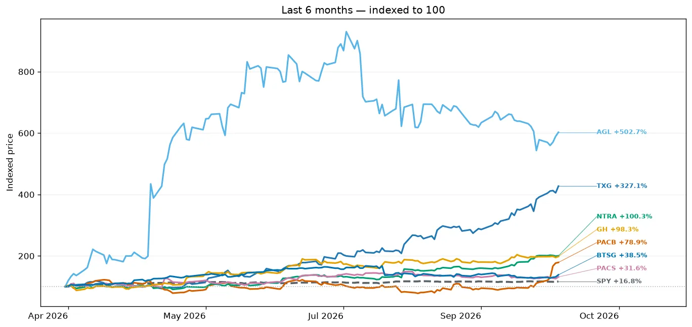

### Last 12 months

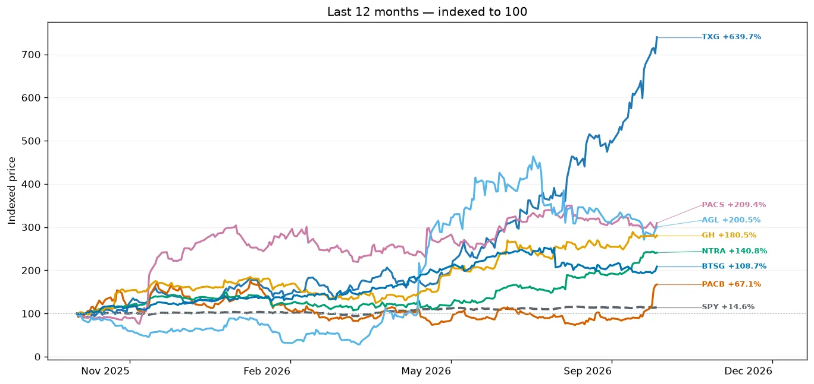

### Last 24 months

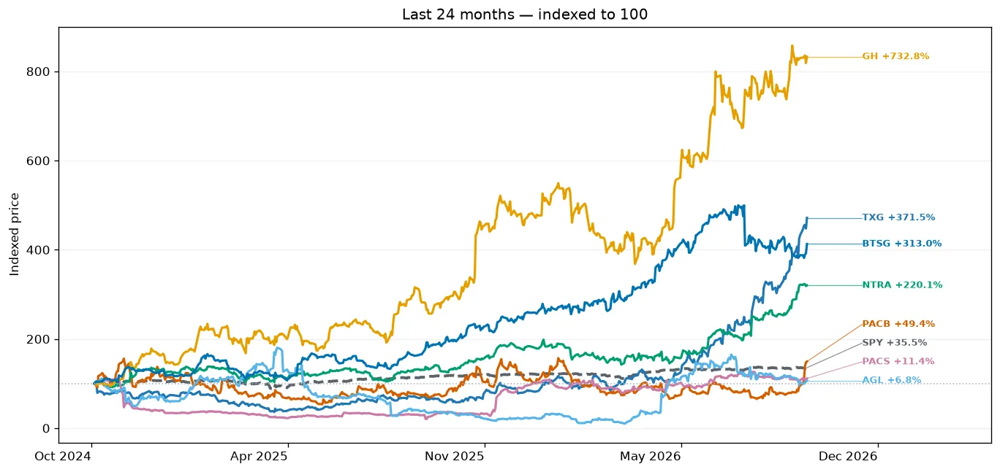

## Current Top Stocks

### Last 3 months

<table class="sortable"><thead><tr><th class="sortable-heading" data-column="0" data-type="number">Rank</th><th class="sortable-heading" data-column="1" data-type="text">Company</th><th class="sortable-heading" data-column="2" data-type="text">Ticker</th><th class="sortable-heading" data-column="3" data-type="number">Market cap</th><th class="sortable-heading" data-column="4" data-type="number">Return</th></tr></thead><tbody><tr><td class="" data-sort="1" style="">1</td><td class="text" data-sort="10x genomics" style="">10x Genomics</td><td class="text text" data-sort="txg" style=""><a href="#company-txg">TXG</a></td><td class="" data-sort="6076123205.54" style="">$6.1B</td><td class="" data-sort="1.3968213278646502" style="background:#1a7a3c;color:#ffffff;">+139.7%</td></tr><tr><td class="" data-sort="2" style="">2</td><td class="text" data-sort="pacbio" style="">PacBio</td><td class="text text" data-sort="pacb" style=""><a href="#company-pacb">PACB</a></td><td class="" data-sort="447266430.71999997" style="">$447.3M</td><td class="" data-sort="0.5119047619047621" style="background:#a9d9a4;color:#111820;">+51.2%</td></tr><tr><td class="" data-sort="3" style="">3</td><td class="text" data-sort="natera" style="">Natera</td><td class="text text" data-sort="ntra" style=""><a href="#company-ntra">NTRA</a></td><td class="" data-sort="39411440972.58" style="">$39.4B</td><td class="" data-sort="0.4691035371616785" style="background:#a9d9a4;color:#111820;">+46.9%</td></tr><tr><td class="" data-sort="4" style="">4</td><td class="text" data-sort="illumina" style="">Illumina</td><td class="text text" data-sort="ilmn" style=""><a href="#company-ilmn">ILMN</a></td><td class="" data-sort="30654510000.0" style="">$30.7B</td><td class="" data-sort="0.44710621157515384" style="background:#a9d9a4;color:#111820;">+44.7%</td></tr><tr><td class="" data-sort="5" style="">5</td><td class="text" data-sort="veeva systems" style="">Veeva Systems</td><td class="text text" data-sort="veev" style=""><a href="#company-veev">VEEV</a></td><td class="" data-sort="33102693839.98" style="">$33.1B</td><td class="" data-sort="0.4181280481477636" style="background:#a9d9a4;color:#111820;">+41.8%</td></tr></tbody></table>

### Last 12 months

<table class="sortable"><thead><tr><th class="sortable-heading" data-column="0" data-type="number">Rank</th><th class="sortable-heading" data-column="1" data-type="text">Company</th><th class="sortable-heading" data-column="2" data-type="text">Ticker</th><th class="sortable-heading" data-column="3" data-type="number">Market cap</th><th class="sortable-heading" data-column="4" data-type="number">Return</th></tr></thead><tbody><tr><td class="" data-sort="1" style="">1</td><td class="text" data-sort="10x genomics" style="">10x Genomics</td><td class="text text" data-sort="txg" style=""><a href="#company-txg">TXG</a></td><td class="" data-sort="6076123205.54" style="">$6.1B</td><td class="" data-sort="6.333333333333333" style="background:#1a7a3c;color:#ffffff;">+633.3%</td></tr><tr><td class="" data-sort="2" style="">2</td><td class="text" data-sort="pacs group" style="">PACS Group</td><td class="text text" data-sort="pacs" style=""><a href="#company-pacs">PACS</a></td><td class="" data-sort="7282112019.759999" style="">$7.3B</td><td class="" data-sort="2.130021913805698" style="background:#a9d9a4;color:#111820;">+213.0%</td></tr><tr><td class="" data-sort="3" style="">3</td><td class="text" data-sort="agilon health" style="">Agilon Health</td><td class="text text" data-sort="agl" style=""><a href="#company-agl">AGL</a></td><td class="" data-sort="2073627800.0" style="">$2.1B</td><td class="" data-sort="1.9784070796460176" style="background:#a9d9a4;color:#111820;">+197.8%</td></tr><tr><td class="" data-sort="4" style="">4</td><td class="text" data-sort="guardant health" style="">Guardant Health</td><td class="text text" data-sort="gh" style=""><a href="#company-gh">GH</a></td><td class="" data-sort="21443206004.3" style="">$21.4B</td><td class="" data-sort="1.8294080203691916" style="background:#a9d9a4;color:#111820;">+182.9%</td></tr><tr><td class="" data-sort="5" style="">5</td><td class="text" data-sort="illumina" style="">Illumina</td><td class="text text" data-sort="ilmn" style=""><a href="#company-ilmn">ILMN</a></td><td class="" data-sort="30654510000.0" style="">$30.7B</td><td class="" data-sort="1.6737171954563261" style="background:#a9d9a4;color:#111820;">+167.4%</td></tr></tbody></table>

### Last 24 months

<table class="sortable"><thead><tr><th class="sortable-heading" data-column="0" data-type="number">Rank</th><th class="sortable-heading" data-column="1" data-type="text">Company</th><th class="sortable-heading" data-column="2" data-type="text">Ticker</th><th class="sortable-heading" data-column="3" data-type="number">Market cap</th><th class="sortable-heading" data-column="4" data-type="number">Return</th></tr></thead><tbody><tr><td class="" data-sort="1" style="">1</td><td class="text" data-sort="guardant health" style="">Guardant Health</td><td class="text text" data-sort="gh" style=""><a href="#company-gh">GH</a></td><td class="" data-sort="21443206004.3" style="">$21.4B</td><td class="" data-sort="7.0234657039711195" style="background:#1a7a3c;color:#ffffff;">+702.3%</td></tr><tr><td class="" data-sort="2" style="">2</td><td class="text" data-sort="10x genomics" style="">10x Genomics</td><td class="text text" data-sort="txg" style=""><a href="#company-txg">TXG</a></td><td class="" data-sort="6076123205.54" style="">$6.1B</td><td class="" data-sort="3.6703296703296706" style="background:#7cc077;color:#111820;">+367.0%</td></tr><tr><td class="" data-sort="3" style="">3</td><td class="text" data-sort="brightspring health services" style="">BrightSpring Health Services</td><td class="text text" data-sort="btsg" style=""><a href="#company-btsg">BTSG</a></td><td class="" data-sort="12419938407.57" style="">$12.4B</td><td class="" data-sort="3.0819783197831976" style="background:#7cc077;color:#111820;">+308.2%</td></tr><tr><td class="" data-sort="4" style="">4</td><td class="text" data-sort="natera" style="">Natera</td><td class="text text" data-sort="ntra" style=""><a href="#company-ntra">NTRA</a></td><td class="" data-sort="39411440972.58" style="">$39.4B</td><td class="" data-sort="2.1604282193468887" style="background:#a9d9a4;color:#111820;">+216.0%</td></tr><tr><td class="" data-sort="5" style="">5</td><td class="text" data-sort="aveanna healthcare" style="">Aveanna Healthcare</td><td class="text text" data-sort="avah" style=""><a href="#company-avah">AVAH</a></td><td class="" data-sort="2038188700.08" style="">$2.0B</td><td class="" data-sort="1.77924944812362" style="background:#a9d9a4;color:#111820;">+177.9%</td></tr></tbody></table>

## Companies by Subcategory

<h3 id="category-payers"><a href="#subcategory-performance">Payers</a>Last 3m: -11.6%</h3>

<table class="sortable"><thead><tr><th class="sortable-heading" data-column="0" data-type="text">Company</th><th class="sortable-heading" data-column="1" data-type="text">Ticker</th><th class="sortable-heading" data-column="2" data-type="number">Market cap</th><th class="sortable-heading" data-column="3" data-type="number">3m Return</th><th class="sortable-heading" data-column="4" data-type="number">12m Return</th><th class="sortable-heading" data-column="5" data-type="number">24m Return</th></tr></thead><tbody><tr><td class="text" data-sort="unitedhealth" style="">UnitedHealth</td><td class="text text" data-sort="unh" style=""><a href="#company-unh">UNH</a></td><td class="" data-sort="380076600000.0" style="">$380.1B</td><td class="" data-sort="-0.12568177543727677" style="background:#fbd5d4;color:#111820;">-12.6%</td><td class="" data-sort="0.032481954469739005" style="background:#d6ecd4;color:#111820;">+3.2%</td><td class="" data-sort="-0.37094046008119086" style="background:#e34948;color:#111820;">-37.1%</td></tr><tr><td class="text" data-sort="cvs health" style="">CVS Health</td><td class="text text" data-sort="cvs" style=""><a href="#company-cvs">CVS</a></td><td class="" data-sort="135133460000.0" style="">$135.1B</td><td class="" data-sort="-0.1743697478991597" style="background:#f5aead;color:#111820;">-17.4%</td><td class="" data-sort="0.11575687185443284" style="background:#d6ecd4;color:#111820;">+11.6%</td><td class="" data-sort="0.3385973060845331" style="background:#7cc077;color:#111820;">+33.9%</td></tr><tr><td class="text" data-sort="humana" style="">Humana</td><td class="text text" data-sort="hum" style=""><a href="#company-hum">HUM</a></td><td class="" data-sort="43692420868.880005" style="">$43.7B</td><td class="" data-sort="-0.021146817895400072" style="background:#fbd5d4;color:#111820;">-2.1%</td><td class="" data-sort="0.3688143239813899" style="background:#7cc077;color:#111820;">+36.9%</td><td class="" data-sort="0.6179644211140274" style="background:#1a7a3c;color:#ffffff;">+61.8%</td></tr><tr><td class="text" data-sort="oscar health" style="">Oscar Health</td><td class="text text" data-sort="oscr" style=""><a href="#company-oscr">OSCR</a></td><td class="" data-sort="9412611460.0" style="">$9.4B</td><td class="" data-sort="-0.03853325046612799" style="background:#fbd5d4;color:#111820;">-3.9%</td><td class="" data-sort="0.42843951985226236" style="background:#2f9e44;color:#111820;">+42.8%</td><td class="" data-sort="0.5362462760675273" style="background:#1a7a3c;color:#ffffff;">+53.6%</td></tr><tr><td class="text" data-sort="molina healthcare" style="">Molina Healthcare</td><td class="text text" data-sort="moh" style=""><a href="#company-moh">MOH</a></td><td class="" data-sort="10211364000.0" style="">$10.2B</td><td class="" data-sort="-0.17544699177796153" style="background:#f5aead;color:#111820;">-17.5%</td><td class="" data-sort="-0.06154379363271778" style="background:#fbd5d4;color:#111820;">-6.2%</td><td class="" data-sort="-0.42680013306317477" style="background:#e34948;color:#111820;">-42.7%</td></tr><tr><td class="text" data-sort="cigna" style="">Cigna</td><td class="text text" data-sort="ci" style=""><a href="#company-ci">CI</a></td><td class="" data-sort="73736307618.3" style="">$73.7B</td><td class="" data-sort="-0.059908955068283753" style="background:#fbd5d4;color:#111820;">-6.0%</td><td class="" data-sort="-0.13012861736334413" style="background:#fbd5d4;color:#111820;">-13.0%</td><td class="" data-sort="-0.20828211881767633" style="background:#f5aead;color:#111820;">-20.8%</td></tr><tr><td class="text" data-sort="elevance" style="">Elevance</td><td class="text text" data-sort="elv" style=""><a href="#company-elv">ELV</a></td><td class="" data-sort="81508153953.59999" style="">$81.5B</td><td class="" data-sort="-0.07528296920242161" style="background:#fbd5d4;color:#111820;">-7.5%</td><td class="" data-sort="0.10251069900142662" style="background:#d6ecd4;color:#111820;">+10.3%</td><td class="" data-sort="-0.21468490255451456" style="background:#f5aead;color:#111820;">-21.5%</td></tr><tr><td class="text" data-sort="clover health" style="">Clover Health</td><td class="text text" data-sort="clov" style=""><a href="#company-clov">CLOV</a></td><td class="" data-sort="2196273631.08" style="">$2.2B</td><td class="" data-sort="-0.16730038022813687" style="background:#f5aead;color:#111820;">-16.7%</td><td class="" data-sort="0.6911196911196911" style="background:#1a7a3c;color:#ffffff;">+69.1%</td><td class="" data-sort="0.08415841584158423" style="background:#d6ecd4;color:#111820;">+8.4%</td></tr><tr><td class="text" data-sort="centene" style="">Centene</td><td class="text text" data-sort="cnc" style=""><a href="#company-cnc">CNC</a></td><td class="" data-sort="30736368900.0" style="">$30.7B</td><td class="" data-sort="-0.0717653993516062" style="background:#fbd5d4;color:#111820;">-7.2%</td><td class="" data-sort="0.6276485788113695" style="background:#1a7a3c;color:#ffffff;">+62.8%</td><td class="" data-sort="-0.12610987791342942" style="background:#f5aead;color:#111820;">-12.6%</td></tr><tr><td class="text" data-sort="alignment health" style="">Alignment Health</td><td class="text text" data-sort="alhc" style=""><a href="#company-alhc">ALHC</a></td><td class="" data-sort="3080411962.65" style="">$3.1B</td><td class="" data-sort="-0.6663865546218488" style="background:#c0302f;color:#ffffff;">-66.6%</td><td class="" data-sort="-0.5222623345367028" style="background:#e34948;color:#111820;">-52.2%</td><td class="" data-sort="-0.2728937728937728" style="background:#ee8483;color:#111820;">-27.3%</td></tr></tbody></table>

<h3 id="category-health-system-providers"><a href="#subcategory-performance">Health System Providers</a>Last 3m: +8.3%</h3>

<table class="sortable"><thead><tr><th class="sortable-heading" data-column="0" data-type="text">Company</th><th class="sortable-heading" data-column="1" data-type="text">Ticker</th><th class="sortable-heading" data-column="2" data-type="number">Market cap</th><th class="sortable-heading" data-column="3" data-type="number">3m Return</th><th class="sortable-heading" data-column="4" data-type="number">12m Return</th><th class="sortable-heading" data-column="5" data-type="number">24m Return</th></tr></thead><tbody><tr><td class="text" data-sort="hca healthcare" style="">HCA Healthcare</td><td class="text text" data-sort="hca" style=""><a href="#company-hca">HCA</a></td><td class="" data-sort="87161338885.0" style="">$87.2B</td><td class="" data-sort="0.03943970767356886" style="background:#d6ecd4;color:#111820;">+3.9%</td><td class="" data-sort="-0.006635004888950968" style="background:#fbd5d4;color:#111820;">-0.7%</td><td class="" data-sort="0.08277717156850306" style="background:#d6ecd4;color:#111820;">+8.3%</td></tr><tr><td class="text" data-sort="tenet health" style="">Tenet Health</td><td class="text text" data-sort="thc" style=""><a href="#company-thc">THC</a></td><td class="" data-sort="20514630820.0" style="">$20.5B</td><td class="" data-sort="0.2694875319065384" style="background:#1a7a3c;color:#ffffff;">+26.9%</td><td class="" data-sort="0.27399014778325115" style="background:#1a7a3c;color:#ffffff;">+27.4%</td><td class="" data-sort="0.6517851440250368" style="background:#1a7a3c;color:#ffffff;">+65.2%</td></tr><tr><td class="text" data-sort="universal health services" style="">Universal Health Services</td><td class="text text" data-sort="uhs" style=""><a href="#company-uhs">UHS</a></td><td class="" data-sort="10196742962.44" style="">$10.2B</td><td class="" data-sort="0.10983389123981557" style="background:#a9d9a4;color:#111820;">+11.0%</td><td class="" data-sort="-0.1520941903107509" style="background:#ee8483;color:#111820;">-15.2%</td><td class="" data-sort="-0.18527448071216623" style="background:#f5aead;color:#111820;">-18.5%</td></tr><tr><td class="text" data-sort="community health systems" style="">Community Health Systems</td><td class="text text" data-sort="cyh" style=""><a href="#company-cyh">CYH</a></td><td class="" data-sort="417387696.71999997" style="">$417.4M</td><td class="" data-sort="-0.3025641025641025" style="background:#c0302f;color:#ffffff;">-30.3%</td><td class="" data-sort="-0.1282051282051282" style="background:#ee8483;color:#111820;">-12.8%</td><td class="" data-sort="-0.5177304964539007" style="background:#e34948;color:#111820;">-51.8%</td></tr><tr><td class="text" data-sort="ardent health partners" style="">Ardent Health Partners</td><td class="text text" data-sort="ardt" style=""><a href="#company-ardt">ARDT</a></td><td class="" data-sort="1541012833.25" style="">$1.5B</td><td class="" data-sort="-0.03903345724907059" style="background:#fbd5d4;color:#111820;">-3.9%</td><td class="" data-sort="-0.2624821683309557" style="background:#c0302f;color:#ffffff;">-26.2%</td><td class="" data-sort="-0.42523624235686486" style="background:#e34948;color:#111820;">-42.5%</td></tr></tbody></table>

<h3 id="category-inpatient-non-acute-providers"><a href="#subcategory-performance">Inpatient Non-Acute Providers</a>Last 3m: +3.2%</h3>

<table class="sortable"><thead><tr><th class="sortable-heading" data-column="0" data-type="text">Company</th><th class="sortable-heading" data-column="1" data-type="text">Ticker</th><th class="sortable-heading" data-column="2" data-type="number">Market cap</th><th class="sortable-heading" data-column="3" data-type="number">3m Return</th><th class="sortable-heading" data-column="4" data-type="number">12m Return</th><th class="sortable-heading" data-column="5" data-type="number">24m Return</th></tr></thead><tbody><tr><td class="text" data-sort="the ensign group" style="">The Ensign Group</td><td class="text text" data-sort="ensg" style=""><a href="#company-ensg">ENSG</a></td><td class="" data-sort="10383598441.44" style="">$10.4B</td><td class="" data-sort="0.021162763048389044" style="background:#d6ecd4;color:#111820;">+2.1%</td><td class="" data-sort="-0.020638540478905343" style="background:#fbd5d4;color:#111820;">-2.1%</td><td class="" data-sort="0.19076667128795233" style="background:#a9d9a4;color:#111820;">+19.1%</td></tr><tr><td class="text" data-sort="acadia healthcare" style="">Acadia Healthcare</td><td class="text text" data-sort="achc" style=""><a href="#company-achc">ACHC</a></td><td class="" data-sort="2757630145.5" style="">$2.8B</td><td class="" data-sort="-0.12065183328110318" style="background:#c0302f;color:#ffffff;">-12.1%</td><td class="" data-sort="0.03389830508474567" style="background:#d6ecd4;color:#111820;">+3.4%</td><td class="" data-sort="-0.4971326164874552" style="background:#c0302f;color:#ffffff;">-49.7%</td></tr><tr><td class="text" data-sort="encompass health" style="">Encompass Health</td><td class="text text" data-sort="ehc" style=""><a href="#company-ehc">EHC</a></td><td class="" data-sort="11018041815.599998" style="">$11.0B</td><td class="" data-sort="0.12530527897802002" style="background:#1a7a3c;color:#ffffff;">+12.5%</td><td class="" data-sort="-0.02783413129919665" style="background:#fbd5d4;color:#111820;">-2.8%</td><td class="" data-sort="0.2677248677248676" style="background:#7cc077;color:#111820;">+26.8%</td></tr><tr><td class="text" data-sort="pacs group" style="">PACS Group</td><td class="text text" data-sort="pacs" style=""><a href="#company-pacs">PACS</a></td><td class="" data-sort="7282112019.759999" style="">$7.3B</td><td class="" data-sort="-0.036645683453237266" style="background:#f5aead;color:#111820;">-3.7%</td><td class="" data-sort="2.130021913805698" style="background:#1a7a3c;color:#ffffff;">+213.0%</td><td class="" data-sort="0.11298701298701297" style="background:#a9d9a4;color:#111820;">+11.3%</td></tr></tbody></table>

<h3 id="category-health-care-real-estate"><a href="#subcategory-performance">Health Care Real Estate</a>Last 3m: -6.0%</h3>

<table class="sortable"><thead><tr><th class="sortable-heading" data-column="0" data-type="text">Company</th><th class="sortable-heading" data-column="1" data-type="text">Ticker</th><th class="sortable-heading" data-column="2" data-type="number">Market cap</th><th class="sortable-heading" data-column="3" data-type="number">3m Return</th><th class="sortable-heading" data-column="4" data-type="number">12m Return</th><th class="sortable-heading" data-column="5" data-type="number">24m Return</th></tr></thead><tbody><tr><td class="text" data-sort="healthpeak properties" style="">Healthpeak properties</td><td class="text text" data-sort="doc" style=""><a href="#company-doc">DOC</a></td><td class="" data-sort="15050032094.659998" style="">$15.1B</td><td class="" data-sort="-0.10963910461397908" style="background:#f5aead;color:#111820;">-11.0%</td><td class="" data-sort="0.006195147134744339" style="background:#d6ecd4;color:#111820;">+0.6%</td><td class="" data-sort="-0.11889692585895129" style="background:#fbd5d4;color:#111820;">-11.9%</td></tr><tr><td class="text" data-sort="ventas, inc" style="">Ventas, Inc</td><td class="text text" data-sort="vtr" style=""><a href="#company-vtr">VTR</a></td><td class="" data-sort="47965614030.090004" style="">$48.0B</td><td class="" data-sort="-0.09198011240812787" style="background:#f5aead;color:#111820;">-9.2%</td><td class="" data-sort="0.20427178899082565" style="background:#2f9e44;color:#111820;">+20.4%</td><td class="" data-sort="0.343515112745882" style="background:#7cc077;color:#111820;">+34.4%</td></tr><tr><td class="text" data-sort="medical properties trust" style="">Medical Properties Trust</td><td class="text text" data-sort="mpt" style=""><a href="#company-mpt">MPT</a></td><td class="" data-sort="2769203000.0" style="">$2.8B</td><td class="" data-sort="-0.2875816993464052" style="background:#c0302f;color:#ffffff;">-28.8%</td><td class="missing" data-sort="—" style="background:#f0efec;color:#111820;">—</td><td class="missing" data-sort="—" style="background:#f0efec;color:#111820;">—</td></tr><tr><td class="text" data-sort="national health investors" style="">National Health Investors</td><td class="text text" data-sort="nhi" style=""><a href="#company-nhi">NHI</a></td><td class="" data-sort="3715308205.3500004" style="">$3.7B</td><td class="" data-sort="-0.15189056652471278" style="background:#ee8483;color:#111820;">-15.2%</td><td class="" data-sort="-0.16269588482609243" style="background:#ee8483;color:#111820;">-16.3%</td><td class="" data-sort="-0.19203343988197696" style="background:#f5aead;color:#111820;">-19.2%</td></tr><tr><td class="text" data-sort="omega healthcare investors" style="">Omega Healthcare Investors</td><td class="text text" data-sort="ohi" style=""><a href="#company-ohi">OHI</a></td><td class="" data-sort="15143989930.0" style="">$15.1B</td><td class="" data-sort="-0.07449392712550607" style="background:#f5aead;color:#111820;">-7.4%</td><td class="" data-sort="0.11105710814094771" style="background:#a9d9a4;color:#111820;">+11.1%</td><td class="" data-sort="0.16188055908513332" style="background:#d6ecd4;color:#111820;">+16.2%</td></tr><tr><td class="text" data-sort="welltower" style="">Welltower</td><td class="text text" data-sort="well" style=""><a href="#company-well">WELL</a></td><td class="" data-sort="166862860587.27" style="">$166.9B</td><td class="" data-sort="-0.035372362958569825" style="background:#fbd5d4;color:#111820;">-3.5%</td><td class="" data-sort="0.3009026508226693" style="background:#1a7a3c;color:#ffffff;">+30.1%</td><td class="" data-sort="0.8135552723797388" style="background:#1a7a3c;color:#ffffff;">+81.4%</td></tr><tr><td class="text" data-sort="caretrust reit" style="">CareTrust REIT</td><td class="text text" data-sort="ctre" style=""><a href="#company-ctre">CTRE</a></td><td class="" data-sort="9648051197.400002" style="">$9.6B</td><td class="" data-sort="-0.13074712643678166" style="background:#ee8483;color:#111820;">-13.1%</td><td class="" data-sort="0.022823330515638007" style="background:#d6ecd4;color:#111820;">+2.3%</td><td class="" data-sort="0.19525847876193603" style="background:#a9d9a4;color:#111820;">+19.5%</td></tr><tr><td class="text" data-sort="sabra health care reit" style="">Sabra Health Care REIT</td><td class="text text" data-sort="sbra" style=""><a href="#company-sbra">SBRA</a></td><td class="" data-sort="5277860538.96" style="">$5.3B</td><td class="" data-sort="-0.04960317460317465" style="background:#fbd5d4;color:#111820;">-5.0%</td><td class="" data-sort="0.05622932745314224" style="background:#d6ecd4;color:#111820;">+5.6%</td><td class="" data-sort="0.06622148024485264" style="background:#d6ecd4;color:#111820;">+6.6%</td></tr></tbody></table>

<h3 id="category-value-based-care"><a href="#subcategory-performance">Value-Based Care</a>Last 3m: -26.4%</h3>

<table class="sortable"><thead><tr><th class="sortable-heading" data-column="0" data-type="text">Company</th><th class="sortable-heading" data-column="1" data-type="text">Ticker</th><th class="sortable-heading" data-column="2" data-type="number">Market cap</th><th class="sortable-heading" data-column="3" data-type="number">3m Return</th><th class="sortable-heading" data-column="4" data-type="number">12m Return</th><th class="sortable-heading" data-column="5" data-type="number">24m Return</th></tr></thead><tbody><tr><td class="text" data-sort="privia health group" style="">Privia Health Group</td><td class="text text" data-sort="prva" style=""><a href="#company-prva">PRVA</a></td><td class="" data-sort="2982712892.5800004" style="">$3.0B</td><td class="" data-sort="-0.2580409356725146" style="background:#ee8483;color:#111820;">-25.8%</td><td class="" data-sort="-0.15732669157326684" style="background:#fbd5d4;color:#111820;">-15.7%</td><td class="" data-sort="0.1540648095508812" style="background:#d6ecd4;color:#111820;">+15.4%</td></tr><tr><td class="text" data-sort="astrana health" style="">Astrana Health</td><td class="text text" data-sort="asth" style=""><a href="#company-asth">ASTH</a></td><td class="" data-sort="1763186344.0800002" style="">$1.8B</td><td class="" data-sort="-0.27028676021964615" style="background:#e34948;color:#111820;">-27.0%</td><td class="" data-sort="0.248" style="background:#d6ecd4;color:#111820;">+24.8%</td><td class="" data-sort="-0.400901653030556" style="background:#ee8483;color:#111820;">-40.1%</td></tr><tr><td class="text" data-sort="agilon health" style="">Agilon Health</td><td class="text text" data-sort="agl" style=""><a href="#company-agl">AGL</a></td><td class="" data-sort="2073627800.0" style="">$2.1B</td><td class="" data-sort="-0.2420502657418251" style="background:#ee8483;color:#111820;">-24.2%</td><td class="" data-sort="1.9784070796460176" style="background:#1a7a3c;color:#ffffff;">+197.8%</td><td class="" data-sort="0.04847352024922125" style="background:#d6ecd4;color:#111820;">+4.8%</td></tr><tr><td class="text" data-sort="evolent health" style="">Evolent Health</td><td class="text text" data-sort="evh" style=""><a href="#company-evh">EVH</a></td><td class="" data-sort="347566497.03" style="">$347.6M</td><td class="" data-sort="-0.39404553415061294" style="background:#c0302f;color:#ffffff;">-39.4%</td><td class="" data-sort="-0.5795868772782503" style="background:#f5aead;color:#111820;">-58.0%</td><td class="" data-sort="-0.8686408504176157" style="background:#c0302f;color:#ffffff;">-86.9%</td></tr><tr><td class="text" data-sort="p3 health" style="">P3 Health</td><td class="text text" data-sort="piii" style=""><a href="#company-piii">PIII</a></td><td class="" data-sort="32693184.14" style="">$32.7M</td><td class="" data-sort="-0.44063324538258564" style="background:#c0302f;color:#ffffff;">-44.1%</td><td class="" data-sort="-0.2647398843930636" style="background:#fbd5d4;color:#111820;">-26.5%</td><td class="" data-sort="-0.6634920634920635" style="background:#e34948;color:#111820;">-66.3%</td></tr></tbody></table>

<h3 id="category-outpatient-and-home-providers"><a href="#subcategory-performance">Outpatient and Home Providers</a>Last 3m: -7.4%</h3>

<table class="sortable"><thead><tr><th class="sortable-heading" data-column="0" data-type="text">Company</th><th class="sortable-heading" data-column="1" data-type="text">Ticker</th><th class="sortable-heading" data-column="2" data-type="number">Market cap</th><th class="sortable-heading" data-column="3" data-type="number">3m Return</th><th class="sortable-heading" data-column="4" data-type="number">12m Return</th><th class="sortable-heading" data-column="5" data-type="number">24m Return</th></tr></thead><tbody><tr><td class="text" data-sort="davita" style="">Davita</td><td class="text text" data-sort="dva" style=""><a href="#company-dva">DVA</a></td><td class="" data-sort="15410176650.0" style="">$15.4B</td><td class="" data-sort="-0.23932569920395041" style="background:#e34948;color:#111820;">-23.9%</td><td class="" data-sort="0.362381823726746" style="background:#a9d9a4;color:#111820;">+36.2%</td><td class="" data-sort="0.11201692700230259" style="background:#d6ecd4;color:#111820;">+11.2%</td></tr><tr><td class="text" data-sort="fresenius" style="">Fresenius</td><td class="text text" data-sort="fms" style=""><a href="#company-fms">FMS</a></td><td class="" data-sort="13782736811.6" style="">$13.8B</td><td class="" data-sort="-0.05439864003399919" style="background:#fbd5d4;color:#111820;">-5.4%</td><td class="" data-sort="-0.16822429906542058" style="background:#fbd5d4;color:#111820;">-16.8%</td><td class="" data-sort="0.07487922705314021" style="background:#d6ecd4;color:#111820;">+7.5%</td></tr><tr><td class="text" data-sort="surgery partners" style="">Surgery Partners</td><td class="text text" data-sort="sgry" style=""><a href="#company-sgry">SGRY</a></td><td class="" data-sort="2014137694.8" style="">$2.0B</td><td class="" data-sort="-0.2269297736506094" style="background:#ee8483;color:#111820;">-22.7%</td><td class="" data-sort="-0.3702127659574468" style="background:#f5aead;color:#111820;">-37.0%</td><td class="" data-sort="-0.5725288831835686" style="background:#fbd5d4;color:#111820;">-57.3%</td></tr><tr><td class="text" data-sort="option care health" style="">Option Care Health</td><td class="text text" data-sort="opch" style=""><a href="#company-opch">OPCH</a></td><td class="" data-sort="3449554146.29" style="">$3.4B</td><td class="" data-sort="0.033789954337899664" style="background:#d6ecd4;color:#111820;">+3.4%</td><td class="" data-sort="-0.17672727272727273" style="background:#fbd5d4;color:#111820;">-17.7%</td><td class="" data-sort="-0.2233276157804459" style="background:#fbd5d4;color:#111820;">-22.3%</td></tr><tr><td class="text" data-sort="lifestance health" style="">Lifestance Health</td><td class="text text" data-sort="lfst" style=""><a href="#company-lfst">LFST</a></td><td class="" data-sort="4001624847.36" style="">$4.0B</td><td class="" data-sort="0.049689440993788914" style="background:#d6ecd4;color:#111820;">+5.0%</td><td class="" data-sort="1.1470054446460982" style="background:#1a7a3c;color:#ffffff;">+114.7%</td><td class="" data-sort="0.7120115774240232" style="background:#a9d9a4;color:#111820;">+71.2%</td></tr><tr><td class="text" data-sort="chemed (vitas)" style="">Chemed (Vitas)</td><td class="text text" data-sort="che" style=""><a href="#company-che">CHE</a></td><td class="" data-sort="7054119350.92" style="">$7.1B</td><td class="" data-sort="0.03643344361393619" style="background:#d6ecd4;color:#111820;">+3.6%</td><td class="" data-sort="0.1443324539448465" style="background:#d6ecd4;color:#111820;">+14.4%</td><td class="" data-sort="-0.12733212965351215" style="background:#fbd5d4;color:#111820;">-12.7%</td></tr><tr><td class="text" data-sort="addus homecare" style="">Addus HomeCare</td><td class="text text" data-sort="adus" style=""><a href="#company-adus">ADUS</a></td><td class="" data-sort="2121438440.1599998" style="">$2.1B</td><td class="" data-sort="0.058001331178092475" style="background:#d6ecd4;color:#111820;">+5.8%</td><td class="" data-sort="-0.03125544140693015" style="background:#fbd5d4;color:#111820;">-3.1%</td><td class="" data-sort="-0.11907212413902313" style="background:#fbd5d4;color:#111820;">-11.9%</td></tr><tr><td class="text" data-sort="pennant group" style="">Pennant Group</td><td class="text text" data-sort="pntg" style=""><a href="#company-pntg">PNTG</a></td><td class="" data-sort="1342375375.77" style="">$1.3B</td><td class="" data-sort="0.01869158878504673" style="background:#d6ecd4;color:#111820;">+1.9%</td><td class="" data-sort="0.5174013921113689" style="background:#7cc077;color:#111820;">+51.7%</td><td class="" data-sort="0.1890909090909092" style="background:#d6ecd4;color:#111820;">+18.9%</td></tr><tr><td class="text" data-sort="us physical therapy" style="">US Physical Therapy</td><td class="text text" data-sort="usph" style=""><a href="#company-usph">USPH</a></td><td class="" data-sort="1154497333.54" style="">$1.2B</td><td class="" data-sort="0.15715272978576378" style="background:#7cc077;color:#111820;">+15.7%</td><td class="" data-sort="-0.058691252529795346" style="background:#fbd5d4;color:#111820;">-5.9%</td><td class="" data-sort="0.032942628007402774" style="background:#d6ecd4;color:#111820;">+3.3%</td></tr><tr><td class="text" data-sort="brightspring health services" style="">BrightSpring Health Services</td><td class="text text" data-sort="btsg" style=""><a href="#company-btsg">BTSG</a></td><td class="" data-sort="12419938407.57" style="">$12.4B</td><td class="" data-sort="-0.1271910763436187" style="background:#f5aead;color:#111820;">-12.7%</td><td class="" data-sort="1.1244710860366713" style="background:#1a7a3c;color:#ffffff;">+112.4%</td><td class="" data-sort="3.0819783197831976" style="background:#1a7a3c;color:#ffffff;">+308.2%</td></tr><tr><td class="text" data-sort="aveanna healthcare" style="">Aveanna Healthcare</td><td class="text text" data-sort="avah" style=""><a href="#company-avah">AVAH</a></td><td class="" data-sort="2038188700.08" style="">$2.0B</td><td class="" data-sort="0.3835164835164835" style="background:#1a7a3c;color:#ffffff;">+38.4%</td><td class="" data-sort="0.4588644264194668" style="background:#7cc077;color:#111820;">+45.9%</td><td class="" data-sort="1.77924944812362" style="background:#7cc077;color:#111820;">+177.9%</td></tr></tbody></table>

<h3 id="category-digital-health-specialty-benefits"><a href="#subcategory-performance">Digital Health, Specialty, Benefits</a>Last 3m: -9.1%</h3>

<table class="sortable"><thead><tr><th class="sortable-heading" data-column="0" data-type="text">Company</th><th class="sortable-heading" data-column="1" data-type="text">Ticker</th><th class="sortable-heading" data-column="2" data-type="number">Market cap</th><th class="sortable-heading" data-column="3" data-type="number">3m Return</th><th class="sortable-heading" data-column="4" data-type="number">12m Return</th><th class="sortable-heading" data-column="5" data-type="number">24m Return</th></tr></thead><tbody><tr><td class="text" data-sort="teladoc" style="">Teladoc</td><td class="text text" data-sort="tdoc" style=""><a href="#company-tdoc">TDOC</a></td><td class="" data-sort="1219099780.91" style="">$1.2B</td><td class="" data-sort="-0.4" style="background:#c0302f;color:#ffffff;">-40.0%</td><td class="" data-sort="-0.38734739178690347" style="background:#ee8483;color:#111820;">-38.7%</td><td class="" data-sort="-0.38938053097345127" style="background:#ee8483;color:#111820;">-38.9%</td></tr><tr><td class="text" data-sort="amwell" style="">Amwell</td><td class="text text" data-sort="amwl" style=""><a href="#company-amwl">AMWL</a></td><td class="" data-sort="179616192.25" style="">$179.6M</td><td class="" data-sort="0.33945945945945954" style="background:#2f9e44;color:#111820;">+33.9%</td><td class="" data-sort="0.9573459715639812" style="background:#1a7a3c;color:#ffffff;">+95.7%</td><td class="" data-sort="0.3237179487179489" style="background:#7cc077;color:#111820;">+32.4%</td></tr><tr><td class="text" data-sort="hims &amp; hers" style="">Hims &amp; Hers</td><td class="text text" data-sort="hims" style=""><a href="#company-hims">HIMS</a></td><td class="" data-sort="6427580190.15" style="">$6.4B</td><td class="" data-sort="-0.21195652173913038" style="background:#ee8483;color:#111820;">-21.2%</td><td class="" data-sort="-0.44803958888465933" style="background:#ee8483;color:#111820;">-44.8%</td><td class="" data-sort="0.6421291053227633" style="background:#1a7a3c;color:#ffffff;">+64.2%</td></tr><tr><td class="text" data-sort="lifemd" style="">LifeMD</td><td class="text text" data-sort="lfmd" style=""><a href="#company-lfmd">LFMD</a></td><td class="" data-sort="169268785.0" style="">$169.3M</td><td class="" data-sort="-0.43737166324435317" style="background:#c0302f;color:#ffffff;">-43.7%</td><td class="" data-sort="-0.6068866571018651" style="background:#e34948;color:#111820;">-60.7%</td><td class="" data-sort="-0.432712215320911" style="background:#e34948;color:#111820;">-43.3%</td></tr><tr><td class="text" data-sort="omada health" style="">Omada Health</td><td class="text text" data-sort="omda" style=""><a href="#company-omda">OMDA</a></td><td class="" data-sort="1179458378.8799999" style="">$1.2B</td><td class="" data-sort="-0.09021884769986599" style="background:#f5aead;color:#111820;">-9.0%</td><td class="" data-sort="-0.06943809958885339" style="background:#fbd5d4;color:#111820;">-6.9%</td><td class="missing" data-sort="—" style="background:#f0efec;color:#111820;">—</td></tr><tr><td class="text" data-sort="goodrx" style="">GoodRx</td><td class="text text" data-sort="gdrx" style=""><a href="#company-gdrx">GDRX</a></td><td class="" data-sort="1039733395.1099999" style="">$1.0B</td><td class="" data-sort="0.07540983606557372" style="background:#d6ecd4;color:#111820;">+7.5%</td><td class="" data-sort="-0.2759381898454747" style="background:#f5aead;color:#111820;">-27.6%</td><td class="" data-sort="-0.53737658674189" style="background:#e34948;color:#111820;">-53.7%</td></tr><tr><td class="text" data-sort="progyny" style="">Progyny</td><td class="text text" data-sort="pgny" style=""><a href="#company-pgny">PGNY</a></td><td class="" data-sort="2465903007.6" style="">$2.5B</td><td class="" data-sort="-0.1651224354731965" style="background:#f5aead;color:#111820;">-16.5%</td><td class="" data-sort="0.22535211267605626" style="background:#a9d9a4;color:#111820;">+22.5%</td><td class="" data-sort="0.5478527607361963" style="background:#2f9e44;color:#111820;">+54.8%</td></tr><tr><td class="text" data-sort="concentra group" style="">Concentra Group</td><td class="text text" data-sort="con" style=""><a href="#company-con">CON</a></td><td class="" data-sort="3982170593.6" style="">$4.0B</td><td class="" data-sort="0.11720463804450021" style="background:#a9d9a4;color:#111820;">+11.7%</td><td class="" data-sort="0.7180722891566265" style="background:#2f9e44;color:#111820;">+71.8%</td><td class="" data-sort="0.7000476871721508" style="background:#1a7a3c;color:#ffffff;">+70.0%</td></tr><tr><td class="text" data-sort="healthequity" style="">HealthEquity</td><td class="text text" data-sort="hqy" style=""><a href="#company-hqy">HQY</a></td><td class="" data-sort="8775718420.289999" style="">$8.8B</td><td class="" data-sort="-0.05529325359353687" style="background:#fbd5d4;color:#111820;">-5.5%</td><td class="" data-sort="0.01636753583925965" style="background:#d6ecd4;color:#111820;">+1.6%</td><td class="" data-sort="0.08364424118425817" style="background:#d6ecd4;color:#111820;">+8.4%</td></tr></tbody></table>

<h3 id="category-health-it-and-data"><a href="#subcategory-performance">Health IT and Data</a>Last 3m: +6.6%</h3>

<table class="sortable"><thead><tr><th class="sortable-heading" data-column="0" data-type="text">Company</th><th class="sortable-heading" data-column="1" data-type="text">Ticker</th><th class="sortable-heading" data-column="2" data-type="number">Market cap</th><th class="sortable-heading" data-column="3" data-type="number">3m Return</th><th class="sortable-heading" data-column="4" data-type="number">12m Return</th><th class="sortable-heading" data-column="5" data-type="number">24m Return</th></tr></thead><tbody><tr><td class="text" data-sort="oracle-cerner" style="">Oracle-Cerner</td><td class="text text" data-sort="orcl" style=""><a href="#company-orcl">ORCL</a></td><td class="" data-sort="374086768770.0" style="">$374.1B</td><td class="" data-sort="0.014472089541598399" style="background:#d6ecd4;color:#111820;">+1.4%</td><td class="" data-sort="-0.5026909904242678" style="background:#e34948;color:#111820;">-50.3%</td><td class="" data-sort="-0.16715439541144794" style="background:#f5aead;color:#111820;">-16.7%</td></tr><tr><td class="text" data-sort="waystar" style="">Waystar</td><td class="text text" data-sort="way" style=""><a href="#company-way">WAY</a></td><td class="" data-sort="4047809061.7599998" style="">$4.0B</td><td class="" data-sort="0.057544757033247906" style="background:#d6ecd4;color:#111820;">+5.8%</td><td class="" data-sort="-0.35791925465838514" style="background:#ee8483;color:#111820;">-35.8%</td><td class="" data-sort="-0.08213096559378474" style="background:#fbd5d4;color:#111820;">-8.2%</td></tr><tr><td class="text" data-sort="solventum" style="">Solventum</td><td class="text text" data-sort="solv" style=""><a href="#company-solv">SOLV</a></td><td class="" data-sort="13571702000.0" style="">$13.6B</td><td class="" data-sort="0.12239683148077174" style="background:#a9d9a4;color:#111820;">+12.2%</td><td class="" data-sort="0.1871621621621622" style="background:#a9d9a4;color:#111820;">+18.7%</td><td class="" data-sort="0.2968703867729554" style="background:#a9d9a4;color:#111820;">+29.7%</td></tr><tr><td class="text" data-sort="phreesia" style="">Phreesia</td><td class="text text" data-sort="phr" style=""><a href="#company-phr">PHR</a></td><td class="" data-sort="663241568.97" style="">$663.2M</td><td class="" data-sort="-0.07952468007312608" style="background:#fbd5d4;color:#111820;">-8.0%</td><td class="" data-sort="-0.5672539750752041" style="background:#e34948;color:#111820;">-56.7%</td><td class="" data-sort="-0.5461919783686345" style="background:#e34948;color:#111820;">-54.6%</td></tr><tr><td class="text" data-sort="consensus cloud solutions" style="">Consensus Cloud Solutions</td><td class="text text" data-sort="ccsi" style=""><a href="#company-ccsi">CCSI</a></td><td class="" data-sort="669685380.0" style="">$669.7M</td><td class="" data-sort="-0.06800210859251443" style="background:#fbd5d4;color:#111820;">-6.8%</td><td class="" data-sort="0.2714850773103201" style="background:#a9d9a4;color:#111820;">+27.1%</td><td class="" data-sort="0.5949481281010374" style="background:#2f9e44;color:#111820;">+59.5%</td></tr><tr><td class="text" data-sort="definitive healthcare" style="">Definitive Healthcare</td><td class="text text" data-sort="dh" style=""><a href="#company-dh">DH</a></td><td class="" data-sort="85548500.0" style="">$85.5M</td><td class="" data-sort="0.19699884570988857" style="background:#7cc077;color:#111820;">+19.7%</td><td class="" data-sort="-0.7271052631578947" style="background:#c0302f;color:#ffffff;">-72.7%</td><td class="" data-sort="-0.7849539170506912" style="background:#c0302f;color:#ffffff;">-78.5%</td></tr><tr><td class="text" data-sort="iqvia" style="">Iqvia</td><td class="text text" data-sort="iqv" style=""><a href="#company-iqv">IQV</a></td><td class="" data-sort="38684292000.0" style="">$38.7B</td><td class="" data-sort="0.2471503091190108" style="background:#7cc077;color:#111820;">+24.7%</td><td class="" data-sort="0.24962493345593573" style="background:#a9d9a4;color:#111820;">+25.0%</td><td class="" data-sort="0.12343369300382867" style="background:#d6ecd4;color:#111820;">+12.3%</td></tr><tr><td class="text" data-sort="health catalyst" style="">Health Catalyst</td><td class="text text" data-sort="hcat" style=""><a href="#company-hcat">HCAT</a></td><td class="" data-sort="154438501.79999998" style="">$154.4M</td><td class="" data-sort="-0.15865384615384615" style="background:#f5aead;color:#111820;">-15.9%</td><td class="" data-sort="-0.40878378378378377" style="background:#ee8483;color:#111820;">-40.9%</td><td class="" data-sort="-0.7727272727272727" style="background:#c0302f;color:#ffffff;">-77.3%</td></tr><tr><td class="text" data-sort="doximity" style="">Doximity</td><td class="text text" data-sort="docs" style=""><a href="#company-docs">DOCS</a></td><td class="" data-sort="3812680930.62" style="">$3.8B</td><td class="" data-sort="0.277676120768527" style="background:#2f9e44;color:#111820;">+27.8%</td><td class="" data-sort="-0.6187551187551188" style="background:#c0302f;color:#ffffff;">-61.9%</td><td class="" data-sort="-0.36276522929500343" style="background:#ee8483;color:#111820;">-36.3%</td></tr><tr><td class="text" data-sort="veeva systems" style="">Veeva Systems</td><td class="text text" data-sort="veev" style=""><a href="#company-veev">VEEV</a></td><td class="" data-sort="33102693839.98" style="">$33.1B</td><td class="" data-sort="0.4181280481477636" style="background:#1a7a3c;color:#ffffff;">+41.8%</td><td class="" data-sort="-0.077460510328068" style="background:#fbd5d4;color:#111820;">-7.7%</td><td class="" data-sort="0.3354668490741193" style="background:#7cc077;color:#111820;">+33.5%</td></tr><tr><td class="text" data-sort="omnicell" style="">Omnicell</td><td class="text text" data-sort="omcl" style=""><a href="#company-omcl">OMCL</a></td><td class="" data-sort="1689541469.35" style="">$1.7B</td><td class="" data-sort="-0.2191494306297932" style="background:#ee8483;color:#111820;">-21.9%</td><td class="" data-sort="0.08562197092084012" style="background:#d6ecd4;color:#111820;">+8.6%</td><td class="" data-sort="-0.20736022646850671" style="background:#f5aead;color:#111820;">-20.7%</td></tr></tbody></table>

<h3 id="category-pharma-distribution"><a href="#subcategory-performance">Pharma Distribution</a>Last 3m: +6.2%</h3>

<table class="sortable"><thead><tr><th class="sortable-heading" data-column="0" data-type="text">Company</th><th class="sortable-heading" data-column="1" data-type="text">Ticker</th><th class="sortable-heading" data-column="2" data-type="number">Market cap</th><th class="sortable-heading" data-column="3" data-type="number">3m Return</th><th class="sortable-heading" data-column="4" data-type="number">12m Return</th><th class="sortable-heading" data-column="5" data-type="number">24m Return</th></tr></thead><tbody><tr><td class="text" data-sort="mckesson" style="">McKesson</td><td class="text text" data-sort="mck" style=""><a href="#company-mck">MCK</a></td><td class="" data-sort="97224871780.34999" style="">$97.2B</td><td class="" data-sort="0.1475009538344143" style="background:#a9d9a4;color:#111820;">+14.8%</td><td class="" data-sort="0.22250223559060234" style="background:#7cc077;color:#111820;">+22.3%</td><td class="" data-sort="0.8587614848996743" style="background:#1a7a3c;color:#ffffff;">+85.9%</td></tr><tr><td class="text" data-sort="cardinal health" style="">Cardinal Health</td><td class="text text" data-sort="cah" style=""><a href="#company-cah">CAH</a></td><td class="" data-sort="54698777435.25" style="">$54.7B</td><td class="" data-sort="-0.044530007533271854" style="background:#fbd5d4;color:#111820;">-4.5%</td><td class="" data-sort="0.4780525702447236" style="background:#1a7a3c;color:#ffffff;">+47.8%</td><td class="" data-sort="1.0387569208787282" style="background:#1a7a3c;color:#ffffff;">+103.9%</td></tr><tr><td class="text" data-sort="cencora" style="">Cencora</td><td class="text text" data-sort="cor" style=""><a href="#company-cor">COR</a></td><td class="" data-sort="59590161456.799995" style="">$59.6B</td><td class="" data-sort="0.04229199689723795" style="background:#d6ecd4;color:#111820;">+4.2%</td><td class="" data-sort="0.02077553177434277" style="background:#d6ecd4;color:#111820;">+2.1%</td><td class="" data-sort="0.40515595162317" style="background:#a9d9a4;color:#111820;">+40.5%</td></tr><tr><td class="text" data-sort="accendra health" style="">Accendra Health</td><td class="text text" data-sort="ahco" style=""><a href="#company-ahco">AHCO</a></td><td class="" data-sort="912923359.92" style="">$912.9M</td><td class="" data-sort="-0.4795539033457249" style="background:#c0302f;color:#ffffff;">-48.0%</td><td class="" data-sort="-0.383938393839384" style="background:#c0302f;color:#ffffff;">-38.4%</td><td class="" data-sort="-0.46360153256704983" style="background:#ee8483;color:#111820;">-46.4%</td></tr><tr><td class="text" data-sort="henry schein" style="">Henry Schein</td><td class="text text" data-sort="hsic" style=""><a href="#company-hsic">HSIC</a></td><td class="" data-sort="10151122216.27" style="">$10.2B</td><td class="" data-sort="-0.01793358787458077" style="background:#fbd5d4;color:#111820;">-1.8%</td><td class="" data-sort="0.2662986722363121" style="background:#7cc077;color:#111820;">+26.6%</td><td class="" data-sort="0.20294784580498848" style="background:#d6ecd4;color:#111820;">+20.3%</td></tr></tbody></table>

<h3 id="category-precision-diagnostics"><a href="#subcategory-performance">Precision Diagnostics</a>Last 3m: +28.5%</h3>

<table class="sortable"><thead><tr><th class="sortable-heading" data-column="0" data-type="text">Company</th><th class="sortable-heading" data-column="1" data-type="text">Ticker</th><th class="sortable-heading" data-column="2" data-type="number">Market cap</th><th class="sortable-heading" data-column="3" data-type="number">3m Return</th><th class="sortable-heading" data-column="4" data-type="number">12m Return</th><th class="sortable-heading" data-column="5" data-type="number">24m Return</th></tr></thead><tbody><tr><td class="text" data-sort="natera" style="">Natera</td><td class="text text" data-sort="ntra" style=""><a href="#company-ntra">NTRA</a></td><td class="" data-sort="39411440972.58" style="">$39.4B</td><td class="" data-sort="0.4691035371616785" style="background:#a9d9a4;color:#111820;">+46.9%</td><td class="" data-sort="1.4520466089034958" style="background:#a9d9a4;color:#111820;">+145.2%</td><td class="" data-sort="2.1604282193468887" style="background:#a9d9a4;color:#111820;">+216.0%</td></tr><tr><td class="text" data-sort="neogenomics" style="">NeoGenomics</td><td class="text text" data-sort="neo" style=""><a href="#company-neo">NEO</a></td><td class="" data-sort="2092864917.6" style="">$2.1B</td><td class="" data-sort="0.2183377308707124" style="background:#d6ecd4;color:#111820;">+21.8%</td><td class="" data-sort="1.0296703296703296" style="background:#d6ecd4;color:#111820;">+103.0%</td><td class="" data-sort="0.3249641319942611" style="background:#d6ecd4;color:#111820;">+32.5%</td></tr><tr><td class="text" data-sort="billiontoone" style="">BillionToOne</td><td class="text text" data-sort="blln" style=""><a href="#company-blln">BLLN</a></td><td class="" data-sort="6542857599.0" style="">$6.5B</td><td class="" data-sort="-0.12006647278770244" style="background:#fbd5d4;color:#111820;">-12.0%</td><td class="missing" data-sort="—" style="background:#f0efec;color:#111820;">—</td><td class="missing" data-sort="—" style="background:#f0efec;color:#111820;">—</td></tr><tr><td class="text" data-sort="guardant health" style="">Guardant Health</td><td class="text text" data-sort="gh" style=""><a href="#company-gh">GH</a></td><td class="" data-sort="21443206004.3" style="">$21.4B</td><td class="" data-sort="0.05845934039766654" style="background:#d6ecd4;color:#111820;">+5.8%</td><td class="" data-sort="1.8294080203691916" style="background:#a9d9a4;color:#111820;">+182.9%</td><td class="" data-sort="7.0234657039711195" style="background:#1a7a3c;color:#ffffff;">+702.3%</td></tr><tr><td class="text" data-sort="tempus ai" style="">Tempus AI</td><td class="text text" data-sort="tem" style=""><a href="#company-tem">TEM</a></td><td class="" data-sort="8489455269.799999" style="">$8.5B</td><td class="" data-sort="0.27144516343122604" style="background:#d6ecd4;color:#111820;">+27.1%</td><td class="" data-sort="-0.16397556185904427" style="background:#fbd5d4;color:#111820;">-16.4%</td><td class="" data-sort="0.4474877219493767" style="background:#d6ecd4;color:#111820;">+44.7%</td></tr><tr><td class="text" data-sort="illumina" style="">Illumina</td><td class="text text" data-sort="ilmn" style=""><a href="#company-ilmn">ILMN</a></td><td class="" data-sort="30654510000.0" style="">$30.7B</td><td class="" data-sort="0.44710621157515384" style="background:#a9d9a4;color:#111820;">+44.7%</td><td class="" data-sort="1.6737171954563261" style="background:#a9d9a4;color:#111820;">+167.4%</td><td class="" data-sort="0.9305663579155767" style="background:#d6ecd4;color:#111820;">+93.1%</td></tr><tr><td class="text" data-sort="10x genomics" style="">10x Genomics</td><td class="text text" data-sort="txg" style=""><a href="#company-txg">TXG</a></td><td class="" data-sort="6076123205.54" style="">$6.1B</td><td class="" data-sort="1.3968213278646502" style="background:#1a7a3c;color:#ffffff;">+139.7%</td><td class="" data-sort="6.333333333333333" style="background:#1a7a3c;color:#ffffff;">+633.3%</td><td class="" data-sort="3.6703296703296706" style="background:#7cc077;color:#111820;">+367.0%</td></tr><tr><td class="text" data-sort="pacbio" style="">PacBio</td><td class="text text" data-sort="pacb" style=""><a href="#company-pacb">PACB</a></td><td class="" data-sort="447266430.71999997" style="">$447.3M</td><td class="" data-sort="0.5119047619047621" style="background:#a9d9a4;color:#111820;">+51.2%</td><td class="" data-sort="0.7046979865771812" style="background:#d6ecd4;color:#111820;">+70.5%</td><td class="" data-sort="0.4767441860465116" style="background:#d6ecd4;color:#111820;">+47.7%</td></tr><tr><td class="text" data-sort="quidelortho" style="">QuidelOrtho</td><td class="text text" data-sort="qdel" style=""><a href="#company-qdel">QDEL</a></td><td class="" data-sort="1198797586.62" style="">$1.2B</td><td class="" data-sort="-0.4098630136986302" style="background:#f5aead;color:#111820;">-41.0%</td><td class="" data-sort="-0.6407605070046698" style="background:#fbd5d4;color:#111820;">-64.1%</td><td class="" data-sort="-0.7539410555174777" style="background:#fbd5d4;color:#111820;">-75.4%</td></tr><tr><td class="text" data-sort="quest diagnostics" style="">Quest Diagnostics</td><td class="text text" data-sort="dgx" style=""><a href="#company-dgx">DGX</a></td><td class="" data-sort="25796461699.2" style="">$25.8B</td><td class="" data-sort="0.08163359910995749" style="background:#d6ecd4;color:#111820;">+8.2%</td><td class="" data-sort="0.3011208386772988" style="background:#d6ecd4;color:#111820;">+30.1%</td><td class="" data-sort="0.5473837787651703" style="background:#d6ecd4;color:#111820;">+54.7%</td></tr><tr><td class="text" data-sort="labcorp holdings" style="">Labcorp Holdings</td><td class="text text" data-sort="lh" style=""><a href="#company-lh">LH</a></td><td class="" data-sort="25268305999.999996" style="">$25.3B</td><td class="" data-sort="0.07495295839431315" style="background:#d6ecd4;color:#111820;">+7.5%</td><td class="" data-sort="0.1139235935581715" style="background:#d6ecd4;color:#111820;">+11.4%</td><td class="" data-sort="0.42819444444444454" style="background:#d6ecd4;color:#111820;">+42.8%</td></tr><tr><td class="text" data-sort="certara" style="">Certara</td><td class="text text" data-sort="cert" style=""><a href="#company-cert">CERT</a></td><td class="" data-sort="1189802484.0" style="">$1.2B</td><td class="" data-sort="0.34289813486370146" style="background:#a9d9a4;color:#111820;">+34.3%</td><td class="" data-sort="-0.2838561591430758" style="background:#fbd5d4;color:#111820;">-28.4%</td><td class="" data-sort="-0.15599639314697933" style="background:#fbd5d4;color:#111820;">-15.6%</td></tr></tbody></table>

## Upcoming Earnings

No saved earnings dates fall within the next seven days.

## Recent Earnings Highlights — 3m Ret

No earnings highlights fall within this report's window.

## Company Overviews

<h3 id="company-unh">UnitedHealth (UNH)</h3>

*Payers · $380.1B · 3m -12.6% · 12m +3.2% · 24m -37.1%*

[Google Finance](https://www.google.com/finance/quote/UNH:NYSE?tab=earnings&hl=en)

Diversified healthcare company operating UHC insurance businesses and the Optum health services platform.

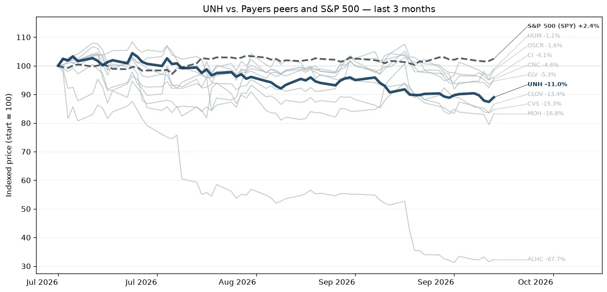

UnitedHealth Group is one of the largest private health insurers and provides medical benefits to about 51 million members globally, including 1 million outside the US as of December 2025. As a leader in employer-sponsored, self-directed, and government-backed insurance plans, UnitedHealth has obtained massive scale in medical insurance. Along with its insurance assets, UnitedHealth's Optum franchises help create a healthcare services colossus that spans everything from pharmaceutical benefits to providing outpatient care and analytics to affiliates and third parties.

<h3 id="company-cvs">CVS Health (CVS)</h3>

*Payers · $135.1B · 3m -17.4% · 12m +11.6% · 24m +33.9%*

[Google Finance](https://www.google.com/finance/quote/CVS:NYSE?tab=earnings&hl=en)

Healthcare retail ecosystem.

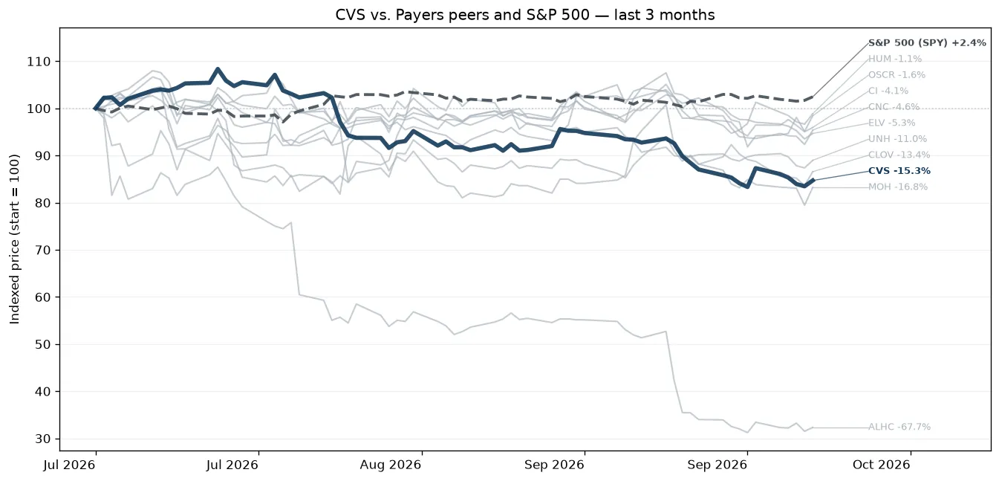

CVS Health offers a diverse set of healthcare services. Its roots are in its retail pharmacy operations, where it operates around 9,000 stores primarily in the US. CVS is also a large pharmacy benefit manager (acquired through Caremark), processing about 2 billion adjusted claims annually. It operates a top-tier health insurer (acquired through Aetna) through which it serves about 27 million medical members. The acquisition of Oak Street Health added primary care services to the mix, which could have significant synergies with all existing business lines.

<h3 id="company-hum">Humana (HUM)</h3>

*Payers · $43.7B · 3m -2.1% · 12m +36.9% · 24m +61.8%*

[Google Finance](https://www.google.com/finance/quote/HUM:NYSE?tab=earnings&hl=en)

Large payer, Medicare and Medicare Advantage focused.

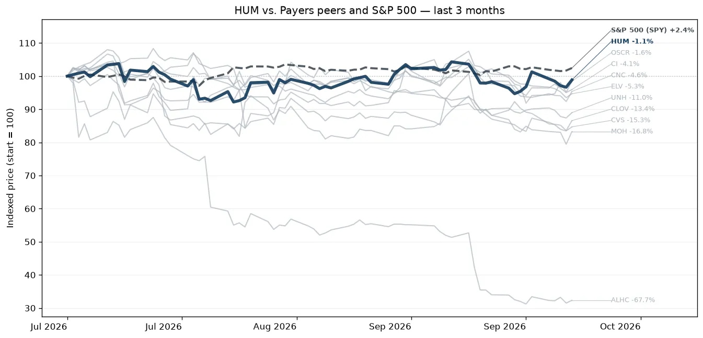

Humana is one of the largest private health insurers in the US, and the firm has built a niche specializing in government-sponsored programs, with nearly all its medical membership stemming from Medicare, Medicaid, and the military's Tricare program. Beyond medical insurance, the company provides other healthcare services, including primary-care services, at-home services, and pharmacy benefit management.

<h3 id="company-oscr">Oscar Health (OSCR)</h3>

*Payers · $9.4B · 3m -3.9% · 12m +42.8% · 24m +53.6%*

[Google Finance](https://www.google.com/finance/quote/OSCR:NYSE?tab=earnings&hl=en)

Tech-focused payer with large exposure to exchange products and ICHRAs.

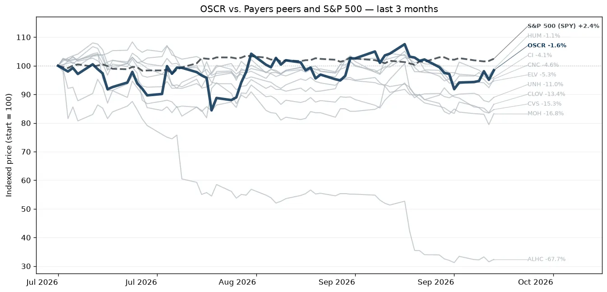

Oscar Health Inc is a healthcare technology company built around a full stack technology platform and a relentless focus on serving its members. It offers Individual & Family plans and health technology solutions that power the healthcare industry. Oscar operates as one segment to sell insurance to individuals, families and employees through the federal and state-run healthcare exchanges formed in conjunction with the Patient Protection and Affordable Care Act (ACA) and leverages its technology platform to provide services via its Oscar offering.

<h3 id="company-moh">Molina Healthcare (MOH)</h3>

*Payers · $10.2B · 3m -17.5% · 12m -6.2% · 24m -42.7%*

[Google Finance](https://www.google.com/finance/quote/MOH:NYSE?tab=earnings&hl=en)

Managed-care company providing health insurance through government programs.

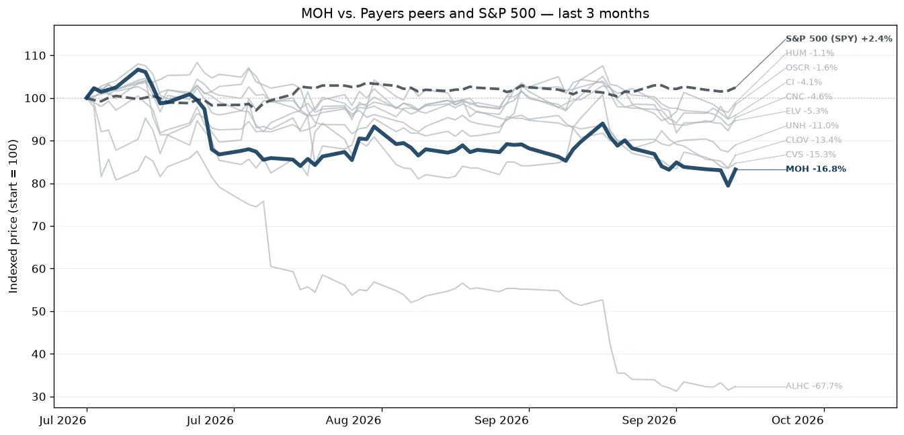

Molina Healthcare Inc provides medical insurance plans through Medicaid, the individual exchanges, and Medicare. The company operates in four reportable segments consisting of: 1) Medicaid; 2) Medicare; 3) Marketplace; and 4) Other. It manages health benefit risks for more than 5 million people, with more than 85% of those members coming through contracts with state governments for their Medicaid programs. Medicaid contracts in four states-California, New York, Texas, and Washington-account for over half of its enrollees.

<h3 id="company-ci">Cigna (CI)</h3>

*Payers · $73.7B · 3m -6.0% · 12m -13.0% · 24m -20.8%*

[Google Finance](https://www.google.com/finance/quote/CI:NYSE?tab=earnings&hl=en)

Employer-focused health insurance company.

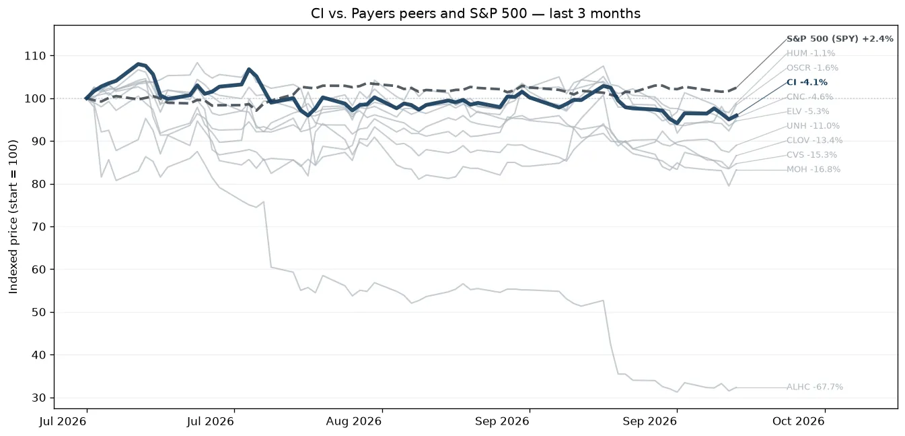

Cigna primarily provides pharmacy benefit management and health insurance services. Its PBM and specialty pharmacy services, which were greatly expanded by its 2018 merger with Express Scripts, are mostly sold to health insurance plans and employers. Its largest PBM contract is with the Department of Defense, and it recently won a multiyear deal with top-tier insurer Centene. In health insurance and other benefits, Cigna primarily serves employers through self-funding arrangements, and the company operates mostly in the US with 16 million US and 2 million international medical members covered as of December 2025.

<h3 id="company-elv">Elevance (ELV)</h3>

*Payers · $81.5B · 3m -7.5% · 12m +10.3% · 24m -21.5%*

[Google Finance](https://www.google.com/finance/quote/ELV:NYSE?tab=earnings&hl=en)

Health insurance company, previously named Anthem.

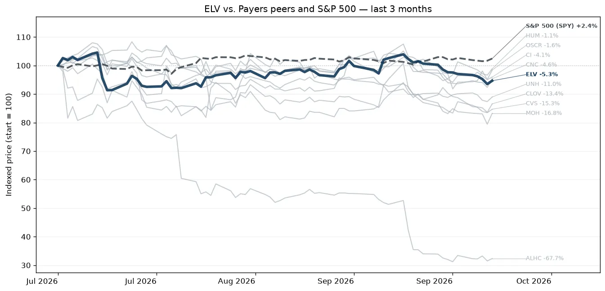

Elevance Health remains one of the leading health insurers in the US, providing medical benefits to 45 million medical members at the end of 2025. The company offers employer, individual, and government-sponsored coverage plans. Elevance differs from its peers in its unique position as the largest single provider of Blue Cross Blue Shield branded coverage, operating as the licensee for the Blue Cross Blue Shield Association in 14 states. Through acquisitions, such as the Amerigroup deal in 2012 and MMM in 2021, Elevance's reach expands beyond those states in government-sponsored programs, such as Medicaid and Medicare Advantage plans, too. It is also an emerging player in pharmacy benefit management and other healthcare services.

<h3 id="company-clov">Clover Health (CLOV)</h3>

*Payers · $2.2B · 3m -16.7% · 12m +69.1% · 24m +8.4%*

[Google Finance](https://www.google.com/finance/quote/CLOV:NASDAQ?tab=earnings&hl=en)

American healthcare company company providing Medicare Advantage insurance plans.

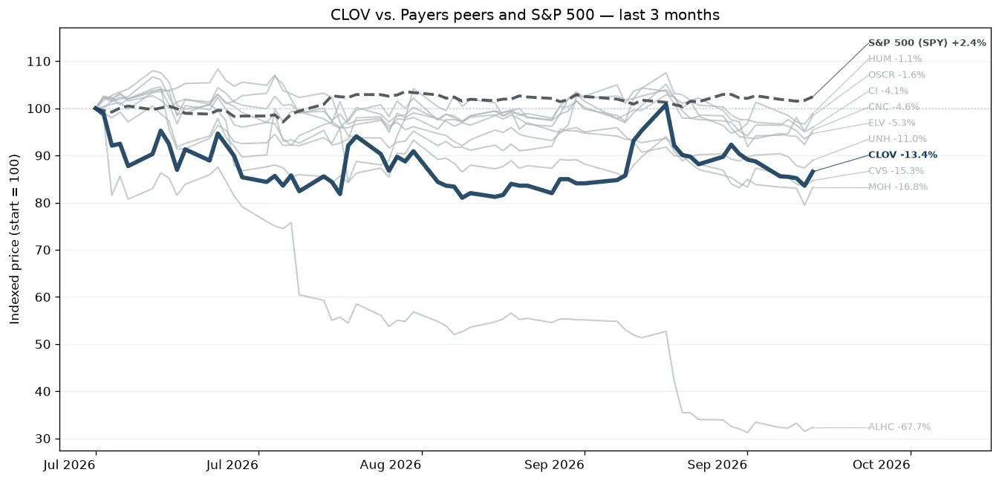

Clover Health Investments Corp is a healthcare technology company. It focuses on empowering Medicare physicians to proactively manage chronic diseases through its proprietary software platform, Clover Assistant. This cloud-based solution provides personalized insights to physicians, enabling early detection and management of chronic conditions. It operates in one segment: Insurance, through which it offers PPO and HMO plans to Medicare Advantage members in several states.

<h3 id="company-cnc">Centene (CNC)</h3>

*Payers · $30.7B · 3m -7.2% · 12m +62.8% · 24m -12.6%*

[Google Finance](https://www.google.com/finance/quote/CNC:NYSE?tab=earnings&hl=en)

Health insurance for government and privately insured healthcare programs.

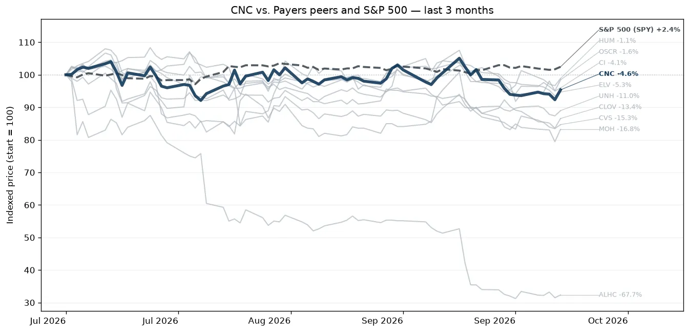

Centene is a managed care organization that focuses on government-sponsored healthcare plans, including Medicaid, Medicare, and the individual exchanges. Centene served 20 million medical members as of December 2025, mostly in Medicaid (about 64% of membership), the individual exchanges (about 28%), and Medicare (about 5%). The company also provides Medicare Part D pharmaceutical plans.

<h3 id="company-alhc">Alignment Health (ALHC)</h3>

*Payers · $3.1B · 3m -66.6% · 12m -52.2% · 24m -27.3%*

[Google Finance](https://www.google.com/finance/quote/ALHC:NASDAQ?tab=earnings&hl=en)

Tech-enabled Medicare Advantage Company.

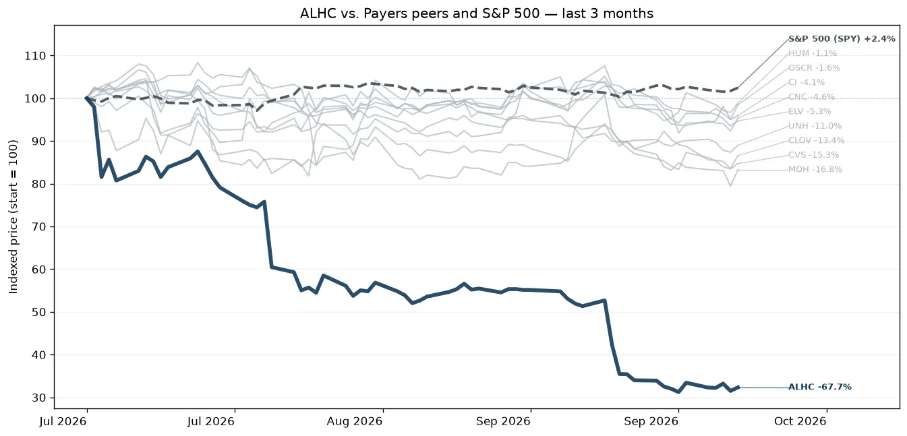

Alignment Healthcare Inc is a next-generation, consumer-centric platform that is revolutionizing the healthcare experience for seniors through Medicare Advantage plans. These plans are marketed and sold direct-to-consumer, allowing seniors to select the manner in which customers receive healthcare coverage and services on an annual basis. The company combines a technology platform and clinical model for more effective health outcomes.

<h3 id="company-hca">HCA Healthcare (HCA)</h3>

*Health System Providers · $87.2B · 3m +3.9% · 12m -0.7% · 24m +8.3%*

[Google Finance](https://www.google.com/finance/quote/HCA:NYSE?tab=earnings&hl=en)

Largest for-profit hospital and outpatient care operator in the United States.

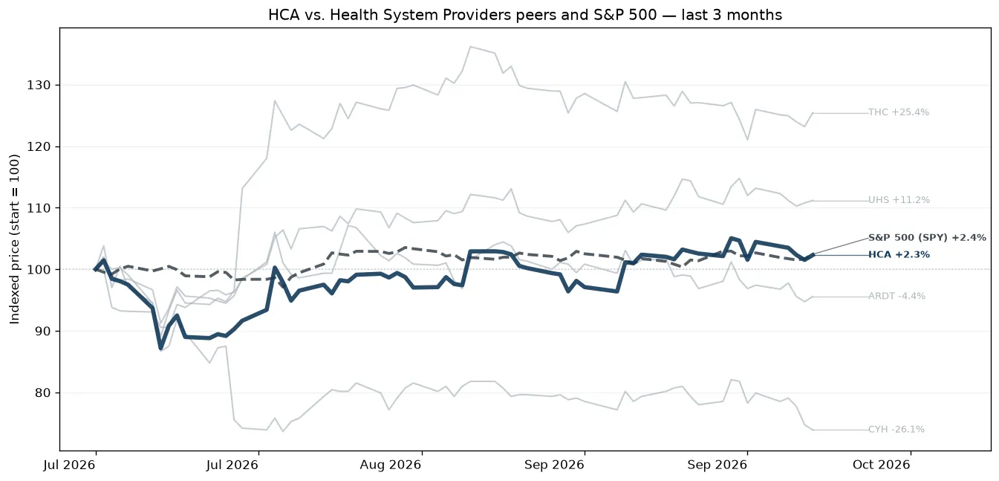

HCA Healthcare is a Nashville-based healthcare provider organization operating the largest collection of acute-care hospitals in the United States. As of December 2025, the firm owned and operated 190 hospitals and over 2,500 outpatient facillities across 19 states and a small foothold in the United Kingdom.

<h3 id="company-thc">Tenet Health (THC)</h3>

*Health System Providers · $20.5B · 3m +26.9% · 12m +27.4% · 24m +65.2%*

[Google Finance](https://www.google.com/finance/quote/THC:NYSE?tab=earnings&hl=en)

Diversified healthcare provider with hospitals and a leading ambulatory surgery center platform through USPI.

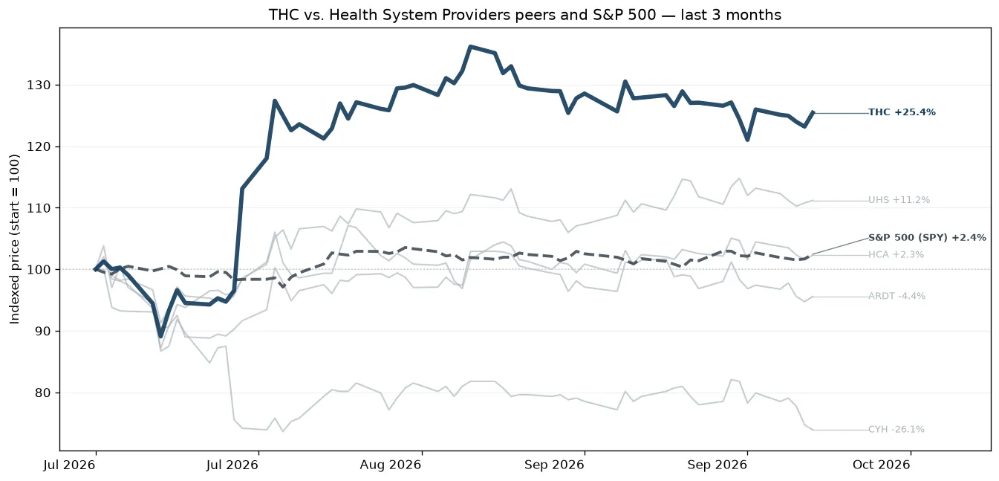

Tenet Healthcare is a Dallas-based healthcare services organization. It operates acute and specialty hospitals (50 as of December 2025) and hundreds of ambulatory surgery centers and other outpatient facilities across the US, primarily in the South. Through its Conifer segment, Tenet also provides revenue cycle management solutions.

<h3 id="company-uhs">Universal Health Services (UHS)</h3>

*Health System Providers · $10.2B · 3m +11.0% · 12m -15.2% · 24m -18.5%*

[Google Finance](https://www.google.com/finance/quote/UHS:NYSE?tab=earnings&hl=en)

Hospital operator with significant acute care and behavioral health business.

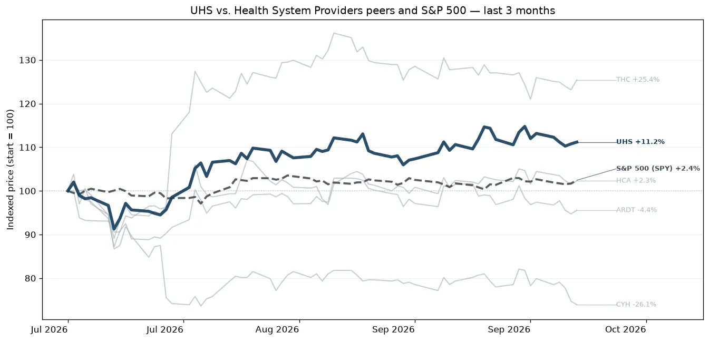

Universal Health Services Inc offers healthcare services through its behavioral health centers, acute care hospitals, and related outpatient facilities. As of late 2025, the company operated 346 inpatient behavioral health centers, 29 acute care hospitals, and many supportive outpatient facilities. Its operations are concentrated in the U.S, particularly in Nevada (21% of 2025 operating profits), Texas (19%), and California (13%), although it does have some exposure to the UK behavioral health market (6% of 2025 sales) too. While its acute care services account for over 55% of revenue, the behavioral health centers sport higher margins and account for over 55% of pretax profits.

<h3 id="company-cyh">Community Health Systems (CYH)</h3>

*Health System Providers · $417.4M · 3m -30.3% · 12m -12.8% · 24m -51.8%*

[Google Finance](https://www.google.com/finance/quote/CYH:NYSE?tab=earnings&hl=en)

Operator of community hospitals primarily serving non-urban and regional markets.

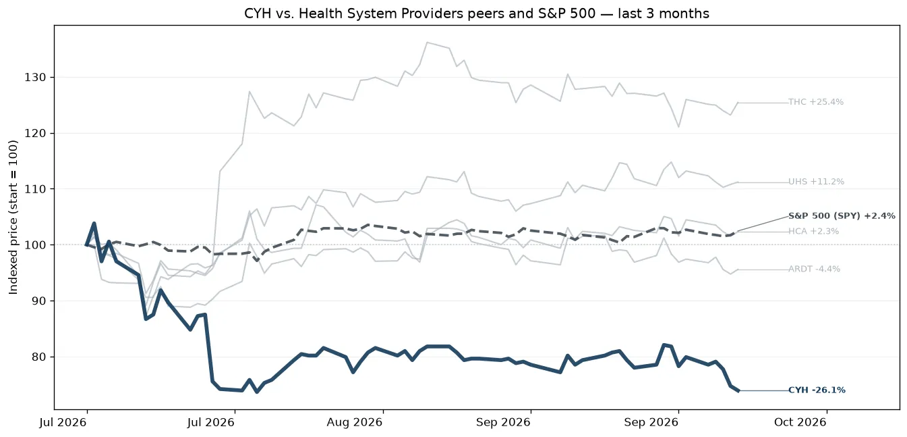

Community Health Systems Inc is a publicly owned hospital operator in the United States. The company also owns four home health agencies and provides management and consulting services to independent hospitals. The firm derives revenue through a broad range of general and specialized hospital healthcare services and outpatient services.

<h3 id="company-ardt">Ardent Health Partners (ARDT)</h3>

*Health System Providers · $1.5B · 3m -3.9% · 12m -26.2% · 24m -42.5%*

[Google Finance](https://www.google.com/finance/quote/ARDT:NYSE?tab=earnings&hl=en)

Regional hospital operator focused on integrated health systems across mid-sized US markets.

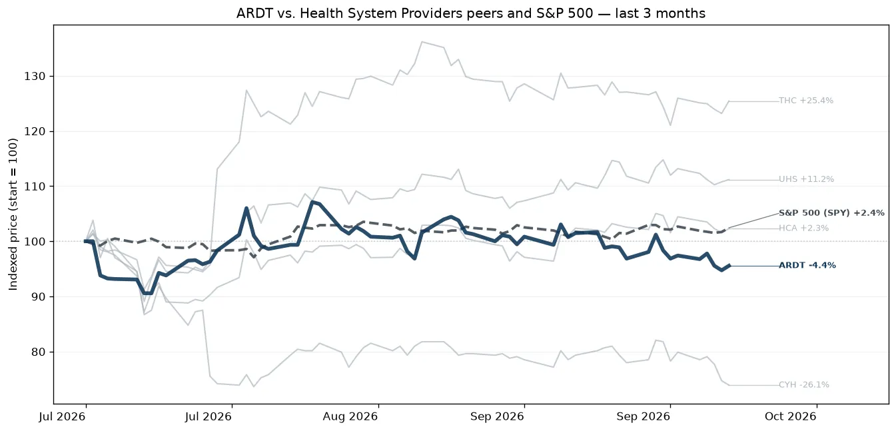

Ardent Health Inc is a provider of healthcare in growing mid-sized urban communities across the U.S and operating in eight growing mid-sized urban markets across six states Texas, Oklahoma, New Mexico, New Jersey, Idaho, and Kansas. The main focus on people and investments in services and technologies.

<h3 id="company-ensg">The Ensign Group (ENSG)</h3>

*Inpatient Non-Acute Providers · $10.4B · 3m +2.1% · 12m -2.1% · 24m +19.1%*

[Google Finance](https://www.google.com/finance/quote/ENSG:NASDAQ?tab=earnings&hl=en)

Leading operator of skilled nursing facilities, rehabilitation centers, and senior-care services.

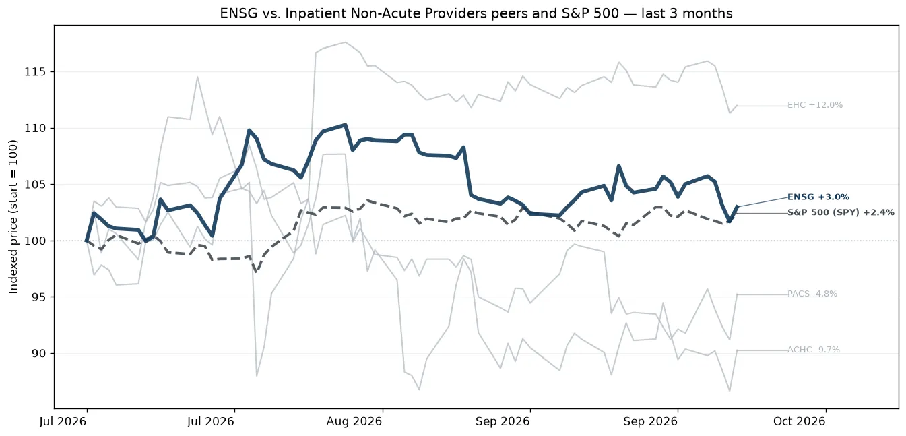

Ensign Group Inc provides post-acute healthcare services in the United States. Its regional subsidiaries oversee skilled nursing, assisted living, home health and hospice, mobile ancillary, and urgent care operations. Medicare and Medicaid programs contribute majority of revenue received for Ensign's services. The firm operates through two segments, Skilled services, and Standard Bearer. The skilled services segment includes the operation of skilled nursing facilities and rehabilitation therapy services. The Standard Bearer segment comprises of properties owned by the company through its captive REIT and leased to skilled nursing and assisted living operations. The majority of the revenue is generated from the skilled services segment.

<h3 id="company-achc">Acadia Healthcare (ACHC)</h3>

*Inpatient Non-Acute Providers · $2.8B · 3m -12.1% · 12m +3.4% · 24m -49.7%*

[Google Finance](https://www.google.com/finance/quote/ACHC:NASDAQ?tab=earnings&hl=en)

Largest provider of behavioral health and addiction treatment services.

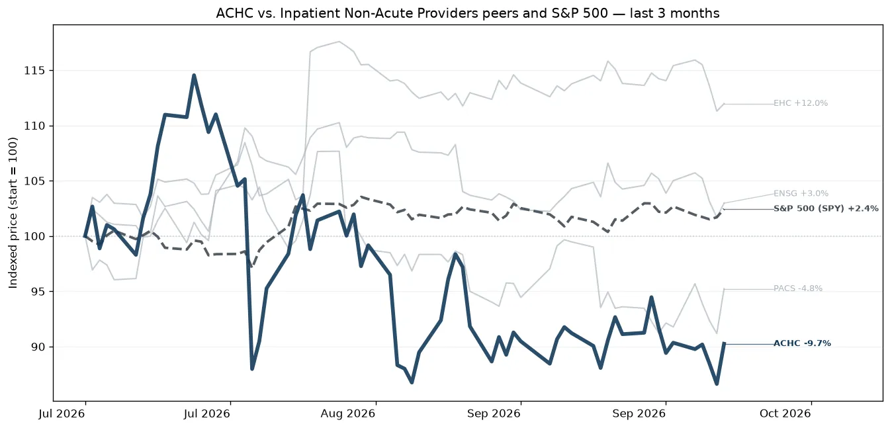

Acadia Healthcare Co Inc acquires and develops behavioral healthcare facilities. Its facilities and services are classified into the following categories: acute inpatient psychiatric facilities; specialty treatment facilities; CTCs; and residential treatment centers. In which Acute inpatient psychiatric facilities contribute the majority of revenue in the United States. The Company has one reportable segment, behavioral healthcare services. The behavioral healthcare services segment provides inpatient and outpatient behavioral healthcare services.

<h3 id="company-ehc">Encompass Health (EHC)</h3>

*Inpatient Non-Acute Providers · $11.0B · 3m +12.5% · 12m -2.8% · 24m +26.8%*

[Google Finance](https://www.google.com/finance/quote/EHC:NYSE?tab=earnings&hl=en)

In-patient post-acute rehabilitation services.

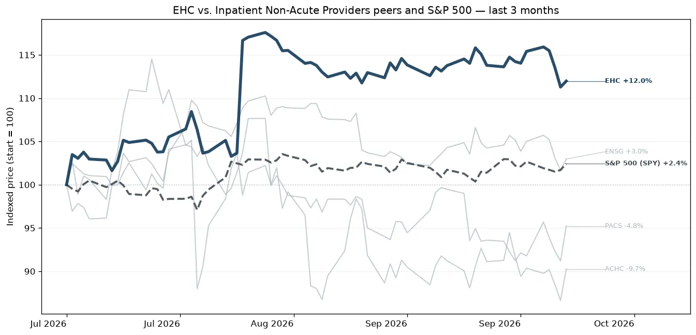

Encompass Health Corp provides post-acute healthcare services in the United States through a network of inpatient rehabilitation hospitals, which is the company's sole segment. Inpatient rehabilitation contributes the majority of the firm's revenue and provides specialized rehabilitative treatment through a network of inpatient hospitals. The company's inpatient rehabilitation hospitals provide a higher level of rehabilitative care to patients who are recovering from conditions such as stroke and other neurological disorders, cardiac and pulmonary conditions, brain and spinal cord injuries, complex orthopedic conditions, and amputations.

<h3 id="company-pacs">PACS Group (PACS)</h3>

*Inpatient Non-Acute Providers · $7.3B · 3m -3.7% · 12m +213.0% · 24m +11.3%*

[Google Finance](https://www.google.com/finance/quote/PACS:NYSE?tab=earnings&hl=en)

Post-acute care and skilled nursing company.

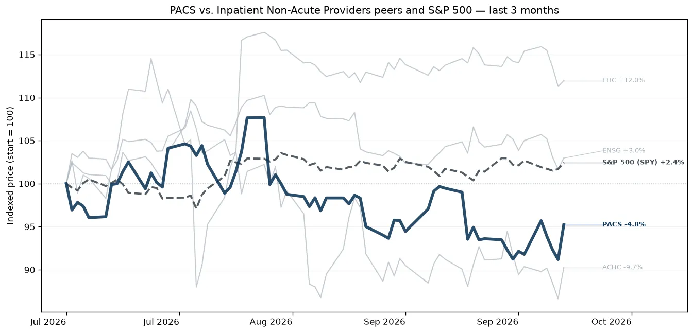

PACS Group Inc is a post-acute healthcare company mainly focused on delivering skilled nursing care through a portfolio of independently operated facilities. The post-acute care ecosystem serves individuals who need additional help recuperating from acute conditions, illnesses, or serious medical procedures after getting discharged from the hospital. It also provides senior care, assisted living, and independent living options in some of the communities. The company has one reportable segment.

<h3 id="company-doc">Healthpeak properties (DOC)</h3>

*Health Care Real Estate · $15.1B · 3m -11.0% · 12m +0.6% · 24m -11.9%*

[Google Finance](https://www.google.com/finance/quote/DOC:NYSE?tab=earnings&hl=en)

Healthcare industry real estate investment trust focused on outpatient medical offices, life science properties, an senior housing.

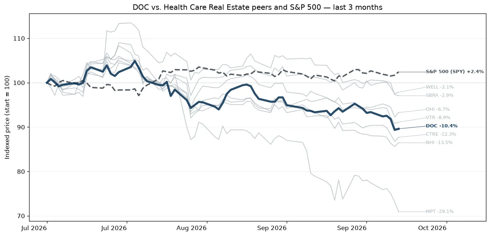

Healthpeak owns a diversified healthcare portfolio of approximately 700 in-place properties spread across mainly medical office and life science assets, plus a handful of senior housing, hospital, and skilled nursing/post-acute care assets, as well.

<h3 id="company-vtr">Ventas, Inc (VTR)</h3>

*Health Care Real Estate · $48.0B · 3m -9.2% · 12m +20.4% · 24m +34.4%*

[Google Finance](https://www.google.com/finance/quote/VTR:NYSE?tab=earnings&hl=en)

Real estate investment trust focused  on ownership and management of senior housing, research, medicine office buildings, and healthcare facilities.

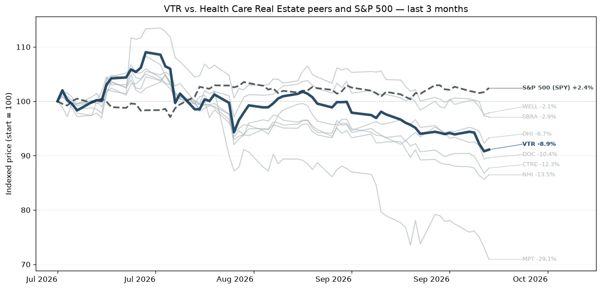

Ventas owns a diversified healthcare portfolio of almost 1,400 in-place properties spread across the senior housing, medical office, hospital, life science, and skilled nursing/post-acute care. The portfolio includes almost 100 properties in Canada and the United Kingdom as the company looks for additional investment opportunities in countries with mature healthcare systems that operate similarly to the United States. The firm also owns mortgages and other loans, contributing about 1% of net operating income.

<h3 id="company-mpt">Medical Properties Trust (MPT)</h3>

*Health Care Real Estate · $2.8B · 3m -28.8% · 12m n/a · 24m n/a*

[Google Finance](https://www.google.com/finance/quote/MPT:NYSE?tab=earnings&hl=en)

Real estate investment trust for healthcare facilities in the US and Europe.

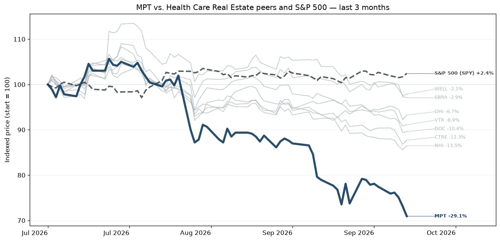

Medical Properties Trust Inc acquires and develops net-leased healthcare facilities. Its investments in healthcare real estate, other loans, and any investments in tenants are considered a single reportable segment. Its business strategy is to acquire and develop healthcare facilities and lease the facilities to healthcare operating companies under long-term net leases, which require the tenant to bear of the costs associated with the property. The group's geographic areas are the United States, the United Kingdom, and All other countries.

<h3 id="company-nhi">National Health Investors (NHI)</h3>

*Health Care Real Estate · $3.7B · 3m -15.2% · 12m -16.3% · 24m -19.2%*

[Google Finance](https://www.google.com/finance/quote/NHI:NYSE?tab=earnings&hl=en)

Healthcare REIT focused on senior housing, skilled nursing, and long-term care properties.

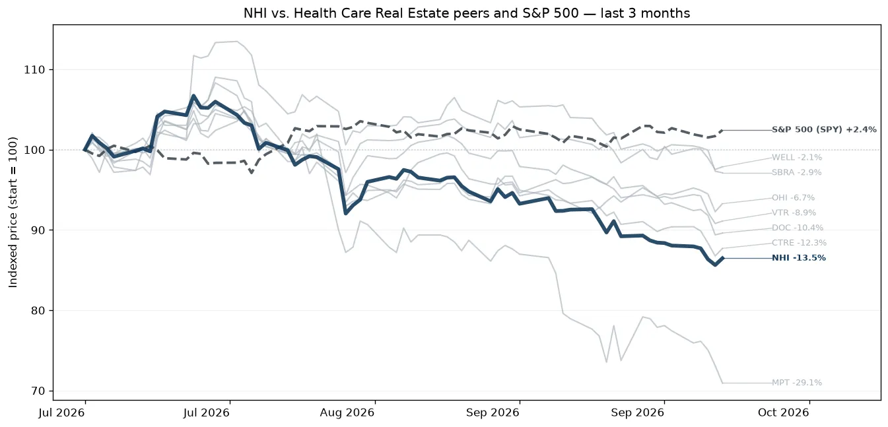

National Health Investors Inc is a self-managed REIT that owns, leases, operates, and finances the development of senior housing communities and medical facilities. It operates through two segments: Real Estate Investments and Senior Housing Operating Portfolio (SHOP). The Real Estate Investments segment, which generates the majority of revenue, includes real estate leases, mortgages, and other notes receivable related to independent living facilities, assisted living facilities, entrance fee communities, senior living campuses, skilled nursing facilities, and a hospital. The SHOP segment consists of ventures that own and operate independent living facilities. The company's revenues are derived from rental income, interest and other income, and resident fees and services.

<h3 id="company-ohi">Omega Healthcare Investors (OHI)</h3>

*Health Care Real Estate · $15.1B · 3m -7.4% · 12m +11.1% · 24m +16.2%*

[Google Finance](https://www.google.com/finance/quote/OHI:NYSE?tab=earnings&hl=en)

Healthcare REIT healthcare REIT focused on skilled nursing and assisted living facilities.

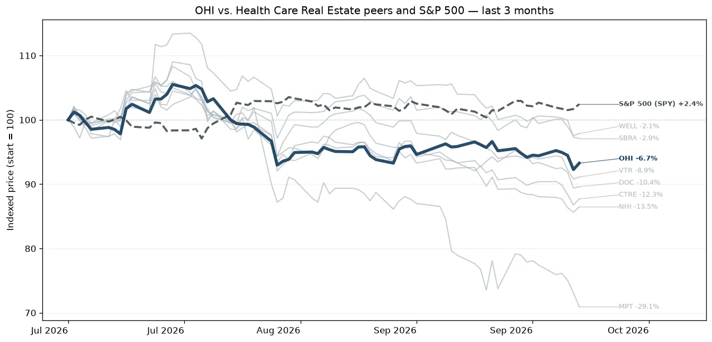

Omega Healthcare Investors Inc is a real estate investment trust that invests in healthcare-related real estate properties located in the United States (U.S.), the United Kingdom (U.K.), and Canada. The company's objective is to provide attractive returns to investors while serving as the preferred capital partner to its third-party healthcare operating companies and affiliates, as well as other third-party healthcare operators, allowing them to focus on delivering a high level of care to their resident patients. Omega's investment portfolio mainly consists of skilled nursing facilities, assisted living facilities (ALFs), including care homes in the U.K., independent living facilities, rehabilitation and acute care facilities, and continuing care retirement communities.

<h3 id="company-well">Welltower (WELL)</h3>

*Health Care Real Estate · $166.9B · 3m -3.5% · 12m +30.1% · 24m +81.4%*

[Google Finance](https://www.google.com/finance/quote/WELL:NYSE?tab=earnings&hl=en)

Largest healthcare REIT, focused on senior housing, outpatient medical, and wellness-oriented healthcare properties.

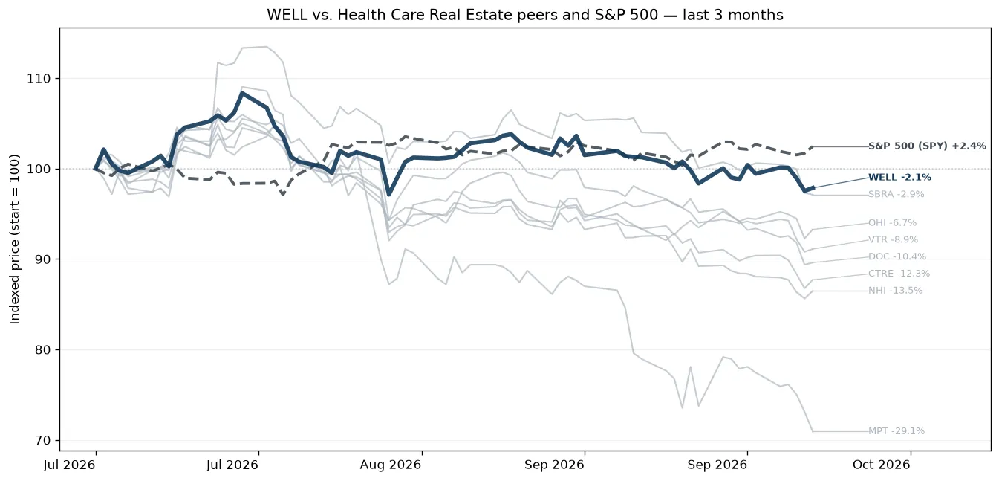

Welltower owns a diversified healthcare portfolio of 2,800 in-place properties spread across the senior housing, medical office, and skilled nursing/postacute care sectors. The portfolio includes over 900 properties in Canada and the United Kingdom as the company looks for additional investment opportunities in countries with mature healthcare systems that operate similarly to that of the United States.

<h3 id="company-ctre">CareTrust REIT (CTRE)</h3>

*Health Care Real Estate · $9.6B · 3m -13.1% · 12m +2.3% · 24m +19.5%*

[Google Finance](https://www.google.com/finance/quote/CTRE:NYSE?tab=earnings&hl=en)

Healthcare REIT focused on skilled nursing, senior housing, and other post-acute care facilities.

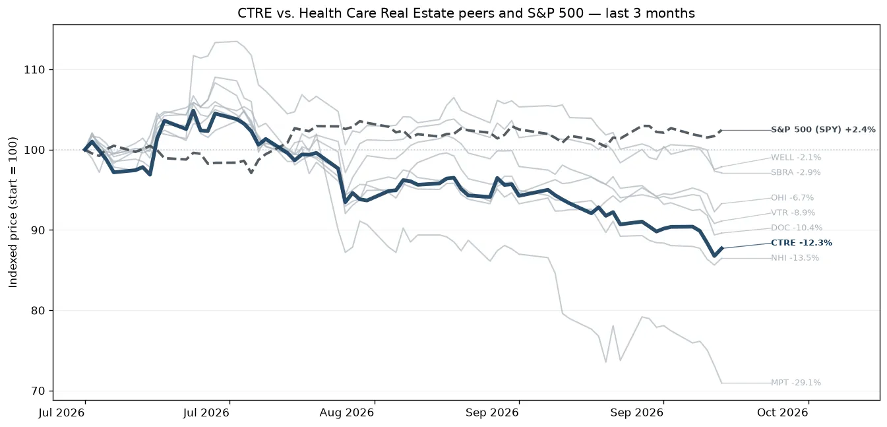

CareTrust REIT Inc is a self-administered, publicly traded REIT engaged in the ownership, acquisition, financing, development, and leasing of skilled nursing, seniors housing, and other healthcare-related properties. The company has one reportable segment consisting of investments in healthcare-related real estate assets. It generates revenues by leasing healthcare-related properties to healthcare operators under triple-net lease arrangements, in which the tenant is solely responsible for property-related costs. The company operates in Domestic and Foreign markets, with the majority of revenue coming from Domestic operations.

<h3 id="company-sbra">Sabra Health Care REIT (SBRA)</h3>

*Health Care Real Estate · $5.3B · 3m -5.0% · 12m +5.6% · 24m +6.6%*

[Google Finance](https://www.google.com/finance/quote/SBRA:NASDAQ?tab=earnings&hl=en)

healthcare REIT focused on skilled nursing, senior housing, and behavioral health properties.

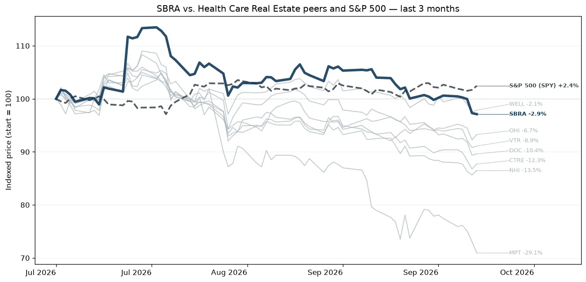

Sabra Health Care REIT Inc is a healthcare facility real estate investment trust. The company operates one segment that owns and invests in healthcare real estate. All of the company's revenue is generated in the United States. Sabra's operations consist of nursing facilities, assisted living centers, and mental health facilities.

<h3 id="company-prva">Privia Health Group (PRVA)</h3>

*Value-Based Care · $3.0B · 3m -25.8% · 12m -15.7% · 24m +15.4%*

[Google Finance](https://www.google.com/finance/quote/PRVA:NASDAQ?tab=earnings&hl=en)

Value-based care company focusing on physician enablement for independent practices.

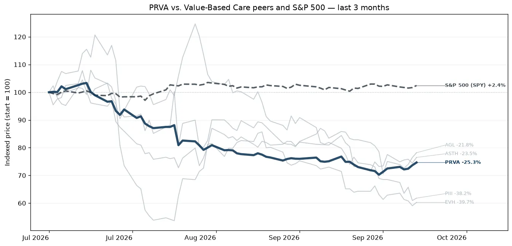

Privia Health Group Inc is one of the physician enablement companies in the United States with a presence in around 24 states and the District of Columbia. The group builds scaled provider networks with primary-care centric medical groups, risk-bearing entities, a physician-led governance structure, and the Privia Platform comprising an extensive suite of technology and service solutions. It collaborates with medical groups, health plans, and health systems to optimize approximately 1,300+ physician practices, improve the patient experience for over 5.8+ million patients, and reward around 5,300+ physicians and practitioners for delivering high-value care.

<h3 id="company-asth">Astrana Health (ASTH)</h3>

*Value-Based Care · $1.8B · 3m -27.0% · 12m +24.8% · 24m -40.1%*

[Google Finance](https://www.google.com/finance/quote/ASTH:NASDAQ?tab=earnings&hl=en)

Physician centric management company that operates and coordinates provider networks to take on risk contracts.

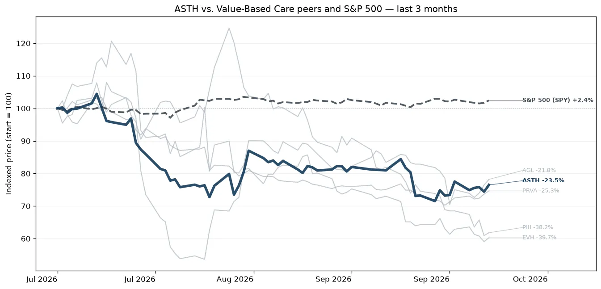

Astrana Health Inc is a patient-centered, physician-centric integrated population health management company. The company is working to provide coordinated, outcomes-based medical care cost-effectively. It is focused on physicians providing high-quality medical care, population health management, and care coordination for patients, particularly senior patients and patients with multiple chronic conditions. The company's three reportable segments are Care Partners, Care Delivery, and Care Enablement. It generates the majority of its revenue from the Care Partners segment.

<h3 id="company-agl">Agilon Health (AGL)</h3>

*Value-Based Care · $2.1B · 3m -24.2% · 12m +197.8% · 24m +4.8%*

[Google Finance](https://www.google.com/finance/quote/AGL:NYSE?tab=earnings&hl=en)

Value-based care company focused on partnerships with primary care physicians for Medicare Advantage seniors.

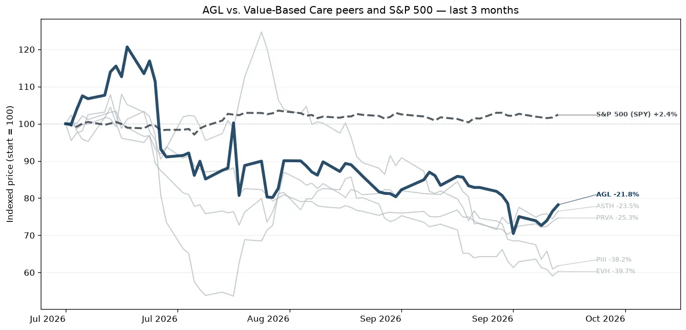

Agilon Health Inc is a healthcare services company that partners with primary care physicians to support value-based care for senior patients. The company provides a platform that enables physician groups to manage healthcare outcomes and costs through a Medicare-centric, capitated care model and long-term partnerships with community-based physicians.

<h3 id="company-evh">Evolent Health (EVH)</h3>

*Value-Based Care · $347.6M · 3m -39.4% · 12m -58.0% · 24m -86.9%*

[Google Finance](https://www.google.com/finance/quote/EVH:NYSE?tab=earnings&hl=en)

Specialty-care management and healthcare-services company focused on oncology, cardiology, and musculoskeletal care.

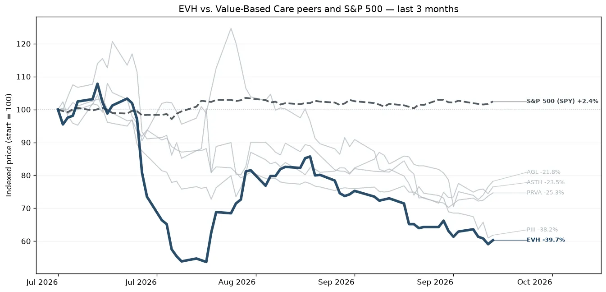

Evolent Health Inc is engaged in healthcare delivery and payment. The company supports health systems and physician organizations in their migration toward value-based care and population health management. It provides specialty care management services in oncology, cardiology, musculoskeletal markets and holistic total cost of care management along with an integrated platform for health plan administration and value-based business infrastructure under one go to market package. The solutions provided by the company includes: Oncology, Cardiology, Musculoskeletal, Administrative Services, Advanced Illness, Genetic Testing, Physical Medicine, Radiology, and Surgical Management.

<h3 id="company-piii">P3 Health (PIII)</h3>

*Value-Based Care · $32.7M · 3m -44.1% · 12m -26.5% · 24m -66.3%*

[Google Finance](https://www.google.com/finance/quote/PIII:NASDAQ?tab=earnings&hl=en)

Physician-led population ehalth company focused on coordinating care for Medicare Advantage Patients.

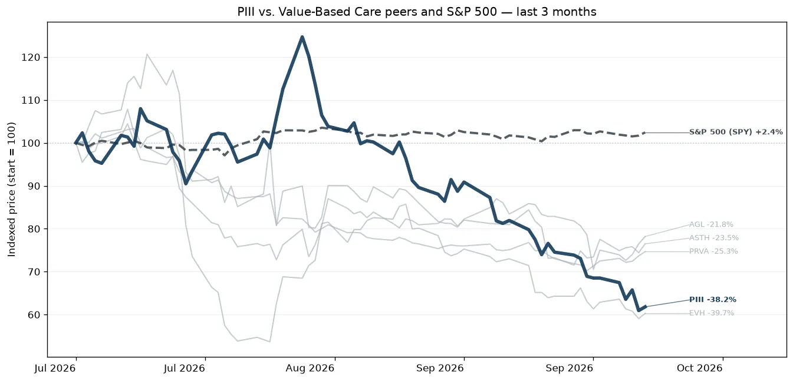

P3 Health Partners Inc is a patient-centered and physician-led population health management company. P3's model aggregates and supports the community's existing healthcare resources to build a network of community providers working together to deliver coordinated and integrated care to patients with a shared commitment to improving patient outcomes, lowering cost, and delivering experience for all. It includes utilization management, care management, disease education, and maintenance of a quality improvement and quality management program for members assigned to the Company. The Company is also responsible for the credentialing of its providers, processing and payment of claims, and the establishment of a provider network for certain health plans.

<h3 id="company-dva">Davita (DVA)</h3>

*Outpatient and Home Providers · $15.4B · 3m -23.9% · 12m +36.2% · 24m +11.2%*

[Google Finance](https://www.google.com/finance/quote/DVA:NYSE?tab=earnings&hl=en)

One of two dominant US dialysis providers.

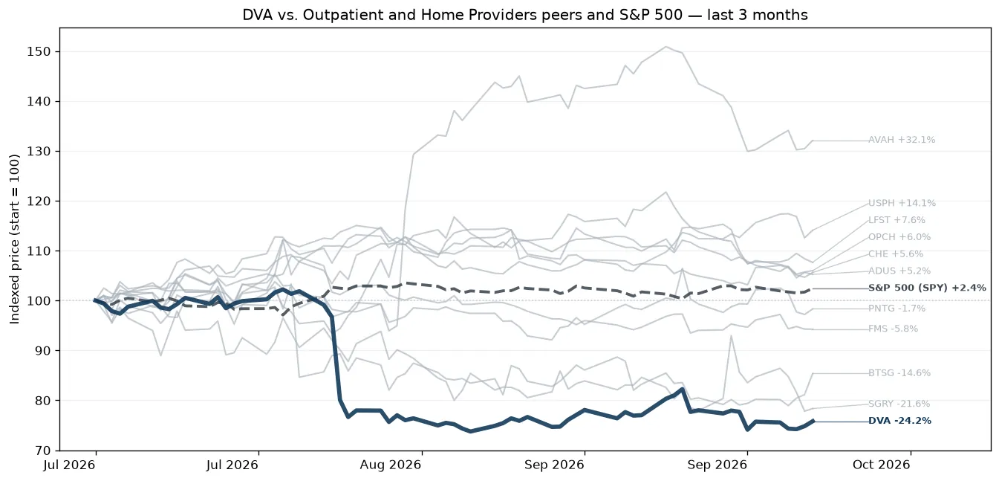

DaVita is one of the largest providers of dialysis services in the United States, boasting a market share of about 35%. The firm operates over 3,200 facilities worldwide, mostly in the US, and treats about 300,000 patients annually. Government payers dominate US dialysis reimbursement. DaVita receives about two-thirds of US sales at government (primarily Medicare) reimbursement rates, with the remainder coming from commercial insurers. While commercial insurers represent only about 10% of US patients treated, they represent nearly all of the profits generated by DaVita in the US dialysis business.

<h3 id="company-fms">Fresenius (FMS)</h3>

*Outpatient and Home Providers · $13.8B · 3m -5.4% · 12m -16.8% · 24m +7.5%*

[Google Finance](https://www.google.com/finance/quote/FMS:NYSE?tab=earnings&hl=en)

Global leaders in dialysis clinics, equipment, and renal services.

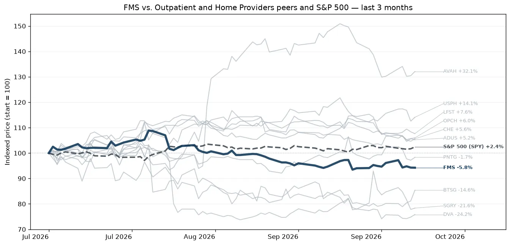

Fresenius Medical Care is the largest dialysis company in the world, treating nearly 300,000 patients from about 3,600 clinics worldwide as of December 2025. In addition to providing dialysis services, the firm is a leading supplier of dialysis products, including machines, dialyzers, and concentrates. Fresenius accounts for about 35% of the global dialysis products market, creating the world's only fully integrated dialysis business. Services account for about three-fourths of sales, while the balance is generated from medical technology products that enable dialysis treatments.

<h3 id="company-sgry">Surgery Partners (SGRY)</h3>

*Outpatient and Home Providers · $2.0B · 3m -22.7% · 12m -37.0% · 24m -57.3%*

[Google Finance](https://www.google.com/finance/quote/SGRY:NASDAQ?tab=earnings&hl=en)

Operator of Ambulatory Surgery Centers.

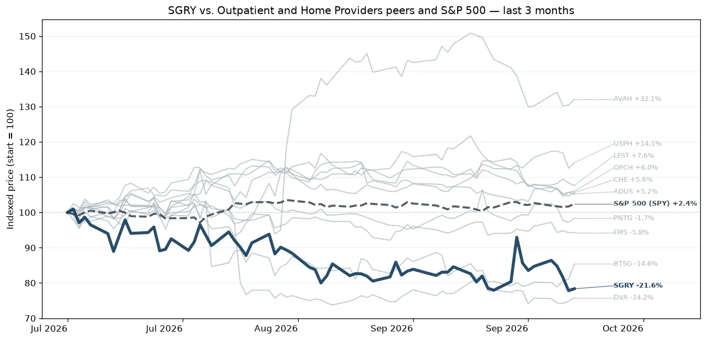

Surgery Partners Inc is a healthcare services company with an integrated outpatient delivery model focused on providing quality, cost-effective solutions for surgical and related ancillary care in support of both patients and physicians. It has one reportable segment: Surgical Facilities, which includes the operation of ASCs, surgical hospitals, anesthesia services, and multi-specialty physician practices, which earn revenues from contracts with patients in which the performance obligations are to provide health care services.

<h3 id="company-opch">Option Care Health (OPCH)</h3>

*Outpatient and Home Providers · $3.4B · 3m +3.4% · 12m -17.7% · 24m -22.3%*

[Google Finance](https://www.google.com/finance/quote/OPCH:NASDAQ?tab=earnings&hl=en)

Largest independent provider of home and alternate-site infusion therapy services in the United States.

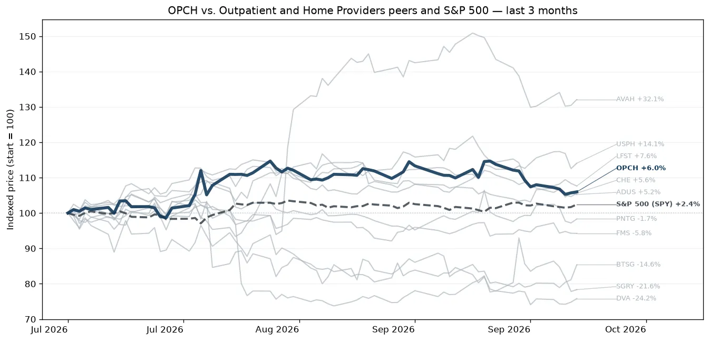

Option Care Health Inc is the provider of home and alternate-site infusion services. It provides treatment for bleeding disorders, neurological disorders, heart failure, anti-infectives, and chronic inflammatory disorders, among others. The Company operates in one segment, infusion services.

<h3 id="company-lfst">Lifestance Health (LFST)</h3>

*Outpatient and Home Providers · $4.0B · 3m +5.0% · 12m +114.7% · 24m +71.2%*

[Google Finance](https://www.google.com/finance/quote/LFST:NASDAQ?tab=earnings&hl=en)

Outpatient behavioral-health providers of psychiatry and therapy services.

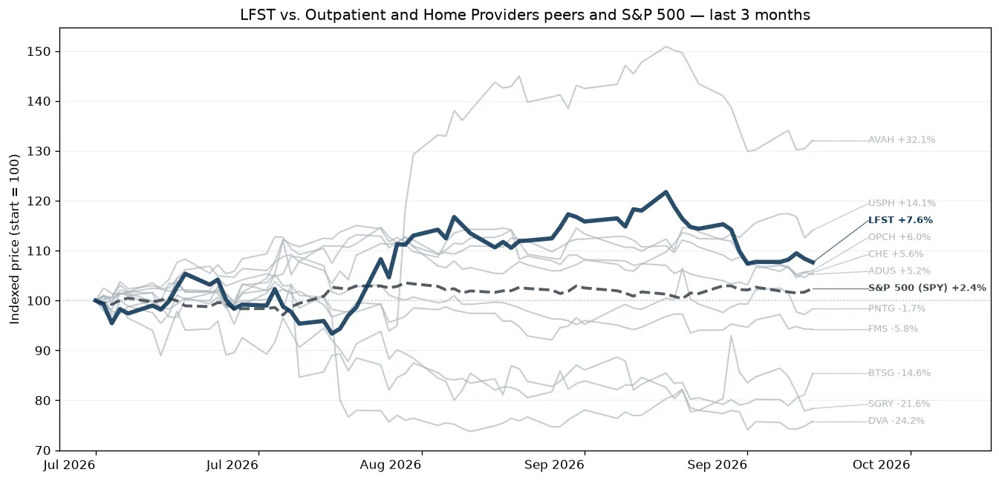

LifeStance Health Group Inc is a mental healthcare company that operates as a provider of outpatient mental health services, spanning psychiatric evaluations and treatment, psychological and neuropsychological testing, and individual, family, and group therapy. It treats a broad range of mental health conditions, including anxiety, depression, bipolar disorder, eating disorders, psychotic disorders, and post-traumatic stress disorder, using evidence-based approaches to ensure effective treatment. The group has a single operating and reportable segment of mental health services.

<h3 id="company-che">Chemed (Vitas) (CHE)</h3>

*Outpatient and Home Providers · $7.1B · 3m +3.6% · 12m +14.4% · 24m -12.7%*

[Google Finance](https://www.google.com/finance/quote/CHE:NYSE?tab=earnings&hl=en)

Hospice and end of life provider through VITAS healthcare.

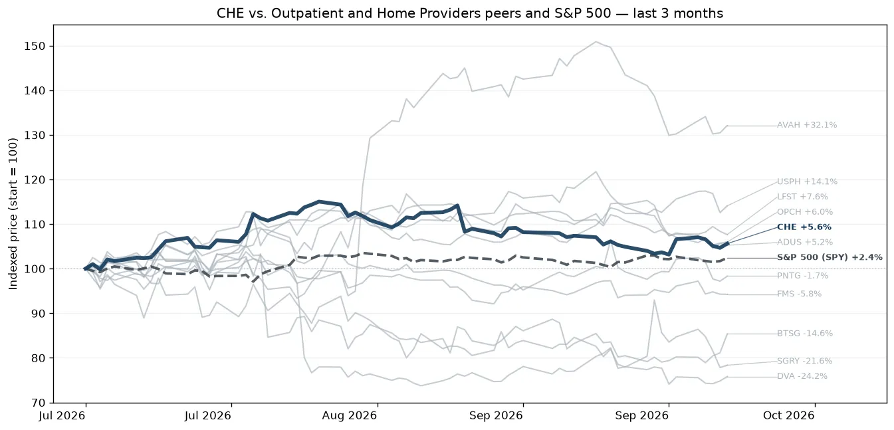

Chemed Corp purchases, operates, and divests subsidiaries engaged in diverse business activities to maximize shareholder value. The company operates in the following segments: VITAS and Roto-Rooter. The VITAS segment generates the majority of the firm's revenue and provides hospice and palliative care services to patients with terminal illnesses through a network of physicians, registered nurses, home health aides, social workers, and volunteers. The Roto-Rooter segment provides plumbing, drain cleaning, water restoration, and related services to residential and commercial customers.

<h3 id="company-adus">Addus HomeCare (ADUS)</h3>

*Outpatient and Home Providers · $2.1B · 3m +5.8% · 12m -3.1% · 24m -11.9%*

[Google Finance](https://www.google.com/finance/quote/ADUS:NASDAQ?tab=earnings&hl=en)

Provider of personal care, hospice, and home health services.

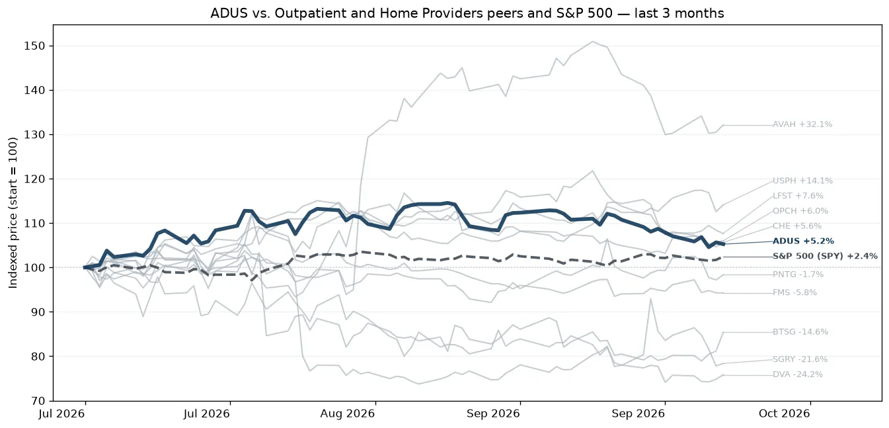

Addus HomeCare Corp is engaged in the provision of in-home care services. The Company has three reportable segments: Personal Care, Hospice, and Home Health. The Personal Care segment provides non-medical assistance with activities of daily living, mainly to the elderly, chronically ill, and disabled individuals. The Hospice segment provides physical, emotional, and spiritual care for terminally ill patients and their families. The Home Health segment provides medical services to individuals requiring care during illness or recovery. It generates the majority of its revenue from the Personal Care segment.

<h3 id="company-pntg">Pennant Group (PNTG)</h3>

*Outpatient and Home Providers · $1.3B · 3m +1.9% · 12m +51.7% · 24m +18.9%*

[Google Finance](https://www.google.com/finance/quote/PNTG:NASDAQ?tab=earnings&hl=en)

provider of home health, hospice, and senior living services.

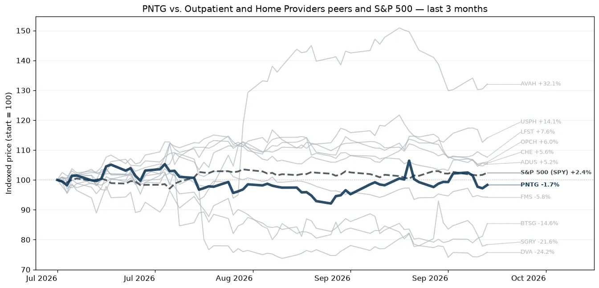

Pennant Group Inc is engaged in providing healthcare services to patients of all ages, including the growing senior population, in the United States. It operates in multiple lines of business including home health, hospice, and senior living which includes the company's assisted living, independent living, and memory care communities across Arizona, California, Colorado, Idaho, Montana, Nevada, Oklahoma, Oregon, Texas, Utah, Washington, Wisconsin, and Wyoming. It operates in two segments; home health and hospice services and senior living services. The company generates majority of its revenue from home health and hospice services segment, which includes its home health, hospice and home care businesses.

<h3 id="company-usph">US Physical Therapy (USPH)</h3>

*Outpatient and Home Providers · $1.2B · 3m +15.7% · 12m -5.9% · 24m +3.3%*

[Google Finance](https://www.google.com/finance/quote/USPH:NYSE?tab=earnings&hl=en)

operator of outpatient physical therapy clinics and industrial injury prevention services.

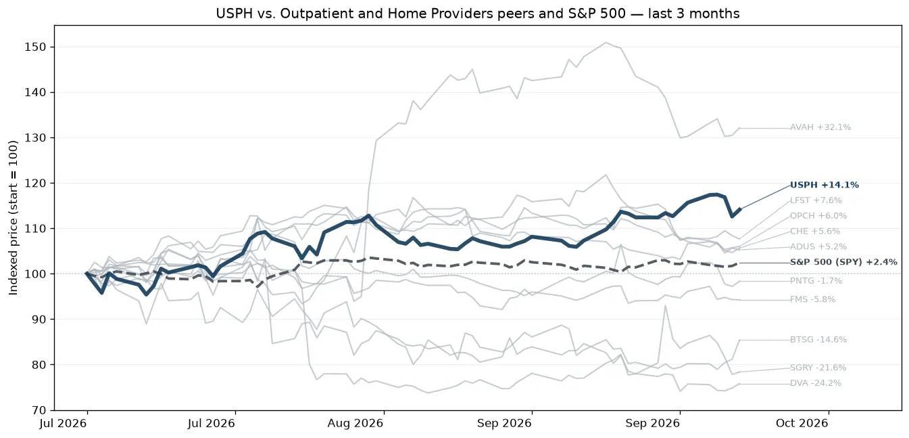

US Physical Therapy Inc through its subsidiaries operate outpatient physical therapy clinics that provide pre-and post-operative care and treatment for orthopedic-related disorders, sports-related injuries, preventative care, rehabilitation of injured workers, and neurological-related injuries. The principal payment sources for the clinics' services are managed care programs, commercial health insurance, Medicare/Medicaid, workers' compensation insurance, and proceeds from personal injury cases. Its operating segment includes Physical therapy operations and Industrial injury prevention services. The company generates maximum revenue from the Physical therapy operations segment.

<h3 id="company-btsg">BrightSpring Health Services (BTSG)</h3>

*Outpatient and Home Providers · $12.4B · 3m -12.7% · 12m +112.4% · 24m +308.2%*

[Google Finance](https://www.google.com/finance/quote/BTSG:NASDAQ?tab=earnings&hl=en)

provider of home and community-based healthcare services, including pharmacy, rehabilitation, primary care, and hospice.

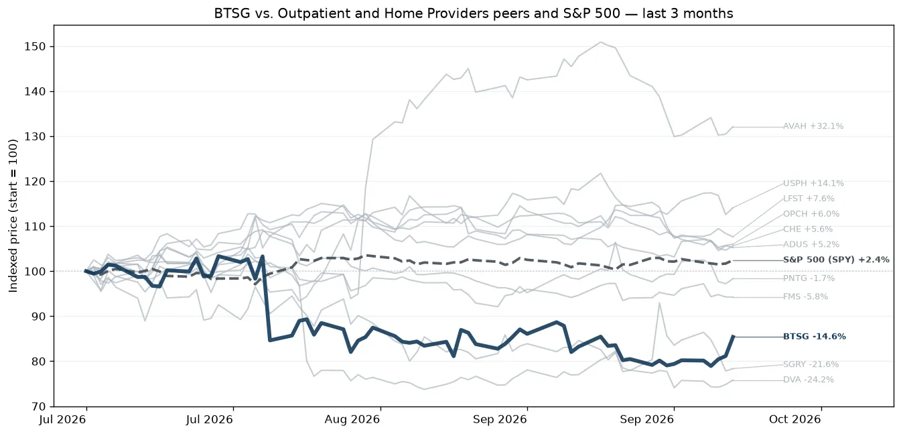

BrightSpring Health Services Inc is a home and community-based healthcare services platform, focused on delivering complementary pharmacy and provider services to complex patients. Its platform delivers clinical services and pharmacy solutions across Medicare, Medicaid, and commercially insured populations. Its segments include Pharmacy Solutions, Provider Services, and others. It generates the majority of its revenue from the Pharmacy Solutions segment.

<h3 id="company-avah">Aveanna Healthcare (AVAH)</h3>

*Outpatient and Home Providers · $2.0B · 3m +38.4% · 12m +45.9% · 24m +177.9%*

[Google Finance](https://www.google.com/finance/quote/AVAH:NASDAQ?tab=earnings&hl=en)

provider of pediatric and adult home healthcare, private-duty nursing, and hospice services.

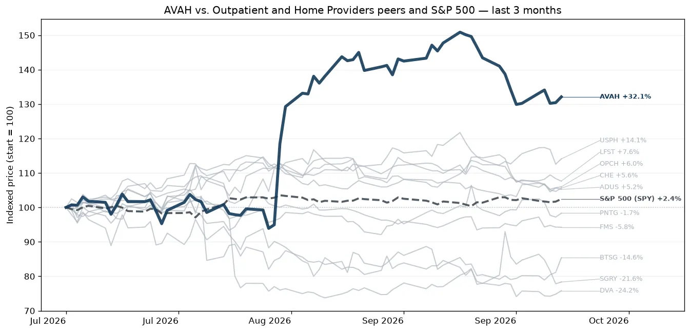

Aveanna Healthcare Holdings Inc is a diversified home care platform that provides care to medically complex, high-cost patient populations. It directly addresses the pressing challenges facing the U.S. healthcare system by providing safe, high-quality care in the home. The firm provides its services through three segments: Private Duty Services (PDS); Home Health & Hospice (HHH); and Medical Solutions (MS). The Private Duty Services segment generates the majority of revenue, which includes private duty skilled nursing services, non-clinical and personal care services, and pediatric therapy services, and is principally reimbursed by Medicaid and Medicaid MCO.

<h3 id="company-tdoc">Teladoc (TDOC)</h3>

*Digital Health, Specialty, Benefits · $1.2B · 3m -40.0% · 12m -38.7% · 24m -38.9%*

[Google Finance](https://www.google.com/finance/quote/TDOC:NYSE?tab=earnings&hl=en)

Largest pure-play virtual care platform, offering telemedicine, chronic-care management, and specialty virtual health services.

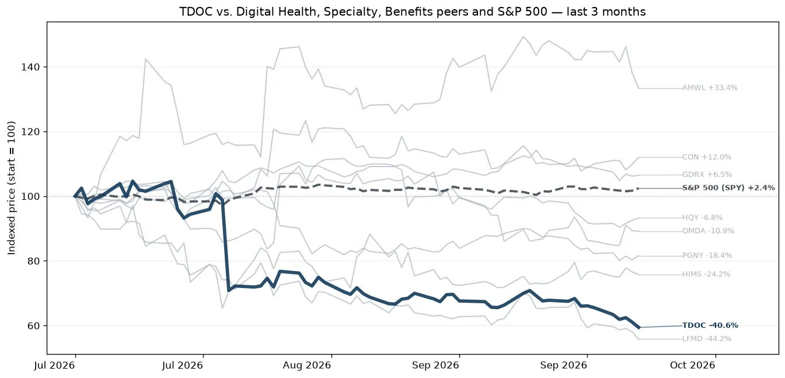

Teladoc Health Inc is engaged in the provision of virtual healthcare services, connecting patients, providers, and healthcare systems through technology-enabled platforms. The company has two reportable segments: Integrated Care and BetterHelp. The Integrated Care segment provides virtual healthcare solutions, including primary care, mental health, chronic care management, and telehealth enablement services for employers, insurers, and healthcare systems, mainly on a business-to-business basis, while the BetterHelp segment offers direct-to-consumer online mental health services, including counseling and therapy delivered through digital platforms. It generates the majority of its revenue from the Integrated Care segment.

<h3 id="company-amwl">Amwell (AMWL)</h3>

*Digital Health, Specialty, Benefits · $179.6M · 3m +33.9% · 12m +95.7% · 24m +32.4%*

[Google Finance](https://www.google.com/finance/quote/AMWL:NYSE?tab=earnings&hl=en)

Telehealth infrastructure company providing virtual-care technology.

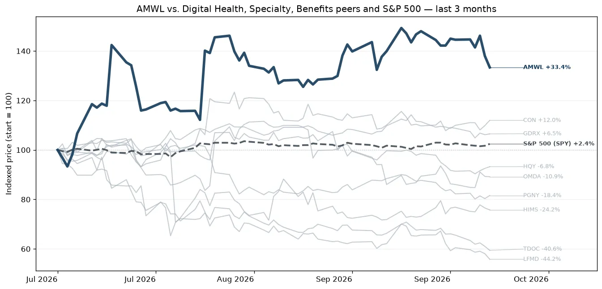

American Well Corp is an enterprise platform and software company digitally enabling hybrid care by offering payers and health systems a technology-enabled care platform. The Amwell Platform, its cloud-based enablement platform, digitally enables a scalable healthcare experience across all care settings by enabling critical services like virtual primary care, urgent care, clinical partner programs, scheduling visits, etc. Additionally, the healthcare providers can use the platform to access familiar workflows for taking notes, prescribing, referencing clinical treatment guidelines, and other related activities. The firm also offers various paid services, including licensed clinical staffing, implementation support, workflow design, etc, to help clients execute their hybrid care strategies.

<h3 id="company-hims">Hims &amp; Hers (HIMS)</h3>

*Digital Health, Specialty, Benefits · $6.4B · 3m -21.2% · 12m -44.8% · 24m +64.2%*

[Google Finance](https://www.google.com/finance/quote/HIMS:NYSE?tab=earnings&hl=en)

Direct-to-Consumer telehealth platform for primary care, weight management, mental health, sexual health, and wellness.

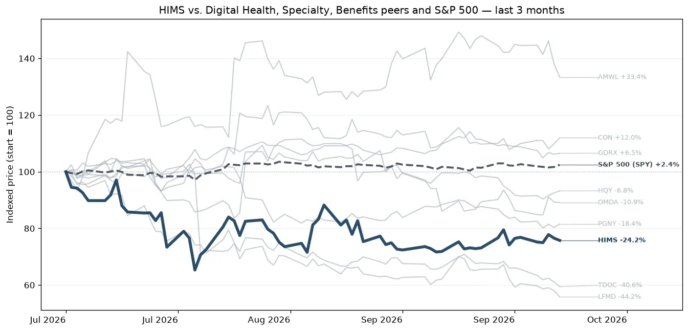

Hims & Hers, launched in 2017, is a telehealth platform that connects patients and healthcare providers to offer treatment options for specialties like erectile dysfunction, hair loss, skin care, mental health, and weight loss. Its offerings include generic, branded, and compounded prescription drugs as well as over-the-counter medicines, cosmetics, and supplements. The platform, which has more than 2 million subscribers, is available in all 50 states and certain European markets like the UK. It includes provider networks, electronic medical records, cloud pharmacy fulfillment, and personalization capabilities. Hims does not take insurance and only accepts payments directly from customers.

<h3 id="company-lfmd">LifeMD (LFMD)</h3>

*Digital Health, Specialty, Benefits · $169.3M · 3m -43.7% · 12m -60.7% · 24m -43.3%*

[Google Finance](https://www.google.com/finance/quote/LFMD:NASDAQ?tab=earnings&hl=en)

Virtual primary-care and telehealth company known for chronic condition management.

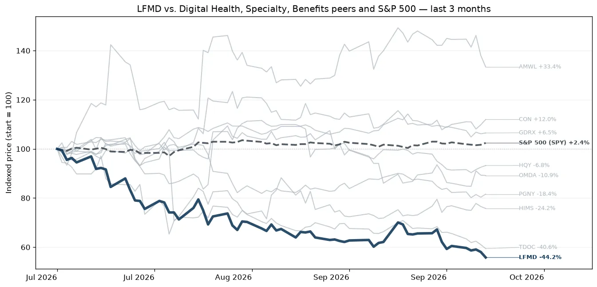

LifeMD Inc is a patient-centric, direct-to-patient healthcare company providing a high-quality, cost-effective, and convenient way for patients to access virtual medical care and pharmacy services. The Company's portfolio of brands within continuing operations is now managed as a single operating segment, Telehealth. Telehealth platform integrates core capabilities, includes: A nationwide pharmacy network, A wholly-owned commercial pharmacy, A fully integrated patient care center, A direct-to-patient marketing infrastructure for acquisition and retention, and AI-enabled clinical and operational technologies.

<h3 id="company-omda">Omada Health (OMDA)</h3>

*Digital Health, Specialty, Benefits · $1.2B · 3m -9.0% · 12m -6.9% · 24m n/a*

[Google Finance](https://www.google.com/finance/quote/OMDA:NASDAQ?tab=earnings&hl=en)

Virtual chronic-care platform focused on diabetes, hypertension, obesity, and musculoskeletal conditions through employers and health plans.

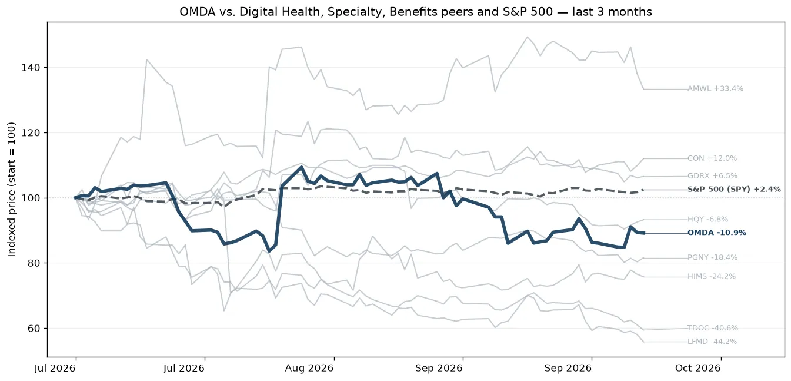

Omada Health Inc empowers individuals to make lasting health changes through personalized, virtual care between doctor's visits. The integrated platform of the company supports members with cardiometabolic conditions like prediabetes, diabetes, hypertension, musculoskeletal issues, and behavioral health needs. The company's specialized care tracks also assist members using GLP-1 medications. The company delivers measurable health outcomes and value for employers, health plans, health systems, and pharmacy benefit managers.

<h3 id="company-gdrx">GoodRx (GDRX)</h3>

*Digital Health, Specialty, Benefits · $1.0B · 3m +7.5% · 12m -27.6% · 24m -53.7%*

[Google Finance](https://www.google.com/finance/quote/GDRX:NASDAQ?tab=earnings&hl=en)

Prescription-pricing and healthcare-shopping platform that helps consumers find discounts on medications and healthcare services.

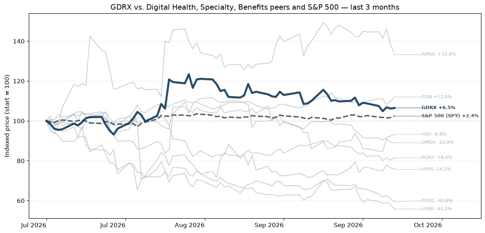

GoodRx Holdings Inc is a consumer-focused digital healthcare platform that aims to lower the cost of healthcare in the United States. It operates a price comparison platform that provides consumers with curated, geographically relevant prescription pricing, and provides access to negotiated prices through codes that can be used to save money on prescriptions across the United States. GoodRx generates revenue from core business from pharmacy benefit managers (PBMs) that manage formularies and prescription transactions including establishing pricing between consumers and pharmacies. It also offers various healthcare products and services, including pharma manufacturer solutions, subscriptions, and telehealth services.

<h3 id="company-pgny">Progyny (PGNY)</h3>

*Digital Health, Specialty, Benefits · $2.5B · 3m -16.5% · 12m +22.5% · 24m +54.8%*

[Google Finance](https://www.google.com/finance/quote/PGNY:NASDAQ?tab=earnings&hl=en)

fertility and family-building benefits manager that provides employer-sponsored fertility, maternity, and women's health programs.

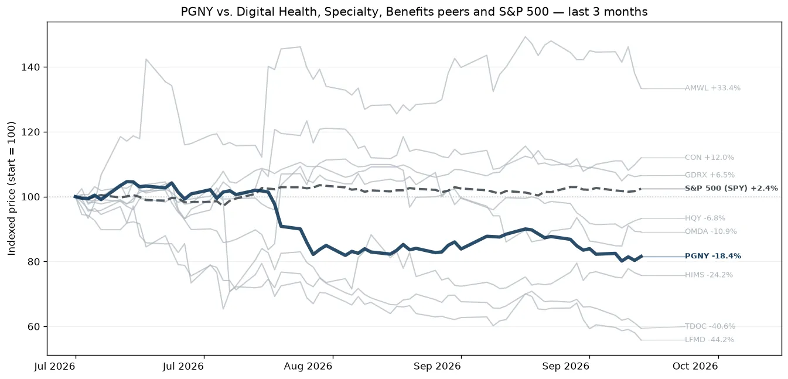

Progyny Inc is a benefits management company specializing in fertility, family building, and women's health benefits solutions. Its clients include employers across various industries. The fertility benefits solution consists of treatment services (Smart Cycles), access to the Progyny network of high-quality fertility specialists that perform the Smart Cycle treatments, and active management of the selective network of high-quality provider clinics.

<h3 id="company-con">Concentra Group (CON)</h3>

*Digital Health, Specialty, Benefits · $4.0B · 3m +11.7% · 12m +71.8% · 24m +70.0%*

[Google Finance](https://www.google.com/finance/quote/CON:NYSE?tab=earnings&hl=en)

leading provider of occupational health, workers’ compensation, and employer health services.

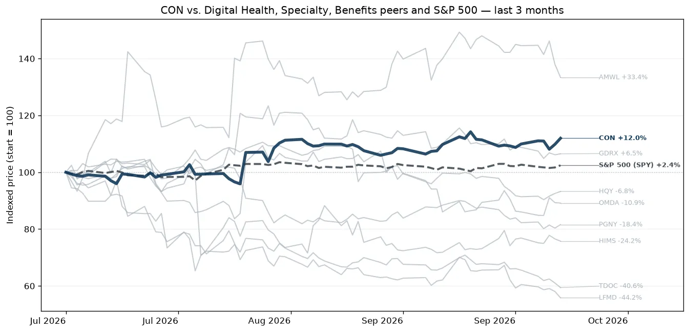

Concentra Group Holdings Parent Inc is a provider of occupational health services in the USA. The business is organized into three operating segments: occupational health centers, onsite health clinics, and other businesses.

<h3 id="company-hqy">HealthEquity (HQY)</h3>

*Digital Health, Specialty, Benefits · $8.8B · 3m -5.5% · 12m +1.6% · 24m +8.4%*

[Google Finance](https://www.google.com/finance/quote/HQY:NASDAQ?tab=earnings&hl=en)

administrator of health savings accounts (HSAs) and consumer-directed healthcare benefits.

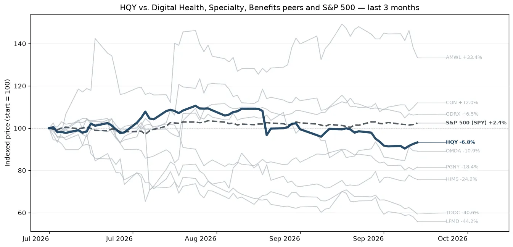

HealthEquity Inc provides solutions that allow consumers to make healthcare saving and spending decisions. It provides payment processing services, personalized benefit information, the ability to earn wellness incentives, and investment advice to grow their tax-advantaged healthcare savings. It manages consumers' tax-advantaged health savings accounts (HSAs) and other consumer-directed benefits (CDBs) offered by employers, including flexible spending accounts and health reimbursement arrangements (FSAs and HRAs), and administers Consolidated Omnibus Budget Reconciliation Act (COBRA), commuter and other benefits. It also provides investment advisory services to customers whose account balances exceed a certain threshold. HealthEquity generates its revenue in the United States.

<h3 id="company-orcl">Oracle-Cerner (ORCL)</h3>

*Health IT and Data · $374.1B · 3m +1.4% · 12m -50.3% · 24m -16.7%*

[Google Finance](https://www.google.com/finance/quote/ORCL:NYSE?tab=earnings&hl=en)

Largest healthcare IT platform vendor, providing EHRs, clinical workflow software, and healthcare data infrastructure.

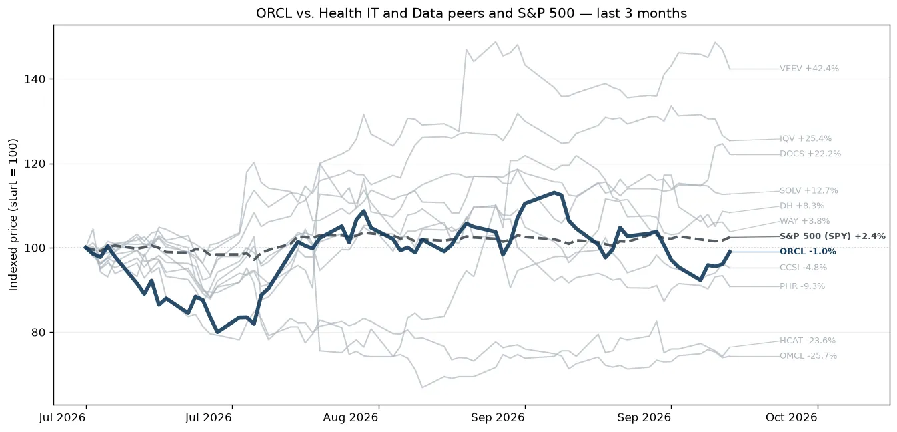

Oracle provides enterprise applications and infrastructure offerings through a variety of flexible IT deployment models, including on-premises, cloud-based, and hybrid. Founded in 1977, Oracle pioneered the first commercial SQL-based relational database management system, which is commonly used by the world's largest companies for high-volume online transaction processing workloads. Besides databases, Oracle also sells enterprise resource planning platforms and cloud infrastructure that play an increasingly important role in large language model training and inferencing.

<h3 id="company-way">Waystar (WAY)</h3>

*Health IT and Data · $4.0B · 3m +5.8% · 12m -35.8% · 24m -8.2%*

[Google Finance](https://www.google.com/finance/quote/WAY:NASDAQ?tab=earnings&hl=en)

Healthcare payments and revenue cycle platform.

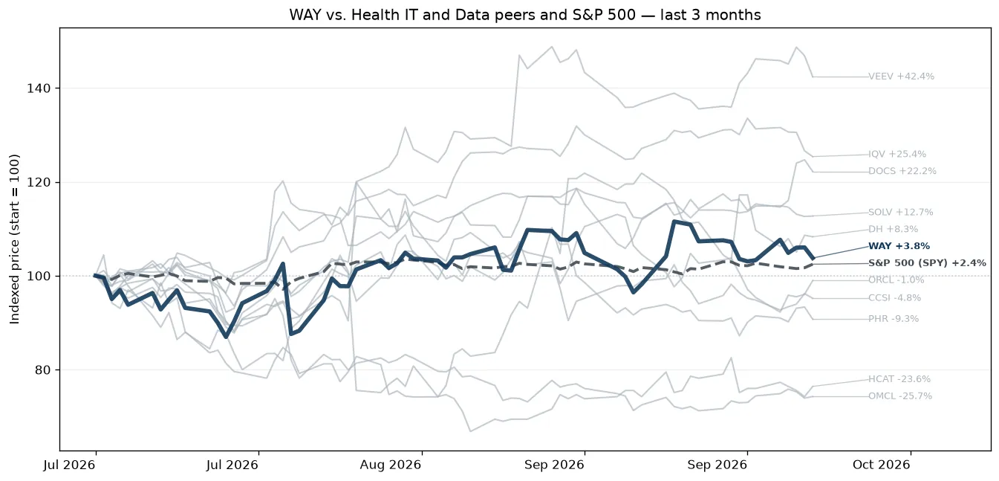

Waystar Holding Corp is a provider of mission-critical cloud technology to healthcare organizations. Its enterprise-grade platform transforms the complex and disparate processes comprising healthcare payments received by healthcare providers from payers and patients, from pre-service engagement through post-service remittance and reconciliation. its platform enhances data integrity, eliminates manual tasks, and improves claim and billing accuracy, which results in transparency, reduced labor costs, and faster, more accurate reimbursement and cash flow. The market for solutions extends throughout the United States and includes Puerto Rico and other USA Territories.

<h3 id="company-solv">Solventum (SOLV)</h3>

*Health IT and Data · $13.6B · 3m +12.2% · 12m +18.7% · 24m +29.7%*

[Google Finance](https://www.google.com/finance/quote/SOLV:NYSE?tab=earnings&hl=en)

Revenue-cycle, clinical documentation, coding, and healthcare workflow solutions.

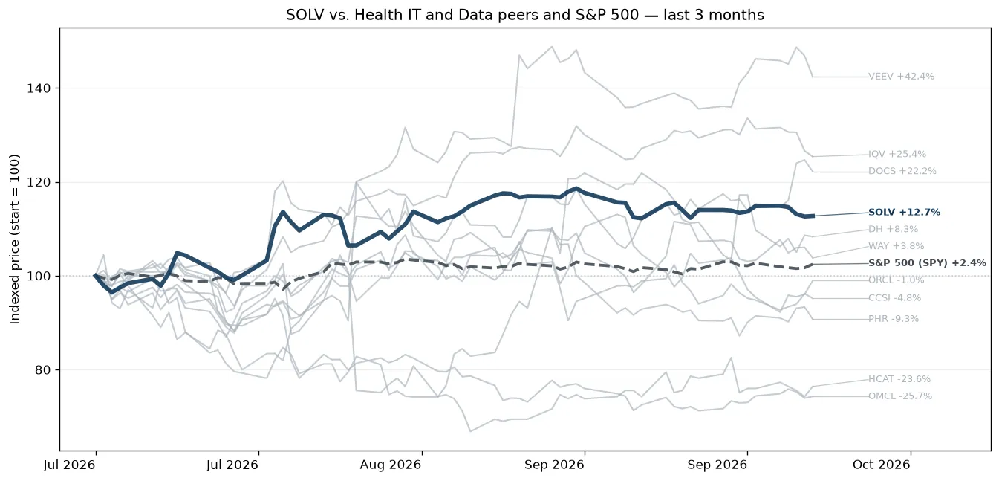

Solventum Corp is a healthcare company developing, manufacturing, and commercializing solutions leveraging material science, data science, and digital capabilities to address customer and patient needs. Its segments include MedSurg, which earns maximum revenue and provides wound therapy, I.V. site management, surgical supplies, medical tapes and wraps, stethoscopes, medical electrodes, and OEM medical technologies; Dental Solutions, offering dental and orthodontic products such as brackets, restorative cements, and bonding agents; and Health Information Systems, providing software solutions including physician documentation, coding automation, speech recognition, and data visualization platforms. It operates in the United States, which earns the majority of revenue, and internationally.

<h3 id="company-phr">Phreesia (PHR)</h3>

*Health IT and Data · $663.2M · 3m -8.0% · 12m -56.7% · 24m -54.6%*

[Google Finance](https://www.google.com/finance/quote/PHR:NYSE?tab=earnings&hl=en)

Patient-intake and engagement platform that digitizes registration, scheduling, intake forms, payments, and communications.

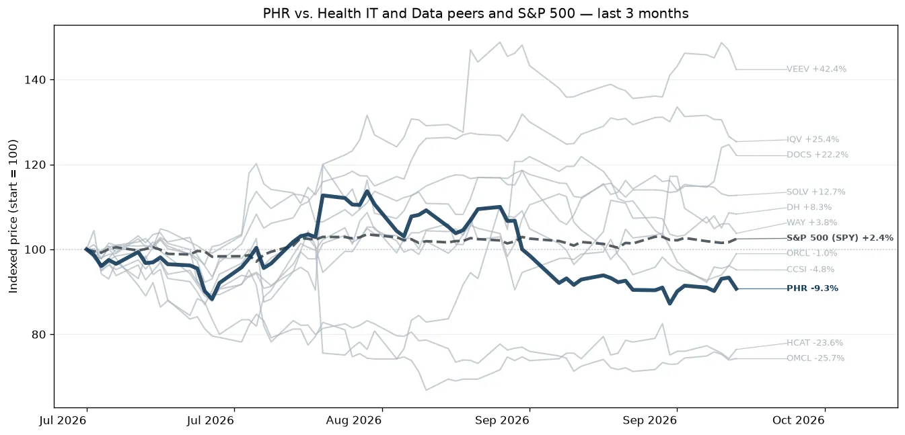

Phreesia Inc is a provides an integrated software, payments, and engagement platform designed to address three foundational challenges in healthcare delivery: access to care, affordability of care, and patient health outcomes. Its platform is embedded directly into provider workflows and patient interactions, enabling healthcare organizations to activate patients, streamline administrative processes, and improve financial performance across the care continuum. The group serves a diverse group of healthcare organizations, including ambulatory practices, health systems, and hospitals, as well as life sciences companies, government entities, patient advocacy, public interest, and not-for-profit and other organizations.

<h3 id="company-ccsi">Consensus Cloud Solutions (CCSI)</h3>

*Health IT and Data · $669.7M · 3m -6.8% · 12m +27.1% · 24m +59.5%*

[Google Finance](https://www.google.com/finance/quote/CCSI:NASDAQ?tab=earnings&hl=en)

Healthcare-focused cloud communications company known for secure-faxing, interoperability, and clinical document exchange.

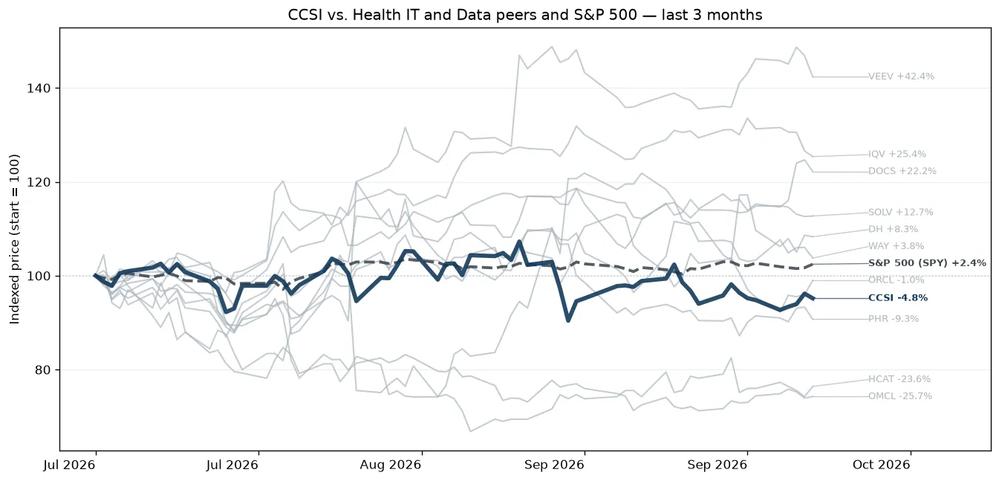

Consensus Cloud Solutions Inc is a provider of secure information delivery services with a scalable Software-as-a-Service SaaS platform. It is engaged in the fax cloud business. The company's offerings include communication, data extraction, and digital signature solutions that enable users to securely access, exchange, and manage information across organizational and geographic boundaries. It serves multiple industry verticals, including healthcare, government, financial services, legal, and education. Geographically, the company operates in the United States, Canada, Ireland, and other countries. It derives the maximum revenue from the United States.

<h3 id="company-dh">Definitive Healthcare (DH)</h3>

*Health IT and Data · $85.5M · 3m +19.7% · 12m -72.7% · 24m -78.5%*

[Google Finance](https://www.google.com/finance/quote/DH:NASDAQ?tab=earnings&hl=en)

Healthcare data providers for provider, hospital, physician, and payer intelligence databases.

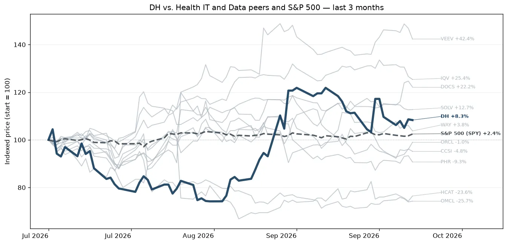

Definitive Healthcare Corp is a provider of healthcare commercial intelligence. Its SaaS-based healthcare commercial intelligence platform is designed to provide comprehensive and accurate information on the healthcare ecosystem in the U.S. The platform uses deep analytics and data science to help customers develop data-driven strategic decisions, such as finding new markets to enter, building comprehensive go-to-market strategies, accessing tactical information to help target the right decision makers, and improving win rates with detailed contextual information. The company derives substantially all of its revenue from the sale of subscription fees for access to its platform and stand-ready support. Geographically, it derives a majority of its revenue from the United States.

<h3 id="company-iqv">Iqvia (IQV)</h3>

*Health IT and Data · $38.7B · 3m +24.7% · 12m +25.0% · 24m +12.3%*

[Google Finance](https://www.google.com/finance/quote/IQV:NYSE?tab=earnings&hl=en)

Dominant healthcare data, analytics, and contract research organization, supplying pharmaceutical companies with clinical reearch and commercial intelligence.

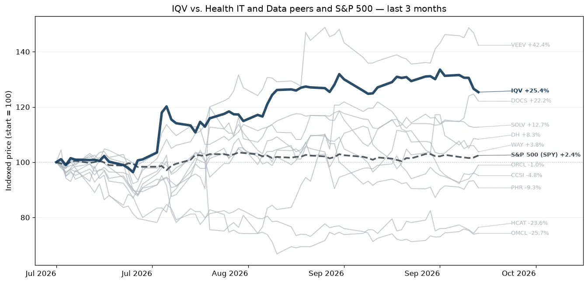

Iqvia is a global leader in clinical research and technology solutions for the life science industry. Formed in 2016 from the merger of Quintiles and IMS Health, it combined clinical trial services with extensive healthcare data and analytics. Its research and development solutions segment provides outsourced clinical development services spanning drug discovery, trial design, patient recruitment, site management, clinical testing, real-world studies, and the regulatory approval process. Its commercial solutions segment helps companies optimize product commercialization through analytics, technology, and outsourced sales and medical services. Together, Iqvia supports customers across the life science industry, and it serves biopharmaceutical firms, providers, payers, and policymakers.

<h3 id="company-hcat">Health Catalyst (HCAT)</h3>

*Health IT and Data · $154.4M · 3m -15.9% · 12m -40.9% · 24m -77.3%*

[Google Finance](https://www.google.com/finance/quote/HCAT:NASDAQ?tab=earnings&hl=en)

Healthcare analytics and data-platform company that helps providers improve clinical, operational, and financial performance.

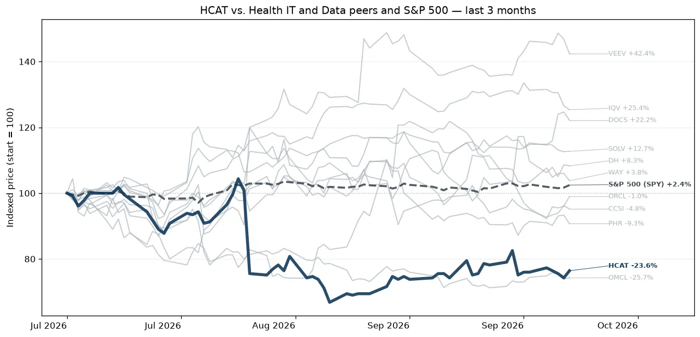

Health Catalyst Inc provides data and analytics technology and services to healthcare organizations. It has two operating segments. The Technology segment, the key revenue driver, includes data platform, analytics applications and support services and generates revenues mainly from contracts that are cloud-based subscription arrangements, time-based license arrangements, and maintenance and support fees; the Professional Services segment is generally the combination of analytics, implementation, strategic advisory, outsourcing, and improvement services to deliver expertise to its customers to more fully configure and utilize the benefits of the technology offerings.

<h3 id="company-docs">Doximity (DOCS)</h3>

*Health IT and Data · $3.8B · 3m +27.8% · 12m -61.9% · 24m -36.3%*

[Google Finance](https://www.google.com/finance/quote/DOCS:NYSE?tab=earnings&hl=en)

Professional network for physicians, combining recruiting, communications, telehealth, and workflow tools.

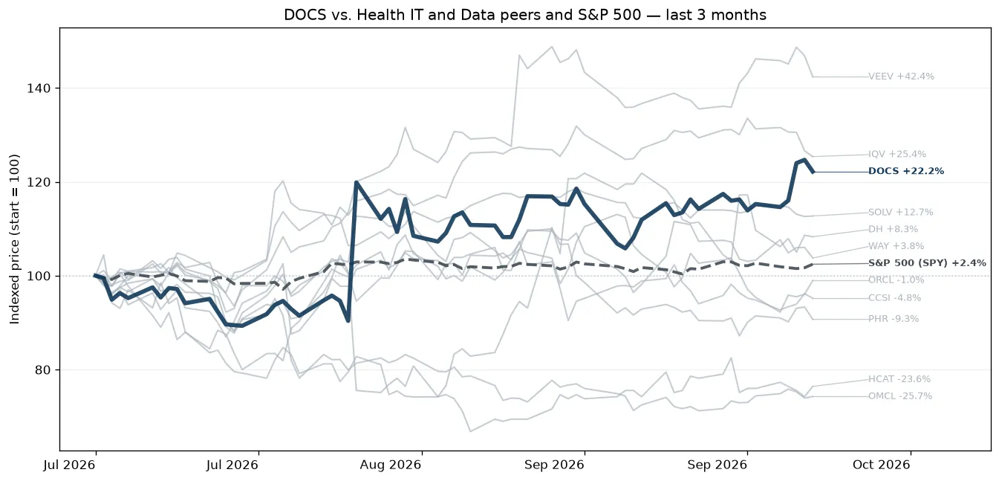

Doximity Inc provides an online platform, which enables physicians and other healthcare professionals to collaborate with colleagues, stay up to date with the latest medical news and research, manage their careers and on-call schedules, streamline documentation and administrative paperwork, and conduct virtual patient visits. The Company's customers include pharmaceutical companies and health systems that connect with healthcare professionals through the Company's digital Marketing, Hiring, and Workflow Solutions. Marketing Solutions provide customers with the ability to share tailored content on the network. Hiring Solutions enable customers to identify, connect with, and hire from the network of both active and passive potential medical professional candidates.

<h3 id="company-veev">Veeva Systems (VEEV)</h3>

*Health IT and Data · $33.1B · 3m +41.8% · 12m -7.7% · 24m +33.5%*

[Google Finance](https://www.google.com/finance/quote/VEEV:NYSE?tab=earnings&hl=en)

Leading cloud-software provider for life sciences companies, supporting CRM, clinical trails, regulatory processes, and commercialization.

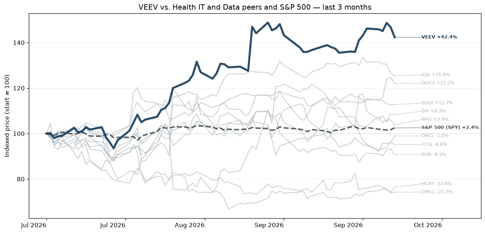

Veeva is the global leading supplier of cloud-based software solutions for the life sciences industry. The company's best-of-breed offerings address operating and regulatory requirements for customers ranging from small, emerging biotechnology companies to departments of global pharmaceutical manufacturers. The company leverages its domain expertise to improve the efficiency and compliance of the underserved life sciences industry, displacing large, highly customized and dated enterprise resource planning systems that have limited flexibility. Its two main products are Veeva CRM, a customer relationship management platform for companies with a salesforce, and Veeva Vault, a content management platform that tackles various functions within any life sciences company.

<h3 id="company-omcl">Omnicell (OMCL)</h3>

*Health IT and Data · $1.7B · 3m -21.9% · 12m +8.6% · 24m -20.7%*

[Google Finance](https://www.google.com/finance/quote/OMCL:NASDAQ?tab=earnings&hl=en)

Pharmacy automation, medication management, and healthcare workflow software.

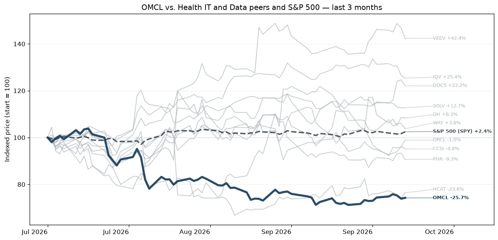

Omnicell Inc provides automation and business analytics software for healthcare providers. The company is engaged in transforming the pharmacy and nursing care delivery model. The company helps its customers define and deliver cost-effective medication management designed to equip and empower pharmacists and nurses to focus on patient care rather than administrative tasks and drive improved clinical, operational, and financial outcomes across all care settings. The company derives the majority of its revenue from the United States.

<h3 id="company-mck">McKesson (MCK)</h3>

*Pharma Distribution · $97.2B · 3m +14.8% · 12m +22.3% · 24m +85.9%*

[Google Finance](https://www.google.com/finance/quote/MCK:NYSE?tab=earnings&hl=en)

Largest pharmaceutical distributor in North America.

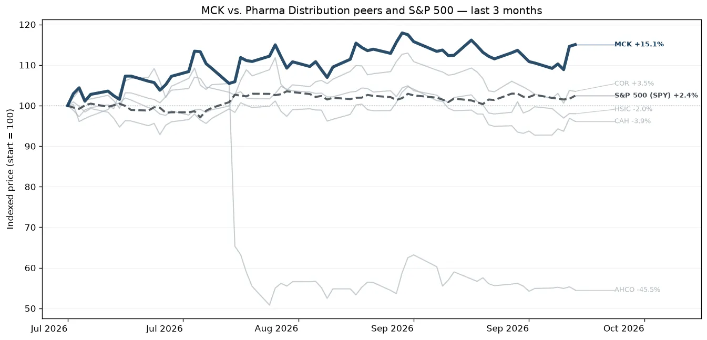

McKesson is one of three leading pharmaceutical wholesalers in the US engaged in sourcing and distributing branded, generic, and specialty pharmaceutical products to pharmacies (retail chains, independent, and mail order), hospitals networks, and healthcare providers. Along with Cencora and Cardinal Health, the three account for over 90% of the US pharmaceutical wholesale industry. Outside the US market, McKesson engages in pharmaceutical wholesale and distribution in Canada. Additionally, the company supplies medical-surgical products and equipment to healthcare facilities and provides a variety of technology solutions for pharmacies.

<h3 id="company-cah">Cardinal Health (CAH)</h3>

*Pharma Distribution · $54.7B · 3m -4.5% · 12m +47.8% · 24m +103.9%*

[Google Finance](https://www.google.com/finance/quote/CAH:NYSE?tab=earnings&hl=en)

One of the big three drug wholesalesrs, providing pharma distribution, medical products, and supply chain services.

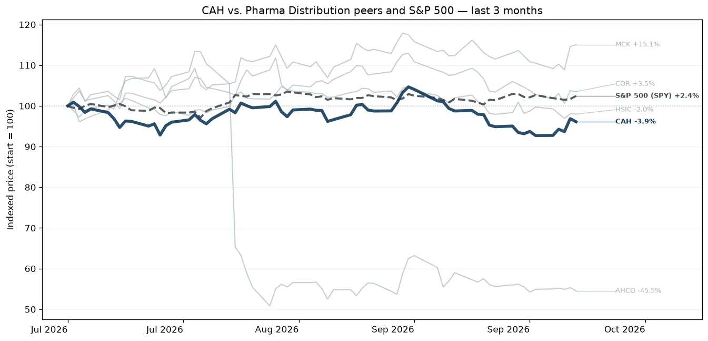

Cardinal Health is one of three leading pharmaceutical wholesalers in the US, engaged in sourcing and distributing of branded, generic, and specialty pharmaceutical products to pharmacies (retail chains, independent, and mail order), hospital networks, and healthcare providers. Cardinal, Cencora, and McKesson hold well over 90% of the US pharmaceutical wholesale industry. Cardinal Health also supplies medical-surgical products and equipment to healthcare facilities in North America, Europe, and Asia.

<h3 id="company-cor">Cencora (COR)</h3>

*Pharma Distribution · $59.6B · 3m +4.2% · 12m +2.1% · 24m +40.5%*

[Google Finance](https://www.google.com/finance/quote/COR:NYSE?tab=earnings&hl=en)

Formerly AmerisourceBergen, Global pharmaceutical distribution and specialty-services leader.

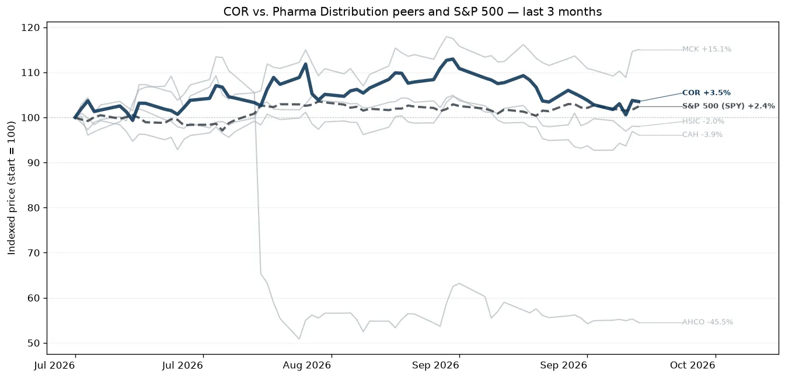

Cencora is one of three leading domestic pharmaceutical wholesalers. It sources and distributes branded, generic, and specialty pharmaceutical products to pharmacies (retail chains, independent, and mail order), hospital networks, and healthcare providers. It and McKesson and Cardinal Health hold over 90% share of the US pharmaceutical wholesale industry. Cencora also provides commercialization services for manufacturers of pharmaceuticals and medical devices, global specialty drug logistics (World Courier), and animal health product distribution (MWI Animal Health). Cencora expanded its international presence in 2021 by purchasing Alliance Healthcare, one of the leading drug wholesalers in Europe.

<h3 id="company-ahco">Accendra Health (AHCO)</h3>

*Pharma Distribution · $912.9M · 3m -48.0% · 12m -38.4% · 24m -46.4%*

[Google Finance](https://www.google.com/finance/quote/AHCO:NASDAQ?tab=earnings&hl=en)

Medical and Surgical supply distributor with a significant healthcare logistics business.

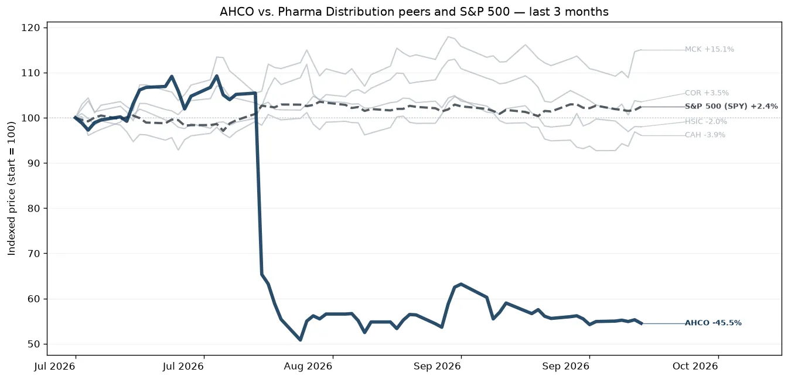

AdaptHealth Corp is engaged in providing patient-centered, healthcare-at-home solutions including home medical equipment (HME), medical supplies, and related services. The Company operates under four reportable segments that align with its product categories: (i) Sleep Health, (ii) Respiratory Health, (iii) Diabetes Health, and (iv) Wellness at Home. The company generates majority of its revenue from the Sleep Health segment. The Sleep Health segment provides sleep therapy equipment, supplies and related services (including continuous positive airway pressure and BiLevel services) to individuals for the treatment of obstructive sleep apnea.

<h3 id="company-hsic">Henry Schein (HSIC)</h3>

*Pharma Distribution · $10.2B · 3m -1.8% · 12m +26.6% · 24m +20.3%*

[Google Finance](https://www.google.com/finance/quote/HSIC:NASDAQ?tab=earnings&hl=en)

Leading dental product, tech, and physician office supply distributor.

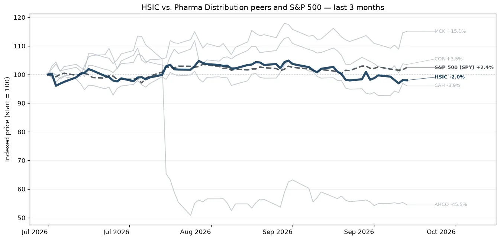

Henry Schein Inc is a solutions company for healthcare professionals. It offers healthcare equipment, products, and services to office-based dental and medical practitioners, as well as alternative sites of care. The company's reportable segments are: Global Distribution and Value-Added Services, Global Specialty Products, and Global Technology. It generates maximum revenue from the Global Distribution and Value-Added Services segment, which includes distribution to the dental and medical markets of national brand and corporate brand merchandise, as well as equipment and related technical services. This segment also includes value-added services such as financial services, continuing education services, consulting, and other practice services.

<h3 id="company-ntra">Natera (NTRA)</h3>

*Precision Diagnostics · $39.4B · 3m +46.9% · 12m +145.2% · 24m +216.0%*

[Google Finance](https://www.google.com/finance/quote/NTRA:NASDAQ?tab=earnings&hl=en)

molecular diagnostics leader using cell-free DNA testing for prenatal screening, oncology monitoring, and transplant surveillance.

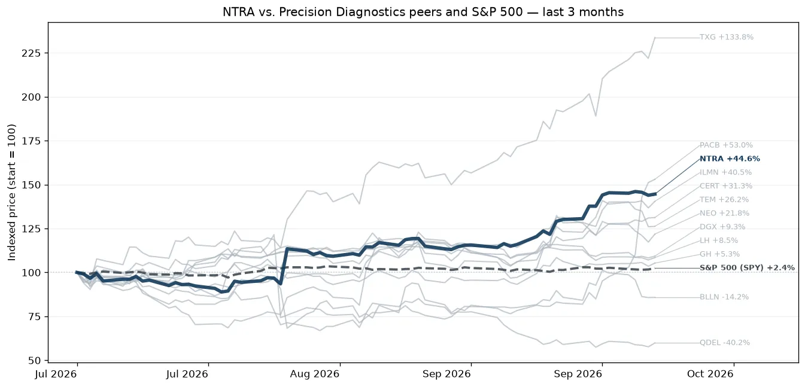

Natera Inc is a diagnostic and research company with proprietary molecular and bioinformatics technology. The company's key product offerings include its Panorama Non-Invasive Prenatal Test (NIPT) which screens for chromosomal abnormalities of a fetus as well as in twin pregnancies, typically with a blood draw from the mother, Horizon Carrier Screening (HCS) to determine carrier status for a large number of severe genetic diseases that could be passed on to the carrier's children, Signatera molecular residual disease (MRD) test, which detects circulating tumor DNA in patients previously diagnosed with cancer to assess molecular residual disease and monitor for recurrence; and Prospera, to assess organ transplant rejection.

<h3 id="company-neo">NeoGenomics (NEO)</h3>

*Precision Diagnostics · $2.1B · 3m +21.8% · 12m +103.0% · 24m +32.5%*

[Google Finance](https://www.google.com/finance/quote/NEO:NASDAQ?tab=earnings&hl=en)

precision oncology diagnostics company providing cancer testing, genomic profiling, and biomarker services.

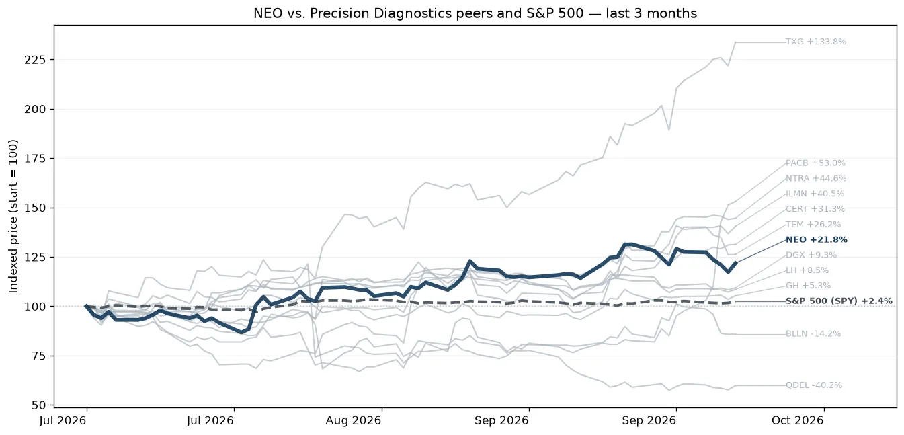

NeoGenomics Inc provides oncology diagnostic testing and consultative services which include technical laboratory services and professional interpretation of laboratory test results by licensed physicians or molecular experts in pathology and oncology. The company operates a network of cancer-focused testing laboratories in the United States and the United Kingdom. The company operates in a single segment and derives revenue from clients by providing clinical cancer testing, interpretation, and consultative services, molecular and NGS testing, comprehensive technical and professional services offerings, clinical trials and research, validation laboratory services, and oncology data solutions.

<h3 id="company-blln">BillionToOne (BLLN)</h3>

*Precision Diagnostics · $6.5B · 3m -12.0% · 12m n/a · 24m n/a*

[Google Finance](https://www.google.com/finance/quote/BLLN:NASDAQ?tab=earnings&hl=en)

molecular diagnostics company focused on prenatal screening and precision oncology testing.

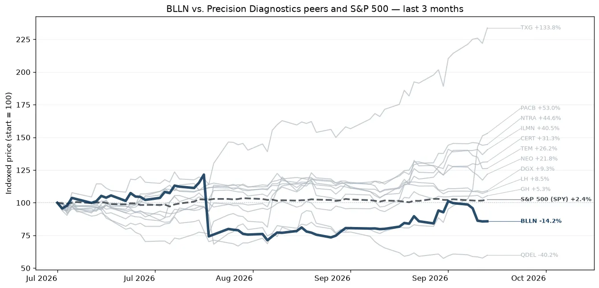

BillionToOne Inc is a molecular diagnostics company. It offers a portfolio of ultrasensitive tests covering prenatal genetic testing, cancer therapy selection, and response monitoring, which are based on its Quantitative Counting Templates (QCT) molecular counting platform. The company's product portfolio comprises UNITY, a portfolio of prenatal testing products that can conduct fetal risk analysis without requiring a paternal sample; Northstar Select, a ultrasensitive liquid biopsy test that provides insights into appropriate therapies for stage III or IV cancer patients; and Northstar Response, a tissue-free, pan-cancer, liquid biopsy test that measures several genomic loci uniquely methylated in cancer to provide insight into dynamic changes in therapy response.

<h3 id="company-gh">Guardant Health (GH)</h3>

*Precision Diagnostics · $21.4B · 3m +5.8% · 12m +182.9% · 24m +702.3%*

[Google Finance](https://www.google.com/finance/quote/GH:NASDAQ?tab=earnings&hl=en)

liquid-biopsy leader using blood-based genomic testing for cancer detection, treatment selection, and disease monitoring.

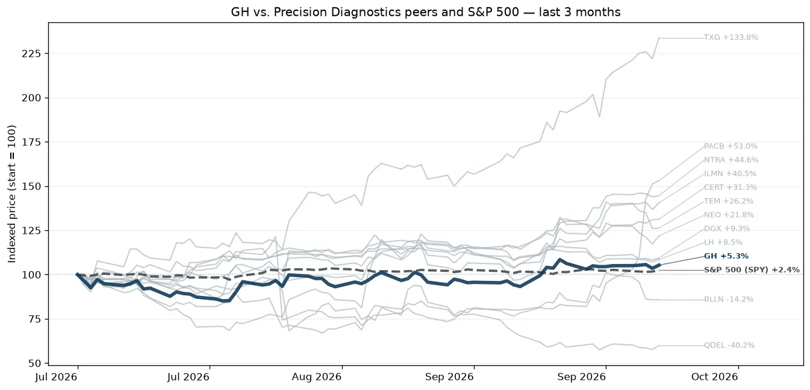

Guardant Health, based in Redwood City, California, is a leader in liquid-based cancer tests for clinical and research use. The company's main franchises are Guardant360 for genomic profiling of tumors, Reveal for molecular residual disease testing, and Shield for colorectal cancer screening. Additionally, Guardant offers research development services such as regulatory approval consultancy and clinical trial referrals.

<h3 id="company-tem">Tempus AI (TEM)</h3>

*Precision Diagnostics · $8.5B · 3m +27.1% · 12m -16.4% · 24m +44.7%*

[Google Finance](https://www.google.com/finance/quote/TEM:NASDAQ?tab=earnings&hl=en)

precision medicine company combining genomic testing, clinical data, and artificial intelligence to support treatment decisions and drug development.

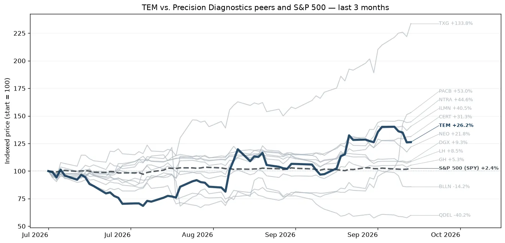

Tempus AI Inc is a technology company. It has built the Tempus Platform, which comprises both a technology platform to free healthcare data from silos and an operating system to make the resulting data useful. Its Intelligent Diagnostics use AI, including generative AI, to make laboratory tests more accurate, tailored, and personal.

<h3 id="company-ilmn">Illumina (ILMN)</h3>

*Precision Diagnostics · $30.7B · 3m +44.7% · 12m +167.4% · 24m +93.1%*

[Google Finance](https://www.google.com/finance/quote/ILMN:NASDAQ?tab=earnings&hl=en)

leading DNA sequencing platform company providing foundational technology for genomics research and clinical testing.

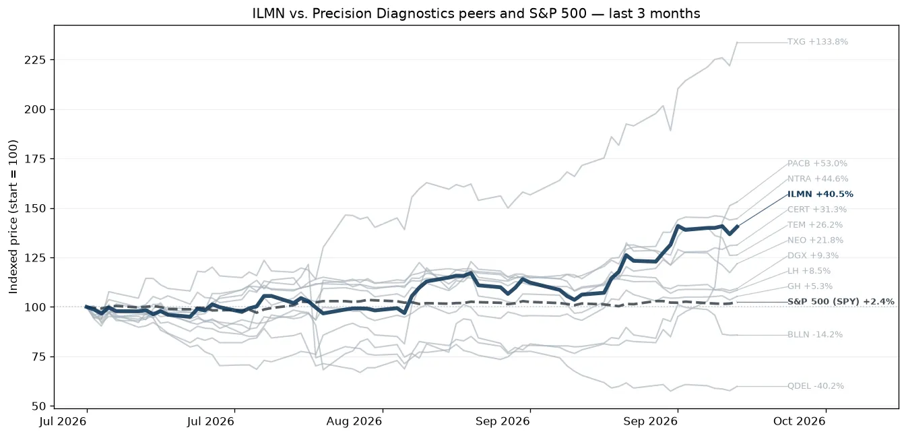

Illumina provides tools and services to analyze genetic material with life science and clinical lab applications. The company generates over 90% of its revenue from sequencing instruments, consumables, and services. Illumina's high-throughput technology enables whole genome sequencing in humans and other large organisms. Its lower throughput tools enable applications that require smaller data outputs, such as viral and cancer tumor screening. Illumina also sells microarrays that enable lower-cost, focused genetic screening with primarily consumer and agricultural applications.

<h3 id="company-txg">10x Genomics (TXG)</h3>

*Precision Diagnostics · $6.1B · 3m +139.7% · 12m +633.3% · 24m +367.0%*

[Google Finance](https://www.google.com/finance/quote/TXG:NASDAQ?tab=earnings&hl=en)

leader in single-cell and spatial biology technologies used in genomics research and drug discovery.

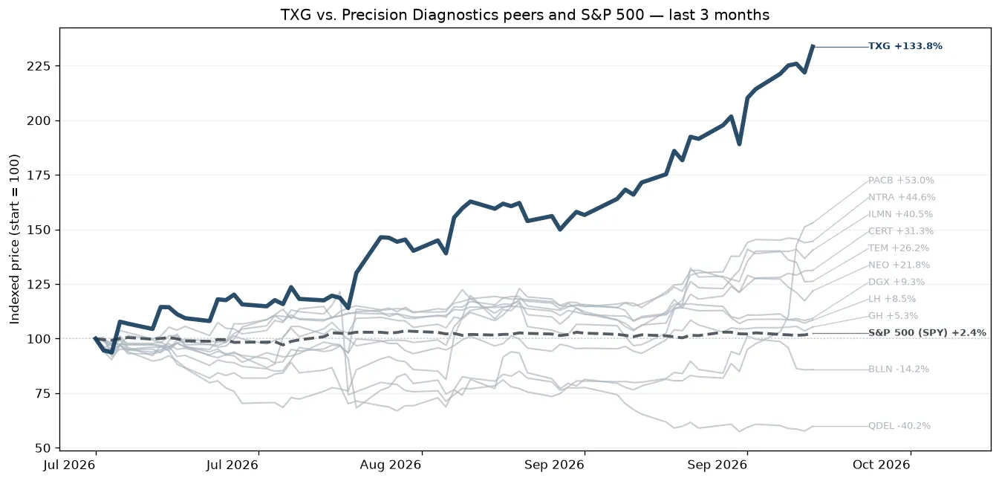

10x Genomics Inc is a life science technology company based in the United States. Its solutions include instruments, consumables, and software for analyzing biological systems. The company's integrated solutions include instruments, consumables, and software for analyzing biological systems at a resolution and scale that matches the complexity of biology. Its product offerings include a Chromium platform comprising microfluidic chips and related consumables, Chromium X series, Visium and Xenium platforms, and others, which are predominantly used for the study of biological components. Geographically, the company derives operates from the United States and the rest from Americas (excluding the United States), Europe, Middle East and Africa, China, and Asia-Pacific (excluding China).

<h3 id="company-pacb">PacBio (PACB)</h3>

*Precision Diagnostics · $447.3M · 3m +51.2% · 12m +70.5% · 24m +47.7%*

[Google Finance](https://www.google.com/finance/quote/PACB:NASDAQ?tab=earnings&hl=en)

developer of long-read DNA sequencing technologies used to analyze complex genomes.

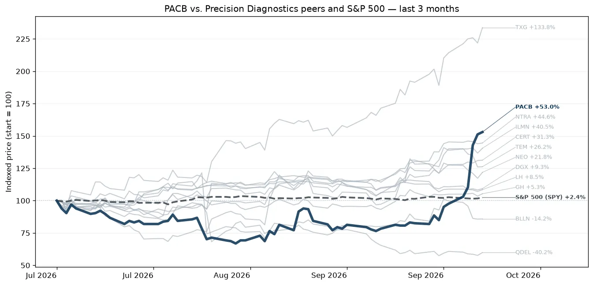

Pacific Biosciences of California Inc is a biotechnology company focused on designing, developing, and manufacturing sequencing solutions that enable scientists and clinical researchers to improve their understanding of the genome and ultimately, resolve genetically complex problems. It operates in, one reportable segment: the development, manufacturing, and marketing of an integrated platform for genetic analysis. The majority of the company's revenue is derived from Americas, followed by Europe Middle East, and Africa and Asia-Pacific.

<h3 id="company-qdel">QuidelOrtho (QDEL)</h3>

*Precision Diagnostics · $1.2B · 3m -41.0% · 12m -64.1% · 24m -75.4%*

[Google Finance](https://www.google.com/finance/quote/QDEL:NASDAQ?tab=earnings&hl=en)

diagnostics company providing clinical laboratory, immunoassay, and point-of-care testing solutions.

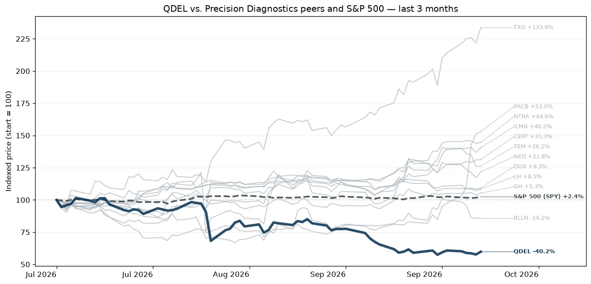

QuidelOrtho Corp is engaged in the development, manufacturing, and marketing of rapid diagnostic testing solutions. The company is engaged in immunoassay and molecular testing, clinical chemistry, and transfusion medicine, which helps clinicians and patients to make decisions across the globe. Geographically, the company has its presence in North America, EMEA, China, and Other countries. It generates the majority of its revenue from North America.

<h3 id="company-dgx">Quest Diagnostics (DGX)</h3>

*Precision Diagnostics · $25.8B · 3m +8.2% · 12m +30.1% · 24m +54.7%*

[Google Finance](https://www.google.com/finance/quote/DGX:NYSE?tab=earnings&hl=en)

largest U.S. independent clinical laboratory and diagnostic testing company.

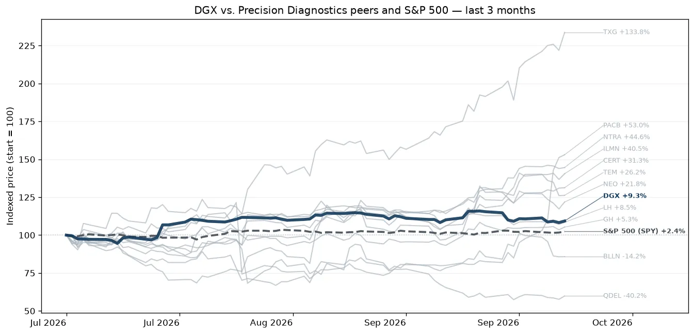

Quest Diagnostics is a leading independent provider of diagnostic testing, information, and services in the US. The company generates over 97% of its revenue through clinical testing, anatomic pathology, esoteric testing, and substance abuse testing with specimens collected at its national network of roughly 2,400 patient service centers, as well as multiple doctors offices and hospitals. The firm also runs a much smaller diagnostic solutions segment that provides clinical trials testing, risk-assessment services, and information technology solutions.

<h3 id="company-lh">Labcorp Holdings (LH)</h3>

*Precision Diagnostics · $25.3B · 3m +7.5% · 12m +11.4% · 24m +42.8%*

[Google Finance](https://www.google.com/finance/quote/LH:NYSE?tab=earnings&hl=en)

leading diagnostics and laboratory services company with substantial genomic and specialty testing capabilities.

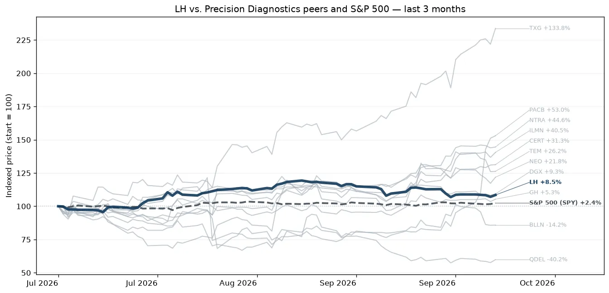

Labcorp is one of the nation's two largest independent clinical laboratories, with roughly 20% of the independent lab market. The company operates approximately 2,000 patient-service centers, offering a broad range of 5,000 clinical lab tests, ranging from uncomplicated routine blood and urine screens to complex oncology and genomic testing.

<h3 id="company-cert">Certara (CERT)</h3>

*Precision Diagnostics · $1.2B · 3m +34.3% · 12m -28.4% · 24m -15.6%*

[Google Finance](https://www.google.com/finance/quote/CERT:NASDAQ?tab=earnings&hl=en)

biosimulation and data-driven drug development company supporting precision medicine and clinical development.

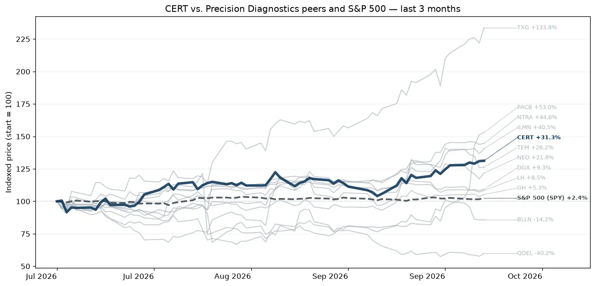

Certara Inc accelerates medicines to patients using biosimulation software and technology to transform traditional drug discovery and development. It provides modeling and simulation, regulatory science, and assessment software and services to help clients reduce clinical trials, accelerate regulatory approval, and increase patient access to medicines. The company has its business presence in the Americas, which is also its key revenue-generating market, EMEA, and the Asia Pacific region.

