# Life Science and Device Intel

<strong>Week of September 7, 2026</strong>Market data through: September 4, 2026Narrative created: September 7, 2026

Weekly review of pharmaceutical, biotech, biologics, and medical-device company performance, changes, earnings activity, and strategy narrative.

## In the News

<h3 id="executive-view">Executive View</h3>

- **The first large cardiovascular-outcomes test of Lp(a) lowering failed.** Pelacarsen reduced the biomarker but not cardiovascular events, weakening confidence that Lp(a) reduction alone will translate into benefit and materially raising the evidentiary bar for Amgen’s olpasiran and Lilly’s lepodisiran. ([novartis.com](https://www.novartis.com/news/media-releases/novartis-announces-lpahorizon-phase-iii-topline-results-pelacarsen-patients-elevated-lpa-and-established-cardiovascular-disease-cvd))
- **Fatal inflammatory events reset the risk assessment for autoimmune CAR-T.** Novartis paused eight rap-cel studies after three deaths from complications of IEC-HS; Bristol Myers Squibb separately paused zola-cel enrollment following inflammatory events. ([lupus.org](https://www.lupus.org/southeast/news/novartis-bristol-myers-squibb-pause-cart-trials-for-lupus-and-other-autoimmune-diseases?utm_source=openai))
- **FDA institutionalized treatment switching before radiographic progression.** Camizestrant became the first cancer therapy approved for use when serial circulating-tumor-DNA testing detects an acquired resistance mutation before imaging shows progression. ([fda.gov](https://www.fda.gov/drugs/resources-information-approved-drugs/fda-grants-accelerated-approval-camizestrant-cdk46-inhibitor-esr1-mutated-hr-positive-her2-negative?utm_source=openai))
- **Two bispecifics strengthened the case that implementation can be as differentiating as efficacy.** AbbVie’s monthly etentamig delivered strong pivotal myeloma results with predominantly low-grade cytokine-release syndrome, while ivonescimab achieved an overall-survival advantage over Keytruda in a China-only lung-cancer study. ([news.abbvie.com](https://news.abbvie.com/2026-09-03-AbbVie-Announces-Positive-Topline-Results-from-the-Phase-3-CERVINO-Trial-Showing-Etentamig-Significantly-Improved-Response-Rate-and-Progression-Free-Survival-in-Patients-with-Relapsed-Refractory-Multiple-Myeloma?utm_source=openai))
- **Neurological antisense therapy produced a sharp success/failure contrast.** Ionis won the first Alexander-disease approval as Ultragenyx’s Angelman program failed unequivocally in Phase 3, reinforcing that target engagement and encouraging uncontrolled data cannot substitute for reproducible functional benefit. ([fda.gov](https://www.fda.gov/news-events/press-announcements/fda-approves-first-drug-treat-alexander-disease))

<h3 id="strategy-narrative">Strategy Narrative</h3>

<h4 id="strategy-strategy-narrative-pelacarsen-turns-lp-a-from-a-biomarker-race-into-an-outcomes-problem">Pelacarsen turns Lp(a) from a biomarker race into an outcomes problem</h4>

**What changed**

Novartis reported on September 4 that the 8,323-patient Phase 3 Lp(a)HORIZON trial failed its primary four-component cardiovascular endpoint despite lowering Lp(a). Participants had established cardiovascular disease and were already receiving guideline-directed lipid-lowering and antihypertensive therapy. Effect sizes, achieved Lp(a) reductions and component endpoints remain undisclosed. ([novartis.com](https://www.novartis.com/news/media-releases/novartis-announces-lpahorizon-phase-iii-topline-results-pelacarsen-patients-elevated-lpa-and-established-cardiovascular-disease-cvd))

**What it tells us**

This does not conclusively refute Lp(a) biology: pelacarsen’s degree, consistency and duration of reduction may matter, as may baseline Lp(a), residual risk and endpoint composition. It does, however, refute the assumption that lowering the biomarker with any effective oligonucleotide will necessarily reduce events.

Commercial expectations for the entire category should therefore be rebased around outcomes rather than biomarker potency. Amgen and Lilly are testing siRNAs capable of deeper, more durable Lp(a) suppression, but their ongoing Phase 3 programs now carry more biological—not merely execution—risk. ([investors.amgen.com](https://investors.amgen.com/news-releases/news-release-details/amgen-reports-second-quarter-2026-financial-results/?utm_source=openai))

**What to watch next**

The full Lp(a)HORIZON data, particularly achieved reduction, treatment duration, high-Lp(a) subgroups and individual cardiovascular-event components.

<h4 id="strategy-strategy-narrative-autoimmune-car-t-s-benefit-risk-threshold-moved-materially-higher">Autoimmune CAR-T’s benefit-risk threshold moved materially higher</h4>

**What changed**

Novartis halted screening, randomization and dosing across eight autoimmune and neurological rapcabtagene-autoleucel studies after three participants developed serious immune effector cell-associated hemophagocytic syndrome and subsequently died. Bristol Myers separately paused autoimmune studies of zolacabtagene autoleucel after detecting inflammatory events described as transient and reversible. ([lupus.org](https://www.lupus.org/southeast/news/novartis-bristol-myers-squibb-pause-cart-trials-for-lupus-and-other-autoimmune-diseases?utm_source=openai))

**What it tells us**

The therapeutic thesis—deep B-cell depletion producing durable, potentially drug-free remission—remains compelling. But severe autoimmune disease generally offers less tolerance for treatment-related mortality than refractory cancer. A safety profile acceptable in oncology may therefore be commercially and regulatorily unacceptable in lupus, multiple sclerosis or myasthenia gravis.

These events do not establish a class-wide toxicity. They will nevertheless increase scrutiny of cell-expansion kinetics, dose, lymphodepletion, patient selection, inflammatory biomarkers and whether rheumatology or neurology sites can recognize and manage delayed immune complications.

**What to watch next**

Whether the events cluster by indication, protocol or manufacturing design; regulatory requirements for restarting the studies; and whether competing programs alter dosing or monitoring proactively.

<h4 id="strategy-strategy-narrative-camizestrant-makes-serial-liquid-biopsy-part-of-treatment-not-merely-diagnosis">Camizestrant makes serial liquid biopsy part of treatment—not merely diagnosis</h4>

**What changed**

FDA granted accelerated approval to AstraZeneca’s oral SERD camizestrant with a continuing CDK4/6 inhibitor when Guardant360 CDx detects an emerging ESR1 mutation during aromatase-inhibitor/CDK4/6 therapy, before radiographic progression. In the 315-patient SERENA-6 trial, median progression-free survival was 16.0 months versus 9.2 months for continued aromatase inhibition, a 56% reduction in progression or death risk. ([fda.gov](https://www.fda.gov/drugs/resources-information-approved-drugs/fda-grants-accelerated-approval-camizestrant-cdk46-inhibitor-esr1-mutated-hr-positive-her2-negative?utm_source=openai))

**What it tells us**

The strategic advance is broader than another endocrine drug. FDA has endorsed longitudinal molecular surveillance as a trigger for changing treatment while the patient remains clinically and radiographically stable. That creates recurring diagnostic demand and could extend first-line CDK4/6 use while displacing some post-progression therapy.

The unresolved question is whether earlier switching improves survival or primarily shifts the treatment clock forward, exposing patients to a new drug—and payers to additional cost—sooner.

**What to watch next**

Overall-survival maturation, confirmatory requirements, adherence to serial ctDNA testing and payer policies governing testing frequency.

<h4 id="strategy-strategy-narrative-etentamig-and-ivonescimab-pressure-incumbents-through-different-forms-of-differentiation">Etentamig and ivonescimab pressure incumbents through different forms of differentiation</h4>

AbbVie’s Phase 3 CERVINO trial showed a 74.0% response rate for BCMA×CD3 bispecific etentamig versus 45.7% with standard regimens, with a PFS hazard ratio of 0.40. Grade 3/4 infections remained substantial at 27.7%, but cytokine-release syndrome was predominantly grade 1, with no grade 3 or higher events reported. Monthly dosing began after a single step-up dose. ([news.abbvie.com](https://news.abbvie.com/2026-09-03-AbbVie-Announces-Positive-Topline-Results-from-the-Phase-3-CERVINO-Trial-Showing-Etentamig-Significantly-Improved-Response-Rate-and-Progression-Free-Survival-in-Patients-with-Relapsed-Refractory-Multiple-Myeloma?utm_source=openai))

The value proposition is therefore not simply another active BCMA therapy. A manageable initiation process and monthly schedule could move treatment beyond specialized centers, expanding the economically reachable market even without demonstrating superior efficacy to another BCMA bispecific.

Separately, ivonescimab monotherapy achieved statistically significant overall survival versus pembrolizumab in PD-L1-positive first-line NSCLC in China. Coming one week after its biliary-tract survival win, the result further strengthens the PD-1/VEGF architecture; however, undisclosed effect sizes and the China-only population leave global differentiation unresolved. Summit’s U.S. decision for a different EGFR-mutant indication is due November 14. ([smmttx.com](https://smmttx.com/news/press-releases/news-details/2026/Ivonescimab-Monotherapy-Demonstrates-Statistically-Significant-Overall-Survival-Benefit-Compared-to-Pembrolizumab-Monotherapy-in-PD-L1-Positive-Advanced-NSCLC-in-HARMONi-2-Study-Conducted-by-Akeso-in-China/default.aspx))

<h3 id="additional-strategic-signals">Additional Strategic Signals</h3>

- **Rare neurological ASOs diverged on functional evidence.** FDA approved Ionis’s quarterly intrathecal zilganersen after a 49-patient controlled study demonstrated improved walking speed at 61 weeks in eligible patients with Alexander disease. By contrast, Ultragenyx found no supportive efficacy signal on cognition, its multidomain responder index or any component measure in Phase 3 Angelman syndrome. The Ionis opportunity is commercially constrained by extreme rarity, but scientifically validates GFAP reduction and Ionis’s independent-launch model. ([fda.gov](https://www.fda.gov/news-events/press-announcements/fda-approves-first-drug-treat-alexander-disease))
- **Voluntary MFN agreements are becoming negotiated policy safe harbors.** Nine additional manufacturers joined the administration’s pricing framework, extending agreements to companies representing a reported 89% of the branded market. Commitments include Medicaid MFN access, future-launch pricing and $19.6 billion in collective U.S. manufacturing investment. BridgeBio expects orphan-only products to be excluded and anticipates protection from future pricing mandates, although its SEC filing explicitly cautions that those interpretations may change. ([whitehouse.gov](https://www.whitehouse.gov/fact-sheets/2026/08/fact-sheet-president-donald-j-trump-announces-deal-with-nine-additional-pharmaceutical-manufacturers-to-lower-drug-prices-for-americans/))
- **Medtronic’s earnings altered the robotics thesis more than the financial beat did.** The company paired strong cardiac-ablation growth with a new Cornerstone Robotics partnership and FDA clearance of its next-generation Touch Surgery Aide platform. Its 13.7% quarterly organic growth should not be extrapolated—the extra selling week contributed approximately $570 million—but Medtronic is assembling a broader robotics, AI and instrumentation portfolio rather than relying solely on Hugo. ([news.medtronic.com](https://news.medtronic.com/2026-09-01-Medtronic-reports-first-quarter-fiscal-2027-results-delivers-broad-based-portfolio-performance-and-raises-fiscal-2027-guidance))

<h3 id="what-i-m-watching-next">What I’m Watching Next</h3>

- Full Lp(a)HORIZON data and responses from competing siRNA developers.
- Regulatory attribution and restart conditions for autoimmune CAR-T studies.
- Overall-survival evidence supporting camizestrant’s pre-progression treatment switch.
- Complete HARMONi-2 and etentamig safety, efficacy and administration data.
- Ultragenyx’s disposition of apazunersen and resulting expense reductions.

<h3 id="bottom-line">Bottom Line</h3>

This week challenged the assumption that compelling biology reliably becomes clinical value. Lp(a) lowering failed its first major outcomes test; an Angelman ASO failed despite promising earlier evidence; and autoimmune CAR-T encountered a potentially modality-defining safety problem. The counterexamples were equally instructive: camizestrant coupled molecular surveillance to a large PFS gain, etentamig combined efficacy with deployability, and zilganersen converted target reduction into measurable function.

The strategic premium is shifting toward therapies that prove not only that they engage the intended biology, but that doing so improves outcomes safely, reproducibly and within a workable care pathway.

## Notable Changes

Comparison with the final report dated August 31, 2026 (market data through August 28, 2026).

### Sectors

#### Top-three comparison

<table class="sortable"><thead><tr><th class="sortable-heading" data-column="0" data-type="text">Entity</th><th class="sortable-heading" data-column="1" data-type="number">Previous</th><th class="sortable-heading" data-column="2" data-type="number">Current</th><th class="sortable-heading" data-column="3" data-type="number">Change</th><th class="sortable-heading" data-column="4" data-type="number">Current return</th></tr></thead><tbody><tr><td class="text" data-sort="emerging biotech" style=""><a href="#category-emerging-biotech">Emerging Biotech</a></td><td class="" data-sort="1" style="">#1</td><td class="" data-sort="1" style="">#1</td><td class="" data-sort="0" style="">— 0</td><td class="" data-sort="0.6125347258399182" style="background:#1a7a3c;color:#ffffff;">+61.3%</td></tr><tr><td class="text" data-sort="established biotech" style=""><a href="#category-established-biotech">Established Biotech</a></td><td class="" data-sort="2" style="">#2</td><td class="" data-sort="2" style="">#2</td><td class="" data-sort="0" style="">— 0</td><td class="" data-sort="0.5019148724634194" style="background:#1a7a3c;color:#ffffff;">+50.2%</td></tr><tr><td class="text" data-sort="big pharma" style=""><a href="#category-big-pharma">Big Pharma</a></td><td class="" data-sort="3" style="">#3</td><td class="" data-sort="3" style="">#3</td><td class="" data-sort="0" style="">— 0</td><td class="" data-sort="0.3888135222747947" style="background:#2f9e44;color:#111820;">+38.9%</td></tr></tbody></table>

### Stocks

#### Top-three comparison

<table class="sortable"><thead><tr><th class="sortable-heading" data-column="0" data-type="text">Entity</th><th class="sortable-heading" data-column="1" data-type="number">Previous</th><th class="sortable-heading" data-column="2" data-type="number">Current</th><th class="sortable-heading" data-column="3" data-type="number">Change</th><th class="sortable-heading" data-column="4" data-type="number">Current return</th></tr></thead><tbody><tr><td class="text" data-sort="moderna" style="">Moderna (<a href="#company-mrna">MRNA</a>)</td><td class="" data-sort="1" style="">#1</td><td class="" data-sort="1" style="">#1</td><td class="" data-sort="0" style="">— 0</td><td class="" data-sort="4.789578361177407" style="background:#1a7a3c;color:#ffffff;">+479.0%</td></tr><tr><td class="text" data-sort="krystal biotech" style="">Krystal Biotech (<a href="#company-krys">KRYS</a>)</td><td class="" data-sort="3" style="">#3</td><td class="" data-sort="2" style="">#2</td><td class="rank-change-up" data-sort="-1" style="">↑ 1</td><td class="" data-sort="1.3839755107473213" style="background:#a9d9a4;color:#111820;">+138.4%</td></tr><tr><td class="text" data-sort="cg oncology" style="">CG Oncology (<a href="#company-cgon">CGON</a>)</td><td class="" data-sort="2" style="">#2</td><td class="" data-sort="3" style="">#3</td><td class="rank-change-down" data-sort="1" style="">↓ 1</td><td class="" data-sort="1.2579377078923497" style="background:#a9d9a4;color:#111820;">+125.8%</td></tr></tbody></table>

#### Largest rank changes

<table class="sortable"><thead><tr><th class="sortable-heading" data-column="0" data-type="text">Entity</th><th class="sortable-heading" data-column="1" data-type="number">Previous</th><th class="sortable-heading" data-column="2" data-type="number">Current</th><th class="sortable-heading" data-column="3" data-type="number">Change</th><th class="sortable-heading" data-column="4" data-type="number">Current return</th></tr></thead><tbody><tr><td class="text" data-sort="regeneron" style="">Regeneron (<a href="#company-regn">REGN</a>)</td><td class="" data-sort="20" style="">#20</td><td class="" data-sort="14" style="">#14</td><td class="rank-change-up" data-sort="-6" style="">↑ 6</td><td class="" data-sort="0.44358017370679126" style="background:#1a7a3c;color:#ffffff;">+44.4%</td></tr><tr><td class="text" data-sort="united therapeutics" style="">United Therapeutics (<a href="#company-uthr">UTHR</a>)</td><td class="" data-sort="5" style="">#5</td><td class="" data-sort="24" style="">#24</td><td class="rank-change-down" data-sort="19" style="">↓ 19</td><td class="" data-sort="0.21744232497752924" style="background:#7cc077;color:#111820;">+21.7%</td></tr><tr><td class="text" data-sort="ionis pharmaceuticals" style="">Ionis Pharmaceuticals (<a href="#company-ions">IONS</a>)</td><td class="" data-sort="17" style="">#17</td><td class="" data-sort="36" style="">#36</td><td class="rank-change-down" data-sort="19" style="">↓ 19</td><td class="" data-sort="-0.05128205128205121" style="background:#fbd5d4;color:#111820;">-5.1%</td></tr></tbody></table>

### Subcategory movement since the previous report

<table class="sortable"><thead><tr><th class="sortable-heading" data-column="0" data-type="text">Subcategory</th><th class="sortable-heading" data-column="1" data-type="number">Move</th><th class="sortable-heading" data-column="2" data-type="number">Last Report, 12m Ret</th><th class="sortable-heading" data-column="3" data-type="number">Current Report, 12m Ret</th></tr></thead><tbody><tr><td class="text" data-sort="established biotech" style=""><a href="#category-established-biotech">Established Biotech</a></td><td class="" data-sort="0.023473367739574643" style="background:#1a7a3c;color:#ffffff;">+2.3%</td><td class="" data-sort="0.500629046269" style="background:#2f9e44;color:#111820;">+50.1%</td><td class="" data-sort="0.5019148724634194" style="background:#1a7a3c;color:#ffffff;">+50.2%</td></tr><tr><td class="text" data-sort="big pharma" style=""><a href="#category-big-pharma">Big Pharma</a></td><td class="" data-sort="0.00457790373758469" style="background:#d6ecd4;color:#111820;">+0.5%</td><td class="" data-sort="0.387338915496" style="background:#7cc077;color:#111820;">+38.7%</td><td class="" data-sort="0.3888135222747947" style="background:#2f9e44;color:#111820;">+38.9%</td></tr><tr><td class="text" data-sort="emerging biotech" style=""><a href="#category-emerging-biotech">Emerging Biotech</a></td><td class="" data-sort="-0.0049626475341924825" style="background:#f5aead;color:#111820;">-0.5%</td><td class="" data-sort="0.69572946916" style="background:#1a7a3c;color:#ffffff;">+69.6%</td><td class="" data-sort="0.6125347258399182" style="background:#1a7a3c;color:#ffffff;">+61.3%</td></tr><tr><td class="text" data-sort="devices &amp; diagnostic" style=""><a href="#category-devices-diagnostic">Devices &amp; Diagnostic</a></td><td class="" data-sort="-0.0242505437948462" style="background:#c0302f;color:#ffffff;">-2.4%</td><td class="" data-sort="-0.137321596168" style="background:#fbd5d4;color:#111820;">-13.7%</td><td class="" data-sort="-0.1623017253375203" style="background:#f5aead;color:#111820;">-16.2%</td></tr></tbody></table>

### Largest company moves

<table class="sortable"><thead><tr><th class="sortable-heading" data-column="0" data-type="text">Direction</th><th class="sortable-heading" data-column="1" data-type="text">Company</th><th class="sortable-heading" data-column="2" data-type="text">Ticker</th><th class="sortable-heading" data-column="3" data-type="number">Move</th></tr></thead><tbody><tr><td class="text" data-sort="0" style="">Gain</td><td class="text" data-sort="alnylam" style="">Alnylam</td><td class="text text" data-sort="alny" style=""><a href="#company-alny">ALNY</a></td><td class="" data-sort="0.12235343736819915" style="background:#1a7a3c;color:#ffffff;">+12.2%</td></tr><tr><td class="text" data-sort="0" style="">Gain</td><td class="text" data-sort="recursion pharmaceuticals" style="">Recursion Pharmaceuticals</td><td class="text text" data-sort="rxrx" style=""><a href="#company-rxrx">RXRX</a></td><td class="" data-sort="0.08682634730538918" style="background:#2f9e44;color:#111820;">+8.7%</td></tr><tr><td class="text" data-sort="0" style="">Gain</td><td class="text" data-sort="exelixis" style="">Exelixis</td><td class="text text" data-sort="exel" style=""><a href="#company-exel">EXEL</a></td><td class="" data-sort="0.08374655647382911" style="background:#2f9e44;color:#111820;">+8.4%</td></tr><tr><td class="text" data-sort="1" style="">Decline</td><td class="text" data-sort="stryker" style="">Stryker</td><td class="text text" data-sort="syk" style=""><a href="#company-syk">SYK</a></td><td class="" data-sort="-0.08334089328374006" style="background:#e34948;color:#111820;">-8.3%</td></tr><tr><td class="text" data-sort="1" style="">Decline</td><td class="text" data-sort="globus medical" style="">Globus Medical</td><td class="text text" data-sort="gmed" style=""><a href="#company-gmed">GMED</a></td><td class="" data-sort="-0.05640592985416404" style="background:#ee8483;color:#111820;">-5.6%</td></tr><tr><td class="text" data-sort="1" style="">Decline</td><td class="text" data-sort="united therapeutics" style="">United Therapeutics</td><td class="text text" data-sort="uthr" style=""><a href="#company-uthr">UTHR</a></td><td class="" data-sort="-0.054029410623520735" style="background:#ee8483;color:#111820;">-5.4%</td></tr></tbody></table>

## Subcategory Performance

<table class="sortable"><thead><tr><th class="sortable-heading" data-column="0" data-type="text">Subcategory</th><th class="sortable-heading" data-column="1" data-type="number">Companies</th><th class="sortable-heading" data-column="2" data-type="number">Market cap</th><th class="sortable-heading" data-column="3" data-type="number">3m Return</th><th class="sortable-heading" data-column="4" data-type="number">12m Return</th><th class="sortable-heading" data-column="5" data-type="number">24m Return</th></tr></thead><tbody><tr><td class="text" data-sort="devices &amp; diagnostic" style=""><a href="#category-devices-diagnostic">Devices &amp; Diagnostic</a></td><td class="" data-sort="17" style="">17</td><td class="" data-sort="839929758490.22" style="">$839.9B</td><td class="" data-sort="0.06369679294534925" style="background:#a9d9a4;color:#111820;">+6.4%</td><td class="" data-sort="-0.1623017253375203" style="background:#f5aead;color:#111820;">-16.2%</td><td class="" data-sort="-0.08390332210919722" style="background:#fbd5d4;color:#111820;">-8.4%</td></tr><tr><td class="text" data-sort="big pharma" style=""><a href="#category-big-pharma">Big Pharma</a></td><td class="" data-sort="12" style="">12</td><td class="" data-sort="3628029143074.69" style="">$3.6T</td><td class="" data-sort="0.08290988734608526" style="background:#a9d9a4;color:#111820;">+8.3%</td><td class="" data-sort="0.3888135222747947" style="background:#2f9e44;color:#111820;">+38.9%</td><td class="" data-sort="0.26215772522812414" style="background:#a9d9a4;color:#111820;">+26.2%</td></tr><tr><td class="text" data-sort="established biotech" style=""><a href="#category-established-biotech">Established Biotech</a></td><td class="" data-sort="15" style="">15</td><td class="" data-sort="813713557035.15" style="">$813.7B</td><td class="" data-sort="0.2367191894284904" style="background:#1a7a3c;color:#ffffff;">+23.7%</td><td class="" data-sort="0.5019148724634194" style="background:#1a7a3c;color:#ffffff;">+50.2%</td><td class="" data-sort="0.4465230269615906" style="background:#a9d9a4;color:#111820;">+44.7%</td></tr><tr><td class="text" data-sort="emerging biotech" style=""><a href="#category-emerging-biotech">Emerging Biotech</a></td><td class="" data-sort="10" style="">10</td><td class="" data-sort="56303451541.13" style="">$56.3B</td><td class="" data-sort="0.26707589895570444" style="background:#1a7a3c;color:#ffffff;">+26.7%</td><td class="" data-sort="0.6125347258399182" style="background:#1a7a3c;color:#ffffff;">+61.3%</td><td class="" data-sort="1.1962497970525794" style="background:#1a7a3c;color:#ffffff;">+119.6%</td></tr></tbody></table>

Subcategory returns use the most recently saved market capitalizations as weights.

## Stock Performance vs. SPY

The same selected stocks appear in every chart. Each line is labeled at the right with its ticker and return for the displayed window.
### Last 6 months

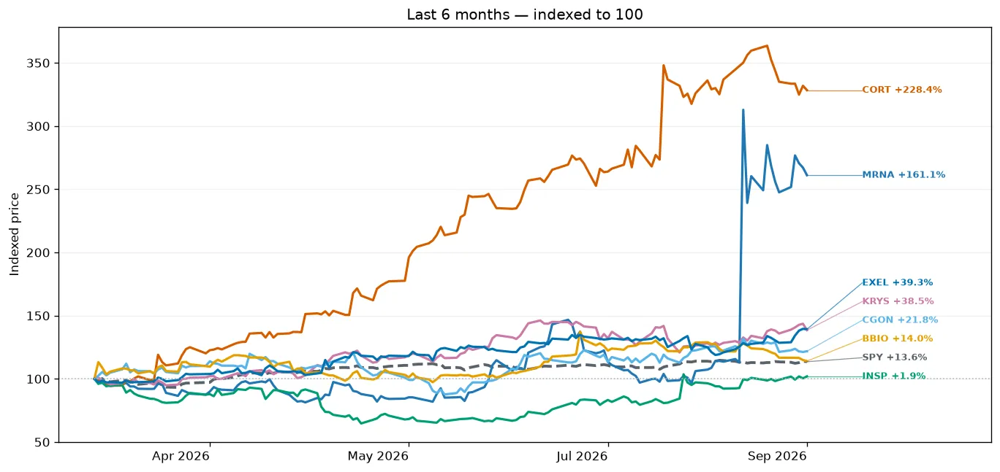

### Last 12 months

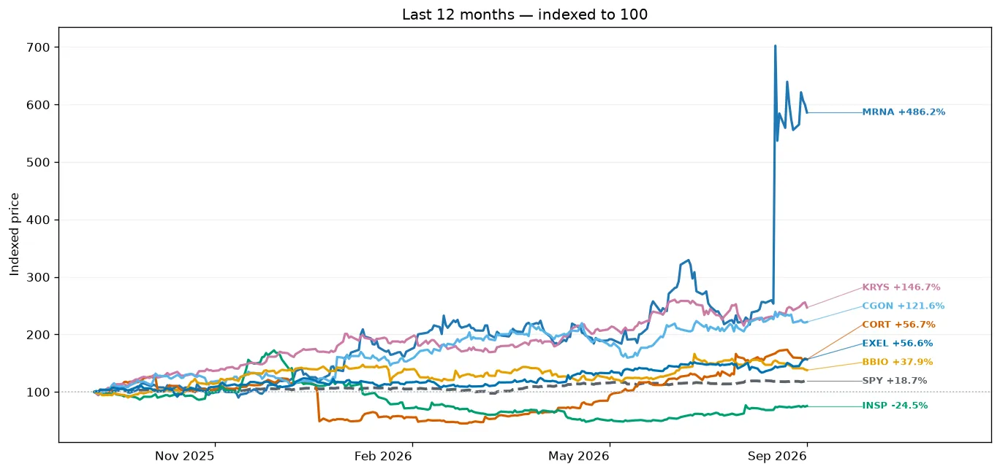

### Last 24 months

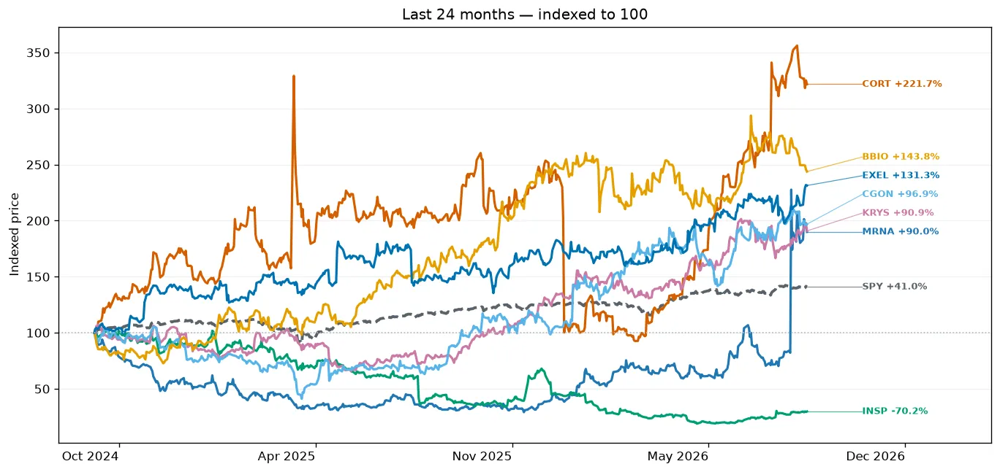

## Current Top Stocks

### Last 3 months

<table class="sortable"><thead><tr><th class="sortable-heading" data-column="0" data-type="number">Rank</th><th class="sortable-heading" data-column="1" data-type="text">Company</th><th class="sortable-heading" data-column="2" data-type="text">Ticker</th><th class="sortable-heading" data-column="3" data-type="number">Market cap</th><th class="sortable-heading" data-column="4" data-type="number">Return</th></tr></thead><tbody><tr><td class="" data-sort="1" style="">1</td><td class="text" data-sort="moderna" style="">Moderna</td><td class="text text" data-sort="mrna" style=""><a href="#company-mrna">MRNA</a></td><td class="" data-sort="22752453314.11" style="">$22.8B</td><td class="" data-sort="2.068086003372682" style="background:#1a7a3c;color:#ffffff;">+206.8%</td></tr><tr><td class="" data-sort="2" style="">2</td><td class="text" data-sort="corcept therapeutics" style="">Corcept Therapeutics</td><td class="text text" data-sort="cort" style=""><a href="#company-cort">CORT</a></td><td class="" data-sort="11869203990.6" style="">$11.9B</td><td class="" data-sort="0.5370421371522995" style="background:#a9d9a4;color:#111820;">+53.7%</td></tr><tr><td class="" data-sort="3" style="">3</td><td class="text" data-sort="inspire medical systems" style="">Inspire Medical Systems</td><td class="text text" data-sort="insp" style=""><a href="#company-insp">INSP</a></td><td class="" data-sort="1854311452.5" style="">$1.9B</td><td class="" data-sort="0.5314396698227726" style="background:#a9d9a4;color:#111820;">+53.1%</td></tr><tr><td class="" data-sort="4" style="">4</td><td class="text" data-sort="sarepta" style="">Sarepta</td><td class="text text" data-sort="srpt" style=""><a href="#company-srpt">SRPT</a></td><td class="" data-sort="1730394278.5800002" style="">$1.7B</td><td class="" data-sort="0.4285714285714286" style="background:#a9d9a4;color:#111820;">+42.9%</td></tr><tr><td class="" data-sort="5" style="">5</td><td class="text" data-sort="cg oncology" style="">CG Oncology</td><td class="text text" data-sort="cgon" style=""><a href="#company-cgon">CGON</a></td><td class="" data-sort="6297656572.200001" style="">$6.3B</td><td class="" data-sort="0.3899851079672376" style="background:#d6ecd4;color:#111820;">+39.0%</td></tr></tbody></table>

### Last 12 months

<table class="sortable"><thead><tr><th class="sortable-heading" data-column="0" data-type="number">Rank</th><th class="sortable-heading" data-column="1" data-type="text">Company</th><th class="sortable-heading" data-column="2" data-type="text">Ticker</th><th class="sortable-heading" data-column="3" data-type="number">Market cap</th><th class="sortable-heading" data-column="4" data-type="number">Return</th></tr></thead><tbody><tr><td class="" data-sort="1" style="">1</td><td class="text" data-sort="moderna" style="">Moderna</td><td class="text text" data-sort="mrna" style=""><a href="#company-mrna">MRNA</a></td><td class="" data-sort="22752453314.11" style="">$22.8B</td><td class="" data-sort="4.789578361177407" style="background:#1a7a3c;color:#ffffff;">+479.0%</td></tr><tr><td class="" data-sort="2" style="">2</td><td class="text" data-sort="krystal biotech" style="">Krystal Biotech</td><td class="text text" data-sort="krys" style=""><a href="#company-krys">KRYS</a></td><td class="" data-sort="9612813967.72" style="">$9.6B</td><td class="" data-sort="1.3839755107473213" style="background:#a9d9a4;color:#111820;">+138.4%</td></tr><tr><td class="" data-sort="3" style="">3</td><td class="text" data-sort="cg oncology" style="">CG Oncology</td><td class="text text" data-sort="cgon" style=""><a href="#company-cgon">CGON</a></td><td class="" data-sort="6297656572.200001" style="">$6.3B</td><td class="" data-sort="1.2579377078923497" style="background:#a9d9a4;color:#111820;">+125.8%</td></tr><tr><td class="" data-sort="4" style="">4</td><td class="text" data-sort="merck" style="">Merck</td><td class="text text" data-sort="mrk" style=""><a href="#company-mrk">MRK</a></td><td class="" data-sort="316137525120.0" style="">$316.1B</td><td class="" data-sort="0.7746428993035064" style="background:#d6ecd4;color:#111820;">+77.5%</td></tr><tr><td class="" data-sort="5" style="">5</td><td class="text" data-sort="corcept therapeutics" style="">Corcept Therapeutics</td><td class="text text" data-sort="cort" style=""><a href="#company-cort">CORT</a></td><td class="" data-sort="11869203990.6" style="">$11.9B</td><td class="" data-sort="0.6092848904267589" style="background:#d6ecd4;color:#111820;">+60.9%</td></tr></tbody></table>

### Last 24 months

<table class="sortable"><thead><tr><th class="sortable-heading" data-column="0" data-type="number">Rank</th><th class="sortable-heading" data-column="1" data-type="text">Company</th><th class="sortable-heading" data-column="2" data-type="text">Ticker</th><th class="sortable-heading" data-column="3" data-type="number">Market cap</th><th class="sortable-heading" data-column="4" data-type="number">Return</th></tr></thead><tbody><tr><td class="" data-sort="1" style="">1</td><td class="text" data-sort="corcept therapeutics" style="">Corcept Therapeutics</td><td class="text text" data-sort="cort" style=""><a href="#company-cort">CORT</a></td><td class="" data-sort="11869203990.6" style="">$11.9B</td><td class="" data-sort="2.246655031995346" style="background:#1a7a3c;color:#ffffff;">+224.7%</td></tr><tr><td class="" data-sort="2" style="">2</td><td class="text" data-sort="bridgebio pharma" style="">BridgeBio Pharma</td><td class="text text" data-sort="bbio" style=""><a href="#company-bbio">BBIO</a></td><td class="" data-sort="16074332130.939999" style="">$16.1B</td><td class="" data-sort="1.4377850162866452" style="background:#2f9e44;color:#111820;">+143.8%</td></tr><tr><td class="" data-sort="3" style="">3</td><td class="text" data-sort="exelixis" style="">Exelixis</td><td class="text text" data-sort="exel" style=""><a href="#company-exel">EXEL</a></td><td class="" data-sort="14075884648.0" style="">$14.1B</td><td class="" data-sort="1.3463220675944334" style="background:#7cc077;color:#111820;">+134.6%</td></tr><tr><td class="" data-sort="4" style="">4</td><td class="text" data-sort="incyte" style="">Incyte</td><td class="text text" data-sort="incy" style=""><a href="#company-incy">INCY</a></td><td class="" data-sort="24445348167.6" style="">$24.4B</td><td class="" data-sort="1.0690499510284037" style="background:#7cc077;color:#111820;">+106.9%</td></tr><tr><td class="" data-sort="5" style="">5</td><td class="text" data-sort="moderna" style="">Moderna</td><td class="text text" data-sort="mrna" style=""><a href="#company-mrna">MRNA</a></td><td class="" data-sort="22752453314.11" style="">$22.8B</td><td class="" data-sort="0.9968445602963372" style="background:#7cc077;color:#111820;">+99.7%</td></tr></tbody></table>

## Companies by Subcategory

<h3 id="category-devices-diagnostic"><a href="#subcategory-performance">Devices &amp; Diagnostic</a>Last 3m: +6.4%</h3>

<table class="sortable"><thead><tr><th class="sortable-heading" data-column="0" data-type="text">Company</th><th class="sortable-heading" data-column="1" data-type="text">Ticker</th><th class="sortable-heading" data-column="2" data-type="number">Market cap</th><th class="sortable-heading" data-column="3" data-type="number">3m Return</th><th class="sortable-heading" data-column="4" data-type="number">12m Return</th><th class="sortable-heading" data-column="5" data-type="number">24m Return</th></tr></thead><tbody><tr><td class="text" data-sort="medtronic" style=""><a href="#earnings-mdt">Medtronic</a></td><td class="text text" data-sort="mdt" style=""><a href="#company-mdt">MDT</a></td><td class="" data-sort="110339895378.0" style="">$110.3B</td><td class="" data-sort="0.15305497734786333" style="background:#a9d9a4;color:#111820;">+15.3%</td><td class="" data-sort="0.013670613562970946" style="background:#d6ecd4;color:#111820;">+1.4%</td><td class="" data-sort="0.047613750139058775" style="background:#d6ecd4;color:#111820;">+4.8%</td></tr><tr><td class="text" data-sort="boston scientific" style="">Boston Scientific</td><td class="text text" data-sort="bsx" style=""><a href="#company-bsx">BSX</a></td><td class="" data-sort="71142677431.34001" style="">$71.1B</td><td class="" data-sort="-0.015447991761071034" style="background:#fbd5d4;color:#111820;">-1.5%</td><td class="" data-sort="-0.5541876515575452" style="background:#c0302f;color:#ffffff;">-55.4%</td><td class="" data-sort="-0.4142156862745098" style="background:#e34948;color:#111820;">-41.4%</td></tr><tr><td class="text" data-sort="stryker" style="">Stryker</td><td class="text text" data-sort="syk" style=""><a href="#company-syk">SYK</a></td><td class="" data-sort="128865200534.15999" style="">$128.9B</td><td class="" data-sort="-0.008277170712556514" style="background:#fbd5d4;color:#111820;">-0.8%</td><td class="" data-sort="-0.227320231449619" style="background:#f5aead;color:#111820;">-22.7%</td><td class="" data-sort="-0.15543853783572947" style="background:#f5aead;color:#111820;">-15.5%</td></tr><tr><td class="text" data-sort="zimmer biomet" style="">Zimmer Biomet</td><td class="text text" data-sort="zbh" style=""><a href="#company-zbh">ZBH</a></td><td class="" data-sort="18535640400.420002" style="">$18.5B</td><td class="" data-sort="0.12298179319821356" style="background:#a9d9a4;color:#111820;">+12.3%</td><td class="" data-sort="-0.07244869005958587" style="background:#fbd5d4;color:#111820;">-7.2%</td><td class="" data-sort="-0.06430684095029104" style="background:#fbd5d4;color:#111820;">-6.4%</td></tr><tr><td class="text" data-sort="abbott" style="">Abbott</td><td class="text text" data-sort="abt" style=""><a href="#company-abt">ABT</a></td><td class="" data-sort="182486222396.16" style="">$182.5B</td><td class="" data-sort="0.1895245415614364" style="background:#a9d9a4;color:#111820;">+19.0%</td><td class="" data-sort="-0.18512110726643594" style="background:#f5aead;color:#111820;">-18.5%</td><td class="" data-sort="-0.04856841735464612" style="background:#fbd5d4;color:#111820;">-4.9%</td></tr><tr><td class="text" data-sort="becton dickinson" style="">Becton Dickinson</td><td class="text text" data-sort="bd" style=""><a href="#company-bd">BD</a></td><td class="" data-sort="n/a" style="">n/a</td><td class="missing" data-sort="—" style="background:#f0efec;color:#111820;">—</td><td class="missing" data-sort="—" style="background:#f0efec;color:#111820;">—</td><td class="missing" data-sort="—" style="background:#f0efec;color:#111820;">—</td></tr><tr><td class="text" data-sort="edwards lifesciences" style="">Edwards LifeSciences</td><td class="text text" data-sort="ew" style=""><a href="#company-ew">EW</a></td><td class="" data-sort="51591680000.0" style="">$51.6B</td><td class="" data-sort="0.045835272219637124" style="background:#d6ecd4;color:#111820;">+4.6%</td><td class="" data-sort="0.11069928341981727" style="background:#d6ecd4;color:#111820;">+11.1%</td><td class="" data-sort="0.34560694506810363" style="background:#7cc077;color:#111820;">+34.6%</td></tr><tr><td class="text" data-sort="dexcom" style="">Dexcom</td><td class="text text" data-sort="dxcm" style=""><a href="#company-dxcm">DXCM</a></td><td class="" data-sort="32807744909.1" style="">$32.8B</td><td class="" data-sort="0.20642327751852885" style="background:#a9d9a4;color:#111820;">+20.6%</td><td class="" data-sort="0.09178983977145694" style="background:#d6ecd4;color:#111820;">+9.2%</td><td class="" data-sort="0.28115435067774386" style="background:#7cc077;color:#111820;">+28.1%</td></tr><tr><td class="text" data-sort="resmed" style="">ResMed</td><td class="text text" data-sort="rmd" style=""><a href="#company-rmd">RMD</a></td><td class="" data-sort="32367881525.76" style="">$32.4B</td><td class="" data-sort="0.16481330340746791" style="background:#a9d9a4;color:#111820;">+16.5%</td><td class="" data-sort="-0.17578054502797336" style="background:#f5aead;color:#111820;">-17.6%</td><td class="" data-sort="-0.06746436884877693" style="background:#fbd5d4;color:#111820;">-6.7%</td></tr><tr><td class="text" data-sort="insulet" style="">Insulet</td><td class="text text" data-sort="podd" style=""><a href="#company-podd">PODD</a></td><td class="" data-sort="11554732916.68" style="">$11.6B</td><td class="" data-sort="-0.03746247226210686" style="background:#fbd5d4;color:#111820;">-3.7%</td><td class="" data-sort="-0.576729902706426" style="background:#c0302f;color:#ffffff;">-57.7%</td><td class="" data-sort="-0.31324796274738076" style="background:#ee8483;color:#111820;">-31.3%</td></tr><tr><td class="text" data-sort="globus medical" style="">Globus Medical</td><td class="text text" data-sort="gmed" style=""><a href="#company-gmed">GMED</a></td><td class="" data-sort="11064544465.26" style="">$11.1B</td><td class="" data-sort="-0.021374999999999922" style="background:#fbd5d4;color:#111820;">-2.1%</td><td class="" data-sort="0.2919141914191419" style="background:#7cc077;color:#111820;">+29.2%</td><td class="" data-sort="0.11858836976710974" style="background:#d6ecd4;color:#111820;">+11.9%</td></tr><tr><td class="text" data-sort="intuitive surgical" style="">Intuitive Surgical</td><td class="text text" data-sort="isrg" style=""><a href="#company-isrg">ISRG</a></td><td class="" data-sort="130099936664.06999" style="">$130.1B</td><td class="" data-sort="-0.13116618490262055" style="background:#f5aead;color:#111820;">-13.1%</td><td class="" data-sort="-0.21453969069956735" style="background:#f5aead;color:#111820;">-21.5%</td><td class="" data-sort="-0.2227968292993091" style="background:#f5aead;color:#111820;">-22.3%</td></tr><tr><td class="text" data-sort="ge healthcare" style="">GE Healthcare</td><td class="text text" data-sort="gehc" style=""><a href="#company-gehc">GEHC</a></td><td class="" data-sort="31735476065.52" style="">$31.7B</td><td class="" data-sort="0.06479047471779809" style="background:#d6ecd4;color:#111820;">+6.5%</td><td class="" data-sort="-0.0907170209956425" style="background:#fbd5d4;color:#111820;">-9.1%</td><td class="" data-sort="-0.1907392172993302" style="background:#f5aead;color:#111820;">-19.1%</td></tr><tr><td class="text" data-sort="transmedics" style="">Transmedics</td><td class="text text" data-sort="tmdx" style=""><a href="#company-tmdx">TMDX</a></td><td class="" data-sort="2790793563.25" style="">$2.8B</td><td class="" data-sort="0.29598156416534627" style="background:#7cc077;color:#111820;">+29.6%</td><td class="" data-sort="-0.13489087587731952" style="background:#f5aead;color:#111820;">-13.5%</td><td class="" data-sort="-0.35673434372319124" style="background:#ee8483;color:#111820;">-35.7%</td></tr><tr><td class="text" data-sort="steris" style="">STERIS</td><td class="text text" data-sort="ste" style=""><a href="#company-ste">STE</a></td><td class="" data-sort="22693020788.0" style="">$22.7B</td><td class="" data-sort="0.05764068754414886" style="background:#d6ecd4;color:#111820;">+5.8%</td><td class="" data-sort="-0.08442723196086432" style="background:#fbd5d4;color:#111820;">-8.4%</td><td class="" data-sort="-0.06350596280543741" style="background:#fbd5d4;color:#111820;">-6.4%</td></tr><tr><td class="text" data-sort="masimo" style="">Masimo</td><td class="text text" data-sort="masi" style=""><a href="#company-masi">MASI</a></td><td class="" data-sort="n/a" style="">n/a</td><td class="" data-sort="0.006319203668493367" style="background:#d6ecd4;color:#111820;">+0.6%</td><td class="" data-sort="0.22256946803451316" style="background:#a9d9a4;color:#111820;">+22.3%</td><td class="" data-sort="0.6134672285483724" style="background:#1a7a3c;color:#ffffff;">+61.3%</td></tr><tr><td class="text" data-sort="inspire medical systems" style="">Inspire Medical Systems</td><td class="text text" data-sort="insp" style=""><a href="#company-insp">INSP</a></td><td class="" data-sort="1854311452.5" style="">$1.9B</td><td class="" data-sort="0.5314396698227726" style="background:#1a7a3c;color:#ffffff;">+53.1%</td><td class="" data-sort="-0.27041406430719406" style="background:#ee8483;color:#111820;">-27.0%</td><td class="" data-sort="-0.6796017878911012" style="background:#c0302f;color:#ffffff;">-68.0%</td></tr></tbody></table>

<h3 id="category-big-pharma"><a href="#subcategory-performance">Big Pharma</a>Last 3m: +8.3%</h3>

<table class="sortable"><thead><tr><th class="sortable-heading" data-column="0" data-type="text">Company</th><th class="sortable-heading" data-column="1" data-type="text">Ticker</th><th class="sortable-heading" data-column="2" data-type="number">Market cap</th><th class="sortable-heading" data-column="3" data-type="number">3m Return</th><th class="sortable-heading" data-column="4" data-type="number">12m Return</th><th class="sortable-heading" data-column="5" data-type="number">24m Return</th></tr></thead><tbody><tr><td class="text" data-sort="eli lilly" style="">Eli Lilly</td><td class="text text" data-sort="lly" style=""><a href="#company-lly">LLY</a></td><td class="" data-sort="1031414900000.0" style="">$1.0T</td><td class="" data-sort="0.0158561807286417" style="background:#d6ecd4;color:#111820;">+1.6%</td><td class="" data-sort="0.580506318669985" style="background:#2f9e44;color:#111820;">+58.1%</td><td class="" data-sort="0.2732328211718047" style="background:#7cc077;color:#111820;">+27.3%</td></tr><tr><td class="text" data-sort="novo nordisk" style="">Novo Nordisk</td><td class="text text" data-sort="nvo" style=""><a href="#company-nvo">NVO</a></td><td class="" data-sort="195750833025.6" style="">$195.8B</td><td class="" data-sort="0.08472998137802601" style="background:#a9d9a4;color:#111820;">+8.5%</td><td class="" data-sort="-0.15625565815679876" style="background:#f5aead;color:#111820;">-15.6%</td><td class="" data-sort="-0.6446545676376392" style="background:#c0302f;color:#ffffff;">-64.5%</td></tr><tr><td class="text" data-sort="abbvie" style="">AbbVie</td><td class="text text" data-sort="abbv" style=""><a href="#company-abbv">ABBV</a></td><td class="" data-sort="430823194083.0" style="">$430.8B</td><td class="" data-sort="0.12863618360251716" style="background:#7cc077;color:#111820;">+12.9%</td><td class="" data-sort="0.20652992096349254" style="background:#a9d9a4;color:#111820;">+20.7%</td><td class="" data-sort="0.32605997931747654" style="background:#7cc077;color:#111820;">+32.6%</td></tr><tr><td class="text" data-sort="johnson &amp; johnson" style="">Johnson &amp; Johnson</td><td class="text text" data-sort="jnj" style=""><a href="#company-jnj">JNJ</a></td><td class="" data-sort="614355449333.21" style="">$614.4B</td><td class="" data-sort="0.1824118228294025" style="background:#2f9e44;color:#111820;">+18.2%</td><td class="" data-sort="0.5425096676567842" style="background:#2f9e44;color:#111820;">+54.3%</td><td class="" data-sort="0.6743521109624044" style="background:#1a7a3c;color:#ffffff;">+67.4%</td></tr><tr><td class="text" data-sort="pfizer" style="">Pfizer</td><td class="text text" data-sort="pfe" style=""><a href="#company-pfe">PFE</a></td><td class="" data-sort="144828705896.49" style="">$144.8B</td><td class="" data-sort="0.0925499231950846" style="background:#a9d9a4;color:#111820;">+9.3%</td><td class="" data-sort="0.1434887459807075" style="background:#d6ecd4;color:#111820;">+14.3%</td><td class="" data-sort="-0.003851540616246485" style="background:#fbd5d4;color:#111820;">-0.4%</td></tr><tr><td class="text" data-sort="merck" style="">Merck</td><td class="text text" data-sort="mrk" style=""><a href="#company-mrk">MRK</a></td><td class="" data-sort="316137525120.0" style="">$316.1B</td><td class="" data-sort="0.24455666859839398" style="background:#1a7a3c;color:#ffffff;">+24.5%</td><td class="" data-sort="0.7746428993035064" style="background:#1a7a3c;color:#ffffff;">+77.5%</td><td class="" data-sort="0.2757128309572303" style="background:#7cc077;color:#111820;">+27.6%</td></tr><tr><td class="text" data-sort="bristol myers squibb" style="">Bristol Myers Squibb</td><td class="text text" data-sort="bmy" style=""><a href="#company-bmy">BMY</a></td><td class="" data-sort="134594468683.84" style="">$134.6B</td><td class="" data-sort="0.16675397241138445" style="background:#2f9e44;color:#111820;">+16.7%</td><td class="" data-sort="0.4174798472634704" style="background:#7cc077;color:#111820;">+41.7%</td><td class="" data-sort="0.37207392197125233" style="background:#7cc077;color:#111820;">+37.2%</td></tr><tr><td class="text" data-sort="viatris" style="">Viatris</td><td class="text text" data-sort="vtrs" style=""><a href="#company-vtrs">VTRS</a></td><td class="" data-sort="20612581975.8" style="">$20.6B</td><td class="" data-sort="0.06297229219143574" style="background:#a9d9a4;color:#111820;">+6.3%</td><td class="" data-sort="0.6076190476190475" style="background:#2f9e44;color:#111820;">+60.8%</td><td class="" data-sort="0.49778172138420573" style="background:#2f9e44;color:#111820;">+49.8%</td></tr><tr><td class="text" data-sort="astrazeneca" style="">AstraZeneca</td><td class="text text" data-sort="azn" style=""><a href="#company-azn">AZN</a></td><td class="" data-sort="241348854732.04" style="">$241.3B</td><td class="" data-sort="-0.1250336111858027" style="background:#ee8483;color:#111820;">-12.5%</td><td class="" data-sort="-0.004283965728274275" style="background:#fbd5d4;color:#111820;">-0.4%</td><td class="" data-sort="-0.02046959662853709" style="background:#fbd5d4;color:#111820;">-2.0%</td></tr><tr><td class="text" data-sort="novartis" style="">Novartis</td><td class="text text" data-sort="nvs" style=""><a href="#company-nvs">NVS</a></td><td class="" data-sort="291322563526.80005" style="">$291.3B</td><td class="" data-sort="0.07260659694288019" style="background:#a9d9a4;color:#111820;">+7.3%</td><td class="" data-sort="0.23325368072149866" style="background:#a9d9a4;color:#111820;">+23.3%</td><td class="" data-sort="0.3715387912558936" style="background:#7cc077;color:#111820;">+37.2%</td></tr><tr><td class="text" data-sort="sanofi" style="">Sanofi</td><td class="text text" data-sort="sny" style=""><a href="#company-sny">SNY</a></td><td class="" data-sort="103635492944.72" style="">$103.6B</td><td class="" data-sort="-0.017325633051976874" style="background:#fbd5d4;color:#111820;">-1.7%</td><td class="" data-sort="-0.04860215053763439" style="background:#fbd5d4;color:#111820;">-4.9%</td><td class="" data-sort="-0.23367399965355962" style="background:#f5aead;color:#111820;">-23.4%</td></tr><tr><td class="text" data-sort="gsk" style="">GSK</td><td class="text text" data-sort="gsk" style=""><a href="#company-gsk">GSK</a></td><td class="" data-sort="103204573753.19" style="">$103.2B</td><td class="" data-sort="-0.03163819875776397" style="background:#fbd5d4;color:#111820;">-3.2%</td><td class="" data-sort="0.23185185185185198" style="background:#a9d9a4;color:#111820;">+23.2%</td><td class="" data-sort="0.14243187542935654" style="background:#a9d9a4;color:#111820;">+14.2%</td></tr></tbody></table>

<h3 id="category-established-biotech"><a href="#subcategory-performance">Established Biotech</a>Last 3m: +23.7%</h3>

<table class="sortable"><thead><tr><th class="sortable-heading" data-column="0" data-type="text">Company</th><th class="sortable-heading" data-column="1" data-type="text">Ticker</th><th class="sortable-heading" data-column="2" data-type="number">Market cap</th><th class="sortable-heading" data-column="3" data-type="number">3m Return</th><th class="sortable-heading" data-column="4" data-type="number">12m Return</th><th class="sortable-heading" data-column="5" data-type="number">24m Return</th></tr></thead><tbody><tr><td class="text" data-sort="vertex" style="">Vertex</td><td class="text text" data-sort="vrtx" style=""><a href="#company-vrtx">VRTX</a></td><td class="" data-sort="121255976500.0" style="">$121.3B</td><td class="" data-sort="0.22220978895776922" style="background:#d6ecd4;color:#111820;">+22.2%</td><td class="" data-sort="0.37867312935474096" style="background:#d6ecd4;color:#111820;">+37.9%</td><td class="" data-sort="0.16692307692307695" style="background:#d6ecd4;color:#111820;">+16.7%</td></tr><tr><td class="text" data-sort="regeneron" style="">Regeneron</td><td class="text text" data-sort="regn" style=""><a href="#company-regn">REGN</a></td><td class="" data-sort="78313741172.08" style="">$78.3B</td><td class="" data-sort="0.30257297977811004" style="background:#d6ecd4;color:#111820;">+30.3%</td><td class="" data-sort="0.44358017370679126" style="background:#d6ecd4;color:#111820;">+44.4%</td><td class="" data-sort="-0.26847547503314184" style="background:#fbd5d4;color:#111820;">-26.8%</td></tr><tr><td class="text" data-sort="amgen" style="">Amgen</td><td class="text text" data-sort="amgn" style=""><a href="#company-amgn">AMGN</a></td><td class="" data-sort="210497021025.47998" style="">$210.5B</td><td class="" data-sort="0.2507294467646892" style="background:#d6ecd4;color:#111820;">+25.1%</td><td class="" data-sort="0.541496262868425" style="background:#d6ecd4;color:#111820;">+54.1%</td><td class="" data-sort="0.3639568255552783" style="background:#a9d9a4;color:#111820;">+36.4%</td></tr><tr><td class="text" data-sort="gilead" style="">Gilead</td><td class="text text" data-sort="gild" style=""><a href="#company-gild">GILD</a></td><td class="" data-sort="167922325458.5" style="">$167.9B</td><td class="" data-sort="0.16905388665221444" style="background:#d6ecd4;color:#111820;">+16.9%</td><td class="" data-sort="0.31242937853107344" style="background:#d6ecd4;color:#111820;">+31.2%</td><td class="" data-sort="0.9181275406504066" style="background:#2f9e44;color:#111820;">+91.8%</td></tr><tr><td class="text" data-sort="biogen" style="">Biogen</td><td class="text text" data-sort="biib" style=""><a href="#company-biib">BIIB</a></td><td class="" data-sort="30799320883.1" style="">$30.8B</td><td class="" data-sort="0.1304904269478857" style="background:#d6ecd4;color:#111820;">+13.0%</td><td class="" data-sort="0.5698443164853915" style="background:#d6ecd4;color:#111820;">+57.0%</td><td class="" data-sort="0.09969623026741692" style="background:#d6ecd4;color:#111820;">+10.0%</td></tr><tr><td class="text" data-sort="alnylam" style="">Alnylam</td><td class="text text" data-sort="alny" style=""><a href="#company-alny">ALNY</a></td><td class="" data-sort="29304196842.0" style="">$29.3B</td><td class="" data-sort="-0.12189407688500242" style="background:#fbd5d4;color:#111820;">-12.2%</td><td class="" data-sort="-0.4112610619469026" style="background:#fbd5d4;color:#111820;">-41.1%</td><td class="" data-sort="0.07832887592187388" style="background:#d6ecd4;color:#111820;">+7.8%</td></tr><tr><td class="text" data-sort="sarepta" style="">Sarepta</td><td class="text text" data-sort="srpt" style=""><a href="#company-srpt">SRPT</a></td><td class="" data-sort="1730394278.5800002" style="">$1.7B</td><td class="" data-sort="0.4285714285714286" style="background:#a9d9a4;color:#111820;">+42.9%</td><td class="" data-sort="0.202565473009086" style="background:#d6ecd4;color:#111820;">+20.3%</td><td class="" data-sort="-0.825473161650636" style="background:#e34948;color:#111820;">-82.5%</td></tr><tr><td class="text" data-sort="moderna" style="">Moderna</td><td class="text text" data-sort="mrna" style=""><a href="#company-mrna">MRNA</a></td><td class="" data-sort="22752453314.11" style="">$22.8B</td><td class="" data-sort="2.068086003372682" style="background:#1a7a3c;color:#ffffff;">+206.8%</td><td class="" data-sort="4.789578361177407" style="background:#1a7a3c;color:#ffffff;">+479.0%</td><td class="" data-sort="0.9968445602963372" style="background:#2f9e44;color:#111820;">+99.7%</td></tr><tr><td class="text" data-sort="exelixis" style="">Exelixis</td><td class="text text" data-sort="exel" style=""><a href="#company-exel">EXEL</a></td><td class="" data-sort="14075884648.0" style="">$14.1B</td><td class="" data-sort="0.11973434535104355" style="background:#d6ecd4;color:#111820;">+12.0%</td><td class="" data-sort="0.5578141499472016" style="background:#d6ecd4;color:#111820;">+55.8%</td><td class="" data-sort="1.3463220675944334" style="background:#1a7a3c;color:#ffffff;">+134.6%</td></tr><tr><td class="text" data-sort="argenx" style="">Argenx</td><td class="text text" data-sort="argx" style=""><a href="#company-argx">ARGX</a></td><td class="" data-sort="52832758588.5" style="">$52.8B</td><td class="" data-sort="0.15912354709868515" style="background:#d6ecd4;color:#111820;">+15.9%</td><td class="" data-sort="0.3761021870587924" style="background:#d6ecd4;color:#111820;">+37.6%</td><td class="" data-sort="0.9061808118081183" style="background:#2f9e44;color:#111820;">+90.6%</td></tr><tr><td class="text" data-sort="neurocrine biosciences" style="">Neurocrine Biosciences</td><td class="text text" data-sort="nbix" style=""><a href="#company-nbix">NBIX</a></td><td class="" data-sort="16879862996.86" style="">$16.9B</td><td class="" data-sort="-0.05028069319013917" style="background:#fbd5d4;color:#111820;">-5.0%</td><td class="" data-sort="0.08008327550312289" style="background:#d6ecd4;color:#111820;">+8.0%</td><td class="" data-sort="0.29516518265790115" style="background:#a9d9a4;color:#111820;">+29.5%</td></tr><tr><td class="text" data-sort="united therapeutics" style="">United Therapeutics</td><td class="text text" data-sort="uthr" style=""><a href="#company-uthr">UTHR</a></td><td class="" data-sort="22016271472.44" style="">$22.0B</td><td class="" data-sort="-0.11322676268936294" style="background:#fbd5d4;color:#111820;">-11.3%</td><td class="" data-sort="0.21744232497752924" style="background:#d6ecd4;color:#111820;">+21.7%</td><td class="" data-sort="0.4107861007435698" style="background:#a9d9a4;color:#111820;">+41.1%</td></tr><tr><td class="text" data-sort="incyte" style="">Incyte</td><td class="text text" data-sort="incy" style=""><a href="#company-incy">INCY</a></td><td class="" data-sort="24445348167.6" style="">$24.4B</td><td class="" data-sort="0.23803477241648774" style="background:#d6ecd4;color:#111820;">+23.8%</td><td class="" data-sort="0.462950138504155" style="background:#d6ecd4;color:#111820;">+46.3%</td><td class="" data-sort="1.0690499510284037" style="background:#2f9e44;color:#111820;">+106.9%</td></tr><tr><td class="text" data-sort="biomarin pharmaceutical" style="">BioMarin Pharmaceutical</td><td class="text text" data-sort="bmrn" style=""><a href="#company-bmrn">BMRN</a></td><td class="" data-sort="11736231075.36" style="">$11.7B</td><td class="" data-sort="0.1719217896776466" style="background:#d6ecd4;color:#111820;">+17.2%</td><td class="" data-sort="0.1516357971265363" style="background:#d6ecd4;color:#111820;">+15.2%</td><td class="" data-sort="-0.2087297811607992" style="background:#fbd5d4;color:#111820;">-20.9%</td></tr><tr><td class="text" data-sort="ionis pharmaceuticals" style="">Ionis Pharmaceuticals</td><td class="text text" data-sort="ions" style=""><a href="#company-ions">IONS</a></td><td class="" data-sort="9151770612.54" style="">$9.2B</td><td class="" data-sort="-0.22005907626208376" style="background:#fbd5d4;color:#111820;">-22.0%</td><td class="" data-sort="-0.05128205128205121" style="background:#fbd5d4;color:#111820;">-5.1%</td><td class="" data-sort="0.23885689912561325" style="background:#d6ecd4;color:#111820;">+23.9%</td></tr></tbody></table>

<h3 id="category-emerging-biotech"><a href="#subcategory-performance">Emerging Biotech</a>Last 3m: +26.7%</h3>

<table class="sortable"><thead><tr><th class="sortable-heading" data-column="0" data-type="text">Company</th><th class="sortable-heading" data-column="1" data-type="text">Ticker</th><th class="sortable-heading" data-column="2" data-type="number">Market cap</th><th class="sortable-heading" data-column="3" data-type="number">3m Return</th><th class="sortable-heading" data-column="4" data-type="number">12m Return</th><th class="sortable-heading" data-column="5" data-type="number">24m Return</th></tr></thead><tbody><tr><td class="text" data-sort="adma biologics" style="">ADMA Biologics</td><td class="text text" data-sort="adma" style=""><a href="#company-adma">ADMA</a></td><td class="" data-sort="2065094890.65" style="">$2.1B</td><td class="" data-sort="0.20702634880802995" style="background:#a9d9a4;color:#111820;">+20.7%</td><td class="" data-sort="-0.4297569650266746" style="background:#f5aead;color:#111820;">-43.0%</td><td class="" data-sort="-0.40836408364083654" style="background:#fbd5d4;color:#111820;">-40.8%</td></tr><tr><td class="text" data-sort="ocular therapeutix" style="">Ocular therapeutix</td><td class="text text" data-sort="ocul" style=""><a href="#company-ocul">OCUL</a></td><td class="" data-sort="1886500306.12" style="">$1.9B</td><td class="" data-sort="0.2896969696969698" style="background:#7cc077;color:#111820;">+29.0%</td><td class="" data-sort="-0.2176470588235293" style="background:#fbd5d4;color:#111820;">-21.8%</td><td class="" data-sort="0.26817640047675795" style="background:#d6ecd4;color:#111820;">+26.8%</td></tr><tr><td class="text" data-sort="novocure" style="">Novocure</td><td class="text text" data-sort="nvcr" style=""><a href="#company-nvcr">NVCR</a></td><td class="" data-sort="1894573816.8" style="">$1.9B</td><td class="" data-sort="0.045454545454545414" style="background:#d6ecd4;color:#111820;">+4.5%</td><td class="" data-sort="0.46091205211726405" style="background:#a9d9a4;color:#111820;">+46.1%</td><td class="" data-sort="0.06279620853080581" style="background:#d6ecd4;color:#111820;">+6.3%</td></tr><tr><td class="text" data-sort="corcept therapeutics" style="">Corcept Therapeutics</td><td class="text text" data-sort="cort" style=""><a href="#company-cort">CORT</a></td><td class="" data-sort="11869203990.6" style="">$11.9B</td><td class="" data-sort="0.5370421371522995" style="background:#1a7a3c;color:#ffffff;">+53.7%</td><td class="" data-sort="0.6092848904267589" style="background:#7cc077;color:#111820;">+60.9%</td><td class="" data-sort="2.246655031995346" style="background:#1a7a3c;color:#ffffff;">+224.7%</td></tr><tr><td class="text" data-sort="acadia pharmaceuticals" style="">Acadia Pharmaceuticals</td><td class="text text" data-sort="acad" style=""><a href="#company-acad">ACAD</a></td><td class="" data-sort="4649053870.5" style="">$4.6B</td><td class="" data-sort="0.2996289424860854" style="background:#7cc077;color:#111820;">+30.0%</td><td class="" data-sort="0.10926365795724458" style="background:#d6ecd4;color:#111820;">+10.9%</td><td class="" data-sort="0.7436216552582451" style="background:#a9d9a4;color:#111820;">+74.4%</td></tr><tr><td class="text" data-sort="krystal biotech" style="">Krystal Biotech</td><td class="text text" data-sort="krys" style=""><a href="#company-krys">KRYS</a></td><td class="" data-sort="9612813967.72" style="">$9.6B</td><td class="" data-sort="0.19016611295681063" style="background:#a9d9a4;color:#111820;">+19.0%</td><td class="" data-sort="1.3839755107473213" style="background:#1a7a3c;color:#ffffff;">+138.4%</td><td class="" data-sort="0.9449481513654379" style="background:#7cc077;color:#111820;">+94.5%</td></tr><tr><td class="text" data-sort="avidity biosciences" style="">Avidity Biosciences</td><td class="text text" data-sort="rna" style=""><a href="#company-rna">RNA</a></td><td class="" data-sort="197399120.22" style="">$197.4M</td><td class="" data-sort="0.2025423728813558" style="background:#a9d9a4;color:#111820;">+20.3%</td><td class="" data-sort="-0.7182287529785545" style="background:#ee8483;color:#111820;">-71.8%</td><td class="" data-sort="-0.6492832427088482" style="background:#f5aead;color:#111820;">-64.9%</td></tr><tr><td class="text" data-sort="recursion pharmaceuticals" style="">Recursion Pharmaceuticals</td><td class="text text" data-sort="rxrx" style=""><a href="#company-rxrx">RXRX</a></td><td class="" data-sort="1756822875.38" style="">$1.8B</td><td class="" data-sort="0.09502262443438902" style="background:#d6ecd4;color:#111820;">+9.5%</td><td class="" data-sort="-0.21258134490238623" style="background:#fbd5d4;color:#111820;">-21.3%</td><td class="" data-sort="-0.38682432432432434" style="background:#fbd5d4;color:#111820;">-38.7%</td></tr><tr><td class="text" data-sort="cg oncology" style="">CG Oncology</td><td class="text text" data-sort="cgon" style=""><a href="#company-cgon">CGON</a></td><td class="" data-sort="6297656572.200001" style="">$6.3B</td><td class="" data-sort="0.3899851079672376" style="background:#2f9e44;color:#111820;">+39.0%</td><td class="" data-sort="1.2579377078923497" style="background:#1a7a3c;color:#ffffff;">+125.8%</td><td class="" data-sort="0.9624178712220763" style="background:#7cc077;color:#111820;">+96.2%</td></tr><tr><td class="text" data-sort="bridgebio pharma" style="">BridgeBio Pharma</td><td class="text text" data-sort="bbio" style=""><a href="#company-bbio">BBIO</a></td><td class="" data-sort="16074332130.939999" style="">$16.1B</td><td class="" data-sort="0.10693684366218026" style="background:#d6ecd4;color:#111820;">+10.7%</td><td class="" data-sort="0.40202322967403514" style="background:#a9d9a4;color:#111820;">+40.2%</td><td class="" data-sort="1.4377850162866452" style="background:#2f9e44;color:#111820;">+143.8%</td></tr></tbody></table>

## Upcoming Earnings

No saved earnings dates fall within the next seven days.

## Recent Earnings Highlights — 3m Ret

Companies covered in this section:
<ul class="section-jump-list">
<li><a href="#earnings-mdt">Medtronic (MDT)</a></li>
</ul>
<h3 id="earnings-mdt">Medtronic (<a href="#company-mdt">MDT</a>) +15.3%</h3>

**Reported:** September 1, 2026 · [Google Finance earnings page](https://www.google.com/finance/quote/MDT:NYSE?tab=earnings&hl=en)

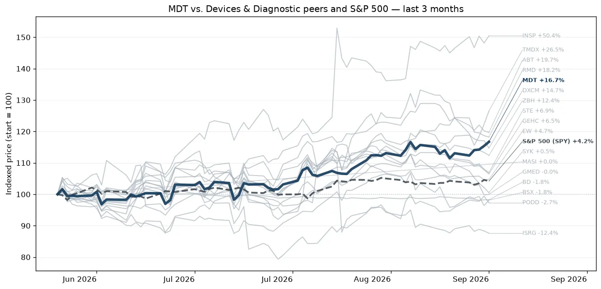

#### Earnings Call Summary

Medtronic delivered a strong start to fiscal 2027, reporting Q1 revenue of $9.8 billion and adjusted EPS of $1.45, both exceeding company expectations. Organic revenue growth reached 13.7%, boosted by approximately 670 basis points from an extra selling week. Major segments including CRM (+15%), CST (+13%), and Surgical (+9%) all showed strong underlying market demand.

#### At a Glance

- **Medtronic Beats Q1 Earnings Estimates:** Medtronic reported a quarterly revenue of $9.756 billion and an adjusted EPS of $1.14, outperforming the estimated revenue of $9.545 billion.
- **Strong Cardiovascular and Portfolio Performance:** The company delivered 13.7% organic revenue growth, heavily supported by an 88% surge in its Cardiac Ablation Solutions business and broad strength across major segments.
- **Full Year Financial Guidance Raised:** Following robust quarterly performance, management raised its fiscal year 2027 organic revenue growth guidance to 7.25%–7.75% and boosted adjusted EPS guidance to a range of $5.94 to $6.00.
- **Expanded Footprint in Robotic Surgery:** Medtronic disclosed a $700 million strategic partnership and distribution agreement with Cornerstone Robotics for its Sentire surgical system in select international markets.
- **Extra Selling Week Drives Growth:** The headline financial performance for the first quarter included an extra fiscal selling week, which contributed approximately $570 million to the overall organic revenue figures.

#### Key Moments from the Call

- **28m 21s — Strong Q1 Outperformance and Raised Guidance:** Medtronic exceeded Q1 consensus expectations on both top and bottom lines, leading management to lift full-year fiscal 2027 organic revenue growth guidance by 50 basis points to 7.25%–7.75%. This revision reflects strong broad-based procedure volumes, robust underlying market demand, and successful execution across key growth franchises.
- **38m 23s — Strategic Expansion via Cornerstone Investment:** The company announced a $700 million strategic investment and distribution deal for Cornerstone Robotics' Sentire system. The transaction pleases investors looking for enhanced scale in soft-tissue robotics but triggered questions regarding the performance of the core Hugo platform, which management actively defended as growing at twice the market rate.
- **51m 5s — Robust Cardiac Ablation Momentum:** The Cardiac Ablation Solutions business grew 88% globally and is projected to outpace market growth by more than 3x in Q2. Investors will be encouraged by the 35% sequential expansion in the U.S. Affera installed base, which ensures long-term, high-margin catheter pull-through that will eventually improve mixed-gross margin pressures.
- **56m 53s — Unchanged MiniMed Separation Strategy:** Management reiterated its commitment to the separation of the MiniMed diabetes business prior to fiscal year-end, pointing to its accelerating U.S. growth (+15% in Q1). Deconsolidation is expected to expand enterprise gross margin by 50 basis points and operating margin by 100 basis points, optimizing capital allocation toward higher-return segments.

## Company Overviews

<h3 id="company-mdt">Medtronic (MDT)</h3>

*Devices & Diagnostic · $110.3B · 3m +15.3% · 12m +1.4% · 24m +4.8%*

[Google Finance](https://www.google.com/finance/quote/MDT:NYSE?tab=earnings&hl=en)

Large medical device company with broad portfolio across cardiovascular, neuroscience, surgical, and diabetes care.

One of the largest medical-device companies, Medtronic develops and manufactures therapeutic medical devices for chronic diseases. Its portfolio includes pacemakers, defibrillators, transcatheter heart valves, stents, spinal fixation devices, neurovascular products, advanced energy, ablation laser therapy, and surgical tools. The company primarily markets its products to healthcare institutions and physicians in the United States, Western Europe, and Japan. Foreign sales account for roughly 50% of the company's total sales.

<h3 id="company-bsx">Boston Scientific (BSX)</h3>

*Devices & Diagnostic · $71.1B · 3m -1.5% · 12m -55.4% · 24m -41.4%*

[Google Finance](https://www.google.com/finance/quote/BSX:NYSE?tab=earnings&hl=en)

Growth-focused medtech leader specializing in minimally invasive cardiovascular, electrophysiology, endoscopy, and neuromodulation devices.

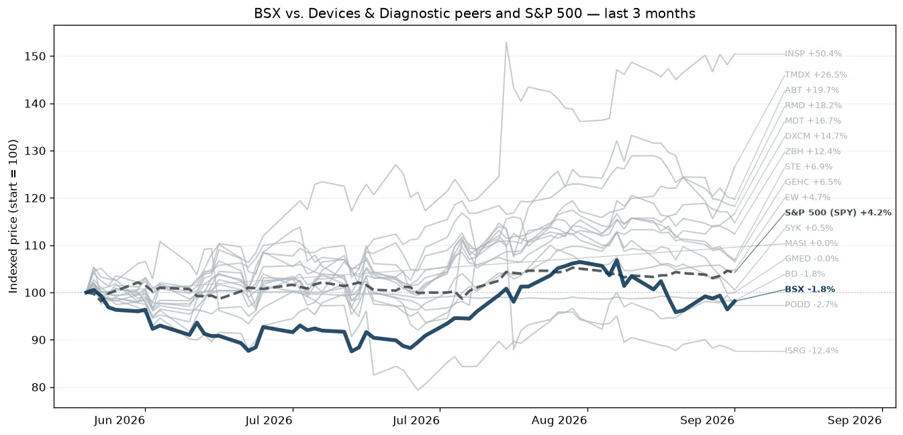

Boston Scientific focuses on less invasive medical devices that are inserted into the human body through small openings or cuts. It manufactures products for use in angioplasty, blood clot filtration, kidney stone management, cardiac rhythm management, catheter-directed ultrasound imaging, upper gastrointestinal tract diagnostics, interventional oncology, neuromodulation for chronic pain, and treatment of incontinence. The firm markets its devices to healthcare professionals and institutions globally. Foreign sales account for roughly 36% of the firm's total sales.

<h3 id="company-syk">Stryker (SYK)</h3>

*Devices & Diagnostic · $128.9B · 3m -0.8% · 12m -22.7% · 24m -15.5%*

[Google Finance](https://www.google.com/finance/quote/SYK:NYSE?tab=earnings&hl=en)

Premier orthopedic and surgical technology company best known for joint replacements, MedSurg equipment, and Mako robotic assisted surgery systems.

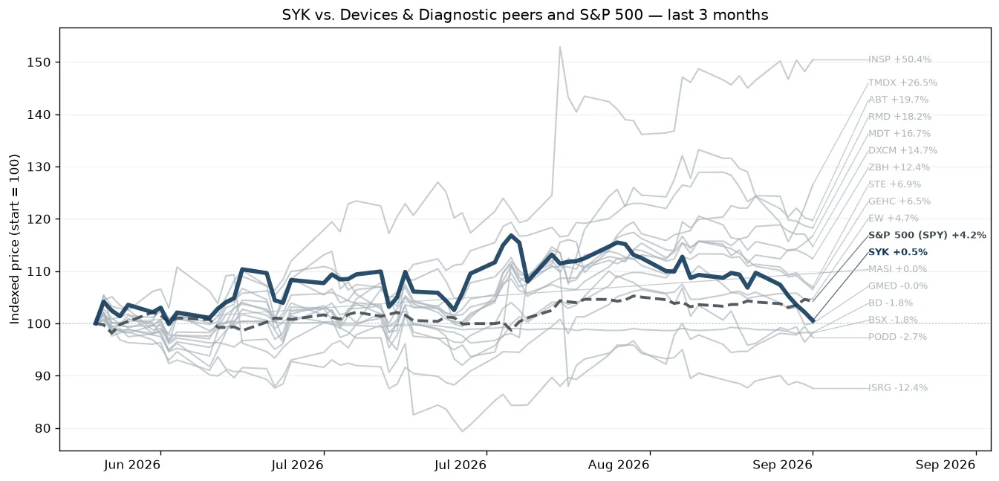

Stryker designs, manufactures, and markets an array of medical equipment, instruments, consumable supplies, and implantable devices. The product portfolio includes hip and knee replacements, extremities, endoscopy systems, operating room equipment, embolic coils, mechanical thrombectomy systems, hospital beds and gurneys, and orthopedic robotics. Stryker remains one of the three largest competitors in reconstructive orthopedic implants and holds the leadership position in operating room equipment. Roughly one-fourth of Stryker's total revenue currently comes from outside the United States.

<h3 id="company-zbh">Zimmer Biomet (ZBH)</h3>

*Devices & Diagnostic · $18.5B · 3m +12.3% · 12m -7.2% · 24m -6.4%*

[Google Finance](https://www.google.com/finance/quote/ZBH:NYSE?tab=earnings&hl=en)

Orthopedic specialist centered on knee, hip, and extremity implants, with robotic surgery offerings for joint reconstruction.

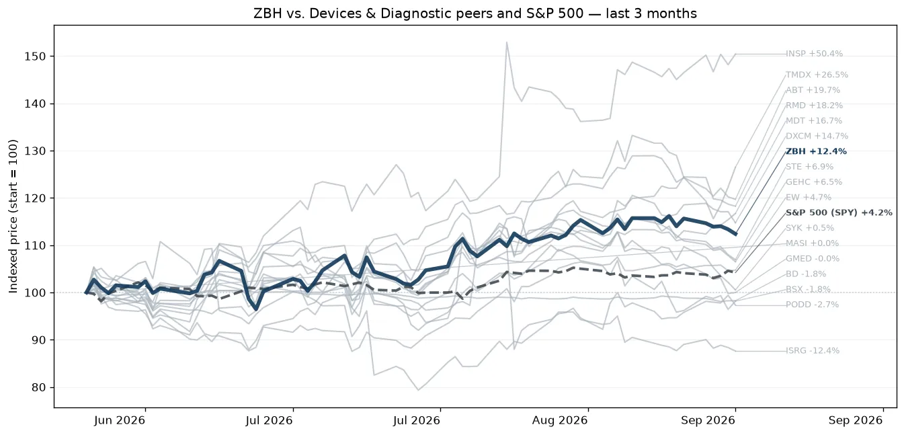

Zimmer Biomet designs, manufactures, and markets orthopedic reconstructive implants as well as supplies and surgical equipment for orthopedic surgery. With the acquisitions of Centerpulse in 2003 and Biomet in 2015, Zimmer holds the leading share of the reconstructive market in the United States, Europe, and Japan. Roughly two-thirds of total revenue is derived from sales of large joints; another fourth comes from extremities, trauma, sports medicine, and related surgical products. The firm spun out its dental and spine businesses in 2022.

<h3 id="company-abt">Abbott (ABT)</h3>

*Devices & Diagnostic · $182.5B · 3m +19.0% · 12m -18.5% · 24m -4.9%*

[Google Finance](https://www.google.com/finance/quote/ABT:NYSE?tab=earnings&hl=en)

Diversified healthcare company spanning diagnostics, medical devices, nutrition products, and established pharmaceuticals.

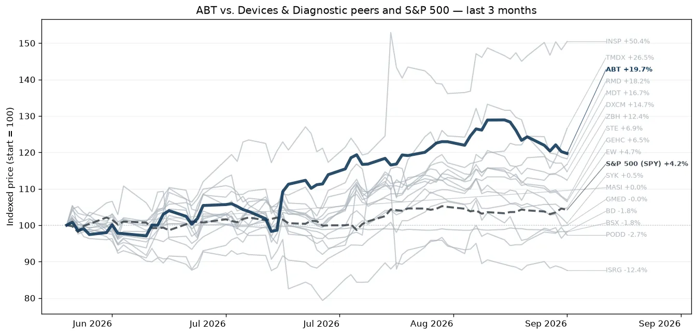

Abbott manufactures and markets cardiovascular and diabetes devices, adult and pediatric nutritional products, diagnostic equipment and testing kits, and branded generic drugs. Products include pacemakers, implantable cardioverter defibrillators, neuromodulation devices, coronary stents, catheters, infant formula, nutritional liquids for adults, continuous glucose monitors, and immunoassays and point-of-care diagnostic equipment. Abbott derives roughly 60% of sales outside the United States.

<h3 id="company-bd">Becton Dickinson (BD)</h3>

*Devices & Diagnostic · n/a · 3m n/a · 12m n/a · 24m n/a*

[Google Finance](https://www.google.com/finance/quote/BD:NYSEARCA?tab=earnings&hl=en)

leading medical product and component company.

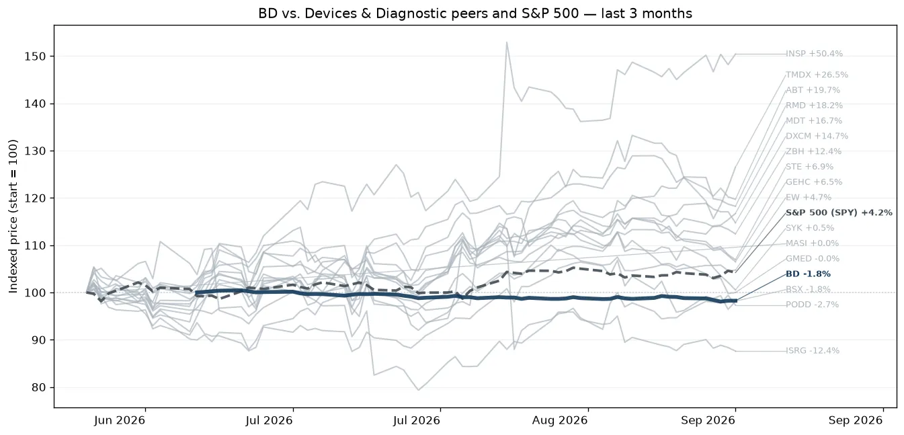

<h3 id="company-ew">Edwards LifeSciences (EW)</h3>

*Devices & Diagnostic · $51.6B · 3m +4.6% · 12m +11.1% · 24m +34.6%*

[Google Finance](https://www.google.com/finance/quote/EW:NYSE?tab=earnings&hl=en)

Cardiovascular company focused on structural heart therapies, particularly transcatheter and surgical heart valve tech.

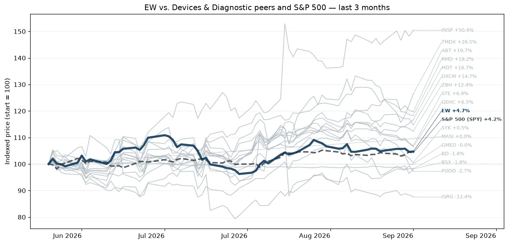

Spun off from Baxter International in 2000, Edwards Lifesciences designs, manufactures, and markets a range of medical devices and equipment for advanced stages of structural heart disease. It has established itself as a leader across key products, including surgical tissue heart valves, transcatheter aortic valves, and transcatheter mitral and tricuspid valve technologies. The firm derives about 60% of its total sales from outside the US.

<h3 id="company-dxcm">Dexcom (DXCM)</h3>

*Devices & Diagnostic · $32.8B · 3m +20.6% · 12m +9.2% · 24m +28.1%*

[Google Finance](https://www.google.com/finance/quote/DXCM:NASDAQ?tab=earnings&hl=en)

Leading independent continuous glucose monitoring company.

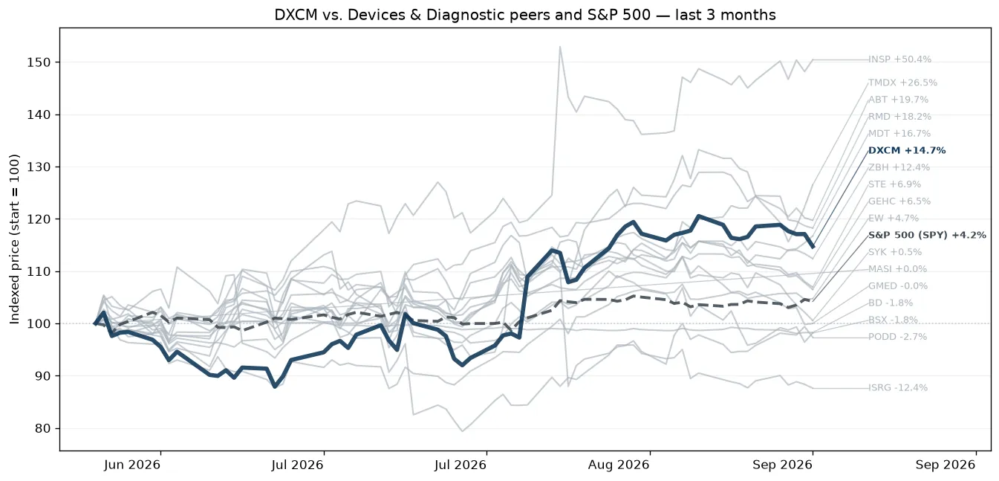

DexCom designs and commercializes continuous glucose monitoring systems for diabetic patients. CGM systems serve as an alternative to the traditional blood glucose meter process, and the company is evolving its CGM systems to provide integration with insulin pumps from Insulet and Tandem for automatic insulin delivery. DexCom's CGMs are available through medical equipment distributors as well as retail pharmacies.

<h3 id="company-rmd">ResMed (RMD)</h3>

*Devices & Diagnostic · $32.4B · 3m +16.5% · 12m -17.6% · 24m -6.7%*

[Google Finance](https://www.google.com/finance/quote/RMD:NYSE?tab=earnings&hl=en)

Sleep and respiratory care known for CPAP devices, masks, and connected software for sleep apnea and respiratory disorders.

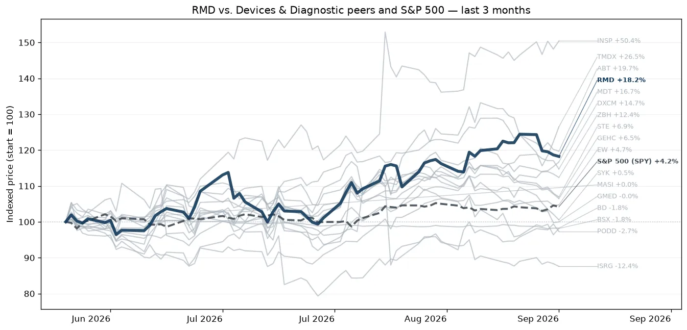

ResMed is one of the largest respiratory care device companies globally, primarily developing and supplying flow generators, masks, and accessories for the treatment of sleep apnea. Increasing diagnosis of sleep apnea combined with aging populations and increasing prevalence of obesity is resulting in a structurally growing market. The company earns roughly two-thirds of its revenue in the Americas and the balance across other regions dominated by Europe, Japan, and Australia. Recent developments and acquisitions have focused on digital health as ResMed is aiming to differentiate itself through the provision of clinical data for use by the patient, medical care advisor, and payer in the out-of-hospital setting.

<h3 id="company-podd">Insulet (PODD)</h3>

*Devices & Diagnostic · $11.6B · 3m -3.7% · 12m -57.7% · 24m -31.3%*

[Google Finance](https://www.google.com/finance/quote/PODD:NASDAQ?tab=earnings&hl=en)

Diabetes technology company whose Omnipod platform pioneered the tubeless wearable insulin pump market.

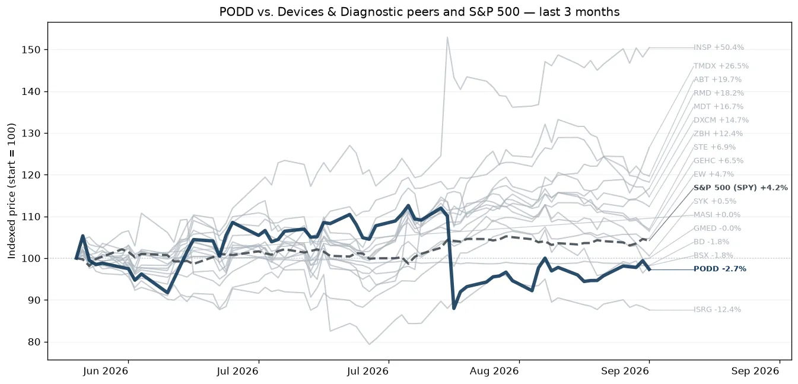

Insulet was founded in 2000 with the goal of making continuous subcutaneous insulin infusion therapy for diabetes easier to use. The result was the Omnipod system, which consists of a small disposable insulin infusion device that can be operated through a smartphone to control dosage. Since the Omnipod was approved by the US Food and Drug Administration in 2005, more than 600,000 insulin-dependent diabetic patients are using it worldwide.

<h3 id="company-gmed">Globus Medical (GMED)</h3>

*Devices & Diagnostic · $11.1B · 3m -2.1% · 12m +29.2% · 24m +11.9%*

[Google Finance](https://www.google.com/finance/quote/GMED:NYSE?tab=earnings&hl=en)

Musculoskeletal device company focused on spine surgery, orthopedic trauma, and robotic navigation techniques.

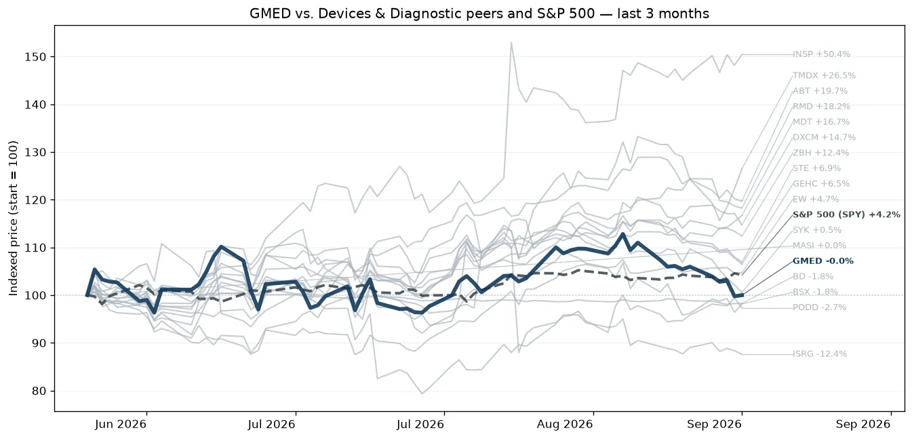

Globus Medical Inc is a medical device company that develops and provides healthcare products and solutions to hospitals, physicians, and surgical centers. The firm's products are organized into two categories: musculoskeletal solutions, which include medical devices and instruments used mostly for spinal and orthopedic procedures, and enabling technologies, which include computer systems developed for enhancing surgical capabilities. The vast majority of the company's revenue is generated from musculoskeletal solutions products, and more than half of the revenue is earned in the United States. It also has its presence internationally.

<h3 id="company-isrg">Intuitive Surgical (ISRG)</h3>

*Devices & Diagnostic · $130.1B · 3m -13.1% · 12m -21.5% · 24m -22.3%*

[Google Finance](https://www.google.com/finance/quote/ISRG:NASDAQ?tab=earnings&hl=en)

Dominant robotic surgery company whose da Vinci systems have come the standard platform for many minimally invasive surgeries.

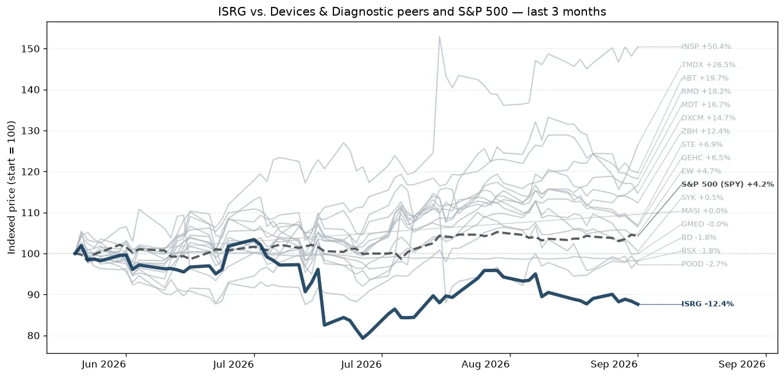

Intuitive develops, produces, and markets a robotic system for assisting minimally invasive surgery. It also provides the instrumentation, disposable accessories, and warranty services for the system. The company has placed more than 10,000 da Vinci systems in hospitals worldwide, with more than 6,000 installations in the US and a growing number in emerging markets.

<h3 id="company-gehc">GE Healthcare (GEHC)</h3>

*Devices & Diagnostic · $31.7B · 3m +6.5% · 12m -9.1% · 24m -19.1%*

[Google Finance](https://www.google.com/finance/quote/GEHC:NASDAQ?tab=earnings&hl=en)

Medical technology & diagnostic company focused on imaging equipment, patient monitoring, ultrasound, and healthcare IT infrastructure.

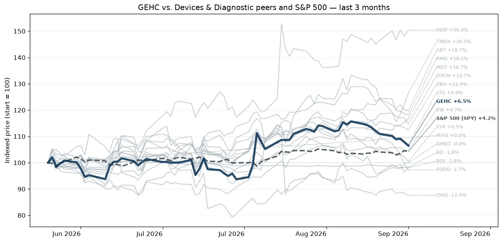

GE HealthCare Technologies is a leading medical technology firm with leading market share in imaging and ultrasound equipment. The company reports four major segments: imaging (45% of revenue), advanced visualization solutions (26%), patient care solutions (15%), and pharmaceutical diagnostics (14%). The company's sales are geographically diverse, with the United States, EMEA, China, and the rest of the world accounting for 46%, 26%, 11%, and 17%, respectively. We estimate approximately half of its revenue is recurring, which consists of servicing (about one-third of revenue), pharmaceutical diagnostics (about 10%-15%), and digital solutions (just over 5%).

<h3 id="company-tmdx">Transmedics (TMDX)</h3>

*Devices & Diagnostic · $2.8B · 3m +29.6% · 12m -13.5% · 24m -35.7%*

[Google Finance](https://www.google.com/finance/quote/TMDX:NASDAQ?tab=earnings&hl=en)

Transplant technology and transportation company whose Organ Care System keeps donor organs functioning outside the body, expanding organ supply.

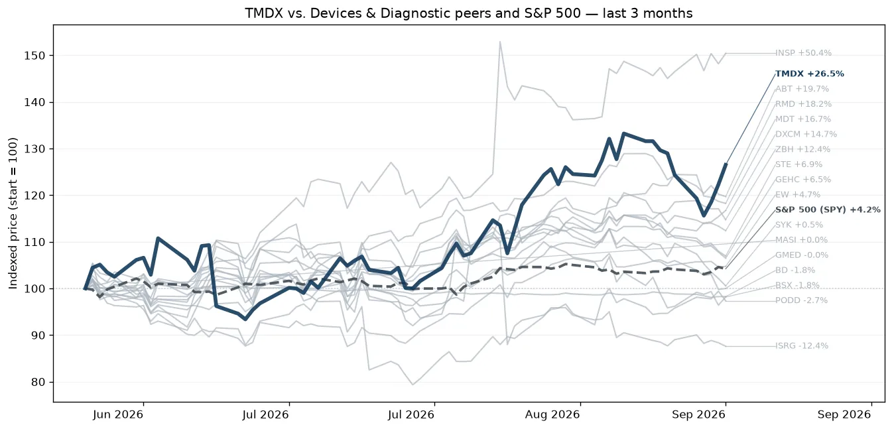

TransMedics Group Inc is a commercial-stage medical technology company transforming organ transplant therapy for end-stage organ failure patients across multiple disease states. It has developed the Organ Care System (OCS) to comprehensively address the limitations of cold storage. The OCS is a portable organ perfusion, optimization, and monitoring system that utilizes technology to replicate near-physiologic conditions for donor organs outside of the human body. The company has developed and is commercializing a proprietary system to preserve and deliver human organs for transplant in a near-physiologic condition to address the limitations of cold storage organ preservation.

<h3 id="company-ste">STERIS (STE)</h3>

*Devices & Diagnostic · $22.7B · 3m +5.8% · 12m -8.4% · 24m -6.4%*

[Google Finance](https://www.google.com/finance/quote/STE:NYSE?tab=earnings&hl=en)

provider of infection prevention, sterilization, and surgical support products and services.

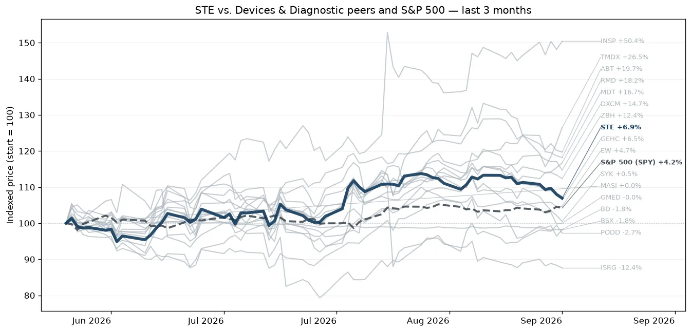

Steris is an Ireland-domiciled medical technology company focused on sterilization services and infection prevention. The company is the global leader in contract sterilization services, ensuring the safe delivery of single-use and implantable medical equipment to hospitals around the world. Steris also sells sterilizers, washer-disinfectors, and other decontamination equipment and supplies for use by care provider facilities and in biopharma manufacturing sites. Domiciled in the United States before its inversion to Ireland, the firm derives approximately 70% of its revenue from Healthcare Services, 20% from Applied Sterilization Technologies, or AST, and 10% from life sciences services after the divestment of its dental products business.

<h3 id="company-masi">Masimo (MASI)</h3>

*Devices & Diagnostic · n/a · 3m +0.6% · 12m +22.3% · 24m +61.3%*

[Google Finance](https://www.google.com/finance/quote/MASI:NYSE?tab=earnings&hl=en)

provider of patient-monitoring and pulse-oximetry technologies.

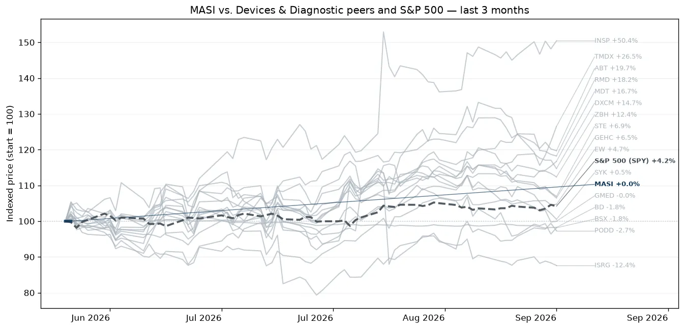

<h3 id="company-insp">Inspire Medical Systems (INSP)</h3>

*Devices & Diagnostic · $1.9B · 3m +53.1% · 12m -27.0% · 24m -68.0%*

[Google Finance](https://www.google.com/finance/quote/INSP:NYSE?tab=earnings&hl=en)

developer of implantable neurostimulation devices for obstructive sleep apnea.

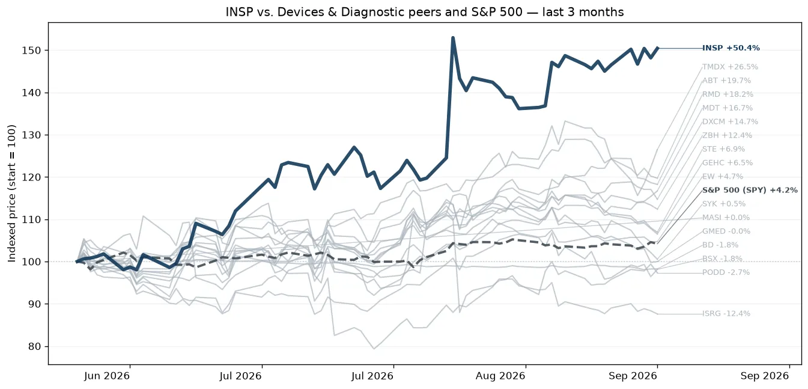

Inspire Medical Systems Inc operates as a medical technology company. It focuses on the development and commercialization of minimally invasive solutions for patients with obstructive sleep apnea (OSA). It offers Inspire system, a neurostimulation technology that provides a safe and effective treatment for moderate to severe obstructive sleep apnea. The firm has operating footprints in the United States and All other countries wherein, it generates a majority of its revenue from the United States. Its segment revenues are derived from the sales of its product, the Inspire system, to hospitals and ambulatory surgery centers in the U.S. and in selected countries in Europe and the Asia Pacific region.

<h3 id="company-lly">Eli Lilly (LLY)</h3>

*Big Pharma · $1.0T · 3m +1.6% · 12m +58.1% · 24m +27.3%*

[Google Finance](https://www.google.com/finance/quote/LLY:NYSE?tab=earnings&hl=en)

Obesity and diabetes powerhouse with GLP-1 franchise (Zepbound/Mounjaro) fueling growth.

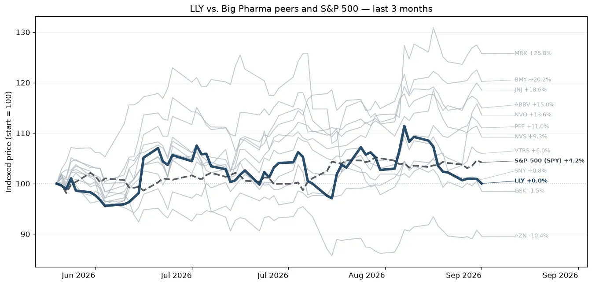

Eli Lilly is a drug firm with a focus on neuroscience, cardiometabolic, cancer, and immunology. Lilly's key products include Verzenio and Jaypirca for cancer; Mounjaro, Zepbound, Foundayo, Jardiance, Trulicity, Humalog, and Humulin for cardiometabolic; and Taltz and Olumiant for immunology.

<h3 id="company-nvo">Novo Nordisk (NVO)</h3>

*Big Pharma · $195.8B · 3m +8.5% · 12m -15.6% · 24m -64.5%*

[Google Finance](https://www.google.com/finance/quote/NVO:NYSE?tab=earnings&hl=en)

Primary GLP-1 competitor to Lilly.

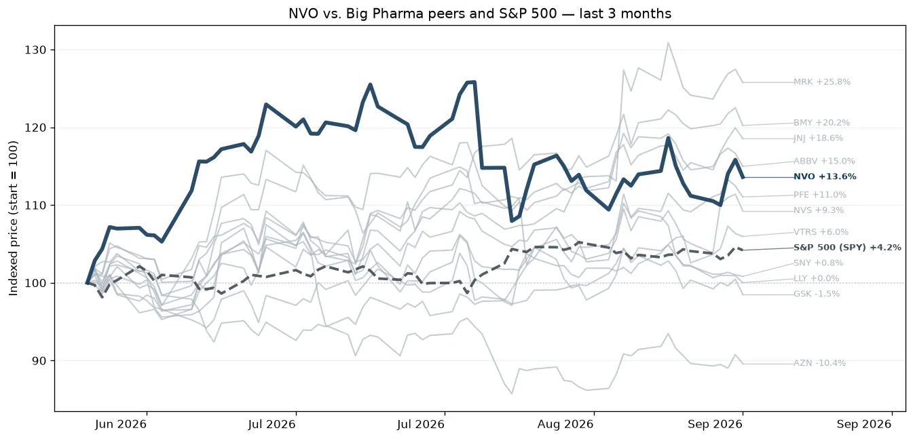

With roughly one-third of the global branded diabetes treatment market, Novo Nordisk is the leading provider of diabetes care products in the world. Based in Denmark, the company manufactures and markets a variety of human and modern insulins, injectable diabetes treatments such as GLP-1 therapy, oral antidiabetic agents, and obesity treatments. Novo also has a biopharmaceutical segment (contributing less than 10% of revenue) that specializes in protein therapies for hemophilia and other disorders.

<h3 id="company-abbv">AbbVie (ABBV)</h3>

*Big Pharma · $430.8B · 3m +12.9% · 12m +20.7% · 24m +32.6%*

[Google Finance](https://www.google.com/finance/quote/ABBV:NYSE?tab=earnings&hl=en)

Immunology and aesthetics leader built around drugs like Skyrizi, Rinvoq, and Botox.

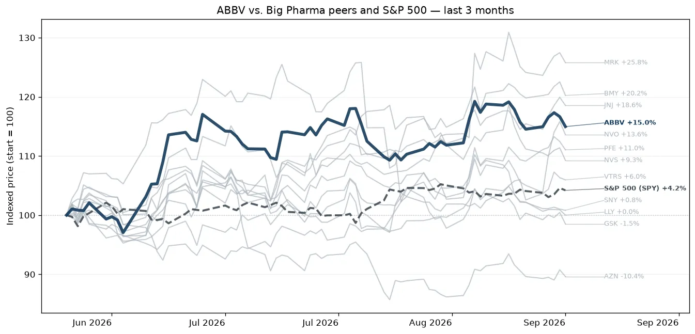

AbbVie is a pharmaceutical firm with a strong exposure to immunology (with Humira, Skyrizi, and Rinvoq) and oncology (with Imbruvica and Venclexta). The company was spun off from Abbott in early 2013. The 2020 acquisition of Allergan added several new products and drugs in aesthetics, including Botox. The 2024 acquisitions of Cerevel (neuroscience) and ImmunoGen (oncology) help supplement AbbVie's portfolio.

<h3 id="company-jnj">Johnson &amp; Johnson (JNJ)</h3>

*Big Pharma · $614.4B · 3m +18.2% · 12m +54.3% · 24m +67.4%*

[Google Finance](https://www.google.com/finance/quote/JNJ:NYSE?tab=earnings&hl=en)

Diversified healthcare giant, combining pharmaceuticals with medical devices.

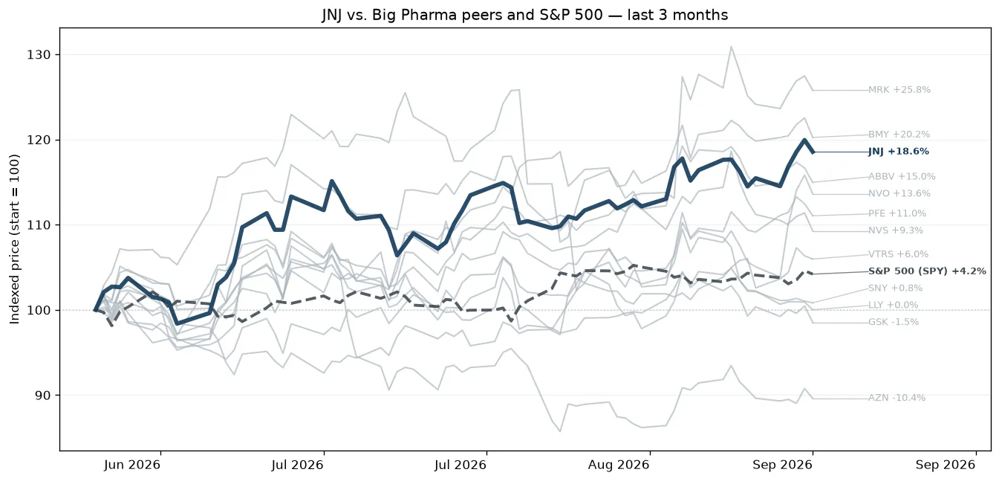

Johnson & Johnson is the world's largest and most diverse healthcare firm. It has two divisions: innovative medicine and medtech. These now represent all of the company's sales following the divestment of the consumer business, Kenvue, in 2023. After restructurings in 2023-24, the drug division focuses on three main therapeutic areas: immunology, oncology, and neurology. Geographically, just over half of total revenue is generated in the United States.

<h3 id="company-pfe">Pfizer (PFE)</h3>

*Big Pharma · $144.8B · 3m +9.3% · 12m +14.3% · 24m -0.4%*

[Google Finance](https://www.google.com/finance/quote/PFE:NYSE?tab=earnings&hl=en)

Global pharma company known for vaccines and oncology.

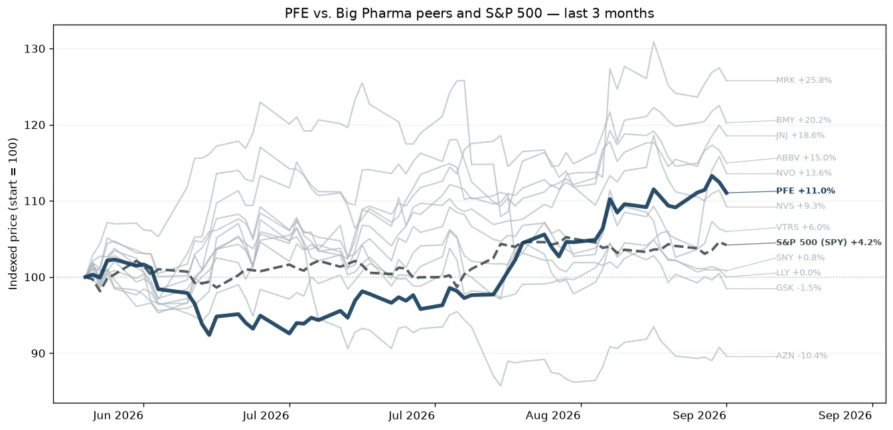

Pfizer is one of the world's largest pharmaceutical firms, with annual sales of roughly $60 billion. While it historically sold many types of healthcare products and chemicals, now prescription drugs and vaccines account for the majority of sales. Top sellers include pneumococcal vaccine Prevnar 13 and cardiology drugs Vyndaqel and Eliquis. Pfizer sells these products globally, with international sales representing 40% of total sales. Within international sales, emerging markets are a major contributor.

<h3 id="company-mrk">Merck (MRK)</h3>

*Big Pharma · $316.1B · 3m +24.5% · 12m +77.5% · 24m +27.6%*

[Google Finance](https://www.google.com/finance/quote/MRK:NYSE?tab=earnings&hl=en)

Pharma leader driven by Keytruda, one of the world's most important cancer drugs.

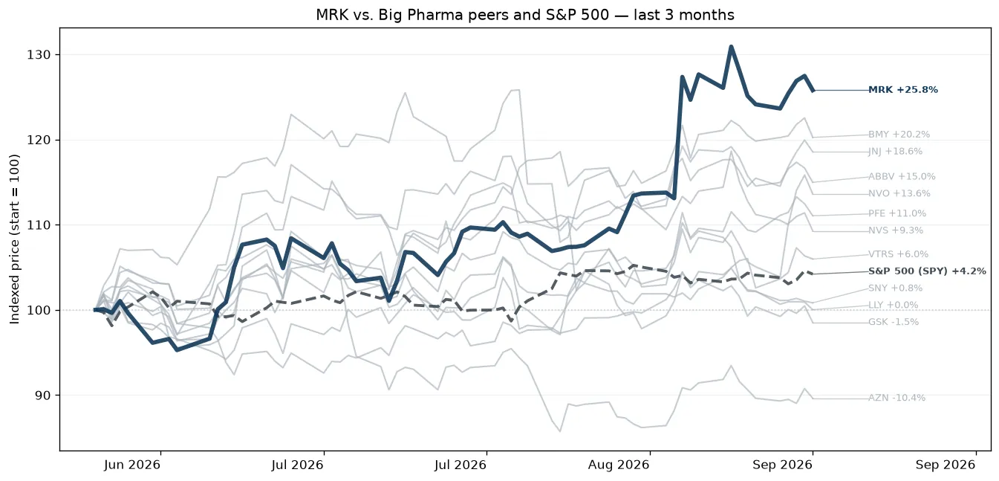

Merck makes pharmaceutical products to treat several conditions in a number of therapeutic areas, including cardiometabolic disease, cancer, and infections. Within cancer, the firm's immuno-oncology platform, led by Keytruda, is a major contributor to overall sales. The company also has a substantial vaccine business aimed at preventing pediatric diseases, as well as Gardasil for human papillomavirus. Additionally, Merck sells animal health-related drugs. From a geographical perspective, 47% of the company's sales are generated from US human health (pharmaceuticals and vaccines).

<h3 id="company-bmy">Bristol Myers Squibb (BMY)</h3>

*Big Pharma · $134.6B · 3m +16.7% · 12m +41.7% · 24m +37.2%*

[Google Finance](https://www.google.com/finance/quote/BMY:NYSE?tab=earnings&hl=en)

Oncology and immunology specialist with a porfolio centered on cancer and cardiovascular medicines.

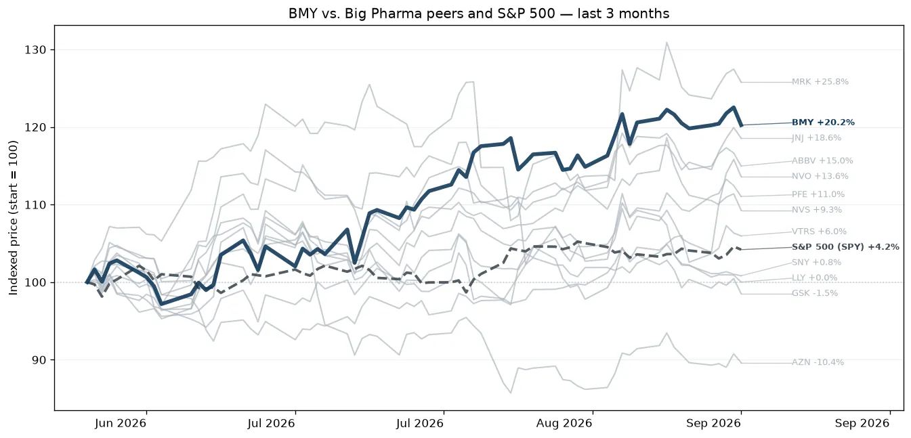

Bristol Myers Squibb discovers, develops, and markets drugs for various therapeutic areas, such as cardiovascular, cancer, and immune disorders. A key focus for Bristol is immuno-oncology, where the firm is a leader in drug development. Bristol derives close to 70% of total sales from the US, showing a higher dependence on the US market than most of its peer group.

<h3 id="company-vtrs">Viatris (VTRS)</h3>

*Big Pharma · $20.6B · 3m +6.3% · 12m +60.8% · 24m +49.8%*

[Google Finance](https://www.google.com/finance/quote/VTRS:NASDAQ?tab=earnings&hl=en)

Global generic and off-patent medicine company focused on scale manufacturing and cash generation, rather than breakthrough innovation.

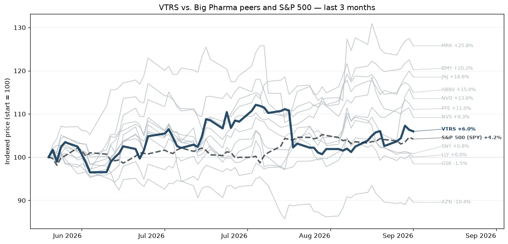

Viatris was formed in November 2020 through the combination of Upjohn, a wholly owned subsidiary of Pfizer that specialized in off-patent drugs, and Mylan, a global pharmaceutical manufacturer that focused on generic and specialty drugs. By joining forces, Viatris became one of the largest generic drug manufacturers in the world, servicing over 165 countries. Generics (commoditized and complex) and biosimilars make up roughly 40% of Viatris' total sales. The remaining 60% of sales are derived from its portfolio of legacy products, which includes Lipitor, Norvasc, Lyrica, and Viagra. While it covers more than 10 major therapeutic areas, Viatris has identified dermatology, ophthalmology, and gastroenterology as its three key areas of focus for future innovations.

<h3 id="company-azn">AstraZeneca (AZN)</h3>

*Big Pharma · $241.3B · 3m -12.5% · 12m -0.4% · 24m -2.0%*

[Google Finance](https://www.google.com/finance/quote/AZN:NYSE?tab=earnings&hl=en)

global pharmaceutical company with leading oncology, cardiovascular, and rare disease franchises.

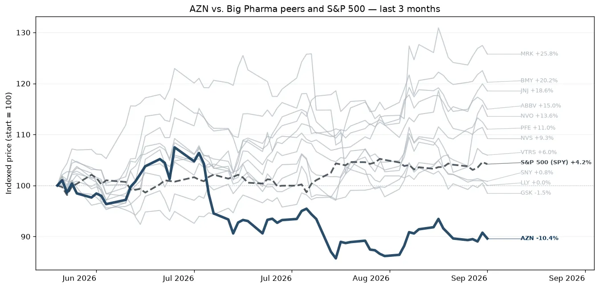

A merger between Astra of Sweden and Zeneca of the United Kingdom formed AstraZeneca in 1999. The firm sells branded drugs across a number of major therapeutic areas, including oncology (over 40% of total revenue), cardiovascular, renal, and metabolic (over 20%), rare disease (16%), and respiratory and immunology (15%). The majority of sales comes from international markets, with the United States representing close to one-third of its sales.

<h3 id="company-nvs">Novartis (NVS)</h3>

*Big Pharma · $291.3B · 3m +7.3% · 12m +23.3% · 24m +37.2%*

[Google Finance](https://www.google.com/finance/quote/NVS:NYSE?tab=earnings&hl=en)

innovative pharmaceutical company focused on cardiovascular, immunology, neuroscience, and oncology therapies.

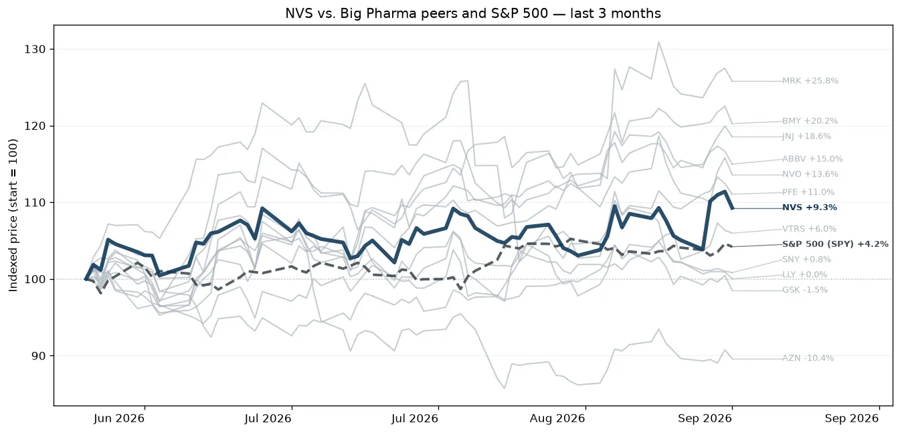

Novartis develops and manufactures innovative drugs. Key areas of drug development are oncology, immunology, neuroscience, respiratory, and cardiovascular, renal, and metabolic. It also has an established medicines business, which includes off-patent franchises. The company sells its products globally, with the United States constituting close to one-third of total revenue.

<h3 id="company-sny">Sanofi (SNY)</h3>

*Big Pharma · $103.6B · 3m -1.7% · 12m -4.9% · 24m -23.4%*

[Google Finance](https://www.google.com/finance/quote/SNY:NASDAQ?tab=earnings&hl=en)

diversified pharmaceutical company with strengths in vaccines, immunology, and rare diseases.

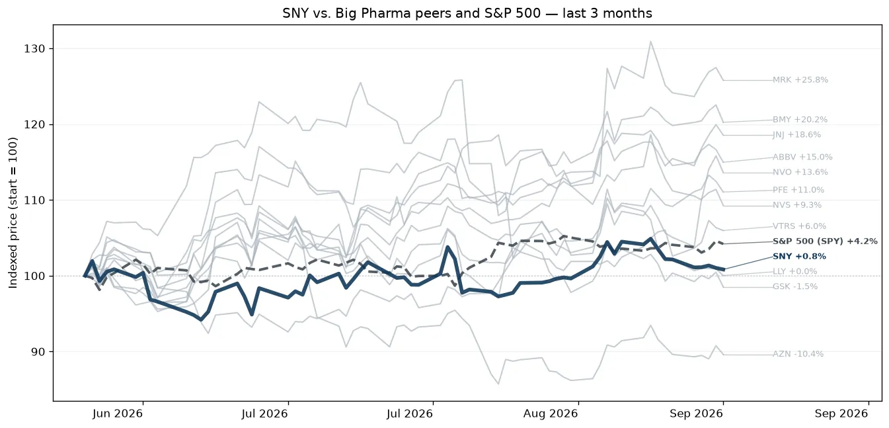

Sanofi develops and markets drugs with a concentration in immunology, vaccines, and rare diseases. Although the company offers a diverse array of drugs, its highest-revenue product, Dupixent, accounts for over 30% of total sales. Profits for this immunology blockbuster drug are shared with Regeneron. About 45% of total revenue comes from the United States, 20% from Europe, and 6% from China.

<h3 id="company-gsk">GSK (GSK)</h3>

*Big Pharma · $103.2B · 3m -3.2% · 12m +23.2% · 24m +14.2%*

[Google Finance](https://www.google.com/finance/quote/GSK:NYSE?tab=earnings&hl=en)

pharmaceutical and vaccine company focused on infectious disease, respiratory, oncology, and specialty medicines.

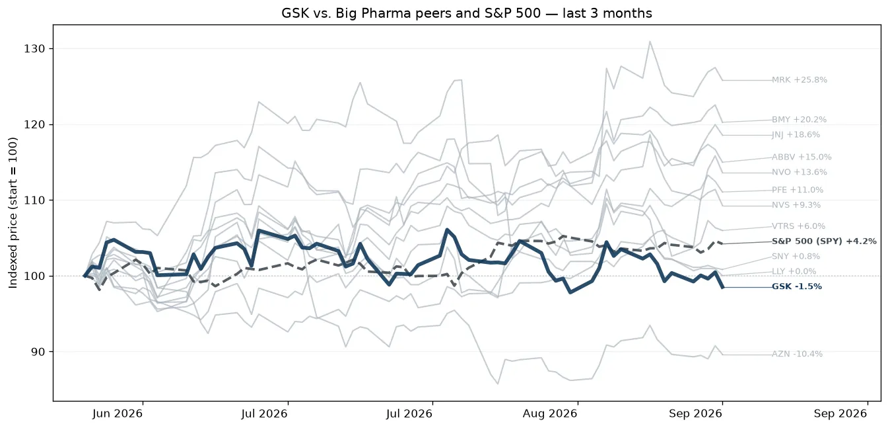

In the pharmaceutical industry, GSK ranks as one of the largest firms by total sales. The company wields its might across several therapeutic classes, including respiratory, antiviral, and vaccines, and has been growing its presence in oncology and immunology, as well. GSK uses joint ventures to gain additional scale in certain markets like HIV.

<h3 id="company-vrtx">Vertex (VRTX)</h3>

*Established Biotech · $121.3B · 3m +22.2% · 12m +37.9% · 24m +16.7%*

[Google Finance](https://www.google.com/finance/quote/VRTX:NASDAQ?tab=earnings&hl=en)

Dominant cystic fibrosis company expanding into gene editing, pain, and other specialty diseases.

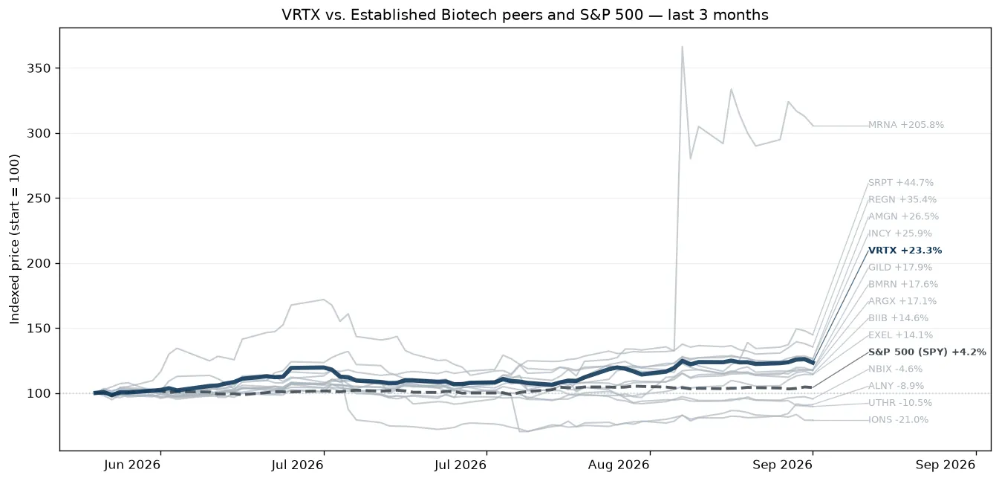

Vertex Pharmaceuticals is a global biotechnology company that discovers and develops small-molecule drugs for the treatment of serious diseases. Its key drugs are Kalydeco, Orkambi, Symdeko, and Trikafta/Kaftrio, and Alyftrek for cystic fibrosis, where Vertex therapies remain the standard of care globally. Vertex has diversified its portfolio through Casgevy, a gene-editing therapy for beta thalassemia and sickle-cell disease, and Journavx, a non-opioid pain medication approved for the treatment of moderate-to-severe acute pain in adults. Additionally, Vertex is evaluating small-molecule inhibitors of APOL1-mediated kidney diseases. Vertex is also investigating cell therapies to deliver a potential functional cure for type 1 diabetes.

<h3 id="company-regn">Regeneron (REGN)</h3>

*Established Biotech · $78.3B · 3m +30.3% · 12m +44.4% · 24m -26.8%*

[Google Finance](https://www.google.com/finance/quote/REGN:NASDAQ?tab=earnings&hl=en)

Antibody-engineering company known for Eylea and a deep immunology and oncology pipeline.

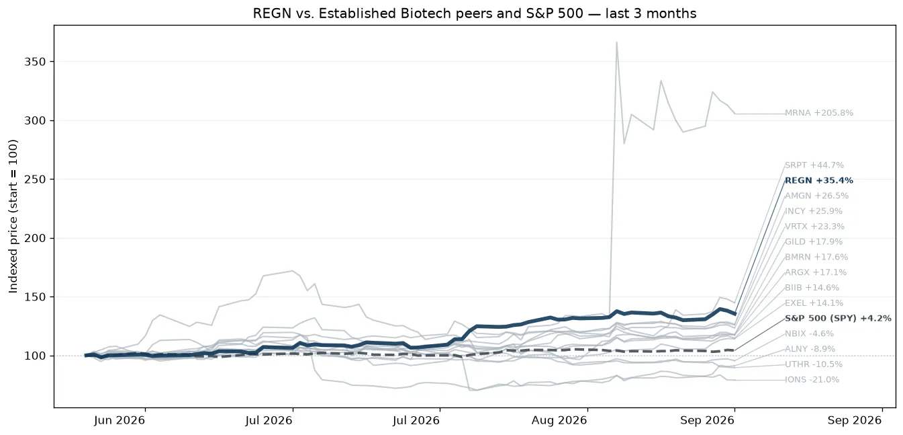

Regeneron Pharmaceuticals discovers, develops, and commercializes products that fight eye disease, cardiovascular disease, cancer, and inflammation. The company has several marketed products, including low-dose Eylea and Eylea HD, approved for wet age-related macular degeneration and other eye diseases; Dupixent in immunology; Praluent for LDL cholesterol lowering; Libtayo in oncology; Kevzara in rheumatoid arthritis; and Lynozyfic for multiple myeloma. Regeneron has multiple partnerships and collaboration agreements, with Sanofi (Dupixent, others) and Bayer (Eylea) as its largest partners.

<h3 id="company-amgn">Amgen (AMGN)</h3>

*Established Biotech · $210.5B · 3m +25.1% · 12m +54.1% · 24m +36.4%*

[Google Finance](https://www.google.com/finance/quote/AMGN:NASDAQ?tab=earnings&hl=en)

Biotech giant with major franchises in inflammation, bone health, oncology, and cardiovascular disease.

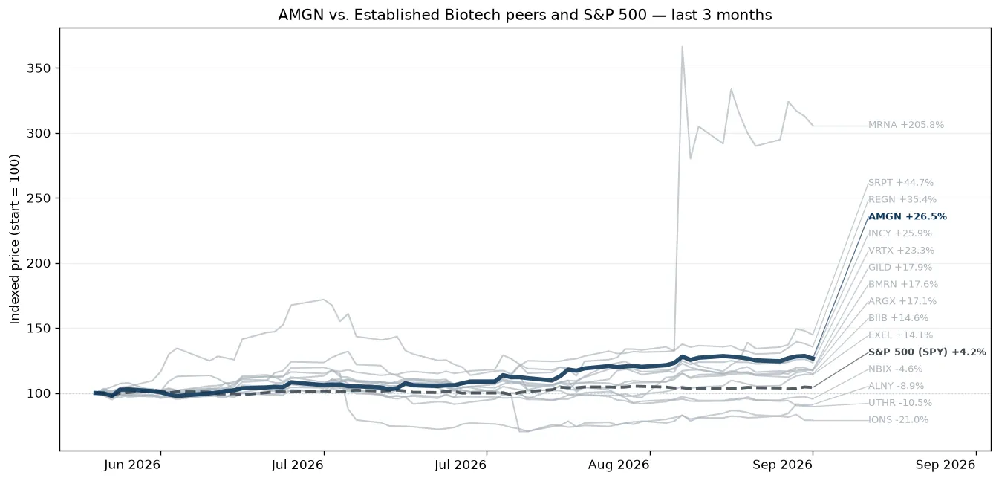

Amgen is a leader in biotechnology-based human therapeutics. Flagship drugs include red blood cell boosters Epogen and Aranesp, immune system boosters Neupogen and Neulasta, and Enbrel and Otezla for inflammatory diseases. Amgen introduced its first cancer therapeutic, Vectibix, in 2006 and markets bone-strengthening drugs Prolia/Xgeva (approved 2010) and Evenity (2019). The acquisition of Onyx Pharmaceuticals bolstered the firm's therapeutic oncology portfolio with Kyprolis. Recent launches include Repatha (cholesterol-lowering), Aimovig (migraine), Lumakras (lung cancer), and Tezspire (asthma). The 2023 Horizon acquisition brought several rare-disease drugs, including thyroid eye disease drug Tepezza. Amgen also has a growing biosimilar portfolio.

<h3 id="company-gild">Gilead (GILD)</h3>

*Established Biotech · $167.9B · 3m +16.9% · 12m +31.2% · 24m +91.8%*

[Google Finance](https://www.google.com/finance/quote/GILD:NASDAQ?tab=earnings&hl=en)

Lead in HIV therapies that has expanded into oncology and liver disease.

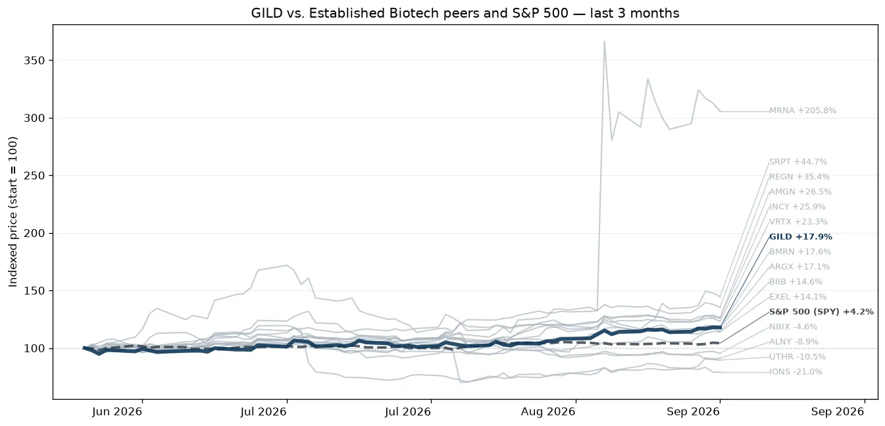

Gilead Sciences develops and markets therapies to treat and prevent life-threatening infectious diseases, with the core of its portfolio focused on HIV and hepatitis B and C. Gilead's acquisition of Pharmasset brought rights to hepatitis C drug Sovaldi, which is also part of newer combination regimens that remain standards of care. Gilead is also growing its presence in the oncology market via acquisitions, led by CAR-T cell therapy Yescarta/Tecartus (from Kite) and breast and bladder cancer therapy Trodelvy (from Immunomedics).

<h3 id="company-biib">Biogen (BIIB)</h3>

*Established Biotech · $30.8B · 3m +13.0% · 12m +57.0% · 24m +10.0%*

[Google Finance](https://www.google.com/finance/quote/BIIB:NASDAQ?tab=earnings&hl=en)

Neurology-focused biotech best known for multiple sclerosis and Alzheimer's disease therapies.

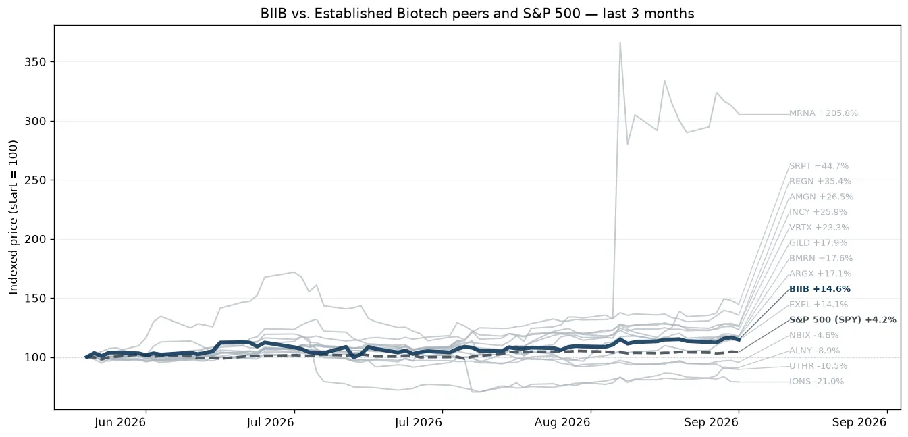

Biogen is an established biopharmaceutical company focused on treatments for neurodegenerative and rare diseases. Its declining multiple sclerosis franchise is its largest revenue generator and contributed 40% of total revenue in 2025. Biogen also generates significant revenue from its CD20 collaboration agreements with Roche (19% of total in 2025), which includes oncology drugs Rituxan and Gazyva and multiple sclerosis drug Ocrevus. Biogen's newer franchises include Spinraza (spinal muscular atrophy, with partner Ionis), Leqembi (Alzheimer's disease, collabroation revenue from its partner Eisai), Skyclarys (Friedreich's ataxia, Reata), Zurzuvae (postpartum depression, Sage), and Qalsody (amyotrophic lateral sclerosis, Ionis).

<h3 id="company-alny">Alnylam (ALNY)</h3>

*Established Biotech · $29.3B · 3m -12.2% · 12m -41.1% · 24m +7.8%*

[Google Finance](https://www.google.com/finance/quote/ALNY:NASDAQ?tab=earnings&hl=en)

Leader in RNA interference therapeutics, commercializing gene-silencing medicines for rare diseases.

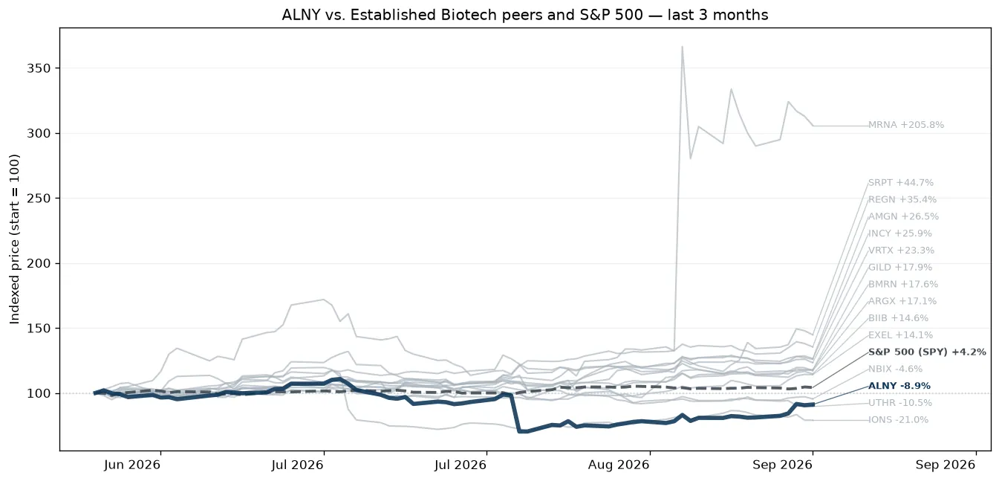

Alnylam Pharmaceuticals is a leader in the study of RNA interference (RNAi) therapeutics. RNAi is a naturally occurring biological pathway within cells for sequence-specific silencing and regulation of gene expression. Alnylam's commercial RNAi therapeutic products include Onpattro and Amvuttra (for hATTR amyloidosis), Givlaari (for acute hepatic porphyria), and Oxlumo (for primary hyperoxaluria type 1), all developed and commercialized by Alnylam. Plus, Leqvio (for hypercholesterolemia) and Qfitlia (for hemophilia A or B), which are being commercialized by Alnylam's partners, Novartis and Sanofi, respectively. It also has several clinical programs across various therapeutic areas, including cardio-metabolic diseases, neuroscience, and hematology.

<h3 id="company-srpt">Sarepta (SRPT)</h3>

*Established Biotech · $1.7B · 3m +42.9% · 12m +20.3% · 24m -82.5%*

[Google Finance](https://www.google.com/finance/quote/SRPT:NASDAQ?tab=earnings&hl=en)

Rare disease biotech centered on Duchenne muscular dystrophy and gene therapies.

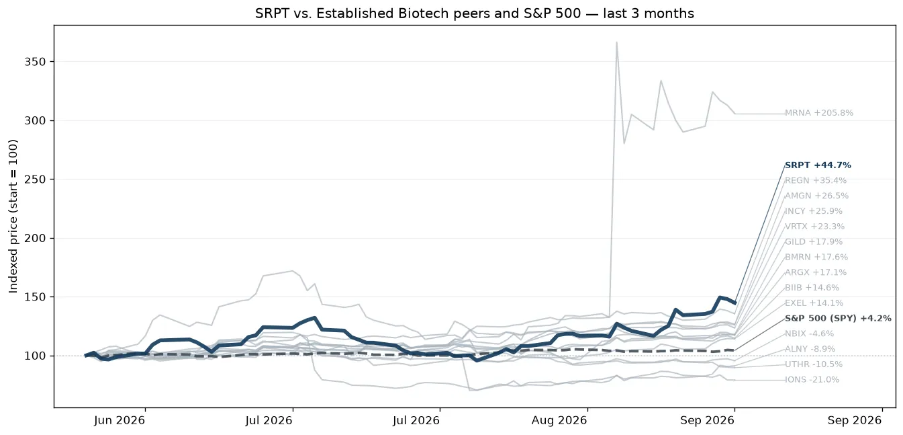

Sarepta Therapeutics Inc is a commercial-stage biopharmaceutical company focused on the discovery and development of RNA-targeted therapies, gene therapies, and other genetic medicines for rare diseases, particularly neuromuscular disorders. The company has developed approved treatments for Duchenne muscular dystrophy, including EXONDYS 51, VYONDYS 53, AMONDYS 45, and ELEVIDYS, and is advancing additional therapeutic candidates for neuromuscular and other rare diseases. The company operates in one segment: discovering, developing, manufacturing, and delivering therapies to patients with rare diseases.

<h3 id="company-mrna">Moderna (MRNA)</h3>

*Established Biotech · $22.8B · 3m +206.8% · 12m +479.0% · 24m +99.7%*

[Google Finance](https://www.google.com/finance/quote/MRNA:NASDAQ?tab=earnings&hl=en)

Leading MRNA platform company seeking to expand beyond COVID vaccines into cancer, respiratory, and rare-disease therapies.

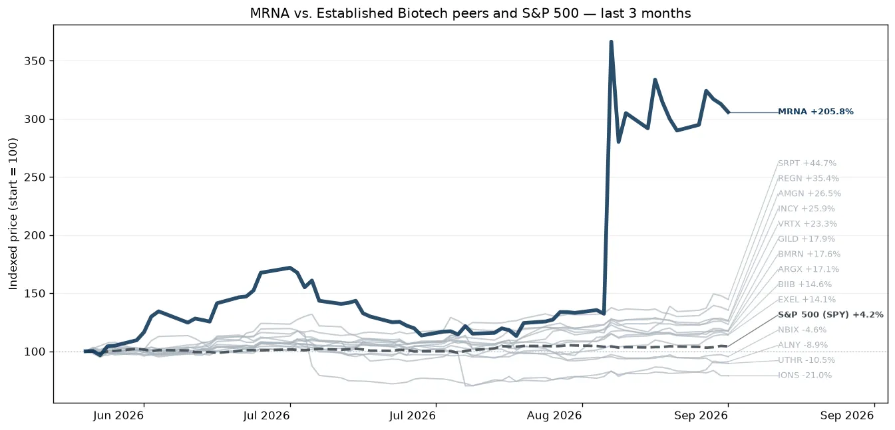

Moderna is a commercial-stage biotech that was founded in 2010 and had its initial public offering in 2018. The firm's mRNA technology was rapidly validated with its covid vaccine, which was authorized in the United States in December 2020. Moderna had 25 mRNA development candidates in clinical studies as of March 2026. Programs span a wide range of therapeutic areas, including infectious disease, oncology, cardiovascular disease, and rare genetic diseases.

<h3 id="company-exel">Exelixis (EXEL)</h3>

*Established Biotech · $14.1B · 3m +12.0% · 12m +55.8% · 24m +134.6%*

[Google Finance](https://www.google.com/finance/quote/EXEL:NASDAQ?tab=earnings&hl=en)

Oncology-focused biotech generating substantial cashflow from cabometyx while advancing a next-generation cancer pipeline.

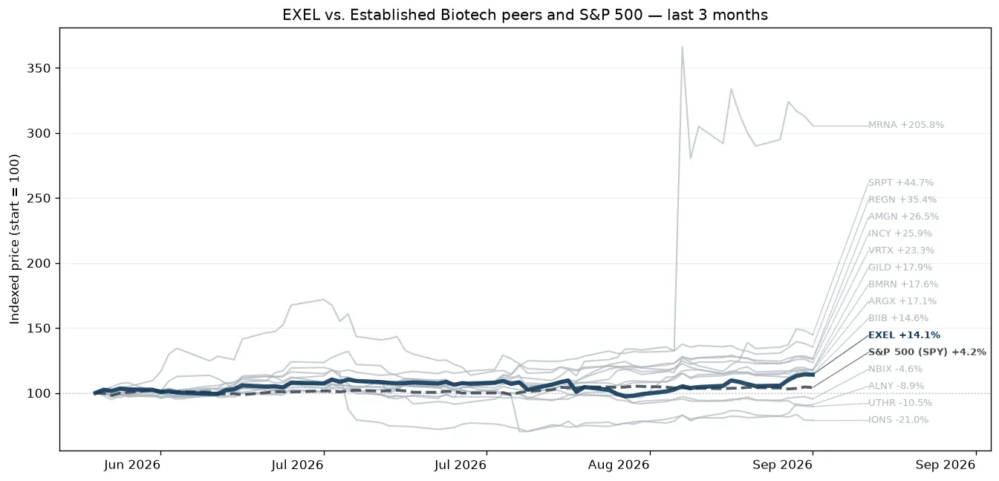

Exelixis Inc is a biopharmaceutical firm that discovers, develops, and commercializes treatments for cancer. Its molecule, cabozantinib, is indicated for the treatment of patients with metastatic medullary thyroid cancer under the name Cometriq and for the treatment of kidney and liver cancer under the name Cabometyx. Exelixis and its partner Roche have also brought Cotellic to market for the treatment of melanoma.

<h3 id="company-argx">Argenx (ARGX)</h3>

*Established Biotech · $52.8B · 3m +15.9% · 12m +37.6% · 24m +90.6%*

[Google Finance](https://www.google.com/finance/quote/ARGX:NASDAQ?tab=earnings&hl=en)

Immunology-focused biotech with flagship drug Vyvgart for rare autoimmune diseases, expanding into additional indications.

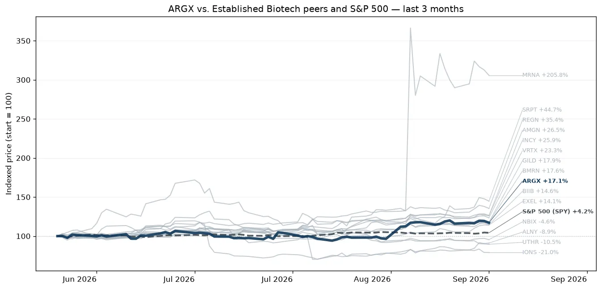

Argenx is a Dutch biopharmaceutical company focused on developing antibody-based therapies for rare autoimmune diseases. The company's lead product, Vyvgart (efgartigimod), was approved by the FDA in December 2021 for the treatment of generalized myasthenia gravis (gMG). In 2022, Argenx also received FDA approval for Vyvgart Hytrulo, a subcutaneous formulation of Vyvgart, offering a more convenient option compared with Vyvgart's intravenous administration. In 2024, the FDA approved Vyvgart Hytrulo for Chronic Inflammatory Demyelinating Polyneuropathy, a rare immune-mediated neuromuscular disorder of the peripheral nervous system. Argenx is focused on innovation and developing its pipeline for treatments such as primary immune thrombocytopenia, thyroid eye disease, and Sjogren's Disease.

<h3 id="company-nbix">Neurocrine Biosciences (NBIX)</h3>

*Established Biotech · $16.9B · 3m -5.0% · 12m +8.0% · 24m +29.5%*

[Google Finance](https://www.google.com/finance/quote/NBIX:NASDAQ?tab=earnings&hl=en)

Commercial stage neuroscience company best known for Ingrezza, and a growing pipeline in neurology and psychiatry.

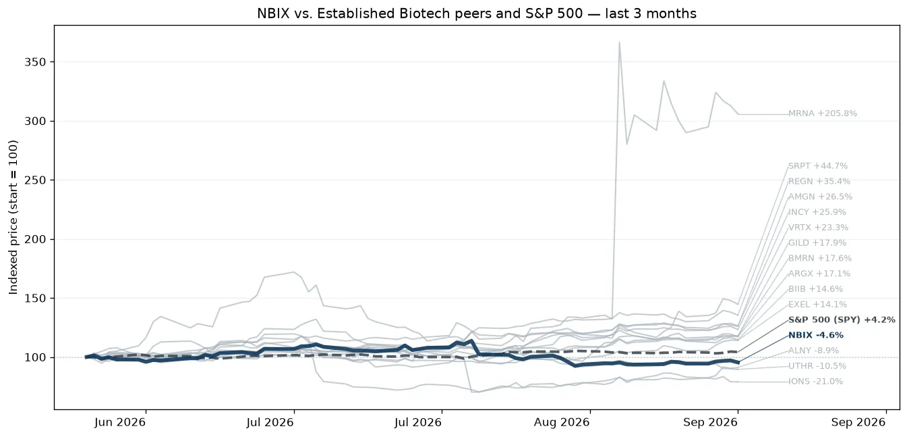

Neurocrine Biosciences Inc is a biopharmaceutical firm focused on the research, development, and commercialization of treatments for neurological, psychiatric, endocrine, and immunological disorders. Its portfolio includes therapies for conditions such as tardive dyskinesia, chorea associated with Huntington's disease, classic congenital adrenal hyperplasia due to 21-hydroxylase deficiency, and treatments for endometriosis and uterine fibroids. The company also maintains a pipeline of drug candidates in various stages of clinical and preclinical development across its therapeutic areas, including small molecules, peptides, proteins, antibodies, conjugates, and gene therapies. It derives revenue from the sale of its pharmaceutical products.

<h3 id="company-uthr">United Therapeutics (UTHR)</h3>

*Established Biotech · $22.0B · 3m -11.3% · 12m +21.7% · 24m +41.1%*

[Google Finance](https://www.google.com/finance/quote/UTHR:NASDAQ?tab=earnings&hl=en)

A rare-disease biotech focused on pulmonary arterial hypertension while investing heavily in organ transplantation and xenotransplantation tech.

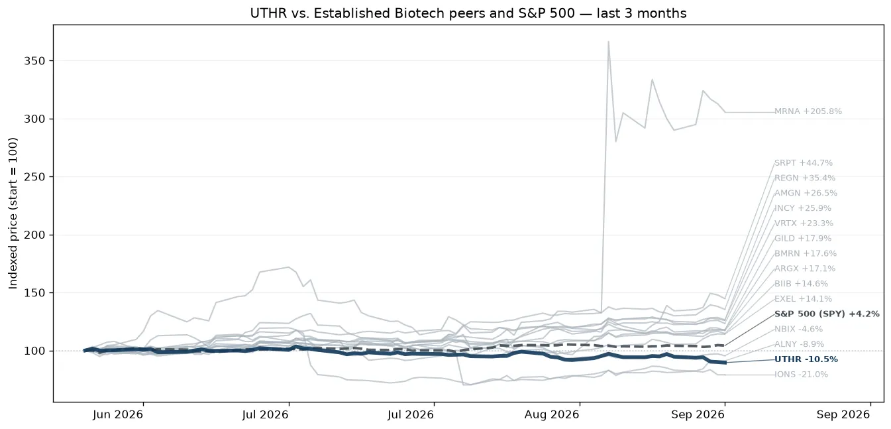

United Therapeutics Corp specializes in drug development for pulmonary arterial hypertension (PAH), a rare and progressive disease marked by abnormally high blood pressure in the arteries of the lungs. The company's therapies for PAH largely focus on the prostacyclin pathway, and many of its treatments are based on the same molecule, treprostinil. The company markets and sells the following commercial therapies in the United States to treat PAH: Tyvaso DPI (treprostinil) Inhalation Powder, Remodulin Injection, Orenitram (treprostinil) Extended-Release Tablets, Adcirca (tadalafil) Tablets, and Unituxin. It derives maximum revenue from the sale of Tyvaso DPI. Geographically, the company operates in United States and Rest of the World, of which United States generates majority of the revenue.

<h3 id="company-incy">Incyte (INCY)</h3>

*Established Biotech · $24.4B · 3m +23.8% · 12m +46.3% · 24m +106.9%*

[Google Finance](https://www.google.com/finance/quote/INCY:NASDAQ?tab=earnings&hl=en)

oncology and immunology biotechnology company led by Jakafi.

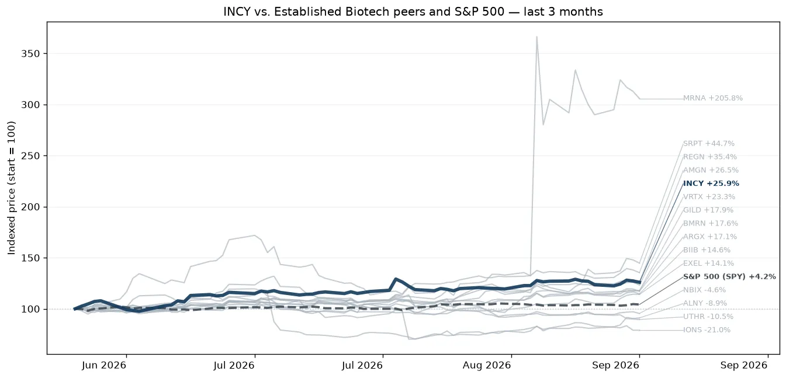

Incyte focuses on the discovery and development of small-molecule drugs. The firm's leading drug, Jakafi, treats two types of rare blood cancer and graft versus host disease and is partnered with Novartis. Incyte's other marketed drugs include rheumatoid arthritis treatment Olumiant (licensed to Lilly), and oncology drugs Iclusig (chronic myeloid leukemia), Pemazyre (cholangiocarcinoma), Tabrecta (lung cancer), and Monjuvi (diffuse large B-cell lymphoma). The firm's first dermatology product, Opzelura, was approved in 2021 for atopic dermatitis and 2022 for vitiligo. Incyte's pipeline includes an array of oncology and dermatology programs.

<h3 id="company-bmrn">BioMarin Pharmaceutical (BMRN)</h3>

*Established Biotech · $11.7B · 3m +17.2% · 12m +15.2% · 24m -20.9%*

[Google Finance](https://www.google.com/finance/quote/BMRN:NASDAQ?tab=earnings&hl=en)

rare-disease biotechnology company specializing in genetic disorders.

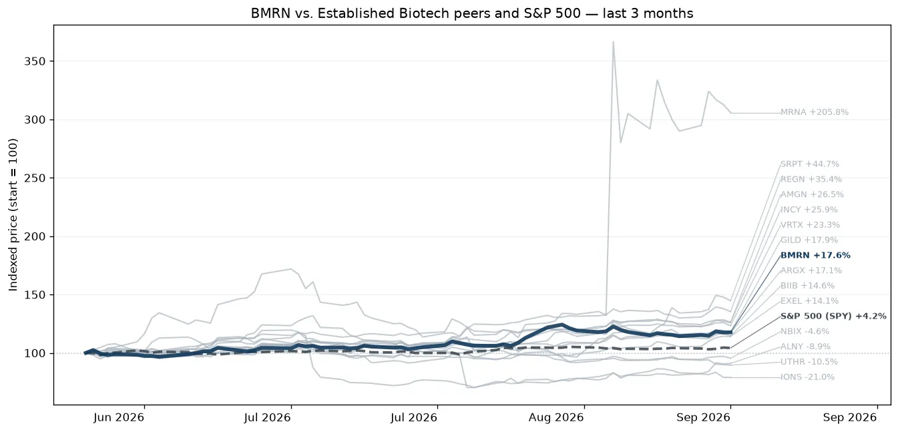

BioMarin is a global biotechnology company focused on developing and commercializing therapies for rare genetic diseases. BioMarin specializes in enzyme replacement therapies, gene therapies, and other advanced treatments designed to address complex genetic disorders. The company has eight approved therapies for conditions including achondroplasia, phenylketonuria, hemophilia, and mucopolysaccharidosis. BioMarin has an expanding, yet relatively early-stage, pipeline of treatments in development across skeletal conditions and enzyme therapies.

<h3 id="company-ions">Ionis Pharmaceuticals (IONS)</h3>

*Established Biotech · $9.2B · 3m -22.0% · 12m -5.1% · 24m +23.9%*

[Google Finance](https://www.google.com/finance/quote/IONS:NASDAQ?tab=earnings&hl=en)

antisense therapeutics pioneer focused on neurological and rare diseases.

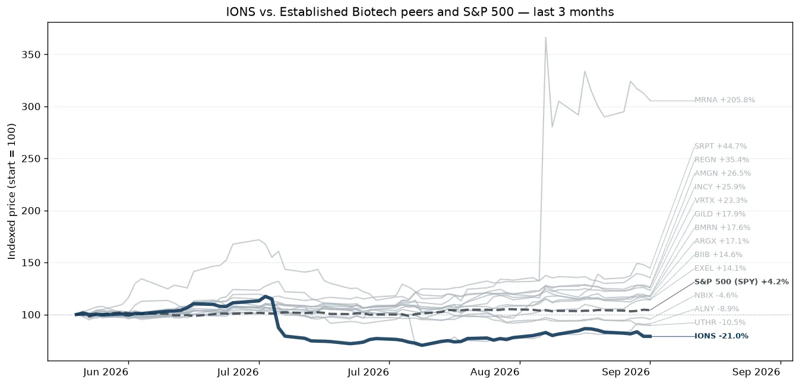

Ionis Pharmaceuticals is the leading developer of antisense technology to discover and develop novel drugs. Its broad clinical and preclinical pipeline targets a wide variety of diseases, with an emphasis on cardiovascular, metabolic, neurological, and rare diseases. Ionis and Biogen brought Spinraza to market in 2016 as a treatment for spinal muscular atrophy, and Biogen launched ALS drug Qalsody in 2023. Ionis brought two additional drugs to market via its cardiovascular-focused subsidiary Akcea, including ATTR amyloidosis drug Tegsedi (2018) and cardiology drug Waylivra (Europe, 2019). Ionis and AstraZeneca launched polyneuropathy drug Wainua in 2024. Ionis marked its first two independent launches in 2025 for Tryngolza (for FCS) and Dawnzera (for HAE).

<h3 id="company-adma">ADMA Biologics (ADMA)</h3>

*Emerging Biotech · $2.1B · 3m +20.7% · 12m -43.0% · 24m -40.8%*

[Google Finance](https://www.google.com/finance/quote/ADMA:NASDAQ?tab=earnings&hl=en)

Plasma-derived immunology company that develops and manufactures specialty immune globulin products.

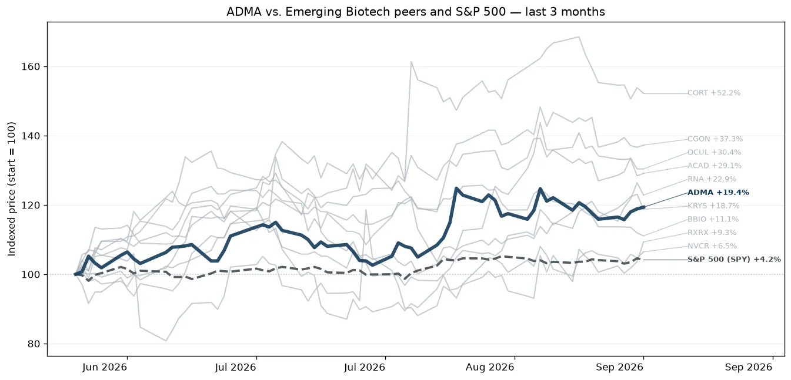

ADMA Biologics Inc is an end-to-end commercial biopharmaceutical company dedicated to manufacturing, marketing, and developing specialty plasma-derived biologics for the treatment of immunodeficient patients at risk for infection and others at risk for certain infectious diseases. The segments of the company are ADMA BioManufacturing, which generates maximum revenue, Plasma Collection Centres, and the corporate segment. The company sells plasma-derived intermediate fractions to certain customers, which are generated as part of its FDA-approved manufacturing process for IG and IVIG products. It also provides laboratory contracting services to certain customers and anticipates providing contract filling, labeling & packing services. The company derives maximum revenue from the United States.

<h3 id="company-ocul">Ocular therapeutix (OCUL)</h3>

*Emerging Biotech · $1.9B · 3m +29.0% · 12m -21.8% · 24m +26.8%*

[Google Finance](https://www.google.com/finance/quote/OCUL:NASDAQ?tab=earnings&hl=en)

Ophthalmology biotech developing long-acting eye therapies, particularly for retinal diseases.

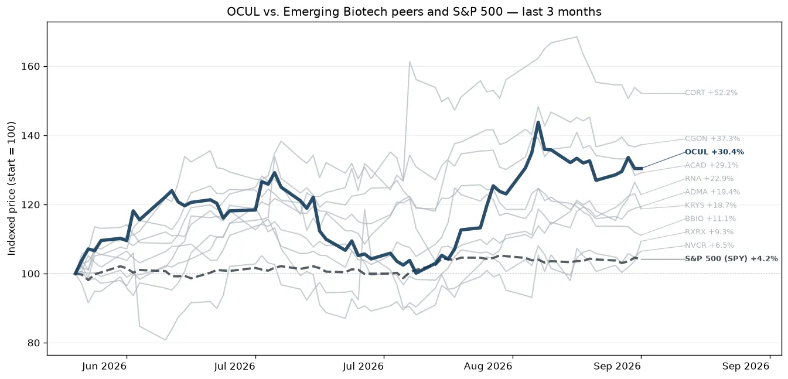

Ocular Therapeutix Inc is a biotechnology company that specializes in therapies for diseases and conditions of the eye. The company uses its proprietary hydrogel platform technology to deliver therapeutic agents to the eye. Its pipeline consists of eye medication that aims to overcome the limitations of current eye-drop-based therapies for ophthalmic diseases and conditions. Its pipeline product includes Dextenza, OTX-TIC, OTX-TKI, and OTX-IVT.

<h3 id="company-nvcr">Novocure (NVCR)</h3>

*Emerging Biotech · $1.9B · 3m +4.5% · 12m +46.1% · 24m +6.3%*

[Google Finance](https://www.google.com/finance/quote/NVCR:NASDAQ?tab=earnings&hl=en)

Medical technolgoy company using tumor-treating electric fields rather than drugs to treat cancer.

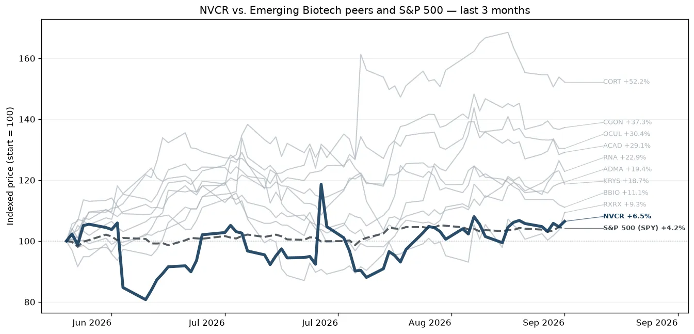

NovoCure Ltd is an oncology company with a proprietary platform technology in the United States. Its business involves the development, manufacture, and commercialization of Tumor Treating Fields (TTFields) devices, including Optune Gio and Optune Lua, for the treatment of solid tumor cancers. Its pipeline consists of Trident, Lunar-2, Panova-3, Metis, and other products and technologies for the treatment of Glioblastoma, Non-small cell lung cancer, and Pancreatic cancer. Geographically, the company derives the majority of its revenue from the United States and the rest from Germany, Japan, and other markets.

<h3 id="company-cort">Corcept Therapeutics (CORT)</h3>

*Emerging Biotech · $11.9B · 3m +53.7% · 12m +60.9% · 24m +224.7%*

[Google Finance](https://www.google.com/finance/quote/CORT:NASDAQ?tab=earnings&hl=en)

Specialty biotech targeting cortisol biology, primarily for endocrine and oncology indications.

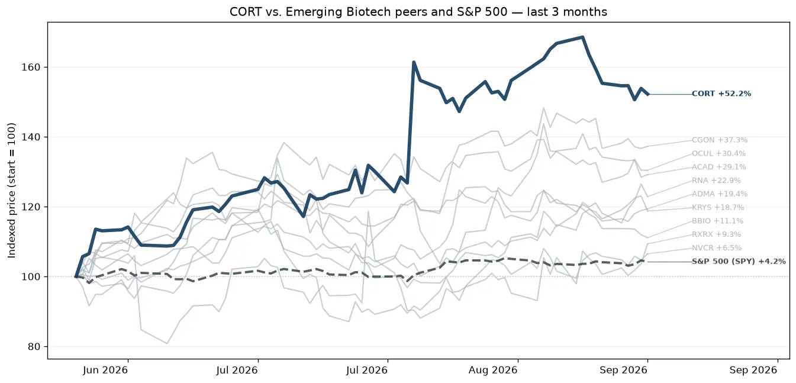

Corcept Therapeutics Inc is a commercial-stage pharmaceutical company engaged in the discovery and development of medications that treat severe metabolic, oncologic, and neuropsychiatric disorders by modulating the effect of the cortisol hormone. The company markets Korlym (mifepristone) tablets and its authorized generic version, which is an oral medication for the treatment of hypercortisolism (also known as Cushing's syndrome). Additionally, its pipeline contains several key compounds, such as Relacorilant, Dazucorilant, Miricorilant, etc., that are being evaluated in clinical trials as potential treatments for a variety of serious disorders like hypercortisolism, solid tumors (including ovarian, endometrial, cervical, pancreatic, and prostate cancers), ALS, and MASH.

<h3 id="company-acad">Acadia Pharmaceuticals (ACAD)</h3>

*Emerging Biotech · $4.6B · 3m +30.0% · 12m +10.9% · 24m +74.4%*

[Google Finance](https://www.google.com/finance/quote/ACAD:NASDAQ?tab=earnings&hl=en)

neuroscience-focused biotech with commercial products for neurological and rare diseases.

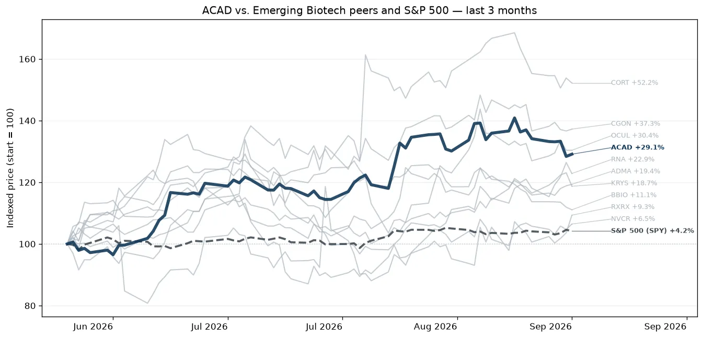

Acadia Pharmaceuticals Inc is a biopharmaceutical company focused on turning scientific promise to makes a difference for underserved neurological and rare disease communities around the world. It has two core franchises in neurological and rare diseases. Its neurological disease is anchored by the commercial product NUPLAZID (pimavanserin), which is the first and only drug approved by the U.S. (FDA) for the treatment of hallucinations and delusions associated with Parkinson's disease psychosis (PDP). Its rare disease is anchored by the commercial product DAYBUE, which is the first and only drug approved for the treatment of Rett syndrome. Its clinical-stage development efforts are focused on Alzheimer's disease psychosis, Lewy Body Dementia psychosis, and multiple other programs.

<h3 id="company-krys">Krystal Biotech (KRYS)</h3>

*Emerging Biotech · $9.6B · 3m +19.0% · 12m +138.4% · 24m +94.5%*

[Google Finance](https://www.google.com/finance/quote/KRYS:NASDAQ?tab=earnings&hl=en)

commercial-stage gene therapy company focused on dermatological and rare diseases.

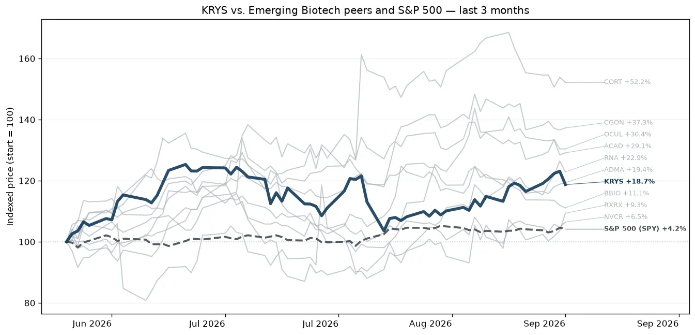

Krystal Biotech Inc is an integrated, commercial-stage biotechnology company focused on the discovery, development, manufacturing, and commercialization of genetic medicines to treat diseases with high unmet medical needs. The company uses its patented HSV-1-based gene therapy platform to create vectors that deliver therapeutic transgenes to target cells. It possesses exclusive rights to develop, manufacture, and commercialize VYJUVEK internationally. The company operates as one operating segment focused on pharmaceutical products and manufactures, markets, and sells VYJUVEK in the United States and markets and sells VYJUVEK in the European Union, and Japan.

<h3 id="company-rna">Avidity Biosciences (RNA)</h3>

*Emerging Biotech · $197.4M · 3m +20.3% · 12m -71.8% · 24m -64.9%*

[Google Finance](https://www.google.com/finance/quote/RNA:NASDAQ?tab=earnings&hl=en)

developer of RNA-targeted therapeutics for rare neuromuscular diseases.

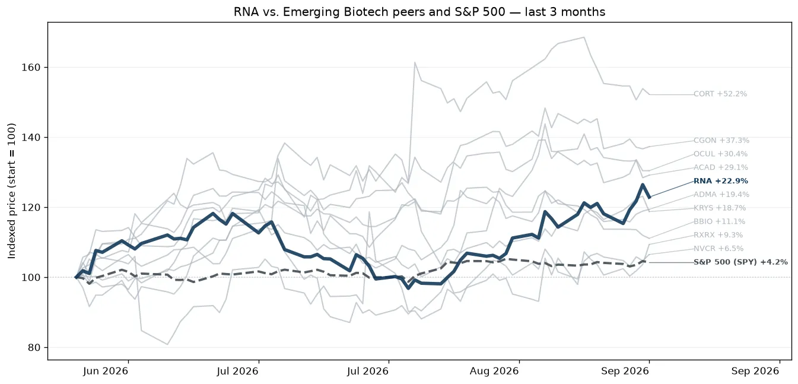

Atrium Therapeutics Inc is a biopharmaceutical firm focused on developing RNA-based therapeutics for cardiac conditions, including cardiomyopathies. Its platform technology is designed to enable targeted delivery of RNA therapeutics to heart tissue by combining ligand-based targeting approaches with oligonucleotide-based therapies. The company's development pipeline includes programs targeting genetically associated forms of cardiomyopathy, specifically involving the PRKAG2 and PLN genes.

<h3 id="company-rxrx">Recursion Pharmaceuticals (RXRX)</h3>

*Emerging Biotech · $1.8B · 3m +9.5% · 12m -21.3% · 24m -38.7%*

[Google Finance](https://www.google.com/finance/quote/RXRX:NASDAQ?tab=earnings&hl=en)

AI-enabled drug discovery company combining machine learning and large-scale biological data.

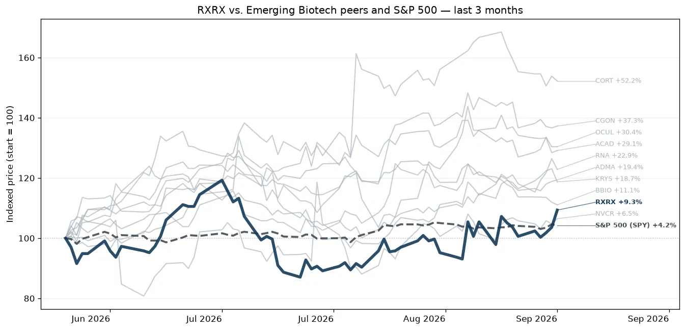

Recursion Pharmaceuticals Inc is a clinical-stage biotechnology company. The company is decoding biology by integrating technological innovations across biology, chemistry, automation, data science, and engineering, with the goal of radically improving the lives of patients and industrializing drug discovery. Geographically, the company operates in United States, United Kingdom, and Others. It derives maximum revenue from United States.

<h3 id="company-cgon">CG Oncology (CGON)</h3>

*Emerging Biotech · $6.3B · 3m +39.0% · 12m +125.8% · 24m +96.2%*

[Google Finance](https://www.google.com/finance/quote/CGON:NASDAQ?tab=earnings&hl=en)

bladder cancer-focused oncology biotech developing immunotherapies.

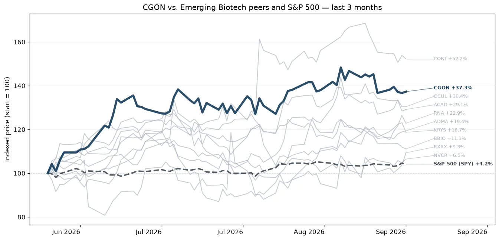

CG Oncology Inc is a late-stage clinical biopharmaceutical company focused on developing and commercializing its product candidate, cretostimogene grenadenorepvec, for patients with bladder cancer. The company's candidate, cretostimogene grenadenorepvec, is a targeted oncolytic intravesically delivered immunotherapy agent that is in two phase three trials (one high-risk BCG unresponsive NMIBC trial and one intermediate-risk NMIBC trial) and a phase two clinical study with a checkpoint inhibitor for high-risk BCG unresponsive NMIBC disease.

<h3 id="company-bbio">BridgeBio Pharma (BBIO)</h3>

*Emerging Biotech · $16.1B · 3m +10.7% · 12m +40.2% · 24m +143.8%*

[Google Finance](https://www.google.com/finance/quote/BBIO:NASDAQ?tab=earnings&hl=en)

commercial-stage rare disease biotechnology company focused on genetically defined diseases.

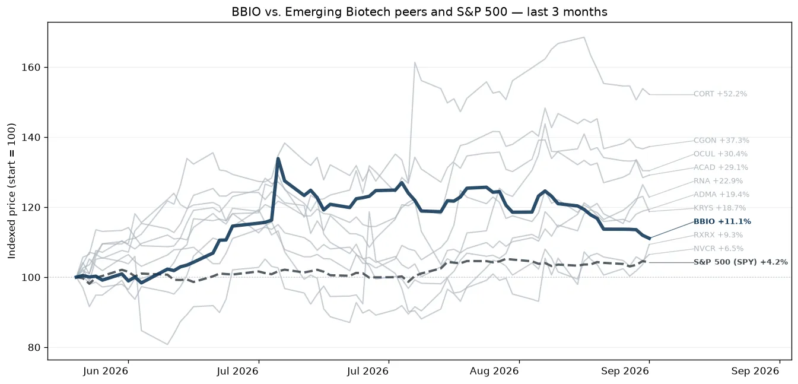

BridgeBio Pharma is a biotechnology company focused on discovering, developing, testing, and delivering transformative treatments for patients with genetic diseases. The company has four programs in its late-stage pipeline focusing on Mendelian disorders, oncology, and gene therapy. One of its key programs, Attruby (acoramidis), is an orally administered small molecule designed to stabilize tetrameric transthyretin for the treatment of transthyretin amyloid cardiomyopathy.

